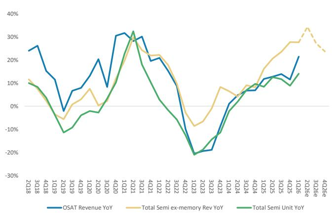
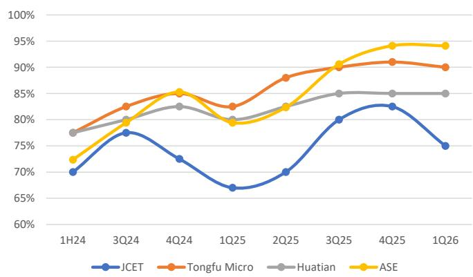
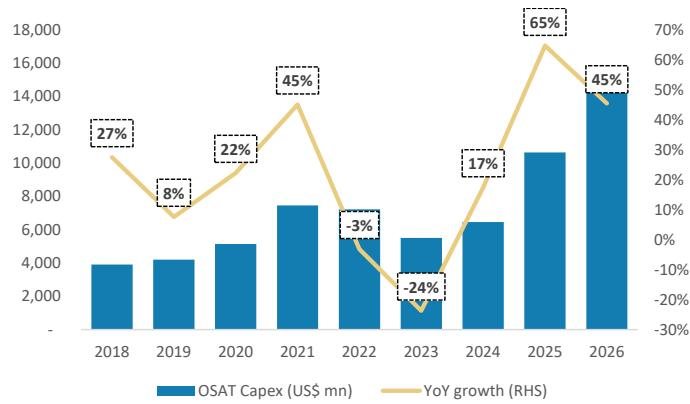
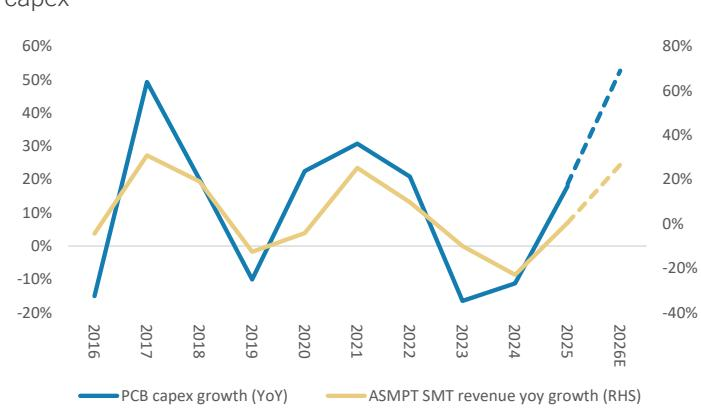
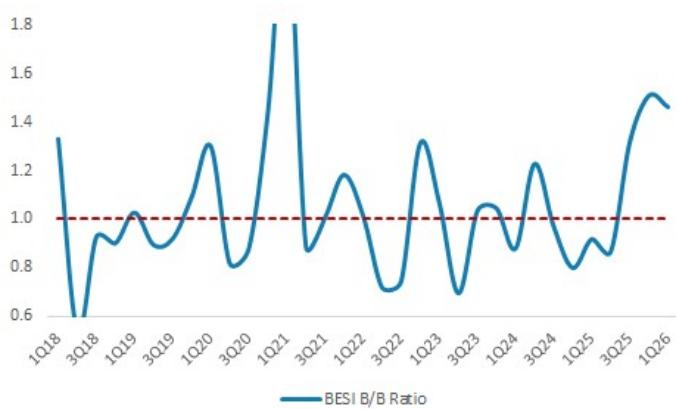
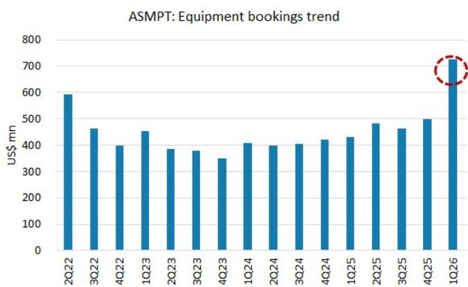
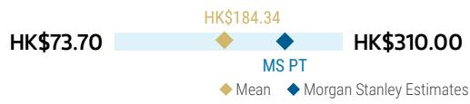
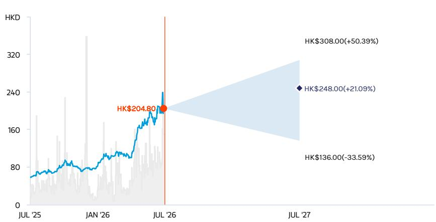

§ = Consensus data is provided by Refinitiv Estimates

\*\* = Based on consensus methodology

ASMPT Ltd | Asia Pacific

# 2Q26 Preview: OSAT and PCB – Dual Growth Engines

ASMPT Ltd (0522.HK, 522 HK)

<table><tr><td colspan="3">WHAT'S CHANGED</td></tr><tr><td>ASMPT Ltd (0522.HK)</td><td>From</td><td>To</td></tr><tr><td>Price Target</td><td>HK$188.00</td><td>HK$248.00</td></tr></table>

Strong capital spending plans by both OSAT and PCB companies in 2026 should support continued growth in ASMPT's semiconductor solutions and SMT businesses. We raise our price target to HK\$248 and reiterate our OW rating.

Strong OSAT and PCB capex momentum: Our bottom-up analysis shows OSAT capex is now likely to grow by another 45% in 2026 (Exhibit 5), compared with 34% in our 1Q26 preview note (link). Moreover, OSAT pricing is on an up-trend on the back of high utilization and strong demand. Recently, ASE raised advanced packaging quotes by more than 20% (link) and China OSATs also raised prices by 5-10% in general. As for ASMPT's SMT business, sales growth has historically shown a strong correlation with PCB companies' capex (Exhibit 6). This year, PCB companies are also expanding capex aggressively by around 69%, driven by increased AI demand. We expect ASMPT's semi solutions and SMT businesses to record strong sales growth on the back of its customers' strong capex trend.

A mixed TCB picture; logic remains strong, while some slowdown in HBM: We expect TSMC's CoWoS capacity to grow to 200kwpm by the end of 2027 (link), and that ASMPT will benefit as the sole supplier of CoWoS-L on-substrate TCB. While HBM production uses TCB, we see slower order momentum for related equipment. One potential reason is that memory manufacturers currently generate higher profitability by allocating DRAM dies to server DRAM production rather than HBM.

Key focus areas for the results: (1) TCB order wins in both HBM and logic, particularly TCB for chip-to-wafer (C2W) process; (2) photonics order momentum and visibility into orders for CPO-related tools; (3) organizational updates, including the new CEO appointment and planned business divestitures; (4) progress in hybrid bonding; and (5) demand trends from auto and industrial customers for SMT equipment.

Raise PT to HK\$248, OW: We adjust our model and raise our 2026-28e EPS by 7%, 10%, and 10%, respectively, reflecting stronger growth in both the semi solutions and SMT segments. We expect ASMPT to benefit from ongoing semi capacity expansion and robust AI-related demand. We find valuation attractive at 30x 2027e P/E, below its peers Besi at 35x and Hanmi at 43x.

<table><tr><td colspan="2">MS ASIA LIMITED+</td></tr><tr><td colspan="2">Daisy Dai, CFA</td></tr><tr><td colspan="2">Equity Analyst</td></tr><tr><td>Daisy.Dai@morganstanley.com</td><td>+852 2848-7310</td></tr><tr><td colspan="2">MS TAIWAN LIMITED+</td></tr><tr><td colspan="2">Charlie Chan</td></tr><tr><td colspan="2">Equity Analyst</td></tr><tr><td>Charlie.Chan@morganstanley.com</td><td>+886 2 2730-1725</td></tr><tr><td colspan="2">Daniel Yen, CFA</td></tr><tr><td colspan="2">Equity Analyst</td></tr><tr><td>Daniel.Yen@morganstanley.com</td><td>+886 2 2730-2863</td></tr><tr><td colspan="2">Tiffany Yeh</td></tr><tr><td colspan="2">Equity Analyst</td></tr><tr><td>Tiffany.Yeh@morganstanley.com</td><td>+886 2 7712-3032</td></tr><tr><td colspan="2">MS ASIA LIMITED+</td></tr><tr><td colspan="2">Ethan Jia</td></tr><tr><td colspan="2">Research Associate</td></tr><tr><td>Ethan.Jia@morganstanley.com</td><td>+852 3963-2287</td></tr></table>

<table><tr><td>Stock Rating</td><td>Overweight</td></tr><tr><td>Industry View</td><td>Attractive</td></tr><tr><td>Price target</td><td>HK$248.00</td></tr><tr><td>Up/downside to price target (%)</td><td>21</td></tr><tr><td>Shr price, close (Jul 3, 2026)</td><td>HK$204.80</td></tr><tr><td>52-Week Range</td><td>HK$244.40-56.79</td></tr><tr><td>Sh out, dil, curr (mn)</td><td>398</td></tr><tr><td>Mkt cap, curr (mn)</td><td>HK$81,430</td></tr><tr><td>EV, curr (mn)</td><td>HK$73,755</td></tr><tr><td>Avg daily trading value (mn)</td><td>HK$332</td></tr></table>

<table><tr><td>Fiscal Year Ending</td><td>12/25</td><td>12/26e</td><td>12/27e</td><td>12/28e</td></tr><tr><td>EPS (HK$)**</td><td>2.17</td><td>3.94</td><td>6.76</td><td>9.41</td></tr><tr><td>Prior EPS (HK$)**</td><td>-</td><td>3.67</td><td>6.14</td><td>8.58</td></tr><tr><td>EPS (HK$)§</td><td>1.40</td><td>3.79</td><td>5.71</td><td>7.11</td></tr><tr><td>Revenue, net (HK$ mn)</td><td>14,521</td><td>18,293</td><td>21,822</td><td>25,482</td></tr><tr><td>EBITDA (HK$ mn)</td><td>1,937</td><td>3,081</td><td>4,764</td><td>6,418</td></tr><tr><td>ModelWare net inc (HK $ mn)</td><td>902</td><td>1,648</td><td>2,827</td><td>3,936</td></tr><tr><td>P/E</td><td>35.5</td><td>52.0</td><td>30.3</td><td>21.8</td></tr></table>

Unless otherwise noted, all metrics are based on MS ModelWare framework

MS does and seeks to do business with companies covered in MS. As a result, investors should be aware that the firm may have a conflict of interest that could affect the objectivity of MS. Investors should consider MS as only a single factor in making their investment decision.

## For analyst certification and other important disclosures, refer to the Disclosure Section, located at the end of this report.

+= Analysts employed by non-U.S. affiliates are not registered with FINRA, may not be associated persons of the member and may not be subject to FINRA restrictions on communications with a subject company, public appearances and trading securities held by a research analyst account.

## Preview to earnings

<table><tr><td>Focus KPI</td><td>Focus KPI Surprise</td><td>Likely impact to consensus EPS*</td></tr><tr><td colspan="3">ASMPT Ltd 0522.HK</td></tr><tr><td>B/B ratio</td><td>↑ Likely upside surprise</td><td>↑ Modest revision higher</td></tr></table>

\- For 3Q26, we expect ASMPT's revenue growth momentum to continue and revenue to rise $9\%$ QoQ and $34\%$ YoY.

• We expect ASMPT to benefit from higher utilization and strong capex by OSAT and PCB companies.

\- We expect logic TCB orders to remain strong, while demand for HBM TCB orders are likely to be slow.

\*Likely impact to consensus EPS is for the next 12 months

Source: Company data, MS

# 2Q26 Preview and 3Q26 Outlook

Exhibit 1: ASMPT: 2Q26 preview

<table><tr><td>(HK$ mn)</td><td>2Q26</td><td>Q/Q</td><td>Y/Y</td><td>2Q26 guidance</td><td>Cons 2Q26e</td><td>Diff.</td></tr><tr><td>Net sales</td><td>4,498</td><td>10%</td><td>32%</td><td>~US$570mn at mid-point</td><td>4,442</td><td>1%</td></tr><tr><td>Gross profit</td><td>1,820</td><td>14%</td><td>35%</td><td></td><td>1,755</td><td>4%</td></tr><tr><td>Operating profit</td><td>519</td><td>52%</td><td>206%</td><td></td><td>456</td><td>14%</td></tr><tr><td>Pretax Income</td><td>540</td><td>34%</td><td>392%</td><td></td><td>463</td><td>17%</td></tr><tr><td>Net income</td><td>405</td><td>60%</td><td>202%</td><td></td><td>344</td><td>18%</td></tr><tr><td>Reported EPS</td><td>0.97</td><td></td><td></td><td></td><td>0.82</td><td>18%</td></tr><tr><td colspan="7">Margins</td></tr><tr><td>Gross margin</td><td>40.5%</td><td>1.3ppt</td><td>0.8ppt</td><td></td><td>39.5%</td><td>1.0ppt</td></tr><tr><td>Operating margin</td><td>11.5%</td><td>3.1ppt</td><td>6.6ppt</td><td></td><td>10.3%</td><td>1.3ppt</td></tr><tr><td>Net margin</td><td>9.0%</td><td>2.8ppt</td><td>5.1ppt</td><td></td><td>7.7%</td><td>1.3ppt</td></tr></table>

Source: Company data, Bloomberg, MS estimates.

Exhibit 2: ASMPT: 3Q26 outlook

<table><tr><td>(HK$ mn)</td><td>3Q26</td><td>Q/Q</td><td>Y/Y</td><td>Cons 3Q26e</td><td>Diff</td></tr><tr><td>Net sales</td><td>4,921</td><td>9%</td><td>34%</td><td>4,712</td><td>4%</td></tr><tr><td>Gross profit</td><td>2,024</td><td>11%</td><td>55%</td><td>1,835</td><td>10%</td></tr><tr><td>Operating profit</td><td>653</td><td>26%</td><td>1194%</td><td>526</td><td>24%</td></tr><tr><td>Pretax Income</td><td>674</td><td>25%</td><td>-405%</td><td>462</td><td>46%</td></tr><tr><td>Net income</td><td>507</td><td>25%</td><td>-289%</td><td>401</td><td>26%</td></tr><tr><td>Reported EPS</td><td>1.21</td><td></td><td></td><td>0.99</td><td></td></tr><tr><td colspan="6">Margins</td></tr><tr><td>Gross margin</td><td>41.1%</td><td>0.7ppt</td><td>5.5ppt</td><td>38.9%</td><td>2.2ppt</td></tr><tr><td>Operating margin</td><td>13.3%</td><td>1.7ppt</td><td>11.9ppt</td><td>11.2%</td><td>2.1ppt</td></tr><tr><td>Net margin</td><td>10.3%</td><td>1.3ppt</td><td>17.6ppt</td><td>8.5%</td><td>1.8ppt</td></tr></table>

Source: Company data, FactSet, MS estimates.

## Key Cycle Charts to Watch

Exhibit 3: The assembly (back-end) market is typically strongly correlated to semi-unit growth; we expect double-digit growth in 2026  
  
Source: WSTS, Bloomberg, e = MS estimates.

Exhibit 4: OSAT utilization at high levels in 1Q26  
  
Source: Company data, MS.

Exhibit 5: OSAT capex is likely to grow 45% in 2026, marking the 3rd consecutive year of capex increase  
  
Source: Company data, Bloomberg, MS (E) estimates.

Exhibit 6: ASMPT's SMT revenue growth is correlated with PCB  
  
Source: Company data, Bloomberg, MS (E) estimates.

Exhibit 7: Besi B/B ratio well above 1  
  
Source: Company data, MS.

Exhibit 8: ASMPT quarterly orders reached its highest level in the past 4 years  
  
Source: Company data, MS.

Estimate Revisions

We raise our 2026/27/28e EPS by 7%/10%/10%: On the back of stronger OSAT and PCB capex, we raise our sales forecasts for the semi solutions and SMT businesses, which we now expect to grow by 30% and 27% YoY, respectively. We expect the revenue growth momentum in 1H26 to continue in 2027 and 2028. Our margin assumptions are slightly up, mainly reflecting the higher mix of semi solutions, which carries a higher margin.

Exhibit 9: ASMPT: Summary of estimate changes

<table><tr><td>(HK$ mn)</td><td>New 2026e</td><td>Last published 2026e</td><td>Diff.</td><td>New 2027e</td><td>Last published 2027e</td><td>Diff.</td><td>New 2028e</td><td>Last published 2028e</td><td>Diff.</td></tr><tr><td>Net sales</td><td>18,293</td><td>18,089</td><td>1%</td><td>21,822</td><td>20,840</td><td>5%</td><td>25,482</td><td>24,187</td><td>5%</td></tr><tr><td>Gross profit</td><td>7,442</td><td>7,272</td><td>2%</td><td>9,273</td><td>8,830</td><td>5%</td><td>10,979</td><td>10,399</td><td>6%</td></tr><tr><td>Operating profit</td><td>2,134</td><td>1,984</td><td>8%</td><td>3,718</td><td>3,371</td><td>10%</td><td>5,198</td><td>4,732</td><td>10%</td></tr><tr><td>Pretax Income</td><td>2,256</td><td>2,106</td><td>7%</td><td>3,761</td><td>3,414</td><td>10%</td><td>5,240</td><td>4,775</td><td>10%</td></tr><tr><td>Net income</td><td>1,648</td><td>1,536</td><td>7%</td><td>2,827</td><td>2,567</td><td>10%</td><td>3,936</td><td>3,587</td><td>10%</td></tr><tr><td>Reported EPS</td><td>3.94</td><td>3.67</td><td>7%</td><td>6.76</td><td>6.14</td><td>10%</td><td>9.41</td><td>8.58</td><td>10%</td></tr><tr><td colspan="10">Margins</td></tr><tr><td>Gross margin</td><td>40.7%</td><td>40.2%</td><td></td><td>42.5%</td><td>42.4%</td><td></td><td>43.1%</td><td>43.0%</td><td></td></tr><tr><td>Operating margin</td><td>11.7%</td><td>11.0%</td><td></td><td>17.0%</td><td>16.2%</td><td></td><td>20.4%</td><td>19.6%</td><td></td></tr><tr><td>Net margin</td><td>9.0%</td><td>8.5%</td><td></td><td>13.0%</td><td>12.3%</td><td></td><td>15.4%</td><td>14.8%</td><td></td></tr></table>

Source: MS (e) estimates.

Exhibit 10: ASMPT: Semi-annual financials

<table><tr><td>(HK$ mn)</td><td>1H25</td><td>2H25</td><td>1H26e</td><td>2H26e</td><td>2025</td><td>2026e</td><td>2027e</td><td>2028e</td></tr><tr><td>Revenue</td><td>6,526</td><td>7,995</td><td>8,464</td><td>9,721</td><td>14,521</td><td>18,293</td><td>21,822</td><td>25,482</td></tr><tr><td>Semiconductor Solutions (SEMI)</td><td>4,000</td><td>3,692</td><td>4,545</td><td>5,467</td><td>7,692</td><td>10,011</td><td>12,583</td><td>14,921</td></tr><tr><td>SMT</td><td>2,526</td><td>3,928</td><td>3,920</td><td>4,254</td><td>6,454</td><td>8,174</td><td>9,239</td><td>10,561</td></tr><tr><td>Seq %</td><td>-3.3%</td><td>22.5%</td><td>5.9%</td><td>14.8%</td><td></td><td></td><td></td><td></td></tr><tr><td>Y/Y %</td><td>0.7%</td><td>18.5%</td><td>29.7%</td><td>21.6%</td><td>9.8%</td><td>26.0%</td><td>19.3%</td><td>16.8%</td></tr><tr><td>Cost of Goods (inc. depreciation)</td><td>3,897</td><td>5,173</td><td>5,050</td><td>5,693</td><td>9,070</td><td>10,850</td><td>12,548</td><td>14,503</td></tr><tr><td>Percent of Revenues</td><td>59.7%</td><td>64.7%</td><td>59.7%</td><td>58.6%</td><td>62.5%</td><td>59.3%</td><td>57.5%</td><td>56.9%</td></tr><tr><td>Gross Profit</td><td>2,630</td><td>2,822</td><td>3,414</td><td>4,028</td><td>5,451</td><td>7,442</td><td>9,273</td><td>10,979</td></tr><tr><td>Gross margin</td><td>40.3%</td><td>35.3%</td><td>40.3%</td><td>41.4%</td><td>37.5%</td><td>40.7%</td><td>42.5%</td><td>43.1%</td></tr><tr><td>Other Revenue (Interest Income)</td><td>80</td><td>110</td><td>87</td><td>120</td><td>190</td><td>207</td><td>200</td><td>200</td></tr><tr><td>Selling Expense</td><td>756</td><td>829</td><td>872</td><td>988</td><td>1,584</td><td>1,861</td><td>2,141</td><td>2,247</td></tr><tr><td>Percent of Revenues</td><td>11.6%</td><td>10.4%</td><td>10.3%</td><td>10.2%</td><td>10.9%</td><td>10.2%</td><td>9.8%</td><td>8.8%</td></tr><tr><td>General Administrative Expenses</td><td>527</td><td>671</td><td>602</td><td>622</td><td>1,197</td><td>1,224</td><td>1,010</td><td>1,010</td></tr><tr><td>Percent of Revenues</td><td>8.1%</td><td>8.4%</td><td>7.1%</td><td>6.4%</td><td>8.2%</td><td>6.7%</td><td>4.6%</td><td>4.0%</td></tr><tr><td>Net R & D Expenses</td><td>1,017</td><td>1,038</td><td>1,080</td><td>1,145</td><td>2,056</td><td>2,224</td><td>2,404</td><td>2,524</td></tr><tr><td>Percent of Revenues</td><td>15.6%</td><td>13.0%</td><td>12.8%</td><td>11.8%</td><td>14.2%</td><td>12.2%</td><td>11.0%</td><td>9.9%</td></tr><tr><td>Operating Profit</td><td>330</td><td>285</td><td>861</td><td>1,273</td><td>614</td><td>2,134</td><td>3,718</td><td>5,198</td></tr><tr><td>Percent of Revenues</td><td>5%</td><td>4%</td><td>10%</td><td>13%</td><td>4.2%</td><td>11.7%</td><td>17.0%</td><td>20.4%</td></tr><tr><td>Finance Costs</td><td>90</td><td>79</td><td>78</td><td>79</td><td>169</td><td>157</td><td>157</td><td>157</td></tr><tr><td>Profit Before Tax</td><td>216</td><td>1,047</td><td>942</td><td>1,314</td><td>1,263</td><td>2,256</td><td>3,761</td><td>5,240</td></tr><tr><td>Taxes</td><td>(4)</td><td>364</td><td>286</td><td>328</td><td>361</td><td>615</td><td>940</td><td>1,310</td></tr><tr><td>Tax Rate %</td><td>-2%</td><td>35%</td><td>30%</td><td>25%</td><td>28.6%</td><td>27.2%</td><td>25.0%</td><td>25.0%</td></tr><tr><td>Minority</td><td>2</td><td>(2)</td><td>(3)</td><td>(3)</td><td>(0)</td><td>(6)</td><td>(6)</td><td>(6)</td></tr><tr><td>Net Profit</td><td>218</td><td>684</td><td>659</td><td>989</td><td>902</td><td>1,648</td><td>2,827</td><td>3,936</td></tr><tr><td>Percent of Revenues</td><td>3%</td><td>9%</td><td>8%</td><td>10%</td><td>6.2%</td><td>9.0%</td><td>13.0%</td><td>15.4%</td></tr><tr><td>Y/Y %</td><td>-30.9%</td><td>2159.2%</td><td>202.9%</td><td>44.5%</td><td>161.2%</td><td>82.7%</td><td>71.6%</td><td>39.3%</td></tr><tr><td>EPS Diluted</td><td>0.52</td><td>1.65</td><td>1.58</td><td>2.36</td><td>2.17</td><td>3.94</td><td>6.76</td><td>9.41</td></tr></table>

Source: Company data, MS (e) estimates.

## Valuation methodology

We raise our price target by 32% to HK\$248. Our price target, which is also our base case scenario value, is derived from our residual income model. The change to our price target mainly reflects our higher EPS forecasts and higher intermediate growth rate of 14.5%, up from 12%, mainly reflecting new growth opportunities such as Photonics and CPO.

Our key RIM assumptions are unchanged, including our cost of equity of 9.2% (beta of 1.3, risk-free rate of 2%, and risk premium of 5.5%) and terminal growth rate of 3.5%.

Exhibit 11: ASMPT: Residual income model

<table><tr><td>(HK$ mn)</td><td>2026e</td><td>2027e</td><td>2028e</td><td>2029e</td><td>2030e</td><td>2031e</td><td>2032e</td><td>2033e</td><td>2034e</td><td>2035e</td><td>2036e</td><td>2037e</td></tr><tr><td>Total Equity</td><td>17,982</td><td>19,700</td><td>22,001</td><td>23,353</td><td>24,902</td><td>26,674</td><td>28,704</td><td>31,028</td><td>33,689</td><td>36,736</td><td>40,225</td><td>44,219</td></tr><tr><td>Net Profit</td><td>1,648</td><td>2,827</td><td>3,936</td><td>4,507</td><td>5,161</td><td>5,909</td><td>6,766</td><td>7,747</td><td>8,870</td><td>10,156</td><td>11,629</td><td>13,315</td></tr><tr><td>ROAE</td><td>9.4%</td><td>15.0%</td><td>18.9%</td><td>19.9%</td><td>21.4%</td><td>22.9%</td><td>24.4%</td><td>25.9%</td><td>27.4%</td><td>28.8%</td><td>30.2%</td><td>31.5%</td></tr><tr><td>Residual Income</td><td>40</td><td>1,053</td><td>1,917</td><td>2,360</td><td>2,858</td><td>3,427</td><td>4,077</td><td>4,819</td><td>5,666</td><td>6,634</td><td>7,740</td><td>9,005</td></tr><tr><td>Spread</td><td>0.2%</td><td>5.9%</td><td>9.7%</td><td>10.7%</td><td>12.2%</td><td>13.8%</td><td>15.3%</td><td>16.8%</td><td>18.3%</td><td>19.7%</td><td>21.1%</td><td>22.4%</td></tr><tr><td>Ending Equity Capital</td><td>17,982</td><td></td><td></td><td></td><td></td><td></td><td></td><td></td><td></td><td></td><td></td><td></td></tr><tr><td>PV of Forecast Period</td><td>22,690</td><td></td><td></td><td></td><td></td><td></td><td></td><td></td><td></td><td></td><td></td><td></td></tr><tr><td>PV of Continuing Value</td><td>62,965</td><td></td><td></td><td></td><td></td><td></td><td></td><td></td><td></td><td></td><td></td><td></td></tr><tr><td>Equity Value</td><td>103,638</td><td></td><td></td><td></td><td></td><td></td><td></td><td></td><td></td><td></td><td></td><td></td></tr><tr><td>No. of Shares</td><td>418</td><td></td><td></td><td></td><td></td><td></td><td></td><td></td><td></td><td></td><td></td><td></td></tr><tr><td>Projected Price</td><td>248</td><td></td><td></td><td></td><td></td><td></td><td></td><td></td><td></td><td></td><td></td><td></td></tr></table>

Source: MS (e) estimates.

## Risk Reward – ASMPT Ltd (0522.HK)

Benefiting from robust OSAT and PCB capex; other drivers emerging

## PRICE TARGET HK\$248.00

Base case, residual income model. Key assumptions: cost of equity 9.2% (2% risk-free rate, 5.5% equity risk premium, 1.3 beta), intermediate growth rate 14.5%, terminal growth rate 3.5%.

## Consensus Price Target Distribution

Source: Refinitiv, MS

## RISK REWARD CHART

  
Key: — Historical Stock Performance ● Current Stock Price ◆ Price Target  
Source: Refinitiv, MS

## OVERWEIGHT THESIS

\- We expect ASMPT to benefit from strong OSAT and PCB capex with equipment growing faster.
- Auto and industrial dropped to a historical low in the mix in 2025, indicating limited downside risk.
- For the
