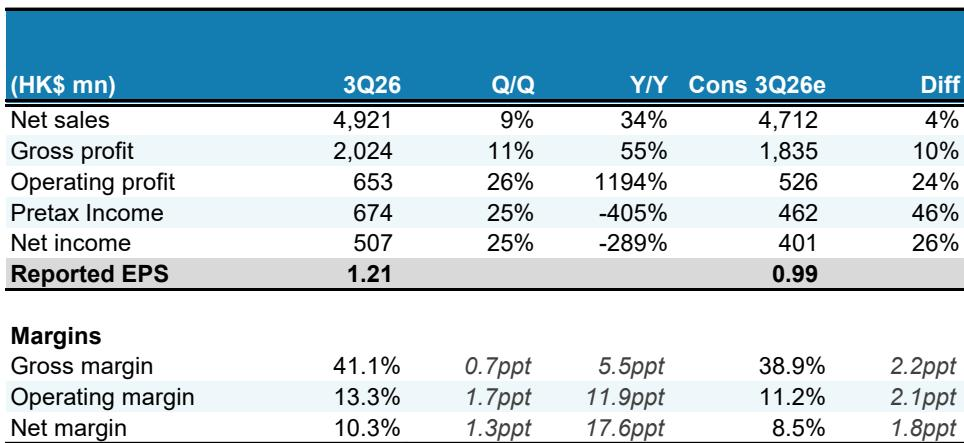
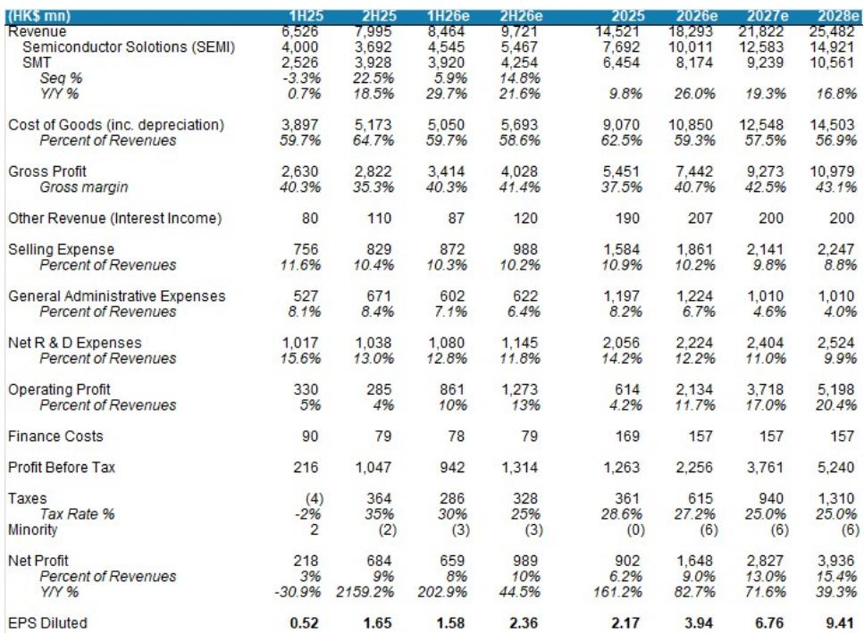
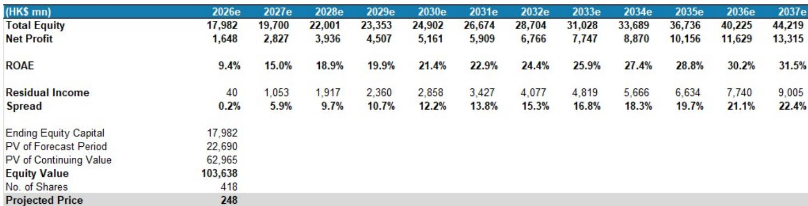

# ASMPT的双重引擎正在启动：OSAT与PCB资本支出创造罕见的同步增长窗口

半导体设备周期通常是一个单一引擎的故事。晶圆厂建设产能，后端供应商跟随。但每隔几年，来自两个独立来源的需求会同时激增，形成罕见的协同效应。这正是ASMPT目前所处的局面。该公司的半导体解决方案部门及其SMT业务，都有望受益于资本支出周期——这些周期不仅巧合地同步，而且因AI需求而在结构上得到放大。其结果是，当前市场共识可能低估了其收入和盈利轨迹。

一份全球投行关于ASMPT 2026年第二季度业绩的预览报告，以罕见的清晰度阐述了这一观点，并将2026-2028年每股收益预测分别上调了7%、10%和10%。其逻辑并非仅仅是周期向好，而是周期同时在两个不同维度上向好，而ASMPT恰好处于这两者的交汇点，占据独特位置。

对于关注半导体资本设备领域的研究者来说，此刻值得仔细审视。该报告的底层分析显示，OSAT资本支出在2026年可能增长45%，高于此前估计的34%。PCB公司的资本支出则扩张约69%。历史上，ASMPT的收入与这两者都高度相关。当两个引擎同时启动时，对收入和利润率的复合效应可能非常显著。

关键问题在于，这种双重周期的动能是否已被市场定价。报告认为尚未如此。以2027年预估市盈率30倍计算，ASMPT的估值低于其最接近的同行Besi（35倍）和Hanmi（43倍）。如果随着资本支出计划加速，盈利继续超出预期，这一估值差距可能会缩小。

## OSAT资本支出加速不仅是周期性的——它反映了结构性定价能力

该报告最引人注目的数据点是对OSAT资本支出增长的上调。最初的估计为34%，现已提高至45%。这并非四舍五入的误差。它表明OSAT公司的产能利用率已达到足够高的水平，足以支撑连续第三年进行激进的产能扩张。

定价证据也支持这一点。领先的OSAT厂商ASE将先进封装报价提高了20%以上。中国OSAT厂商也紧随其后，普遍提价5-10%。当定价能力出现在OSAT这样一个历史上被视为商品化的领域时，表明需求不仅强劲，而且在结构上偏紧。报告将此归因于AI驱动的先进封装需求，这需要无法在短期内快速提升的专用设备。

对ASMPT而言，其影响是直接的。更高的OSAT资本支出直接转化为半导体解决方案部门的订单。但更有趣的影响在于利润率质量。当客户提价时，他们往往会更积极地投资于能够提高生产效率和良率的设备。随着OSAT优先发展先进封装产能，ASMPT利润率更高的半导体解决方案组合应会不成比例地受益。

报告的估计变化反映了这一逻辑。半导体解决方案的收入预测已被上调至同比增长30%，并且由于该部门占比提高，利润率假设也有所增加。但一个尚未解答的问题是，这种定价能力能持续多久。如果OSAT的产能利用率在2027年之前保持高位，资本支出周期可能会进一步延长。如果需求正常化，回调可能会很剧烈。报告并未完全解决这一矛盾。

## PCB资本支出创造了常被忽视的第二增长曲线

大多数半导体设备分析都聚焦于前端和后端芯片制造。PCB资本支出是一个独立的周期，由不同的终端市场动态驱动。但对于ASMPT而言，服务于PCB组装的SMT业务是一个重要的收入贡献者。报告显示，SMT收入增长历史上与PCB公司的资本支出高度相关。

当前时刻的特殊之处在于PCB资本支出扩张的规模。报告引用了约69%的增长，这由AI需求增加所驱动。这不是一个典型的PCB周期。AI服务器架构需要PCB具有更多层数、更高密度和更好的热管理。这推动了产量和复杂性的提升，进而拉动了设备支出。

报告预计，ASMPT的SMT业务在2026年将同比增长27%。这是一个强劲的数字，但如果PCB资本支出继续加速，这个预测可能偏于保守。PCB资本支出与SMT收入之间的相关性已得到充分证实，但在技术快速转型期间，这种关系可能是非线性的。如果AI驱动的PCB需求迫使升级周期加快，SMT的增长可能会超过当前估计。

这里的战略洞察在于，ASMPT提供了接触两个不同工业周期的机会。一个周期的放缓可能被另一个周期的强势所抵消。这种多元化在半导体设备公司中很少见，因为大多数公司都依赖于单一终端市场。报告并未完全探讨这种组合效应，但对于风险调整后的回报分析而言，这是一个合乎逻辑的二级推论。

## TCB情况复杂：逻辑芯片的强势掩盖了HBM的不确定性

并非ASMPT的所有增长引擎都在同等发力。报告明确指出，热压键合（TCB）设备的前景喜忧参半。在逻辑芯片方面，前景强劲。ASMPT是CoWoS-L基板上TCB的整理版供应商，而台积电的CoWoS产能预计到2027年底将增长至200kwpm。这创造了一个清晰可见的需求流。

然而，在HBM方面，报告指出订单动能较慢。解释颇具启发性：内存制造商目前通过将DRAM晶粒分配给服务器DRAM生产而非HBM，能获得更高的盈利能力。这是一个战略分配决策，而非技术问题。当标准服务器DRAM的利润率具有吸引力时，投资于HBM专用产能的动力就会减弱。

这引出了一个有趣的分析问题。如果内存制造商今天选择服务器DRAM而非HBM，那么什么会改变这种计算？由AI需求驱动的HBM定价持续上涨，可能会改变分配。或者，如果服务器DRAM利润率压缩，HBM将变得相对更具吸引力。报告没有预测哪种情况更可能发生，但这种不确定性对ASMPT的TCB收入轨迹至关重要。

报告还将芯片对晶圆（C2W）TCB确定为一个关键关注领域。如果ASMPT在这一领域赢得订单，将意味着其可寻址市场的显著扩张。但报告并未提供此类订单获胜的概率或时间表。这是使完整报告值得一读的未解决问题之一。

## 报告未完全解答的问题：混合键合与光子学前沿

每一份好的研究报告都会明确其已知和未知的内容。这份报告也不例外。它将混合键合和光子学列为关键关注领域，但分析必然是初步的。

混合键合是先进封装的下一个前沿。它提供了比TCB更高的互连密度，但技术挑战更大，采用曲线也更长。ASMPT在混合键合方面的进展将决定该公司能否参与下一代芯片堆叠技术。报告将此列为一个关注领域，但未提供具体订单或时间表。

光子学和CPO相关工具代表了另一个增长曲线。随着数据中心转向光互连以应对功耗和带宽限制，光子封装所需的设备将会增长。报告指出，ASMPT的中期增长率假设已从12%上调至14.5%，以反映这些机会。但现阶段，光子学的收入贡献仍属推测。

对于研究者而言，未解决的问题是分析中最有价值的部分。如果混合键合和光子学的发展速度快于预期，ASMPT的长期盈利能力可能显著高于当前估计。如果它们停滞不前，增长故事将更加依赖于现有的TCB和SMT周期。报告为监测这些发展提供了一个框架，但结果仍不确定。

## 评估ASMPT的决策框架

报告的分析可以转化为一个结构化的决策框架。研究者应根据三个独立变量来评估ASMPT，每个变量都有一组清晰的领先指标。

首先，OSAT资本支出轨迹。关键的领先指标是OSAT产能利用率、定价公告和产能扩张计划。报告显示利用率处于高位，定价呈上升趋势。如果这些指标保持积极，ASMPT的半导体解决方案收入应会继续增长。如果利用率下降或定价逆转，周期可能正在见顶。

其次，PCB资本支出动能。这里的领先指标是PCB公司的资本支出计划、AI服务器生产预测以及PCB复杂性趋势。报告显示，AI驱动的扩张势头强劲。如果AI服务器需求持续或加速，PCB资本支出应会保持高位。如果AI需求令人失望，PCB周期的转变可能比OSAT周期更快。

第三，TCB订单构成。关键区别在于逻辑芯片和HBM订单。由CoWoS扩张驱动的逻辑订单似乎稳固。HBM订单则更不确定。领先指标是内存制造商在服务器DRAM和HBM之间的分配决策。如果HBM利润率相对于服务器DRAM有所改善，TCB订单动能应会恢复。否则，HBM领域可能仍是一个拖累。

报告的估值分析提供了一个有用的交叉验证。以2027年预估市盈率30倍计算，ASMPT的交易价格相对于同行有折让。如果所有三个变量都积极变动，折让应会缩小。如果任何一个变量令人失望，折让可能会持续或扩大。风险回报状况取决于研究者对每个变量轨迹的看法。

## 完整报告包含直观论证的图表

以上分析基于报告的书面逻辑和数据。但报告中的图表——展示了OSAT资本支出趋势、PCB资本支出与SMT收入之间的相关性以及剩余收益模型——为论证提供了视觉确认。这些图表显示了文字本身无法完全捕捉的模式。

加入社区阅读完整报告并查看原始图表。

*仅供参考。部分内容可能基于源材料通过AI辅助生成、翻译、总结或编辑，可能存在遗漏或错误。请独立核实。这不构成任何专业建议。*

仅供参考。部分内容可能基于源材料通过AI辅助生成、翻译、总结或编辑，可能存在遗漏或错误。请独立核实。这不构成任何专业建议。

