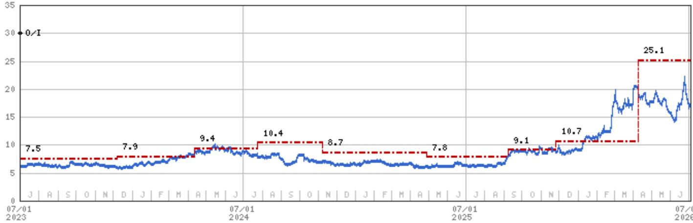
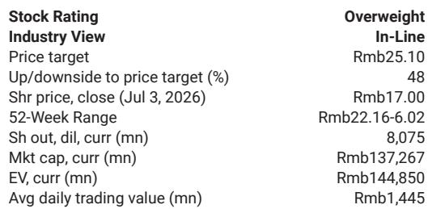

# Tanker Shipping's Second Act: Why China Merchants Energy Shipping's 1H26 Profit Alert Signals More Than a Cyclical Peak

The narrative surrounding tanker shipping has long been one of cyclical peaks followed by inevitable corrections. China Merchants Energy Shipping (CMES) has just disrupted that narrative with a 1H26 profit alert that demands a strategic reassessment. The company expects net profit of RMB 6.6 to 7.3 billion for the first half of 2026, representing year-over-year growth of 214 to 248 percent. This is not merely a cyclical upswing. It is a structural inflection point where operational proficiency, geopolitical disruption, and supply-demand dynamics are converging to create a multi-year earnings cycle that the market has yet to fully price. The implied midpoint of second-quarter net profit stands at RMB 4.2 billion, a figure that is particularly striking because it was achieved despite a temporary shutdown in the Strait of Hormuz during the quarter.

The prevailing market skepticism toward shipping equities has been rooted in a simple thesis: high earnings today mean fleet additions tomorrow, which compress rates and destroy returns. That thesis is about to be tested. The data from CMES suggests that the current cycle possesses characteristics that differentiate it from previous booms. Tanker profit contributions rose 50 percent quarter-over-quarter in 2Q26, while dry bulk profit contributions surged 170 percent. These numbers were not driven by a single catalyst. They reflect a synchronized improvement across multiple shipping segments, each with its own supply constraints and demand drivers. The market is treating this as a peak to be sold. The evidence suggests it may be a plateau to be owned.

The timing of this profit alert is critical. It arrives at a moment when the global energy trade is being reshaped by sanctions, rerouting, and the gradual reopening of chokepoints. Observers who dismiss CMES's performance as a one-off event risk missing the broader structural transformation underway in maritime transportation. The question is not whether tanker earnings will normalize. The question is what the new normal looks like, and whether current valuations reflect that reality.

## The Strait of Hormuz Disruption Revealed CMES's Operational Resilience, Not Its Vulnerability

The most counterintuitive aspect of CMES's 2Q26 performance is that it came during a period of significant operational disruption in the Strait of Hormuz. Conventional wisdom would suggest that a chokepoint closure would depress earnings for any shipping company with exposure to that route. CMES delivered the opposite outcome. The company's tanker division generated a 50 percent sequential profit increase despite this headwind.

This outcome requires a reinterpretation of what operational proficiency means in the shipping context. It is not simply about running ships efficiently. It is about fleet deployment flexibility, contract structuring, and the ability to pivot to alternative routes and cargo types when primary markets are disrupted. CMES demonstrated that its diversified fleet and sophisticated chartering operations allowed it to capture value from the volatility that the disruption created, rather than being a victim of it.

The implication for observers is significant. If a company can grow tanker profits during a chokepoint closure, what happens when the Strait reopens? The report explicitly flags that 3Q26 could see further quarter-over-quarter upside should the Strait reopen as expected. This is not a recovery play. It is an acceleration play. The disruption created a temporary overhang that suppressed what would otherwise have been even stronger results. The removal of that overhang could release pent-up earnings power that the market has not modeled.

## Dry Bulk's 170 Percent Profit Surge Is Not a One-Off but a Leading Indicator of a Structural Shift

The dry bulk segment's performance in 2Q26 warrants particular attention, not because it was the largest contributor to CMES's earnings, but because it reveals a deeper structural dynamic. Dry bulk profits rose 170 percent quarter-over-quarter, driven by continued improvement in supply-demand dynamics and a recovery in the Baltic Dry Index. This is not a cyclical spike. It is the result of years of underinvestment in new vessel capacity colliding with steady demand growth from infrastructure and commodity trade.

The supply side of the dry bulk market has been constrained by anemic order books. Shipyards have been at capacity building container vessels and LNG carriers, leaving dry bulk tonnage additions at historically low levels. This supply discipline is not a temporary phenomenon. It reflects a structural shift in shipyard allocation and financing availability. The result is that the dry bulk fleet is aging, and replacement capacity is not being built at a rate that would suppress rates in the medium term.

CMES's dry bulk performance is a signal that the shipping cycle is broadening beyond tankers. The bull case for shipping has traditionally been a tanker story, driven by oil demand and geopolitics. The emergence of dry bulk as a strong profit contributor suggests that the entire maritime transportation complex is entering a period of elevated returns. This has implications for how observers should think about portfolio construction within the sector. A diversified shipping company like CMES offers exposure to multiple cycles simultaneously, reducing single-segment risk while capturing upside from each.

## The Consensus Earnings Estimates Are Too Conservative Because They Underestimate Duration

The consensus earnings estimates for CMES tell a revealing story. For fiscal year 2026, consensus EPS is RMB 1.45, declining to RMB 1.31 in 2027 and RMB 1.24 in 2028. This trajectory embeds an implicit assumption that current elevated earnings are unsustainable and will revert toward a long-term mean. The report's own estimates show a similar pattern, albeit with a slightly higher 2027 figure of RMB 1.01 under the ModelWare framework.

The problem with this consensus view is that it fails to account for the structural changes that are extending the duration of the current cycle. The report identifies several potential upside catalysts that could prove stronger and last longer than expected: elevated tanker spot rates, oil restocking demand, the reopening of the Strait of Hormuz, and potential OPEC+ production increases. Each of these factors individually could push earnings above consensus. Collectively, they represent a set of conditions that could sustain elevated profitability through 2027 and into 2028.

The market is pricing a normalization that assumes reversion to the mean. The data suggests that the mean itself may have shifted. The supply constraints in both tanker and dry bulk markets are structural, not cyclical. The demand drivers, including energy security-driven stockpiling and infrastructure spending, are policy-backed and multi-year in nature. If the cycle lasts longer than consensus expects, the earnings trajectory will be materially higher, and the current valuation multiples will prove to have been discounting a trough that never arrives.

## What the Report Does Not Fully Answer: The Magnitude of the "Dark Fleet" Risk and Its Asymmetric Impact

The report is bullish on CMES, but it leaves one critical question insufficiently addressed: the role and trajectory of the so-called "dark fleet" of tankers that operate outside conventional insurance and regulatory frameworks. The report mentions that the bull case for CMES includes "more sanctions on the dark fleet" as a positive catalyst. This is correct in direction but uncertain in magnitude.

The dark fleet has grown significantly in response to sanctions on Russian and Iranian oil exports. These vessels operate with opaque ownership structures, inadequate insurance, and often substandard maintenance. They are a source of supply that depresses spot rates for legitimate operators like CMES. If sanctions enforcement intensifies, the dark fleet could be forced into obsolescence, removing tonnage from the market and driving rates higher. If sanctions enforcement remains lax, the dark fleet will continue to compete for cargoes, capping the upside for compliant operators.

The report does not quantify the potential impact of dark fleet removal on CMES's earnings. This is a meaningful gap because the asymmetry of outcomes is extreme. A significant crackdown could add hundreds of basis points to fleet utilization and rate levels. A continuation of the status quo would leave the current supply-demand balance intact. Observers need to form their own view on this regulatory trajectory, as it is the single largest swing factor in the tanker thesis that the report does not fully model.

## A Decision Framework for Positioning in CMES and Broader Shipping Equities

The report provides the raw material for a decision framework, but it does not synthesize it into actionable criteria. Here is that framework, structured around three questions every observer should answer before taking a position.

First, what is your view on the duration of elevated tanker rates? If you believe the cycle peaks in 2026, then current valuations are full and the risk-reward is balanced at best. If you believe elevated rates persist through 2027 and into 2028, then CMES offers significant upside from current levels. The key leading indicators to monitor are the order book-to-fleet ratio for VLCCs, the pace of dark fleet sanctions enforcement, and OPEC+ production decisions. A rising order book would be a cautionary signal. A stable or declining order book supports the bull case.

Second, how do you weight dry bulk versus tanker exposure in your shipping allocation? The report demonstrates that CMES offers both, but the market prices the stock primarily on tanker earnings. If dry bulk continues its structural recovery, CMES offers a free option on that segment that is not fully reflected in the valuation. Observers who are bullish on infrastructure spending and commodity demand should consider CMES relative to pure-play tanker names.

Third, what is your tolerance for geopolitical event risk? The Strait of Hormuz reopening is a positive catalyst, but it is not guaranteed. A delay or deterioration in the geopolitical situation would reverse the expected 3Q26 upside. Observers should size their position such that a negative geopolitical outcome does not force a distressed outcome, but that target assumes a base case that may not materialize if geopolitical risks escalate.

## The Unresolved Analytical Question That Demands Further Research

The most important question that emerges from this report is whether the current shipping cycle represents a structural regime change or an extended cyclical peak. The report leans toward the structural interpretation, citing supply constraints, sanctions dynamics, and diversified earnings. But the evidence is not yet conclusive. The order book for tankers, while low by historical standards, could still deliver enough new capacity to suppress rates if demand growth slows. The dry bulk recovery is real, but it is vulnerable to a slowdown in infrastructure spending.

The market will resolve this question through data over the next four to six quarters. Observers who wait for confirmation will pay higher prices. Observers who act on conviction risk being early. The report provides enough evidence to form a conviction, but not enough to eliminate uncertainty. That is the nature of good research. It frames the debate. It does not end it.

For those who want to dig deeper into the specific charts, valuation scenarios, and sensitivity analysis that underpin this thesis, the full report contains the data that cannot be fully reproduced here. The original charts on fleet supply, rate trajectories, and earnings sensitivity to oil price and OPEC+ decisions are essential for forming a complete view.

Join the community to read the full report and review the original charts.

*For informational purposes only. Portions may be generated, translated, summarized, or edited with AI assistance based on source materials and may contain omissions or errors. Please verify independently. This is not professional advice.*

For informational purposes only. Portions may be generated, translated, summarized, or edited with AI assistance based on source materials and may contain omissions or errors. Please verify independently. This is not professional advice.

