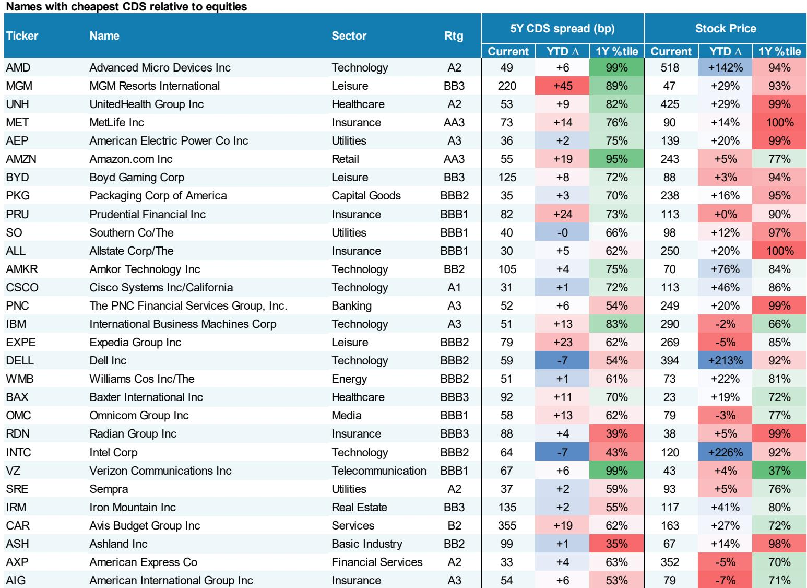
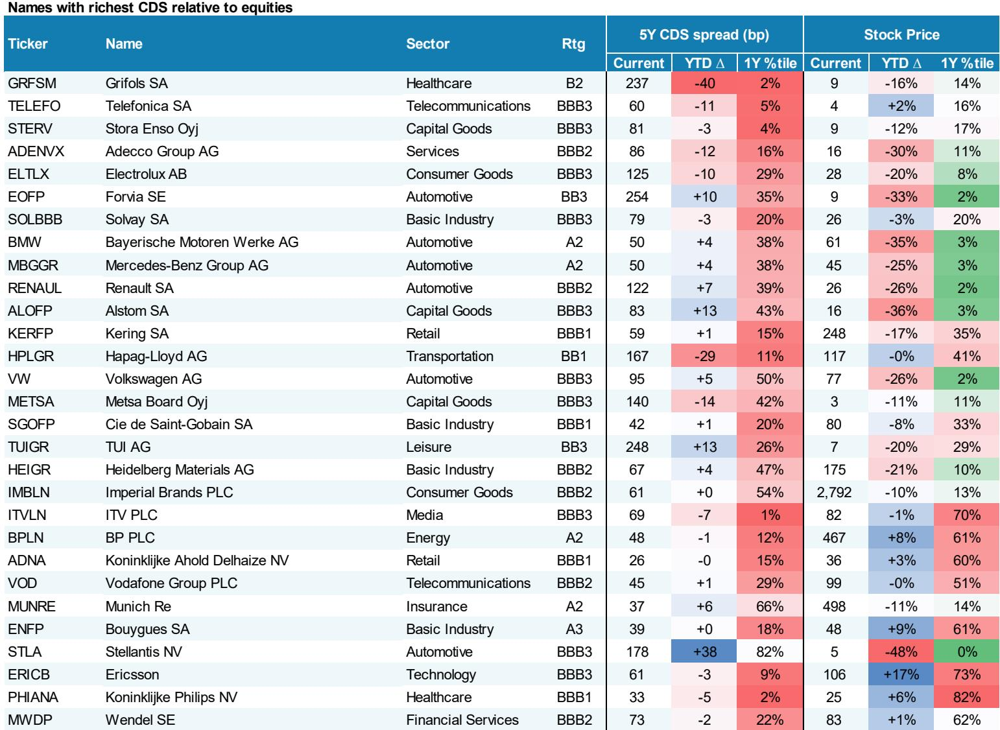
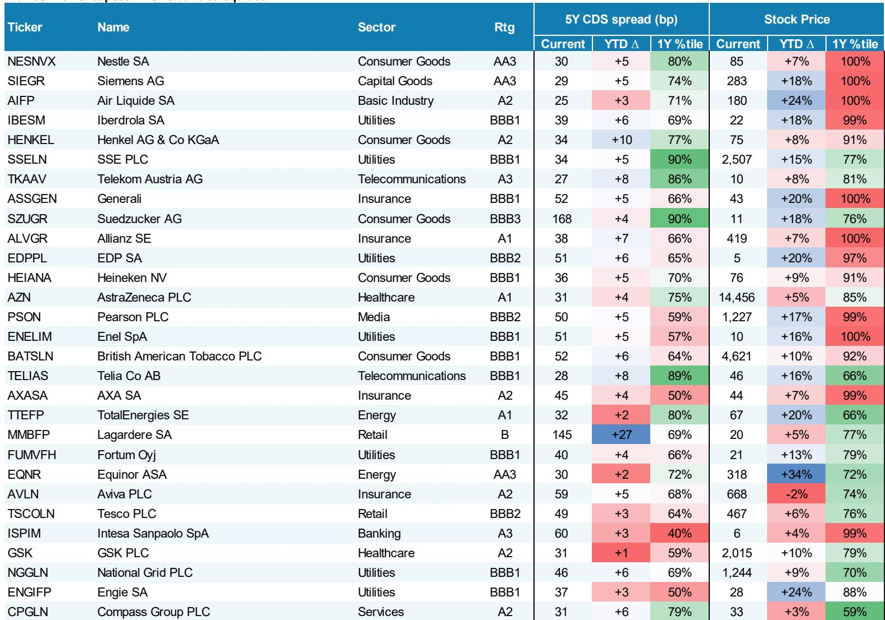

# MS：亚洲高收益债利差压缩能否持续取决于两个变量

全球信用债市场正处在一个微妙的位置：利差处于多年低位，资金持续涌入，供给创下新高。但MS最新发布的全球信用策略报告传递了一个更值得关注的信号——这轮信用债的回报，正在从“买什么都涨”转向“买对结构才赚钱”。报告的核心判断是：利差压缩的空间已经有限，读者需要从久期、评级和区域三个维度重新构建暴露。

这份覆盖美国、欧洲和亚洲信用债市场的周度报告，数据截至2026年7月3日。它没有给出惊天动地的宏观预测，但提供了几个值得反复推敲的观察框架。

## 1. 美国研究级债的“资金洪峰”背后，是市场对利率路径的重新定价

美国研究级债券上周录得68.7亿美元的净流入，这是今年第三大单周流入，年内累计流入已超过907亿美元。与此同时，利差收窄了2个基点，BBB级债券表现优于A级。资金和利差同步改善，看起来是一幅健康的图景。

但报告揭示了一个更微妙的细节：回报表现曲线出现了“牛平”形态，即短端利率节奏变化幅度大于长端。MS在关键提到中明确表示，预期10年-30年期曲线将逐步陡峭化，驱动因素是前端回报表现的小幅下降。这意味着，市场对美联储降息的定价正在从“何时降”转向“降多少”，而长端面临的供给不确定性和财政不确定性并未消除。

> **KC评论：** 资金流入强劲不等于利差会无限压缩。当曲线结构发生变化，读者真正需要关注的是“哪个期限的债券能同时受益于降息预期和利差收窄”，而不是简单买入指数。

## 2. 欧洲信用债的“哑铃策略”背后，是财政不确定性与选举不确定性的对冲

欧洲研究级债券上周仅收窄1个基点，表现落后于美国。但报告最引人注目的提到出现在信用衍生品部分：报告观点法国银行的保护，同时观点偏谨慎iTraxx Senior Financials，以对冲OATs进一步走阔的不确定性。

这个交易结构的逻辑很清晰：法国即将面临选举，财政纪律的可持续性正在被市场重新定价。法国银行作为主权信用的“传导载体”，其信用不确定性与OAT利差的联动性正在上升。MS没有直接说法国主权信用出了什么问题，但通过这个对冲建议，它暗示了一个判断——选举不确定性溢价还没有被完全定价。

> **KC评论：** 这个提到的价值不在于具体的交易执行，而在于它提醒读者：欧洲信用债的利差处于历史低位，但政治不确定性正在从“尾部事件”变成“可对冲的常态”。如果你只盯着利差水平，可能会忽略波动率的上升。

## 3. 亚洲高收益债的利差压缩，能不能持续要看两个变量

亚洲信用债整体利差收窄了3个基点，其中高收益债收窄了11个基点，显著优于研究级。中国研究级利差已经压缩到44个基点，处于五年百分位的3%——几乎是历史最紧水平。

报告没有对亚洲信用给出明确的交易提到，但数据本身提出了一个问题：当中国研究级利差已经低于美国同等评级债券时，进一步压缩的空间有多大？亚洲高收益债的利差虽然也在收窄，但相对水平仍远高于美国同类。这个价差能否持续收敛，取决于两个尚未完全回答的问题：中国房地产行业的信用修复能否从“不再仍在调整”走向“实质性改善”；以及亚洲美元债的供给是否会因为融资成本下降而加速。

## 4. 报告没有完全回答的关键问题：当利差处于五年低位，节奏变化保护在哪里？

当前美国研究级利差74个基点，处于五年百分位的5%；欧洲研究级78个基点，处于五年百分位的6%。几乎所有的信用资产都处于或接近历史最紧水平。这意味着，利差继续收窄带来的超额回报越来越薄，而一旦基本面或流动性出现扰动，利差走阔的幅度可能比想象中大。

报告在衍生品部分提到，信用波动率相对于公司波动率处于历史低位。这个信号值得警惕：当信用市场过于平静的时候，往往是波动率回归的前奏。MS没有给出明确的“观点偏谨慎”信号，但它在提到中强调了对法国银行的对冲、对曲线陡峭化的布局——这些都不是“追涨”的思路，而是“保护”的思路。

对于产业决策者和专业读者而言，这份报告最有价值的不是具体的利差数据，而是它提供了一个观察框架：在信用周期的后段，回报的来源从“方向性赌注”转向“结构性套利”。谁能在久期、评级和区域之间找到正确的组合，谁就能在利差压缩的末期依然获得正超额回报。

For informational purposes only. Portions may be generated,translated,summarized,or edited with AI assistance based on source materials and may contain omissions or errors. Please verify independently. This is not investment,legal,tax,accounting,or other professional advice.

