Software Snippets | Europe

# Are Software Vendors Taking a Bite Out of IT Services?

Important events in the world of Software & Services in the week ahead, and key MS research / stories from the past week.

## Key Takeaways

\- Big Tech's $3.5bn AI deployment push (#Software, #IT Services)

■ Fewer flights, more tokens: SAP plans cost savings to fund AI push (#SAP)

IT Services: Still room for further downside (\*MS Research\*, #Tieto, #IT Services)

■ Buy versus build? Base44 launches its own LLM (#Software, #IONOS)

■ Cloudflare to rein in AI crawlers (#RELX, #Wolters Kluwer, #Informa)

1) Big Tech's $3.5bn AI deployment push (#Software, #IT Services): Microsoft (covered by Josh Baer) this week announced Microsoft Frontier Company "a new operating business focused on delivering Frontier Transformation through AI". Microsoft described the initiative as going beyond traditional Forward Deployed Engineering (FDE), with a $2.5bn investment, 6,000 embedded experts, and support from its SI partner ecosystem, including Capgemini. Separately, Amazon (covered by Brian Nowak) announced a dedicated AWS FDE organisation, backed by $1bn, which "focuses on business outcomes and leaves customers self-sufficient with AI". SAP CEO Christian Klein has also spoken about creating FDE teams (reportedly starting in July 2026). We see these announcements as evidence that enterprises may need more direct vendor support to move from AI experimentation to full deployment. As we have written about previously, this could raise questions about dedicated IT Services firms' role in enterprise AI implementation, as software/cloud vendors move further into hands-on AI transformation services – although Microsoft's partnerships suggest the outcome may prove more collaborative than disruptive.

Exhibit 1: "Forward deployed engineer" mentions since Jan 2025  
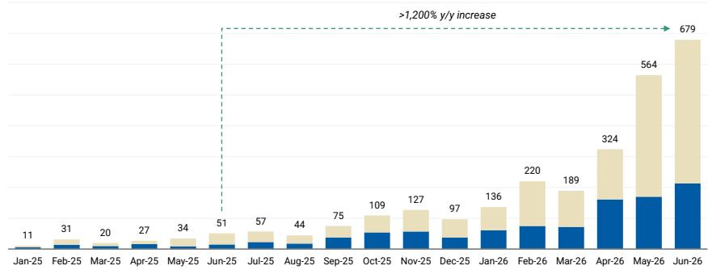  
■ Company Document Count ■ News Document Count  
Note: Company document count and news document count as defined and captured by AlphaSense. Source: AlphaSense (02/07/2026), MS

<table><tr><td colspan="2">MS & CO. INTERNATIONAL PLC+</td></tr><tr><td colspan="2">George W Webb</td></tr><tr><td colspan="2">Equity Analyst</td></tr><tr><td>George.Webb@morganstanley.com</td><td>+44 20 7425-2686</td></tr><tr><td colspan="2">Mark Hyatt</td></tr><tr><td colspan="2">Equity Analyst</td></tr><tr><td>Mark.Hyatt@morganstanley.com</td><td>+44 20 7677-3663</td></tr><tr><td colspan="2">William Richards</td></tr><tr><td colspan="2">Research Associate</td></tr><tr><td>William.Richards1@morganstanley.com</td><td>+44 20 7425-0269</td></tr></table>

## TECHNOLOGY - SOFTWARE & SERVICES

Industry View In-Line

For analyst certification and other important disclosures, refer to the Disclosure Section, located at the end of this report.

+= Analysts employed by non-U.S. affiliates are not registered with FINRA, may not be associated persons of the member and may not be subject to FINRA restrictions on communications with a subject company, public appearances and trading securities held by a research analyst account.

## 2) Fewer flights, more tokens: SAP plans cost savings to fund AI push (#SAP):

Bloomberg reported this week that SAP is cutting back hiring and travel costs (unrelated to AI) to devote more resources to developing AI technology. The company reportedly said "[we will] exclusively focus new hiring on selected profiles only, mainly core AI roles, that are critical for our long-term success", echoing comments made at Sapphire, where SAP acknowledged the need for greater AI investment, including in AI engineering talent. The comments follow a separate management reshuffle reported earlier this week, with CPO Muhammad Alam's product and engineering responsibilities to be split among CEO Christian Klein and COO Sebastian Steinhäuser, according to the article, ahead of Alam's expected departure in early 2027. Bloomberg also reported that "SAP will continue to search outside of the company for a new executive product lead [...] the company will target candidates in the US". Taken together, we see this newsflow as reinforcing the scale of SAP's AI pivot: the company is not only prioritising AI investment, but also reallocating costs, sharpening hiring priorities and reshaping executive accountability around that strategy.

3) IT Services: Still room for further downside (\*MS Research\*, #Tieto, #IT Services): So far, 2026 has been a challenging year for IT Services, with the sector down ~30% YTD as investors grapple with a slower-than-expected recovery in enterprise IT budgets, and rising concerns that AI could structurally disrupt the labour-based revenue model. Despite this industry backdrop, Nordic leader Tieto has been an outlier: broadly flat YTD. Tieto trades on 11x CY26e adj. P/E, a 17%/34% premium to sector bellwethers Accenture and Capgemini, respectively. Given downside risk to both near-term growth expectations and the company's medium-term targets, we see the premium to global peers as unjustified, and reiterate our Underweight rating. See our full note on Tieto here. Our colleague Gaurav Rateria also recently wrote a deep dive on the Indian IT Services vendors, seeing room for further downside from here, and downgraded TCS to Equal-weight. Gaurav writes: "On a relative basis, we find the risk-reward no longer favorable for TCS – we downgrade to EW. We see a lack of signs of any growth acceleration, likely lower margins with accelerated investments and low-single-digit earnings CAGR over the next two years." Read Gaurav's full note here.

Exhibit 2: Historical NTM adj. P/E of Tieto, Accenture, Capgemini, and a group of global IT Services vendors  
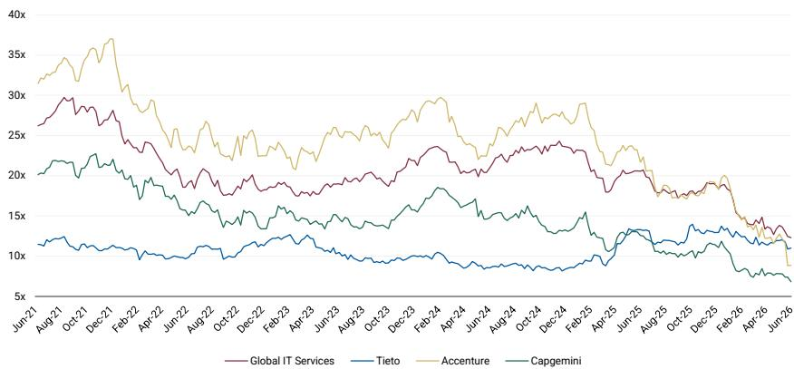  
Note: Global IT Services group constituents = ACN-US, GIB.A-CA, CAP-FR, CTSH-US, IBM-US, LDOS-US, NETC-CSE, 532281-IN, 500209-IN, 532540-IN, 532755-IN, SOP-PAR, 507685-IN, GLOB-US, 532541-IN. Source: FactSet data, MS.

4) Buy versus build? Base44 launches its own LLM (#Software, #IONOS): Base44, an AI-centric software development platform - also known as "vibe coding" - has launched Base 1, its own proprietary LLM. The company was acquired by Wix (covered by Elizabeth Porter) in June 2025, which wrote in a press release this week: "ownership of the model gives Base44 direct control over compute and inference spend, expected to result in a structurally stronger margin profile over time". Back in June, we wrote about French-listed cloud services provider OVH Groupe, which also plans to train its own frontier AI models. While these examples are still anecdotal, they point to a broader strategic question for AI-native software platforms: when does it make sense to keep embedding third-party foundation models, and when does proprietary data, cost control and product differentiation justify owning more of the model layer? The improving capabilities of open-source LLMs may make this a question more companies will consider as they embed AI into their own product set. We have previously explored the implications of vibe coding platforms for web presence vendors, including IONOS, in our note: A Website Is More Than A 'Vibe'.

5) Cloudflare to rein in AI crawlers (#RELX, #Wolters Kluwer, #Informa): In a world where "automated agents and bots drive more than half of all web requests", Cloudflare (covered by Sanjit Singh) recognises that "most site owners want to be discoverable in AI [...] [but] maximizing discovery shouldn't mean giving away intellectual property for free". Starting September 15th, the company has announced that the default settings for new customers and for new sites for existing customers will be set to allow search, but block training and agent use on pages that display ads. This means that without permission from the site owner, crawlers that blend search, agent use, and training, could be blocked. We see this as part of a broader shift toward permissioned, attributable, and potentially monetised use of proprietary content in AI systems. This is particularly relevant for publishers and professional information providers such as RELX, Wolters Kluwer, and Informa, where proprietary data and trusted content remain central to their competitive moats. Relatedly, we note that back in May 2026 Elsevier, a part of RELX's STM business, joined a class-action complaint against Meta alleging the reproduction of copyrighted works in developing the Llama AI model.

Exhibit 3: Key week ahead events

<table><tr><td>Monday06/07/2026</td><td>Tuesday07/07/2026</td><td>Wednesday08/07/2026</td><td>Thursday09/07/2026</td><td>Friday10/07/2026</td></tr><tr><td></td><td></td><td></td><td>TCS 1Q27 Results</td><td></td></tr><tr><td></td><td></td><td></td><td></td><td></td></tr><tr><td></td><td></td><td></td><td></td><td></td></tr><tr><td></td><td></td><td></td><td></td><td></td></tr><tr><td>Key</td><td>MS Europe Coverage</td><td>Other Global Stocks</td><td>Industry Event</td><td>Other</td></tr></table>

Source: MS

## Coverage Valuation vs. European Market

Exhibit 4: European Software & Services NTM P/E vs STOXX Europe 600  
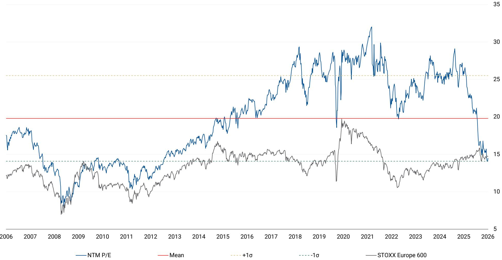  
NB: Mean of CAP, DSY, INF, NEM, REL, SGE, SAP, TEMN, TIETO, and WKL. Price at close as of T-1 business day. Source: FactSet, MS

## Long-Term Valuation Charts

Exhibit 5: Amadeus P/NTM Earnings  
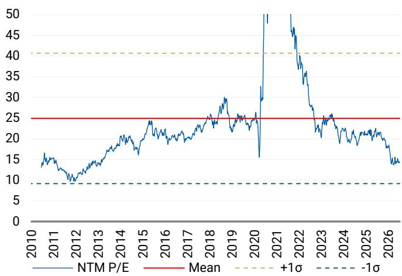  
NB: Price at close as of T-1 business day. Source: FactSet, MS

Exhibit 6: Capgemini P/NTM Earnings  
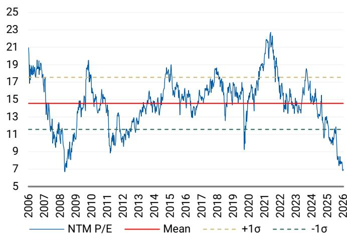  
NB: Price at close as of T-1 business day. Source: FactSet, MS

Exhibit 7: Dassault Systemes P/NTM Earnings  
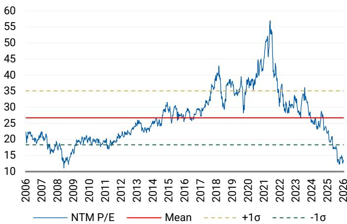  
NB: Price at close as of T-1 business day. Source: FactSet, MS

Exhibit 8: HBX Group International P/NTM Earnings  
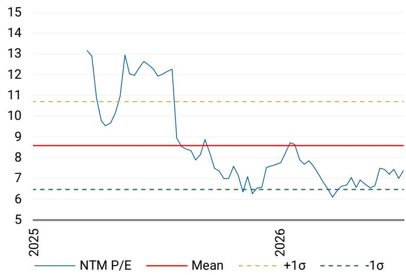  
NB: Price at close as of T-1 business day. Source: FactSet, MS

Exhibit 9: Indra P/NTM Earnings  
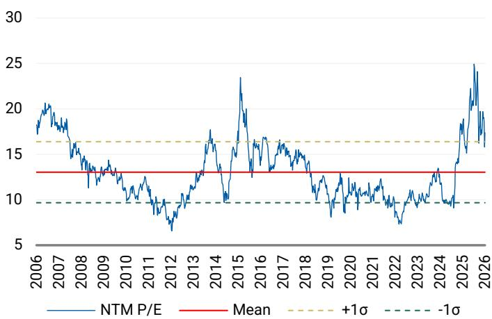  
NB: Price at close as of T-1 business day. Source: FactSet, MS

Exhibit 10: Informa P/NTM Earnings  
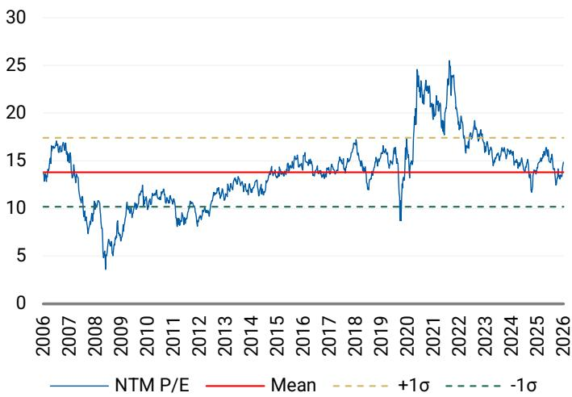  
NB: Price at close as of T-1 business day. Source: FactSet, MS

Exhibit 11: IONOS P/NTM Earnings  
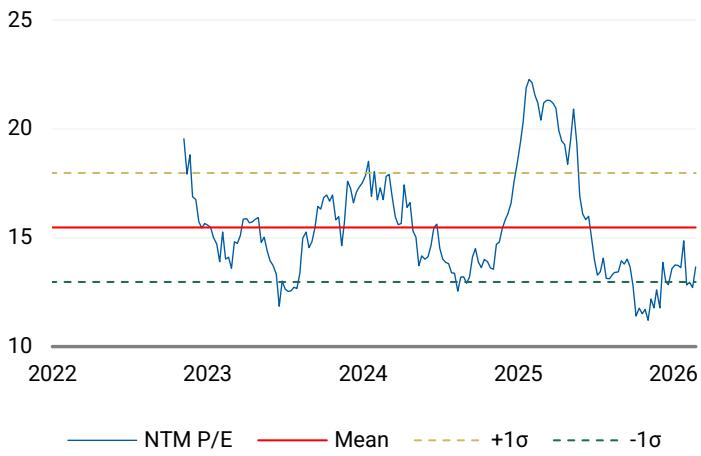  
NB: Price at close as of T-1 business day. Source: FactSet, MS

Exhibit 12: Nemetschek Group P/NTM Earnings  
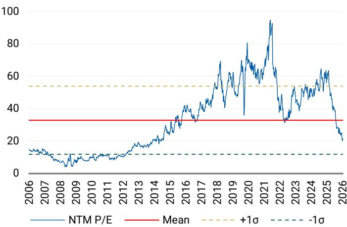  
NB: Price at close as of T-1 business day. Source: FactSet, MS

Exhibit 13: Netcompany P/NTM Earnings  
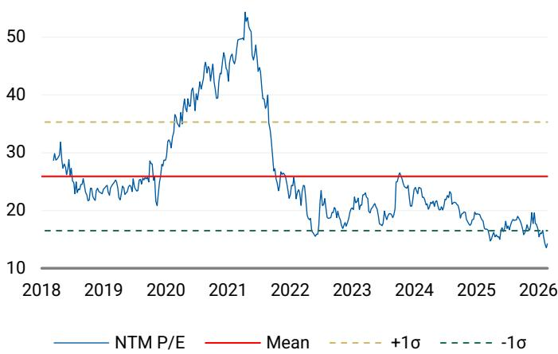  
NB: Price at close as of T-1 business day. Source: FactSet, MS

Exhibit 14: RELX P/NTM Earnings  
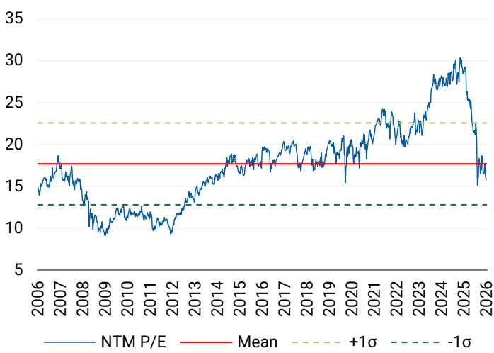  
NB: Price at close as of T-1 business day. Source: FactSet, MS

Exhibit 15: Sage Group P/NTM Earnings  
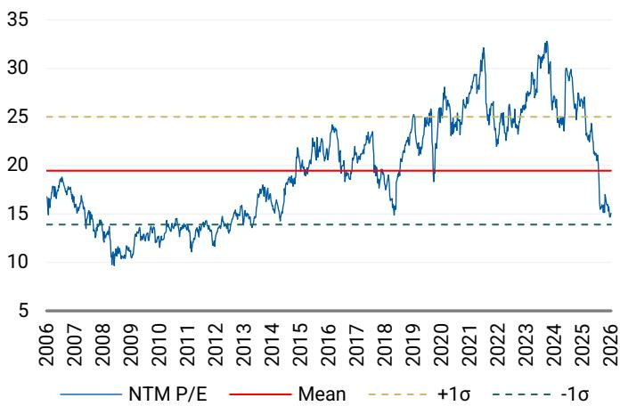  
NB: Price at close as of T-1 business day. Source: FactSet, MS

Exhibit 16: SAP P/NTM Earnings  
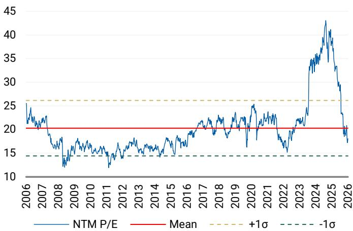  
NB: Price at close as of T-1 business day. Source: FactSet, MS

Exhibit 17: Temenos P/NTM Earnings  
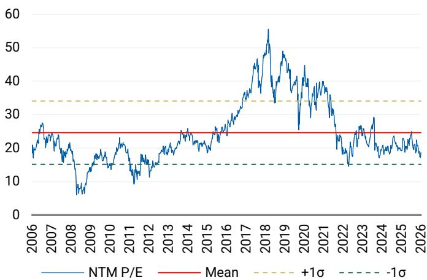  
NB: Price at close as of T-1 business day. Source: FactSet, MS

Exhibit 18: Tieto P/NTM Earnings  
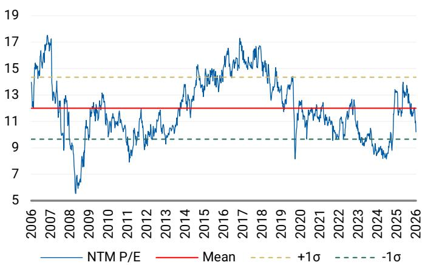  
NB: Price at close as of T-1 business day. Source: FactSet, MS

Exhibit 19: Wolters Kluwer P/NTM Earnings  
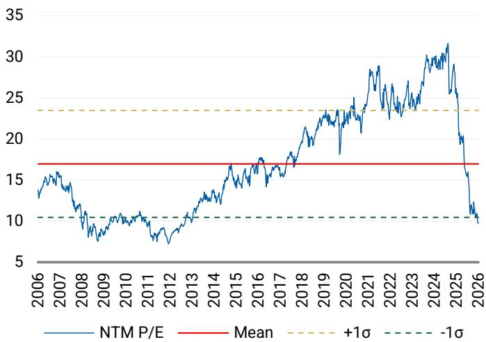  
NB: Price at close as of T-1 business day. Source: FactSet, MS

## Coverage Company Guidance

Exhibit 20: Company Forward Guidance (1/2)

<table><tr><td colspan="3">Published Company Guidance / Targets</td></tr><tr><td></td><td>FY26</td><td>Mid-term / Long-term</td></tr><tr><td>Amadeus</td><td>High single digit revenue growth (in cc)Adj. EBIT margin stable at cc (FY25: 29.1%)Adj. diluted EPS growth at low double-digitFCF between €1.35-1.45 billion</td><td>Over 2026-2028:High single digit annual revenue growth (in cc)Adj. EBIT margin expansion over the periodAdj. diluted EPS growth CAGR at low double-digitFCF growth CAGR at high single digit</td></tr><tr><td>Capgemini</td><td>Revenue growth of +6.5 to 8.5% cc (organic c. 1.5 to 4%, MSe)Operating margin of 13.6% to 13.8%Organic FCF of €1.8 to 1.9bn</td><td>2028 financial ambitions:2025-28 revenue CAGR at cc of +5.5-7.5% (c. +3.5-5.5% organic)Operating Profit pre-acquisition expense to reach 12.1-12.3% of revenue (c. 130-150bps expansion vs 2025)Cumulative organic FCF >€6bn over 2026-28</td></tr><tr><td>Dassault Systemes</td><td>Total revenue growth between 3 to 5% (cc)Software revenue growth 3 to 5% (cc)Services revenue growth of 2 to 6% (cc)Adj. EBIT margin guidance is 32.2 to 32.6%EPS €1.30 to 1.34</td><td>Basic 2029 EPS of €2.4</td></tr><tr><td>HBX Group</td><td>+11 to +15% YoY growth in TTV-4 to +1% YoY revenue growth-5 to -2% adj. EBITDA growthc. 90 to 100% operating FCF conversion</td><td>Low-double digit TTV annual growthHigh-single digit revenue growthLow sixties adj. EBITDA margin %c. 100% cash conversion</td></tr><tr><td>Indra Sistemas</td><td>Revenue >€7,000m in local currencyStated EBIT of >€700mFree cash flow of >€375m</td><td>Long-term (FY24-FY30):Revenues to reach €10bn in FY30EBITDA margins >12% by FY26 and >14% by FY30EBIT margin at 10% in FY26 and 12% in FY30Cumulative FCF of >€3bn from FY24-FY30</td></tr><tr><td>Informa</td><td>6%± underlying revenue growth7%+ B2B Events underlying revenue growth4%± Taylor & Francis underlying revenue growthReturn to revenue growth for TechTargetUnderlying double-digit growth in adj. EPS</td><td>5%+ underlying revenue growth p.a. out to FY28</td></tr><tr><td>IONOS Group</td><td>Group: c. 7% revenue growth with c. 37-38% adj. EBITDA margin (CC)Web Presence & Productivity: 7-8% revenue growth (CC)Cloud Solutions: c. 10% revenue growth (CC)</td><td>Total revenue growth (CAGR) c. 10%Web Presence & Productivity revenue growth (CAGR) c. 9%Cloud Solutions revenue growth (CAGR) c. 20%Adj. EBITDA margin c. 40%Capex (% of revenue) c. 6%</td></tr><tr><td>Nemetschek Group</td><td>14-15% constant currency revenue growth32-33% adj. EBITDA margin</td><td>None</td></tr><tr><td>Netcompany Group</td><td>Group revenue growth of 15-20% y/y (in CC), 5-10% excluding NBSAdj. EBITDA margin of 16-19%, 17-20% excluding NBS</td><td>Long-term:Annual organic revenue growth of 5-10% "through any business cycle"Adj. EBITDA margins >20% by (in) FY29</td></tr><tr><td>RELX</td><td>"We continue to see positive momentum across the group, and we expect another year of strong underlying growth in revenue and adjusted operating profit, as well as strong growth in adjusted earnings per share on a constant currency basis".Buybacks of £2,250m</td><td>None</td></tr></table>

Source: Company data, compiled by MS

Exhibit 21: Company Forward Guidance (2/2)

<table><tr><td colspan="3">Published Company Guidance / Targets</td></tr><tr><td></td><td>FY26</td><td>Mid-term / Long-term</td></tr><tr><td>Sage Group</td><td>Organic total revenue growth in FY26 to be above 9%Operating margins are expected to trend upwards in FY26 and beyond</td><td>None</td></tr><tr><td>SAP</td><td>Cloud revenue of €25.8-26.2bn at cc (23% to 25% cc growth).Cloud and software revenue of €36.3-36.8bn at cc (12%-13% cc growth).Non-IFRS EBIT of €11.9-12.3bn (14-18% cc growth).Free cash flow c. €10bn</td><td>Expect total revenue growth to accelerate in 2027.Total operating expenses are expected to grow at 80 to 90% of total revenue growth in 2027.</td></tr><tr><td>Temenos</td><td>ARR growth of c. 12%Subscription and SaaS growth of c. 9%EBIT growth c. 9%FCF growth c. 16% (reported)</td><td>Mid-term (FY28):ARR to reach >$1.23bnNon-IFRS EBIT of at least c.$480mFCF of at least $410m</td></tr><tr><td>Tieto</td><td>Organic growth of -2% to 0% andAdj. EBITA margins of 14.8 to 15.8%</td><td>Annual revenue growth of over 5% CAGR in 2027-2028EBITA margins of over 16% by 2028</td></tr><tr><td>Wolters Kluwer</td><td>Good organic revenue growthAdj. EBIT margin: c. 28%Diluted adj. EPS growth (%, cc): High single digit growthAdj. FCF (EUR, cc): €1,300m to €1,350m</td><td>None</td></tr></table>

Source: Company data, compiled by MS

## Appendix: MS European Software & Services Coverage

Exhibit 22: Coverage Summary

<table><tr><td>Company</td><td>Analyst</td></tr><tr><td>Amadeus</td><td>George Webb</td></tr><tr><td>Capgemini</td><td>George Webb</td></tr><tr><td>Dassault Systemes</td><td>George Webb</td></tr><tr><td>HBX Group International</td><td>Mark Hyatt</td></tr><tr><td>Hexagon AB</td><td>George Webb</td></tr><tr><td>Indra Sistemas</td><td>Adam Wood</td></tr><tr><td>Informa</td><td>George Webb</td></tr><tr><td>IONOS Group</td><td>George Webb</td></tr><tr><td>Nemetschek Group</td><td>George Webb</td></tr><tr><td>Netcompany</td><td>George Webb</td></tr><tr><td>RELX</td><td>George Webb</td></tr><tr><td>Sage Group</td><td>George Webb</td></tr><tr><td>SAP</td><td>Adam Wood</td></tr><tr><td>Temenos</td><td>Mark Hyatt</td></tr><tr><td>Tieto</td><td>Mark Hyatt</td></tr><tr><td>Wolters Kluwer</td><td>George Webb</td></tr></table>

Source: MS

<table><tr><td>Rating</td><td colspan="2">Price Target</td></tr><tr><td>Overweight</td><td>EUR</td><td>65.00</td></tr><tr><td>Equal-weight</td><td>EUR</td><td>117.00</td></tr><tr><td>Equal-weight</td><td>EUR</td><td>21.75</td></tr><tr><td>Equal-weight</td><td>EUR</td><td>7.90</td></tr><tr><td>N/A</td><td>N/A</td><td>N/A</td></tr><tr><td>Equal-weight</td><td>EUR</td><td>60.00</td></tr><tr><td>Overweight</td><td>GBp</td><td>1,085.00</td></tr><tr><td>Equal-weight</td><td>EUR</td><td>29.40</td></tr><tr><td>Equal-weight</td><td>EUR</td><td>74.25</td></tr><tr><td>Underweight</td><td>DKK</td><td>334.00</td></tr><tr><td>Equal-weight</td><td>GBp</td><td>2,970.00</td></tr><tr><td>Overweight</td><td>GBp</td><td>1,110.00</td></tr><tr><td>Overweight</td><td>EUR</td><td>190.00</td></tr><tr><td>Underweight</td><td>CHF</td><td>59.00</td></tr><tr><td>Underweight</td><td>EUR</td><td>16.00</td></tr><tr><td>Equal-weight</td><td>EUR</td><td>80.50</td></tr></table>

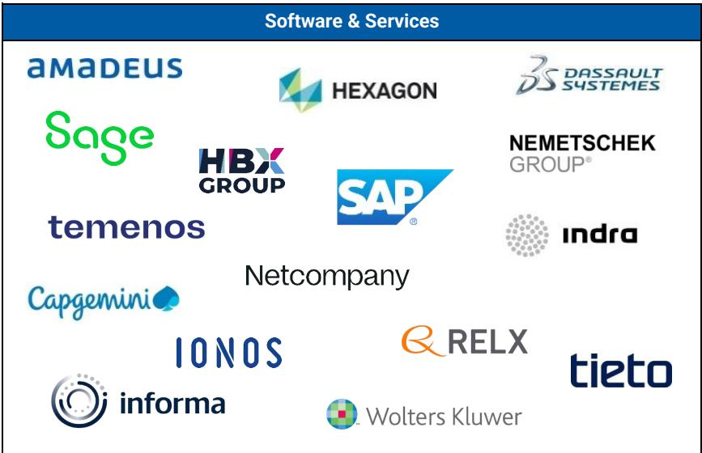

## Disclosure Section

The information and opinions in MS were prepared or are disseminated by MS Europe S.E., regulated by Bundesanstalt fuer Finanzdienstleistungsaufsicht (BaFin) and/or MS & Co. International plc, authorized by the Prudential Regulation Authority and regulated by the Financial Conduct Authority and the Prudential Regulation Authority. MS & Co. International plc disseminates in the UK research that it has prepared, and which has been prepared by any of its affiliates, only to persons who (i) are investment professionals falling within Article 19(5) of the Financial Services and Markets Act 2000 (Financial Promotion) Order 2005 (as amended, the "Order"); (ii) are persons who are high net worth entities falling within Article 49(2)(a) to (d) of the Order; or (iii) are persons to whom an invitation or inducement to engage in investment activity (within the meaning of section 21 of the Financial Services and Markets Act 2000, as amended) may otherwise lawfully be communicated or caused to be communicated. As used in this disclosure section, MS includes RMB MS Proprietary Limited, MS Europe S.E., MS & Co International plc and its affiliates.

For important disclosures, stock price charts and equity rating histories regarding companies that are the subject of this report, please see the MS Disclosure Website at www.morganstanley.com/eqr/disclosures/webapp/generalresearch, or contact your investment representative or MS at 1585 Broadway, (Attention: Research Management), New York, NY, 10036 USA.

For valuation methodology and risks associated with any recommendation, rating or price target referenced in this research report, please contact the Client Support Team as follows: US/Canada +1 800 303-2495; Hong Kong +852 2848-5999; Latin America +1 718 754-5444 (U.S.); London +44 (0)20-7425-8169; Singapore +65 6834-6860; Sydney +61 (0)2-9770-1505; Tokyo +81 (0)3-6836-9000. Alternatively you may contact your investment representative or MS at 1585 Broadway, (Attention: Research Management), New York, NY 10036 USA.

## Analyst Certification

The following analysts hereby certify that their views about the companies and their securities discussed in this report are accurately expressed and that they have not received and will not receive direct or indirect compensation in exchange for expressing specific recommendations or views in this report: Mark Hyatt; William Richards; George W Webb.

## Global Research Conflict Management Policy

MS has been published in accordance with our conflict management policy, which is available at www.morganstanley.com/institutional/research/conflictpolicies. A Portuguese version of the policy can be found at www.morganstanley.com.br

## Important Regulatory Disclosures on Subject Companies

As of May 29, 2026, MS beneficially owned 1% or more of a class of common equity securities of the following companies covered in MS: Amadeus IT Holdings S.A., Capgemini, Indra, Informa, Nemetschek SE, RELX, Sage, SAP SE, Wolters Kluwer.

Within the last 12 months, MS managed or co-managed a public offering (or 144A offering) of securities of Capgemini, Informa, SAP SE.

Within the last 12 months, MS has received compensation for investment banking services from Capgemini, Dassault Systemes SA, Hexagon AB, Indra, Informa, SAP SE.

In the next 3 months, MS expects to receive or intends to seek compensation for investment banking services from Amadeus IT Holdings S.A., Capgemini, Dassault Systemes SA, Hexagon AB, Indra, Informa, IONOS Group SE, Nemetschek SE, Netcompany Group A/S, RELX, Sage, SAP SE, Temenos Group AG, Tieto Oyj, Wolters Kluwer.

Within the last 12 months, MS has received compensation for products and services other than investment banking services from Amadeus IT Holdings S.A., Capgemini, Dassault Systemes SA, HBX Group International PLC, Hexagon AB, Informa, RELX, SAP SE, Tieto Oyj.

Within the last 12 months, MS has provided or is providing investment banking services to, or has an investment banking client relationship with, the following company: Amadeus IT Holdings S.A., Capgemini, Dassault Systemes SA, Hexagon AB, Indra, Informa, IONOS Group SE, Nemetschek SE, Netcompany Group A/S, RELX, Sage, SAP SE, Temenos Group AG, Tieto Oyj, Wolters Kluwer.

Within the last 12 months, MS has either provided or is providing non-investment banking, securities-related services to and/or in the past has entered into an agreement to provide services or has a client relationship with the following company: Amadeus IT Holdings S.A., Capgemini, Dassault Systemes SA, HBX Group International PLC, Hexagon AB, Informa, RELX, Sage, SAP SE, Tieto Oyj, Wolters Kluwer.

MS & Co. International plc is a corporate broker to Informa, Sage.

The equity research analysts or strategists principally responsible for the preparation of MS have received compensation based upon various factors, including quality of research, investor client feedback, stock picking, competitive factors, firm revenues and overall investment banking revenues. Equity Research analysts' or strategists' compensation is not linked to investment banking or capital markets transactions performed by MS or the profitability or revenues of particular trading desks.

MS and its affiliates do business that relates to companies/instruments covered in MS, including market making, providing liquidity, fund management, commercial banking, extension of credit, investment services and investment banking. MS sells to and buys from customers the securities/instruments of companies covered in MS on a principal basis. MS may have a position in the debt of the Company or instruments discussed in this report. MS trades or may trade as principal in the debt securities (or in related derivatives) that are the subject of the debt research report.

Certain disclosures listed above are also for compliance with applicable regulations in non-US jurisdictions.

## STOCK RATINGS

MS uses a relative rating system using terms such as Overweight, Equal-weight, Not-Rated or Underweight (see definitions below). MS does not assign ratings of Buy, Hold or Sell to the stocks we cover. Overweight, Equal-weight, Not-Rated and Underweight are not the equivalent of buy, hold and sell. Investors should carefully read the definitions of all ratings used in MS. In addition, since MS contains more complete information concerning the analyst's views, investors should carefully read MS, in its entirety, and not infer the contents from the rating alone. In any case, ratings (or research) should not be used or relied upon as investment advice. An investor's decision to buy or sell a stock should depend on individual circumstances (such as the investor's existing holdings) and other considerations.

## Global Stock Ratings Distribution

(as of June 30, 2026)

The Stock Ratings described below apply to MS's Fundamental Equity Research and do not apply to Debt Research produced by the Firm.

For disclosure purposes only (in accordance with FINRA requirements), we include the category headings of Buy, Hold, and Sell alongside our ratings of Overweight, Equal-weight, Not-Rated and Underweight. MS does not assign ratings of Buy, Hold or Sell to the stocks we cover. Overweight, Equal-weight, Not-Rated and Underweight are not the equivalent of buy, hold, and sell but represent recommended relative weightings (see definitions below). To satisfy regulatory requirements, we correspond Overweight, our most positive stock rating, with a buy recommendation; we correspond Equal-weight and Not-Rated to hold and Underweight to sell recommendations, respectively.

<table><tr><td></td><td colspan="2">Coverage Universe</td><td colspan="3">Investment Banking Clients (IBC)</td><td colspan="2">Other Material Investment ServicesClients (MISC)</td></tr><tr><td>Stock RatingCategory</td><td>Count</td><td>% of Total</td><td>Count</td><td>% of Total IBC</td><td>% of RatingCategory</td><td>Count</td><td>% of Total OtherMISC</td></tr><tr><td>Overweight/Buy</td><td>1544</td><td>42%</td><td>453</td><td>49%</td><td>29%</td><td>757</td><td>44%</td></tr><tr><td>Equal-weight/Hold</td><td>1577</td><td>43%</td><td>390</td><td>42%</td><td>25%</td><td>769</td><td>44%</td></tr><tr><td>Not-Rated/Hold</td><td>3</td><td>0%</td><td>1</td><td>0%</td><td>33%</td><td>1</td><td>0%</td></tr><tr><td>Underweight/Sell</td><td>544</td><td>15%</td><td>89</td><td>10%</td><td>16%</td><td>204</td><td>12%</td></tr><tr><td>Total</td><td>3,668</td><td></td><td>933</td><td></td><td></td><td>1731</td><td></td></tr></table>

Data include common stock and ADRs currently assigned ratings. Investment Banking Clients are companies from whom MS received investment banking compensation in the last 12 months. Due to rounding off of decimals, the percentages provided in the "% of total" column may not add up to exactly 100 percent.

## Analyst Stock Ratings

Overweight (O). The stock's total return is expected to exceed the average total return of the analyst's industry (or industry team's) coverage universe, on a risk-adjusted basis, over the next 12-18 months.

Equal-weight (E). The stock's total return is expected to be in line with the average total return of the analyst's industry (or industry team's) coverage universe, on a risk-adjusted basis, over the next 12-18 months.

Not-Rated (NR). Currently the analyst does not have adequate conviction about the stock's total return relative to the average total return of the analyst's industry (or industry team's) coverage universe, on a risk-adjusted basis, over the next 12-18 months.

Underweight (U). The stock's total return is expected to be below the average total return of the analyst's industry (or industry team's) coverage universe, on a risk-adjusted basis, over the
