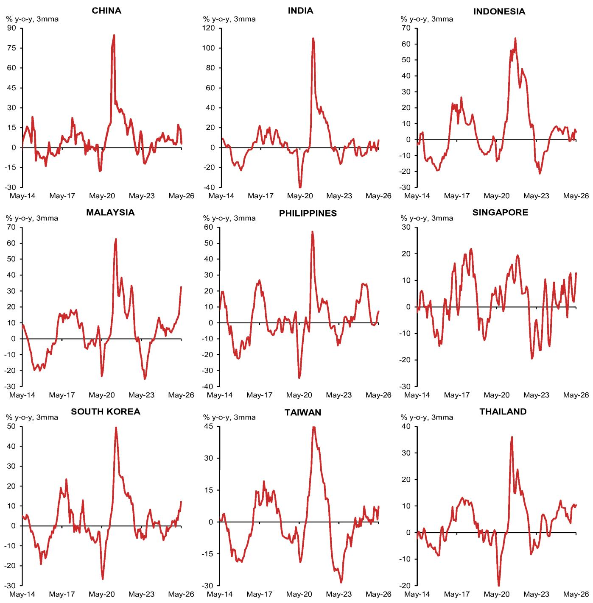
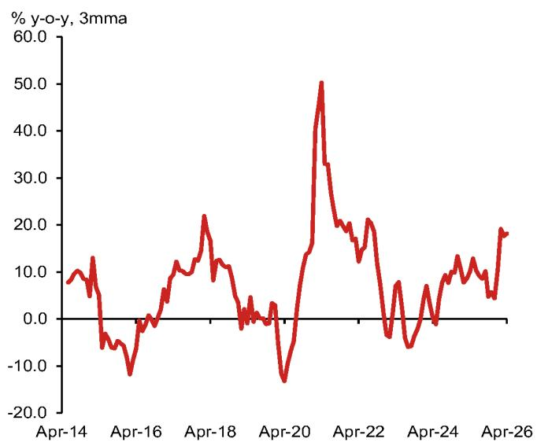
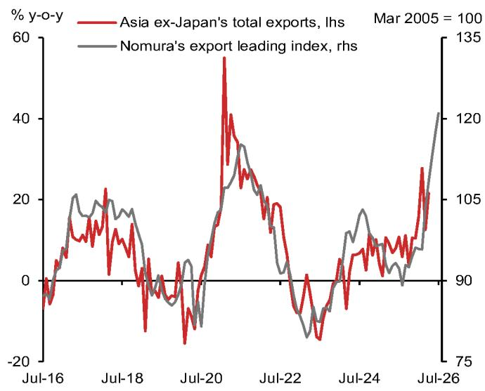

Economics - Asia Pacific/Asia ex-Japan

## Asia: Is the export upcycle broadening beyond tech?

AI-related investment spillovers, commodity price effects and a boost to EV exports due to the push for energy security are driving non-tech export growth.

- Non-tech exports finally pick up: After lagging the broader export recovery through much of 2025, non-tech export growth has accelerated into double-digit territory since early 2026. By country, this is most apparent in the open economies, namely Malaysia, Singapore, South Korea, Taiwan and Thailand.

- Three drivers of non-tech export growth: 1) Capital goods – like electrical machinery and precision instruments – have led the recovery, reflecting spillovers from the AI-driven capex cycle; 2) Several traditional products such as chemicals, mineral products & fuel, plastics & rubber, and precious metals have improved due to price effects; and 3) the push towards energy security have boosted EV exports, particularly from China.

- Outlook on non-tech exports: We expect a durable recovery in capital goods exports (machinery), but export growth in the commodity-related sectors is likely to moderate as war-driven price effects unwind, since underlying demand is still subdued. The recovery in auto exports also remains heavily concentrated in China. Overall, the outlook for non-tech export growth appears mixed.

## Non-tech exports finally stage a recovery

After lagging the broader export recovery through much of 2025, non-tech exports have gathered momentum in recent months (Figure 1). Non-tech export growth has accelerated into double-digit territory since early 2026, reaching 10.9% y-o-y in May from -2.2% in October 2025. This suggests the export upcycle is broadening and is no longer confined to semiconductors and AI servers.

Fig. 1: AeJ tech versus non-tech exports  
  
Source: CEIC and NOM Global Economics.

## Non-tech export growth: By country

By country, the recovery in non-tech export growth is most visible in the open economies, namely Malaysia, Singapore, South Korea, Taiwan and Thailand (Figure 2).

## Research Analysts

Asia Economics

Si Ying Toh, CFA - NSL

siying.toh@NOM.com

+65 6433 6666

Sonal Varma - NSL

sonal.varma@NOM.com

+65 6433 6527

Fig. 2: Picture book: Non-tech export growth across Asia  
  
Source: CEIC and NOM Global Economics.

## Non-tech export growth: By product

We find that the strongest improvement is visible in capital goods, particularly electrical machinery and optical & precision instruments (Figures 3 and 4). In addition, export growth has also improved across several traditional product segments, including chemicals, mineral & fuel products, plastics & rubber, precious metals & jewellery, and autos.

Fig. 3: Asia ex-Japan non-tech export growth, by product category (% y-o-y)

<table><tr><td rowspan="3"></td><td colspan="10">Asia ex-Japan non-tech export growth, by product category (% y-o-y)</td></tr><tr><td colspan="4">2024</td><td colspan="4">2025</td><td colspan="2">2026</td></tr><tr><td>Q1</td><td>Q2</td><td>Q3</td><td>Q4</td><td>Q1</td><td>Q2</td><td>Q3</td><td>Q4</td><td>Q1</td><td>Apr</td></tr><tr><td>Food, beverages and tobacco</td><td>-2.5</td><td>4.2</td><td>4.4</td><td>14.6</td><td>10.5</td><td>8.2</td><td>8.0</td><td>0.9</td><td>1.7</td><td>10.0</td></tr><tr><td>Mineral products, fuel and fertilizers</td><td>-6.9</td><td>8.9</td><td>-10.5</td><td>-19.7</td><td>-19.0</td><td>-16.7</td><td>-2.2</td><td>-1.9</td><td>0.6</td><td>33.6</td></tr><tr><td>Chemicals</td><td>-7.3</td><td>0.1</td><td>2.7</td><td>4.7</td><td>0.2</td><td>0.0</td><td>3.6</td><td>5.4</td><td>8.8</td><td>26.1</td></tr><tr><td>Pharmaceuticals</td><td>2.9</td><td>5.2</td><td>5.7</td><td>0.0</td><td>7.0</td><td>11.4</td><td>12.6</td><td>15.0</td><td>4.1</td><td>1.4</td></tr><tr><td>Plastics &amp; rubber</td><td>4.2</td><td>7.3</td><td>6.2</td><td>10.3</td><td>2.1</td><td>1.0</td><td>0.3</td><td>-5.7</td><td>3.1</td><td>15.0</td></tr><tr><td>Hides, leather, wood, ceramic and glass</td><td>1.6</td><td>-3.4</td><td>-5.8</td><td>-0.7</td><td>-7.6</td><td>-0.4</td><td>-1.5</td><td>-8.0</td><td>7.4</td><td>-9.9</td></tr><tr><td>Textiles, apparel, footwear and headgear</td><td>3.7</td><td>0.1</td><td>-0.9</td><td>8.4</td><td>-1.9</td><td>0.3</td><td>-2.6</td><td>-8.1</td><td>5.1</td><td>-0.5</td></tr><tr><td>Precious metals &amp; jewelry</td><td>1.3</td><td>5.3</td><td>13.5</td><td>11.3</td><td>48.8</td><td>20.1</td><td>29.4</td><td>22.4</td><td>23.1</td><td>26.7</td></tr><tr><td>Base metals and related products</td><td>-1.4</td><td>2.4</td><td>4.6</td><td>12.3</td><td>1.0</td><td>4.1</td><td>6.1</td><td>4.0</td><td>10.8</td><td>6.7</td></tr><tr><td>Machinery</td><td>3.3</td><td>4.2</td><td>7.7</td><td>13.4</td><td>8.6</td><td>10.3</td><td>10.1</td><td>4.4</td><td>17.6</td><td>14.0</td></tr><tr><td>Autos</td><td>4.9</td><td>7.1</td><td>6.3</td><td>4.5</td><td>3.1</td><td>7.1</td><td>11.4</td><td>16.7</td><td>21.0</td><td>17.0</td></tr><tr><td>Ships</td><td>37.0</td><td>37.1</td><td>65.4</td><td>22.6</td><td>4.6</td><td>25.8</td><td>30.6</td><td>32.5</td><td>47.1</td><td>-2.0</td></tr><tr><td>Trains and aircraft</td><td>52.7</td><td>29.7</td><td>54.6</td><td>64.4</td><td>11.3</td><td>-5.4</td><td>-13.0</td><td>-31.2</td><td>-3.4</td><td>-3.7</td></tr><tr><td>Optical and precision instruments</td><td>-1.6</td><td>-2.2</td><td>7.4</td><td>9.8</td><td>7.0</td><td>9.1</td><td>7.8</td><td>5.6</td><td>12.3</td><td>19.5</td></tr><tr><td>Others</td><td>6.0</td><td>1.0</td><td>-2.8</td><td>5.3</td><td>-0.6</td><td>3.6</td><td>-3.9</td><td>-10.4</td><td>7.2</td><td>-1.3</td></tr></table>

Source: CEIC and NOM Global Economics.

## What is driving non-tech export growth?

We see three key drivers behind the recovery in non-tech exports:

1. AI-related investment spillovers: We believe the recovery in machinery exports is driven by spillover effects from the ongoing AI-related capex upcycle. Investment in AI infrastructure, data centres, electrification and industrial automation has generated demand well beyond semiconductor manufacturing. Building AI infrastructure requires substantial investment in electrical equipment, precision instruments, industrial machinery and more. As a result, beneficiaries of the current capex cycle are no longer limited to chip producers. Unsurprisingly, the improvement in capital goods exports, in particular electrical machinery and optical & precision instruments, has been most evident in Malaysia, Taiwan, Singapore and China, reflecting their dominant positions in precision engineering and their ability to capitalize on spillover effects from AI demand.

2. Commodity price effects: Supply disruptions caused by the US-Iran war had led to higher energy and petrochemical prices, lifting the export values of mineral products & fuel (across Asia), chemicals (China, Malaysia, Singapore, South Korea and Thailand), and plastics & rubber (China, Malaysia, Thailand, South Korea and Taiwan), while heightened geopolitical uncertainty has boosted precious metal prices. These gains have been driven primarily by favourable price effects rather than a sustained improvement in underlying demand.

3. Energy security boosts EV exports: The Iran-US war has refocused the policy push towards energy security and greater EV penetration. The benefit of this primarily accrues to China's expanding vehicle exports. Chinese manufacturers continue to gain global market share through strong competitiveness in EVs, aggressive pricing and a continued expansion into overseas markets. In May, China's auto export growth (including chassis) remained elevated at $39.3\%$ y-o-y. Korea's aggregate auto exports stayed tepid in June, due to weaker internal combustion engine exports, but its hybrid $(38.6\%$ y-o-y) and EV $(18.1\%)$ exports are strong. Auto exports from other Asian economies remain subdued amid increasing competitive pressure from Chinese producers.

Fig. 4: Asia ex-Japan machinery exports (% y-o-y, 3mma)  
  
Source: CEIC and NOM Global Economics.

Fig. 5: NOM's leading index of Asian exports  
  
Note: NOM's export leading index can be found on Bloomberg (see ticker: NMEIXLI). Asia ex-Japan's aggregate (nominal) exports include those of China, Hong Kong, India, Indonesia, South Korea, Malaysia, the Philippines, Singapore, Taiwan and Thailand. China's exports to Hong Kong are excluded due to outsized swings on some occasions that seem unrelated to trade activity. NOM's export leading index is a weighted (inverse of mean-squared errors) sum of the following Z-score standardized variables: Shanghai Shipping Exchange Containerized Freight Index, China's imports, China's imports from Asia, global semiconductor sales, US manufacturing ISM, S&P EM manufacturing PMI, China RatingDog (formerly Caixin) manufacturing PMI, South Korea's semiconductor exports and Philadelphia Semiconductor index. (For more details on its construction, see Re-calibrating our Asia export leading index, 16 August 2022). Source: IHS Markit, CEIC, Bloomberg and NOM Global Economics.

## Will the recovery in non-tech exports sustain?

We believe the outlook for non-tech export growth is mixed.

## The positives

Our NOM Export Leading Index (NELI) continues to signal that Asia's export upcycle should extend into Q3 (Figure 5). Importantly, the recent improvement in the index has become increasingly broad-based, supported not only by tech-related indicators but also by improving manufacturing sentiment and firmer demand from China. This suggests that the recovery is gradually spreading across the wider manufacturing complex.

We remain most positive on capital goods, particularly electrical machinery and precision instruments, where the ongoing AI-driven capex upcycle should continue to generate spillover demand, providing a more durable source of export growth.

Inventory dynamics reinforce this view. Within non-tech manufacturing, electrical equipment has experienced the most notable improvement. Its I-S ratio has fallen to 1.05 in April from an average of 1.14 in 2025, as shipments strengthened while inventories were steadily reduced (Figure 6). Interestingly, production growth in electrical equipment has turned negative (Figure 7), despite stronger exports, which suggests firms are currently fulfilling demand through inventory drawdowns rather than increased production. If export demand remains firm, inventories will eventually become sufficiently lean to necessitate a recovery in production. Basic metals present a similarly constructive picture, with its I-S ratio easing to 1.11 from 1.19, driven by a combination of firmer shipments and declining inventories, pointing to a gradual recovery in industrial activity.

## The negatives

By contrast, the drivers are less supportive for chemicals and autos. In the chemicals sector, inventories have fallen primarily because producers have curtailed output rather than a material strengthening of shipments, which suggests underlying demand remains relatively subdued. Combined with our view that recent export gains have been supported by higher energy and commodity prices owing to the US-Iran war, the recent pickup in chemicals exports appears less likely to prove durable.

Similarly, although regional auto exports have improved, the recovery remains highly concentrated in China. Elsewhere in Asia, inventory-to-shipment ratios for autos continue to rise as inventories accumulate against sluggish shipments, consistent with softer external demand and growing competitive pressure from Chinese automakers. Unless demand strengthens more broadly or competitive pressures ease, the regional auto export recovery is likely to remain uneven.

Finally, export growth in other sectors that have benefited from temporary geopolitical price effects – including mineral & fuel products, plastics & rubber, and precious metals – are likely to moderate as these price effects unwind, since underlying demand is still soft.

Overall, non-tech export growth has picked up, but its drivers and the country-level dynamics reveal an uneven recovery.

Fig. 6: Inventory-to-shipment ratios (sa), by country and sector

<table><tr><td></td><td>2011-2019 average</td><td>2024 average</td><td>2025 average</td><td>Latest</td></tr><tr><td>Average</td><td>0.93</td><td>1.11</td><td>1.06</td><td>1.02</td></tr><tr><td>Semiconductor</td><td>1.32</td><td>0.97</td><td>0.80</td><td>0.78</td></tr><tr><td>Chemicals</td><td>0.89</td><td>1.08</td><td>1.10</td><td>1.07</td></tr><tr><td>Basic metals</td><td>0.90</td><td>1.14</td><td>1.19</td><td>1.11</td></tr><tr><td>Autos</td><td>0.81</td><td>1.24</td><td>1.29</td><td>1.44</td></tr><tr><td>Electrical equipment</td><td>0.88</td><td>1.14</td><td>1.14</td><td>1.05</td></tr><tr><td>Japan</td><td>0.89</td><td>1.03</td><td>1.01</td><td>0.95</td></tr><tr><td>Semiconductor</td><td>1.51</td><td>0.68</td><td>0.62</td><td>0.52</td></tr><tr><td>Chemicals</td><td>0.80</td><td>0.95</td><td>0.95</td><td>0.91</td></tr><tr><td>Basic metals</td><td>0.85</td><td>1.02</td><td>1.01</td><td>1.01</td></tr><tr><td>Autos</td><td>0.96</td><td>1.21</td><td>1.08</td><td>1.31</td></tr><tr><td>Electrical equipment</td><td>0.87</td><td>1.16</td><td>1.16</td><td>0.97</td></tr><tr><td>South Korea</td><td>0.88</td><td>1.05</td><td>0.97</td><td>0.98</td></tr><tr><td>Semiconductor</td><td>1.55</td><td>0.93</td><td>0.58</td><td>0.53</td></tr><tr><td>Chemicals</td><td>0.92</td><td>1.09</td><td>1.11</td><td>1.09</td></tr><tr><td>Basic metals</td><td>0.80</td><td>0.98</td><td>1.01</td><td>0.98</td></tr><tr><td>Autos</td><td>0.60</td><td>0.97</td><td>1.05</td><td>1.13</td></tr><tr><td>Electrical equipment</td><td>0.85</td><td>0.95</td><td>0.83</td><td>0.78</td></tr><tr><td>Taiwan</td><td>1.00</td><td>1.25</td><td>1.19</td><td>1.12</td></tr><tr><td>Semiconductor</td><td>0.90</td><td>1.29</td><td>1.18</td><td>1.28</td></tr><tr><td>Chemicals</td><td>0.96</td><td>1.20</td><td>1.23</td><td>1.23</td></tr><tr><td>Basic metals</td><td>1.06</td><td>1.43</td><td>1.55</td><td>1.36</td></tr><tr><td>Autos</td><td>0.87</td><td>1.55</td><td>1.74</td><td>1.88</td></tr><tr><td>Electrical equipment</td><td>0.92</td><td>1.31</td><td>1.43</td><td>1.42</td></tr></table>

Note: Latest refers to April 2026.  
Source: CEIC and NOM Global Economics.

Fig. 7: Industrial production, by country and sector

<table><tr><td></td><td>2023</td><td>2024</td><td>2025</td><td>2026 ytd</td><td>Latest</td></tr><tr><td></td><td colspan="5">% y-o-y</td></tr><tr><td>Average</td><td>-4.0</td><td>3.6</td><td>6.4</td><td>8.5</td><td>6.4</td></tr><tr><td>Electronics</td><td>-4.8</td><td>11.6</td><td>11.7</td><td>14.4</td><td>11.8</td></tr><tr><td>Chemicals</td><td>-6.8</td><td>0.6</td><td>-0.8</td><td>-0.6</td><td>-3.7</td></tr><tr><td>Basic metals</td><td>-3.6</td><td>-1.9</td><td>-3.3</td><td>1.0</td><td>3.0</td></tr><tr><td>Autos</td><td>9.6</td><td>-4.8</td><td>-1.4</td><td>-0.3</td><td>-2.6</td></tr><tr><td>Electrical equipment</td><td>-2.6</td><td>-2.1</td><td>1.7</td><td>-1.5</td><td>-1.2</td></tr><tr><td>Japan</td><td>-1.2</td><td>-2.6</td><td>-0.3</td><td>1.4</td><td>2.0</td></tr><tr><td>Electronics</td><td>5.0</td><td>-3.9</td><td>-6.1</td><td>-2.1</td><td>-0.1</td></tr><tr><td>Chemicals</td><td>-3.8</td><td>-0.7</td><td>-0.6</td><td>-0.6</td><td>-2.2</td></tr><tr><td>Basic metals</td><td>-2.9</td><td>-2.6</td><td>-1.8</td><td>0.4</td><td>1.5</td></tr><tr><td>Autos</td><td>15.1</td><td>-7.1</td><td>1.5</td><td>2.3</td><td>2.3</td></tr><tr><td>Electrical equipment</td><td>0.8</td><td>-5.9</td><td>0.6</td><td>2.7</td><td>5.8</td></tr><tr><td>South Korea</td><td>1.2</td><td>1.7</td><td>1.2</td><td>2.8</td><td>2.4</td></tr><tr><td>Electronics</td><td>-4.2</td><td>18.1</td><td>10.8</td><td>9.7</td><td>11.5</td></tr><tr><td>Chemicals</td><td>-8.6</td><td>2.1</td><td>-1.2</td><td>0.5</td><td>-3.2</td></tr><tr><td>Basic metals</td><td>0.9</td><td>-2.9</td><td>-3.1</td><td>3.1</td><td>3.5</td></tr><tr><td>Autos</td><td>11.1</td><td>-1.8</td><td>1.3</td><td>-1.0</td><td>-7.1</td></tr><tr><td>Electrical equipment</td><td>-0.4</td><td>-6.8</td><td>0.4</td><td>-0.5</td><td>-5.4</td></tr><tr><td>Taiwan</td><td>-12.1</td><td>11.6</td><td>18.3</td><td>21.4</td><td>14.9</td></tr><tr><td>Electronics</td><td>-15.2</td><td>20.6</td><td>30.4</td><td>35.7</td><td>24.0</td></tr><tr><td>Chemicals</td><td>-7.9</td><td>0.4</td><td>-0.5</td><td>-1.6</td><td>-5.6</td></tr><tr><td>Basic metals</td><td>-8.9</td><td>-0.1</td><td>-4.8</td><td>-0.4</td><td>3.9</td></tr><tr><td>Autos</td><td>2.7</td><td>-5.5</td><td>-7.2</td><td>-2.1</td><td>-3.1</td></tr><tr><td>Electrical equipment</td><td>-8.3</td><td>6.5</td><td>4.0</td><td>-6.6</td><td>-3.9</td></tr></table>

Note: Latest refers to April 2026.
Source: CEIC and NOM Global Economics.

## Appendix A-1

This report has been produced by NOM Singapore Ltd. (NSL), Singapore.

See Disclaimers for NOM Group entity details.

## Analyst Certification

We, Si Ying Toh and Sonal Varma, hereby certify (1) that the views expressed in this Research report accurately reflect our personal views about any or all of the subject securities or issuers referred to in this Research report, (2) no part of our compensation was, is or will be directly or indirectly related to the specific recommendations or views expressed in this Research report and (3) no part of our compensation is tied to any specific investment banking transactions performed by NOM Securities International, Inc., NOM International plc or any other NOM Group company.

## Important Disclosures

## Online availability of research and conflict-of-interest disclosures

NOM Group research is available on www.NOMnow.com/research, Bloomberg, Capital IQ, Factset, LSEG.

Important disclosures may be read at http://go.NOMnow.com/research/m/Disclosures or requested from NOM Securities International, Inc. If you have any difficulties with the website, please email grpsupport@NOM.com for help.

The analysts responsible for preparing this report have received compensation based upon various factors including the firm's total revenues, a portion of which is generated by Investment Banking activities. Unless otherwise noted, the non-US analysts listed at the front of this report are not registered/qualified as research analysts under FINRA rules, may not be associated persons of NSI, and may not be subject to FINRA Rule 2241 restrictions on communications with covered companies, public appearances, and trading securities held by a research analyst account.

NOM Global Financial Products Inc. (NGFP) NOM Derivative Products Inc. (NDP) and NOM International plc. (NIplc) are registered with the Commodities Futures Trading Commission and the National Futures Association (NFA) as swap dealers. NGFP, NDPI, and NIplc are generally engaged in the trading of swaps and other derivative products, any of which may be the subject of this report.

## Disclaimers

This publication contains material that has been prepared by the NOM Group entity identified on page 1 and, if applicable, with the contributions of one or more NOM Group entities whose employees and their respective affiliations are specified on page 1 or identified elsewhere in this publication. The term "NOM Group" used herein refers to NOM Holdings, Inc. and its affiliates and subsidiaries including: (a) NOM Securities Co., Ltd. ('NSC') Tokyo, Japan, (b) NOM Financial Products Europe GmbH ('NFPE'), Germany, (c) NOM International plc ('NIplc'), UK, (d) NOM Securities International, Inc. ('NSI'), New York, US, (e) NOM International (Hong Kong) Ltd. ('NIHK'), Hong Kong, (f) NOM Financial Investment (Korea) Co., Ltd. ('NFIK'), Korea (Information on NOM analysts registered with the Korea Financial Investment Association ('KOFIA') can be found on the KOFIA Intranet at http://dis.kofia.or.kr, (g) NOM Singapore Ltd. ('NSL'), Singapore (Registration number 197201440E, regulated by the Monetary Authority of Singapore) (h) NOM Australia Ltd. ('NAL'), Australia (ABN 48 003 032 513), regulated by the Australian Securities and Investment Commission ('ASIC') and holder of an Australian financial services licence number 246412, (i) NOM Securities Malaysia Sdn. Bhd. ('NSM'), Malaysia, (j) NIHK, Taipei Branch ('NITB'), Taiwan, (k) NOM Financial Advisory and Securities (India) Private Limited ('NFASL'), Mumbai, India (Registered Address: Ceejay House, Level 11, Plot F, Shivsagar Estate, Dr. Annie Besant Road, Worli, Mumbai- 400 018, India; Tel: 91 22 4037 4037, Fax: 91 22 4037 4111; CIN No: U74140MH2007PTC169116, SEBI Registration No. for Stock Broking activities : INZ000255633; SEBI Registration No. for Merchant Banking : INM000011419; SEBI Registration No. for Research: INH000001014 - Compliance Officer: Ms. Pratiksha Tondwalkar, 91 22 40374904, grievance email: investorgrievancesra@NOM.com Webpage: LINK

For reports with respect to Indian public companies or authored by India-based NFASL research analysts: (i) Investment in securities markets is subject to market risks. Read all the related documents carefully before investing. (ii) Registration granted by SEBI, and certification from NISM in no way guarantee performance of the intermediary or provide any assurance of returns to investors. (iii) NFASL terms and conditions for availing research services is disclosed on NFASL webpage.

(I) NOM Fiduciary Research & Consulting Co., Ltd. ('NFRC') Tokyo, Japan. (m) NOM Orient International Securities Co., Ltd ("NOI"), is a majority owned joint venture amongst NOM Group, Orient International (Holding) Co., Ltd, and Shanghai Huangpu Investment Holding (Group) Co., Ltd. In accordance with the laws of the People's Republic of China ("PRC", excluding Hong Kong, Macau and Taiwan, for the purpose of this document), NOI is licensed in the PRC to provide securities research and investment recommendations and it operates independently from the other members of the NOM Group; in particular, NOI's interests in PRC securities are not disclosed to, or aggregated with the holdings of, any other NOM Group entities and the interests in PRC securities of other NOM Group entities are not disclosed to, or aggregated with the holdings of, NOI. An individual name printed next to NOI on the front page of a research report indicates that individual is employed by NOI to provide research assistance to NIHK under a research partnership agreement. 'NSFSPL' next to an employee's name on the front page of a research report indicates that the individual is employed by NOM Structured Finance Services Private Limited to provide assistance to certain NOM entities under inter-company agreements. 'Verdhana' next to an individual's name on the front page of a research report indicates that the individual is employed by PT Verdhana Sekuritas Indonesia ('Verdhana') to provide research assistance to NIHK under a research partnership agreement and neither Verdhana nor such individual is licensed outside of Indonesia.

THIS MATERIAL IS: (I) FOR YOUR PRIVATE INFORMATION, AND WE ARE NOT SOLICITING ANY ACTION BASED UPON IT; (II) NOT TO BE CONSTRUED AS AN OFFER TO SELL OR A SOLICITATION OF AN OFFER TO BUY ANY SECURITIES IN ANY JURISDICTION WHERE SUCH OFFER OR SOLICITATION WOULD BE ILLEGAL; AND (III) OTHER THAN DISCLOSURES RELATING TO THE NOM GROUP, BASED UPON INFORMATION FROM SOURCES THAT WE CONSIDER RELIABLE, BUT HAS NOT BEEN INDEPENDENTLY VERIFIED BY NOM GROUP.

Other than disclosures relating to the NOM Group, the NOM Group does not warrant, represent or undertake, express or implied, that the document is fair, accurate, complete, correct, reliable or fit for any particular purpose or merchantable, and to the maximum extent permissible by law and/or regulation, does not accept liability (in negligence or otherwise, and in whole or in part) for any act (or decision not to act) resulting from use of this document and related data. To the maximum extent permissible by law and/or regulation, all warranties and other assurances by the NOM Group are hereby excluded and the NOM Group shall have no liability (in negligence or otherwise, and in whole or in part) for any loss howsoever arising from the use, misuse, or distribution of this material or the information contained in this material or otherwise arising in connection therewith.

Opinions or estimates expressed are current opinions as of the original publication date appearing on this material and the information, including the opinions and estimates contained herein, are subject to change without notice. The NOM Group, however, expressly disclaims any obligation, and therefore is under no duty, to update or revise this document. Any comments or statements made herein are those of the author(s) and may differ from views held by other parties within NOM Group. Clients should consider whether any advice or recommendation in this report is suitable for their particular circumstances and, if appropriate, seek professional advice, including tax advice. The NOM Group does not provide tax advice.

The NOM Group, and/or its officers, directors, employees and affiliates, may, to the extent permitted by applicable law and/or regulation, deal as principal, agent, or otherwise, or have long or short positions in, or buy or sell, the securities, commodities or instruments, or options or other derivative instruments based thereon, of issuers or securities mentioned herein. The NOM Group companies may also act as market maker or liquidity provider (within the meaning of applicable regulations in the UK) in the financial instruments of the issuer. Where the activity of market maker is carried out in accordance with the definition given to it by specific laws and regulations of the US or other jurisdictions, this will be separately disclosed within the specific issuer disclosures.

legal fees, or losses (including lost income or profits and opportunity costs) in connection with any use or misuse of any of the information obtained from third parties contained in this material or otherwise arising in connection therewith. Reproduction and distribution of third-party content in any form is prohibited except with the prior written permission of the related third-party. Third-party content providers do not, express or implied, guarantee the fairness, accuracy, completeness, correctness, timeliness or availability of any information, including ratings, and are not in any way responsible for any errors or omissions (negligent or otherwise), regardless of the cause, or for the results obtained from the use or misuse of such content. Third-party content providers give no express or implied warranties, including, but not limited to, any warranties of merchantability or fitness for a particular purpose or use. Third-party content providers shall not be liable (in negligence or otherwise, and in whole or in part) for any direct, indirect, incidental, exemplary, compensatory, punitive, special or consequential damages, costs, expenses,

legal
