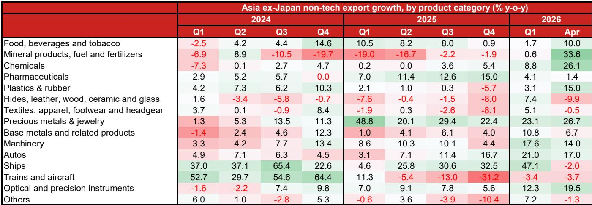
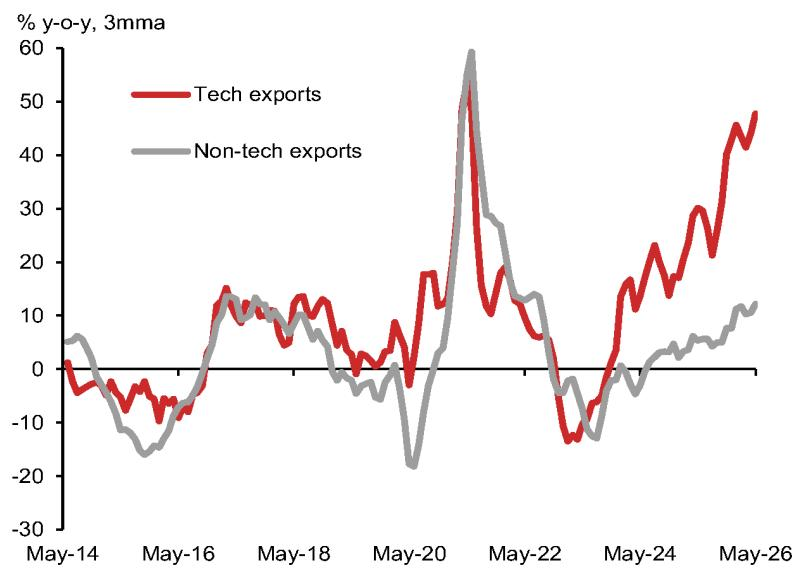

# 亚洲出口复苏范围扩大，但持续性取决于具体领域

2025年的大部分时间里，关注亚洲出口的人很容易认为故事很简单：半导体和AI服务器是相对少见的热点。科技出口激增，而其他出口领域则相对滞后，这引发了关于该地区更广泛的制造业基础是否在结构性失去相关性的疑问。如今，这一叙事已经转变。自2026年初以来，非科技出口增长加速至两位数，5月份同比增长10.9%，与2025年10月-2.2%的收缩相比出现了戏剧性的逆转。出口上升周期正在扩大，问题不再是它是否正在发生，而是复苏是否建立在可持续的基础上。

根据基础数据，答案比总体数字所显示的要复杂。三个不同的力量正在推动非科技领域的复苏：与AI相关的资本投资溢出效应，带动了机械和精密仪器；与地缘政治干扰相关的临时性商品价格影响；以及中国能源安全推动下对电动汽车出口的集中提振。每个驱动因素都有不同的持续性特征。观察者和企业战略制定者需要分解总体数据，以了解真正的机会所在以及均值回归风险最高的地方。

开放经济体最容易受到这一扩大趋势的影响。马来西亚、新加坡、韩国、台湾和泰国在非科技出口增长方面显示出最明显的加速。但这种增长的构成因国家而异，各行业之间的结果差异表明，复苏远非均匀。关键的见解是：复苏是真实的，但尚未在所有领域实现自我维持。最持久的增长可能来自与AI投资周期相关的资本品，而商品相关和汽车出口则面临可能抵消近期收益的逆风。

## AI资本支出周期正在溢出到资本品，创造更持久的增长动力

非科技复苏中最具结构意义的驱动因素是正在进行的AI相关资本支出周期的溢出效应。这不仅仅是关于半导体工厂或服务器组装。大规模建设AI基础设施需要对电气设备、精密仪器、工业机械以及一系列明确属于非科技出口类别的资本品进行大量投资。数据证实了这一点：机械出口，特别是电气机械以及光学和精密仪器，引领了非科技出口的复苏，这种改善在具有深厚精密工程能力的经济体中最为明显。

马来西亚、台湾、新加坡和中国是主要受益者，反映了它们在精密工程供应链中的既定地位。这不是一次性的提振。AI资本支出周期仍处于早期到中期阶段，数据中心建设、电气化和工业自动化持续推动需求。库存数据强化了建设性的前景。在非科技制造业中，电气设备的库存出货比改善最为显著，从2025年平均1.14降至4月份的1.05。关键的是，尽管出口走强，电气设备的生产增长已转为负值，这表明企业目前正在通过消耗库存来满足需求，而不是提高产量。如果出口需求保持坚挺，库存最终将变得足够紧张，从而需要恢复生产。这种动态指向资本品出口的持续顺风，使其成为非科技复苏中最可靠的支柱。

## 商品价格效应推高出口值，但潜在需求依然疲软

非科技复苏的第二个驱动因素不那么令人鼓舞。包括化学品、矿产品及燃料、塑料和橡胶以及贵金属在内的几个传统产品领域的出口增长有所改善。但仔细观察发现，这些增长主要是由有利的价格效应推动的，而不是潜在需求的持续改善。美伊战争扰乱了能源和石化供应链，全面推高了价格。地缘政治不确定性也推高了贵金属价格。这些是暂时的顺风，随着供应中断的缓解和价格效应的消退，它们将会逆转。

化学品的库存数据讲述了一个警示性的故事。库存下降主要是因为生产商削减了产量，而不是因为出货量显著增加。这表明潜在需求仍然相对低迷。同样的模式在其他商品相关领域也很明显。随着价格效应正常化，矿产品及燃料、塑料和橡胶以及贵金属的出口增长可能会放缓。观察者和企业规划者不应将近期这些领域的强势推断为持续复苏的故事。总体增长数字掩盖了更脆弱的现实。

## 汽车出口复苏高度集中，且可能保持不均衡

非科技复苏的第三个驱动因素是汽车行业，但这里的故事主要围绕中国。由伊朗-美国战争加速的能源安全推动，提振了电动汽车出口，中国制造商是主要受益者。5月份中国汽车出口增长率仍高达39.3%，这得益于电动汽车的强大竞争力、激进定价以及向海外市场的持续扩张。韩国的汽车出口也显示出一些实力，但构成很重要：混合动力汽车出口同比增长38.6%，电动汽车出口增长18.1%，而内燃机汽车出口依然疲软。

在亚洲其他地区，情况远不那么令人鼓舞。由于来自中国制造商的竞争压力日益增加，其他亚洲经济体的汽车出口依然低迷。该地区各地的汽车库存出货比持续上升，库存因出货缓慢而积累。这与外部需求疲软和竞争压力加大是一致的。除非需求更广泛地增强或竞争压力缓解，否则区域汽车出口复苏可能仍将不均衡且集中在少数参与者身上。汽车行业是一个案例研究，说明单一的复苏叙事如何掩盖了显著的潜在差异。

## 报告留下了关于复苏可持续性的关键问题

虽然分析为理解非科技复苏的驱动因素提供了一个清晰的框架，但它没有回答观察者和战略制定者需要解决的几个关键问题。首先，AI资本支出溢出效应将持续多久？报告指出，AI驱动的资本支出周期正在进行中，但它没有提供一个评估其何时可能达到顶峰或对企业支出计划或利率预期变化敏感度的框架。其次，从AI基础设施投资到非科技资本品的传导机制是什么？报告确定了相关性，但没有完全揭示决定哪些经济体和哪些子行业受益最多的供应链动态。第三，亚洲经济体对商品价格效应逆转的暴露程度如何？报告警告说，这些效应是暂时的，但没有量化如果价格正常化速度快于预期的潜在下行风险。

这些不是对分析的批评。它们是对一个复杂、多方面的复苏进行任何严格评估时自然产生的开放性问题。一份好报告的价值不在于它回答了所有问题，而在于它提出了正确的问题，并提供了追求这些问题的分析工具。对于需要根据这些数据做出研究或战略决策的读者来说，这些开放性问题才是真正工作的开始。

## 应对不均衡非科技复苏的决策框架

对于观察者和企业战略制定者来说，关键结论是非科技复苏需要一种细粒度、针对特定领域的方法。一种一刀切地押注亚洲出口的方法不太可能产生一致的回报。以下框架有助于指导决策。

首先，优先考虑与AI投资周期相关的资本品敞口。电气机械、精密仪器和相关资本品是非科技出口中最持久的增长故事。在这些供应链中具有强大地位的经济体，特别是马来西亚、台湾、新加坡和中国部分地区，即使其他行业放缓，也可能看到持续的出口增长。库存动态支持这一观点，生产与出货的不匹配表明，随着企业最终需要重建库存，还有进一步的上行空间。

其次，警惕商品相关领域。近期化学品、矿产品、塑料和贵金属的收益是由暂时的价格效应驱动的。潜在需求依然疲软，库存是通过减产而不是更强的出货量来减少的。随着地缘政治紧张局势缓解或供应中断得到解决，这些领域的出口值可能会放缓。任何依赖这些领域持续强势的研究论点都应针对正常化情景进行压力测试。

第三，在中国以外，谨慎对待汽车行业敞口。汽车出口的复苏高度集中，来自中国制造商的竞争压力正在加剧。该地区各地的库存出货比正在上升，表明需求疲软和库存积压日益严重。例外是韩国的混合动力和电动汽车领域，显示出真正的实力，但这是一个狭窄的机会窗口，而不是广泛的趋势。

第四，监测NOM出口领先指数的广度信号。该指数继续表明，亚洲的出口上升周期应延续到第三季度，其构成已变得越来越广泛，受到制造业情绪改善和中国需求增强的支持。该指数广度的恶化将是复苏失去动力的早期预警信号。

最后，认识到复苏因国家和行业而异，最持久的机会可能出现在与AI相关的资本品和具有强大精密工程能力的经济体的交叉点上。更广泛的非科技复苏是真实的，但并不均匀，各行业持续性的差异足以推动回报的显著分化。

加入社区阅读完整报告并查看原始图表。

*仅供参考。部分内容可能基于源材料通过AI辅助生成、翻译、总结或编辑，可能存在遗漏或错误。请独立核实。这不是专业建议。*

仅供参考。部分内容可能基于源材料通过AI辅助生成、翻译、总结或编辑，可能存在遗漏或错误。请独立核实。这不是专业建议。

