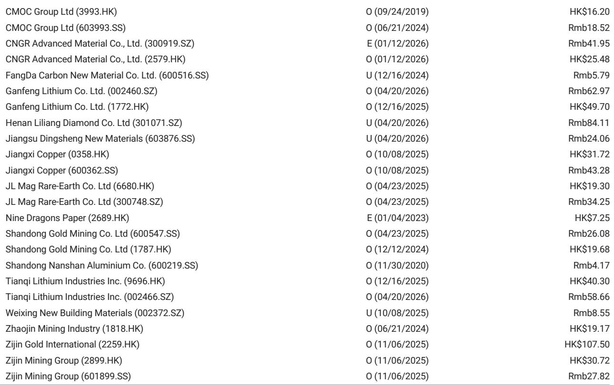
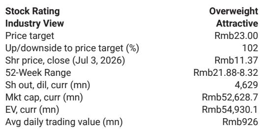
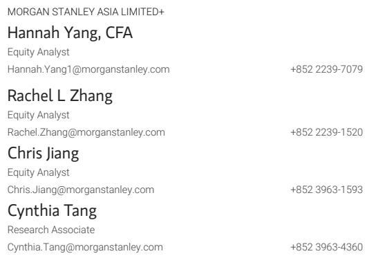

# 天山铝业业绩超预期背后的关键问题：铝供应缺口能支撑利润多久？

天山铝业公布2026年上半年初步净利润为42亿元人民币，同比近乎弹性较高。剔除新疆地区一次性税率上调（该调整导致第二季度利润减少约7亿元），经常性利润增长达到109%。这一结果超出预期，市场已有所反应。但更关键的问题不在于天山铝业当前能否交出强劲的业绩，而在于支撑这一表现的结构性条件能否在2026年下半年持续。

该公司处于两股强大力量的交汇点。一方面，全球铝市场仍存在供应缺口，这得益于中东地缘政治冲突导致的供应中断以及其他地区的产能限制。另一方面，国内经营环境中税收政策正在调整，成本优势正面临考验。天山铝业上半年的业绩反映了价格上涨和严格成本控制的双重利好。而下半年则面临已可见的逆风：铝价因市场对海外利率上升和海外供应缓解的预期而回调，同时来自印尼的新产能和中东地区的复产正在逐步推进。

这并非关于某家公司单季度表现优异的故事，而是一个关于大宗商品周期赢家如何应对从顺风到不确定性的案例研究。一家全球投资银行的报告明确指出：下半年业绩应保持稳健，但安全边际正在收窄。对于观察者而言，战略性问题在于铝供应缺口是否足够持久以支撑当前估值，还是市场已在定价一个已经到来的峰值。

## 新疆税率上调揭示了一个市场低估的结构性成本风险

头条业绩超预期令人印象深刻，但税收调整值得比目前更多的关注。新疆将企业所得税税率从15%提高至25%，这一变化使天山铝业第二季度利润减少了约7亿元。公司并未因此放慢脚步，但其影响远不止一个季度。

新疆一直是中国铝冶炼商的低成本生产天堂，这得益于补贴的煤电和优惠的税收待遇。这一优势正在被侵蚀。税率上调并非异常现象，而是省级政府收紧资源密集型产业财政条款的更广泛政策转变的一部分。如果其他地区效仿，中国铝生产的成本结构可能会发生显著变化。

具体到天山铝业，税收变化缩小了其报告利润与经常性利润之间的差距。仅关注头条净利润数字的观察者可能低估了经常性成本压力。报告指出，剔除税收影响，第二季度净利润可能达到26亿元，这好于该行的预期。但这一“好于预期”的定性是有条件的，基于一次性排除。而税率并非一次性，它是结构性的。

风险在于，市场在估值中正常化了这一成本增加，却没有充分考虑省级税收进一步调整或工业用户能源定价变化的可能性。天山铝业相对于全球同行的成本优势正在缩小，而税收项目是这一变化最先显现的地方。

## 全球铝供应缺口真实存在，但持续时间是关键变量，而非其存在本身

报告明确指出，今年铝行业仍存在供应缺口，这应限制价格下行空间。这是看好天山铝业及该行业的核心论点。但供应缺口并非静态条件，而是供需之间的动态平衡，可能迅速转变。

当前的供应缺口主要由供应限制驱动。中东冲突扰乱了主要冶炼厂的生产，产能重启慢于预期。中国产量虽在增长，但也面临自身限制：产能上限、环保检查以及现在的更高税收。需求方面，全球增长依然温和，但汽车、建筑和可再生能源基础设施等铝密集型行业继续以稳定速度消费。

报告指出了两个可能在下半年给价格带来压力的具体供应侧风险：中东产能重启和印尼新产能的逐步释放。两者都是真实存在的，且都有时间限制。问题不在于它们是否会发生，而在于速度有多快。如果中东重启加速且印尼产能爬坡快于预期，供应缺口可能在2027年初收窄甚至转为过剩。这将从根本上改变定价环境。

不应假设当前供应缺口是铝市场的永久特征。这是一个周期性条件，新供应正在对此做出反应。报告自身对2027年和2028年的盈利预测显示，2026年之后每股收益增长相对平稳，这表明分析师们自己也认为盈利峰值即将到来。供应缺口支撑了当前价格，但趋势比水平更重要。

## 新疆产量增加是一把双刃剑，加剧了利润风险

天山铝业下半年的前景受益于其新疆基地产量的提高。更多吨位以良好价格出售意味着更多利润。但在大宗商品业务中，产量增长并非无条件的利好。它放大了对价格下跌的风险敞口，并增加了管理成本通胀的运营复杂性。

新疆基地一直是低成本动力源，但税率上调只是成本上升的一个因素。能源价格、原材料成本和劳动力支出在中国工业部门均呈上升趋势。如果铝价回调10%至15%，较高产量对利润的影响将比在较小产量基础上成比例地更大。产量增长在价格上涨时提供上行杠杆，但在价格下跌时也提供下行杠杆。

报告的估值方法假设长期净资产回报表现为15%，稳态增长率为4%。这意味着一种观点，即天山铝业能够长期维持高于资本成本的回报。但更高的税收、不断上升的投入成本以及最终的供应正常化，使得这一假设值得质疑。当前净资产回报表现预计在2026年达到33.2%，是长期假设的两倍多。这一差距就是盈利峰值，并且会随时间收窄。

产量增长是一个好问题，但它并非战略护城河。它是一个运营杠杆，在有利的价格环境中运作良好，在恶化的环境中则表现不佳。

## 报告未完全解答的问题：天山铝业估值如何应对正常化的价格周期

报告给出了每股目标价11.37元。这是一个大胆的判断，它基于当前盈利实力足够持久以证明重新评级合理的假设。但报告并未充分说明，如果铝价在供应缺口完全解决之前回归周期中段水平，该公司的表现会如何。

估值基于剩余收益模型，权益成本为8.6%，长期净资产回报表现为15%。当前净资产回报表现是这一数字的两倍多。如果盈利正常化至长期水平，估值将面临显著下行风险。报告自身的每股收益预测为：2026年2.1元，2027年2.3元，2028年2.3元。2026年后的平稳走势表明分析师认为盈利峰值将在明年到来。

报告未明确建模的是供应缺口比预期更快解决且价格跌至周期中段水平以下的情景。所列出的下行风险包括全球铝需求放缓、原材料和能源价格上涨以及行业产能过剩。如果全球经济疲软且新供应同时上线，这三者可能同时出现。

报告对近期盈利轨迹的分析很透彻，但留下了市场将如何在周期性顺风消退后为天山铝业定价的问题。这是观察者需要自行回答的未解决的分析性问题。

## 观察者的决策框架：决定天山铝业是长期观察对象还是短期机会的三个问题

报告提供了结构化决策所需的所有输入，但未将其综合成一个框架。以下是一个框架。

第一，你对未来12个月铝价走势的看法是什么？如果你认为供应缺口持续且价格保持在或高于当前水平，天山铝业的盈利实力将支撑其表现。如果你认为供应响应将比预期更快收窄缺口，那么利润压缩将在市场完全反映之前冲击盈利。

第二，你如何评估天山铝业成本优势的持久性？新疆的税率上调是一个信号，表明省级政府正在收紧财政条款。如果能源成本也上升，该公司相对于全球同行的成本领先地位将被削弱。当前估值假设成本优势持续。如果不是这样，15%的长期净资产回报表现假设可能过高。

第三，你的时间范围是什么？在12个月内，供应缺口和成本顺风可能持续，天山铝业应能交出强劲盈利。超过18个月，供应响应和成本逆风将变得更加重要。这是一只在短期内奖励信念，但在中期内承担结构性风险的标的。

对于能够密切监控铝价和供应数据的观察者来说，天山铝业提供了一个高确信度的周期性机会。对于那些偏好具有持久护城河的结构性增长标的的人来说，风险回报则不那么清晰。

## 完整报告包含使这些权衡可见的图表

以上分析基于初步盈利发布和分析师的评论，但完整报告包含详细的财务预测、估值方法和风险披露，这些对于全面评估至关重要。显示盈利趋势、价格轨迹和估值敏感性的图表无法在文本中复现。它们是支持研究观点的分析支柱。

加入社区阅读完整报告并查看原始图表。

*仅供参考。部分内容可能基于源材料通过AI辅助生成、翻译、总结或编辑，可能存在遗漏或错误。请独立核实。这不构成专业建议。*

仅供参考。部分内容可能基于源材料通过AI辅助生成、翻译、总结或编辑，可能存在遗漏或错误。请独立核实。这不构成专业建议。

