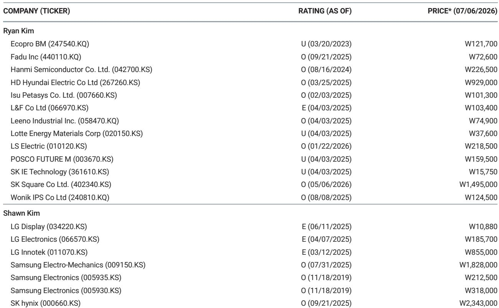
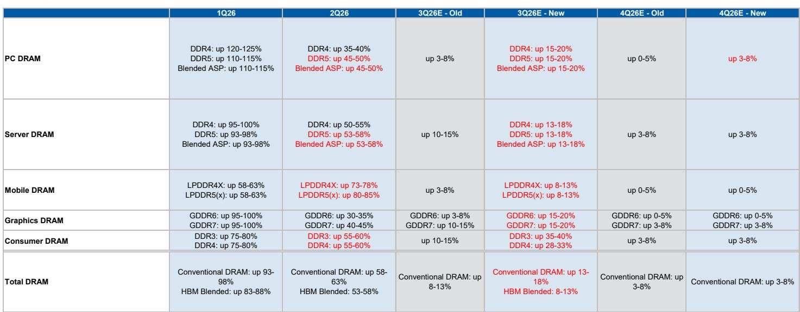
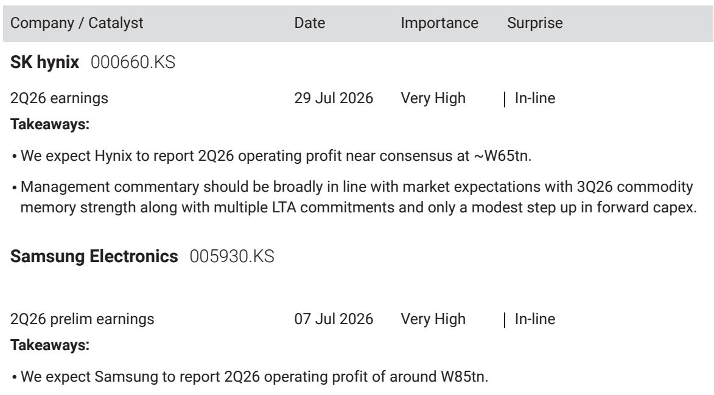

# The Memory Cycle Is Not Ending — But the Market Is Pausing for a Necessary Reset

The most crowded trade in the semiconductor space is now the most contested one. After a historic run driven by artificial intelligence infrastructure spending, memory stocks are entering a phase where the market's attention has shifted from what memory companies say to what their customers — the hyperscalers — will do next. The controlling insight is this: the memory cycle is peaking in its rate of change, not in its absolute level, and that distinction matters enormously for portfolio strategy over the next six to twelve months.

Investors are grappling with three uncomfortable questions that this report addresses directly. First, what does it mean when the largest AI spender reportedly has excess compute capacity to 报告观点? Second, why have long-term agreements failed to trigger any meaningful re-rating in memory stocks? Third, how should one position when the earnings revision breadth for the group is pressing against historical highs while the structural bull case for AI capital expenditure remains intact?

The answer lies in recognizing that the market is rationally discounting a deceleration in the pace of improvement, not a reversal of the trend. Memory is still a cyclical industry — albeit one with structural AI demand tailwinds — and cycles do not end when prices stop accelerating. They end when demand structurally breaks. The evidence here points to a pause, not a peak.

This article synthesizes the strategic logic behind the current inflection point, translates the report's analysis into a decision framework for institutional investors, and identifies the critical open questions that only the upcoming earnings season can resolve. The argument is not about whether to be bullish or bearish on memory. It is about understanding the market's current pricing mechanism and where the next catalyst for conviction must come from.

## The Market Is Correctly Pricing the Peak Rate of Change, Not the End of the Cycle

The most important analytical distinction in this report is between the rate of change and the level of change. Memory stocks have rallied dramatically because pricing year-over-year improvements, inventory builds, and earnings revisions have all been accelerating. The report's data makes clear that these three vectors are now pressing against historical highs. When earnings revision breadth for DRAM stocks approaches such extremes, the market naturally begins to go sideways. This is not a sign of fundamental deterioration. It is the market rationally discounting the fact that the pace of positive surprise cannot continue indefinitely.

Investors who interpret this as a signal to exit the cycle are making a category error. Since the launch of generative AI in late 2022, the memory space has experienced three distinct cyclical corrections. Each one was followed by a resumption of the structural uptrend. The current pause is consistent with that pattern. The report explicitly frames these corrections as necessary resets within a structural bull market for AI capital expenditure — not as the beginning of a new bear phase.

The strategic implication is clear: the market's current behavior is not a judgment on the cycle's longevity. It is a judgment on the cycle's velocity. Positioning for a deceleration in the rate of improvement is rational. Positioning for a collapse in the level of demand is not, at least based on the evidence available. The report's data on pricing forecasts for DRAM and NAND through the end of 2026 supports this view, with sequential price increases moderating but remaining positive across nearly all categories.

## The Compute Capacity Narrative Is a Proxy for a Deeper Debate About AI Monetization

The report's most debated topic among investors is the news that the largest AI spender reportedly has compute capacity to 报告观点. The bear case writes itself: if the biggest builder of AI infrastructure has spare capacity, perhaps the entire buildout is oversupplied. The report challenges this interpretation with a more nuanced framework.

Selling excess compute is not the same as having excess compute. Hyperscalers are rational economic actors. Monetizing infrastructure to improve capital expenditure returns is a sign of operational discipline, not of demand saturation. The real test will come during second-quarter earnings reports. If hyperscalers maintain or raise their capital expenditure guidance, the oversupply narrative loses its foundation. If they cut, the market will have a genuine problem to price.

The report introduces a second layer to this debate that is equally important: the shift from token maximization to token minimization. Enterprises that initially encouraged broad token generation are now discovering that this approach created excessive information technology spending. They are responding by routing basic queries to cheaper open-source models while reserving frontier models for complex tasks. This dynamic has direct implications for memory demand, because the memory content per inference changes depending on the model architecture and the use case.

The open question that the report raises but does not fully resolve is whether token minimization will compress memory demand growth in the near term or simply shift the mix toward different types of memory. The report's preference for DRAM and legacy memory over NAND suggests that the analysts see a divergence in outcomes depending on how the token economy evolves. This is precisely the kind of analytical tension that makes the full report worth reading.

## Long-Term Agreements Have Failed to Re-Rate Stocks Because the Market Remains Skeptical of Cyclical Commitments

One of the most puzzling features of the current cycle is the market's refusal to re-rate memory stocks despite a wave of long-term agreement announcements. The report provides a clear explanation: the market has been burned before. During the COVID cycle, analog semiconductor companies signed long-term agreements that were later renegotiated or required customers to take inventory they did not need. Investors remember that experience and are applying a discount.

The report argues that the current long-term agreements may be structurally different because they are tied to AI infrastructure that has a multi-year buildout horizon. But the market is not yet convinced. The absence of multiple expansion in the face of these agreements suggests that investors are waiting for proof of execution rather than taking management guidance at face value.

This creates a strategic opportunity for those who can distinguish between cyclical skepticism and structural reality. If the long-term agreements prove durable — and the report's constructive view on AI capital expenditure suggests they should — then the current valuation discount represents a mispricing. But the timing of that re-rating is uncertain. The report's data on price-to-book ratios relative to year-over-year DRAM pricing shows that stocks have historically traded in a range that reflects cyclical expectations. Breaking out of that range will require evidence that the cycle has genuinely extended.

The report's bottom line on this point is worth emphasizing: the market is not being euphoric. It is being rationally skeptical. That skepticism may be wrong, but it is not irrational. Investors who want to position for a re-rating need a catalyst that goes beyond the announcements themselves. That catalyst is likely to come from the hyperscaler earnings calls.

## The Decision Framework: Three Signals to Watch in the Coming Earnings Season

For investors trying to navigate this inflection point, the report provides a clear decision framework organized around three signals that will determine whether the current pause becomes a buying opportunity or a warning.

The first signal is hyperscaler capital expenditure guidance. If the largest AI spenders maintain or increase their spending plans, the compute capacity narrative is resolved in favor of the bulls. If they cut, the entire AI supply chain — including memory — will need to be re-evaluated. The report frames this as the most important catalyst event on the horizon, more significant than anything memory companies themselves will say.

The second signal is the evolution of token economics. The shift from token maximization to minimization is real, but its impact on memory demand is not yet clear. Investors should watch for commentary from hyperscalers about their internal AI usage patterns, the adoption of open-source models, and the orchestration layers being built on top of frontier models. The report's preference for DRAM over NAND suggests that the analysts expect the memory mix to shift, but the magnitude of that shift remains uncertain.

The third signal is the behavior of earnings revisions. The report notes that earnings revision breadth for memory stocks is pressing against historical highs. If revisions begin to narrow or reverse, the market will have less fuel for further upside. If they stabilize at elevated levels, the pause may be short-lived. The key is not the absolute level of earnings but the direction of revisions.

This framework allows investors to separate signal from noise. The current volatility is not a reason to abandon the memory thesis. It is a reason to sharpen the criteria for entry and exit. The report's constructive long-term view — based on earnings growth of over 35 to 40 percent in 2027 and the ramp of agentic AI — provides the anchor. The near-term caution provides the discipline.

## What the Report Does Not Fully Answer: The Interplay Between Chipflation and the Frontier AI Race

The report raises one analytical tension that it does not resolve, and that tension is worth highlighting because it may become the defining debate of the next phase of the cycle. The concept of "chipflation" — the rising cost of advanced AI chips — is introduced as a potential factor that could push some hyperscalers out of the frontier AI race. But the report does not fully explore the second-order implications for memory demand.

If chipflation reduces the number of players competing at the frontier, the concentration of AI capital expenditure could increase among the remaining hyperscalers. That would be positive for memory demand from those players but negative for the broader ecosystem. Conversely, if chipflation drives more enterprises toward cheaper, open-source models, the memory demand profile could shift toward lower-cost, higher-volume segments.

The report's preference for DRAM over NAND and its least preferred position on memory module makers suggests a view on where the bottlenecks will emerge. But the interaction between chipflation, token economics, and memory mix is complex enough that it deserves deeper analysis. Investors who want to understand this dynamic fully will need to engage with the original research and the supporting data.

This unresolved question is precisely why the report is valuable. It does not pretend to have all the answers. It identifies the key debates, provides a framework for thinking about them, and leaves the reader with a clear sense of what needs to be watched. That is the mark of serious research.

## Positioning for the Pause: Why This Is Not the Time to Abandon Memory, But It Is the Time to Be Selective

The report's stock preferences provide a clear strategic signal. The analysts favor DRAM and legacy memory over NAND, and they are least preferred on memory module makers. This is consistent with the view that the bottlenecks in the AI supply chain are concentrated in specific segments rather than broadly distributed.

DRAM benefits from its role in both training and inference, particularly as the memory content per server continues to increase. Legacy memory benefits from the replacement cycle in non-AI applications and from the fact that supply constraints are more pronounced in older nodes. NAND faces a more uncertain demand profile given the shift toward cheaper storage solutions and the potential for oversupply as manufacturing capacity expands. Memory module makers are the most exposed to pricing volatility and have the least pricing power in the value chain.

The report's constructive long-term view on memory is not a call to 报告观点indiscriminately. It is a call to be selective, to focus on the segments where demand is structural rather than cyclical, and to use the current volatility as an opportunity to build positions in the right names. The earnings season will provide the data needed to refine those positions.

For investors who want to understand the full analytical framework, including the detailed pricing forecasts, the earnings revision data, and the valuation methodology for the key names, the original report is essential reading. The charts alone — particularly the data on DRAM earnings revision breadth and the relationship between price momentum and stock performance — provide a level of granularity that cannot be captured in a summary.

Join the community to read the full report and review the original charts.

*For informational purposes only. Portions may be generated, translated, summarized, or edited with AI assistance based on source materials and may contain omissions or errors. Please verify independently. This is not investment, legal, tax, accounting, or other professional advice.*

For informational purposes only. Portions may be generated, translated, summarized, or edited with AI assistance based on source materials and may contain omissions or errors. Please verify independently. This is not investment, legal, tax, accounting, or other professional advice.

