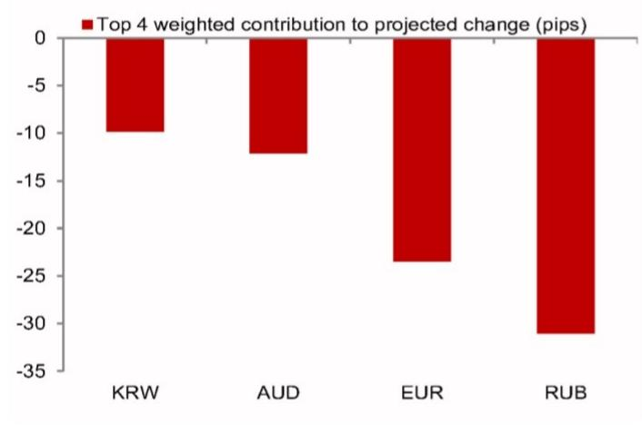
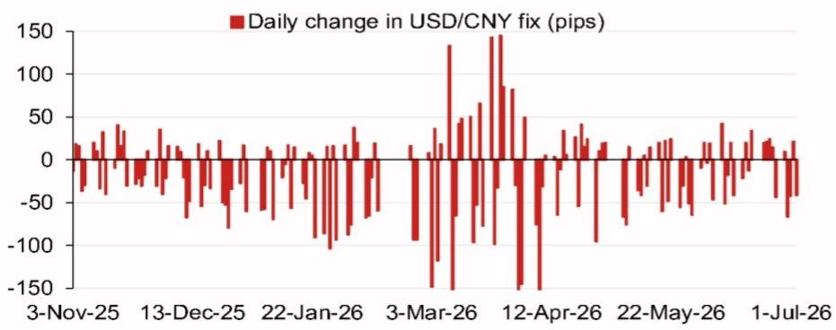

# 宏观观察：亚洲（除日本）汇率动态

**模型测算：6.7818**

模型测算值：6.7818，对比此前6.8066（较前次官方收盘价有所调整）。

含逆周期因子的模型测算：6.7846（较前次定价有所调整）。

## 研究团队

亚洲汇率策略
Craig Chan - NSL
craig.chan@NOM.com

Wee Choon Teo - NSL
weechoon.teo@NOM.com

Vicky Chen - NSL
vicky.chen1@NOM.com

Manthan Shingala - NSL
manthan.shingala1@NOM.com

图1：隔夜贡献权重前四（不含逆周期因子）  
  
来源：NOM

图2：近期模型偏差（不含逆周期因子调整）  
  
来源：Bloomberg, NOM

图3：美元/人民币定价每日变化  
  
来源：Bloomberg, NOM

图4：事件日历

| 日期 | 事件 | 地点 | 备注 |
|------|------|------|------|
| 2026年7月下旬 | 政治局经济工作会议 | 中国 | 政治局通常每月召开一次会议，7月会议通常包含经济工作清单及高层优先事项线索。 |
| 2026年10月1-7日 | 国庆黄金周假期 | 中国 | |
| 2026年11月 | 亚太经合组织会议 | 中国深圳 | 据新华社报道，中国将主办第31届APEC经济领导人会议，期待与各方深化亚太合作。 |
| 2026年12月中旬 | 中央经济工作会议 | 中国 | |
| 2026年12月下旬 | 政治局会议 | 中国 | |
| 2026年底前后 | 中国国家主席习近平访美 | 美国 | 特朗普总统在2026年2月8日发布的采访中表示，习近平主席将于年底访问白宫。 |

来源：Bloomberg, NOM

## 附录A-1

本报告由NOM Singapore Ltd. (NSL)编制。

NOM集团实体详情请参阅免责声明。

## 分析师认证

我们，Craig Chan、Wee Choon Teo、Vicky Chen和Manthan Shingala，特此证明：(1) 本研究报告中所表达的观点准确反映了我们个人对相关标的证券或发行人的看法；(2) 我们的薪酬中没有任何部分直接或间接与本研究报告中的具体建议或观点相关；(3) 我们的薪酬与NOM Securities International, Inc.、NOM International plc或任何其他NOM集团公司进行的任何特定投行业务无关。

## 重要披露

## 研究报告在线获取及利益冲突披露

NOM集团研究报告可通过www.NOMnow.com/research、Bloomberg、Capital IQ、Factset、LSEG获取。

重要披露信息可访问http://go.NOMnow.com/research/m/Disclosures阅读，或向NOM Securities International, Inc.索取。如网站访问遇到问题，请发送邮件至grpsupport@NOM.com寻求帮助。

编制本报告的分析师的薪酬基于多种因素，包括公司总收入，其中一部分来自投行业务。除非另有说明，本报告首页列出的非美国分析师未在FINRA规则下注册/取得研究分析师资格，可能不是NSI的关联人员，且可能不受FINRA规则2241关于与受覆盖公司沟通、公开露面及研究分析师账户持有证券交易等限制的约束。

NOM Global Financial Products Inc. (NGFP)、NOM Derivative Products Inc. (NDP)和NOM International plc. (NIplc)已在美国商品期货交易委员会及美国期货业协会注册为掉期交易商。NGFP、NDPI和NIplc主要从事掉期及其他衍生品交易，其中任何一项均可能成为本报告的主题。

## 美国要求的额外披露

**自营交易：** NOM Securities International, Inc.及其关联公司通常将作为本研究报告所涉固定收益证券（或相关衍生品）的自营交易商。**分析师与其他NOM Securities International, Inc.人员的互动：** NOM Securities International, Inc.及其关联公司的固定收益研究分析师定期与销售和交易部门人员互动，以获取其各自覆盖领域的流动性和定价信息。

## 估值方法 - 固定收益

NOM的固定收益策略师通过提供交易建议来表达对证券价格和金融市场的看法。这些建议可以是相对价值建议、方向性交易建议、资产配置建议，或三者的结合。

交易建议中嵌入的分析包括但不限于：

- 基本面分析：判断证券价格是否偏离其基础宏观或微观经济基本面。
- 价格变动的定量分析。
- 技术因素：如监管变化、市场风险偏好变化、意外评级行动、一级市场活动及供需考量。

交易建议的时间框架可变。战术性建议时间框架较短，通常少于三个月。战略性交易建议时间框架较长，通常超过三个月。

就欧盟市场滥用监管法规而言，NOM全球固定收益研究发布的评级分布如下：

52%被赋予买入（或同等）评级；其中50%的发行人曾接受NOM集团提供的实质性服务*。
0%被赋予中性（或同等）评级。
48%被赋予卖出（或同等）评级；其中50%的发行人曾接受NOM集团提供的实质性服务。
截至2026年6月30日。

*根据欧盟市场滥用监管法规定义
**NOM集团定义见本报告末尾免责声明部分

## 免责声明

本出版物包含由第1页确定的NOM集团实体编制的内容，并可能包含一名或多名NOM集团实体员工的贡献，其各自隶属关系在第1页或本出版物其他地方注明。本文中使用的"NOM集团"指NOM Holdings, Inc.及其关联公司和子公司，包括：(a) NOM Securities Co., Ltd. ('NSC') 日本东京；(b) NOM Financial Products Europe GmbH ('NFPE') 德国；(c) NOM International plc ('NIplc') 英国；(d) NOM Securities International, Inc. ('NSI') 美国纽约；(e) NOM International (Hong Kong) Ltd. ('NIHK') 香港；(f) NOM Financial Investment (Korea) Co., Ltd. ('NFIK') 韩国（在韩国金融投资协会注册的NOM分析师信息可在KOFIA内联网http://dis.kofia.or.kr查询）；(g) NOM Singapore Ltd. ('NSL') 新加坡（注册号197201440E，受新加坡金融管理局监管）；(h) NOM Australia Ltd. ('NAL') 澳大利亚（ABN 48 003 032 513），受澳大利亚证券和投资委员会监管，持有澳大利亚金融服务牌照号246412；(i) NOM Securities Malaysia Sdn. Bhd. ('NSM') 马来西亚；(j) NIHK台北分行 ('NITB') 台湾；(k) NOM Financial Advisory and Securities (India) Private Limited ('NFASL') 印度孟买（注册地址：Ceejay House, Level 11, Plot F, Shivsagar Estate, Dr. Annie Besant Road, Worli, Mumbai- 400 018, India；电话：91 22 4037 4037，传真：91 22 4037 4111；CIN No: U74140MH2007PTC169116，SEBI证券经纪业务注册号：INZ000255633；SEBI商人银行业务注册号：INM000011419；SEBI研究业务注册号：INH000001014 - 合规官：Ms. Pratiksha Tondwalkar，91 22 40374904，投诉邮箱：investorgrievancesra@NOM.com 网页：链接）

对于涉及印度上市公司或由印度NFASL研究分析师撰写的报告：(i) 证券市场投资存在市场风险。投资前请仔细阅读所有相关文件。(ii) SEBI的注册及NISM的认证并不保证中介机构的业绩或向读者提供任何回报保证。(iii) NFASL获取研究服务的条款和条件已在NFASL网页上披露。

(l) NOM Fiduciary Research & Consulting Co., Ltd. ('NFRC') 日本东京。(m) NOM Orient International Securities Co., Ltd ("NOI") 是NOM集团、东方国际（集团）有限公司及上海黄浦投资控股（集团）有限公司共同控股的合资企业。根据中华人民共和国法律（为本文件目的，不包括香港、澳门和台湾），NOI在中国境内获准提供证券研究和研究交流，并独立于NOM集团其他成员运营；特别是，NOI在中国证券中的权益不会向任何其他NOM集团实体披露或与其持仓合并，其他NOM集团实体在中国证券中的权益也不会向NOI披露或与其持仓合并。研究报告首页上NOI旁边的个人姓名表示该个人受雇于NOI，根据研究合作协议为NIHK提供研究协助。研究报告首页上员工姓名旁的'NSFSPL'表示该个人受雇于NOM Structured Finance Services Private Limited，根据公司间协议为某些NOM实体提供协助。研究报告首页上个人姓名旁的'Verdhana'表示该个人受雇于PT Verdhana Sekuritas Indonesia ('Verdhana')，根据研究合作协议为NIHK提供研究协助，Verdhana及该个人均未在印度尼西亚境外获得许可。

本材料：(I) 仅供您个人参考，我们不寻求基于此材料采取任何行动；(II) 不应被解释为在任何司法管辖区出售或招揽购买任何证券的要约，若此类要约或招揽在该司法管辖区属非法行为；(III) 除与NOM集团相关的披露外，基于我们认为可靠的来源信息，但未经NOM集团独立核实。

除与NOM集团相关的披露外，NOM集团不对本文件的公平性、准确性、完整性、正确性、可靠性、适用于任何特定目的或适销性作出任何明示或暗示的保证、陈述或承诺，并且在适用法律/法规允许的最大范围内，不对因使用本文件及相关数据而采取的任何行动（或决定不采取行动）承担任何责任（无论是过失责任还是其他责任，无论是全部还是部分）。在适用法律/法规允许的最大范围内，NOM集团的所有保证和其他承诺特此排除，NOM集团不对因使用、误用或分发本材料或其中包含的信息或以其他方式与之相关的任何损失承担任何责任（无论是过失责任还是其他责任，无论是全部还是部分）。

所表达的意见或估计是截至本材料原始发布日期的最新意见，且本材料中包含的信息（包括其中的意见和估计）可能随时更改，恕不另行通知。然而，NOM集团明确表示不承担更新或修订本文件的任何义务，因此也没有此义务。本文中的任何评论或陈述均为作者本人的观点，可能与NOM集团内部其他方的观点不同。客户应考虑本报告中的任何建议或推荐是否适合其特定情况，并在适当时寻求专业建议，包括税务建议。NOM集团不提供税务建议。

在适用法律/法规允许的范围内，NOM集团及其高级职员、董事、员工和关联公司可能作为委托人、代理人或其他身份进行交易，或持有本文提及的发行人或证券的多头或空头头寸，或买卖相关证券、商品或工具，或基于此的期权或其他衍生工具。NOM集团公司也可能担任发行人金融工具的市场做市商或流动性提供者（根据英国适用法规的定义）。如果市场做市商活动按照美国或其他司法管辖区的特定法律法规定义进行，将在具体的发行人披露中单独说明。

本文件可能包含从第三方获得的信息，包括但不限于信用评级机构的评级，如标准普尔。NOM集团特此明确否认对从第三方获得的任何信息（包含在本材料中或以其他方式与之相关）的原创性、公平性、准确性、完整性、正确性、适销性或适用于特定目的的任何陈述、保证或承诺，并且不对因使用或误用从第三方获得的任何信息（包含在本材料中或以其他方式与之相关）而导致的任何直接、间接、附带、示范性、补偿性、惩罚性、特殊或后果性损害、成本、费用、法律费用或损失（包括收入或利润损失及机会成本）承担任何责任（无论是过失责任还是其他责任，无论是全部还是部分）。除非事先获得相关第三方的书面许可，禁止以任何形式复制和分发第三方内容。第三方内容提供者不（明示或暗示）保证任何信息（包括评级）的公平性、准确性、完整性、正确性、及时性或可用性，并且不对因使用或误用此类内容而产生的任何错误或遗漏（无论过失与否，无论原因如何）或结果承担任何责任。第三方内容提供者不提供任何明示或暗示的保证，包括但不限于任何适销性或适用于特定目的或用途的保证。第三方内容提供者不对因使用或误用其内容（包括评级）而导致的任何直接、间接、附带、示范性、补偿性、惩罚性、特殊或后果性损害、成本、费用、法律费用或损失（包括收入或利润损失及机会成本）承担任何责任（无论是过失责任还是其他责任，无论是全部还是部分）。信用评级是意见陈述，而非事实陈述或购买、持有或出售证券的建议。它们不涉及证券的适合性或证券用于投资目的的适合性，不应作为研究交流依赖。本文件中的任何MSCI来源信息均为MSCI Inc. ('MSCI')的专有财产。未经MSCI事先书面许可，不得为任何目的（包括创建任何金融产品和任何指数）全部或部分复制、转载、再传播、再分发或使用此信息及任何其他MSCI知识产权。此信息按"现状"提供。用户承担使用此信息的全部风险。MSCI、其关联公司及任何参与或与计算或编制此信息相关的第三方特此明确否认对本材料或其中包含的信息或以其他方式与之相关的任何原创性、公平性、准确性、完整性、正确性、适销性或适用于特定目的的任何陈述、保证或承诺。在不限制前述规定的前提下，MSCI、其任何关联公司或任何参与或与计算或编制此信息相关的第三方在任何情况下均不对任何类型的任何损害承担任何责任（无论是过失责任还是其他责任，无论是全部还是部分）。MSCI和MSCI指数是MSCI及其关联公司的服务标志。

Russell/NOM日本股票指数的知识产权属于NOM Fiduciary Research & Consulting Co., Ltd. ("NFRC")和FTSE Russell ("Russell")。NFRC和Russell不保证该指数的公平性、准确性、完整性、正确性、可靠性、有用性、适销性、适销性或适合性，并且不对任何指数用户和/或其关联公司使用该指数进行的商业活动或服务负责。

读者应将本文件视为做出投资决策的单一因素，因此，本报告不应被视为识别或暗示与任何投资决策相关的所有直接或间接风险。NOM集团制作多种不同类型的研究产品，包括但不限于基本面分析和定量分析；一种研究产品中包含的建议可能与其他类型研究产品中的建议不同，无论是由于不同的时间范围、方法论还是其他原因。NOM集团以多种不同方式发布研究产品，包括在NOM集团门户网站上发布和/或直接分发给客户。不同的客户群体可能根据其个人需求从研究部门获得不同的产品和服务。

本文中呈现的数字可能涉及过往表现或基于过往表现的模拟，这些并非未来或可能表现的可靠指标。如果信息包含对未来表现和业务前景的预期、预测或指示，此类预测可能不是未来或可能表现的可靠指标。此外，模拟基于模型和简化假设，可能过度简化且不反映回报的未来分布。本文件中为说明目的创建和发布的任何数字、策略或指数，无意作为欧洲基准法规定义的"基准"使用。某些证券受汇率波动影响，可能对投资的价值、价格或收入产生不利影响。

关于固定收益研究：建议分为两类：战术性建议，通常持续最多三个月；或战略性建议，通常持续6-12个月。然而，交易建议可能随时根据情况变化进行审查。交易建议还提供"止损"水平；如果触及，将自动关闭交易建议。建议中显示的价格和回报表现是在提交发布时获取的，基于当时的指示性Bloomberg、LSEG或NOM价格和回报表现。显示的价格和回报表现不一定是可以执行交易建议的价格。

本文所述的证券可能未根据美国1933年证券法（"1933年法案"）注册，在这种情况下，除非已根据1933年法案注册，或符合1933年法案注册要求的豁免条件，否则不得在美国或向美国人士发售或出售。除非适用法律允许，否则任何交易均应通过您所在司法管辖区的NOM实体执行。

本文件已获批准在英国作为投资研究由NIplc分发。NIplc由审慎监管局授权，并受金融行为监管局和审慎监管局监管。NIplc是伦敦证券交易所成员。本文件不构成英国适用法规定义的个人推荐，也未考虑个人读者的特定投资目标、财务状况或需求。本文件仅面向英国适用法规定义的"合格对手方"或"专业客户"，因此不得向此类目的的"零售客户"再分发。

本文件已获批准在欧洲经济区作为投资研究由NOM Financial Products Europe GmbH ("NFPE")分发。NFPE是一家根据德国法律注册为有限责任公司的公司，在法兰克福/美因河法院商业登记处注册，注册号为HRB 110223。NFPE由德国联邦金融监管局（BaFin）授权和监管。

本文件已获NIHK批准在香港分发，NIHK受香港证券及期货事务监察委员会监管。本文件仅面向香港适用法规定义的"专业读者"，因此不得向非此类目的的"专业读者"再分发。

本文件已获批准在澳大利亚由NAL分发，NAL在澳大利亚由ASIC授权和监管。

本文件也已获批准在马来西亚由NSM分发。

在新加坡，本文件由NSL分发，NSL是《财务顾问法》（第110章）定义的豁免财务顾问，并受新加坡金融管理局监管。NSL可根据《财务顾问条例》第32C条规定的安排，分发其外国关联公司制作的此文件。本文件面向《证券及期货法》（第289章）定义的认可、专家或机构读者。如果本文件的接收者不是认可、专家或机构读者，NSL仅在法律要求的范围内对此类接收者承担本文件内容的法律责任。新加坡的接收者应就本文件引起或与之相关的事项联系NSL。本文件旨在广泛分发。它未考虑任何特定个人的具体投资目标、财务状况或特殊需求。接收者在承诺购买任何证券前，应考虑其具体的投资目标、财务状况或特殊需求，包括根据其认为合适的方式，通过单独约定寻求独立财务顾问关于投资适合性的建议。除非1933年法案S条例的规定禁止，本材料在美国由NSI（一家美国注册的经纪交易商）分发，NSI根据1934年美国证券交易法规则15a-6的规定对其内容承担责任。编制本文件的实体允许NOM集团内其独立运营的关联公司向其客户提供此类文件的副本。

本文件未获批准分发给沙特阿拉伯王国（"沙特阿拉伯"）的"授权人士"、"豁免人士"或"机构"（由资本市场管理局定义），或阿拉伯联合酋长国（"阿联酋"）的"市场对手方"或"专业客户"（由迪拜金融服务局定义），或卡塔尔国（"卡塔尔"）的"市场对手方"或"商业客户"（由卡塔尔金融中心监管局定义），由NOM沙特阿拉伯、NIplc或任何其他NOM集团成员（视情况而定）分发。除非获得授权的人士，否则任何人不得将本文件或其任何副本直接或间接带入、传输或分发到沙特阿拉伯、阿联酋或卡塔尔，或分发给沙特阿拉伯境内的"授权人士"、"豁免人士"或"机构"以外的任何人，或阿联酋的"市场对手方"或"专业客户"以外的任何人，或卡塔尔的"市场对手方"或"商业客户"以外的任何人。未能遵守这些限制可能构成违反阿联酋、沙特阿拉伯或卡塔尔的法律。

对于涉及台湾上市公司或由台湾研究分析师撰写的报告：

本文件仅供参考。您应独立评估投资风险，并对您的投资决策全权负责。未经NOM集团书面授权，任何媒体或任何其他人不得复制或引用本报告的任何部分。根据台湾《证券商受托买卖有价证券管理规则》和/或其他适用法律法规，您不得将报告提供给他人（包括但不限于关联方、关联公司和任何其他第三方）或从事任何可能与报告相关的涉及利益冲突的活动。关于NOM International (Hong Kong) Ltd.台北分行不可执行的证券/工具的信息仅供信息参考，不应被解释为对此类证券/工具的建议或招揽交易。

本材料不得在印度尼西亚境内分发，或以构成根据印度尼西亚共和国法律公开发售的方式传递给印度尼西亚共和国领土内的人士或印度尼西亚公民（无论其居住地或所在地）或印度尼西亚的实体或居民。本文件中提及的证券不得在印度尼西亚境内，或以构成根据印度尼西亚共和国法律公开发售的方式，向印度尼西亚公民（无论其居住地或所在地）或印度尼西亚的实体或居民发售或出售。

研究报告首页上NOI旁边的个人姓名表示本文件是NOI在中国发布的研究报告的翻译版本。在所有其他情况下，本文件由未在中国获得证券研究许可的NOM集团或其子公司或关联公司（统称"离岸发行人"）编制。本研究报告未获批准或旨在在中国境内分发。任何A股相关分析（如有）并非为位于或注册于中国境内的任何人制作。接收者不应依赖本研究报告中包含的任何信息做出投资决策，离岸发行人不对此承担任何责任。未经NOM集团成员事先书面同意，不得以任何方式（I）复制、影印、复制或复制本材料的任何部分；或（II）再传播、再发布或再分发本材料。如果本文件通过电子传输方式分发，例如电子邮件，则此类传输无法保证安全或无错误，因为信息可能被拦截、损坏、丢失、销毁、延迟到达或不完整，或包含病毒。因此，发送方不对因电子传输可能导致的本文档内容中的任何错误或遗漏承担任何责任（无论是过失责任还是其他责任，无论是全部还是部分）。如需验证，请索取纸质版本。

NOM集团通过其合规政策和程序（包括但不限于利益冲突、中国墙和保密政策）以及维护中国墙和员工培训来管理与研究制作相关的利益冲突。

有关本文件中包含的任何研究交流所使用的方法或模型的更多信息，可通过联系首页列出的NOM研究分析师获取。披露信息可根据要求提供，披露信息可在NOM披露网页获取：

版权所有 © 2026 NOM Singapore Ltd., Singapore。保留所有权利。
