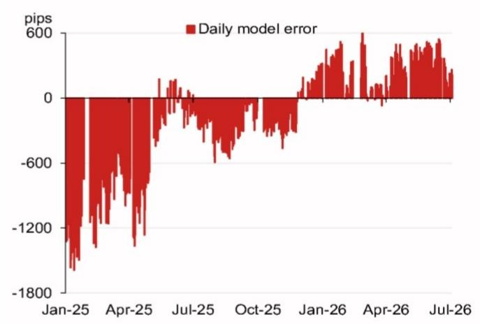

# 人民币定价模型释放的信号：市场尚未充分理解

当前亚洲外汇市场最重要的信号并非美元/人民币的汇率水平，而是模型原始预测与官方定价之间的偏差。根据某主要亚洲外汇策略团队的最新每日预测，剔除逆周期因子后的模型输出为6.7818，较前一官方收盘价低107个基点，较前一日预测低248个基点。这并非随机波动，而是定价机制中蕴含的方向性信号，揭示了多数市场参与者尚未充分重视的政策意图。

人民币定价机制是亚洲（除日本外）外汇市场中最具影响力的价格发现过程。它不仅决定每日交易区间，还影响在岸市场对全球美元走势、贸易政策及国内货币环境的整体反应路径。当模型预测在单日内出现近四分之一个百分点的变动，且逆周期因子调整幅度仅为28个基点时，其含义清晰：当局正在以可控但有意义的方式引导定价下行。这不是断裂，而是重新校准。

当前时点之所以比过去十二个月更为关键，是因为宏观背景已经发生变化。美元受到增长预期放缓、财政不确定性以及美联储日益依赖数据而非前瞻指引等因素的共同压力。与此同时，中国面临的内需环境仍不均衡，房地产领域尚未完全企稳，出口渠道则需应对关税风险及新兴亚洲地区的竞争性贬值动态。在此背景下，人民币定价成为支点。较低的定价有助于缓解出口企业的资金环境，降低实际有效汇率负担，并为国内刺激政策创造空间。但这也会在整个亚洲外汇体系中产生连锁效应。

本文的核心观点是：近期模型误差的模式及定价调整的结构表明，中国人民银行正在执行渐进式调整策略，而非防御性操作。将人民币视为美元指数的被动函数的读者，正在忽略这一主动政策渠道。这对投资组合构建、对冲策略及亚洲（除日本外）的相对价值交易具有实质性影响。

## 模型近期误差模式暗示定价正被引导至新的隐含目标，而非仅对隔夜变动做出反应

剔除逆周期因子后的原始模型预测是一个机械性构造。它通过加权计算美元走势、交叉汇率变动及其他可观测输入的隔夜贡献，得出定价的公允价值。当前预测较前一日低248个基点这一事实本身值得关注，但真正的洞察来自对近期误差模式的审视。

源材料中的图2展示了剔除逆周期因子后的模型误差。此处的误差指模型预测的定价与实际设定值之间的差异。当误差呈现系统性单边特征——即实际定价持续弱于或强于模型预测——这证明存在超越机械性输入的主动政策管理。

现有数据表明，在近几个交易日中，误差方向偏向于确认当局愿意让定价下行。单日偏差可能是随机波动，但连续多个交易日的偏差模式，尤其是在模型自身预测已在下行的情况下，表明当局对调整路径持接受态度，并正以定价作为主要工具来传达这一态度。

关键在于：当局拥有多种管理人民币的工具——每日定价、逆周期因子、国有银行在岸即期市场干预、资金流动管理及口头指引。定价是最透明且最可预测的工具。当定价以与模型一致但略含额外偏好的方式下行时，传递的信号既是刻意的也是可逆的。政策信息并非“我们想要弱势人民币”，而是“我们不会阻碍人民币走弱，并可能主动平滑路径以避免无序”。对读者而言，这一区别至关重要。这意味着做空人民币并非对抗政策阻力的逆向押注，而是日益与政策轨迹一致的押注。

## 逆周期因子使用克制，确认当局无意放缓调整步伐

逆周期因子是当局对定价的酌情调整工具。它可用于抑制过度的单边波动、表达不满或引入不可预测性。当因子数值较大时，意味着定价被刻意偏离模型的机械输出；当因子较小或为零时，意味着当局允许模型以最小干预驱动定价。

在当前预测中，包含逆周期因子的模型结果为6.7846，仅比原始模型预测的6.7818高出28个基点。这是一个微不足道的调整。它表明当局认为没有必要抵制模型已指示的方向。如果当局希望放缓调整步伐，本应施加更大的逆周期因子以拉高定价。但他们没有这样做。

这是整份报告中最重要的数据点。在模型已预测显著更低定价的背景下，较小的逆周期因子相当于为调整继续开绿灯。这与防御相反，是对市场方向的认可，尽管是在可控框架内。

对读者而言，这意味着短期内突然干预以推高人民币的风险较低。当局未对当前轨迹表达任何不满。政策重点似乎是调整路径的稳定性，而非汇率水平本身。这意味着美元/人民币的趋势跟踪策略可能有效，直到出现明确的逆转催化剂——例如资金外流急剧加速、储备充足性恶化，或政治局或中央经济工作会议发出改变政策考量的政治信号。

## 未来事件日历为第三季度可控调整创造窗口

源材料包含从2026年7月下旬至年底的事件日历。关键事件包括7月下旬的政治局经济工作会议、10月初的国庆黄金周假期、11月深圳APEC会议、12月中旬的中央经济工作会议以及12月下旬的政治局会议。此外还有2026年底的访美行程。

每个事件都为汇率管理创造了不同的激励因素。7月的政治局会议可能设定下半年经济政策议程。若会议信号更强调增长支持和出口竞争力，这将与人民币走弱一致。黄金周假期是流动性较低、干预减少的时期，可能放大波动。APEC会议是外交场合，人民币汇率可能成为讨论话题，尤其是若美方提出汇率操纵关切。12月的中央经济工作会议是来年最重要的政策制定会议。

战略含义是：可控调整的窗口现已打开，并将持续至第三季度。政策转变风险在APEC会议及访美行程前后最高，届时外交考量可能产生稳定货币的压力。但在此之前，当局既有激励也有空间允许定价下行。

读者应将其视为一系列决策节点。7月的政治局会议是首个考验。若会议公报强调外部稳定或汇率稳定，调整路径可能暂停；若强调增长和出口支持，路径将继续。市场尚未对二元结果进行定价。基准情形应为延续，尾部风险是第四季度外交事件前后的稳定化。

## 报告未完全解答的问题：人民币调整与亚洲（除日本外）外汇关联性的互动

源材料聚焦于人民币定价模型及其直接影响。它未解答对持有更广泛亚洲外汇组合的读者至关重要的问题：渐进式的人民币调整如何传导至区域内其他货币？

历史模式并非统一。人民币走弱往往对与中国在出口市场竞争的货币（如韩元、新台币、新加坡元）构成下行压力。它也可能对通过供应链和旅游业与中国经济紧密联系的货币（如泰铢、马来西亚林吉特）产生压力。但传导并非机械性的，取决于各央行的政策框架、储备充足性水平及国内经济周期。

报告未提供衡量第二轮效应的框架。它未回答当前调整路径是否已反映在其他亚洲外汇对中，或是否存在滞后调整创造交易机会。它也未涉及日元的作用——日元是亚洲外汇最重要的外部锚定，其自身受日本央行政策及美日利差驱动，具有复杂动态。

这些都是需要额外分析的开放性问题。报告提供了起点——人民币定价信号——但投资组合影响取决于该信号如何传播。希望基于人民币观点采取行动的读者，还需形成关于是否对冲或通过其他亚洲外汇对、期权或交叉汇率交易（如CNH/KRW或CNH/TWD）表达该观点的判断。

## 读者决策框架：如何为可控的人民币调整布局

对于接受当局正在执行渐进式调整这一论点的读者，问题在于如何实施。以下框架概述了关键决策。

首先，明确时间跨度。定价模型信号对一至三个月的时间跨度最为相关。超出此范围，第四季度的外交事件带来不确定性，使路径更难以预测。对于战术性交易，当前环境有利。对于战略性配置，随着时间推移，风险回报比将变得不那么吸引人。

其次，选择表达方式。表达人民币调整观点最直接的方式是通过美元/离岸人民币（可交割）或美元/在岸人民币无本金交割远期。在岸市场对许多国际读者而言可及性较低，离岸市场提供更好的流动性和更少的限制。对于无法直接交易人民币的读者，次优表达是通过做空与人民币相关的亚洲外汇篮子，如韩元、新台币和新加坡元。相关性并非完美，但方向一致。

第三，根据逆周期因子风险调整头寸规模。当前因子较小，但可能变化。若当局开始施加更大的逆周期因子，这将是调整步伐放缓的信号。读者应为因子设定触发水平——例如，若因子连续两日超过100个基点——这将导致重新评估交易。

第四，监控事件日历。7月的政治局会议是下一个主要催化剂。若会议公报显示政策优先事项转变，应调整交易；若与当前轨迹一致，可维持交易。

第五，考虑对冲。人民币调整交易的主要风险是突然干预推高货币。当前风险较低，但在APEC会议及访美行程前后增加。读者可通过期权对冲此风险——例如购买保护免受急剧逆转的美元/离岸人民币看跌价差——或通过随事件日期临近而收紧的动态止损。

此框架并非建议，而是思考问题的结构。报告提供了分析基础，读者需自行做出判断。

---

*仅供参考。部分内容可能基于源材料通过AI辅助生成、翻译、总结或编辑，可能存在遗漏或错误。请独立核实。本文不构成专业建议。*

仅供参考。部分内容可能基于源材料通过AI辅助生成、翻译、总结或编辑，可能存在遗漏或错误。请独立核实。本文不构成专业建议。

