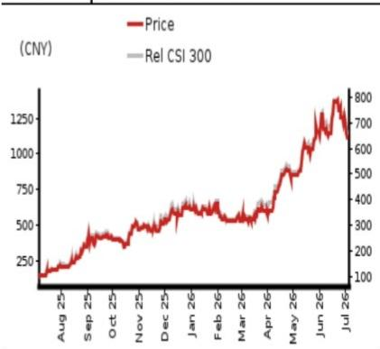

EQUITY: TECHNOLOGY

# 我们预计2027年之后仍将保持长期增长...

## ...由2.4T/3.2T光模块、NPO和CPO驱动

观点：维持积极看法；上调目标价至人民币1,325元，隐含20.6%的上行空间

尽管近期AI基础设施相关板块的报价有所回调，但我们认为，中际旭创在2026-2028财年的基本面增长驱动因素保持不变：1）1.6T和硅光（SiPh）光模块的升级；2）NPO（近封装光学）/CPO（共封装光学）市场的拓展。虽然存在元器件短缺以及超大规模AI客户重复下单的担忧，但我们认为高端光通信产品仍是AIDC市场的关键瓶颈。我们将2027/2028财年全球800G光模块出货量预测上调至5500万/7800万只（此前为5000万/7150万只），1.6T上调至7150万/1.26亿只（此前为6000万/1.1亿只），同时我们首次纳入2027/2028财年2.4T光模块200万/500万只的出货量，以及2028财年320万只3.2T光模块的出货量。我们预计，凭借强大的研发能力和有效的供应链管理，该公司将在全球AIDC光模块市场保持30%~35%的市场份额。我们将2027-2028财年的收入/盈利预测上调28-37%/30-38%（图1），以反映强劲的产品升级以及利润率扩张。因此，我们维持积极看法，并将目标价上调至人民币1,325元，基于20倍（不变）的2027财年预测每股收益人民币66.06元，与WIND中国A股科技/电子元器件板块的中位数市盈率一致。该报价目前对应2027财年预测每股收益的16.6倍。

元器件短缺长期将缓解，公司在高端光模块及NPO/CPO市场的领先地位将保持

由于对高端光模块（尤其是1.6T）的需求旺盛，整个供应链都在努力满足终端客户的需求，但我们认为，短期内供应瓶颈仍然存在，这源于上游材料（如InP衬底）、设备（如MOCVD设备）和元器件（如200G EML）的良率爬坡和供应链扰动。我们预计2026财年第二季度收入/盈利将环比增长25%/22%。然而，我们认为长期来看（可能从2028财年开始），随着中国、日本和美国相关厂商的产能扩张，供应短缺将得到缓解。近期，日经新闻报道称，JX Advanced Metals [5016 JP]（中性评级，由Daiki Ban覆盖）计划在大约5年内将磷化铟（InP）衬底的产能扩大至2026年3月水平的7-10倍。我们认为，中际旭创在光通信市场的领先地位将在高端光模块（2.4T/3.2T）以及NPO/CPO市场得到巩固，这应能推动公司从2028财年起实现持续增长。

<table><tr><td>截至12月31日</td><td colspan="2">FY25</td><td colspan="2">FY26F</td><td colspan="2">FY27F</td><td colspan="2">FY28F</td></tr><tr><td>货币（人民币）</td><td>实际</td><td>旧</td><td>新</td><td>旧</td><td>新</td><td>旧</td><td>新</td><td></td></tr><tr><td>收入（百万元）</td><td>38,240</td><td>122,105</td><td>122,105</td><td>204,546</td><td>261,031</td><td>271,717</td><td>371,545</td><td></td></tr><tr><td>报告净利润（百万元）</td><td>10,797</td><td>32,433</td><td>33,654</td><td>56,525</td><td>73,396</td><td>75,374</td><td>103,944</td><td></td></tr><tr><td>正常化净利润（百万元）</td><td>10,797</td><td>32,433</td><td>33,654</td><td>56,525</td><td>73,396</td><td>75,374</td><td>103,944</td><td></td></tr><tr><td>完全摊薄正常化每股收益</td><td>9.72</td><td>29.19</td><td>30.29</td><td>50.87</td><td>66.06</td><td>67.84</td><td>93.55</td><td></td></tr><tr><td>完全摊薄正常化每股收益增长率（%）</td><td>110.7</td><td>200.4</td><td>211.7</td><td>74.3</td><td>118.1</td><td>33.3</td><td>41.6</td><td></td></tr><tr><td>完全摊薄正常化市盈率（倍）</td><td>113.1</td><td>-</td><td>36.3</td><td>-</td><td>16.6</td><td>-</td><td>11.7</td><td></td></tr><tr><td>企业价值/EBITDA（倍）</td><td>83.6</td><td>-</td><td>27.7</td><td>-</td><td>12.4</td><td>-</td><td>8.2</td><td></td></tr><tr><td>市净率（倍）</td><td>41.0</td><td>-</td><td>21.1</td><td>-</td><td>10.2</td><td>-</td><td>5.9</td><td></td></tr><tr><td>股息率（%）</td><td>0.1</td><td>-</td><td>0.5</td><td>-</td><td>1.0</td><td>-</td><td>1.4</td><td></td></tr><tr><td>净资产回报表现（%）</td><td>44.2</td><td>74.8</td><td>76.8</td><td>70.2</td><td>82.8</td><td>55.5</td><td>63.8</td><td></td></tr><tr><td>净债务/权益（%）</td><td>净现金</td><td>净现金</td><td>净现金</td><td>净现金</td><td>净现金</td><td>净现金</td><td>净现金</td><td></td></tr></table>

来源：公司数据，NOM预测

评级维持积极

目标价
从人民币1,015.00元上调
至人民币1,325.00元

2026年7月6日收盘价 人民币1,098.92元

<table><tr><td>隐含上行空间</td><td>+20.6%</td></tr></table>

<table><tr><td>市值（百万美元）</td><td>181,397.6</td></tr><tr><td>日均交易量（百万美元）</td><td>4,469.0</td></tr></table>

## 相对表现图

  
来源：LSEG，NOM

## 研究分析师

中国科技行业
段冰 - NIHK
bing.duan1@NOM.com
+852 2252 2141

张逸涵 - NIHK
ethan.zhang@NOM.com
+852 2252 2157

## 中际旭创关键数据

现金流量表（人民币百万元）

<table><tr><td>表现(%)</td><td>1个月</td><td>3个月</td><td>12个月</td><td></td><td></td></tr><tr><td>相对（人民币）</td><td>-6.9</td><td>81.2</td><td>688.0</td><td>市值（百万美元）</td><td>181,397.6</td></tr><tr><td>相对（美元）</td><td>-7.2</td><td>83.6</td><td>731.4</td><td>自由流通股比例（%）</td><td>68.1</td></tr><tr><td>相对沪深300</td><td>-7.4</td><td>72.1</td><td>666.4</td><td>3个月日均交易量（百万美元）</td><td>4,469.0</td></tr></table>

<table><tr><td colspan="6">利润表（人民币百万元）</td></tr><tr><td>截至12月31日</td><td>FY24</td><td>FY25</td><td>FY26F</td><td>FY27F</td><td>FY28F</td></tr><tr><td>收入</td><td>23,862</td><td>38,240</td><td>122,105</td><td>261,031</td><td>371,545</td></tr><tr><td>营业成本</td><td>-15,796</td><td>-22,166</td><td>-66,275</td><td>-140,825</td><td>-199,824</td></tr><tr><td>毛利润</td><td>8,067</td><td>16,074</td><td>55,830</td><td>120,206</td><td>171,721</td></tr><tr><td>销售、一般及管理费用</td><td>-2,170</td><td>-2,170</td><td>-13,033</td><td>-29,168</td><td>-43,374</td></tr><tr><td>员工股份支付费用</td><td></td><td></td><td></td><td></td><td></td></tr><tr><td>营业利润</td><td>5,897</td><td>13,905</td><td>42,796</td><td>91,038</td><td>128,347</td></tr><tr><td>EBITDA</td><td>6,442</td><td>14,644</td><td>43,304</td><td>91,633</td><td>129,009</td></tr><tr><td>折旧</td><td>-545</td><td>-740</td><td>-508</td><td>-595</td><td>-663</td></tr><tr><td>摊销</td><td></td><td></td><td></td><td></td><td></td></tr><tr><td>息税前利润</td><td>5,897</td><td>13,905</td><td>42,796</td><td>91,038</td><td>128,347</td></tr><tr><td>净利息费用</td><td>144</td><td>-183</td><td>-584</td><td>-1,248</td><td>-1,776</td></tr><tr><td>联营及合营企业</td><td></td><td></td><td></td><td></td><td></td></tr><tr><td>其他收入</td><td>11</td><td>-122</td><td>-390</td><td>-834</td><td>-1,188</td></tr><tr><td>税前利润</td><td>6,052</td><td>13,600</td><td>41,822</td><td>88,956</td><td>125,383</td></tr><tr><td>所得税</td><td>-681</td><td>-2,020</td><td>-6,212</td><td>-13,212</td><td>-18,622</td></tr><tr><td>税后净利润</td><td>5,372</td><td>11,580</td><td>35,610</td><td>75,744</td><td>106,761</td></tr><tr><td>少数股东权益</td><td>-200</td><td>-782</td><td>-1,956</td><td>-2,347</td><td>-2,817</td></tr><tr><td>其他项目</td><td></td><td></td><td></td><td></td><td></td></tr><tr><td>优先股股息</td><td></td><td></td><td></td><td></td><td></td></tr><tr><td>正常化归属于母公司净利润</td><td>5,171</td><td>10,797</td><td>33,654</td><td>73,396</td><td>103,944</td></tr><tr><td>特殊项目</td><td></td><td></td><td></td><td></td><td></td></tr><tr><td>报告归属于母公司净利润</td><td>5,171</td><td>10,797</td><td>33,654</td><td>73,396</td><td>103,944</td></tr><tr><td>股息</td><td>-845</td><td>-1,764</td><td>-5,498</td><td>-11,991</td><td>-16,981</td></tr><tr><td>转入储备</td><td>4,327</td><td>9,033</td><td>28,156</td><td>61,406</td><td>86,963</td></tr><tr><td>估值与比率</td><td></td><td></td><td></td><td></td><td></td></tr><tr><td>报告市盈率（倍）</td><td>238.2</td><td>113.1</td><td>36.3</td><td>16.6</td><td>11.7</td></tr><tr><td>正常化市盈率（倍）</td><td>238.2</td><td>113.1</td><td>36.3</td><td>16.6</td><td>11.7</td></tr><tr><td>完全摊薄正常化市盈率（倍）</td><td>238.2</td><td>113.1</td><td>36.3</td><td>16.6</td><td>11.7</td></tr><tr><td>股息率（%）</td><td>0.1</td><td>0.1</td><td>0.5</td><td>1.0</td><td>1.4</td></tr><tr><td>市现率（倍）</td><td>389.3</td><td>112.1</td><td>35.2</td><td>16.2</td><td>11.9</td></tr><tr><td>市净率（倍）</td><td>64.4</td><td>41.0</td><td>21.1</td><td>10.2</td><td>5.9</td></tr><tr><td>企业价值/EBITDA（倍）</td><td>191.0</td><td>83.6</td><td>27.7</td><td>12.4</td><td>8.2</td></tr><tr><td>企业价值/息税前利润（倍）</td><td>208.7</td><td>88.1</td><td>28.0</td><td>12.5</td><td>8.2</td></tr><tr><td>毛利率（%）</td><td>33.8</td><td>42.0</td><td>45.7</td><td>46.1</td><td>46.2</td></tr><tr><td>EBITDA利润率（%）</td><td>27.0</td><td>38.3</td><td>35.5</td><td>35.1</td><td>34.7</td></tr><tr><td>息税前利润率（%）</td><td>24.7</td><td>36.4</td><td>35.0</td><td>34.9</td><td>34.5</td></tr><tr><td>净利润率（%）</td><td>21.7</td><td>28.2</td><td>27.6</td><td>28.1</td><td>28.0</td></tr><tr><td>实际税率（%）</td><td>11.2</td><td>14.9</td><td>14.9</td><td>14.9</td><td>14.9</td></tr><tr><td>股息支付率（%）</td><td>16.3</td><td>16.3</td><td>16.3</td><td>16.3</td><td>16.3</td></tr><tr><td>净资产回报表现（%）</td><td>31.0</td><td>44.2</td><td>76.8</td><td>82.8</td><td>63.8</td></tr><tr><td>总资产回报表现（税前%）</td><td>29.1</td><td>47.9</td><td>105.4</td><td>165.1</td><td>173.9</td></tr><tr><td>增长率（%）</td><td></td><td></td><td></td><td></td><td></td></tr><tr><td>收入</td><td>122.6</td><td>60.3</td><td>219.3</td><td>113.8</td><td>42.3</td></tr><tr><td>EBITDA</td><td>150.4</td><td>127.3</td><td>195.7</td><td>111.6</td><td>40.8</td></tr><tr><td>正常化每股收益</td><td>70.4</td><td>110.7</td><td>211.7</td><td>118.1</td><td>41.6</td></tr><tr><td>正常化完全摊薄每股收益</td><td>70.4</td><td>110.7</td><td>211.7</td><td>118.1</td><td>41.6</td></tr></table>

来源：公司数据，NOM预测

<table><tr><td colspan="6">现金流量表（人民币百万元）</td></tr><tr><td>截至12月31日</td><td>FY24</td><td>FY25</td><td>FY26F</td><td>FY27F</td><td>FY28F</td></tr><tr><td>EBITDA</td><td>6,442</td><td>14,644</td><td>43,304</td><td>91,633</td><td>129,009</td></tr><tr><td>营运资本变动</td><td>-4,452</td><td>-910</td><td>275</td><td>1,279</td><td>-2,093</td></tr><tr><td>其他经营活动现金流</td><td>1,174</td><td>-2,839</td><td>-8,914</td><td>-17,414</td><td>-24,175</td></tr><tr><td>经营活动现金流</td><td>3,165</td><td>10,896</td><td>34,665</td><td>75,498</td><td>102,742</td></tr><tr><td>资本支出</td><td>-2,866</td><td>-2,760</td><td>-2,460</td><td>-2,160</td><td>-1,860</td></tr><tr><td>自由现金流</td><td>298</td><td>8,136</td><td>32,205</td><td>73,338</td><td>100,882</td></tr><tr><td>投资减少</td><td>0</td><td>0</td><td>0</td><td></td><td></td></tr><tr><td>净收购</td><td></td><td></td><td></td><td></td><td></td></tr><tr><td>其他长期资产减少</td><td>0</td><td>0</td><td>0</td><td></td><td></td></tr><tr><td>其他长期负债增加</td><td>917</td><td>130</td><td>0</td><td>0</td><td>0</td></tr><tr><td>调整项</td><td>-993</td><td>12</td><td>0</td><td></td><td></td></tr><tr><td>投资活动后现金流</td><td>223</td><td>8,278</td><td>32,205</td><td>73,338</td><td>100,882</td></tr><tr><td>现金股息</td><td>-845</td><td>-1,764</td><td>-5,498</td><td>-11,991</td><td>-16,981</td></tr><tr><td>股权发行</td><td>246</td><td>205</td><td>0</td><td>0</td><td>0</td></tr><tr><td>债务发行</td><td>1,685</td><td>-1,114</td><td>500</td><td>500</td><td>500</td></tr><tr><td>可转换债务发行</td><td></td><td></td><td></td><td></td><td></td></tr><tr><td>其他</td><td>428</td><td>328</td><td>0</td><td>0</td><td>0</td></tr><tr><td>融资活动现金流</td><td>1,514</td><td>-2,344</td><td>-4,998</td><td>-11,491</td><td>-16,481</td></tr><tr><td>净现金流</td><td>1,737</td><td>5,933</td><td>27,207</td><td>61,848</td><td>84,401</td></tr><tr><td>期初现金</td><td>3,317</td><td>5,054</td><td>10,987</td><td>38,193</td><td>100,041</td></tr><tr><td>期末现金</td><td>5,054</td><td>10,987</td><td>38,193</td><td>100,041</td><td>184,442</td></tr><tr><td>期末净债务</td><td>-2,377</td><td>-9,391</td><td>-36,098</td><td>-97,446</td><td>-181,346</td></tr><tr><td colspan="6">资产负债表（人民币百万元）</td></tr><tr><td>截至12月31日</td><td>FY24</td><td>FY25</td><td>FY26F</td><td>FY27F</td><td>FY28F</td></tr><tr><td>现金及等价物</td><td>5,054</td><td>10,987</td><td>38,193</td><td>100,041</td><td>184,442</td></tr><tr><td>有价证券</td><td></td><td></td><td></td><td></td><td></td></tr><tr><td>应收账款</td><td>4,988</td><td>6,635</td><td>8,629</td><td>10,962</td><td>13,597</td></tr><tr><td>存货</td><td>7,051</td><td>12,681</td><td>21,536</td><td>34,422</td><td>51,577</td></tr><tr><td>其他流动资产</td><td>1,103</td><td>781</td><td>781</td><td>781</td><td>781</td></tr><tr><td>流动资产合计</td><td>18,196</td><td>31,084</td><td>69,139</td><td>146,206</td><td>250,396</td></tr><tr><td>长期投资</td><td></td><td></td><td></td><td></td><td></td></tr><tr><td>固定资产</td><td>5,872</td><td>8,503</td><td>10,455</td><td>12,020</td><td>13,217</td></tr><tr><td>商誉</td><td>378</td><td>378</td><td>291</td><td>205</td><td>118</td></tr><tr><td>其他无形资产</td><td>4,420</td><td>5,325</td><td>5,184</td><td>5,042</td><td>4,901</td></tr><tr><td>其他长期资产</td><td></td><td></td><td></td><td></td><td></td></tr><tr><td>资产总计</td><td>28,866</td><td>45,289</td><td>85,069</td><td>163,473</td><td>268,632</td></tr><tr><td>短期债务</td><td>2,070</td><td>1,086</td><td>1,586</td><td>2,086</td><td>2,586</td></tr><tr><td>应付账款</td><td>4,417</td><td>10,446</td><td>21,570</td><td>38,068</td><td>55,765</td></tr><tr><td>其他流动负债</td><td>10</td><td>27</td><td>27</td><td>27</td><td>27</td></tr><tr><td>流动负债合计</td><td>6,497</td><td>11,558</td><td>23,182</td><td>40,180</td><td>58,377</td></tr><tr><td>长期债务</td><td>606</td><td>510</td><td>510</td><td>510</td><td>510</td></tr><tr><td>可转换债务</td><td></td><td></td><td></td><td></td><td></td></tr><tr><td>其他长期负债</td><td>1,470</td><td>1,599</td><td>1,599</td><td>1,599</td><td>1,599</td></tr><tr><td>负债合计</td><td>8,573</td><td>13,668</td><td>25,292</td><td>42,290</td><td>60,486</td></tr><tr><td>少数股东权益</td><td>1,159</td><td>1,856</td><td>1,856</td><td>1,856</td><td>1,856</td></tr><tr><td>优先股</td><td></td><td></td><td></td><td></td><td></td></tr><tr><td>普通股</td><td>19,134</td><td>29,765</td><td>57,921</td><td>119,327</td><td>206,290</td></tr><tr><td>留存收益</td><td></td><td></td><td></td><td></td><td></td></tr><tr><td>拟派股息</td><td></td><td></td><td></td><td></td><td></td></tr><tr><td>其他权益及储备</td><td></td><td></td><td></td><td></td><td></td></tr><tr><td>股东权益合计</td><td>19,134</td><td>29,765</td><td>57,921</td><td>119,327</td><td>206,290</td></tr><tr><td>权益及负债总计</td><td>28,866</td><td>45,289</td><td>85,069</td><td>163,473</td><td>268,632</td></tr><tr><td>流动性（倍）</td><td></td><td></td><td></td><td></td><td></td></tr><tr><td>流动比率</td><td>2.80</td><td>2.69</td><td>2.98</td><td>3.64</td><td>4.29</td></tr><tr><td>利息保障倍数</td><td>-</td><td>76.1</td><td>73.3</td><td>73.0</td><td>72.3</td></tr><tr><td>杠杆率</td><td></td><td></td><td></td><td></td><td></td></tr><tr><td>净债务/EBITDA（倍）</td><td>净现金</td><td>净现金</td><td>净现金</td><td>净现金</td><td>净现金</td></tr><tr><td>净债务/权益（%）</td><td>净现金</td><td>净现金</td><td>净现金</td><td>净现金</td><td>净现金</td></tr><tr><td>每股数据</td><td></td><td></td><td></td><td></td><td></td></tr><tr><td>报告每股收益（人民币）</td><td>4.61</td><td>9.72</td><td>30.29</td><td>66.06</td><td>93.55</td></tr><tr><td>正常化每股收益（人民币）</td><td>4.61</td><td>9.72</td><td>30.29</td><td>66.06</td><td>93.55</td></tr><tr><td>完全摊薄正常化每股收益（人民币）</td><td>4.61</td><td>9.72</td><td>30.29</td><td>66.06</td><td>93.55</td></tr><tr><td>每股净资产（人民币）</td><td>17.07</td><td>26.79</td><td>52.13</td><td>107.39</td><td>185.66</td></tr><tr><td>每股股息（人民币）</td><td>0.75</td><td>1.59</td><td>4.95</td><td>10.79</td><td>15.28</td></tr><tr><td>运营效率（天）</td><td></td><td></td><td></td><td></td><td></td></tr><tr><td>应收账款周转天数</td><td>61.0</td><td>55.5</td><td>22.8</td><td>13.7</td><td>12.1</td></tr><tr><td>存货周转天数</td><td>131.1</td><td>162.5</td><td>94.2</td><td>72.5</td><td>78.8</td></tr><tr><td>应付账款周转天数</td><td>94.1</td><td>122.4</td><td>88.2</td><td>77.3</td><td>85.9</td></tr><tr><td>现金循环周期</td><td>98.0</td><td>95.6</td><td>28.9</td><td>8.9</td><td>4.9</td></tr></table>

来源：公司数据，NOM预测

## 公司简介

中际旭创是一家总部位于中国的公司，主要从事高端光通信收发模块业务和智能装备制造业务。该公司为云计算数据中心、数据通信、5G无线网络和电信传输网络提供光收发模块。

## 估值方法

我们的目标价人民币1,325.00元基于20倍2027财年预测每股收益人民币66.06元，与WIND中国A股科技/电子元器件板块的中位数市盈率区间一致。基准指数为沪深300。

可能阻碍目标价实现的风险

下行风险：1）数据通信和电信市场对高端光模块的需求低于预期；2）400G和800G光模块细分市场竞争激烈；3）产品升级（如800G、1.6T）慢于预期；4）价格战升级可能影响公司对全球客户的出口。

## ESG

中际旭创作为社会责任的一部分，为电信网络和数据中心提供基础设施产品。光模块的制造需要土地、设备和其他材料，可能对环境产生影响，而工厂自动化可能有助于提高其环境友好性。

## 盈利预测调整

我们上调2026-2028财年收入预测0-37%，以反映对1.6T/3.2T光模块等高端收发器产品的强劲需求，以及向NPO/CPO的业务拓展。我们将2026-2028财年毛利率预测上调2.2-3.9个百分点，以反映来自1.6T和基于硅光产品的更优产品组合。因此，我们的2026-2028财年盈利预测上调4-38%。

图1：中际旭创 – 盈利预测调整

<table><tr><td colspan="2">（人民币百万元）</td></tr><tr><td colspan="2">收入</td></tr><tr><td></td><td>同比变化%</td></tr><tr><td>营业成本</td><td></td></tr><tr><td>毛利润</td><td></td></tr><tr><td>运营支出</td><td></td></tr><tr><td colspan="2">营业利润</td></tr><tr><td></td><td>同比变化%</td></tr><tr><td>财务费用</td><td></td></tr><tr><td>其他收益/支出</td><td></td></tr><tr><td colspan="2">税前利润</td></tr><tr><td></td><td>同比变化%</td></tr><tr><td>税项</td><td></td></tr><tr><td colspan="2">归属于股东净利润</td></tr><tr><td></td><td>同比变化%</td></tr><tr><td colspan="2">每股收益</td></tr><tr><td colspan="2">比率分析</td></tr><tr><td>毛利率</td><td></td></tr
