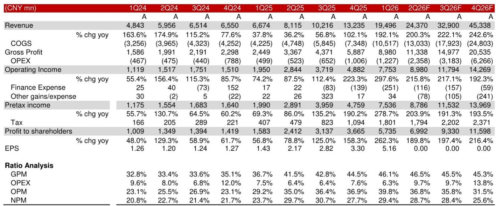
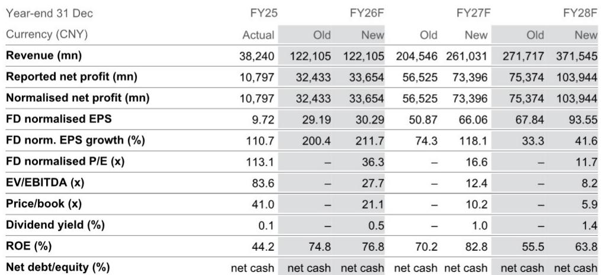
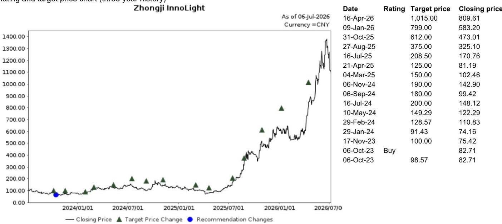

# NOM：AI供应链关注点被低估，中际旭创长期发展窗口持续到2028年

当AI基础设施板块经历了一轮价格调整，市场开始关注组件供应和客户重复下单时，NOM的一份最新报告给出了一个反直觉的判断：**中际旭创的增长驱动力不仅没有减弱，反而正在进入一个更具持续性的技术升级阶段。**

这份报告的核心论点简明但有力：市场的关注点应该从800G/1.6T的量产节奏，转向2.4T/3.2T收发器以及NPO/CPO市场的结构性机会。NOM认为，中际旭创的长期发展窗口至少可以持续到2028年以后，而当前的报价回调恰恰提供了一个重新审视其成长逻辑的窗口。

> **KC评论：** 报告的核心判断是，市场对短期供需扰动的关注，可能低估了产品代际切换带来的长期价值。完整报告里对2027-2028年2.4T和3.2T出货量的首次预测，以及相应的营收/利润上调幅度，是理解这一逻辑转折的关键数据。

## 1. 产品升级的“第二曲线”已经启动，而非停留在规划阶段

许多人将光模块公司的发展理解为“一代产品吃几年”。但NOM的预测显示，中际旭创的增长正在从“1.6T升级”向“2.4T/3.2T预研”加速切换。报告首次纳入了2027/2028年2.4T和3.2T收发器的出货量假设——这不再是概念，而是被纳入了正式的财务预测模型。

这一调整的直接结果是，NOM将2027/2028年的营收预测大幅上调了28-37%，净利润预测上调了30-38%。驱动这一增长的不是简单的产能扩张，而是产品结构的质变：更高单价、更高毛利率的产品开始在收入组合中占据更大比重。

## 2. 供应瓶颈是短期约束，而非长期天花板

市场对组件短缺的关注是真实的。200G EML、InP晶圆、MOCVD设备——这些上游环节的产能爬坡确实在影响近几个季度的交付。NOM估算，2026年二季度营收和净利润仍可实现环比25%和22%的增长，但供应紧张不会立即缓解。

但报告的真正洞察在于，这些瓶颈恰恰强化了中际旭创的竞争壁垒。报告引用了日本JX Advanced Metals计划将InP晶圆产能扩大7-10倍的信息，暗示供应链的瓶颈正在被系统性解决。当短缺缓解时，那些已经建立深度合作关系的头部厂商将率先受益。

> **KC评论：** 报告没有回避短期不确定性，但它的分析框架是“短期约束 vs 长期能力”。完整报告中关于供应链瓶颈何时缓解的具体时间表（2028年之后），以及中际旭创在NPO/CPO市场的份额假设，值得仔细阅读。

## 3. 报告尚未完全回答的关键问题：市场份额的“天花板”在哪里？

NOM假设中际旭创在全球AIDC收发器市场维持30-35%的份额。这个数字在过去两年被反复验证，但问题在于：当产品从1.6T向3.2T演进时，竞争格局是否会发生变化？

目前来看，硅光技术（SiPh）和CPO的成熟度、新进入者的影响、以及下游云厂商自研光学模块的可能性，都是报告没有完全展开的变量。NOM提到了“有效供应链管理”是公司的核心优势，但这个优势在更复杂的NPO/CPO架构下是否能延续，需要更多行业数据来验证。

对于产业观察者而言，一个更务实的观察框架是：**跟踪中际旭创在每代产品上的毛利率变化，而不是只看营收增速。** 如果毛利率在1.6T向2.4T切换的过程中保持稳定甚至提升，那么“份额领先”的叙事就比“规模增长”更有说服力。

For informational purposes only. Portions may be generated,translated,summarized,or edited with AI assistance based on source materials and may contain omissions or errors. Please verify independently. This is not investment,legal,tax,accounting,or other professional advice.

For informational purposes only. Portions may be generated,translated,summarized,or edited with AI assistance based on source materials and may contain omissions or errors. Please verify independently. This is not investment,legal,tax,accounting,or other professional advice.

