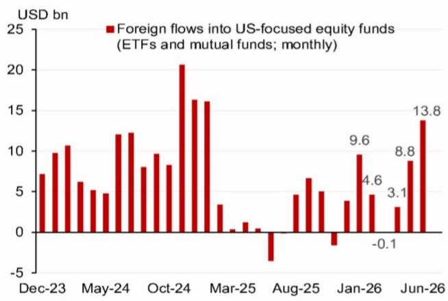
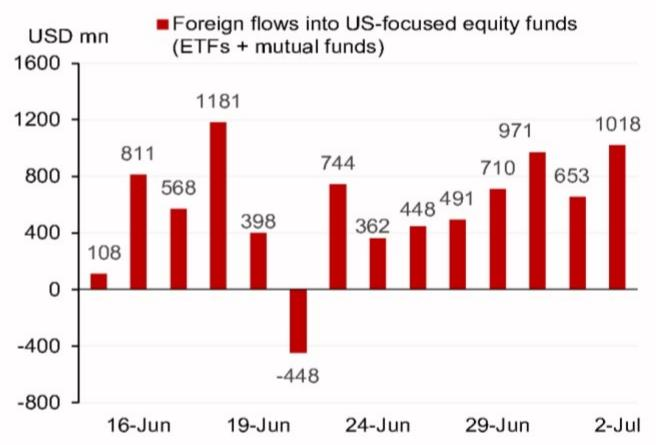
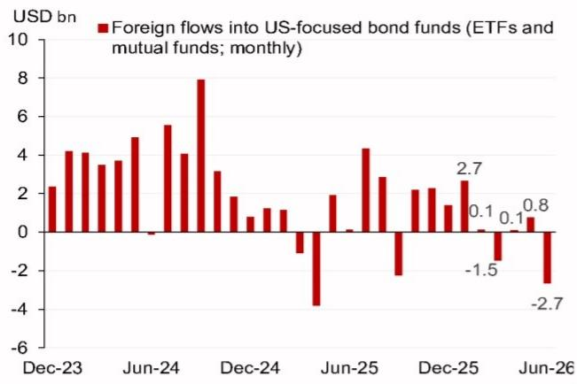
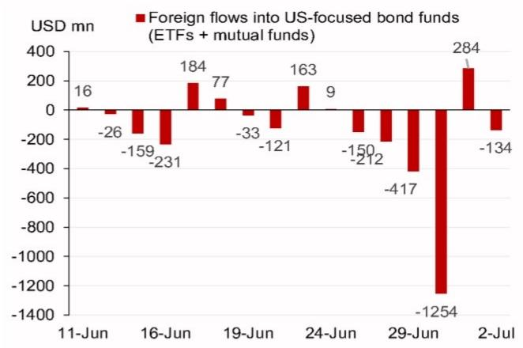
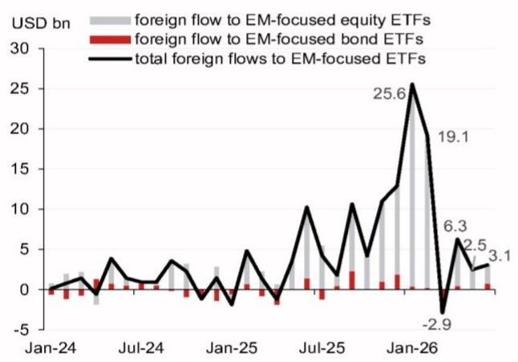
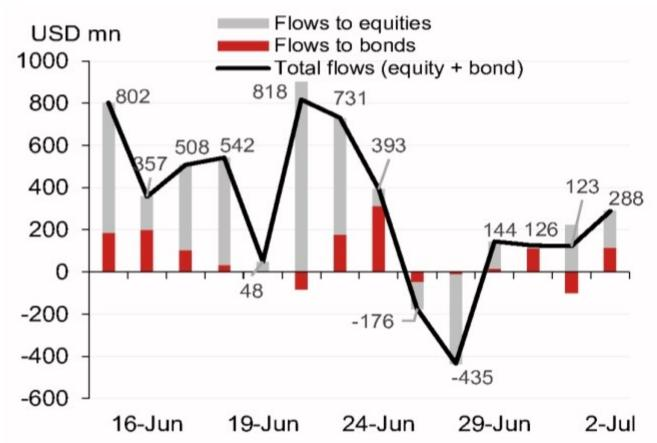
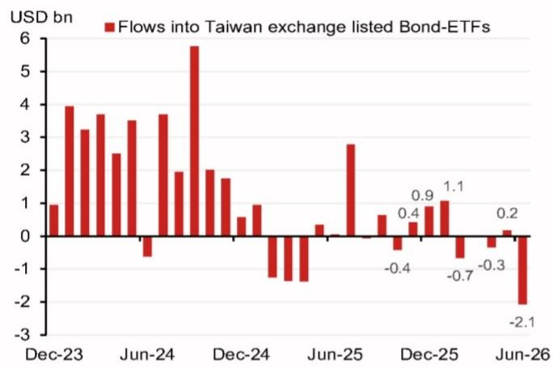
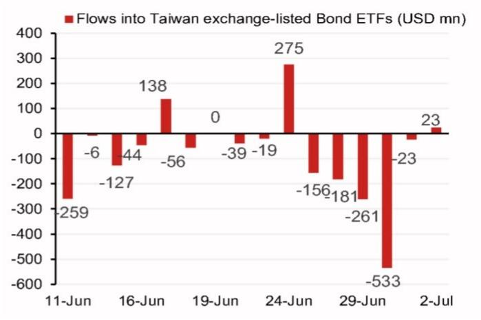

# 宏观观察

## 6月美国市场资金流入规模为一年多来最高

- 6月26日至7月2日期间，海外资金净流入美国相关基金总计21亿美元，其中权益类基金净流入38亿美元，部分被债券类基金净流出17亿美元所抵消。

- 6月海外资金净流入美国权益类基金（138亿美元）为2025年1月（161亿美元）以来最高水平，尽管近期AI相关公司表现有所波动，但资金流入势头仍在延续。

- 6月26日至7月2日，新兴市场相关ETF资金净流入放缓至2.46亿美元，此前一周为18亿美元。

- 6月27日至7月3日，韩国个人读者净买入美国组合资产仅2100万美元，低于前一周的4900万美元。

- 6月26日至7月2日，台湾读者净卖出美元计价债券基金9.75亿美元，此前一周为净买入6100万美元。

## 研究团队

亚洲外汇策略
Craig Chan - NSL
Wee Choon Teo - NSL
Vicky Chen - NSL
Manthan Shingala - NSL

图1：美国相关证券资金流向汇总

<table><tr><td></td><td colspan="3">美国相关基金（ETF和共同基金）海外投资</td><td colspan="3">新兴市场相关ETF</td><td colspan="3">韩国个人投资</td><td>台湾本地ETF投资</td></tr><tr><td>百万美元</td><td>美国权益</td><td>美国债券</td><td>合计</td><td>权益类基金</td><td>债券类基金</td><td>合计</td><td>美国权益</td><td>美国债券</td><td>合计</td><td>美元计价债券</td></tr><tr><td>最近一周（5个交易日）</td><td>3,843</td><td>-1,732</td><td>2,111</td><td>114</td><td>132</td><td>246</td><td>160</td><td>-139</td><td>21</td><td>-975</td></tr><tr><td>前一周（前5个交易日）</td><td>1,503</td><td>-132</td><td>1,371</td><td>1,457</td><td>357</td><td>1,814</td><td>25</td><td>25</td><td>49</td><td>61</td></tr><tr><td>6月月度资金流</td><td>13,784</td><td>-2,655</td><td>11,129</td><td>2,284</td><td>771</td><td>3,054</td><td>633</td><td>-167</td><td>466</td><td>-2,068</td></tr><tr><td>5月月度资金流</td><td>8,770</td><td>767</td><td>9,537</td><td>2,434</td><td>51</td><td>2,485</td><td>-940</td><td>372</td><td>-568</td><td>175</td></tr><tr><td>4月月度资金流</td><td>3,087</td><td>114</td><td>3,201</td><td>5,832</td><td>453</td><td>6,285</td><td>-469</td><td>-441</td><td>-910</td><td>-339</td></tr><tr><td>3月月度资金流</td><td>-110</td><td>-1,465</td><td>-1,575</td><td>-237</td><td>-2,646</td><td>-2,882</td><td>1,691</td><td>-166</td><td>1,525</td><td>-29</td></tr><tr><td>2月月度资金流</td><td>4,603</td><td>126</td><td>4,729</td><td>18,920</td><td>184</td><td>19,104</td><td>3,949</td><td>257</td><td>4,206</td><td>-662</td></tr><tr><td>1月月度资金流</td><td>9,561</td><td>2,669</td><td>12,229</td><td>25,150</td><td>401</td><td>25,551</td><td>5,003</td><td>396</td><td>5,399</td><td>1,065</td></tr></table>

注：最新周度数据截至7月2日（美国权益和债券类ETF及共同基金、新兴市场相关ETF、台湾读者）及7月3日（韩国个人读者）。前一周数据为最新周度之前的5个交易日。
来源：彭博、KSD、NOM

## 高频读者资金周度更新

- 6月26日至7月2日，海外资金净流入美国权益类ETF和共同基金[1]总计38亿美元（图3），此前一周为15亿美元。6月该类基金净流入总额为138亿美元，为2025年1月（161亿美元）以来最高水平（图2）。

- 6月26日至7月2日，海外资金净流出美国债券类ETF和共同基金[2]总计17亿美元，此前一周为净流出1.32亿美元（图5）。6月该类基金净流出总额为27亿美元，为2025年4月以来最高月度净流出（图4）。

- 6月26日至7月2日，海外资金小幅净流入新兴市场相关ETF[3]总计2.46亿美元，此前一周为18亿美元。6月海外读者净买入新兴市场基金31亿美元（主要为新兴市场权益类基金23亿美元），超过2026年5月的25亿美元净流入（图6和图7）。

- 6月26日至7月2日，台湾上市美元债券ETF净流出9.75亿美元，此前一周为小幅净流入6100万美元（图9）。6月台湾读者净卖出美元计价债券21亿美元，为两年多来最高净流出（图8）。

- 6月27日至7月3日，韩国个人读者净买入美国组合资产2100万美元，包括净买入美国权益约1.6亿美元和净卖出美国债券1.39亿美元（图10和图11）。6月韩国个人读者净买入美国组合资产4.66亿美元，部分逆转了5月的5.68亿美元净卖出。

图2：海外资金流入美国权益类ETF和共同基金（月度）

来源：彭博、NOM

图3：海外资金流入美国权益类ETF和共同基金（日度）

来源：彭博、NOM

图4：海外资金流入美国债券类ETF和共同基金（月度）

来源：彭博、NOM

图5：海外资金流入美国债券类ETF和共同基金（日度）

来源：彭博、NOM

图6：海外资金流入新兴市场相关ETF（月度）

来源：彭博、NOM

图7：海外资金流入新兴市场相关ETF（日度）

来源：彭博、NOM

图8：台湾资金流入美元债券ETF（月度）

来源：彭博、NOM

图9：台湾资金流入美元债券ETF（日度）

来源：彭博、NOM

图10：韩国个人资金流入美国权益和债券（月度）

来源：KSD、NOM

图11：韩国个人资金流入美国权益和债券（日度）

来源：KSD、NOM

[1] 美国权益类ETF和共同基金：指主要投资于美国权益类证券的基金。
[2] 美国债券类ETF和共同基金：指主要投资于美国债券类证券的基金。
[3] 新兴市场相关ETF：指投资于新兴市场地区的ETF。我们追踪海外资金流入新兴市场基金的指标基于以下假设：在非新兴市场上市的新兴市场相关ETF主要由海外读者持有。
