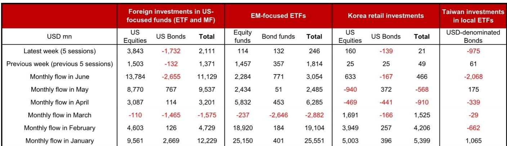
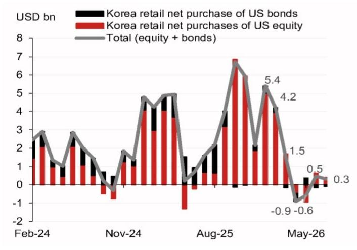
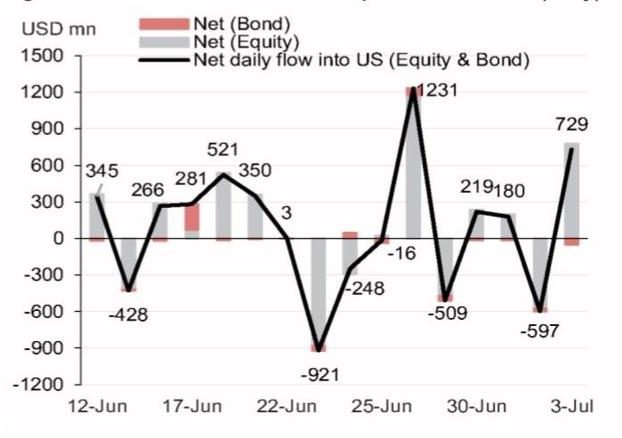

# NOM：6月138亿美元涌入美国公司，NOM发现资金流向新信号

一份来自NOM的最新资金流监测显示，6月全球资金流入美国公司产品的规模达到138亿美元，创下今年1月以来的单月最高纪录。这个数字背后，是AI相关公司波动并未阻止资金持续涌入美国市场的事实。与此同时，新兴市场产品流入显著节奏变化，台湾读者正在抛售美元债券，韩国散户的购买力也明显降温。资金正在向一个方向集中，而这一趋势才刚刚开始被市场定价。

## 1. 美国公司产品的资金流入已恢复到今年初的峰值水平

NOM的数据表明，6月最后一周（6月26日至7月2日），外国读者净观点偏积极美国公司产品38亿美元，推动整个6月的流入规模攀升至138亿美元，仅次于1月的161亿美元。值得注意的是，这一轮资金涌入发生在AI相关公司出现波动之后。市场此前曾担忧AI主题过热可能引发资金外流，但实际数据给出了相反的回答。

> **KC评论：** 资金流数据往往滞后于价格，但6月的数据显示，读者并没有因为AI板块的短期调整而撤出美国公司。这提示我们，资金可能是在做更长期的配置决策，而不是追逐短期热点。

## 2. 新兴市场产品在6月最后一周突然降温，但月度总量仍保持正流入

与美国的强劲流入形成对比，新兴市场ETF在6月最后一周仅获得2.46亿美元的外资流入，远低于前一周的18亿美元。不过，整个6月新兴市场产品仍录得31亿美元净流入，其中公司产品贡献了23亿美元。这个数字虽然高于5月的25亿美元，但远低于年初1月和2月分别超过250亿美元和190亿美元的水平。新兴市场的吸引力正在减弱，尤其是债券产品。

## 3. 台湾和韩国读者的行为揭示了区域性的避险信号

报告中最引人注目的变化来自台湾读者。在6月26日至7月2日这一周，台湾读者净观点偏谨慎了9.75亿美元的美元计价债券产品，而前一周还是净观点偏积极6100万美元。整个6月，台湾读者净观点偏谨慎美元债券21亿美元，创下两年多来的最大月度流出。韩国散户读者的动作则温和得多，6月最后一周仅净观点偏积极2100万美元的美国资产，低于前一周的4900万美元。

## 4. 报告尚未完全回答的关键问题：美国债券的资金流出是否会加速

NOM的数据显示，6月外国读者从美国债券产品净撤出27亿美元，这是自4月以来的最大月度流出。但报告没有深入解释债券流出的原因：是利率预期变化，还是资金正在从债券转向公司？这个问题对于理解下半年全球资产配置方向至关重要。如果债券流出持续，可能意味着市场对美联储政策路径的重新定价正在加速，而这将直接影响美元和新兴市场货币的走势。

> **KC评论：** 债券资金流出的速度值得跟踪。如果美国公司产品流入和债券产品流出同时加速，这可能意味着全球读者正在做一次大的资产类别切换——从避险转向不确定性偏好。但背后的驱动因素（利率、通胀、增长预期）需要进一步的数据来验证。

对于关注全球资产配置的读者，NOM的这份报告提供了一个清晰的观察框架：紧盯美国公司产品的资金流入是否在7月延续，以及台湾读者是否继续抛售美元债券。这两个变量，很可能决定下半年新兴市场汇率和利率的走向。

For informational purposes only. Portions may be generated,translated,summarized,or edited with AI assistance based on source materials and may contain omissions or errors. Please verify independently. This is not investment,legal,tax,accounting,or other professional advice.

For informational purposes only. Portions may be generated,translated,summarized,or edited with AI assistance based on source materials and may contain omissions or errors. Please verify independently. This is not investment,legal,tax,accounting,or other professional advice.

