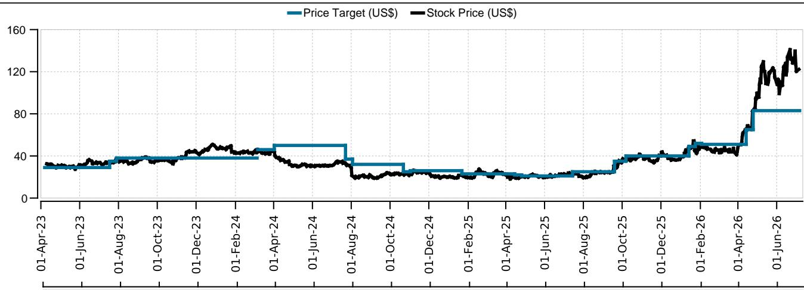

# US Semiconductors SpaceX's Terafab - Putting Things In Perspective

## The What, Why, and When of Musk's Terafab plans

In conjunction with UBS' initiation of SpaceX (covered by John Hodulik), we outline the size, scale, and potential impact to the broader Semi Equipment supply chain. While it is fair to question the magnitude, Elon Musk has set forth a clear vision to build a vertically integrated semiconductor complex capable of producing terawatt-scale AI compute to resemble what has been demonstrated with Tesla's battery strategy (i.e., the Gigafactory). In that case, when the industry could not meet Tesla's battery capacity requirements in 2014, the company effectively built its own fully integrated battery production supply chain. Similarly, Terafab appears to target the full semiconductor complex including mask shop, leading foundry/logic & memory process flows, packaging and testing, all under one roof - enabling rapid "design/build/test/redesign" cycles (Figure 1). Importantly, we believe our supply chain datapoints appear more credible than many observers still seem willing to underwrite. Grimes County (TX) public hearing notices, recent executive hires and an extensive list of Terafab-related process engineering jobs are now being further substantiated by our discussion with equipment suppliers indicating orders having been placed for a pilot line that looks to us to be something in the ~$5B range in C2027. Taken at face value, Terafab will essentially grow to something in the range of TSMC's scale in terms of WFE within 4-5yrs - obviously, a huge development for how high WFE can go over the coming years and putting $300B + WFE in sight for C2029. We expect this to be a major theme over the next few earnings seasons as the project takes shape and tool orders are placed.

## WFE math for Terafab - A new >$50B/yr WFE spender

UBS' analyst John Hodulik forecasts SpaceX's AI business alone (ex-Connectivity and ex-Launch segments) to spend a total of ~$1.1T in capex over the next 5yrs, with ~20% of this capex (or ~$225B) dedicated to Terafab. Assuming the typical 60% capex split to WFE, this would imply ~$135B in WFE spend over the next 5yrs - about the size of the entire global WFE TAM this year. Because this will grow over time and start with a pilot line that we believe to be in the ~$5B range for C2027 and grow to ~$10B in C2028 (already assumed in our ~$250B WFE for '28), the math would suggest that Terafab's WFE spending would have to grow above ~$50B/yr in the C2030/2031 timeframe - which is akin to adding spending in the same ballpark as TSMC's WFE spend over the next few years. Based on the magnitude of the investment and existing filings thus far (specifically, plans that outline an initial $55B semiconductor fab investment by SpaceX with the potential to expand to $119B if all planned phases are completed (all in Grimes County, TX)), we infer SpaceX could be initially planning for a very large fab cluster - potentially something in the range of ~80k wsm for memory and two ~20k wsm foundry/logic fabs, alongside a mask shop and back-end test/assembly capacity. Our assessment is based on Intel's Ohio project (leading-edge greenfield fabs without a pre-existing semiconductor ecosystem) which initially carried an estimated ~$28B investment and, similarly, Boise ID1 fab requiring a ~$15B investment (for ~80k wsm of capacity). We would note that Terafab has indicated an initial focus on memory prior to building out other capabilities - we discuss this more in light of the fact that it has already engaged with INTC (see below). This is all consistent with our recent checks suggesting that INTC may be helping it to secure some slots at toolmakers. Ultimately, even if part of the potential Terafab WFE spend was to materialize, it would reinforce our long-held conviction (here) that industry WFE could approach ~$300B by C2029.

## Read to INTC + Memory suppliers (MU/SK Hynix/Samsung)

We think of INTC's engagement with SpaceX as potentially serving as the "knowledge owner" in the Terafab - in other words, being potentially structured as a technology licensing arrangement, similar to historical models such as the IBM-AMD technology transfer framework that ultimately supported GFS. Under such a structure, INTC could provide access to process flows, manufacturing IP, PDKs, design rules, tool recipes, and potentially operational know-how, while retaining ownership of the underlying technology and collecting a license/royalty payments. Another potential scenario (upon successful pilot) could be INTC dedicating an entire site to Terafab in a JV format. This could be its "Ohio One" site, which is large enough to support two (2) leading-edge fabs - as one of Terafab's campuses. We could also foresee a scenario in which SpaceX invests in INTC further down the road, with the likelihood increasing if Terafab ultimately proved unsuccessful. On the memory front, Musk's comments (Figure 1) explicitly call out memory as part of the effort, although a lot of questions remain unanswered here - most notably, we are unclear where Terafab would source memory IP and see limited incentives for existing memory suppliers to license their IP. However, the emergence of another potential supplier capable of producing memory at scale - if successful - could ultimately prompt Korean companies to invest in US front-end manufacturing for memory (more likely for DRAM – more here), also noting that, for example, Samsung has ample land available to add capacity in Taylor, TX. Overall, we continue to view this development as supportive of SPE suppliers.

Figure 1: Notable comments from the Terafab presentation (Mar-2026)

<table><tr><td>Topic</td><td>Commentary</td></tr><tr><td>Today's compute capacity</td><td>The current output of AI compute is roughly 20 GW per year [...] we need to build the terafab because all of the rest of the output from Earth is about 2% of what we need. So if you add up all the fabs on Earth combined, they're only about 2% of what we need for the terawatt project or Terafab project.</td></tr><tr><td>Capacity expansions by TSMC, Samsung, Micron</td><td>[...] to be clear, we're very grateful to our existing supply chain — to Samsung, TSMC, Micron and others. And we would like them to expand as quickly as they can. [...] But there's a maximum rate at which they're comfortable expanding, but that rate is much less than we would like. And so we either build the terafab or we don't have the chips and we need the chips so we're going to build the terafab. And we're starting off with an advanced technology fab here in Austin.</td></tr><tr><td>100-200GW of Terrestrial compute, rest in Space</td><td>[...] for the space compute my guess is that is the vast majority of the compute because you're power constrained on Earth. That's why I think it's probably 100-200 GW a year of terrestrial chips and probably on the order of a terawatt of chips in space. Just because of power constraints on the ground is probably how it ends up.</td></tr><tr><td>Silicon for Inference first, and then Space</td><td>[...] we expect to make two kinds of chips. One will be optimized for edge inference. So that'll be used primarily in Optimus [...] because I expect the robots — humanoid robots — to be made 10 to 100 times more than the volume of cars. [...] And then we need a high power chip that is designed for space. [...] It's a hostile environment in space. So you want to design the chip — you want to optimize it for space. And you also want to generally run it a little hotter than you would normally run a chip on Earth to minimize the radiator mass.</td></tr><tr><td>Logic, Memory, Packaging, Test, Masks</td><td>In the advanced technology fab, we will have all of the equipment necessary to make a chip of any kind, logic or memory, and we will also have all of the equipment necessary to make the lithography masks. So in a single building we can create a lithography mask, make the chip, test the chip, make another mask and have an incredibly fast recursive loop for improving the chip design [...] you've got everything necessary [...] and just keep looping it</td></tr></table>

Source: Company Presentation

## Valuation Method and Risk Statement

We use various valuation techniques such as P/E, EV/FCF for valuing the companies in this report. Risk factors include but are not limited to macroeconomic factors such as a downturn in the economy, a disruption of international trade, technological disruption due to new inventions, or business model innovation whereby structural changes in the industry alter the future course of unit sales, ASPs, and revenues.

## Intel Corp.:

Our PT is based on a SOTP analysis of the five contributing segments (Intel Products, Intel Foundry, Altera, Mobileye and All Other) each one valued using a tailored P/S multiple applied to F2026E revenues. NVDA has built a formidable moat for new compute-intensive workloads in the data center and could ultimately leverage its GPU architecture to more broadly displace INTC. New client and server CPUs from AMD also present a threat that we could be underestimating.

## SpaceX:

Our price target is SOTP and multiples based. Risks include dependence on Elon Musk as a key decision-maker, delays in achieving technological milestones, failure to scale and monetize AI initiatives, regulatory, geopolitical, and competitive pressures, and high capital intensity with execution risks around supply chains and unproven space-based compute models.

## Required Disclosures

This document has been prepared by UBS LLC, an affiliate of UBS AG. UBS AG, its subsidiaries, branches and affiliates, including former CS AG and its subsidiaries, branches and affiliates are referred to herein as "UBS".

For information on the ways in which UBS manages conflicts and maintains independence of its UBS Global Research product; historical performance information; certain additional disclosures concerning UBS Global Research recommendations; and terms and conditions for certain third party data used in research report, please visit https://www.ubs.com/disclosures. Unless otherwise indicated, information and data in this report are based on company disclosures including but not limited to annual, interim, quarterly reports and other company announcements. The figures contained in performance charts refer to the past; past performance is not a reliable indicator of future results. Additional information will be made available upon request. UBS Co. Limited is licensed to conduct securities investment consultancy businesses by the China Securities Regulatory Commission. UBS acts or may act as principal in the debt securities (or in related derivatives) that may be the subject of this report. This recommendation was finalized on: 07 July 2026 04:05 AM GMT. UBS has designated certain UBS Global Research department members as Derivatives Research Analysts where those department members publish research principally on the analysis of the price or market for a derivative, and provide information reasonably sufficient upon which to base a decision to enter into a derivatives transaction. Where Derivatives Research Analysts co-author research reports with Equity Research Analysts or Economists, the Derivatives Research Analyst is responsible for the derivatives investment views, forecasts, and/or recommendations. Quantitative Research Review: UBS Global Research publishes a quantitative assessment of its analysts' responses to certain questions about the likelihood of an occurrence of a number of short term factors in a product known as the 'Quantitative Research Review'. Views contained in this assessment on a particular stock reflect only the views on those short term factors which are a different timeframe to the 12-month timeframe reflected in any equity rating set out in this note. For the latest responses, please see the Quantitative Research Review Addendum at the back of this report, where applicable. For previous responses please make reference to (i) previous UBS Global Research reports; and (ii) where no applicable research report was published that month, the Quantitative Research Review which can be found at https://neo.ubs.com/quantitative, or contact your UBS sales representative for access to the report or the Quantitative Research Team on ubs-quant-answers@ubs.com. A consolidated report which contains all responses is also available and again you should contact your UBS sales representative for details and pricing or the Quantitative Research team on the email above.

## Analyst Certification:

Each research analyst primarily responsible for the content of this research report, in whole or in part, certifies that with respect to each security or issuer that the analyst covered in this report: (1) all of the views expressed accurately reflect his or her personal views about those securities or issuers and were prepared in an independent manner, including with respect to UBS, and (2) no part of his or her compensation was, is, or will be, directly or indirectly, related to the specific recommendations or views expressed by that research analyst in the research report.

UBS Global Research: Global Equity Rating Definitions

<table><tr><td>12-Month Rating</td><td>Definition</td><td>Coverage $^{1}$ </td><td>IB Services $^{2}$ </td></tr><tr><td>Buy</td><td>FSR is > 6% above the MRA.</td><td>55%</td><td>24%</td></tr><tr><td>Neutral</td><td>FSR is between -6% and 6% of the MRA.</td><td>40%</td><td>21%</td></tr><tr><td>Sell</td><td>FSR is > 6% below the MRA.</td><td>6%</td><td>21%</td></tr></table>

Source: UBS. Rating allocations are as of 30 June 2026.  
1: Percentage of companies under coverage globally within the 12-month rating category.

2: Percentage of companies within the 12-month rating category for which investment banking (IB) services were provided within the past 12 months.

KEY DEFINITIONS: Forecast Stock Return (FSR) is defined as expected percentage price appreciation plus gross dividend yield over the next 12 months. In some cases, this yield may be based on accrued dividends. Market Return Assumption (MRA) is defined as the one-year local market interest rate plus 5% (a proxy for, and not a forecast of, the equity risk premium). Under Review (UR) Stocks may be flagged as UR by the analyst, indicating that the stock's price target and/or rating are subject to possible change in the near term, usually in response to an event that may affect the investment case or valuation. Equity Price Targets have an investment horizon of 12 months.

EXCEPTIONS AND SPECIAL CASES:UK and European Investment Fund ratings and definitions are: Buy: Positive on factors such as structure, management, performance record, discount; Neutral: Neutral on factors such as structure, management, performance record, discount; Sell: Negative on factors such as structure, management, performance record, discount. Core Banding Exceptions (CBE): Exceptions to the standard +/-6% bands may be granted by the Investment Review Consultation (IRC). Factors considered by the IRC include the stock's volatility and the credit spread of the respective company's debt. As a result, stocks deemed to be very high or low risk may be subject to higher or lower bands as they relate to the rating. When such exceptions apply, they will be identified in the Company Disclosures table in the relevant research piece.

Intel Corp. (US$)

<table><tr><td>Company Name</td><td>Reuters</td><td>12-month rating</td><td>Price</td><td>Price date</td></tr><tr><td>Intel Corp. $^{16,28,7,6a}$ </td><td>INTC.O</td><td>Neutral</td><td>US$122.20</td><td>06 Jul 2026</td></tr><tr><td>Space Exploration Technologies Corp $^{2,4,5,16,6b}$ </td><td>SPCX.O</td><td>No Rating</td><td>US$160.42</td><td>06 Jul 2026</td></tr><tr><td colspan="5">Source: UBS Global Research; LSEG Eikon. All prices as of local market close. Ratings in this table are the most current published ratings prior to this report. They may be more recent than the stock pricing date.</td></tr><tr><td>2.</td><td colspan="4">UBS has acted as manager/co-manager in the underwriting or placement of securities of this company/entity or one of its affiliates within the past 12 months.</td></tr><tr><td>4.</td><td colspan="4">Within the past 12 months, UBS has received compensation for investment banking services from this company/entity or one of its affiliates.</td></tr><tr><td>5.</td><td colspan="4">UBS expects to receive or intend to seek compensation for investment banking services from this company/entity within the next three months.</td></tr><tr><td>6a.</td><td colspan="4">This company/entity is, or within the past 12 months has been, a client of UBS LLC, and non-investment banking securities-related services are being, or have been, provided.</td></tr><tr><td>6b.</td><td colspan="4">This company/entity is, or within the past 12 months has been, a client of UBS LLC and/or its affiliates, and investment banking services are being, or have been, provided.</td></tr><tr><td>7.</td><td colspan="4">Within the past 12 months, UBS has received compensation for products and services other than investment banking services from this company/entity.</td></tr><tr><td>16.</td><td colspan="4">UBS LLC makes a market in the securities and/or ADRs of this company.</td></tr><tr><td>28.</td><td colspan="4">UBS holds a long position of 0.5% or more of the listed shares of this company.</td></tr></table>

Research analysts contributing to this report who are employed by any non-US affiliate of UBS LLC are not registered/qualified as research analysts with FINRA. Such analysts may not be associated persons of UBS LLC and therefore are not subject to the FINRA restrictions on communications with a subject company, public appearances, and trading securities held by a research analyst account. The name of each affiliate and analyst employed by that affiliate contributing to this report, if any, follows.

UBS LLC: Aaryan Wadhwa, Alex Kivali, Gianmarco Vella, Natalia Winkler, CFA, Timothy Arcuri.

## Company Disclosures

Unless otherwise indicated, please refer to the Valuation and Risk sections within the body of this report. For a complete set of disclosure statements associated with the companies discussed in this report, including information on valuation and risk, please contact UBS LLC, 11 Madison Avenue, New York, NY 10010, USA, Attention: Investment Research.  

<table><tr><td>Neutral</td><td>1</td></tr><tr><td>No Rating</td><td>1</td></tr></table>

<table><tr><td>Date</td><td>Stock Price (US$)</td><td>Price Target (US$)</td><td>Rating</td></tr><tr><td>2023-04-06</td><td>32.81</td><td>29.00</td><td>Neutral</td></tr><tr><td>2023-07-17</td><td>34.37</td><td>35.00</td><td>Neutral</td></tr><tr><td>2023-07-28</td><td>36.83</td><td>38.00</td><td>Neutral</td></tr><tr><td>2024-03-05</td><td>43.16</td><td>-</td><td>No Rating</td></tr><tr><td>2024-03-06</td><td>44.51</td><td>46.00</td><td>Neutral</td></tr><tr><td>2024-04-01</td><td>44.52</td><td>50.00</td><td>Neutral</td></tr><tr><td>2024-07-22</td><td>33.37</td><td>37.00</td><td>Neutral</td></tr><tr><td>2024-08-02</td><td>21.48</td><td>32.00</td><td>Neutral</td></tr><tr><td>2024-10-21</td><td>22.84</td><td>25.00</td><td>Neutral</td></tr><tr><td>2024-11-01</td><td>23.20</td><td>26.00</td><td>Neutral</td></tr><tr><td>2025-01-21</td><td>21.77</td><td>23.00</td><td>Neutral</td></tr><tr><td>2025-04-14</td><td>20.31</td><td>22.00</td><td>Neutral</td></tr><tr><td>2025-04-25</td><td>20.05</td><td>21.00</td><td>Neutral</td></tr><tr><td>2025-07-14</td><td>23.30</td><td>25.00</td><td>Neutral</td></tr><tr><td>2025-09-18</td><td>30.57</td><td>35.00</td><td>Neutral</td></tr><tr><td>2025-10-06</td><td>36.59</td><td>40.00</td><td>Neutral</td></tr><tr><td>2026-01-13</td><td>47.29</td><td>49.00</td><td>Neutral</td></tr><tr><td>2026-01-23</td><td>45.07</td><td>52.00</td><td>Neutral</td></tr><tr><td>2026-02-02</td><td>48.81</td><td>51.00</td><td>Neutral</td></tr><tr><td>2026-04-13</td><td>65.18</td><td>65.00</td><td>Neutral</td></tr><tr><td>2026-04-24</td><td>82.54</td><td>83.00</td><td>Neutral</td></tr></table>

Source: UBS Global Research; LSEG Eikon as of 06-Jul-2026. All prices as of local market close. Ratings as of date shown.

Additional Prices: Tesla, Inc., US$419.77 (06 Jul 2026); Taiwan Semiconductor Manufacturing, NT$2460.00 (06 Jul 2026); Samsung E&A, Won48300 (06 Jul 2026); Micron Technology Inc, US$984.75 (06 Jul 2026); SK Hynix, Won2343000 (06 Jul 2026); Source: UBS. All prices as of local market close.

The Disclaimer relevant to Global Wealth Management clients follows the Global Research Disclaimer. The Disclaimer relevant to CS Wealth Management follows the Global Wealth Management Disclaimer.

## UBS Global Research Disclaimer

This document has been prepared by UBS LLC, an affiliate of UBS AG. UBS AG, its subsidiaries, branches and affiliates, including former CS AG and its subsidiaries, branches and affiliates are referred to herein as "UBS".

Any opinions expressed in this document may change without notice and are only current as of the date of publication. Different areas, groups, and personnel within UBS may produce and distribute separate research products independently of each other. For example, research publications from UBS CIO are produced by UBS Global Wealth Management. UBS Global Research is produced by UBS Investment Bank. Research methodologies and rating systems of each separate research organization may differ, for example, in terms of investment recommendations, investment horizon, model assumptions, and valuation methods. As a consequence, except for certain economic forecasts (for which UBS CIO and UBS Global Research may collaborate), investment recommendations, ratings, price targets, and valuations provided by each of the separate research organizations may be different, or inconsistent. You should refer to each relevant research product for the details as to their methodologies and rating system. Not all clients may have access to all products from every organization. Each research product is subject to the policies and procedures of the organization that produces it.

This document is provided solely to recipients who are expressly authorized by UBS to receive it. If you are not so authorized you must immediately destroy the document.

UBS Global Research is provided to our clients through UBS Neo, and in certain instances, UBS.com and any other system or distribution method specifically identified in one or more communications distributed through UBS Neo or UBS.com (each a system) as an approved means for distributing UBS Global Research. It may also be made available through third party vendors and distributed by UBS and/or third parties via e-mail or alternative electronic means.

All UBS Global Research is available on UBS Neo. Please contact your UBS sales representative if you wish to discuss your access to UBS Neo. Where UBS Global Research refers to "UBS Evidence Lab Inside" or has made use of data provided by UBS Evidence Lab and you would like to access that data please contact your UBS sales representative. UBS Evidence Lab data is available on UBS Neo. The level and types of services provided by UBS Global Research and UBS Evidence Lab to a client may vary depending upon various factors such as a client's individual preferences as to the frequency and manner of receiving communications, a client's risk profile and investment focus and perspective (e.g., market wide, sector specific, long-term, short-term, etc.), the size and scope of the overall client relationship with UBS Global Research and UBS Evidence Lab and legal and regulatory constraints. UBS HOLT and UBS Pharma Values are offerings of UBS Global Research. HOLT Lens is a corporate performance platform offering that provides an objective accounting-led framework for comparing and valuing companies and is available to clients of UBS Global Research; for further details and pricing please contact your UBS Sales representative. In particular, HOLT has a variety of warranted prices based on the scenario chosen; please mail UBS LLC, 11 Madison Avenue, New York, NY 10010, USA, Attention: Investment Research, if you are interested in the warranted price on a particular company, again subject to commercial considerations. UBS Pharma Values is an analytical tool that involves the creation of a number of individual product net present value calculations, based on published forecasts of sales for pharmaceuticals, and is available to clients of UBS Global Research; for further details and pricing please contact your UBS Sales representative. For all other specific disclaimers, please see https://www.ubs.com/disclosures.

When you receive UBS Global Research through a system, your access and/or use of such UBS Global Research is subject to this UBS Global Research Disclaimer and to the UBS Neo Platform Use Agreement (the "Neo Terms") together with any other relevant terms of use governing the applicable System.

When you receive UBS Global Research via a third party vendor, e-mail or other electronic means, you agree that use shall be subject to this UBS Global Research Disclaimer, the Neo Terms and where applicable the UBS Investment Bank terms of business (https://www.ubs.com/global/en/investment-bank/regulatory.html) and to UBS's Terms of Use/Disclaimer (https://www.ubs.com/global/en/legalinfo2/disclaimer.html). In addition, you consent to UBS processing your personal data and using cookies in accordance with our Privacy Statement (https://www.ubs.com/global/en/legalinfo2/privacy.html) and cookie notice (https://www.ubs.com/global/en/legal/privacy/users.html).

If you receive UBS Global Research, whether through a System or by any other means, you agree that you shall not copy, revise, amend, create a derivative work, provide to any third party, or in any way commercially exploit any UBS provided via UBS Global Research or otherwise, and that you shall not extract data from any research or estimates provided to you via UBS Global Research or otherwise, without the prior written consent of UBS. You agree not to use UBS Global Research in any artificial intelligence system, without the prior written consent of UBS.

In certain circumstances you may receive UBS Global Research otherwise than in the capacity of a client of UBS and you understand and agree that under these circumstances (i) the UBS Global Research is provided to you for information purposes only; (ii) for the purposes of receiving it you are not intended to be and will not be treated as a "client" of UBS for any legal or regulatory purpose; (iii) the UBS Global Research must not be relied on or acted upon for any purpose; and (iv) such content is subject to the relevant disclaimers that follow.

This document is for distribution only as may be permitted by law. It is not directed to, or intended for distribution to or use by, any person or entity who is a citizen or resident of or located in any locality, state, country or other jurisdiction where such distribution, publication, availability or use would be contrary to law or regulation or would subject UBS to any registration or licensing requirement within such jurisdiction.

This document is a general communication and is educational in nature; it is not an advertisement nor is it a solicitation or an offer to buy or sell any financial instruments or to participate in any particular trading strategy. Nothing in this document constitutes a representation that any investment strategy or recommendation is suitable or appropriate to an investor's individual circumstances or otherwise constitutes a personal recommendation. By providing this document, none of UBS or its representatives has any responsibility or authority to provide or have provided investment advice in a fiduciary capacity or otherwise. Investments involve risks, and investors should exercise prudence and their own judgment in making their investment decisions. None of UBS or its representatives is suggesting that the recipient or any other person take a specific course of action or any action at all. The recipient should carefully read this document in its entirety and not draw inferences or conclusions from the rating alone. By receiving this document, the recipient acknowledges and agrees with the intended purpose described above and further disclaims any expectation or belief that the information constitutes investment advice to the recipient or otherwise purports to meet the investment objectives of the recipient. The financial instruments described in the document may not be eligible for sale in all jurisdictions or to certain categories of investors.

Options, structured derivative products and futures (including OTC derivatives) are not suitable for all investors. Trading in these instruments is considered risky and may be appropriate only for sophisticated investors. Prior to buying or selling an option, and for the complete risks relating to options, you must receive a copy of "The Characteristics and Risks of Standardized Options." You may read the document at https://www.theocc.com/publications/risks/riskchap1.jsp or ask your salesperson for a copy. Various theoretical explanations of the risks associated with these instruments have been published. Supporting documentation for any claims, comparisons, recommendations, statistics or other technical data will be supplied upon request. Past performance is not necessarily indicative of future results. Transaction costs may be significant in option strategies calling for multiple purchases and sales of options, such as spreads and straddles. Because of the importance of tax considerations to many options transactions, the investor considering options should consult with his/her tax advisor as to how taxes affect the outcome of contemplated options transactions.

Mortgage and asset-backed securities may involve a high degree of risk and may be highly volatile in response to fluctuations in interest rates or other market conditions. Foreign currency rates of exchange may adversely affect the value, price or income of any security or related instrument referred to in the document. For investment advice, trade execution or other enquiries, clients should contact their local sales representative.

UBS notes that no globally accepted framework or definition (legal, regulatory or otherwise) currently exists, nor is there a market consensus as to what constitutes an "ESG" (Environmental, Social or Governance) or an equivalent-label, or as to what precise attributes are required for the Information (as defined below) to be defined as ESG or equivalently-labelled. Any information, data or other content including from a third party source contained, referred to herein or used for whatsoever purpose by UBS or a third party ("Information"), in relation to any actual or potential ESG objective, issue or consideration is not intended to be relied upon for ESG classification, regulatory regime or industry initiative purposes ("ESG Regimes"). Nothing in these materials is intended to convey, suggest or indicate that UBS considers or represents any product, service, person or body mentioned in these materials as meeting or qualifying for any ESG classification, labelling or similar standards that may exist under the ESG Regimes. UBS has not conducted any assessment of compliance with ESG Regimes. Parties are reminded to make their own assessments for these purposes.

The value of any investment or income may go down as well as up, and investors may not get back the full (or any) amount invested. Past performance is not necessarily a guide to future performance. Neither UBS nor any of its directors, employees or agents accepts any liability for any loss (including investment loss) or damage arising out of the use of all or any of the Information.

Prior to making any investment or financial decisions, any recipient of this document or the information should take steps to understand the risk and return of the investment and seek individualized advice from his or her personal financial, legal, tax and other professional advisors that takes into account all the particular facts and circumstances of his or her investment objectives.

Any prices stated in this document are for information purposes only and do not represent valuations for individual securities or other financial instruments. There is no representation that any transaction can or could have been effected at those prices, and any prices do not necessarily reflect UBS's internal books and records or theoretical model-based valuations and may be based on certain assumptions. Different assumptions by UBS or any other source may yield substantially different results.

No representation or warranty, either expressed or implied, is provided in relation to the accuracy, completeness or reliability of the information contained in any materials to which this document relates (the "Information"), except with respect to Information concerning UBS. The Information is not intended to be a complete statement or summary of the securities, markets or developments referred to in the document. UBS does not undertake to update or keep current the Information. Any statements contained in this report attributed to a third party represent UBS's interpretation of the data, information and/or opinions provided by that third party either publicly or through a subscription service, and such use and interpretation have not been reviewed by the third party. In no circumstances may this document or any of the Information (including any forecast, value, index or other calculated amount ("Values")) be used for any of the following purposes:

(i) valuation or accounting purposes;

(ii) to determine the amounts due or payable, the price or the value of any financial instrument or financial contract; or

(iii) to measure the performance of any financial instrument including, without limitation, for the purpose of tracking the return or performance of any Value or of defining the asset allocation of portfolio or of computing performance fees.

By receiving this document and the Information you will be deemed to represent and warrant to UBS that you will not use this document or any of the Information for any of the above purposes or otherwise rely upon this document or any of the Information.

UBS has policies and procedures, which include, without limitation, independence policies and permanent information barriers, that are intended, and upon which UBS relies, to manage potential conflicts of interest and control the flow of information within divisions of UBS and among its subsidiaries, branches and affiliates. UBS does and seeks to do business with companies covered in its research reports. As a result, investors should be aware that the firm may have a conflict of interest that could affect the objectivity of this report. Investors should consider this report as only a single factor in making their investment decision. For further information on the ways in which UBS Global Research manages conflicts and maintains independence of its research products, historical performance information and certain additional disclosures concerning UBS Global Research recommendations, please visit https://www.ubs.com/disclosures.

UBS Global Research will initiate, update and cease coverage solely at the discretion of UBS Global Research Management, which will also have sole discretion on the timing and frequency of any published research product. The analysis contained in this document is based on numerous assumptions. All material information in relation to published research reports, such as valuation methodology, risk statements, underlying assumptions (including sensitivity analysis of those assumptions), ratings history etc. as required by the Market Abuse Regulation, can be found on UBS Neo. Different assumptions could result in materially different results.

UBS Global Research may utilise artificial intelligence tools ("AI Tools") in the preparation of this document. Notwithstanding any such use of AI Tools, this document has undergone human review.

The analyst(s) responsible for the preparation of this document may interact with trading desk personnel, sales personnel and other parties for the purpose of gathering, applying and interpreting market information. UBS relies on information barriers to control the flow of information contained in one or more areas within UBS into other areas, units, groups or affiliates of UBS. The compensation of the analyst who prepared this document is determined exclusively by UBS Global Research management and senior management (not including investment banking). Analyst compensation is not based on investment banking revenues; however, compensation may relate to the revenues of UBS and/or its divisions as a whole
