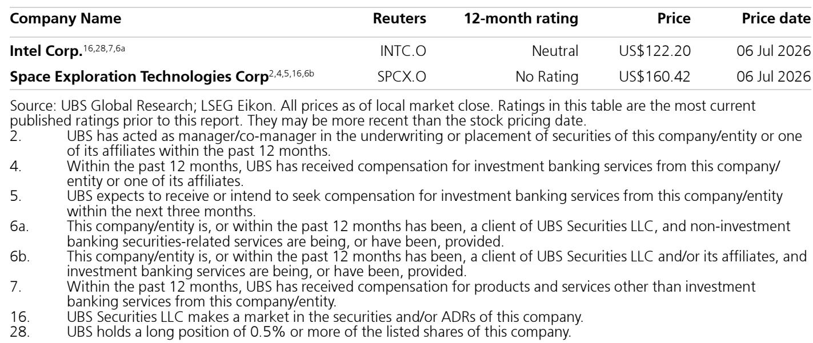
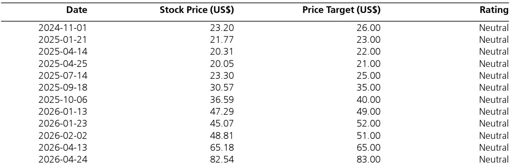

# SpaceX's Terafab Will Reshape the Semiconductor Equipment Industry More Than Any Single Customer Since the Birth of the Foundry Model

The semiconductor industry is about to confront a customer unlike any it has ever served. For decades, the largest consumers of chips—Amazon, Google, Microsoft—have been content to design their own silicon while relying on TSMC and Samsung for fabrication. They pushed capacity, but they did not build it. SpaceX's Terafab project represents a fundamental departure: a customer that intends to become a manufacturer, and on a scale that could rival the entire global wafer fabrication equipment (WFE) market within five years.

This is not speculative ambition dressed as analysis. Public hearing notices in Grimes County, Texas, a growing list of process engineering job postings, and equipment supplier conversations indicating orders for a pilot line in the range of $5 billion for 2027 all point to a project that is moving from concept to procurement. The question is no longer whether Terafab will happen, but what it means for the structure of semiconductor supply chains, the trajectory of WFE spending, and the strategic positions of incumbents from Intel to the Korean memory trio.

The controlling insight is this: Terafab could add $50 billion or more in annual WFE spending by 2030—the equivalent of adding another TSMC-sized buyer to an industry that currently supports roughly $250 billion in total WFE in 2028 projections. If even half of this materializes, every equipment supplier's addressable market expands structurally. But the implications extend far beyond equipment orders. Terafab challenges the fundamental assumption that leading-edge semiconductor manufacturing will remain concentrated among a handful of dedicated foundries and memory specialists.

What makes this moment strategic rather than merely interesting is the timing. The industry is already grappling with capacity constraints driven by AI demand, geopolitical pressures forcing fab construction in multiple geographies, and the technical challenges of scaling beyond angstrom-level nodes. Into this environment steps a customer that, by its own assessment, believes existing fabs can supply only 2% of its required compute capacity. Whether or not that specific figure is precise, the direction of travel is unambiguous: the gap between demand and supply is large enough that vertical integration becomes the rational response, not an act of hubris.

## The WFE Math Implies a New Spending Tier That Will Reshape Industry Visibility and Capacity Allocation

The numbers demand careful examination because they challenge conventional assumptions about how much WFE spending the industry can absorb. A global investment bank report forecasts SpaceX's AI business alone—excluding connectivity and launch segments—to spend approximately $1.1 trillion in total capex over the next five years. Of this, roughly 20%, or $225 billion, is allocated to Terafab. Applying the standard industry ratio of 60% capex-to-WFE yields approximately $135 billion in WFE spend over that period.

To put that in perspective: $135 billion is roughly the size of the entire global WFE market in 2026. But because this spending ramps over time—starting with a $5 billion pilot line in 2027, growing to $10 billion in 2028, and accelerating from there—the implied run rate by 2030 or 2031 exceeds $50 billion annually. That is not incremental growth. That is the creation of a new demand tier equivalent to TSMC's entire annual WFE budget.

The implications for equipment suppliers are profound. Companies like ASML, Applied Materials, Lam Research, and KLA have historically managed their businesses around visibility into a concentrated customer base. Terafab introduces a customer whose spending trajectory, if realized, would represent single-customer concentration risk of an unprecedented kind—but also the potential for a multiyear order book that transforms revenue predictability. The question that suppliers must now answer is whether they can expand capacity fast enough to serve Terafab without starving existing customers, or whether Terafab will effectively crowd out other buyers and drive up lead times and pricing across the industry.

## The Intel Engagement Suggests a Technology Licensing Model That Could Reshape Foundry Economics

The most strategically consequential relationship in the Terafab ecosystem may not be with equipment suppliers but with Intel. The evidence points toward Intel serving as what the industry calls a "knowledge owner"—providing process flows, manufacturing intellectual property, PDKs, design rules, tool recipes, and operational know-how in exchange for license or royalty payments. This would resemble the historical IBM-AMD technology transfer framework that ultimately supported GlobalFoundries.

Such an arrangement would be deeply logical for both parties. Intel possesses leading-edge process technology but has struggled to build a credible external foundry business at scale. Licensing that technology to a well-capitalized captive customer like SpaceX generates revenue without the margin pressure of competing for third-party designs. For SpaceX, it avoids the decade-long process of developing process technology from scratch—a path that has defeated nearly every would-be entrant since the dawn of the foundry era.

But the arrangement also raises uncomfortable questions for the broader foundry ecosystem. If Intel licenses its process technology to Terafab, what prevents SpaceX from eventually becoming a merchant supplier to third parties? The Terafab presentation explicitly describes a facility capable of "making a chip of any kind, logic or memory," with a rapid design-build-test-redesign loop enabled by co-located mask shop, fab, and packaging. That description reads less like a captive facility and more like a potential competitor to TSMC, Samsung, and Intel's own foundry business.

The secondary scenario worth watching is whether a successful pilot leads to a joint venture structure in which Intel dedicates an entire site to Terafab. Intel's Ohio One facility is large enough to support two leading-edge fabs and could serve as a Terafab campus. Such an arrangement would effectively convert Intel from a competitor to a landlord and technology partner, altering the competitive dynamics of US advanced manufacturing. It would also create a powerful incentive for Intel to ensure Terafab succeeds, given the capital already committed to Ohio.

## Memory Strategy Remains the Most Unresolved Variable, With Implications for Korean Suppliers and US Manufacturing Footprint

Elon Musk's public comments explicitly call out memory as part of the Terafab effort. The presentation describes a facility equipped to manufacture "logic or memory," suggesting that Terafab intends to produce both. But the source of memory intellectual property remains conspicuously unclear.

Existing memory suppliers—Micron, Samsung, SK Hynix—have spent decades developing proprietary process technology for DRAM and NAND. Licensing that IP to a potential competitor would be commercially irrational unless the terms were extraordinarily favorable. Yet without licensed IP, Terafab would need to develop memory technology independently, a multi-billion-dollar R&D effort with no guarantee of success against entrenched players with decades of learning-curve advantage.

This creates an intriguing strategic dynamic. The emergence of a well-capitalized potential entrant could motivate Korean suppliers to accelerate their own US front-end manufacturing investments as a defensive measure. Samsung already has ample land available to add capacity in Taylor, Texas. SK Hynix has announced significant US investments. The Terafab threat could transform these plans from incremental expansions into urgent strategic commitments, further boosting US semiconductor equipment demand regardless of whether Terafab's memory ambitions succeed.

The unresolved question is whether Terafab's memory strategy is genuine or whether it serves primarily as negotiating leverage. If Terafab can credibly threaten to build memory capacity, it may extract more favorable supply terms from existing suppliers. If the threat is real, it could trigger the most significant restructuring of the memory industry since the consolidation of the 2000s. The market should expect clarity on this front within 12-18 months, as Terafab's pilot line decisions will reveal whether memory tool orders are included.

## What the Report Does Not Fully Answer: The Viability of Terafab's Timeline and the Risk of Overinvestment

The available analysis provides a compelling framework for Terafab's scale and strategic logic, but it leaves several critical questions unresolved. The most important is whether the timeline is achievable. Building a greenfield semiconductor complex of this magnitude typically requires four to six years from groundbreaking to volume production, assuming no major delays in tool delivery, construction, or process qualification. Terafab's ambition to reach $50 billion in annual WFE spending by 2030 implies an acceleration of this timeline that has few historical precedents.

The report also does not fully address the talent constraint. Leading-edge semiconductor manufacturing requires thousands of highly specialized process engineers, equipment technicians, and facilities managers. The existing talent pool is already stretched thin by simultaneous expansions from TSMC in Arizona, Samsung in Texas, Intel in Ohio, and Micron in New York. Terafab would need to attract and train a workforce that does not yet exist, competing against established employers with proven training pipelines.

There is also the question of SpaceX's organizational capacity to execute a semiconductor manufacturing project while simultaneously scaling its launch business, Starlink constellation, and AI compute initiatives. Tesla's Gigafactory experience demonstrates that Musk-led companies can execute large-scale manufacturing projects, but semiconductor fabrication is orders of magnitude more complex than battery production in terms of process control, contamination management, and equipment integration.

These uncertainties do not invalidate the thesis, but they should temper expectations about the pace of Terafab's ramp. The most likely outcome is a project that achieves its long-term ambition but on a timeline that extends beyond current projections, with significant cost overruns along the way. Equipment suppliers should plan for a scenario in which Terafab orders arrive in waves rather than a continuous stream, with potential pauses as technical challenges are resolved.

## A Decision Framework for Evaluating Terafab's Impact on Equipment Suppliers and Semiconductor Stocks

For investors and strategists assessing Terafab's implications, a structured framework is essential. The following decision logic can help separate signal from noise as the project develops.

First, track the pilot line. The $5 billion pilot line in 2027 is the most concrete near-term signal. If equipment suppliers confirm orders, delivery schedules, and revenue recognition, the project's credibility increases substantially. If the pilot line slips or is scaled back, the entire thesis weakens.

Second, monitor the Intel relationship. The structure of Intel's involvement—whether it remains a technology licensor, becomes a joint venture partner, or ultimately receives investment from SpaceX—will reveal the project's strategic intent. A pure licensing deal suggests Terafab intends to remain captive. A JV structure suggests potential merchant ambitions.

Third, watch memory IP announcements. The absence of a credible memory IP source within the next 12 months would suggest that Terafab's memory plans are either aspirational or dependent on unproven technology development. A licensing deal with an existing memory supplier would be transformative, but seems unlikely absent extraordinary circumstances.

Fourth, assess equipment supplier capacity allocation. If Terafab secures priority allocation from key toolmakers, it will crowd out other customers and drive up lead times. Suppliers that can expand capacity to serve both Terafab and existing customers will benefit disproportionately. Those with constrained capacity may face margin pressure as they balance competing demands.

Fifth, evaluate the geopolitical dimension. Terafab's location in Texas and its potential to produce advanced logic and memory on US soil aligns with national security objectives. This creates a political tailwind that could manifest in the form of CHIPS Act funding, tax incentives, or regulatory streamlining. Any announcements of government support would significantly de-risk the project.

The framework suggests that the most attractive opportunities are in equipment suppliers with broad exposure to multiple Terafab process steps, particularly those in etch, deposition, and metrology. Companies with unique positions in leading-edge logic or memory tool sets stand to benefit regardless of whether Terafab succeeds, because the mere prospect of Terafab will accelerate capacity investments from incumbents. The risk is concentrated in companies whose valuations already assume Terafab success, leaving little room for execution missteps.

## Join the community to read the full report and review the original charts.

The Terafab project represents a structural shift in semiconductor industry dynamics that will unfold over the next three to five years. The equipment suppliers, foundry players, and memory manufacturers that position themselves correctly for this shift will benefit disproportionately. Those that dismiss it as speculative risk missing the most significant demand catalyst the industry has seen since the emergence of the smartphone era.

The full report includes detailed WFE scenario analysis, historical comparisons to Tesla's Gigafactory strategy, and a proprietary framework for assessing Terafab's impact on individual equipment suppliers. The original charts provide visual context for the spending trajectories and capacity assumptions that underpin the analysis. For those seeking to understand how Terafab changes the semiconductor landscape, the complete research is essential reading.

*For informational purposes only. Portions may be generated, translated, summarized, or edited with AI assistance based on source materials and may contain omissions or errors. Please verify independently. This is not professional advice.*

For informational purposes only. Portions may be generated, translated, summarized, or edited with AI assistance based on source materials and may contain omissions or errors. Please verify independently. This is not professional advice.

