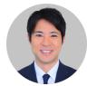

# Japan Consumer

## 最好的时代，最坏的时代：卖我这支笔——你见过我的AI吗？

  
Yugo Shima  
+81 3 6777 6994  
yugo.shima@bernsteinsg.com

Ran Yang

+852 2123 2658

ran.yang@bernsteinsg.com

"这是最好的时代，也是最坏的时代。"狄更斯《双城记》的开篇名句捕捉了一个充满矛盾的时期：法国贵族沉溺于奢华与特权，而平民则经历着贫困与压迫。虽然2026年并非18世纪的法国，但阶层动态的变化比以往任何时候都更具现实意义——从美国的K型经济到中国的中产群体。在本报告中，我们将解释为何日本的价值品质型冠军企业有望在K型世界中胜出。

"卖我这支笔。"华尔街的每一位销售都熟悉这句话。业余者赞美这支笔；专业人士则先发现需求，再让笔来满足它。考验从来不是笔本身——而是买家。先挖掘需求，销售便自然达成。

换个角度思考。如果买家是一个AI，由一位精明的消费者持有，而这位消费者早已知道自己需要什么？没有隐藏的需求需要去挖掘，也没有需求需要去制造。AI忽略推销话术，直接读取规格表，并匹配需求。销售工具包中找不到任何可以抓住的点。这种转变虽处于早期但已在发生，且方向是单向的：品牌在它到来之前很久就已经被重新定价。

而当K型分化加剧时，剩下的中间阶层仍然是大多数。他们虽受挤压但并不粗心，已经成熟——不再接受在价值与品质之间做取舍。他们两者都要。这是我们系列研究的核心：美国、欧洲和中国最大的消费群体正在同步降级，而他们现在手中握有强制执行这一标准的AI。

在这一转变中，哪些品牌受益，哪些受损？在资本主义中，一旦价格超过某个阈值，价值的来源便从产品本身转移到稀缺性——转移到作为象征的意义。那是K型的上臂，炒作是稀缺性的价格，并且它持续存在。但其他人呢？手握一个能调节规格与价格的AI，他们还会继续为那些已偏离实质的炒作支付溢价吗？

日本的品牌从来不是由炒作驱动的。三十年的国内通缩迫使日本的全球复合型企业大力投资产品，精简销售及管理费用，同时保持高利润率。这种纪律体现在AI现在能读取的规格表上：优衣库将约31%的价格投入产品，而GAP约为15%。由实质而非稀缺性来解释定价——这就是它们的护城河。

我们对日本的全球复合型企业持结构性看好的态度。我们给予迅销（跑赢大市）、Food & Life（跑赢大市）和亚瑟士（跑赢大市）评级，良品计划/无印良品（与大市同步）则等待西方市场执行力的验证。

## BERNSTEIN 代码表

<table><tr><td rowspan="2"></td><td rowspan="2"></td><td colspan="3">2026年7月6日</td><td>TTM</td><td colspan="4">报告EPS</td><td colspan="3">报告P/E (x)</td></tr><tr><td></td><td rowspan="2">收盘价</td><td rowspan="2">目标价</td><td rowspan="2">相对表现</td><td rowspan="2">货币</td><td rowspan="2">2025A</td><td rowspan="2">2026E</td><td rowspan="2">2027E</td><td rowspan="2">2025A</td><td rowspan="2">2026E</td><td rowspan="2">2027E</td></tr><tr><td>代码</td><td>评级</td><td>货币</td></tr><tr><td>9983.JP (迅销)</td><td>O</td><td>JPY</td><td>86,930</td><td>90,400</td><td>36.3%</td><td>JPY</td><td>1,409.32</td><td>1,624.60</td><td>1,811.88</td><td>61.7</td><td>53.5</td><td>48.0</td></tr><tr><td>7936.JP (亚瑟士)</td><td>O</td><td>JPY</td><td>4,724.00</td><td>6,100.00</td><td>(17.0)%</td><td>JPY</td><td>138.13</td><td>174.51</td><td>200.17</td><td>34.2</td><td>27.1</td><td>23.6</td></tr><tr><td>7453.JP (良品计划)</td><td>M</td><td>JPY</td><td>3,670.00</td><td>3,700.00</td><td>(40.0)%</td><td>JPY</td><td>95.92</td><td>120.33</td><td>132.32</td><td>38.3</td><td>30.5</td><td>27.7</td></tr><tr><td>3563.JP (Food & Life)</td><td>O</td><td>JPY</td><td>4,616.00</td><td>7,500.00</td><td>(19.4)%</td><td>JPY</td><td>101.35</td><td>138.45</td><td>166.92</td><td>45.5</td><td>33.3</td><td>27.7</td></tr><tr><td>JPL</td><td></td><td></td><td>2,655.16</td><td></td><td></td><td></td><td></td><td></td><td></td><td></td><td></td><td></td></tr></table>

O - 跑赢大市, M - 与大市同步, U - 跑输大市, NR - 未评级, CS - 暂停覆盖

来源：彭博，Bernstein估计与分析。

## 投资启示

我们给予迅销跑赢大市评级。

我们给予亚瑟士跑赢大市评级。

我们给予Food & Life跑赢大市评级。

我们给予良品计划与大市同步评级。

## 估值对比表

图表1：估值对比

<table><tr><td rowspan="2"></td><td rowspan="2">市值(百万美元)</td><td rowspan="2">企业价值(百万美元)</td><td colspan="3">P/E</td><td colspan="3">P/B</td><td colspan="3">EV/EBITDA</td><td colspan="3">ROE</td><td rowspan="2">PEGFY25-FY27</td><td rowspan="2">EPS增长率FY25-FY27</td><td rowspan="2">OPMLTM</td><td rowspan="2">LTM</td><td rowspan="2">股息率1BF</td></tr><tr><td>LTM</td><td>1BF</td><td>2BF</td><td>LTM</td><td>1BF</td><td>2BF</td><td>LTM</td><td>1BF</td><td>2BF</td><td>LTM</td><td>1BF</td><td>2BF</td></tr><tr><td>迅销</td><td>162,718</td><td>153,671</td><td>52.8x</td><td>46.4x</td><td>41.4x</td><td>9.6x</td><td>8.8x</td><td>7.7x</td><td>28.6x</td><td>24.4x</td><td>22.2x</td><td>19.8%</td><td>20.2%</td><td>19.8%</td><td>2.5x</td><td>18.7%</td><td>18.3%</td><td>0.7%</td><td>0.8%</td></tr><tr><td>良品计划</td><td>12,243</td><td>11,986</td><td>31.2x</td><td>26.8x</td><td>23.6x</td><td>4.9x</td><td>4.4x</td><td>3.9x</td><td>15.9x</td><td>14.0x</td><td>12.8x</td><td>17.1%</td><td>18.2%</td><td>18.1%</td><td>1.1x</td><td>24.6%</td><td>10.5%</td><td>0.9%</td><td>1.1%</td></tr><tr><td>日本服装零售商</td><td></td><td></td><td>31.2x</td><td>36.6x</td><td>32.5x</td><td>7.3x</td><td>6.6x</td><td>5.8x</td><td>22.2x</td><td>19.2x</td><td>17.5x</td><td>18.5%</td><td>19.2%</td><td>18.9%</td><td>1.8x</td><td>21.6%</td><td>14.4%</td><td>0.8%</td><td>0.9%</td></tr><tr><td>亚瑟士</td><td>20,412</td><td>20,514</td><td>28.1x</td><td>23.9x</td><td>21.0x</td><td>10.0x</td><td>8.2x</td><td>6.6x</td><td>17.7x</td><td>14.5x</td><td>13.0x</td><td>41.0%</td><td>39.7%</td><td>36.0%</td><td>1.0x</td><td>24.2%</td><td>18.8%</td><td>0.8%</td><td>1.0%</td></tr><tr><td>美津浓</td><td>1,625</td><td>1,505</td><td>13.7x</td><td>13.2x</td><td>12.2x</td><td>1.4x</td><td>1.3x</td><td>1.3x</td><td>9.2x</td><td>8.5x</td><td>8.0x</td><td>11.1%</td><td>10.8%</td><td>11.0%</td><td>2.3x</td><td>5.7%</td><td>9.0%</td><td>1.8%</td><td>2.0%</td></tr><tr><td>尤尼克斯</td><td>1,356</td><td>1,257</td><td>16.6x</td><td>14.6x</td><td>13.3x</td><td>2.5x</td><td>2.1x</td><td>1.9x</td><td>10.0x</td><td>9.2x</td><td>9.3x</td><td>16.2%</td><td>15.4%</td><td>14.9%</td><td>1.3x</td><td>11.6%</td><td>10.2%</td><td>1.1%</td><td>1.2%</td></tr><tr><td>日本运动服饰</td><td></td><td></td><td>19.5x</td><td>17.2x</td><td>15.5x</td><td>4.7x</td><td>3.9x</td><td>3.3x</td><td>12.3x</td><td>10.8x</td><td>10.1x</td><td>22.8%</td><td>22.0%</td><td>20.6%</td><td>1.5x</td><td>13.8%</td><td>12.7%</td><td>1.2%</td><td>1.4%</td></tr><tr><td>Food & Life</td><td>6,818</td><td>7,857</td><td>37.1x</td><td>29.7x</td><td>25.1x</td><td>9.4x</td><td>7.2x</td><td>5.9x</td><td>15.1x</td><td>12.3x</td><td>10.8x</td><td>28.8%</td><td>27.5%</td><td>26.0%</td><td>0.8x</td><td>36.3%</td><td>10.0%</td><td>0.4%</td><td>0.5%</td></tr><tr><td>藏寿司</td><td>830</td><td>1,070</td><td>36.8x</td><td>36.3x</td><td>32.3x</td><td>1.9x</td><td>2.0x</td><td>2.0x</td><td>10.8x</td><td>10.4x</td><td>10.0x</td><td>5.4%</td><td>5.3%</td><td>5.7%</td><td>7.3x</td><td>4.9%</td><td>2.2%</td><td>0.6%</td><td>0.9%</td></tr><tr><td>萨莉亚</td><td>1,753</td><td>1,511</td><td>21.9x</td><td>18.7x</td><td>16.5x</td><td>2.1x</td><td>1.9x</td><td>1.8x</td><td>7.0x</td><td>6.7x</td><td>6.3x</td><td>10.1%</td><td>10.9%</td><td>11.3%</td><td>0.9x</td><td>20.1%</td><td>6.6%</td><td>0.6%</td><td>0.6%</td></tr><tr><td>全胜</td><td>8,244</td><td>9,817</td><td>29.9x</td><td>24.5x</td><td>21.3x</td><td>3.8x</td><td>3.9x</td><td>3.4x</td><td>11.6x</td><td>10.2x</td><td>9.1x</td><td>14.9%</td><td>14.8%</td><td>15.6%</td><td>n.a</td><td>n.a</td><td>6.9%</td><td>0.9%</td><td>1.0%</td></tr><tr><td>物语</td><td>1,135</td><td>1,148</td><td>23.7x</td><td>20.4x</td><td>17.9x</td><td>4.0x</td><td>3.4x</td><td>2.9x</td><td>10.7x</td><td>9.7x</td><td>8.7x</td><td>18.3%</td><td>17.3%</td><td>17.3%</td><td>0.8x</td><td>26.3%</td><td>7.6%</td><td>0.9%</td><td>1.0%</td></tr><tr><td>云雀</td><td>3,984</td><td>4,565</td><td>35.8x</td><td>30.6x</td><td>28.2x</td><td>3.4x</td><td>3.1x</td><td>2.8x</td><td>8.7x</td><td>8.2x</td><td>7.7x</td><td>9.8%</td><td>10.5%</td><td>10.6%</td><td>1.9x</td><td>16.5%</td><td>7.1%</td><td>0.9%</td><td>1.0%</td></tr><tr><td>Ohso</td><td>1,174</td><td>1,041</td><td>20.7x</td><td>21.9x</td><td>20.8x</td><td>2.4x</td><td>2.2x</td><td>2.1x</td><td>12.3x</td><td>-</td><td>-</td><td>10.7%</td><td>10.2%</td><td>10.2%</td><td>n.a</td><td>n.a</td><td>8.6%</td><td>1.9%</td><td>1.9%</td></tr><tr><td>日本餐饮服务</td><td></td><td></td><td>29.4x</td><td>26.0x</td><td>23.2x</td><td>3.8x</td><td>3.4x</td><td>3.0x</td><td>10.9x</td><td>9.6x</td><td>8.8x</td><td>14.0%</td><td>13.8%</td><td>13.8%</td><td>2.3x</td><td>20.8%</td><td>7.0%</td><td>1.0%</td><td>1.0%</td></tr><tr><td>PPIH</td><td>16,197</td><td>17,741</td><td>22.6x</td><td>20.1x</td><td>18.7x</td><td>3.6x</td><td>3.1x</td><td>2.8x</td><td>12.8x</td><td>11.8x</td><td>11.2x</td><td>16.9%</td><td>16.5%</td><td>15.7%</td><td>1.0x</td><td>20.2%</td><td>7.3%</td><td>1.0%</td><td>1.2%</td></tr><tr><td>永旺</td><td>23,411</td><td>40,867</td><td>51.7x</td><td>44.1x</td><td>35.6x</td><td>3.1x</td><td>2.9x</td><td>2.7x</td><td>10.1x</td><td>9.1x</td><td>8.6x</td><td>6.4%</td><td>6.9%</td><td>8.5%</td><td>2.3x</td><td>19.0%</td><td>2.8%</td><td>1.0%</td><td>1.1%</td></tr><tr><td>Seven and I</td><td>32,357</td><td>53,370</td><td>16.7x</td><td>16.8x</td><td>15.9x</td><td>1.3x</td><td>1.3x</td><td>1.2x</td><td>9.1x</td><td>9.8x</td><td>9.5x</td><td>7.6%</td><td>7.5%</td><td>7.8%</td><td>5.6x</td><td>3.0%</td><td>4.2%</td><td>2.5%</td><td>3.1%</td></tr><tr><td>Trial</td><td>2,288</td><td>4,368</td><td>39.4x</td><td>32.9x</td><td>20.9x</td><td>2.8x</td><td>2.4x</td><td>2.2x</td><td>11.0x</td><td>9.8x</td><td>8.8x</td><td>7.3%</td><td>8.8%</td><td>12.1%</td><td>1.5x</td><td>22.1%</td><td>2.7%</td><td>0.5%</td><td>0.6%</td></tr><tr><td>Izumi</td><td>1,281</td><td>1,958</td><td>12.1x</td><td>10.8x</td><td>10.2x</td><td>0.7x</td><td>0.7x</td><td>0.6x</td><td>6.5x</td><td>6.4x</td><td>6.2x</td><td>5.8%</td><td>6.0%</td><td>6.2%</td><td>n.a.</td><td>n.a.</td><td>4.8%</td><td>3.1%</td><td>3.2%</td></tr><tr><td>Kobe Bussan</td><td>4,527</td><td>3,842</td><td>17.3x</td><td>18.1x</td><td>16.7x</td><td>3.4x</td><td>3.0x</td><td>2.6x</td><td>12.8x</td><td>11.5x</td><td>10.7x</td><td>21.7%</td><td>17.7%</td><td>16.6%</td><td>3.5x</td><td>5.2%</td><td>7.5%</td><td>1.1%</td><td>1.3%</td></tr><tr><td>Life Corp</td><td>1,435</td><td>1,469</td><td>11.7x</td><td>11.5x</td><td>11.1x</td><td>1.4x</td><td>1.3x</td><td>1.2x</td><td>5.5x</td><td>5.3x</td><td>5.1x</td><td>12.8%</td><td>11.6%</td><td>11.0%</td><td>n.a.</td><td>n.a.</td><td>2.9%</td><td>2.6%</td><td>2.8%</td></tr><tr><td>Cosmos Pharmaceutical</td><td>3,163</td><td>3,287</td><td>16.1x</td><td>15.2x</td><td>14.3x</td><td>1.8x</td><td>1.6x</td><td>1.5x</td><td>8.2x</td><td>7.4x</td><td>7.0x</td><td>12.0%</td><td>11.1%</td><td>10.9%</td><td>2.3x</td><td>6.7%</td><td>3.7%</td><td>1.2%</td><td>1.3%</td></tr><tr><td>Matsukiyocokara</td><td>6,029</td><td>5,313</td><td>17.1x</td><td>15.5x</td><td>14.6x</td><td>1.8x</td><td>1.6x</td><td>1.5x</td><td>7.9x</td><td>7.6x</td><td>7.2x</td><td>10.5%</td><td>10.8%</td><td>10.8%</td><td>1.9x</td><td>8.2%</td><td>7.7%</td><td>2.1%</td><td>2.4%</td></tr><tr><td>Sundrug</td><td>2,809</td><td>2,675</td><td>14.1x</td><td>12.8x</td><td>12.1x</td><td>1.6x</td><td>1.4x</td><td>1.4x</td><td>6.6x</td><td>6.0x</td><td>5.7x</td><td>11.3%</td><td>11.5%</td><td>11.4%</td><td>1.6x</td><td>8.0%</td><td>5.7%</td><td>3.5%</td><td>3.8%</td></tr><tr><td>Sugi</td><td>3,689</td><td>3,598</td><td>12.6x</td><td>16.4x</td><td>15.0x</td><td>1.9x</td><td>1.7x</td><td>1.6x</td><td>8.4x</td><td>7.4x</td><td>6.9x</td><td>16.6%</td><td>11.1%</td><td>11.3%</td><td>-2.0x</td><td>-8.3%</td><td>4.9%</td><td>1.1%</td><td>1.2%</td></tr><tr><td>Kusuri no aoki</td><td>2,192</td><td>2,756</td><td>20.9x</td><td>18.0x</td><td>16.4x</td><td>2.5x</td><td>2.3x</td><td>2.1x</td><td>10.3x</td><td>10.1x</td><td>9.6x</td><td>11.9%</td><td>13.1%</td><td>13.4%</td><td>1.4x</td><td>12.9%</td><td>4.3%</td><td>1.5%</td><td>1.7%</td></tr><tr><td>日本食品零售商</td><td></td><td></td><td>18.2x</td><td>19.4x</td><td>16.8x</td><td>2.2x</td><td>1.9x</td><td>1.8x</td><td>9.1x</td><td>8.5x</td><td>8.0x</td><td>11.7%</td><td>11.1%</td><td>11.3%</td><td>1.9x</td><td>9.7%</td><td>4.9%</td><td>1.8%</td><td>2.0%</td></tr><tr><td>Inditex*</td><td>202,054</td><td>196,614</td><td>28.1x</td><td>24.9x</td><td>22.9x</td><td>9.3x</td><td>8.0x</td><td>7.5x</td><td>15.0x</td><td>13.8x</td><td>12.8x</td><td>34.0%</td><td>32.4%</td><td>33.4%</td><td>2.2x</td><td>11.4%</td><td>20.5%</td><td>3.0%</td><td>3.3%</td></tr><tr><td>H&M*</td><td>27,615</td><td>33,638</td><td>21.8x</td><td>20.1x</td><td>18.7x</td><td>7.9x</td><td>6.3x</td><td>5.9x</td><td>8.5x</td><td>8.1x</td><td>7.8x</td><td>34.9%</td><td>31.7%</td><td>33.3%</td><td>2.4x</td><td>8.5%</td><td>8.7%</td><td>4.2%</td><td>4.5%</td></tr><tr><td>欧洲服装零售商</td><td></td><td></td><td>24.9x</td><td>22.5x</td><td>20.8x</td><td>8.6x</td><td>7.1x</td><td>6.7x</td><td>11.8x</td><td>10.9x</td><td>10.3x</td><td>34.4%</td><td>32.1%</td><td>33.3%</td><td>2.3x</td><td>10.0%</td><td>14.6%</td><td>3.6%</td><td>3.9%</td></tr><tr><td>阿迪达斯*</td><td>37,666</td><td>43,413</td><td>23.7x</td><td>17.0x</td><td>14.2x</td><td>5.4x</td><td>4.7x</td><td>4.1x</td><td>11.6x</td><td>9.8x</td><td>8.8x</td><td>23.8%</td><td>27.6%</td><td>28.9%</td><td>0.6x</td><td>30.9%</td><td>9.7%</td><td>1.5%</td><td>2.3%</td></tr><tr><td>彪马*</td><td>4,525</td><td>6,838</td><td></td><td></td><td></td><td>2.1x</td><td>2.4x</td><td>2.3x</td><td></td><td></td><td></td><td>-27.4%</td><td>-5.9%</td><td>5.5%</td><td></td><td></td><td></td><td></td><td></td></tr><tr><td>欧洲运动服饰</td><td></td><td></td><td>23.7x</td><td>17.0x</td><td>23.8x</td><td>3.7x</td><td>3.6x</td><td>3.2x</td><td>11.6x</td><td>11.6x</td><td>8.8x</td><td>-1.8%</td><td>10.9%</td><td>17.2%</td><td>0.6x</td><td>0.3x</td><td>5.4%</td><td>2.6%</td><td>1.2%</td></tr><tr><td>Compass Group*</td><td>56,387</td><td>65,120</td><td>27.9x</td><td>20.9x</td><td>18.9x</td><td>7.1x</td><td>5.8x</td><td>5.1x</td><td>14.5x</td><td>11.9x</td><td>11.0x</td><td>27.1%</td><td>29.0%</td><td>28.9%</td><td>0.8x</td><td>26.1%</td><td>7.5%</td><td>2.1%</td><td>2.4%</td></tr><tr><td>Elior*</td><td>594</td><td>1,935</td><td>8.1x</td><td>7.9x</td><td>5.6x</td><td>0.6x</td><td>0.6x</td><td>0.5x</td><td>5.5x</td><td>4.6x</td><td>4.3x</td><td>7.9%</td><td>6.8%</td><td>9.3%</td><td>2.5x</td><td>3.2%</td><td>2.9%</td><td>2.0%</td><td>3.0%</td></tr><tr><td>AmRest</td><td>644</td><td>2,380</td><td>63.8x</td><td>13.3x</td><td>13.0x</td><
