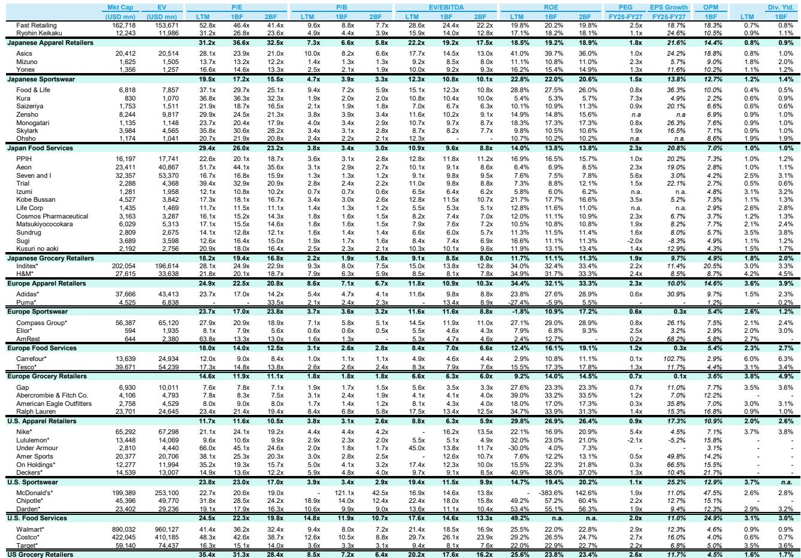
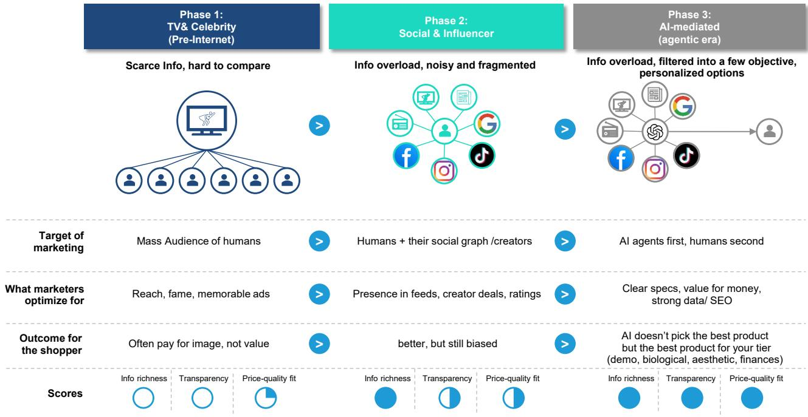
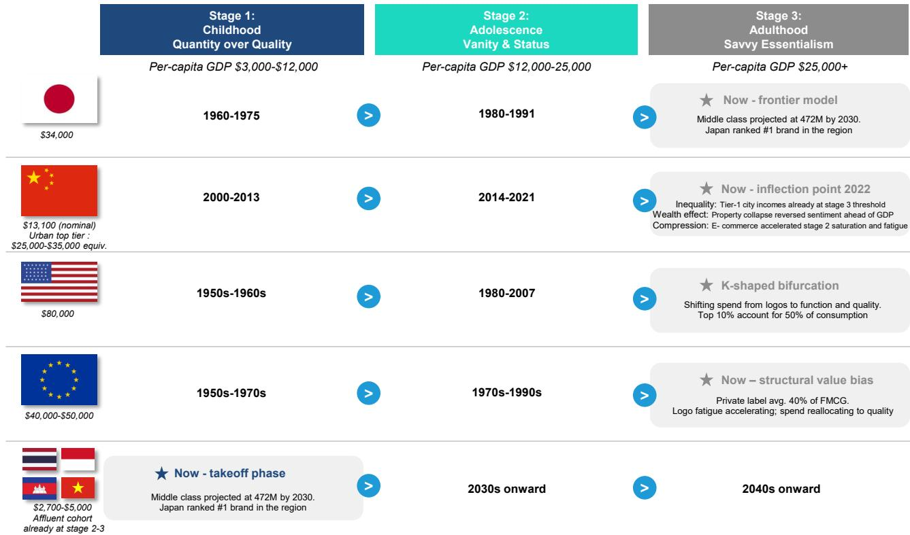

# Japan's Value-Quality Champions Are Uniquely Positioned to Win in an AI-Mediated, K-Shaped Consumer World

The most important shift in global consumer markets is not happening in stores or on screens. It is happening inside the decision loop. A new intermediary now stands between every brand and every buyer: artificial intelligence. This is not a futuristic scenario. The AI is already reading spec sheets, comparing prices, and filtering out noise. For the first time in modern consumer capitalism, the buyer arrives at the transaction already knowing exactly what they need and what it should cost.

This changes the fundamental dynamics of brand value. The old playbook relied on manufacturing desire through storytelling, scarcity, and emotional resonance. The classic line, "Sell me this pen," was never about the pen. It was about identifying a need the buyer did not know they had. But when the buyer is accompanied by an AI that has already matched specifications to requirements, there is no hidden need to uncover. The pitch is ignored. The spec sheet wins.

We are entering a period defined by contradiction. The global consumer economy is pulling apart along a K-shaped trajectory. At the top, scarcity and meaning still command premium pricing. Below that, the vast middle is being squeezed. This middle is not poor, but it is no longer willing to accept a trade-off between value and quality. It demands both. And it now holds the tool to enforce that demand. Within this structural shift, Japan's global compounders are not just well positioned. They are structurally advantaged in ways that their Western peers cannot easily replicate.

## The K-Shaped Consumer Divide Creates a Structural Premium for Brands That Deliver Substance Over Hype

The K-shaped recovery is now a permanent feature of the consumer landscape. In the United States, Europe, and China, the bifurcation is visible in spending patterns, savings rates, and sentiment data. The upper arm of the K continues to trade on scarcity, exclusivity, and symbolic meaning. Luxury goods, limited-edition sneakers, and high-end dining still command premium pricing because the source of value has migrated from the product itself to what the product signifies. In this segment, hype is the price of admission, and it endures because the buyer is not optimizing for utility.

The lower arm of the K is where the real structural change is unfolding. This is not the bottom of the income distribution. It is the squeezed middle, the largest consumer pool in every major economy. These consumers have not stopped spending, but they have become radically more discerning. They have matured past the point where brand storytelling alone justifies a price premium. They want products that deliver measurable quality at a fair price. The difference now is that they have an AI tool that can verify whether the product actually delivers.

This is not a cyclical tightening. It is a permanent shift in consumer behavior driven by the availability of transparent information. Brands that have historically relied on marketing spend to create an impression of quality will find that impression increasingly difficult to sustain. The AI does not care about the advertising campaign. It reads the material composition, the manufacturing cost, the durability rating, and the price. The gap between perception and reality is now measurable, and the market will close it.

## Japan's Global Compounders Built Their Moats During Three Decades of Deflation, and That Moat Is Now a Competitive Advantage

The conventional narrative about Japan's lost decades focuses on stagnation, deflation, and demographic decline. What that narrative misses is the forced adaptation that occurred within Japan's best consumer companies. When domestic demand was flat or declining for thirty years, companies could not grow by raising prices or expanding volume at home. They had to compete on product quality and operational efficiency simultaneously.

The result is a group of companies that operate with a fundamentally different cost structure than their global peers. Consider the allocation of revenue between product cost and selling, general, and administrative expenses. A leading Japanese apparel retailer puts approximately 31 percent of its retail price into the product itself. A comparable Western apparel company puts roughly 15 percent into product. The Japanese company runs lean on SG&A and holds high margins because it has been forced to do so for decades. The Western company spends heavily on marketing, store experience, and brand management because that was the winning formula in an era of expanding consumption.

When the AI reads the spec sheet, it reads the product cost share. It sees that one brand delivers twice the material value for the same price point. The Japanese company does not need to manufacture a story about quality. The quality is embedded in the cost structure. This is not a marketing advantage. It is a structural cost advantage that becomes a competitive moat in a world where buyers are informed.

The discipline extends beyond product cost. Japanese compounders have invested systematically in supply chain efficiency, inventory management, and store-level productivity. They learned to do more with less because they had no choice. That muscle memory is now an asset that is difficult to replicate. Western competitors would need to fundamentally restructure their cost base, reduce marketing spend, and improve product input ratios. That is not a quarterly adjustment. It is a multiyear transformation that most companies will resist until the market forces them.

## The AI Buyer Does Not Care About Brand Narrative, Only About the Ratio of Value to Price

This is the core argument that the report makes, and it deserves careful unpacking. The traditional sales process, whether in retail or business-to-business, relied on an information asymmetry. The seller knew more about the product than the buyer. The seller could frame the product's attributes, emphasize certain features, and downplay others. The buyer's decision was influenced by the narrative.

Artificial intelligence inverts this dynamic. The buyer arrives with more information than the seller can control. The AI has already aggregated reviews, compared specifications against alternatives, and calculated the value-for-money ratio. The seller's narrative is not just irrelevant. It is a liability if it does not match the data.

For brands that have built their premium on storytelling, this is a significant challenge. The premium that was justified by the narrative now looks like a markup that cannot be explained. The buyer sees the spec sheet, sees the price, and asks a simple question: what am I paying for that is not in the product? If the answer is marketing, the transaction does not close.

For brands that have built their premium on product substance, this is a tailwind. The AI validates what the brand claims. The spec sheet confirms the quality. The buyer's decision is reinforced by the data, not undermined by it. The transaction closes faster, with less friction, and with higher satisfaction.

This dynamic is early but accelerating. The direction is one-way. As AI tools become more integrated into consumer purchasing decisions, the premium for substance will rise and the premium for narrative will fall. The revaluation of brands will happen long before the revenue impact is visible in quarterly reports.

## The Report's Framework Leaves Unanswered Questions About the Upper Arm of the K and the Limits of Substance

The argument for Japan's value-quality champions is compelling, but it is not complete. The report acknowledges that the upper arm of the K operates on different economics. Scarcity and symbolic meaning command pricing that cannot be justified by product cost alone. A luxury handbag does not cost twenty times more to produce than a mid-range alternative. The premium is for the scarcity, the status, and the meaning.

The unanswered question is whether the upper arm is also vulnerable to AI mediation. If a buyer can authenticate a luxury product, compare it across resale markets, and verify its provenance, does the scarcity premium hold? The answer may depend on whether the buyer is purchasing for personal consumption or for social signaling. If the purchase is for signaling, the AI cannot replace the social validation that comes from owning the scarce object. But if the purchase is for personal utility, the AI may erode the premium at the margins.

A second unanswered question is about the limits of substance. If every brand optimizes for product cost share and operational efficiency, does the competitive advantage disappear? The report argues that Japan's compounders have a structural lead that is difficult to replicate. But over a long enough time horizon, competitors can restructure. The question is whether the lead is sustainable for five years, ten years, or longer. The report suggests it is sustainable, but the evidence is based on the current trajectory, not on a scenario where competitors fully adapt.

A third question is about the role of brand loyalty in an AI-mediated world. If the AI recommends the best value option, does the consumer follow the recommendation every time? The report assumes that the rational decision wins. But consumer behavior is not fully rational. Habit, familiarity, and identity still matter. The question is how much they matter when the AI presents a clearly superior alternative.

These questions do not undermine the report's thesis. They define the boundaries of the argument. The thesis is strongest for the squeezed middle, where value optimization is the dominant logic. It is less strong for the upper arm, where signaling overrides optimization. And it depends on the assumption that consumers will follow the AI's recommendation, which is not guaranteed.

## A Decision Framework for Evaluating Consumer Brands in the Age of AI Mediation

The report's analysis translates into a practical framework for assessing which consumer brands will win and which will lose. The framework has four dimensions.

First, measure the product cost share of revenue. This is the single most important metric in the new environment. A high product cost share means the brand is investing in substance. A low product cost share means the brand is investing in marketing and distribution. The AI will expose the difference. The threshold is not absolute, but the gap between a brand and its competitors matters. A brand that puts 30 percent of revenue into product while its peer puts 15 percent has a structural advantage that will compound over time.

Second, assess the brand's dependence on narrative premium. How much of the price is explained by the product and how much by the story? Brands that sell a lifestyle rather than a product are vulnerable. Brands that sell a product with a clear spec sheet are resilient. The test is simple: if you removed all marketing for a year, would the product still sell on its merits? If the answer is no, the brand is at risk.

Third, evaluate the cost structure flexibility. Can the brand compete on price without destroying margins? Japanese compounders have lean cost structures built over decades. Western peers have higher fixed costs in marketing, real estate, and corporate overhead. The ability to flex pricing without margin compression is a competitive advantage that becomes more valuable as AI drives price transparency.

Fourth, consider the brand's international expansion potential. The report highlights that some Japanese compounders have yet to prove their model works outside Japan. The domestic discipline is clear, but the ability to replicate it in Western markets, with different consumer expectations and cost structures, is not guaranteed. This is the key uncertainty for companies like the operator of the MUJI brand, which the report rates as Market-Perform pending Western execution proof.

This framework can be applied not just to Japanese companies but to any consumer brand with global exposure. The AI mediation thesis is not Japan-specific. It is a global structural shift. Japanese companies happen to be best positioned because of their historical adaptation to deflation. But the framework applies universally.

## Join the Community to Read the Full Report and Review the Original Charts

The analysis presented here is based on a detailed research report that includes valuation comps, financial projections, and company-specific ratings. The full report provides granular data on product cost structures, SG&A efficiency, and margin trajectories for each of the covered companies. It also includes the original charts that illustrate the K-shaped consumer divide and the AI mediation thesis.

The report leaves several open questions that are worth exploring further. How quickly will AI mediation spread across different consumer categories? Which Western brands are most at risk of structural repricing? Can the upper arm of the K sustain its premium in a world of radical transparency? These are the questions that the full report begins to answer, and that ongoing research will continue to address.

Join the community to read the full report and review the original charts.

---

*For informational purposes only. Portions may be generated, translated, summarized, or edited with AI assistance based on source materials and may contain omissions or errors. Please verify independently. This is not professional advice.*

For informational purposes only. Portions may be generated, translated, summarized, or edited with AI assistance based on source materials and may contain omissions or errors. Please verify independently. This is not professional advice.

