# Korea Internet

## Korea E-commerce: Coupang June GMV grew 4%...Getting richer doesn't mean buying groceries twice

  
Min-Joo Kang  
+852 2123 2644

minjoo.kang@bernsteinsg.com

Robin Zhu

+852 2123 2659

robin.zhu@bernsteinsg.com

Charles Gou

+852 2123 2618

charles.gou@bernsteinsg.com

Hyrum Caesar

+81 3 6777 6979

hyrum.caesar@bernsteinsg.com

We share our June GMV update across major e-commerce and food delivery platforms, together with the latest May market data. Recently, discussions have centered on one question: Will Coupang benefit as Koreans become wealthier? We believe this is the wrong lens through which to view the opportunity. Instead, the key issue is how spending patterns are evolving within Korea's increasingly polarized consumer landscape. In this note, we outline our views on the Korean retail market and assess the respective growth runways for Coupang and Naver.

Korea is getting richer, but not equally. Korea's affluent population continues to expand. The number of high-net-worth individuals (HNWIs) reached 576k in 2025 (+3.3% YoY), while their share of the population increased to 0.9% from 0.7% in 2020. At the same time, wealth concentration is accelerating: the top decile now accounts for 46.1% of national net wealth in 2025, up 1.6ppt YoY, while the highest income quintile captured 45.2% of household income in Q1 2026, up 0.8ppt YoY. These trends point to an increasingly pronounced K-shaped economy.

Premium spending is flowing to department stores, not groceries. Affluent consumers do not simply buy more everyday necessities. Instead, incremental spending is increasingly concentrated in premium and luxury brands such as Chanel, Van Cleef & Arpels, and Cartier. Semi-durable goods such as fashion continue to outgrow most retail categories, while department stores (+19% YoY in May) are consistently outperforming hypermarkets (-7% YoY in May) despite serving a narrower customer base. In other words, rising wealth benefits premium retail channels more than mass-market grocery platforms.

June data suggests Coupang may be losing share. Coupang's GMV grew 4% YoY in June, according to Wiseapp data released on July 3. In comparison, Naver's GMV increased 14% YoY over the same period. Meanwhile, KOSIS online retail sales data, published on July 1, showed 9% YoY market growth (excl. food delivery and auto) in May. Given that Coupang delivered 10% YoY growth in May, the June result suggests that its growth has decelerated to only low single-digit levels above, or potentially below, overall market growth.

Naver's share gain story remains intact. Naver's stronger growth performance is being driven by its expanding Brand Store ecosystem, which is well positioned to capture demand in item categories such as semi-durable goods. As a result, Naver appears to be gaining share in higher-value merchandise categories where brand engagement and product discovery are key differentiators. Naver appears to be pulling ahead while remaining in full combat mode through aggressive pricing and 1P fulfillment investments (Link).

Baemin holds the line as Coupang Eats growth normalizes. In food delivery, Baemin (Delivery Hero, covered by Annick Maas) and Coupang Eats posted 10% and 12% YoY GTV growth, respectively, in June, while market shares remained broadly unchanged at 63% and 37%. With growth rates converging, Coupang Eats' share gain story appears to be maturing. The next key strategic question is whether Coupang Eats adopts a 3P marketplace model to expand beyond major metropolitan areas (Link).

## BERNSTEIN TICKER TABLE

<table><tr><td rowspan="2" colspan="2"></td><td colspan="3">2 Jul 2026</td><td colspan="2">TTM</td><td colspan="4">Adjusted EPS</td><td colspan="3">Adjusted P/E (x)</td></tr><tr><td></td><td rowspan="2">Closing Price</td><td rowspan="2">Price Target</td><td rowspan="2">Rel. Perf.</td><td rowspan="2">Cur</td><td rowspan="2">2025A</td><td rowspan="2">2026E</td><td rowspan="2">2027E</td><td rowspan="2">2025A</td><td rowspan="2">2026E</td><td rowspan="2">2027E</td><td></td></tr><tr><td>Ticker</td><td>Rating</td><td>Cur</td><td></td></tr><tr><td>CPNG (Coupang)</td><td>U</td><td>USD</td><td>18.56</td><td>12.00</td><td>(57.9)%</td><td>USD</td><td>0.11</td><td>(0.38)</td><td>0.21</td><td>164.7</td><td>(49.0)</td><td>88.1</td><td></td></tr><tr><td>OLD</td><td></td><td></td><td></td><td></td><td></td><td></td><td></td><td>(0.37)</td><td></td><td></td><td></td><td></td><td></td></tr><tr><td>035420.KS (Naver)</td><td>O</td><td>KRW</td><td>196,500</td><td>330,000</td><td>(59.3)%</td><td>KRW</td><td>13,065</td><td>14,068</td><td>15,783</td><td>15.0</td><td>14.0</td><td>12.5</td><td></td></tr><tr><td>OLD</td><td></td><td></td><td></td><td></td><td></td><td></td><td></td><td>14,089</td><td>15,745</td><td></td><td></td><td></td><td></td></tr><tr><td>SPX</td><td></td><td></td><td>7,483.24</td><td></td><td></td><td></td><td></td><td></td><td></td><td></td><td></td><td></td><td></td></tr><tr><td>ASIAX</td><td></td><td></td><td>1,977.84</td><td></td><td></td><td></td><td></td><td></td><td></td><td></td><td></td><td></td><td></td></tr></table>

## ESTIMATE CHANGE IN BOLD

O - Outperform, M - Market-Perform, U - Underperform, NR - Not Rated, CS - Coverage Suspended

Source: Bloomberg, Bernstein estimates and analysis.

## INVESTMENT IMPLICATIONS

## We rate Coupang Underperform and Naver Outperform.

We reiterate our view that in e-commerce, competition ultimately dictates margins. Naver remains firmly in combat mode in Commerce, with recent promotional activity appearing increasingly aggressive. In terms of incremental GMV growth, we believe Naver Brand Store ecosystem is better positioned to capture demand, potentially gaining share.

We trimmed our Coupang Q2 estimates to reflect: (1) c.4% YoY revenue growth, impacted by foreign exchange headwinds, and (2) the USD 410 million fine, which we expect to be recognized in Q2 OG&A, reducing operating profit and EPS. We modelled Q2 adjusted EBITDA margin at 2%, in line with management's guidance from the previous earnings call for a consolidated adjusted EBITDA margin contraction of approximately 300-400 bps YoY.

We revised our Naver 2026-2027 EPS estimates slightly due to changes in non-operating costs.

## VALUATION COMPS TABLE

EXHIBIT 1: Asia Internet: valuation summary

<table><tr><td></td><td>Rating</td><td>Price target</td><td>Last price</td><td>Crncy</td><td>Market cap (US$mn)</td><td>2026E</td><td>PE 2027E</td><td>2028E</td><td>2026E</td><td>EV/sales 2027E</td><td>2028E</td></tr><tr><td colspan="12">China Internet coverage</td></tr><tr><td>Tencent</td><td>O</td><td>780</td><td>447.60</td><td>HKD</td><td>518,934</td><td>13.0x</td><td>11.2x</td><td>9.7x</td><td>4.3x</td><td>3.7x</td><td>3.2x</td></tr><tr><td>PDD</td><td>M</td><td>110</td><td>82.39</td><td>USD</td><td>117,274</td><td>7.6x</td><td>6.8x</td><td>6.1x</td><td>0.6x</td><td>0.4x</td><td>0.1x</td></tr><tr><td>Meituan</td><td>M</td><td>85</td><td>74.00</td><td>HKD</td><td>58,264</td><td>165.7x</td><td>15.3x</td><td>8.9x</td><td>0.8x</td><td>0.6x</td><td>0.5x</td></tr><tr><td>NetEase</td><td>O</td><td>150</td><td>127.24</td><td>USD</td><td>81,195</td><td>14.0x</td><td>13.0x</td><td>12.4x</td><td>3.3x</td><td>3.1x</td><td>2.9x</td></tr><tr><td>Boss Zhipin</td><td>O</td><td>18</td><td>13.00</td><td>USD</td><td>6,154</td><td>10.5x</td><td>8.7x</td><td>7.8x</td><td>2.3x</td><td>1.6x</td><td>1.1x</td></tr><tr><td>JD</td><td>O</td><td>40</td><td>26.62</td><td>USD</td><td>36,358</td><td>8.6x</td><td>6.3x</td><td>4.8x</td><td>0.2x</td><td>0.2x</td><td>0.2x</td></tr><tr><td>Alibaba</td><td>O</td><td>180</td><td>96.14</td><td>USD</td><td>230,812</td><td>24.1x</td><td>14.1x</td><td>12.0x</td><td>1.6x</td><td>1.5x</td><td>1.4x</td></tr><tr><td colspan="12">China Internet other</td></tr><tr><td>Kuaishou</td><td></td><td></td><td>45.58</td><td>HKD</td><td>25,148</td><td>10.5x</td><td>9.3x</td><td>8.1x</td><td>1.0x</td><td>0.9x</td><td>0.9x</td></tr><tr><td>Bilibili</td><td></td><td></td><td>17.14</td><td>USD</td><td>7,285</td><td>16.8x</td><td>13.3x</td><td>10.2x</td><td>1.1x</td><td>1.0x</td><td>0.9x</td></tr><tr><td>TME</td><td></td><td></td><td>8.63</td><td>USD</td><td>14,339</td><td>9.1x</td><td>8.1x</td><td>7.4x</td><td>1.8x</td><td>1.7x</td><td>1.5x</td></tr><tr><td>Baidu</td><td></td><td></td><td>113.30</td><td>USD</td><td>38,551</td><td>14.2x</td><td>12.7x</td><td>10.3x</td><td>1.1x</td><td>1.0x</td><td>0.9x</td></tr><tr><td>VIPshop</td><td></td><td></td><td>13.26</td><td>USD</td><td>6,368</td><td>5.1x</td><td>5.0x</td><td>4.8x</td><td>0.2x</td><td>0.2x</td><td>0.2x</td></tr><tr><td>Tencent Music</td><td></td><td></td><td>8.63</td><td>USD</td><td>14,339</td><td>9.1x</td><td>8.1x</td><td>7.4x</td><td>1.8x</td><td>1.7x</td><td>1.5x</td></tr><tr><td>Trip.com</td><td></td><td></td><td>41.00</td><td>USD</td><td>25,818</td><td>11.6x</td><td>10.0x</td><td>9.0x</td><td>1.9x</td><td>1.7x</td><td>1.5x</td></tr><tr><td>KE Holdings</td><td></td><td></td><td>15.09</td><td>USD</td><td>17,464</td><td>16.1x</td><td>13.7x</td><td>13.5x</td><td>1.0x</td><td>0.9x</td><td>0.9x</td></tr><tr><td colspan="12">Asian Internet</td></tr><tr><td>Naver</td><td>O</td><td>330,000</td><td>195,700</td><td>KRW</td><td>20,023</td><td>13.9x</td><td>12.4x</td><td>10.8x</td><td>1.5x</td><td>1.1x</td><td>0.8x</td></tr><tr><td>Kakao</td><td>O</td><td>80,000</td><td>35,550</td><td>KRW</td><td>10,269</td><td>20.0x</td><td>17.7x</td><td>14.5x</td><td>1.0x</td><td>0.8x</td><td>0.5x</td></tr><tr><td>Hybe</td><td>O</td><td>400,000</td><td>215,000</td><td>KRW</td><td>6,043</td><td>21.4x</td><td>21.1x</td><td>17.3x</td><td>1.4x</td><td>1.5x</td><td>1.3x</td></tr><tr><td>Coupang</td><td>U</td><td>12</td><td>18.56</td><td>USD</td><td>33,316</td><td>-49.0x</td><td>88.1x</td><td>42.8x</td><td>0.8x</td><td>0.7x</td><td>0.7x</td></tr><tr><td>Sea Ltd.</td><td></td><td></td><td>103.30</td><td>USD</td><td>63,270</td><td>27.8x</td><td>20.3x</td><td>16.0x</td><td>1.9x</td><td>1.5x</td><td>1.3x</td></tr><tr><td>Grab</td><td></td><td></td><td>3.90</td><td>USD</td><td>15,992</td><td>39.4x</td><td>26.2x</td><td>19.5x</td><td>2.8x</td><td>2.4x</td><td>2.0x</td></tr><tr><td colspan="12">US Internet</td></tr><tr><td>Amazon</td><td></td><td></td><td>242.67</td><td>USD</td><td>2,610,428</td><td>23.7x</td><td>21.1x</td><td>17.1x</td><td>3.3x</td><td>2.9x</td><td>2.6x</td></tr><tr><td>Alphabet</td><td></td><td></td><td>359.91</td><td>USD</td><td>4,359,726</td><td>25.2x</td><td>23.5x</td><td>19.6x</td><td>10.1x</td><td>8.5x</td><td>7.1x</td></tr><tr><td>Meta</td><td></td><td></td><td>582.90</td><td>USD</td><td>1,479,647</td><td>14.7x</td><td>15.2x</td><td>12.5x</td><td>5.9x</td><td>4.9x</td><td>4.2x</td></tr><tr><td>Netflix</td><td></td><td></td><td>77.65</td><td>USD</td><td>326,969</td><td>22.1x</td><td>20.2x</td><td>16.9x</td><td>6.4x</td><td>5.8x</td><td>5.2x</td></tr><tr><td>Uber</td><td></td><td></td><td>74.43</td><td>USD</td><td>151,510</td><td>22.7x</td><td>16.7x</td><td>13.6x</td><td>2.7x</td><td>2.4x</td><td>2.1x</td></tr><tr><td>Spotify</td><td></td><td></td><td>485.97</td><td>USD</td><td>100,028</td><td>33.1x</td><td>26.8x</td><td>22.0x</td><td>4.1x</td><td>3.6x</td><td>3.2x</td></tr><tr><td>DoorDash</td><td></td><td></td><td>192.01</td><td>USD</td><td>83,662</td><td>41.6x</td><td>28.1x</td><td>21.6x</td><td>4.6x</td><td>3.8x</td><td>3.2x</td></tr></table>

Pricing date July 6, 2026. The valuation multiples of our China and Asian Internet coverage are based on Bernstein estimates; the other companies shown reflect Bloomberg consensus estimates.  
Source: Corporate reports, Bloomberg, Bernstein estimates and analysis.

## DETAILS

## KEY CHARTS

EXHIBIT 2: Coupang's GMV grew 3.9% in June, meanwhile Naver outpaced it with 14% growth.  
2022-2026: Korea E-Commerce Monthly GMV growth trend  
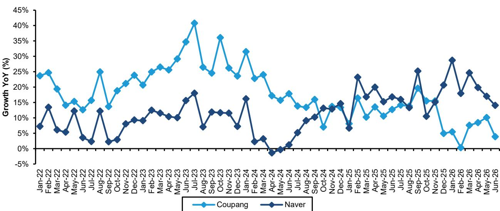  
Source: Wiseapp, Bernstein analysis.  
EXHIBIT 3: Baemin and Coupang Eats posted YoY GTV growth of 10% and 11.8%, respectively, in June 2026. With growth rates converging, Coupang Eats' outsized top-line growth story in food delivery appears largely played out.

2022-2026: Korea Food Delivery Monthly GTV growth trend  
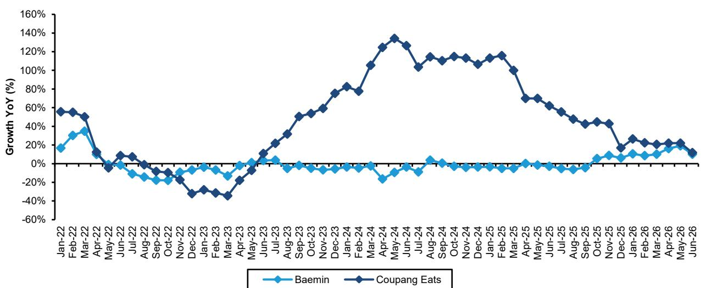  
Source: Wiseapp, Bernstein analysis.

## COUPANG JUNE GMV GREW 4%...GETTING RICHER DOESN'T MEAN BUYING GROCERIES TWICE

EXHIBIT 4: The number of high-net-worth individuals (HNWIs) in Korea increased 3.3% YoY to 576,000 in 2025, while the share of HNWIs in the total population rose to 0.9%, up from 0.7% in 2020.

The number of high-net-worth individuals (HNWIs) in Korea ('000)

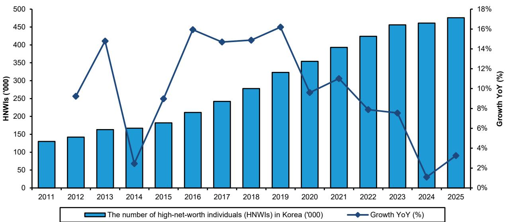  
Source: KB Bank, Bernstein analysis.  
EXHIBIT 5: The top decile accounted for 46.1% of total net wealth in 2025, up 1.6%p YoY, suggesting that wealth polarization in Korea continues to deepen.

2017-2025: Net Wealth Share of the 10th Decile  
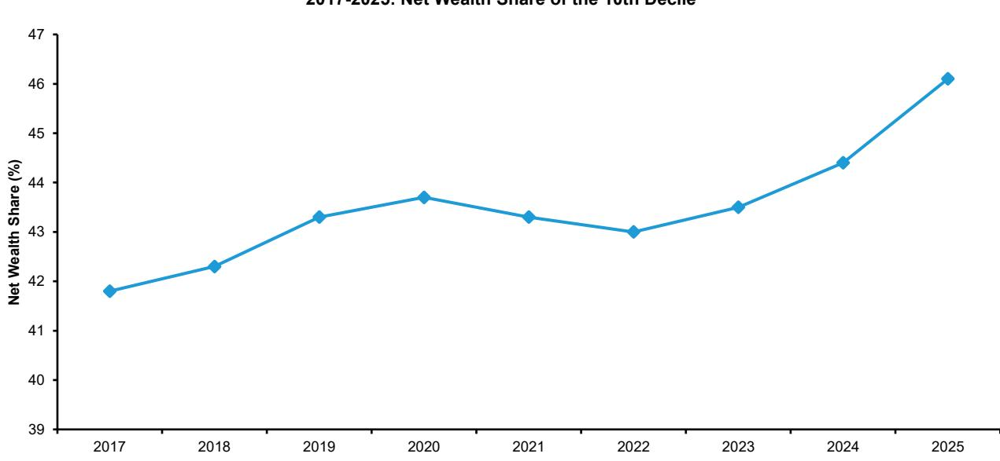  
Source: KOSTAT, Bernstein analysis.

EXHIBIT 6: For household income in Korea, the income share of the fifth quintile rose to 45.2%, up 0.8%p YoY, while the income share of the bottom quintile remained flat in Q1 2026.  
2021-2026: Income Share by Quintile  
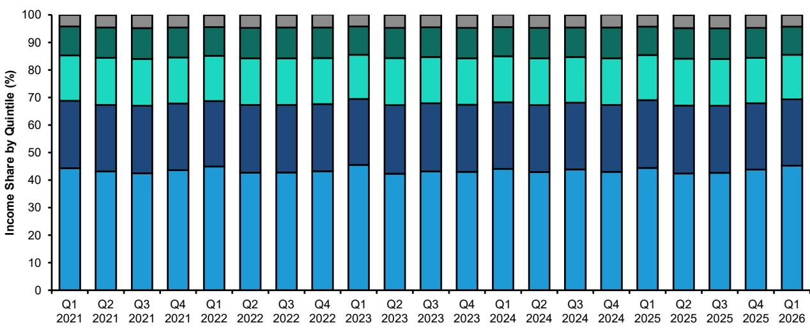  
5th Quintile 4th Quintile 3rd Quintile 2nd Quintile 1st Quintile  
Source: KOSTAT, Bernstein analysis.

EXHIBIT 7: Within the overall retail market, semi-durable goods (i.e., fashion) are outgrowing other product categories.  
2023-2026: Quarterly household consumption expenditure by product category  
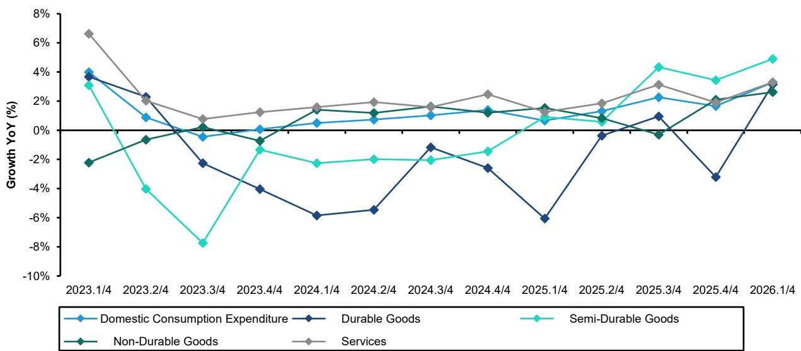  
Source: KOSTAT, Bernstein analysis.

EXHIBIT 8: Among retail channels, department stores are outperforming hypermarkets in growth, despite the latter being the preferred shopping destination for middle-income consumers.  
2023-2026: Monthly YoY GMV growth in Korea's retail market  
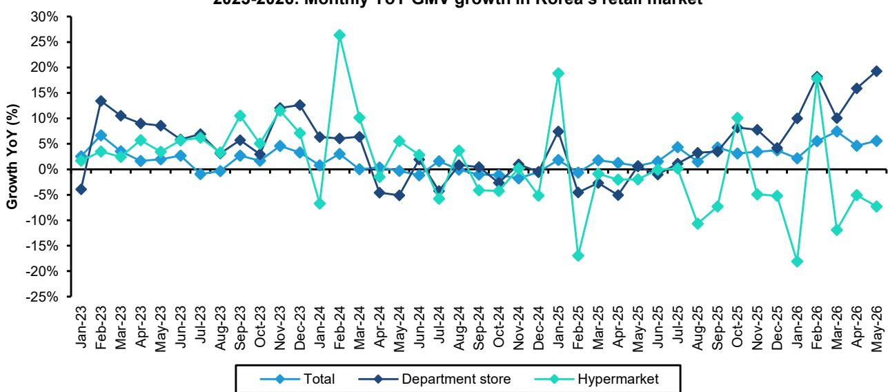  
Source: KOSIS, Bernstein analysis.

EXHIBIT 9: The Korean e-commerce market grew 9% in May 2026.  
2017-2026: Korea e-Commerce market  
  
Note: Korea e-commerce market sizing approach: We estimate the market using KOSIS data, excluding the auto and food-delivery sectors. Source: KOSIS, Bernstein analysis.

EXHIBIT 10: Item goods (i.e., fashion) category penetration remains below the overall online penetration rate of the Korean e-commerce market.  
2022-2026: Online penetration rate by category  
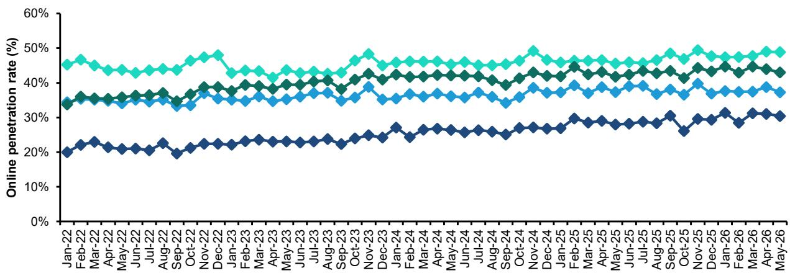  
Item (Fashion & Beauty, Living & Healthcare) Grocery (Fresh foods, Packaged foods) Commodity (Daily necessities, Electronics) Total retail (ex.auto and gas)  
Source: KOSIS, Bernstein analysis.  
EXHIBIT 11: KOSIS online GMV trends indicate that, entering 2026, incremental GMV growth is coming from item goods and grocery categories.  
5M 2026: Korea e-commerce and food delivery GMV growth by category

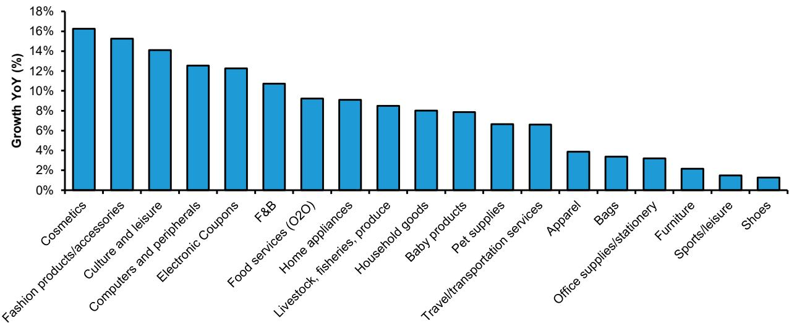  
Source: KOSIS, Bernstein analysis.

EXHIBIT 12: Naver's GMV outperformance is primarily driven by its strong Brand Store ecosystem.  
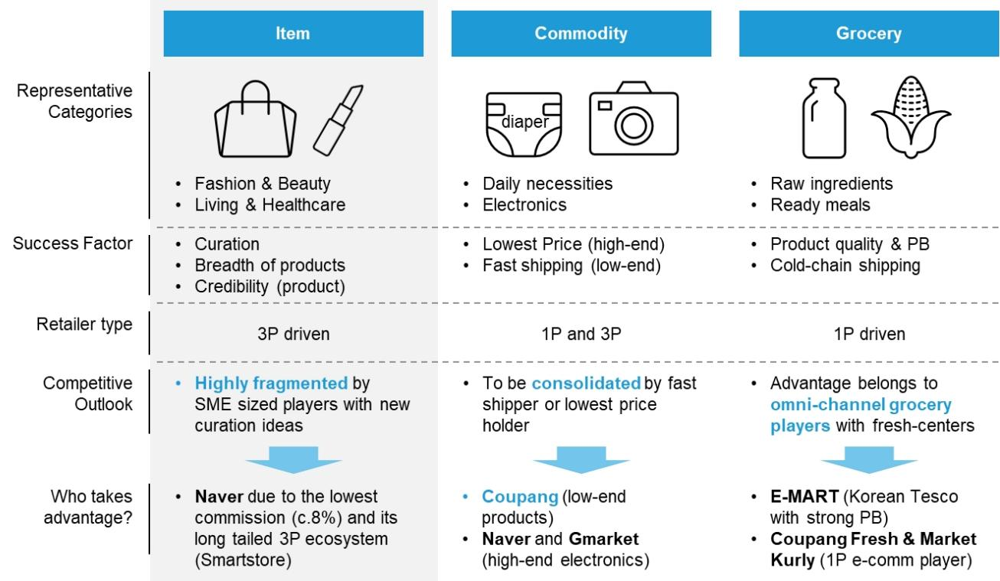  
Source: Expert interview, Bernstein analysis.

EXHIBIT 13: Coupang's GMV grew 3.9% in June, meanwhile Naver outpaced it with 14% growth.  
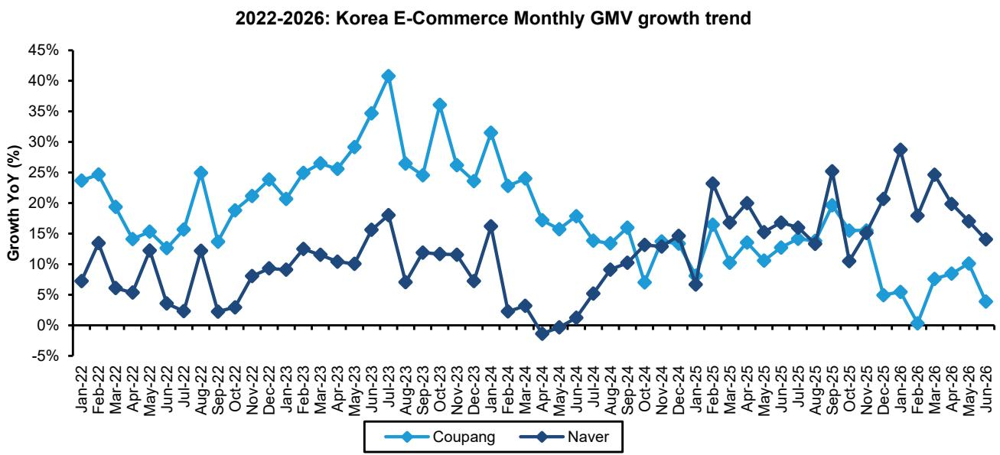  
Source: Wiseapp, Bernstein analysis.

EXHIBIT 14: We expect the market share gap with Coupang to fluctuate in line with the intensity of price promotions.  
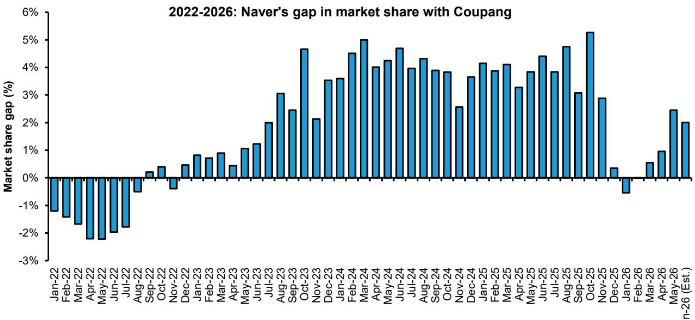  
Source: KOSIS, Wiseapp, Bernstein estimate and analysis.

EXHIBIT 15: Coupang and Naver saw paying-user declines of 4% and 5%, respectively, in June 2026.  
2021-2026: Monthly paying users trend  
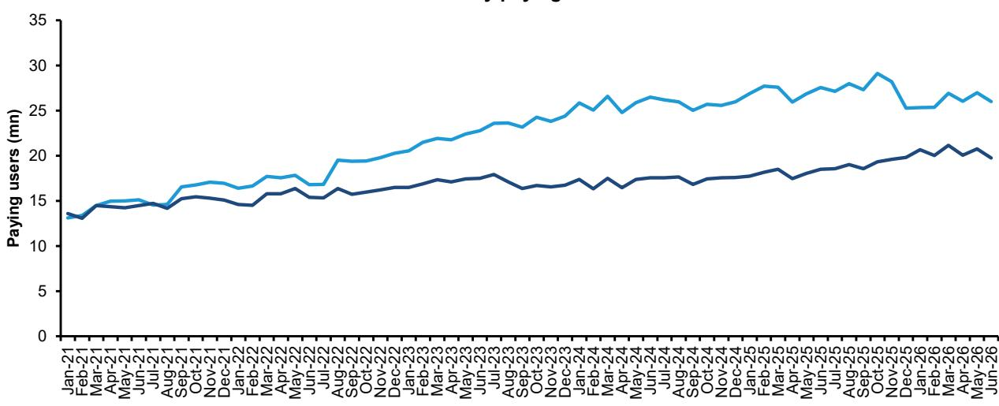  
Source: Wiseapp, Bernstein analysis.

Oct-25 Nov-25 Dec-25 Jan-26 Feb-26 Mar-26 Apr-26 May-26 Jun-26

EXHIBIT 16: Launched in Q1 2025, Naver Plus Store continues to steadily build its user base.  
2025-2026: MAU trend of Korean e-commerce players  
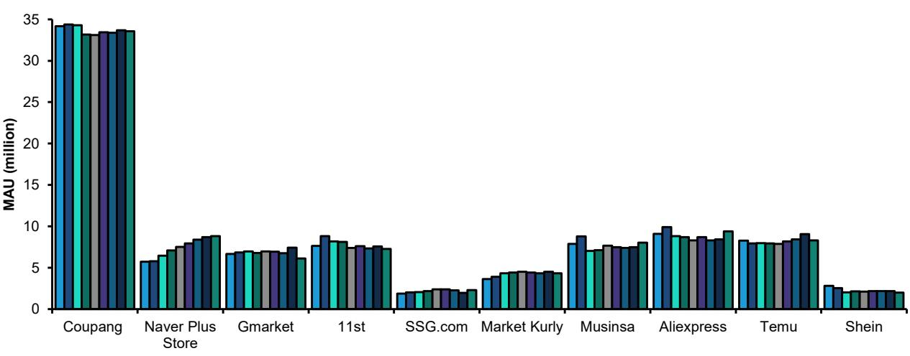  
Source: Wiseapp, Bernstein analysis.

EXHIBIT 17: Naver remains in aggressive expansion mode, with market share competition set to intensify in 2026, likely driving industry-wide margin compression.  
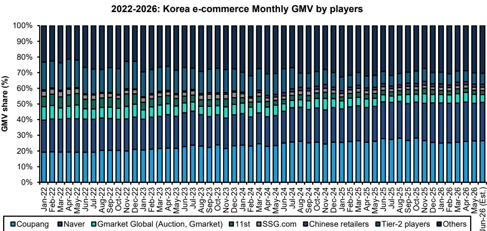  
Source: KOSIS, Wiseapp, Bernstein analysis.

EXHIBIT 18: Baemin and Coupang Eats posted YoY GTV growth of 10% and 11.8%, respectively, in June 2026. With growth rates converging, Coupang Eats' outsized top-line growth story in food delivery appears largely played out.  
2022-2026: Korea Food Delivery Monthly GTV growth trend  
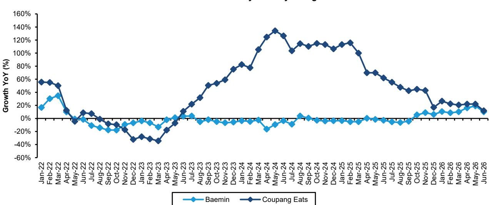  
Source: Wiseapp, Bernstein analysis.

EXHIBIT 19: In June, Baemin and Coupang Eats held GTV market shares of 63% and 37%, respectively, indicating that market share trends are stabilizing.  
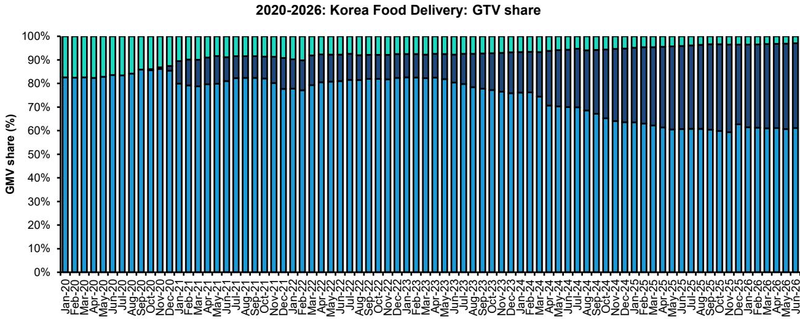  
Source: Wiseapp, Bernstein analysis.

EXHIBIT 20: Baemin has begun gaining incremental market share starting in Q4 2025.  
2019-2026: Korea food delivery player incremental GMV  
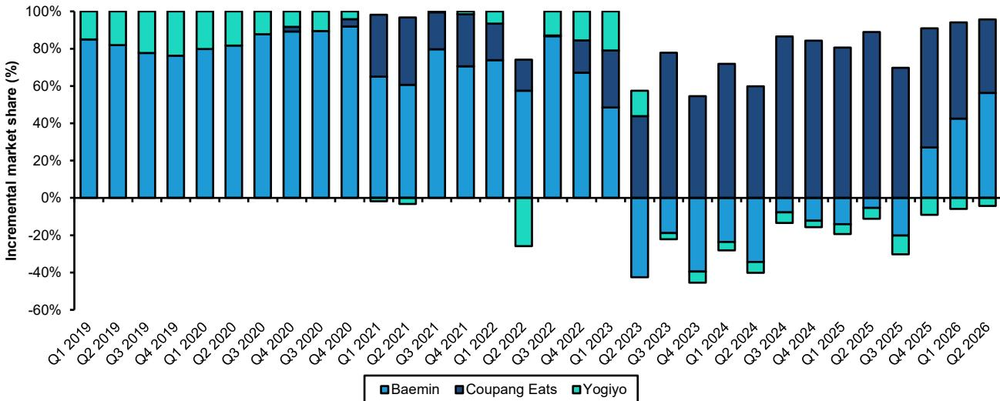  
Source: Wiseapp, Bernstein analysis.

EXHIBIT 21: Paying users for Baemin and Coupang Eats declined by -4% YoY and -6% YoY, respectively, in June 2026.  
2018-2026: Paying Users of Baemin vs Coupang Eats vs Yogiyo  
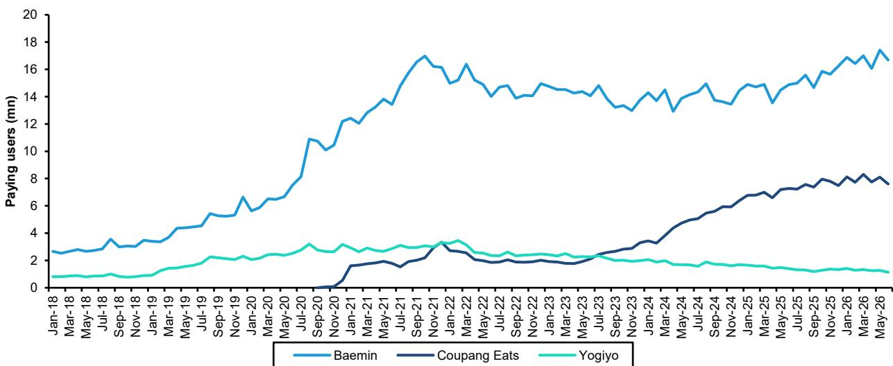  
Source: Wiseapp, Bernstein analysis.

EXHIBIT 22: Korea's food delivery market is stabilizing, but regulatory risks around Coupang and any shift in Baemin's ownership could still reshape competition.  
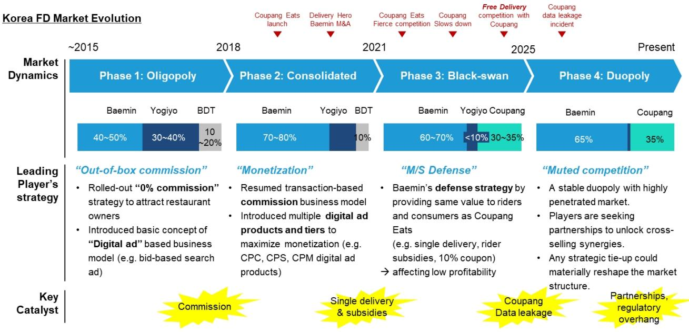  
Note 1. Delivery Hero acquisition of Baemin confirmed in Dec 2019 and completed in Mar 2021.  
Note 2. Delivery Hero required to sell Yogiyo by Fair Trade Commission in Dec 2020 and completed divestiture in Oct 2021. Source: Corporate reports, Expert interview, Wiseapp, Bernstein analysis.

## APPENDIX - FINANCIAL FORECASTS

EXHIBIT 23: Coupang: Income Statement

<table><tr><td>USD million</td><td>2021</td><td>2022</td><td>2023</td><td>2024</td><td>2025</td><td>2026E</td><td>2027E</td><td>2028E</td><td>2029E</td></tr><tr><td>Revenue</td><td>18,406</td><td>20,583</td><td>24,383</td><td>30,268</td><td>34,534</td><td>37,571</td><td>41,721</td><td>45,317</td><td>48,745</td></tr><tr><td>Gross profit</td><td>2,951</td><td>4,710</td><td>6,190</td><td>8,831</td><td>10,141</td><td>10,803</td><td>12,310</td><td>13,265</td><td>14,177</td></tr><tr><td>Operating, general and administrative</td><td>-4,445</td><td>-4,822</td><td>-5,717</td><td>-8,395</td><td>-9,668</td><td>-11,512</td><td>-11,803</td><td>-12,270</td><td>-12,782</td></tr><tr><td>Operating profit</td><td>-1,494</td><td>-112</td><td>473</td><td>436</td><td>473</td><td>-709</td><td>506</td><td>996</td><td>1,396</td></tr><tr><td>EBITDA</td><td>-1,292</td><td>119</td><td>748</td><td>869</td><td>990</td><td>-142</td><td>1,112</td><td>1,643</td><td>2,087</td></tr><tr><td>Adjusted EBITDA</td><td>-748</td><td>381</td><td>1,074</td><td>1,375</td><td>1,490</td><td>824</td><td>1,624</td><td>2,155</td><td>2,599</td></tr><tr><td>Profit before tax</td><td>-1,542</td><td>-93</td><td>583</td><td>473</td><td>597</td><td>-661</td><td>513</td><td>1,055</td><td>1,512</td></tr><tr><td>Income tax expense</td><td>-1</td><td>1</td><td>776</td><td>-407</td><td>-383</td><td>-30</td><td>-128</td><td>-264</td><td>-378</td></tr><tr><td>Net Income</td><td>-1,543</td><td>-92</td><td>1,359</td><td>66</td><td>214</td><td>-692</td><td>384</td><td>791</td><td>1,134</td></tr><tr><td>Net profit attributable to SHs</td><td>-1,543</td><td>-92</td><td>1,359</td><td>154</td><td>208</td><td>-692</td><td>384</td><td>791</td><td>1,134</td></tr><tr><td>EPS
