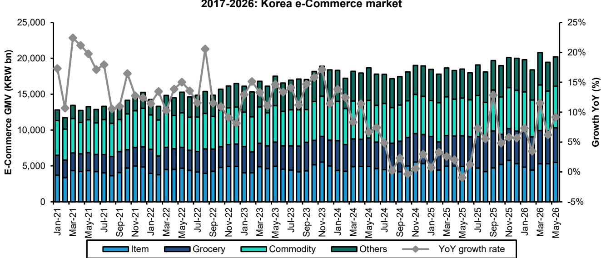

# 韩国财富增长未必利好Coupang：K型经济结构引导消费流向，生鲜平台并非主要受益方

当前市场普遍认为韩国居民财富增长将自然惠及Coupang，这一判断可能存在战略误判。韩国整体财富确实在增加，但财富分布正日益两极分化，高收入群体的消费模式正在绕开大众市场生鲜平台。Coupang 6月GMV同比仅增长4%，而整体市场增速为9%，这并非暂时波动——而是结构性信号，表明该公司的核心价值主张与增量消费的流向出现了错位。

对于观察者而言，关键洞察在于：国民财富增长并不会等比转化为日常必需品的更高支出。高收入消费者并不会因为收入增加而加倍购买生鲜杂货。相反，他们的增量支出集中在高端品类——奢侈品、时尚和品牌商品——在这些领域，购物体验、产品发现和品牌互动比物流速度和价格更重要。这一结构性变化正在重塑韩国的零售格局，使Naver的生态系统比Coupang以履约为中心的模式更具优势。

6月数据清晰地体现了这种分化。Coupang的GMV增速放缓至低个位数，而Naver凭借其品牌商店生态系统实现了14%的同比增长。在外卖领域，Coupang Eats与Baemin增速趋同，表明市场份额争夺的故事也已进入成熟阶段。问题已不再是韩国的电商市场是否会增长，而是哪些平台在结构上能够捕捉到增长中最有价值的部分。

本分析基于一份Bernstein报告，该报告研究了韩国消费格局的变化、平台级GMV数据以及Coupang与Naver之间的竞争动态。证据指向一个明确的结论：K型复苏有利于高端平台，而非大众市场物流型平台。

## K型财富分配正将消费从生鲜杂货转向高端商品

韩国的财富集中度正在加速，前10%人群的消费模式与其余人口正出现明显分化。2025年高净值个人数量达到57.6万，同比增长3.3%，其在总人口中的占比从2020年的0.7%上升至0.9%。更值得注意的是，前10%人群目前控制着全国净财富的46.1%，同比上升1.6个百分点，而最高收入五分之一人群在2026年第一季度占据了家庭收入的45.2%。

战略含义很明确：增量购买力正集中在一小部分人群中，而这些消费者并不会将边际收入用于购买更多生鲜杂货。相反，时尚等半耐用品类继续跑赢大多数零售品类。服务于更窄但更富裕客户群的百货商店，5月同比增长19%，而大型超市则下降了7%。这种分化并非周期性——它反映了韩国零售业价值创造的结构性转变。

对于以生鲜杂货和日用品为业务模式的Coupang而言，这意味着其核心产品的可触达市场增速慢于整体零售市场。该公司快速配送和有竞争力的价格定位对于捕捉日常支出至关重要，但在增量消费实际流向的品类中，这一优势的相关性较低。变得更富有并不意味着会购买双倍的生鲜杂货。

## Naver的品牌商店生态系统捕获了Coupang无法触及的高端消费

Naver在6月实现14%的GMV增长，而Coupang仅为4%，这不仅仅是基数效应或促销日历的差异。它反映了平台架构上的根本优势。Naver的品牌商店生态系统允许高端和奢侈品牌在消费者已经花费时间的搜索和发现环境中，打造沉浸式的品牌购物体验。这正是吸引韩国日益壮大的富裕阶层可自由支配支出的零售环境类型。

数据支持这一解读。在韩国在线零售市场中，2026年增长最快的品类是时尚、美妆和生活方式等商品，品牌互动和产品发现是关键的购买驱动因素。这些品类的线上渗透率低于生鲜杂货或日用品，意味着有更大的增长空间。Naver的平台在结构上针对这些品类进行了优化，因为它将搜索、内容和商业结合在一起，使品牌能够讲述自己的故事，消费者能够发现新产品。

相比之下，Coupang针对效率和重复购买进行了优化。其在物流和履约方面的优势对于赢得生鲜杂货和日用品市场至关重要，但这些恰恰是增量支出最弱的品类。当市场增长转向发现和品牌体验比速度更重要的品类时，该公司的核心竞争力反而成为一种战略劣势。

这并不意味着Coupang无法在高端品类中竞争，但这需要对其平台和商家关系进行根本性的重新定位。而Naver已经处于这一位置，并且正在通过定价和履约方面的投入积极扩大其领先优势。

## Coupang Eats与Baemin增速趋同，外卖市场份额争夺故事接近尾声

在外卖领域，Coupang Eats和Baemin在6月分别实现了12%和10%的同比增长，市场份额稳定在37%和63%。增速趋同意义重大，因为它标志着Coupang Eats超常规的营收扩张故事已告一段落。当挑战者的增速与现有企业趋同时，通常表明市场份额增长的可触达空间已基本被捕获。

战略问题现在从“Coupang Eats能增长多快？”转变为“Coupang Eats能否在捍卫其地位的同时保持盈利能力？”答案取决于该平台能否扩展到主要大都市区以外，而这可能需要转向第三方市场模式。这是一种不同的业务，具有不同的经济模型，目前尚不清楚Coupang现有的物流基础设施能否高效支持这一模式。

对于观察者而言，外卖增速趋同是一个警示故事，提醒人们不要简单外推早期的市场份额增长轨迹。同样的动态可能正在Coupang的核心电商业务中上演，早期增长由物流优势和竞争性定价驱动，但下一阶段的竞争需要不同的能力。

## 报告未完全解答的问题：Coupang能否调整其模式以捕捉高端消费？

Bernstein报告提供了令人信服的证据，表明Coupang当前的增长轨迹与韩国消费模式的变化存在错位，但它留下了几个关键问题未解决。最重要的是，Coupang能否发展其平台以捕捉高端和可自由支配支出的一部分，还是它在结构上被限制在增长较慢的生鲜杂货和日用品领域？

Coupang已尝试通过其Rocket Luxury和其他高端产品扩展到时尚和奢侈品领域，但这些努力尚未展现出能够改变叙事的规模或增长轨迹。根本挑战在于，Coupang的核心价值主张——快速、可靠地配送日常用品——对于高价值、需要深思熟虑的购买而言吸引力较弱，因为消费者希望浏览、比较和与品牌内容互动。

第二个未解决的问题是Naver在定价和履约方面的积极投入对行业整体利润率的影响。报告指出Naver仍处于“全面战斗模式”，但并未充分探讨这一策略的可持续性。如果Naver继续在价格和物流方面大力投入以抢占份额，可能会压缩整个行业的利润率，使任何参与者都难以获得有吸引力的回报。

最后，外卖增速趋同引发了关于Coupang Eats下一步战略举措的问题。它会尝试通过市场模式扩展到较小的城市，还是会接受当前的市场份额并专注于盈利能力？答案对Coupang的整体资本配置和利润率轨迹具有重要影响。

## 观察者的决策框架：在K型经济中评估电商平台

对于试图理解韩国电商格局的观察者而言，关键的分析问题不是“哪个平台拥有最好的物流”，而是“哪个平台最有能力捕捉消费支出中最有价值的细分市场”。这需要一个从三个维度评估平台的框架：

首先，评估平台的核心价值主张与增量消费支出流向的品类之间的一致性。在K型经济中，增长最快的品类是高端、可自由支配和体验驱动的。擅长发现、品牌互动和高价值交易的平台，比那些针对日常必需品重复购买进行优化的平台更具优势。

其次，评估平台在不损害其核心模式的情况下服务大众市场和高端消费者的能力。Coupang在物流和效率方面的优势是生鲜杂货领域的竞争优势，但对于消费者期望不同购物体验的高端品类而言，这可能是一种劣势。Naver的混合模式结合了搜索、内容和商业，更加灵活，但也有其自身的复杂性和成本结构。

第三，考虑当前投入周期中的竞争动态和利润率影响。Naver的积极扩张正在压缩整个行业的利润率，问题在于这是暂时的投入阶段还是竞争格局的结构性变化。答案将决定当前的估值倍数是否合理。

将这一框架应用于韩国市场表明，Naver当前的表现并非仅仅是周期性的，而是反映了其在捕捉消费支出中最有价值部分方面的结构性优势。Coupang虽然在其核心品类中占据主导地位，但随着市场重心转移，面临着更具挑战性的增长轨迹。

## 需要更深入研究的未解分析问题

本分析提出了几个问题，完整报告对此进行了更详细的探讨。Naver在定价和履约方面的投入可持续性如何？当投入周期结束时，行业利润率会发生什么变化？Coupang的物流基础设施能否被重新用于服务高端品类，还是需要一种根本不同的模式？外卖增速趋同对Coupang的整体战略和资本配置有何影响？

这些并非学术问题。它们将决定这些平台在未来两到三年的相对表现，进而影响据此进行布局的观察者的回报。此处提供的数据和分析提供了一个起点，但完整图景需要对竞争动态、利润率结构以及每个参与者可用的战略选择进行更深入的审视。

加入社区阅读完整报告并查看原始图表。

*仅供参考。部分内容可能基于源材料通过AI辅助生成、翻译、总结或编辑，可能存在遗漏或错误。请独立核实。本文不构成任何专业建议。*

仅供参考。部分内容可能基于源材料通过AI辅助生成、翻译、总结或编辑，可能存在遗漏或错误。请独立核实。本文不构成任何专业建议。

