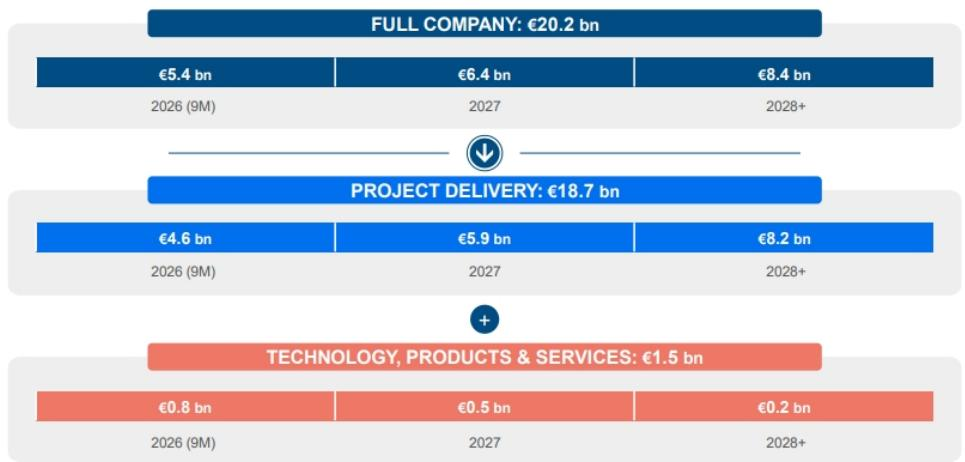
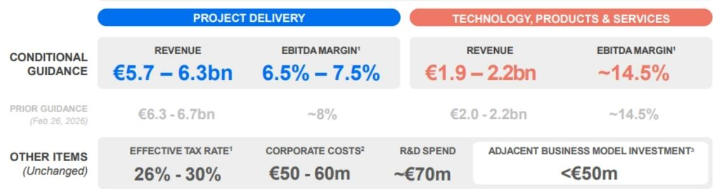
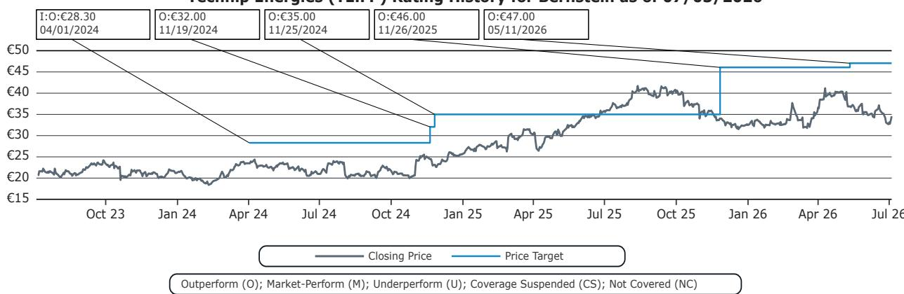

# Bernstein：积压订单或达240亿欧元，这家能源工程公司的利润转化正在改善

一份业绩前沟通，让分析师从“中期乐观、短期谨慎”转向了“全线更有信心”。Bernstein在最新报告中指出，Technip Energies 的二季度订单有望超过50亿欧元，积压订单可能达到约240亿欧元，而此前市场最担心中东地区运营不确定性，现在看来正在“正常化”。这家能源工程公司的核心矛盾——短期执行不确定性与中期订单爆发——正在发生结构性转变。

## 1. 中东运营正常化，让全年有条件指引变得可信

一季度财报后，Technip Energies 下调了全年指引，市场对其在中东地区的项目执行能力产生质疑。但Bernstein在6月与公司沟通后发现，中东运营已趋于“稳定”，且得益于高度保护性的合同条款，二季度额外成本明显下降。这意味着公司在一季度给出的有条件指引——项目交付收入57-63亿欧元、EBITDA利润率6.5%-7.5%——仍然有效。对于一家此前因执行问题被市场打折的公司，这本身就是积极信号。

> **KC评论：** 市场对工程公司的定价，往往不是看订单有多少，而是看订单能不能转化为利润。中东运营正常化，直接回答了“指引是否还能保住”这个核心问题。完整报告里关于合同条款和成本下降的细节，值得仔细看。

## 2. 订单结构改善：TPS 业务正在补上最关键的一块拼图

市场此前关注焦点集中在 Commonwealth 和 Coral Norte 两大合同，但Bernstein在沟通中发现了更重要的信号：技术、产品与服务（TPS）部门在二季度也实现了稳健的订单增长。这很关键，因为 TPS 是 Technip Energies 利润率更高的业务板块，其订单增长意味着公司整体业务组合正在优化。结合积压订单从一季度的202亿欧元跃升至约240亿欧元，2027-2028年的盈利预期存在上调空间。

## 3. 报告尚未完全回答的问题：竞争格局与项目节奏的不确定性

Bernstein坦率地指出，公司在莫桑比克 Rovuma 项目上面临来自 Saipem 的竞争不确定性，尽管 Technip Energies 已完成前端工程设计。这是沟通中少数几个谨慎信息之一。此外，报告虽然强调 FEED 机会管线正在扩大，但大型 EPC 项目的最终授标时间节点——报告说的是“接近十年末”——仍然存在不确定性。换句话说，订单的“量”在改善，但“价”和“节奏”还需要更多季度数据来验证。

## 4. 对读者的观察框架：关注两个指标，而非报价波动

对于跟踪这家公司的读者，Bernstein的分析提供了两个更值得关注的指标：一是 TPS 部门的季度订单趋势，它直接反映高利润业务的增长动能；二是积压订单向收入的转化速度，尤其是2027年的 EBITDA 能否达到7.67亿欧元的预测。报告显示，当前报价对应的2027-2029年自由现金流回报表现在10%-15%之间，但这一估值的前提是执行不出偏差。

> **KC评论：** Bernstein的模型显示，他们对2027-2028年的收入和 EBITDA 预测比市场共识低10%-12%，这意味着即使公司表现略低于市场预期，也可能仍有空间。真正需要跟踪的不是短期报价，而是积压订单能否持续转化为收入和利润。

---

For informational purposes only. Portions may be generated,translated,summarized,or edited with AI assistance based on source materials and may contain omissions or errors. Please verify independently. This is not investment,legal,tax,accounting,or other professional advice.

For informational purposes only. Portions may be generated,translated,summarized,or edited with AI assistance based on source materials and may contain omissions or errors. Please verify independently. This is not investment,legal,tax,accounting,or other professional advice.

