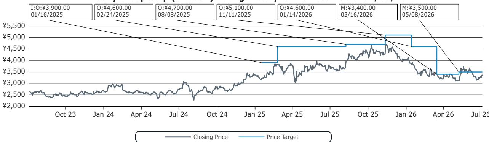
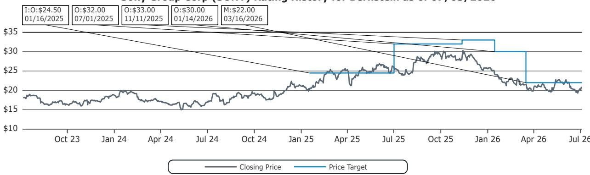
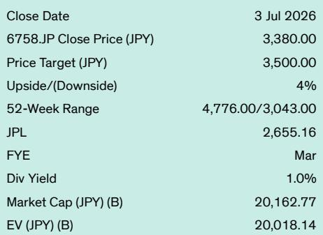

# Bernstein：玩家反弹被高估，索尼全面数字化影响不到3%利润

当索尼在7月1日宣布PlayStation游戏将从2028年1月起全面转向数字发行时，网上掀起的反弹声浪几乎可以预见。一份在线请愿书已获得超过10.9万个签名，相关推文获得1.38亿次浏览，回复数甚至超过了收藏数。但在Bernstein的分析师看来，这场争议对索尼财务的实质影响远比表面声势小得多。

研究机构的核心判断是：物理游戏销售在PlayStation业务中的占比已经微乎其微。上一财年，物理游戏仅贡献了PlayStation游戏总收入的11.3%，占包含PS Plus订阅和平台外收入在内的软件总收入的4.8%，占PlayStation整体收入的2.3%。Bernstein估算，物理游戏销售对PlayStation毛利润的贡献大约在3%至4%之间。

换言之，即便最坏情况发生——PlayStation永久失去30%的物理游戏销售，其余部分转为数字版——对正常化运营利润的谨慎影响也仅约3%至4%，这还未考虑取消光驱后硬件成本的节省。相比之下，愤怒玩家取消PS Plus订阅的影响反而更大：5%至10%的取消率意味着运营利润中个位数的削减。但综合来看，在最极端场景下，索尼集团整体运营利润中仅有2%至3%处于不确定性敞口。

> **KC评论：** 这份报告的关键不在于索尼是否会因玩家反弹而改变决策，而在于读者需要重新评估“物理媒体”在游戏业务中的真实权重。数字已经说明，物理销售在财务层面已接近边缘。真正值得关注的是报告中的另一层隐含判断：PS6大概率不会配备光驱，且发布时间不会早于2028年初。这对硬件利润率是边际利好，但同时也意味着索尼将赌注完全押在了数字生态的粘性上。

## 1. 行业早已用脚投票，物理媒体的财务权重已降至个位数

Bernstein的分析逻辑并不复杂，但提供了几个值得注意的参照点。GTA VI在发布时将没有物理版本；Steam Deck在索尼宣布前两天发布的新机型也不带光驱。游戏行业在财务层面早已完成从物理到数字的迁移，PlayStation的决策不过是正式确认了这一趋势。

新游戏在发布时物理销售比例确实更高，约为20%至30%，但整体而言，游戏行业只是在追随视频流媒体和音乐产业已经走过的路——物理版本正在变成小众收藏者的领域。对索尼而言，物理销售向数字的转化不仅意味着零售商分成的消失，更重要的是获得了对重复定价的完全控制权。

从读者角度，这份报告实际上在问一个问题：当物理销售已经只占利润的3%至4%时，玩家反弹的威胁是否被市场过度定价了？

## 2. 真正的不确定性不在物理转数字，而在订阅服务的用户忠诚度

Bernstein的敏感性分析揭示了一个反直觉的结论：PS Plus订阅的取消比物理销售流失对利润的影响更大。5%至10%的订阅取消率意味着运营利润中个位数的缩减，这比物理销售损失的财务影响更显著。

但报告并未完全展开的一个问题是：玩家反弹是否会从“愤怒的推文”转为“实际的订阅取消”？这里的转化率仍存在不确定性。Bernstein的分析师对此持相对乐观态度，认为在线反弹不太可能影响索尼的最终决策。

## 3. PS6的轮廓已基本清晰，但市场尚未充分定价其影响

索尼的公告几乎确认了两个判断：PS6不会在2028年1月之前发布，而且下一代主机将不带光驱。这意味着索尼将只提供一个纯数字版的SKU，这从硬件利润率角度看是积极的。

但报告没有完全回答的关键问题是：完全数字化的PS6能否维持甚至扩大PlayStation的用户基数？在PC市场，Steam作为数字优先的生态系统已经持续增长多年；在移动端，孩子们早已在玩Roblox。但主机市场的用户行为迁移速度是否足够快，仍是一个需要持续观察的变量。

> **KC评论：** Bernstein的这份报告本质上是在说：索尼正在做一件财务上合理、但公关上冒险的事。读者需要关注的不是请愿书上的签名数，而是PS Plus的续费率和PS6发布后的硬件毛利变化。报告没有展开讨论的是，如果任天堂继续保持物理媒体选项，索尼的完全数字化策略是否会成为竞争中的差异化劣势——尤其是在那些网络基础设施尚未完善的区域市场。

## 一个尚未被充分讨论的问题：游戏存档与数字遗产

物理媒体支持者提出的一个更实质性的担忧是游戏保存问题。当游戏完全依赖在线服务器和数字版权管理，一旦服务器关闭或授权到期，玩家将失去对已购买内容的访问权。Bernstein的报告提到了这一争议，但并未深入分析其长期影响。

这个问题在监管层面可能比财务层面更具不确定性。欧盟和部分美国州已开始关注数字内容的消费者权益问题。如果未来出现针对“数字游戏永久访问权”的立法或诉讼，索尼面临的合规成本和声誉不确定性可能远超当前财务模型所能覆盖的范围。

---

For informational purposes only. Portions may be generated,translated,summarized,or edited with AI assistance based on source materials and may contain omissions or errors. Please verify independently. This is not investment,legal,tax,accounting,or other professional advice.

For informational purposes only. Portions may be generated,translated,summarized,or edited with AI assistance based on source materials and may contain omissions or errors. Please verify independently. This is not investment,legal,tax,accounting,or other professional advice.

