European Biopharmaceuticals

# Pan-Euro Pharma Primer: 'protein strangling' (ATTR): why should AZN (O) lead in this \$20bn peak cardio market?

Justin Smith

+44 20 7762 5899

justin.smith@bernsteinsg.com

Shan Mian

+44 20 7676 8981

shan.mian@bernsteinsg.com

Maximilian Brewster

+44 20 7550 2193

maximilian.brewster@bernsteinsg.com

Specialist Sales

Christian Moore

+1 917 344 8555

christian.moore@bernsteinsg.com

Despite the strong launch of Amvuttra (Alnylam; ALNY; O; Will Pickering; consensus peak \$9bn), 'protein strangling' of the heart (ATTR-CM) has a 5-year survival worse than many severe cancers as US diagnosis is just 25%. Consensus (Bloomberg throughout) projects ALNY & AZN to capture ATTR-CM peak shares of 55% and 12% respectively. But post expert calls, we see four reasons why AZN should lead in this \$20bn peak market, which would drive upside surprise for this stock 1/ AZN is the only company with all 3 validated drug mechanisms of action 2/ AZN's launches will materially expand the market as ATTR-CM is a very heterogeneous disease 3/ physician awareness of AZN's Alexion (rare disease) brand is already high 4/ the landmark phase 3 CardioTTRansform trial (out in 2H26) should be the most competitive dataset and thus make Wainua AZN's $2^{nd}$ largest non-oncology drug. Our new 2036e AZN ATTR of \$10bn implies 10% upside to the consensus group sales.

Why is ATTR relevant? Amyloidosis is the dangerous build-up of harmful proteins in vital internal organs which can be life-threatening. The most share price relevant amyloidosis sub-type is ATTR for which the greatest unmet medical need lies in the heart (ATTR-cardiomyopathy (CM); ca 800k sufferers in the G8) as the 5-year US survival rate is $<<40\%$ . Hence, ATTR-CM is often more of a ‘death sentence’ than many severe cancers.

Why ‘prime’ on ATTR-CM now? ALNY delivered an innovation ‘step-up’ via its 2025 launch of first in class gene silencer Amvuttra. Unlike earlier, ‘lower tech’ stabilizers (eg Vyndaqel (Pfizer; Courtney Breen; 2025 sales \$6bn), ‘higher tech’ silencers cut ATTR production. In 2H26 AZN will publish the landmark phase 3 cardioTTRransform data for Wainua (consensus peak \$2bn; guidance >\$5bn). Although the 2 $^{nd}$ silencer, we expect this drug to materially expand the market as 1/ ATTR-CM is very heterogeneous disease, so doctors need many different mechanisms to treat it (Wainua binds to genetic code (mRNA) whereas Amvuttra degrades it) 2/ US diagnosis of ATTR-CM is only 25%. But in our view, there are many examples of rare disease (RD) market expansion driven by new entrants. And Key Opinion Leaders (KOLs) have told us that AZN has invested heavily pre-launch. (Whilst ALNY’s twice yearly ‘Next Gen’ silencer nucesiran may ‘step-up’ convenience, we expect it to cannibalize Amvuttra. For nucesiran there no payaways to Sanofi (O)), which receives a blended mid-20’s royalty from sales of Amvuttra.

Who will lead in this \$20bn (10% CAGR) peak sales market? We think it's AZN for three reasons 1/ portfolio: AZN uniquely owns drugs with each of the proven mechanisms: stabilizer, silencer and depleter. Unlike silencers, depleters eradicate ATTR plaques & AZN's cliramitug (consensus peak \$2bn vs guidance \$3-5bn) is first in class with a projected 2029 launch. KOLs have opined to us that combination therapy will deliver the best outcomes (AZN plans studies of Wainua maintenance post climaritug induction, which would imply upside to our AZN base case forecasts) 2/ strongest legacy: in our view AZN's Alexion RD platform is a sustainable competitive advantage 3/ dataset: cardioTTRansform is the largest phase 3 trial with the most rigorous endpoint and has a 4-year lead over TRITON (nucesiran phase 3). If the Vyndamax pre-treated subgroup 'works' in cardioTTRansform there would be 34% upside to our base case 2036e Wainua of \$6bn.

## BERNSTEIN TICKER TABLE

<table><tr><td rowspan="2"></td><td colspan="4">2 Jul 2026</td><td>TTM</td><td colspan="4">Adjusted EPS</td><td colspan="3">Adjusted P/E (x)</td></tr><tr><td>Rating</td><td>Cur</td><td>Closing Price</td><td>Price Target</td><td>Rel. Perf.</td><td>Cur</td><td>2025A</td><td>2026E</td><td>2027E</td><td>2025A</td><td>2026E</td><td>2027E</td></tr><tr><td>AZN.LN (AstraZeneca)</td><td>O</td><td>GBp</td><td>14,538</td><td>18,900</td><td>19.8%</td><td>USD</td><td>9.16</td><td>10.58</td><td>12.62</td><td>21.2</td><td>18.3</td><td>15.4</td></tr><tr><td>EDME</td><td></td><td></td><td>1,622.79</td><td></td><td></td><td></td><td></td><td></td><td></td><td></td><td></td><td></td></tr></table>

O - Outperform, M - Market-Perform, U - Underperform, NR - Not Rated, CS - Coverage Suspended

Source: Bloomberg, Bernstein estimates and analysis.

## Table Of Contents

Executive Summary - why should azn lead in a \$20bn peak non-oncology market?......4
Introduction to ATTR......6
How is ATTR Treated? - conventional (symptom relief only)......9
What Are Stabilisers?......10
What are Silencers?......11
siRNA Deep Dive......13
ASO Deep Dive......16
Stabilisers & Silencers - The Current Paradigm......18
Depleters - What Are They?......19
Why do we believe that aZN should Lead in ATTR-CM?......20
Why Are Our ATTR revenue Forecasts increasing and Why is this franchise now a Source of Positive Surprise for AZN?......23
The Bull Case - Combination, Combination, Combination......28

## DETAILS

## EXECUTIVE SUMMARY - WHY SHOULD AZN LEAD IN A \$20BN PEAK NON-ONCOLOGY MARKET?

Transthyretin amyloidosis (ATTR) is a disease where mis-folded proteins accumulate to cause life-threatening organ failure, most seriously in the heart (cardiomyopathy (ATTR-CM); ca 800k sufferers in the G8). Disease modifying treatments (unlike most drugs which alleviate symptoms) include stabilisers and more importantly gene silencers like Amvuttra (consensus peak \$9Bn) developed by Alnylam (Pickering; O). But mortality rates in ATTR-CM still mirror those in severe cancers, with US diagnosis rates of just 25%.

We've deep dived into ATTR-CM (by far the largest ATTR segment) because in 2H26 AZN will release the landmark phase III study (cardioTTRansform) for its silencer Wainua (peak guidance >\$5Bn vs peak consensus of \$2Bn). In our view, strong results would secure best in class status and make Wainua AZN's second largest non-oncology drug. In this primer, we've also prosecuted AZN's other promising ATTR-CM phase 3 drug (cliramitug; peak guidance \$3-5Bn vs consensus of \$2Bn) which has a new mechanism of action (depleter) and is first-in-class. Depleters uniquely remove the ATTR plaques which cause the debilitating symptoms in the heart.

EXHIBIT 1: Wainua: change to Bernstein global sales forecasts and comparison to consensus (\$m)  
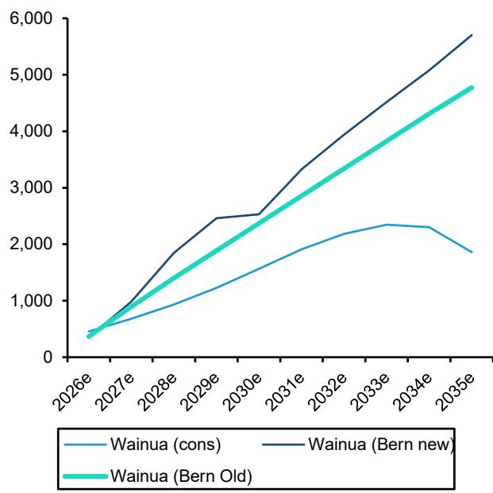  
Source: Bloomberg, Bernstein analysis & estimates

EXHIBIT 2: Cliramitug: change to Bernstein global sales forecasts and comparison to consensus (\$m)  
  
Source: Bloomberg, Bernstein analysis & estimates

## Why do we expect AstraZeneca to win in the \$20bn peak ATTR market (which offers a 10% CAGR to (26-36e))?

We believe that Wainua & cliramitug, plus AZN's commercialization of stabiliser Attruby in Japan (BridgeBio (Pickering;O), global peak sales \$4Bn) makes it the only company with a complete portfolio of ATTR drugs. Key Opinion Leaders (KOLs) have emphasized to us that a combination drug approach will yield the best results. In addition, post our channel checks with experts, we understand that AZN's Alexion Rare Disease legacy is an important competitive advantage in ATTR-CM.

Via thorough new bottom-up patient based modeling, corroborated by top-down US prescription data, we now increase our 2036e risk adjusted base case Wainua and cliramitug forecasts by 20% and 4x to \$6.2Bn and \$3.3Bn respectively (Exhibit 1; Exhibit 2). Considering Rare Disease precedents, we also now expect greater market expansion in ATTR. Our newfound enthusiasm for the depleter mechanism also means that we now expect AZN to capture more share in ATTR (Exhibit 3) and price cliramitug much higher. We also now think silencers are far tougher to ‘generic copycat’ due to higher barriers.

If the landmark phase 3 CardioTTRansform study proves that Wainua is more effective in silencer pre-treated patients it will take more share from Amvuttra, which lacks this data. In this bull case, our 2036e global Wainua forecast would increase by 37% to \$8.5bn for a 34% market share. This compares to a base case of 31% - 25% of US patients are currently diagnosed.

EXHIBIT 3: 2036 global ATTR market shares (by value): Bernstein old vs new estimates  
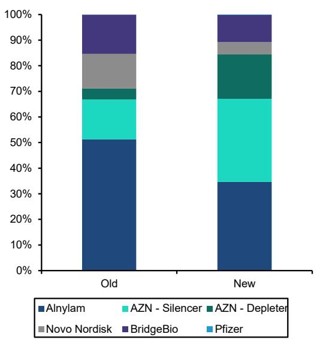  
Includes ATTR-PN (polyneuropathy) and ATTR-CM (cardiomyopathy). Alnylam bar is Amvuttra (silencer); BridgeBio and Pfizer bars are both stabilisers (Attruby and Vyndamax respectively)

EXHIBIT 4: Bernstein global sales forecast like for like (\$m)  
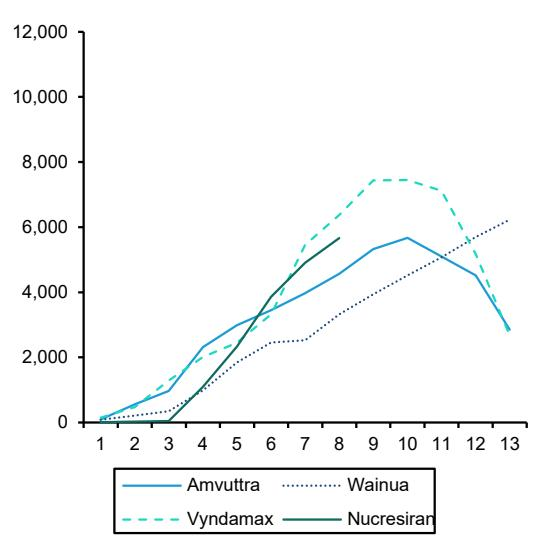  
Source: Bernstein analysis & estimates  
Source: Bernstein analysis & estimates, Bloomberg

Our upgraded Wainua sales forecasts (Exhibit 1; Exhibit 2) now reasonably imply a ramp up in line with Amvuttra (Exhibit 4). We acknowledge that Alnylam could deliver a step-change in convenience via the launch of its twice yearly ‘next gen’ silencer nuresiran in the early 2030s. Nonetheless, we believe that AZN will lead long term due to its portfolio approach and better data (4 point MACE endpoint in cardioTTR transform vs 3 point MACE endpoint for nuresiran in the TRITON phase 3).

Unlike Amvuttra, if nucesiran is approved no royalties would be payable by Alnylam to Sanofi (O). Hence, we think Alnylam's best path to maximize shareholder value is to drive the sales of nucesiran at the expense of Amvuttra (Exhibit 4). But consensus is assuming that the sales of nucesiran will be entirely supplemental to Amvuttra. We think this is unlikely, hence we expect intra-Alnylam cannibalization (Exhibit 5).

EXHIBIT 5: Consensus - ATTR global market share  
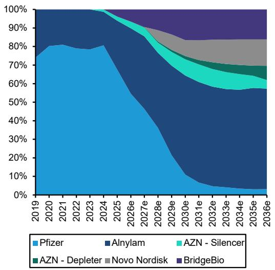  
Includes both ATTR-PN (polyneuropathy) and ATTR-CM (cardiomyopathy). Alnylam includes nucesiran  
Source: Bloomberg, Bernstein analysis & estimates

EXHIBIT 6: Bernstein - ATTR global market share  
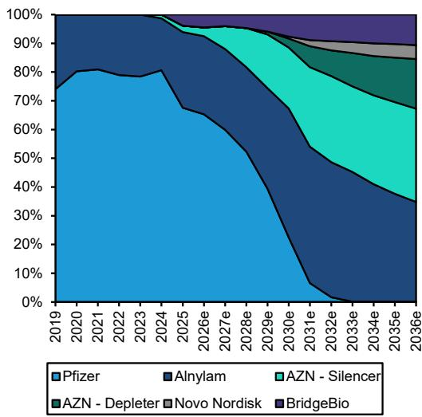  
Includes both ATTR-PN (polyneuropathy) and ATTR-CM (cardiomyopathy). Alnylam includes nuresiran  
Source: Bernstein analysis & estimates

## INTRODUCTION TO ATTR

"Amyloidosis" is a broad term that refers to the build up of abnormal clumps of proteins (amyloids/fibrils) in various tissues of the body, thereby causing a wide range of potentially life threatening health problems. Amyloids can accumulate due to prolonged inflammation or genetic mutations that lead to the misfolding of diseased proteins thereby causing their aggregation and clumping. In all, there are estimated to be over 36 types of amyloidosis, specific to the type of protein that misfolds or the predisposing gene.

We are focusing specifically on transthyretin amyloidosis, or ATTR. This particular condition involves the misfolding of the transthyretin protein (TTR), which is normally synthesized in the liver and is involved in the transportation of thyroid proteins and vitamin A (essential for metabolism and vision) in the body.

The complex structure of the TTR protein lends itself to being easily misfolded. Therefore ATTR is the second most common cause of amyloidosis, making up around a third of all cases.

Scientists classify ATTR into two subtypes:

\- In hereditary ATTR (hATTR), 1 of over 120 gene variants that lead to protein misfolding is inherited from a biological parent. Those of African descent are known to carry a gene change predisposing to hATTR.

\- In wild-type ATTR (wATTR), the TTR protein starts misfolding spontaneously, either due to an acquired mutation or simply due to age related changes in cell structures responsible for healthy protein formation. As such, wATTR is more common over the age of 65.

Regardless of the type, the disease process ends up being similar, with the amyloid deposits accumulating everywhere in the body (Exhibit 7).

EXHIBIT 7: Common symptoms of ATTR  
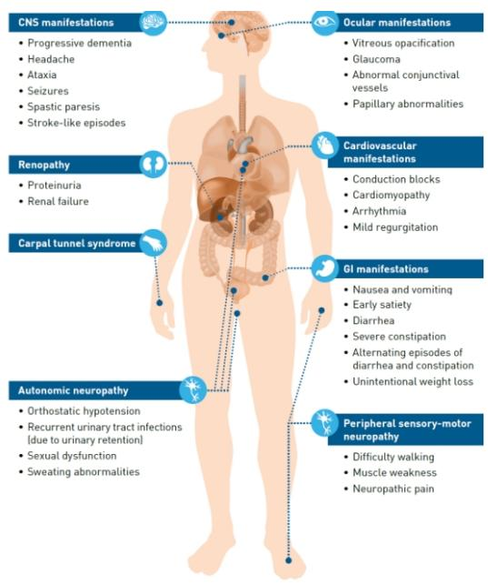  
Source: American Journal of Managed Care

When taken together, the sum of health problems caused by ATTR-CM results in 5 year survival rates from diagnosis in untreated patients of well under 50%.

Out of all the organ systems impacted by ATTR, two categories have emerged that represent the most common and clinically meaningful symptom sets that are associated with this disease.

EXHIBIT 8: Musculoskeletal, peripheral nerve, and autonomic nervous symptoms of ATTR-PN  
  
Source: Heart Failure Reviews

## ATTR - polyneuropathy (ATTR-PN)

In this category, neurological symptoms prevail, with amyloid deposits predominantly affecting the nervous system and joints. In joints the amyloids cause pain, in peripheral nerves they can cause both pain and dysfunction of the nerves leading to muscle weakness. When affecting more centrally located nerves, the amyloids can cause “autonomic” symptoms, which lead to overall frailty and imbalance in the body’s nervous control (Exhibit 8).

The deposits of amyloid on the nerves are usually permanent, and their damage long-lasting. Hence, after diagnosis it's often a race against time to prevent irreversible symptomatic decline.

Polyneuropathy symptoms can be deeply unpleasant, and affect the quality of life of patients. Nevertheless, it is widely accepted by physicians that ATTR-PN is less likely to lead to mortality in patients than the cardiac equivalent of ATTR disease, as there is usually no key organ system involvement.

## ATTR- cardiomyopathy (ATTR-CM)

In this category amyloid deposits build up in heart tissue which cause debilitating symptoms. The amyloid fibrils can be toxic to the cardiac tissues. But more commonly the deposits just make it more difficult for the heart to perform its pumping action as the chambers of the heart become blocked with amyloid plaques. This leads to the muscles and walls of the heart enlarging to compensate (dilated cardiomyopathy), further worsening the blockage (Exhibit 9). Ultimately heart failure results, which leads to a well documented storm of symptoms including breathlessness and fluid congestion in the lungs as the heart is unable to perform its circulatory function. ATTR-CM can be more life-threatening than some forms of cancer.

Heart failure can also be caused by a variety of other health issues. Nevertheless, in ATTR-CM the precipitous decline in heart function accelerated by the constantly accumulating amyloid deposits often leads to rapid health deterioration and death. ATTR-CM is widely accepted as the more dangerous category of ATTR. As such, it dominates R&D into ATTR treatments, and is where, in our view, the majority of the potential market for innovative drug treatments exists in ATTR.

EXHIBIT 9: ATTR-CM pathophysiology  
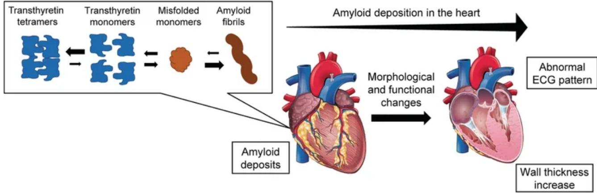  
Source: European Society of Cardiology - Heart Failure

## Diagnostics & epidemiology - the story so far

ATTR-CM and ATTR-PN are not always distinct diseases, and generally refer to the constellation of symptoms that predominate or appear initially.

This is especially the case as one category can often progress to the other category, and in some cases the diseases can manifest as a “mixed” phenotype.

As such, diagnostic criteria can be varied and discretionary. Recent research however, confirms that using both narrow and broad definitions, ATTR-CM is the category that is more common by far (Exhibit 10).

When it comes to diagnosing ATTR more broadly, it has historically been difficult to ascertain a definitive diagnosis.

In ATTR-PN, clinical symptoms are relied upon, hence ATTR-PN can often end up being a diagnosis of exclusion.

EXHIBIT 10: ATTR Epidemiology  
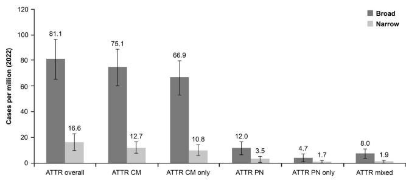  
Source: OpenHeart

In ATTR-CM, echocardiography (ultrasound), electrocardiography (ECG) and traditional blood markers of heart failure are used in diagnosis (Exhibit 11). If hATTR is present, extensive genetic testing can establish a formal diagnosis, although this is quite expensive and not possible in wATTR.

Taking a biopsy of tissue where amyloids are suspected to have accumulated, and then staining the tissue to assess for the misfolded protein can also offer high diagnostic accuracy, although it requires an invasive sampling procedure.

More dynamic techniques are currently under consideration that use fluorescent immunohistochemistry This uses a stain or marker that lights up on imaging when in contact with an amyloid plaque, allowing us to visualise amyloid deposits on affected tissues (Exhibit 12).

EXHIBIT 11: Diagnostic techniques for ATTR  
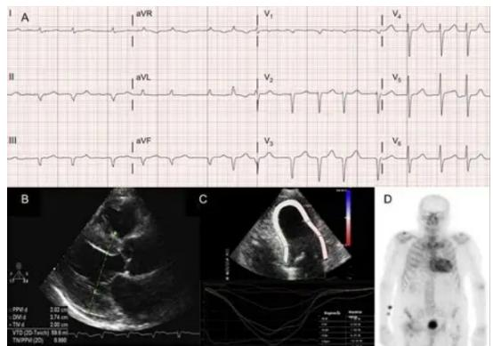  
A: Electrocardiogram (ECG), B/C = Echocardiogram (ultrasound), D =

EXHIBIT 12: Amyloid fluorescent immunohistochemistry (electron microscopy)  
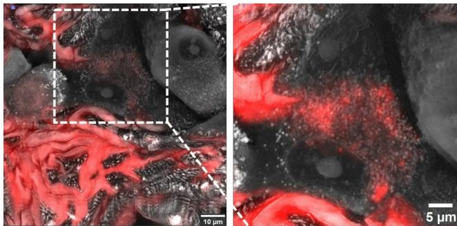  
Source: Michalon et al, International symposium on Amyloidosis, 2024  
fluorescence imaging  
Source: Spanish Cardiology Review

Capturing amyloids in blood tests is difficult, and so there exists in our view an unmet diagnostic need. Worlwide, AstraZeneca estimates the number of patients diagnosed with ATTR-CM to be 121,000, whilst the prevalence is suggested to be over 900,000.

There is in our view an opportunity to expand drug use. Many ATTR sufferers can end up being treated for what may just seem like non-specific heart failure or peripheral nerve dysfunction of any etiology (cause) without more targeted treatments.

## HOW IS ATTR TREATED? - CONVENTIONAL (SYMPTOM RELIEF ONLY)

ATTR is generally considered incurable. In the past, treatments have been largely supportive, and revolved around managing the consequences of amyloid deposition once it has occurred. These supportive treatments can include:

\- Heart failure medications like diuretics that ease the burden on the heart through the removal of excess fluid via urine

\- anti-coagulants and anti-arrhythmics that respectively prevent blood clots and abnormal heart rhythms that result from amyloid deposits

\- In some hereditary cases, liver transplantation is offered as the liver is where the faulty TTR protein is misfolded, although this is no longer the standard of care given mixed historical results and cost

Some off-patent medications are used in ATTR with purported benefits such as doxycycline with tauroursodeoxycholic acid (TUDC). TUDC is a bile acid that protects membranes in heart muscle cells, negating the toxic effects of amyloid fibrils. Doxycycline on the other hand is a widely used antibiotic that is shown to break down larger clumps of TTR in laboratory cell cultures. Although the combination would be a cheap way to target ATTR, phase II studies thus far have been lacklustre, and so the combination remains investigational.

Diflusinal is a non-steroidal anti-inflammatory medication (NSAID), that uniquely binds to the thyroxine receptors on the TTR protein, slowing down folding. A phase III trial in polyneuropathy only has been conducted demonstrating reduced progression in neurological impairment. Nevertheless, the trial was not powered for a high level of statistical significance, and the drug remains a non-standard of care treatment.

EXHIBIT 13: ATTR disease modifying treatment paradigm  
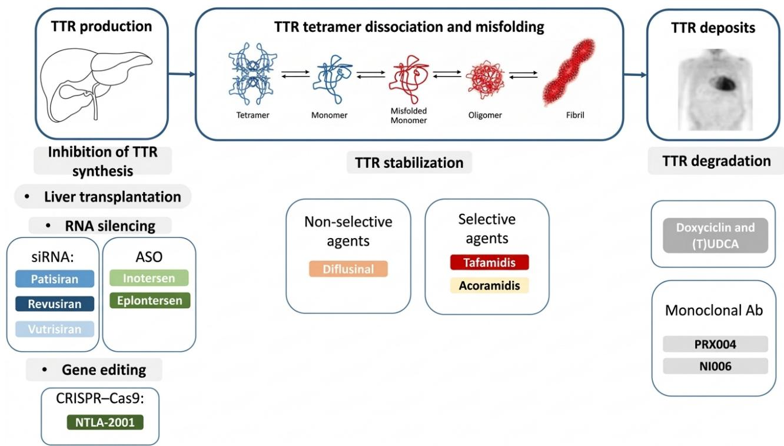  
ASO= antisense-oligonucleotide, PRX004= Coramitug, NI006= Cliramitug
Source: Frontiers in Cardiovascular Medicine

## Disease modifying ATTR treatments

More recently, the high unmet clinical need in ATTR has prompted a series of disease modifying treatments to be developed, that in our view have transformed survival and care in ATTR. These treatments are broadly centered around three pillars of disease modification.

## 1/Silencers

These medications inhibit (“silence”) the production of diseased TTR proteins

## 2/Stabilisers

These medications minimise misfolding, and thereby limit the accumulation and aggregation of amyloid fibrils into plaques

## 3/Depleters

These medications are designed to physically remove amyloid deposits that have already been deposited

These three pillars of treatment act on every available target in the ATTR disease process (Exhibit 13) Between them they support a lucrative and, in our view, strongly growing market for ATTR therapy that should be worth upwards of \$30Bn by 2036e.

## WHAT ARE STABILISERS?

Stabilisers in ATTR are essentially medications which assist in maintaining the form of TTR proteins.

Diseased TTR proteins don't have to misfold immediately. But they ultimately always do, and the presence of other misfolded TTR proteins prompts other proteins to misfold in a vicious cycle. Stabilisers help to slow down the misfolding process (Exhibit 14).

To achieve this, stabilisers bind to functional forms of the TTR protein (which are composed of four protein segments - known as tetramers).

Diseased TTR forms break down into their constituent parts, eventually then folding into the diseased fibril shape characteristic of amyloid deposits. By binding to the greater structure and “holding it together”, stabilizers prevent the progression of TTR amyloid disease.

EXHIBIT 14: TTR stabilisation schematic  
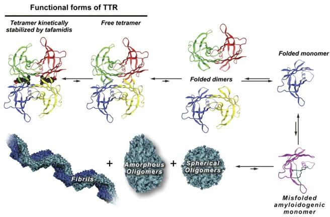  
TTR structures associated with pathology  
Source: PNAS

Vyndaquel (tafamadis) developed by Pfizer (Breen;MP), has been the leader in selective stabiliser category since its first approval in 2018 for ATTR-CM. The phase III ATTR-act program investigated Vyndaquel against placebo, using all cause mortality and cardiovascular hospitalizations as a composite primary endpoint.

EXHIBIT 15: ATTR-ACT phase III primary endpoint results  
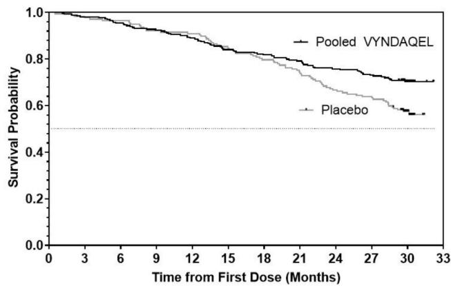  
Source: Food & Drug Administration

The trial met its primary endpoint, with a 0.68 hazard ratio for cardiovascular related hospitalizations annually (p<0.0001) (Exhibit 15). Interestingly, the phase III evidence for Vyndaquel in PN read out in 2012, trialing the drug against placebo with the Norfolk quality of life index (TQOL) used as a primary endpoint. This diagnostic tool is now outdated in our view and features more commonly as a secondary endpoint in newer medications.

Ultimately Vyndaquel did not show a statistically significant improvement in this trial, and was not approved in the US for ATTR-PN despite being approved elsewhere in the world.

As an oral therapy with few side effects and relatively few adverse effects, Vyndaquel has led the stabiliser market for years, and was the standard of care for both ATTR-CM and ATTR-PN until very recently.

Bloomberg consensus forecasts peak year sales of \$6.8Bn in 2026, aligned with Bernstein forecasts.

Attruby (acoramidis) developed by BridgeBio (Pickering;O) is the latest oral stabiliser therapy (launced in the US in 2024), with a similar mechanism of action to Vyndaquel in that it binds to the thyroid receptor part of the TTR protein, thereby preventing it from breaking down (if diseased) into its constituent parts. AstraZeneca commercializes this drug in Japan.

In the ATTRibute-CM phase III trial, Attruby was investigated against placebo with a primary composite endpoint of event free survival till first cardiovascular hospitalisation or all cause mortality. With a hazard ratio of 0.645 (0.5 - 0.832, p<0.05%), Attruby demonstrated a statistically significant, and marginally superior result to Vyndaquel in ATTR-CM (Exhibit 16).

BridgeBio had previously planned the ATTRibute-PN program to investigate Attruby in ATTR-PN. However, it was withdrawn after disappointing early data. Instead, the ACT-early phase III program has been launched as an open label extension to the ATTRibute-CM trial.

EXHIBIT 16: ATTRibute-CM phase III primary endpoint results  
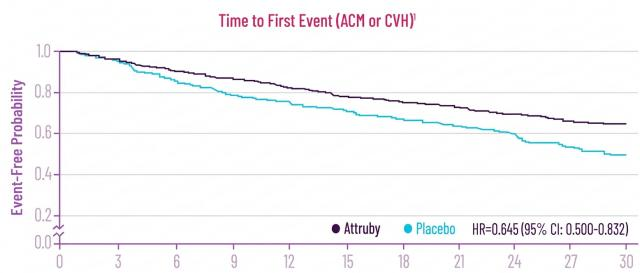  
Source: BridgeBio

This program evaluates whether carriers of the ATTR mutation might benefit from early administration of Attruby, potentially delaying symptom onset. It is set to read out in 2H27.

Consensus (Bloomberg) forecasts peak year sales of \$3.8Bn for Attruby in 2035.

## WHAT ARE SILENCERS?

The second of the three disease modifying pillars, involves stopping the production of diseased TTR proteins that might go on to misfold into amyloids. An already mentioned example of this kind of treatment is to replace the liver entirely where these proteins are made, thereby “silencing” the production of the faulty proteins. With modern gene therapies however, scientists have developed the ability to silence only the genes that produce the faulty proteins, avoiding the need for more invasive measures like surgery. Several key gene therapy approaches have emerged:

Small interfering RNA (siRNA), are small molecules that actually mimic the messenger molecules (mRNA) just described within cells, and actively interfere in the protein expression pathways leading to TTR production. This active sabotage of these pathways again prevents the cells from producing the diseased TTR proteins. Examples of this technology include Onpattro and Amvuttra (Alnylam (Pickering;O)), launched in 2018 and 2022 respectively, with 2025 sales of \$172m and \$2.3Bn respectively.

Antisense oligonucleotides (ASO), are molecules that bind to the genetic code (mRNA) that within cells leads to production of the TTR protein. This binding means the code (mRNA) can no longer produce the protein and so circulating concentration of TTR protein is reduced. Examples of this technology include Tegsedi (Ionis (MP)), and Wainua (AstraZeneca (O)/Ionis (MP)).

CRISPR is a widely used gene editing technique, designed to offer a potentially permanent fix to edit the gene responsible for the production of TTR proteins.

Considering that all of these are gene therapies are effective (Exhibit 17), silencers command high price premia. But these drugs carry stronger side effect profiles in relative terms to conventional therapies such as NSAIDs. In addition, approvals for silencers (until 2025) have, in the majority, been for ATTR-PN only, which is a significantly smaller patient subgroup. Hence silencers are an emerging market opportunity as thus far their approvals have largely been ex-US.

EXHIBIT 17: Silencer treatment modalities  
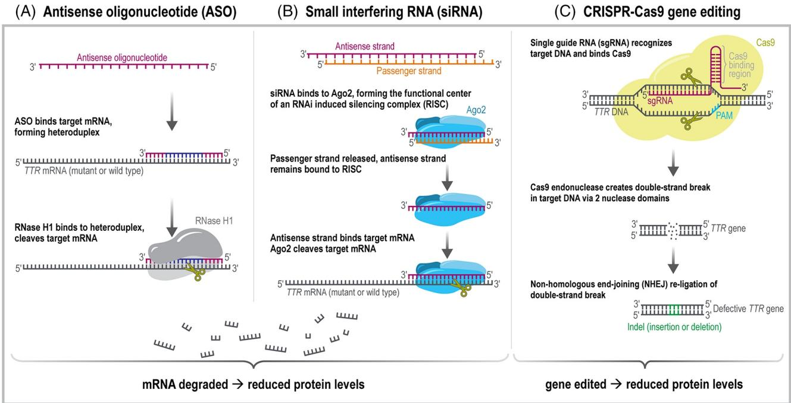  
Source: Journal of the Peripheral Nervous System

## SIRNA DEEP DIVE

Revusiran, a siRNA developed by Alnylam (Pickering;O), was the first commercial attempt at a silencer developed for the ATTR market. But it failed its phase III ENDEAVOUR program and was discontinued in 2016.

Onpattro (patisiran), was another siRNA developed by Alnylam, requiring three weekly intravenous infusion targeted for ATTR-PN.

In the phase III study APOLLO program in 2017, Onpattro was compared against placebo over 18 months, with the modified neuropathy impairment score +7 (mNIS+7) used to assess symptom severity. In the intervention group there was a 34 score point reduction (28.1, 29.9 p<0.05) in the mNIS+7 score, which was statistically significant (unlikely to be down to chance)- Exhibit 18.

With a favorable safety profile, Onpattro became a pioneering silencer treatment in ATTR-PN. However, despite what seems like a large absolute point reduction in the mNIS+7 score, the overall effect was still modest in our view given the score is out of 340. This may explain its peak sales of just \$557m in 2022. An ATTR-CM phase III trial (APOLLO-B) program was conducted in 2022, and also met statistical significance. But the effect size was even more modest, and Onpattro never achieved FDA approval in ATTR-CM as a result.

EXHIBIT 18: APOLLO phase III primary endpoint  
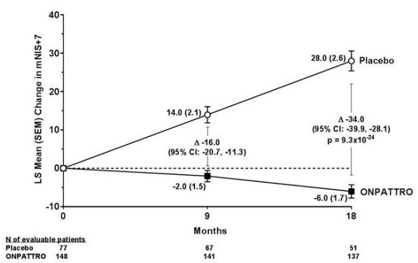  
Source: Alnylam

Although loss of exclusivity for Onpattro is not expected until the early 2030s, the product has since been superseded by Alnylam's own successor siRNA - Amvuttra.

Amvuttra (vutrisiran), is a siRNA with a largely similar mechanism of action to Onpattro, but whose greater stability permits once quarterly administration through a much less invasive subcutaneous needle (under the skin). In the phase III HELIOS-A program concluded in 2022, Amvuttra was trialed for 18 months against placebo in patients with ATTR-PN and with the same primary and secondary endpoints as the APOLLO program. Amvuttra reported a 29 point statistically significant reduction in mNIS+7 score (Exhibit 19).

A need to supplement vitamin A was noted, but aside from this the drug had a reassuring safety profile, and so was approved worldwide for ATTR-PN in the following year.

The delivery of comparable clinical efficacy with significantly improved convenience has meant that Amvuttra has cannibalized Onpattro sales in recent years. Last year Amvuttra achieved sales of \$2.3Bn across all segments.

EXHIBIT 19: HELIOS-A phase III primary endpoint results  
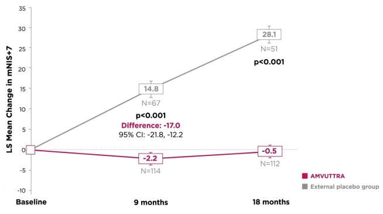  
Source: Alnylam

In ATTR-CM, the pioneering HELIOS-B phase III program trialed Amvuttra against placebo over 36 months, with a primary endpoint of time to first cardiovascular event or all cause mortality. In the intervention group, there was a 28% relative risk reduction in cardiovascular events or all cause mortality (HR=0.72, 0.57-0.91 p<0.05) (Exhibit 20). In subgroup analysis, previous stabiliser use (tafamadis), age and hATTR were factors that reduced the efficacy of Amvuttra (Exhibit 21). Nevertheless, the overall result was clinically meaningful (likely to change medical practice) as well as statistically significant. The trial thus met its primary endpoint in 2024 and was subsequently approved for ATTR-CM in 2Q25.

EXHIBIT 20: HELIOS-B phase III primary endpoint result  
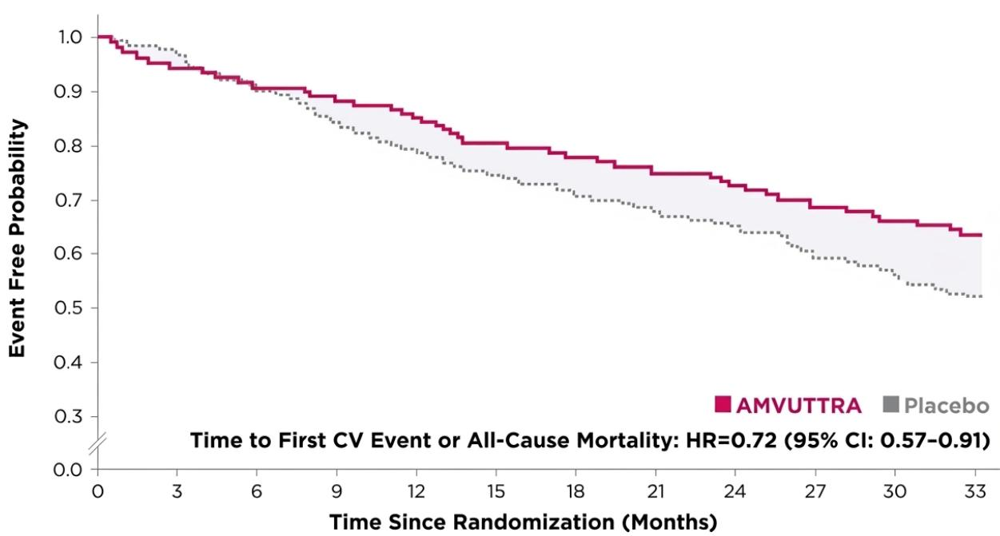

<table><tr><td></td><td colspan="12">NO. AT RISK</td></tr><tr><td>AMVUTTRA</td><td>326</td><td>306</td><td>294</td><td>284</td><td>271</td><td>254</td><td>247</td><td>237</td><td>227</td><td>216</td><td>206</td><td>185</td></tr><tr><td>Placebo</td><td>328</td><td>317</td><td>295</td><td>270</td><td>253</td><td>237</td><td>221</td><td>210</td><td>199</td><td>183</td><td>172</td><td>155</td></tr></table>

Source: Alnylam

EXHIBIT 21: ATTR-CM HELIOS-B Phase III subgroup analysis

<table><tr><td>Subgroup</td><td></td><td>FAVORS AMVUTTRA</td><td>FAVORS PLACEBO</td><td>HR</td><td>95% CI</td></tr><tr><td>Overall</td><td>(N=654)</td><td></td><td></td><td>0.72</td><td>(0.55-0.93)</td></tr><tr><td rowspan="2">Age at baseline (years)</td><td>&lt;75 (n=257)</td><td></td><td></td><td>0.54</td><td>(0.35-0.85)</td></tr><tr><td>≥75 (n=397)</td><td></td><td></td><td>0.81</td><td>(0.58-1.11)</td></tr><tr><td rowspan="2">Tafamidis use at baseline</td><td>No (n=395)</td><td></td><td></td><td>0.67</td><td>(0.49-0.93)</td></tr><tr><td>Yes (n=259)</td><td></td><td></td><td>0.79</td><td>(0.51-1.21)</td></tr><tr><td rowspan="2">ATTR disease type</td><td>hATTR (n=76)</td><td></td><td></td><td>0.92</td><td>(0.49-1.72)</td></tr><tr><td>wtATTR (n=578)</td><td></td><td></td><td>0.67</td><td>(0.51-0.90)</td></tr><tr><td rowspan="2">NYHA class at baseline</td><td>I/II (n=592)</td><td></td><td></td><td>0.73</td><td>(0.55-0.96)</td></tr><tr><td>III (n=62)</td><td></td><td></td><td>0.68</td><td>(0.33-1.41)</td></tr><tr><td rowspan="2">NT-proBNP level at baseline (ng/L)</td><td>≤2000 (n=342)</td><td></td><td></td><td>0.52</td><td>(0.35-0.79)</td></tr><tr><td>&gt;2000 (n=312)</td><td></td><td></td><td>0.80</td><td>(0.56-1.13)</td></tr></table>

NYHA= New York heart classification score for heart failure  
Source: Alnylam

At the time of writing, Amvuttra is the only silencer treatment that is approved in both ATTR-PN and ATTR-CM. Moreover, considering its convenience and value proposition ( $>$ 400k annual US list price) is expected to capture substantial market share in value terms in the short to medium term. Most of Amvuttra's share gain resulted from being first to market, and is expected to be eroded as it rolls out its successor product nucesiran in the early 2030s (Exhibit 44). Bernstein forecasts peak year sales of \$10Bn, with the corresponding Bloomberg consensus at \$12Bn in 2035.

Nucresiran is the latest product by Alnylam in the siRNA category currently in development. Similar to Amvuttra, the difference with nucesiran is that through the use of the IKARIA platform (drug optimisation technology), nucesiran has optimised its targeting and molecular profile. In essence, nucesiran has the same mechanism of action as Amvuttra, however its optimization allows it to aspire to greater clinical efficacy. Principally, it's the frequency of administration that is likely to be reduced with this optimized drug biology. Whereas Amvuttra requires monthly visits to receive medication, nucesiran hopes to reduce this to once or twice a year.

Although not strictly a “one and done” curative gene therapy, the low number of required doctor visits would in our view give nucesiran significant pricing power. Given the mechanism of action being similar to Amvuttra, and phase I trials being highly successful (Exhibit 23), nucesiran was progressed directly to phase III trials without a phase II study conducted.

EXHIBIT 22: Nucresiran mechanism of action  
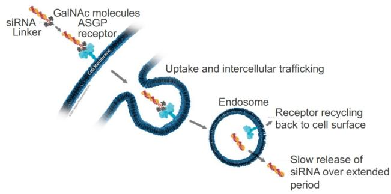  
Source: Alnylam  
EXHIBIT 23: Nucresiran phase I results

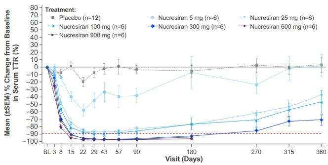  
Source: Alnylam

In phase III, the TRITON-PN and TRITON-CM programs have begun recruitment. In ATTR-PN, 125 patients are being investigated over 9 months with 6 monthly administration of nucesiran, with the mNIS+7 score being used as a primary endpoint in line with other ATTR-PN studies. Readouts are expected in 1H2028. In the more lucrative ATTR-CM trial, 1250 patients are being investigated against placebo with 6 monthly administration of 300mg of nucesiran with the primary endpoint being a composite outcome of all cause mortality and cardiovascular events. This event driven model is similar to the one used by AstraZeneca in cardioTTRansform. The trial is set to read out in 2H2030.

We believe the higher power of the TRITON program in contrast to HELIOS -B (655 patients), reflects the lessons Alnylam has learned from AstraZeneca's experience with cardioTTRansform. If positive, nucesiran's commercial potential is high, nevertheless we don't believe it will take market share from Wainua, as Wainua is a different form of silencer (anti-sense oligonucleotide) and is also paired nicely with the novel depleter mechanism that we describe further below. In addition, we are confident that Alnylam sales representatives will seek to offer nucesiran as a successor therapy for Amvuttra, cannibalizing Amvuttra sales instead of taking share from other companies in the market. Bloomberg consensus forecasts nucesiran to realise peak sales of \$7.6Bn by 2036.

## ASO DEEP DIVE

Tegsedi (inotersen) developed by Ionis pharmaceuticals (Will Pickering, MP), was the first ASO silencer technology deployed in ATTR through weekly subcutaneous injection, and had its phase III NEURO-TTR program read out in 2018. It tested the drug against placebo over a similar timescale of 18 months. The trial met its primary endpoint of reduction in mNIS+7 score of 19.7 compared to placebo (p<0.001) (Exhibit 24).

However, there were significant adverse events with low platelet count and kidney disease (some fatal) recorded and several boxed warnings and liver monitoring requirements appear on this drugs package insert.

Tegsedi was hence approved in ATTR-PN. However given the impending arrival of competitors, a cardiomyopathy clinical program was never pursued, and the drug was discontinued in 2024-25 due to lackluster sales.

EXHIBIT 24: NEURO-TTR phase III primary endpoint results  
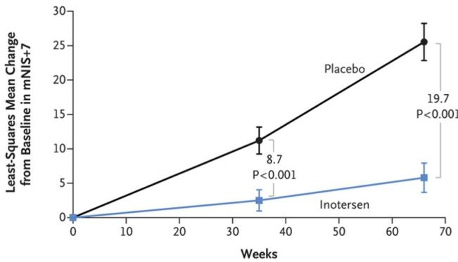  
Source: New England Journal of Medicine

Wainua (eplontersen) was also developed by Ionis and licensed to AstraZeneca in 2021. It is injected subcutaneously (under the skin) but only once a month.

EXHIBIT 25: NeuroTTRansform phase III primary endpoint results  
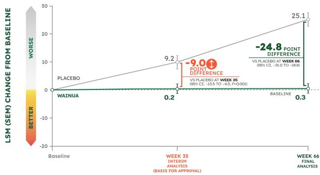  
Source: AstraZeneca

In the phase III NeuroTTRansform program, Wainua was compared against placebo (and also a subgroup that had previously been on Tegsedi). Against the placebo subgroup Wainua showed a 24.8 (18.6 - 31, p<0.05) reduction in mNIS +7 score (Exhibit 25).

In our view, as a monotherapy, Wainua demonstrates comparable efficacy to Amvuttra in the ATTR-PN cohort, and it was approved in this group in 3Q24.

In ATTR-CM AstraZeneca launched the large CardioTTRansform phase III program in 2020. With over 1,400 patients this is the largest ATTR-CM trial ever conducted.

Furthermore, unlike with the HELIOS-B trial, the endpoint in CardioTTRansform of cardiovascular specific mortality rather than all-cause mortality is more specific to ATTR-CM. Interviews with KOLs and our own analysis of the powering of the trial strongly suggest that this is a more thorough and meaningful primary endpoint.

We believe that if this primary endpoint of composite cardiovascular mortality and recurrent cardiovascular clinical events up to 140 weeks is met, Wainua will have a strong evidence based claim to disease modifying efficacy.

Furthermore, the CardioTTRansform trial has a subgroup analysis that looks specifically at patients who at baseline are treated with a stabiliser medication (tafamidis). This is the first such group that has been investigated in phase III that is taking both treatment classes at the same time.

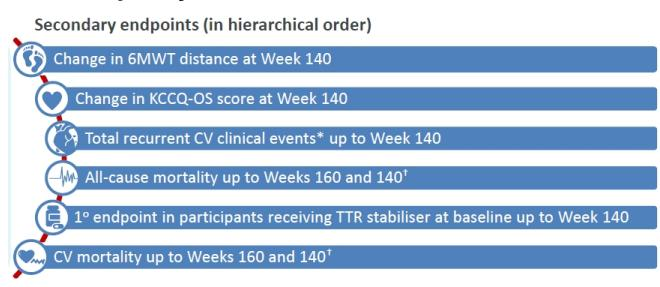  
EXHIBIT 26: CARDIO-TTRANSFORM phase III hierarchical secondary endpoints

Secondary endpoints (in hierarchical order)

Change in 6MWT distance at Week 140

Change in KCCQ-OS score at Week 140

Total recurrent CV clinical events\* up to Week 140

All-cause mortality up to Weeks 160 and 140 $^{†}$

1° endpoint in participants receiving TTR stabiliser at baseline up to Week 140

CV mortality up to Weeks 160 and $140^{\dagger}$

Source: World congress on acute heart failure

Our channel checks suggest that close to half of patients in the cardio-t-transform trial will be subject to this combination of stabiliser plus silencer subgroup analysis.

We believe that if this combo subgroup shows improved efficacy, then Wainua will have a clear competitive advantage in the treatment algorithm for ATTR-CM.

But we note that the baseline stabilizers subgroup is the fifth ranked of six hierarchical secondary endpoints so might not necessarily be achieved (Exhibit 26). The prior four secondary endpoints need to “hit” for the fifth to even qualify to be analyzed.

Our newly upgraded forecast for Wainua of \$5.7Bn in 2035 compares to Bloomberg consensus peak year sales of \$2.3Bn.

Nex-Z (nexiguran ziclumeran) developed by Intellia therapeutics (Will Pickering MP) is the final class of silencer currently under investigation that uses CRISPR technology to limit TTR production. Nex-Z is currently being investigated against placebo in the MAGNITUDE (ATTR-CM) and MAGNITUDE-2 (ATTR-PN) programs with similar primary endpoints to existing phase III programs in this space.

Concerningly, both programs were halted in late 2025 following severe grade 3-4 liver injuries in subject patients, with an associated fatality. The programs have since been restarted, and are due to read out in 2H28. Despite the potential risks of severe adverse events, Bloomberg consensus estimates peak year sales for the asset of \$2.4Bn in 2037.

## STABILISERS & SILENCERS - THE CURRENT PARADIGM

Silencers and stabilisers have collectively transformed the ATTR treatment landscape in the last ten years in our view.

## EXHIBIT 27: Comparison of stabilisers versus silencers

## Transthyretin Cardiac Amyloidosis (ATTR-CM) Drugs: TTR Stabilizers vs. Gene Silencers

<table><tr><td colspan="2"></td><td>TTR Stabilizers</td><td>Gene Silencers</td></tr><tr><td>Names</td><td></td><td>acoramidis (Attruby) tafamidis (Vyndaquel, Vyndamax)</td><td>vutrisiran (Amvuttra)</td></tr><tr><td>How It Works</td><td></td><td>Prevents TTR proteins from breaking apart and forming harmful plaques</td><td>Instructs the liver to slow down or stop making TTR proteins</td></tr><tr><td>Administration</td><td></td><td>Oral pills (once or twice daily), taken at home</td><td>Injections (typically every 3 months), given at a clinic</td></tr><tr><td>Side Effects</td><td>[BAYC]</td><td>Gastrointestinal distress</td><td>Joint pain, shortness of breath, vitamin A deficiency</td></tr><tr><td>Indication</td><td></td><td>Sometimes preferred for patients with earlier, more stable ATTR-CM</td><td>Sometimes preferred for patients with more advanced ATTR-CM</td></tr><tr><td>Results</td><td></td><td colspan="2">Both drugs reduce the risk of hospitalization and early death</td></tr><tr><td>Key Advantage</td><td></td><td>Convenience of daily pills</td><td>Infrequent dosing</td></tr></table>

Our channel checks suggest that there are no widely accepted treatment guidelines in ATTR-CM that mandate either sequential silencers or stabilizers.

As the competitive landscape matures, we believe that an opportunity exists to establish a more broadly accepted standard of care for the majority of patients.

However, expect market expansion as multiple mechanisms of action. When taking established examples of silencers and stabilizers (Exhibit 27), we see several advantages and disadvantages of either drug class.

Ultimately, we believe that the combination, order and complimentarity of treatments will contribute to better patient outcomes. In a disease that remains underdiagnosed, we believe this market expansion is very likely.

When considering the timeline of key phase III programs for both stabilizers and silencers (Exhibit 28), we see a sustainable interest in ATTR R&D, and we believe that this is likely to continue in years to come.

Source: Frontiers in Cardiovascular Medicine  
EXHIBIT 28: Timeline of key silencer and depleter phase II/Phase III trials  
  
CardioTTRansform readout since moved forward to 2026
Source: Frontiers in Cardiovascular Medicine

## DEPLETERS - WHAT ARE THEY?

The third, and most recent emerging class of disease modifying treatments in ATTR are the depleter class. These medications aim to remove the amyloid plaques via faeces that build up in the body. Thus far, two key agents are in development, and both have similar mechanisms of action.

Coramitug (PRX004) was invented by Prothena and licensed to Novo Nordisk (U), and is a humanized monoclonal antibody designed to target misfolded/non-native TTR proteins. It binds to both the soluble form of misfolded TTR proteins, and those already deposited as plaques in the insoluble fibril form. Coramitug is administered through intravenous injection (into the vein) once a month.

This drug prevents misfolded proteins from adding to plaques, and coramitug promotes the clearance of existing plaques as the body's own immune system cells (macro-phages) recognise the antibodies bound to the plaques and then destroys them (Exhibit 29).

EXHIBIT 29: Coramitug mechanism of action  
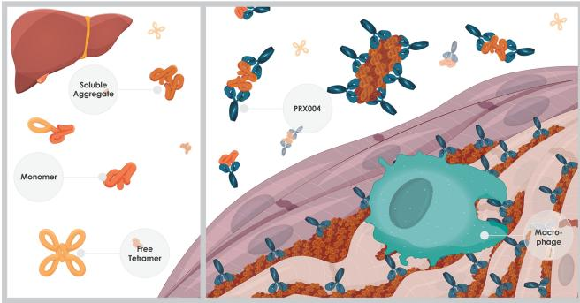  
PRX004 = Coramitug
Source: Prothena

EXHIBIT 30: Coramitug phase II primary endpoint results  
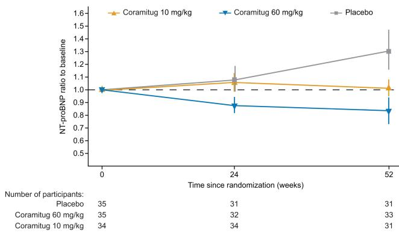  
Source: American Heart Association

In its phase II program in ATTR-CM, coramitug met its primary endpoints of reducing a key blood marker (NT-ProBNP) of heart failure in patients already treated with disease modifying therapy (Exhibit 30). The blood marker was reduced by 48% (22%-65%, p=0.0017). No adverse events were noted, and improvements in functional Echocardiography (heart ultrasound which monitors for structural abnormalities) parameters were also noted in subgroup analyses.

Novo Nordisk launched the phase III cleopATTRa program, investigating coramitug against placebo (which includes those ATTR-CM patients on standard of care) over 4 years. A standard composite endpoint for cardiovascular events and hospitalisations will be used, with over 15 separate secondary endpoints. The trial is set to read out in 2H29. Bloomberg consensus forecasts peak year sales of \$6.3Bn in 2034 for this drug.

Cliramitug (ALXN2220) is being developed by AstraZeneca, is another monoclonal antibody, with the slight nuance vs coramitug in that it binds only to the fibril form of TTR proteins.

Therefore it promotes only the immune removal/degradation of existing plaques rather than diminishing the concentration of circulating TTR protein. Cliramitug is also administered intravenously (into the vein) once a month.

In phase II, cliramitug demonstrated comparable results to coramitug in terms of key biomarker reduction for heart failure.

Additionally however, radio-labelled imaging demonstrated a high level of subjective plaque clearance in ATTR-CM sufferers (Exhibit 31) taking Cliramitug. No adverse events of note were reported, and the data thus far reflects a highly tolerable

EXHIBIT 31: Cliramitug before and after plaque imaging

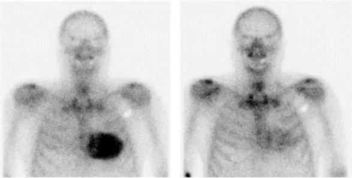  
Source: European Society of Cardiology

medication.

The phase III depleTTR program has been launched, investigating cliramitug against placebo over 4 years with a composite endpoint of total cardiac events and hospitalizations. This study is due to read out just after the end of calendar year 2027, and if successful, would give AstraZeneca a two-year first mover advantage over Novo Nordisk. Bloomberg consensus forecasts peak year sales of \$1.5Bn in 2035 for this drug, whilst we estimate \$2.7Bn in our upgraded forecasts.

## WHY DO WE BELIEVE THAT AZN SHOULD LEAD IN ATTR-CM?

We believe that the coming few years will lead to the greatest disruption in the landscape for ATTR treatments since the introduction of disease modifying mechanisms in 2018. In our view, AstraZeneca's comprehensive portfolio approach would mean that it leads in this >\$20Bn peak sales market. We believe there are several reasons for this.

EXHIBIT 32: Diagnostic image through classical (human eye) pathology (left hand side) vs AI-empowered digital pathology (right hand side)  
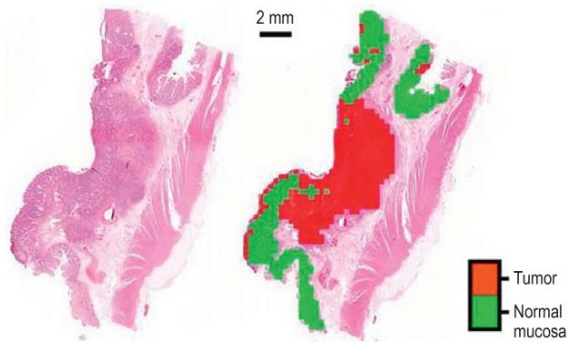  
Source: Försch S, Klauschen F, Hufnagl P, Roth W. Artificial Intelligence in Pathology. Dtsch Arztebl Int. 2021 Mar 26

## 1/ Expanding the market - AI and improving diagnosis

AstraZeneca has long been developing a quantitative continuous scoring (QCS) system algorithm to improve diagnosis of cancerous tissue. By leveraging AI, QCS analyzes have digitized images of immunohistochemically stained tissue samples to provide detailed, quantitative assessments of biomarker expression (Exhibit 32).

Unlike traditional methods that often rely on subjective ('human eye') evaluation, QCS offers precise, objective measurements not only of biomarker presence but also of their intensity and exact localization within subcellular compartments such as the membrane, cytosol, and nucleus.

This comprehensive computational analysis deepens the understanding of tumor biology, enabling more accurate patient selection and personalized treatment strategies for patients.

We believe that this technology can equally be applied to biopsies looking for amyloid disease, increasing diagnosis of patients and therefore the addressable market.

Furthermore, AstraZeneca has also announced a partnership with Roche (O) to deploy its InVision Echocardiography technology for the diagnosis of cardiac amyloid disease. Echocardiography uses sound waves to detect the normal functioning of the heart. But it can be difficult for even the most astute sonographer to detect the faint deposits of protein that characterize amyloid protein disease of the heart.

With AI, it is anticipated that these images will be better stratified, leading to previous false negatives being correctly diagnosed. We believe that AstraZeneca is using AI to materially expand the size of the patient population through better diagnosis. Therefore, even though there are competitors to Wainua and Cliramitug, we believe that market expansion is much more likely than material share shifts.

## 2/ Market expansion and combination therapy

Our channel checks indicate that ATTR remains a disease with no universal treatment guidelines. Down to the individual hospital, treatments can be quite different from each other. Treatments are also often sequential, which means that one is tried, and if it does not work, physicians may move on to another.

We believe that AstraZeneca is challenging this status quo, through its subgroup analysis in the CardioTTRansform trial in patients already on tafamidis (stabiliser). The company is seeking to answer a key question that many scientists have long asked - is a combination of stabiliser and silencer at the same time more effective, with no increase in toxicity, than sequential therapy?

In the event that this subgroup analysis demonstrates superior results, we believe that the standard of care may shift towards this combination therapy of tafamidis and Wainua. This would drive upside to our AZN estimates in ATTR. This would be differentiated as in Amvuttra HELIOS-B phase 3 trial this subgroup wasn't studied. It's also not being studied in the nucesiran phase 3 trial.

EXHIBIT 33: US ATTR-CM treated patients  
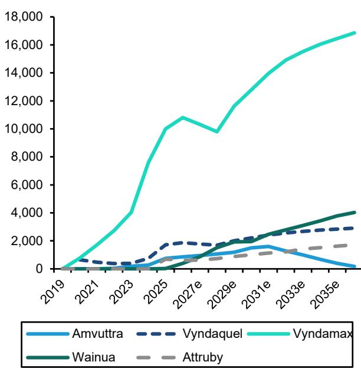  
Source: IQVIA, Bernstein analysis & estimates

Furthermore, proprietary interviews with key opinion leaders KOLs suggest to us that within AZN, a holistic (portfolio) combination approach is being developed. Our interview with the company's biopharma (non-oncology) head of research confirms that if all its phase III programs succeed, AZN will offer cliramitug as a starting (induction) therapy to remove plaques, followed by Wainua as a maintenance therapy to prevent re-accumulation of plaques. With a retained interest in a stabilizer (Attruby), AZN could thus become the only market participant with a full portfolio of disease modifying therapies to target ATTR in cardiomyopathy.

## 3/ Limited patient risk

As with any drug, loss of exclusivity can drive aggressive loss of market share to cheaper alternatives. For AZN's cliramitug, the loss of exclusivity lies well beyond our forecast period which ends in 2036. But for Wainua however, the method of use and composition of matter patents are set to expire in 2036. Nevertheless, from channel checks we have conviction that the silencer class is generally well protected from generic entry post 2036. This is largely because, as with any gene modifying therapy, the regulatory hurdles and manufacturing complexity make it economically challenging to produce a generic alternative, a situation that we don't see materially changing any time soon.

Across the broader ATTR market, the most notable loss of exclusivity is Vyndaquel (tafamadis) which is set to lose exclusivity towards 2029. Our implied TRx (total prescription) based US model with script data from IQVIA (reputable, independent data provider), demonstrates to us that the number of patients who are on tafamidis will likely remain stable/decline slightly in the presence of Attruby which in our view has a stronger evidence base. We believe that when high-priced oral (small molecule; easy to copycat) rare disease medications lose patent protection and much cheaper generics become available, the addressable volume opportunity can expand and the total number of patients on the medication does not decline.

To specify, on 27 $^{th}$ April 2026, the Vyndamax US patent was successfully defended, which extends loss of exclusivity well into the 2030s. Vyndaquel, which requires multiple daily administration as opposed to the once daily Vyndamax will still lose exclusivity in 2029. Despite this, Vyndamax sales make up the vast majority ( $>80\%$ ) of prescriptions for tafamidis in the US. Furthermore, our interviews with KOLs suggest that even if there is generic tafamidis on the market, physicians generally will continue to prescribe the leading branded silencer therapies (which will soon include Wainua) rather than feel the need to “cycle through” an off-patent stabiliser first.

Hence, although generic tafamidis will affect the overall ATTR market, we do not believe that this will be a headwind for AstraZeneca.

## 4/ Rare disease execution track record: AstraZeneca has the upper hand

In our view, AstraZeneca enjoys a strong rare disease legacy and deep pipeline through Alexion that we forecast to deliver a 10 year sales CAGR (2025-36) of 10%, despite Soliris's loss of exclusivity by 2026. We thus forecast Wainua and cliramitug to account for 26% of AZN's group sales CAGR (25-35e; Exhibit 34).

EXHIBIT 34: Wainua's launch should strengthen AstraZeneca leadership in rare diseases (\$m)  
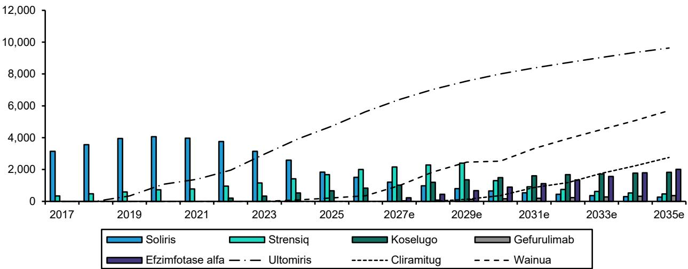  
Source: Company reports, Bernstein analysis & estimates

To reiterate, AstraZeneca enjoys the commercialisation rights for Attruby in Japan, books 100% of global sales of both Wainua (silencer) and cliramitug (depleter). Hence, in our view the company has a unique and unrivaled ATTR portfolio (Exhibit 35). In our view, this approach will lead in the ATTR market long term.

In our view, the ATTR patient journey starts with Wainua (silencer) or Attruby/generic tafamidis as a stabiliser in patients not yet affected by plaque induced heart failure. In those patients with more advanced disease, the plaque tackling depleter (cliramitug) should be added to actively remove any plaque in the hopes of cardiac recovery as the silencer/stabiliser maintain low circulating TTR levels. Although the phase III trial investigating this approach has not yet been launched, we understand through interviews with the head of non-oncology research at AstraZeneca that the company intends to follow this approach.

We believe that this codified protocol in ATTR treatment should transform the treatment algorithm (Exhibit 35). Again, our interviews with KOLs highlight that AZNs highly powered Cardio-TTRansform phase III data (Exhibit 26) should catalyze the publication of much needed ATTR-CM treatment guidelines.

EXHIBIT 35: AstraZeneca ATTR-CM strategy  
  
Source: AstraZeneca CMD 2024

In addition, the same KOLs have highlighted to us how payers generally prefer combination therapies from the same manufacturers. In our view this is another reason why AZN's portfolio approach is likely to win in ATTR-CM long term.

## WHY ARE OUR ATTR REVENUE FORECASTS INCREASING AND WHY IS THIS FRANCHISE NOW A SOURCE OF POSITIVE SURPRISE FOR AZN?

Post prosecution of the CardioTTRansform phase III trial and our key opinion leader interviews, we are increasing our Wainua and cliramitug peak sales estimates by 19% and 369% respectively (Exhibit 38).

Our new modeling work to arrive at our upgraded share estimates for Wainua and cliramitug is based on a two pronged approach (Exhibit 36).

## 1/Patient based - Bottom up:

We derived our new forecasts by using drug treated patient numbers provided by AstraZeneca for ATTR. (AstraZeneca has a team of 5-10 full-time data employees who derive epidemiology data for all segments where AstraZeneca invests).

We used US pricing assumptions based on similar drug classes (Wainua matched to Amvuttra, and cliramitug matched to similar branded MABs for other rare diseases such as Vyvgart (Argenx (O)).

To account for strong sales growth of all recent launches in the ATTR market, we assumed that the rate of US diagnosis in ATTR would grow steadily from 25% in 2024 to over 45% by 2035 (Exhibit 37). (Our starting assumption is in line with AstraZeneca's).

EXHIBIT 36: 2036 global ATTR market shares (by value): Bernstein old vs new estimates

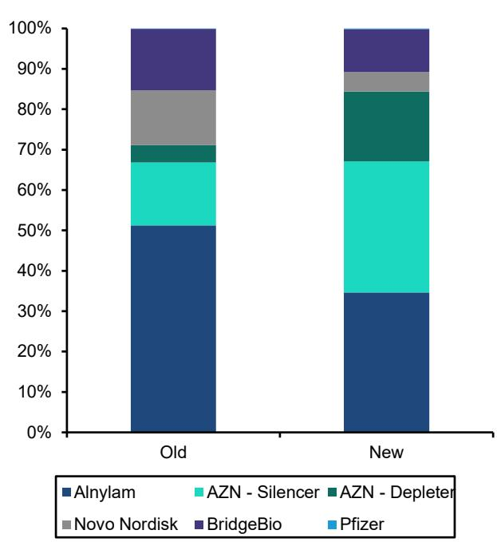  
Includes ATTR-PN (polyneuropathy) and ATTR-CM (cardiomyopathy). Alnylam bar is Amvuttra (silencer); BridgeBio and Pfizer bars are both stabilisers (Attruby and Vyndamax respectively)
Source: Bernstein analysis & estimates, Bloomberg

This is in line with expectations of an aging population globally. The elderly are more likely to suffer from ATTR disease as they have had more time to accumulate the mutations causing the misfolded proteins, therefore a greater number of the elderly is likely to drive growth in patient numbers. We feel these assumptions are conservative, and are corroborated by AstraZeneca and key opinion leaders.

EXHIBIT 37: US Bernstein population assumptions  
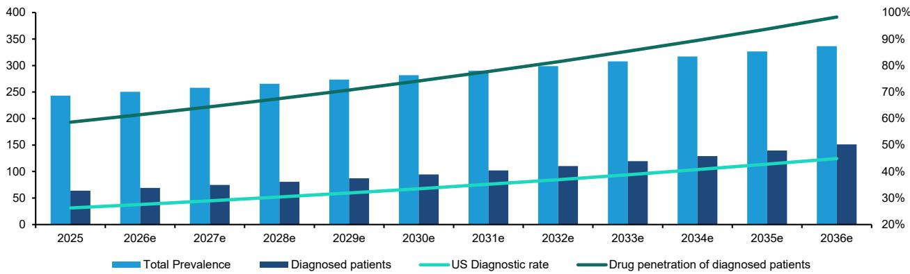  
Source: Bernstein analysis & estimates

Based on this deep dive, in the base case where neither cliramitug nor tafamadis show any synergistic evidence in combination with Wainua, we now forecast 2035e risk adjusted peak year sales of \$5.7Bn for Wainua, in contrast to AstraZeneca's >\$5Bn nominal guidance and the Bloomberg consensus of \$2.3Bn peak year sales. This implies an upgrade of 19% from our own previous estimates for that year (Exhibit 38). For cliramitug, we now forecast \$2.7Bn of risk adjusted peak year sales in 2035e which represents a 4x upgrade from our previous estimates. Our new peak sales projection compares to the consensus (Bloomberg) of \$2.3Bn for that year and AstraZeneca's nominal guidance of \$3-5Bn.

In all, we now assume a total US addressable market of around 150K drug treated patients in ATTR-CM by 2036, of which 26% of patients will be on Wainua and 24% on Amvuttra's silencers (split 1% for Amvuttra and 23% for nucesiran). Meanwhile, in 2036e we project that 23% of patients will be on a depleter, of which 14% will be on AZN's cliramitug and the remaining 9% on Novo's depleter coramitug.

We have assumed a \$460K US annual list price for cliramitug and an identical price for Wainua along with 25-35% gross to net (discounts) for both drugs respectively. These assumptions are based on comparable drugs in the same therapeutic class. Interviews with KOLs also corroborate our assumptions.

The most important driver of the 5% value CAGR (26-35e) which we project for the ATTR-CM market globally is increasing diagnosis (which is still only 25% in the US). Hence, we believe that there is plenty of room for both AstraZeneca and Alnylam both to succeed. Based on our new model we thus believe that neither our substantially upgraded AZN estimates (for Wainua and cliramitug) nor the Amvuttra consensus peak sales estimate are controversial. We also firmly believe that there are several rare disease analogues which prove that the new entrants with novel mechanisms drive market expansion.

## 2/Top-down approach

To robustly stress-test these bottom-up forecasts, we built a top-down model of IQVIA scripts (TRx). Although only applicable to US sales, the implied extrapolated Wainua global estimate in 2036e in our base case was \$6.1Bn, similar to the \$6.2Bn sales forecast for Wainua from our patient based bottom-up model described above for that year. Via our IQVIA scripts method, we were also able to gain conviction that our increased share expectations for Wainua (via bottom up) are realistic.

We are confident that our two-pronged approach has triangulated to robust upgraded sales forecasts for Wainua which imply material upside to consensus.

EXHIBIT 38: Wainua forecasts (\$m): change to Bernstein and comparison to Consensus  
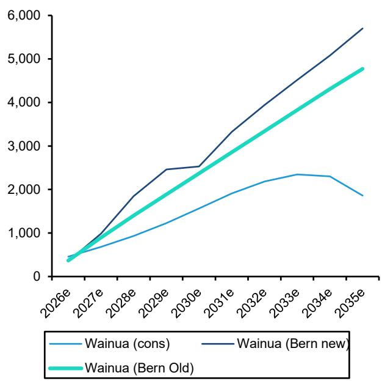  
Source: Bloomberg, Bernstein analysis & estimates

EXHIBIT 39: Cliramitug forecast (\$m): change to Bernstein and comparison to consensus  
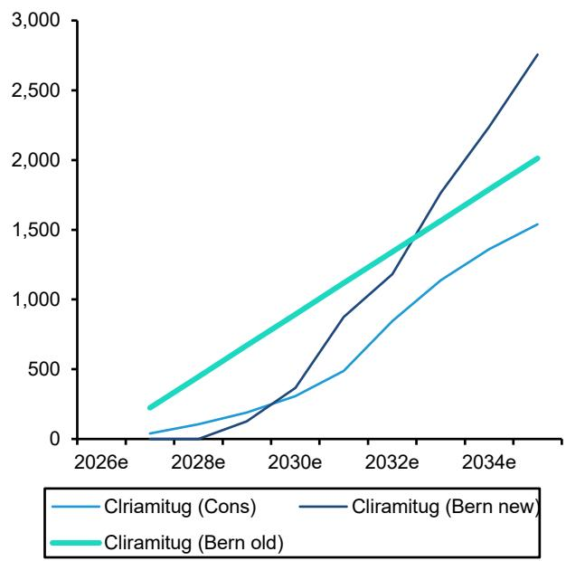  
Source: Bloomberg, Bernstein analysis & estimates

Our AZN ATTR estimate upgrades (Exhibit 40) therefore respectively infer and imply:

1/Cardio-TTRansform is the largest phase III trial ever run with the most thorough (4-point MACE (major adverse cardiovascular event) primary endpoint. In our view, this could lead to the publication of inaugural treatment global guidelines if the trial reads out positively. Given that AZN is investing heavily in AI and other diagnostic campaigns to penetrate the ca 70% of ATTR-CM patients in the US that are not adequately diagnosed, we believe Wainua will enjoy access to a growing market in which it can lead. Furthermore, with generic headwinds from tafamidis being relatively dampened, we believe that Wainua is likely to be a leading silencer that can, in our base case, match the revenues of its nearest competitor Amvuttra by Alnylam (Pickering; O) on a like for like ramp up basis (Exhibit 46).

2/ In our view, AZN is not only likely to win with its holistic strategy but this will also drive upside to consensus. We believe that AZN will become the only pharmaceutical company with a complete portfolio of silencer, stabiliser and a depleter which will drive a halo effect. Post our upgrades, we believe that consensus is under-appreciating the market share gains which AZN will secure in this market (Exhibit 41; Exhibit 42).

3/ Our base case is conservative and robust. We assume that neither the cliramitug (AZN depleter) nor the Vyndamax (Pfizer stabiliser) potential combinations with Wainua will change the standard of care. Considering the views of Key Opinion Leaders (KOL's) we have recently interviewed, this could be conservative. (Please see 'THE BULL CASE - COMBINATION, COMBINATION, COMBINATION' section below for a discussion of the potential upside to our AZN forecasts if the Wainua +Vyndamax and Wainua+cliramitug subgroup data will change the standard of care).

EXHIBIT 40: Wainua & cliramitug: change to Bernstein forecasts (\$m)

<table><tr><td></td><td>2026e</td><td>2027e</td><td>2028e</td><td>2029e</td><td>2030e</td><td>2031e</td><td>2032e</td><td>2033e</td><td>2034e</td><td>2035e</td></tr><tr><td>Wainua (Bern old)</td><td>367</td><td>897</td><td>1,402</td><td>1,887</td><td>2,371</td><td>2,856</td><td>3,340</td><td>3,825</td><td>4,309</td><td>4,773</td></tr><tr><td>Wainua (Bern new)</td><td>349</td><td>985</td><td>1,846</td><td>2,462</td><td>2,529</td><td>3,325</td><td>3,940</td><td>4,516</td><td>5,078</td><td>5,701</td></tr><tr><td>% upgrade</td><td>-5%</td><td>10%</td><td>32%</td><td>30%</td><td>7%</td><td>16%</td><td>18%</td><td>18%</td><td>18%</td><td>19%</td></tr><tr><td>Wainua consensus</td><td>457</td><td>682</td><td>932</td><td>1,228</td><td>1,563</td><td>1,910</td><td>2,185</td><td>2,346</td><td>2,300</td><td>1,859</td></tr><tr><td>% difference (Bern v Consensus)</td><td>-24%</td><td>44%</td><td>98%</td><td>100%</td><td>62%</td><td>74%</td><td>80%</td><td>92%</td><td>121%</td><td>207%</td></tr><tr><td>Cliramitug (Bern old)</td><td>-</td><td>-</td><td>-</td><td>-</td><td>107</td><td>232</td><td>374</td><td>454</td><td>535</td><td>588</td></tr><tr><td>Cliramitug (Bern new)</td><td>-</td><td>-</td><td>-</td><td>127</td><td>366</td><td>876</td><td>1,181</td><td>1,763</td><td>2,237</td><td>2,756</td></tr><tr><td>% upgrade</td><td>-</td><td>-</td><td>-</td><td>-</td><td>242%</td><td>278%</td><td>216%</td><td>288%</td><td>318%</td><td>369%</td></tr><tr><td>Cliramitug consensus</td><td>-</td><td>40</td><td>105</td><td>189</td><td>308</td><td>488</td><td>846</td><td>1,138</td><td>1,361</td><td>1,539</td></tr><tr><td>% difference (Bern v Consensus)</td><td>-</td><td>-</td><td>-</td><td>-33%</td><td>19%</td><td>80%</td><td>40%</td><td>55%</td><td>64%</td><td>79%</td></tr></table>

Source: Bernstein analysis & estimates

Based on our thesis of underappreciated potential for market expansion, we do not believe that AstraZeneca's growth in ATTR-CM automatically has to be at the expense of competitors. We think Alnylam (O) can retain meaningful share even as AstraZeneca grows the market through its unique portfolio approach & Alexion legacy. In fact, we believe that our 2035e global share forecasts for Wainua (32%) and cliramitug (15%) demonstrate that there is still plenty of room in the market for the incumbent Alnylam.

EXHIBIT 41: Consensus - ATTR global market share  
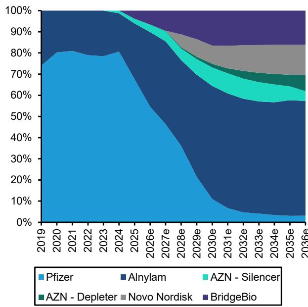  
Includes both ATTR-PN (polyneuropathy) and ATTR-CM (cardiomyopathy). Alnylam includes nucesiran  
Source: Bloomberg, Bernstein analysis & estimates

EXHIBIT 42: Bernstein - ATTR global market share  
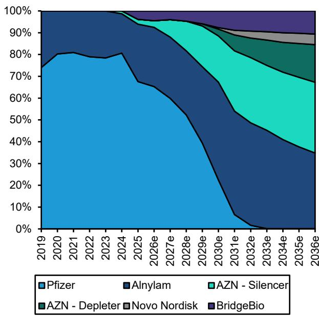  
Includes both ATTR-PN (polyneuropathy) and ATTR-CM (cardiomyopathy). Alnylam includes nucesiran Source: Bernstein analysis & estimates

We expect all categories of disease modifying treatments to grow in the long term (Exhibit 45), any small reduction in total market value by 2035 would be largely due to the Vyndaquel loss of exclusivity in 2029. To reiterate, ATTR-CM is a heterogeneous disease.

Ultimately, our upgraded AZN forecasts represent a 19% increase in the Wainua sales we project in 2036e compared to our previous estimates, whilst our cliramitug estimates are nearly 4x higher.

Although substantial, we believe that our increased TAM estimates, as corroborated by company releases by Alnylam (who say that 70K patients will be treated by 2035 in ATTR-CM alone) are sufficient to justify these increases (Exhibit 43).

In addition, we do not believe that consensus has adequately prosecuted and discounted the market value of novel ATTR medications.

EXHIBIT 43: Alnylam 2030 guidance for treated patients  
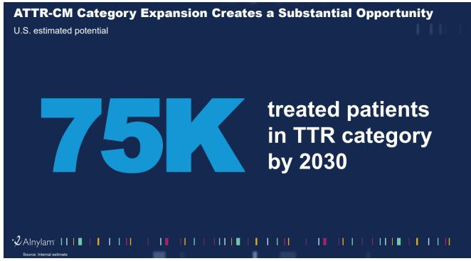  
Source: Alnylam

Furthermore, benchmarking our old Wainua forecasts against the nearest competitor in Amvuttra, suggests our prior estimates did not sufficiently discount for market expansion, premium pricing and share growth. Similarly, our old cliramitug forecasts did not reflect its potentially transformative first in class designation, and the likelihood of combination therapy.

EXHIBIT 44: Global Bernstein ATTR assets sales forecasts PN+CM (\$m)  
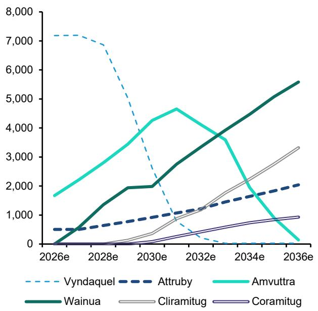  
EXHIBIT 45: Global Bernstein forecast ATTR market annual sales by therapeutic category PN+CM (\$m)

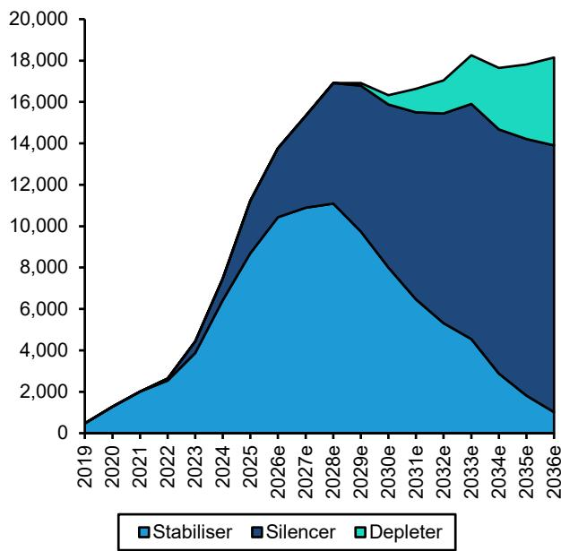  
PN = peripheral neuropathy, CM = cardiomyopathy
Source: Bernstein analysis & estimates  
PN = peripheral neuropathy, CM = cardiomyopathy
Source: Bernstein analysis & estimates

We are cognizant of the ‘competitive’ risks from Alnylam’s nucesiran, which with a twice yearly regime could offer unique and differentiated convenience for patients (especially those too infirm to travel long distances). Nevertheless, the fact that Wainua enjoys a different mechanism of action (being an ASO silencer rather than siRNA silencer) should mean this it's not disrupted despite its monthly intravenous administration.

Whilst our new Wainua forecasts are now $19\%$ ahead of consensus (Exhibit 38, Exhibit 39), we believe that they are robust. This is because we don't forecast Wainua to ramp more aggressively than Amvuttra (Exhibit 46).

Hence, based on this deep dive, we are now cautiously optimistic that Wainua is a superior product to Amvuttra because it should demonstrate better clinical evidence through CardioTTRansform, despite what consensus discounts.

EXHIBIT 46: Bernstein global sales comparison (like for like) \$m

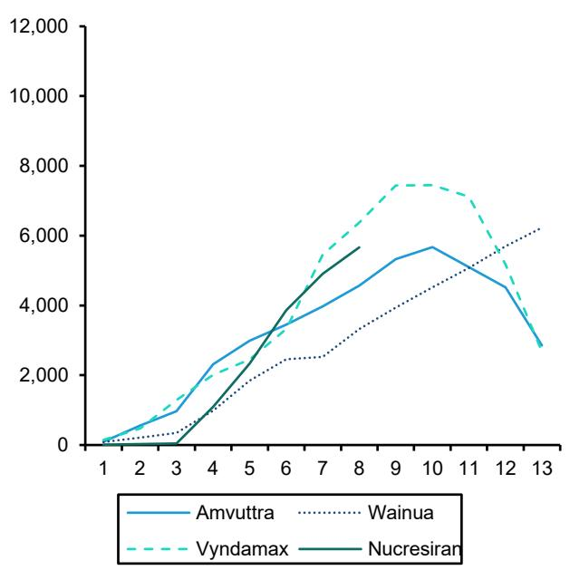  
Source: Bernstein analysis & estimates  
EXHIBIT 47: Consensus global sales comparison (like for like) \$m

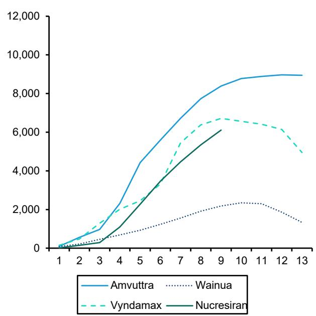  
Source: Bloomberg

## THE BULL CASE - COMBINATION, COMBINATION, COMBINATION

In addition to our base case, we identify two upside scenarios for AstraZeneca:

\- Scenario A: if the tafamadis/Wainua subgroup in the CardioTTRansform trial meets statistical significance, we believe that this clinical data will give Wainua a greater competitive advantage than what our base case projects. This is because Wainua will gain more market share because it will be used in both treatment naive and tafamidis pre-treated patients (the Amvuttta phase 3 HELIOS-B trial in ATTR-CM did not include a tafamidis pre-treated subgroup).

\- Scenario B: if AstraZeneca commence and deliver a successful combination cliramitug/Wainua phase III trial during the next 5 years. As mentioned to us in person by the AstraZeneca R&D head, the company's vision is to enable ATTR-CM patients to clear any accumulated plaques via short term use of a depleter (cliramitug), before preventing new plaque build-up via sustained maintenance use of a silencer (Wainua). Although still cursory, the KOLs we've consulted have unequivocally emphasized to us that such combination would become the new gold standard.

If only scenario A were successful, our 2036e Wainua global sales forecast would increase to \$8.5Bn vs our base case forecast of \$6.2Bn, for a 37% increase. In this scenario, the Wainua 2036e market share would be 34%, whilst the AZN 2036e market share overall be 54% as opposed to 49% in the base case.

## I. REQUIRED DISCLOSURES

References to "Bernstein" or the "Firm" in these disclosures relate to the following entities: Bernstein Institutional Services LLC (April 1, 2024 onwards), Bernstein & Co., LLC (pre April 1, 2024), Bernstein Autonomous LLP, BSG France S.A. (April 1, 2024 onwards), Bernstein (Hong Kong) Limited 盛博香港有限公司, Bernstein (Canada) Limited, Bernstein (India) Private Limited (SEBI registration no. INH000006378), Bernstein (Singapore) Private Limited, Bernstein Japan KK (サンフォード・C・バーンスタイン株式会社) and analysts employed by SG Africa Technologies & Services to produce Bernstein under a Global Services Agreement in place between Bernstein and SG.

Bernstein is part of a joint venture between SG (SG) and AllianceBernstein, L.P. (AB). Unless specifically noted otherwise, for purposes of these disclosures, references to Bernstein's “affiliates” relate to both SG and AB and their respective affiliates.

## VALUATION METHODOLOGY

## Alnylam Pharmaceuticals Inc

Our \$447 PT is the average of a DCF (8.5% WACC, 3.5% TGR), and EV/R (7.5x '27E Rev).

## AstraZeneca PLC

Our price target (£189) is the average of an EV/EBITA-multiples based valuation (applying a 60% premium to 2026-28e peer group and DCF (WACC 8.0%, terminal growth 2.5%).

## RISKS

## Alnylam Pharmaceuticals Inc

## Key downside risks:

• Below-expected Amvuttra uptake in first-line ATTR-CM

• IONS/AZN's eplontersen delivers a more compelling data package that adversely impacts Amvuttra's commercial potential

\- Earlier stage pipeline assets do not progress to later stage development

## AstraZeneca PLC

Downside risk: 1) If we remove Datroway (partnered with Daiichi Sankyo (DS; Outperform; covered by Miki Sogi)) from our model 2) If Enhertu (breast cancer; also DS partnered) no longer grows 3) If the AZN group margin is 33% (the guidance is ‘at least’ 34-36%).

## RATINGS DEFINITIONS, BENCHMARKS AND DISTRIBUTION

## EQUITY RATINGS DEFINITIONS

## Bernstein brand

The Bernstein brand rates stocks based on forecasts of relative performance for the next 12 months versus the S&P 500 for stocks listed on the U.S. and Canadian exchanges, versus the Bloomberg Europe Developed Markets Large and Mid Cap Price Return Index EUR (EDME) for stocks listed on the European exchanges and emerging markets exchanges outside of the Asia Pacific region, versus the Bloomberg Japan Large and Mid Cap Price Return Index USD (JPL) for stocks listed on the Japanese exchanges, and versus the Bloomberg Asia ex-Japan Large and Mid Cap Price Return Index (ASIAX) for stocks listed on the Asian (ex-Japan) exchanges -unless otherwise specified.

The Bernstein brand has three categories of ratings:

\- Outperform: Stock will outpace the market index by more than 15 pp

• Market-Perform: Stock will perform in line with the market index to within +/-15 pp

• Underperform: Stock will trail the performance of the market index by more than 15 pp

Coverage Suspended: Coverage of a company under the Bernstein brand has been suspended. Ratings and price targets are suspended temporarily, are no longer current, and should therefore not be relied upon.

Not Rated: A rating assigned when the stock cannot be accurately valued, or the performance of the company accurately predicted, at the present time. The covering analyst may continue to publish research reports on the company to update investors on events and developments.

Not Covered (NC) denotes companies that are not under coverage.

Bernstein brand stock ratings are based on a 12-month time horizon.

## Autonomous brand – common stocks

The Autonomous brand rates common stocks as indicated below. As our benchmarks we use the Bloomberg Europe 500 Banks And Financial Services Index (BEBANKS) and Bloomberg Europe Dev Mkt Financials Large and Mid Cap Price Ret Index EUR (EDMFI) index for developed European banks and Payments, the Bloomberg Europe 500 Insurance Index (BEINSUR) for European insurers, the S&P 500 and S&P Financials for US banks and Payments coverage, S5LIFE for US Insurance, the S&P Insurance Select Industry (SPSIINS) for US Non-Life Insurers coverage, and the Bloomberg Emerging Markets Financials Large, Mid and Small Cap Price Return Index (EMLSF) for emerging market banks and insurers and Payments. Ratings are stated relative to the sector (not the market).

The Autonomous brand has three categories of common stock ratings:

\- Outperform (OP): Stock will outpace the relevant index by more than 10 pp

\- Neutral (N): Stock will perform in line with the market index to within +/-10 pp

\- Underperform (UP): Stock will trail the performance of the relevant index by more than 10 pp

Coverage Suspended: Coverage of a company under the Autonomous research brand has been suspended. Ratings and price targets are suspended temporarily, are no longer current, and should therefore not be relied upon.

Not Rated: A rating assigned when the stock cannot be accurately valued, or the performance of the company accurately predicted, at the present time. The covering analyst may continue to publish research reports on the company to update investors on events and developments.

Those denoted as ‘Feature’ (e.g., Feature Outperform FOP, Feature Under Outperform FUP) are our core ideas.

Not Covered (NC) denotes companies that are not under coverage.

Autonomous brand common stock ratings are based on a 12-month time horizon.

## Autonomous brand – preferred stocks

The Autonomous brand has three categories of preferred stock ratings:

\- Outperform (OP): The total return of the preferred instrument is expected to outperform preferred securities of other issuers operating in similar sectors or rating categories over the next six months.

\- Neutral (N): The total return of the preferred instrument is expected to perform in line with preferred securities of other issuers operating in similar sectors or rating categories over the next six months.

\- Underperform (UP): The total return of the preferred instrument is expected to underperform preferred securities of other issuers operating in similar sectors or rating categories over the next six months.

Autonomous preferred stock ratings are based on a 6-month time horizon.

## AUTONOMOUS CREDIT RESEARCH

Where this report contains investment recommendations for credit instruments, as defined in article 3(1)(35) of the Market Abuse Regulation, the information below is presented to comply with its disclosure requirements.

The report may also include reference(s) to published opinions by other Autonomous or Bernstein analysts covering the equity securities of the issuer(s) referenced herein. Please note an investment recommendation for credit instruments published by the author(s) of this report may differ from the published view of the analyst covering equity securities for the issuer(s) contained in this report and vice versa.

## CREDIT RATINGS DEFINITIONS

The Autonomous brand has three categories of credit ratings:

\- Credit Outperform (C-OP): The total return of the Reference Credit Instrument is expected to outperform the credit spread of bonds of other issuers operating in similar sectors or rating categories over the next six months.

\- Credit Neutral (C-N): The total return of the Reference Credit Instrument is expected to perform in line with the credit spread of bonds of other issuers operating in similar sectors or rating categories over the next six months.

\- Credit Underperform (C-UP): The total return of the Reference Credit Instrument is expected to underperform the credit spread of bonds of other issuers operating in similar sectors or rating categories over the next six months.

Autonomous credit ratings are based on a 6-month time horizon.

A list of all investment recommendations produced by the author(s) of this report alongside credit ratings history are available upon request.

It is at the sole discretion of the Firm as to when to initiate, update and cease research coverage. The Firm has established, maintains and relies on information barriers to control the flow of information contained in one or more areas (i.e. the private side) within the Firm, and into other areas, units, groups or affiliates (i.e. public side) of the Firm

## DISTRIBUTION OF EQUITY RATINGS/INVESTMENT BANKING SERVICES

<table><tr><td>Equity Rating</td><td>Market Abuse Regulation (MAR) and FINRA Rating Category</td><td>Global Rating Distribution</td><td>Investment Banking Relationships*</td></tr><tr><td>Outperform</td><td>BUY</td><td>51.2%</td><td>15.3%</td></tr><tr><td>Market-Perform (Bernstein Brand) Neutral (Autonomous Brand)</td><td>HOLD</td><td>35.8%</td><td>16.2%</td></tr><tr><td>Underperform</td><td>SELL</td><td>13.1%</td><td>13.6%</td></tr></table>

\* These figures represent the percentage of companies within each equity rating category for which affiliates of Bernstein have provided investment banking services within the previous 12 months.
As of June 30, 2026. All figures are updated quarterly.

## PRICE CHARTS / RATINGS AND PRICE TARGET HISTORY

Prior to April 1, 2024, Bernstein & Co., LLC. issued the ratings and price target information in the graph(s) below for the following companies: Alnylam Pharmaceuticals Inc.

Outperform (O); Market-Perform (M); Underperform (U); Coverage Suspended (CS); Not Covered (NC)

AstraZeneca PLC (AZN.LN) Rating History for Bernstein as of 07/03/2026  
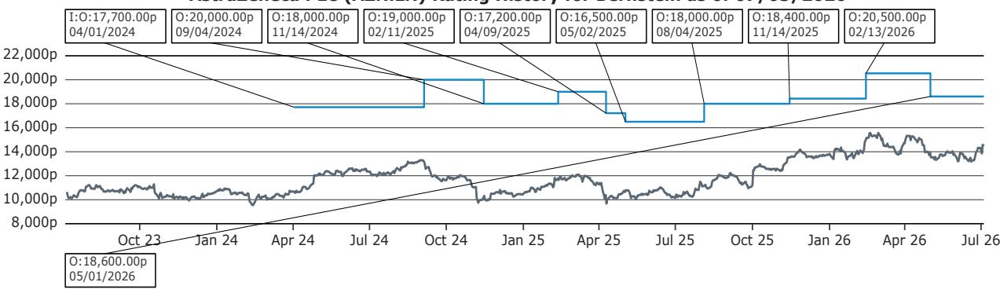

Alnylam Pharmaceuticals Inc (ALNY) Rating History for Bernstein as of 07/03/2026  
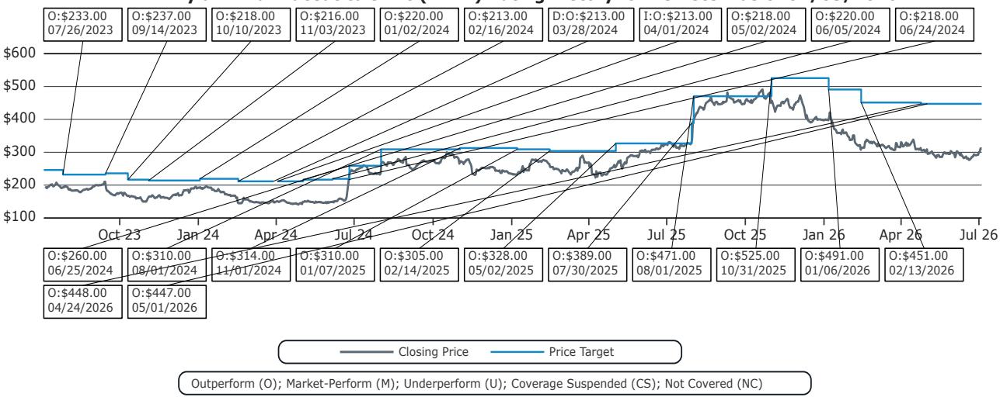  
All price target and closing price data in the chart(s) above are denominated in the currency noted in the Ticker Table of this report.

## CONFLICTS OF INTEREST

SG and/or its affiliates beneficially own 0.5% or more of [the total issued share capital/any class of common equity securities] with a net [long/short] position of: AstraZeneca PLC.

Bernstein and/or affiliates have received compensation for non-investment banking securities-related products or services in the previous twelve months from the following clients: AstraZeneca PLC.

Bernstein and/or affiliates expect to receive or intend to seek compensation for investment banking services in the next three months from AstraZeneca PLC.

Certain affiliates of Bernstein act as market maker or liquidity provider in the equities securities of: AstraZeneca PLC.

Bernstein and/or affiliates had an investment banking client relationship during the past twelve months with AstraZeneca PLC.

Certain affiliates of Bernstein act as market maker or liquidity provider in the debt securities of: AstraZeneca PLC.

## OTHER MATTERS

The legal entity(ies) employing the analyst(s) listed in this report, and their location, can be determined by the country code of their phone number, as follows:

+1 Bernstein Institutional Services LLC; New York, New York, USA

+44 Bernstein Autonomous LLP; London UK

+212 SG Africa Technologies & Services; Casablanca, Morocco

+33 BSG France S.A.; Paris, France

+34 BSG France S.A.; Madrid, Spain

+41 Bernstein Autonomous LLP; Geneva, Switzerland

+49 BSG France S.A.; Frankfurt, Germany

+91 Bernstein (India) Private Limited; Mumbai, India

+852 Bernstein (Hong Kong) Limited 盛博香港有限公司; Hong Kong, China

+65 Bernstein (Singapore) Private Limited; Singapore

+81 Bernstein Japan KK; Tokyo, Japan

Where this report has been prepared by research analyst(s) employed by a non-US affiliate, such analyst(s), is/are (unless otherwise expressly noted below) not registered as associated persons of Bernstein Institutional Services LLC or any other SEC-registered broker-dealer and are not licensed or qualified as research analysts with FINRA. Accordingly, such analyst(s) may not be subject to FINRA's restrictions regarding (among other things) communications by research analysts with a subject company, interactions between research analysts and investment banking personnel, participation by research analysts in solicitation and marketing activities relating to investment banking transactions, public appearances by research analysts, and trading securities held by a research analyst account.

Where this report has been prepared by research analyst(s) employed by SG Africa Technologies & Services (part of the SG group of companies), it has been prepared on behalf of a Bernstein company under a Global Services Agreement in place between Bernstein and SG.

## CERTIFICATION

Each research analyst listed in this report, who is primarily responsible for the preparation of the content of this report, certifies that all of the views expressed in this publication accurately reflect that analyst's personal views about any and all of the subject securities or issuers and that no part of that analyst's compensation was, is, or will be, directly or indirectly, related to the specific recommendations or views in this publication.

## II. ADDITIONAL GLOBAL CONFLICT DISCLOSURES

It is at the sole discretion of the Firm as to when to initiate, update and cease research coverage. The Firm has established, maintains and relies on information barriers to control the flow of information contained in one or more areas (i.e., the private side) within the Firm, and into other areas, units, groups or affiliates (i.e., public side) of the Firm.

## III. OTHER IMPORTANT INFORMATION AND DISCLOSURES

Separate branding is maintained for “Bernstein” and “Autonomous” research products.

\- Bernstein produces a number of different types of research products including, among others, fundamental analysis and quantitative analysis under both the “Autonomous” and “Bernstein” brands. Recommendations contained within one type of research product may differ from recommendations contained within other types of research products, whether as a result of differing time horizons, methodologies or otherwise. Furthermore, views or recommendations within a research product issued under one brand may differ from views or recommendations under the same type of research product issued under the other brand. The Research Ratings System for the two brands and other information related to those Rating Systems are included in the previous section.

\- Autonomous operates as a separate business unit within the following entities: Bernstein Institutional Services LLC, Bernstein Autonomous LLP, Bernstein (Hong Kong) Limited 盛博香港有限公司 and Bernstein (India) Private Limited. For information relating to “Autonomous” branded products (including certain Sales materials) please visit: www.autonomous.com. For information relating to Bernstein branded products please visit: www.bernsteinresearch.com.

Analysts are compensated based on aggregate contributions to the research franchise as measured by account penetration, productivity and proactivity of investment ideas. No analysts are compensated based on performance in, or contributions to, generating investment banking revenues.

This report has been produced by an independent analyst as defined in Article 3 (1)(34)(i) of EU 596/2014 Market Abuse Regulation (“MAR”) and the same article of MAR as it forms part of United Kingdom domestic law by virtue of the European Union (Withdrawal) Act 2018.

To our readers in the United States: Bernstein Institutional Services LLC, a broker-dealer registered with the U.S. Securities and Exchange Commission (“SEC”) and a member of the U.S. Financial Industry Regulatory Authority, Inc. (“FINRA”) is distributing this publication in the United States and accepts responsibility for its contents. Where this material contains an analysis of debt product(s), such material is intended only for institutional investors and is not subject to the US independence and disclosure standards applicable to debt research prepared for retail investors.

Bernstein Institutional Services LLC may act as principal for its own account or as agent for another person (including an affiliate) in sales or purchases of any security which is a subject of this report. This report does not purport to meet the objectives or needs of any specific individuals, entities or accounts.

To our readers in Canada: If this publication pertains to a Canadian domiciled company, it is being distributed in Canada by Bernstein (Canada) Limited, which is licensed and regulated by the Canadian Investment Regulatory Organization. If the publication pertains to a non-Canadian domiciled company, it is being distributed by Bernstein Institutional Services LLC, which is licensed and regulated by both the SEC and FINRA, into Canada under the International Dealers Exemption.

This document may not be passed onto any person in Canada unless that person qualifies as "permitted client" as defined in Section 1.1 of NI 31-103.

To our readers in Brazil: This report has been prepared by Bernstein Institutional Services LLC, and Banco BTG Pactual S.A. ("BTG") is responsible for the distribution of this report in Brazil.

To readers in the United Kingdom: This publication has been issued or approved for issue in the United Kingdom by Bernstein Autonomous LLP, authorised and regulated by the Financial Conduct Authority and located at 60 London Wall, London EC2M 5SH, +44 (0)20-7170-5000. Registered in England & Wales No OC343985.

This document is for distribution only to persons who (i) have professional experience in matters relating to investments falling within Article 19(5) of the Financial Services and Markets Act 2000 (Financial Promotion) Order 2005 (as amended, the “Financial Promotion Order”), (ii) are persons falling within Article 49(2)(a) to (d) (“high net worth companies, unincorporated associations, etc.”) of the Financial Promotion Order, (iii) are outside the United Kingdom, or (iv) are persons to whom an invitation or inducement to engage in investment activity (within the meaning of section 21 of the FSMA) in connection with the issue or sale of any securities may otherwise lawfully be communicated or caused to be communicated (all such persons together being referred to as “relevant persons”). This document is directed only at relevant persons and must not be acted on or relied on by persons who are not relevant persons. Any investment or investment activity to which this document relates is available only to relevant persons and will be engaged in only with relevant persons.

To our readers in the member states of the EEA: This publication is being distributed by BSG France SA, which is authorised and regulated by the Autorité de Contrôle Prudentiel et de Résolution (ACPR) and Autorité des Marchés Financiers (AMF).

To our readers in Hong Kong: This publication is being distributed in Hong Kong by Bernstein (Hong Kong) Limited 盛博香港有限公司, which is licensed and regulated by the Hong Kong Securities and Futures Commission (Central Entity No. AXC846) to carry out Type 4 (Advising on Securities) regulated activities and subject to the licensing conditions mentioned in the SFC Public Register (https://www.sfc.hk/publicregWeb/corp/AXC846/details)). This publication is solely for professional investors, as defined in the Securities and Futures Ordinance (Cap. 571). The purpose of this report is solely to provide an analysis of the issuers referred to in this report and is not intended for any purpose contrary to the laws of Hong Kong.

To our readers in Singapore: This publication is being distributed in Singapore by Bernstein (Singapore) Private Limited, only to accredited investors or institutional investors, as defined in the Securities and Futures Act 2001 of Singapore ("SFA"). Recipients in Singapore should contact Bernstein (Singapore) Private Limited in respect of matters arising from, or in connection with, this publication. Bernstein (Singapore) Private Limited is regulated by the Monetary Authority of Singapore and licensed under the SFA as a capital markets services licence holder for dealing in capital markets products that are securities and collective investment schemes and an exempt financial adviser for advising on, issuing and promulgating analyses and reports on securities. Bernstein (Singapore) Private Limited is registered in Singapore with Company Registration No. 20213710W and located at 8 Marina Boulevard, #12-01, Marina Bay Financial Centre, Singapore 018981, +65-6326-7000.

To our readers in the People's Republic of China: The securities referred to in this document are not being offered or sold and may not be offered or sold, directly or indirectly, in the People's Republic of China (for such purposes, not including the Hong Kong and Macau Special Administrative Regions or Taiwan, the "PRC") in contravention of any applicable laws of the PRC.

This document does not constitute an offer to sell or the solicitation of an offer to buy any securities in the PRC to any person to whom it is unlawful to make the offer or solicitation in the PRC.

We do not represent that this document may be lawfully distributed, or that any securities may be lawfully offered, in compliance with any applicable registration or other requirements in the PRC, or pursuant to an exemption available thereunder, or assume any responsibility for facilitating any such distribution or offering. In particular, no action has been taken by us which would permit a public offering of any securities or distribution of this document in the PRC. Accordingly, the securities are not being offered or sold within the PRC by means of this document or any other document. Neither this document nor any advertisement or other offering material may be distributed or published in the PRC, except under circumstances that will result in compliance with any applicable laws and regulations.

To our readers in Japan: This publication is being distributed in Japan by Bernstein Japan KK (サンフォード・C・バーンスタイン株式会社), which is registered in Japan as a Financial Instruments Business Operator with the Kanto Local Finance Bureau (registration number: The Director-General of Kanto Local Finance Bureau (FIBO) No.3387) and regulated by the Financial Services Agency. It is also a member of Investment Management Association of Japan. This publication is solely for qualified institutional investors in Japan only, as defined in Article 2, paragraph (3), items (i) of the Financial Instruments and Exchange Act.

For the institutional client readers in Japan who have been granted access to the Bernstein website by Daiwa Group Inc. ("Daiwa"), your access to this document should not be construed as meaning that Bernstein is providing you with investment advice for any purposes. Whilst Bernstein has prepared this document, your relationship is, and will remain with, Daiwa, and Bernstein has neither any contractual relationship with you nor any obligations towards you.

To our readers in Australia: Bernstein (Hong Kong) Limited 盛博香港有限公司 is responsible for distributing research in Australia. It is regulated by the Securities and Exchange Commission under U.S. laws, by the Financial Conduct Authority under U.K. laws, which differs from Australian laws. Bernstein (Hong Kong) Limited 盛博香港有限公司 is exempt from the requirement to hold an Australian financial services license under the Corporations Act 2001 in respect of the provision of the following financial services to wholesale clients:

• providing financial product advice;

• dealing in a financial product;

\- making a market for a financial product; and

• providing a custodial or depository service.

To our readers in India: This publication is being distributed in India by Bernstein (India) Private Limited (SCB India) which is licensed and regulated by Securities and Exchange Board of India ("SEBI") as a research analyst entity under the SEBI (Research Analyst) Regulations, 2014, having registration no. INH000006378 and as a stock broker having registration no. INZ000213537. SCB India is currently engaged in the business of providing research and stock broking services. Please refer to www.bernsteinresearch.in for more information.

\- SCB India is a Private limited company incorporated under the Companies Act, 2013, on April 12, 2017 bearing corporate identification number U65999MH2017FTC293762, and registered office at Level 3A, 4th Floor, First International Financial Centre, Plot Nos C-54 and C-55, G Block, Near CBI Office, Bandra Kurla Complex, Bandra (East), Mumbai 400098, Maharashtra, India (Phone No: +91-22-68421401).

\- For details of Associates (i.e., affiliates/group companies) of SCB India, kindly email MUM-BERNSTEIN-InCompliance@bernsteinsg.com.

• SCB India does not have any disciplinary history as on the date of this report.

\- Except as noted above, SCB India and/or its Associates (i.e., affiliates/group companies), the Research Analysts authoring this report, and their relatives

• do not have any financial interest in the subject company

• do not have actual/beneficial ownership of one percent or more in securities of the subject company;

\- is not engaged in any investment banking activities for Indian companies, as such;

• have not managed or co-managed a public offering in the past twelve months for any Indian companies;

\- have not received any compensation for investment banking services or merchant banking services from the subject company in the past 12 months;

• have not received compensation for brokerage services from the subject company in the past twelve months;

\- have not received any compensation or other benefits from the subject company or third party related to the specific recommendations or views in this report; and

\- do not currently, but may in the future, act as a market maker in the financial instruments of the companies covered in the report.

• do not have any conflict of interest in the subject company as of the date of this report.

\- Except as noted above, the subject company has not been a client of SCB India during twelve months preceding the date of distribution of this research report. Neither SCB India nor its Associates (i.e., affiliates/group companies) have received compensation for products or services other than investment banking, merchant banking or brokerage services from the subject company in the past twelve months.

\- The principal research analyst(s) who prepared this report, members of the analysts' team, and members of their households are not an officer, director, employee or advisory board member of the companies covered in the report.

\- Our Compliance officer / Grievance officer is Ms. Rupal Talati, who can be reached at +91-22-68421451, or MUM-BERNSTEIN-InCompliance@bernsteinsg.com / Scbin-investorgrievance@bernsteinsg.com

\- The Research investor charter and Terms & Conditions of SCB India are available on its website and may be accessed at Bernstein (India) Private Limited (https://bernsteinresearch.in/) for your reference.

\- Disclaimer: Registration granted by SEBI, and certification from NISM, is in no way a guarantee of performance of the intermediary or provide any assurance of returns to investors. Investments in securities market are subject to market risks. Read all the related documents carefully before investing.

To our readers in Switzerland: This document is provided in Switzerland by or through Bernstein Autonomous LLP, and is provided only to qualified investors as defined in article 10 of the Swiss Collective Investment Scheme Act (“CISA”) and related provisions of the Collective Investment Scheme Ordinance and in strict compliance with applicable Swiss law and regulations. The products mentioned in this document may not be suitable for all types of investors. This document is based on the Directives on the Independence of Financial Research issued by the Swiss Bankers Association (SBA) in January 2008.

To our readers in the Middle East: Bernstein Autonomous LLP, DIFC branch has its principal office at Gate Village 06, DIFC, Dubai, UAE. Bernstein Autonomous LLP, DIFC branch is regulated by the Dubai Financial Services Authority (DFSA) with the registration number CL10040 and is provisioned for Arranging Deals in Investments and Advising on Financial Products. All communications and services are directed at Professional Clients and Market Counterparties only (as defined in the DFSA rulebook). Persons other than Professional Clients and Market Counterparties, such as Retail Clients, are not the intended recipients of our communications or services.

## LEGAL

All research publications are disseminated to our clients through posting on the firm's password protected websites, bernsteinresearch.com and autonomous.com. Certain, but not all, research publications are also made available to clients through third-party vendors or redistributed to clients through alternate electronic means as a convenience.

This publication has been published and distributed in accordance with the Firm's policy for management of conflicts of interest in investment research, a copy of which is available from Bernstein Institutional Services LLC, Director of Compliance, 245 Park Avenue, New York, NY 10167. Additional disclosures and information regarding Bernstein's business are available on our website www.bernsteinresearch.com.

The securities described herein may not be eligible for sale in all jurisdictions or to certain categories of investors where that permission profile is not consistent with the licenses held by the entities noted herein. This document is for distribution only as may be permitted by law. This publication is not directed to, or intended for distribution to or use by, any person or entity who is a citizen or resident of, or located in any locality, state, country or other jurisdiction where such distribution, publication, availability or use would be contrary to law or regulation or which would subject any of the entities referenced herein or any of their subsidiaries or affiliates to any registration or licensing requirement within such jurisdiction. This publication is based upon public sources we believe to be reliable, but no representation is made by us that the publication is accurate or complete. We do not undertake to advise you of any change in the reported information or in the opinions herein. This publication was prepared and issued by entity referred to herein for distribution to eligible counterparties or professional clients. This publication is not an offer to buy or sell any security, and it does not constitute investment, legal or tax advice. The investments referred to herein may not be suitable for you. Investors must make their own investment decisions in consultation with their professional advisors in light of their specific circumstances. The value of investments may fluctuate, and investments that are denominated in foreign currencies may fluctuate in value as a result of exposure to exchange rate movements. Information about past performance of an investment is not necessarily a guide to, indicator of, or assurance of, future performance.

This report is directed to and intended only for our clients who are “eligible counterparties”, “professional clients”, “institutional investors” and/or “professional investors” as defined by the aforementioned regulators, and must not be redistributed to retail clients as defined by the aforementioned regulators. Retail clients who receive this report should note that the services of the entities noted herein are not available to them and should not rely on the material herein to make an investment decision. The result of such act will not hold the entities noted herein liable for any loss thus incurred as the entities noted herein are not registered/authorised/licensed to deal with retail clients and will not enter into any contractual agreement/arrangement with retail clients. This report is provided subject to the terms and conditions of any agreement that the clients may have entered into with the entities noted herein. All research reports are disseminated on a simultaneous basis to eligible clients through electronic publication to our client portal.

The information in this report was prepared by Bernstein solely for the internal business use of our clients. Clients may store, display, analyze, reformat and print the information in this report for this limited use only. Clients may not copy, alter, create derivative works, resell, reverse engineer, commercially exploit, share or distribute any part of the information contained herein for any purpose without Bernstein's express written consent. These restrictions include extracting data or using the content to develop indices or other products. Further, you may not use this report, or any portion of this report, to train or finetune any third-party machine learning or artificial intelligence system, or as a prompt or input into any such system. You also may not, without Bernstein's express written consent, do any of the foregoing in connection with your own internal machine learning or artificial intelligence system.

Bernstein may use artificial intelligence tools in the preparation of its materials. Any such materials are reviewed by Bernstein's research analysts prior to publication.

This report has been prepared for information purposes only and is based on current public information that we consider reliable, but the entities noted herein do not warrant or represent (express or implied) as to the sources of information or data contained herein are accurate, complete, not misleading or as to its fitness for the purpose intended even though the entities noted herein rely on reputable or trustworthy data providers, it should not be relied upon as such. Opinions expressed are the author(s)' current opinions as of the date appearing on the material only and we do not undertake to advise you of any change in the reported information or in the opinions herein.

Any references to SG herein are purely factual, based upon publicly available information, and included for comparative purposes only. They do not constitute an opinion or recommendation with respect to the securities of SG.

This publication was prepared and issued by the entity referred to herein for distribution to eligible counterparties or professional clients. The information in this report is intended for general circulation and does not constitute an offer to buy or sell any security, investment, legal or tax advice nor a personal recommendation, as defined by any of the aforementioned regulators. It does not take into account the particular investment objectives, financial situations, or needs of individual investors. The report has not been reviewed by any of the aforementioned regulators and does not represent any official recommendation from the aforementioned regulators. The investments referred to herein may not be suitable for you. Investors must make their own investment decisions in consultation with advice sought from a financial adviser regarding the suitability of the investment product, taking into account the specific investment objectives, financial situation or particular needs of any recipient of the recommendation, before the recipient makes a commitment to purchase the investment product.

The analysis contained herein is based on numerous assumptions. Different assumptions could result in materially different results. The information in this report does not constitute, or form part of, any offer to sell or issue, or any offer to purchase or subscribe for shares, or to induce engagement in any other investment activity. The value of any securities or financial instruments mentioned in this report may fluctuate subject to market conditions. Information about past performance of an investment is not necessarily a guide to, indicative of, or assurance of future performance. Estimates of future performance mentioned by the research analyst in this report are based on assumptions that may not be realized due to unforeseen factors like market volatility/fluctuation. In relation to securities or financial instruments denominated in a foreign currency other than the clients' home currency, movements in exchange rates will have an effect on the value, either favorable or unfavorable. Before acting on any recommendations in this report, recipients should consider the appropriateness of investing in the subject securities or financial instruments mentioned in this report and, if necessary, seek independent professional advice.

The securities described herein may not be eligible for sale in all jurisdictions or to certain categories of investors where that permission profile is not consistent with the licenses held by the entities noted herein. This document is for distribution only as may be permitted by law. It is not directed to, or intended for distribution to or use by, any person or entity who is a citizen or resident of or located in any locality, state, country or other jurisdiction where such distribution, publication, availability or use would be contrary to law or regulation or would subject the entities noted herein to any regulation or licensing requirement within such jurisdiction.

Source: Bloomberg Index Services Limited. BLOOMBERG® is a trademark and service mark of Bloomberg Finance L.P. and its affiliates (collectively “Bloomberg”). Bloomberg or Bloomberg’s licensors own all proprietary rights in the Bloomberg Indices. Neither Bloomberg nor Bloomberg’s licensors approves or endorses this material, or guarantees the accuracy or completeness of any information herein, or makes any warranty, express or implied, as to the results to be obtained therefrom and, to the maximum extent allowed by law, neither shall have any liability or responsibility for injury or damages arising in connection therewith.

No part of this material may be reproduced, distributed or transmitted or otherwise made available without prior consent of the entities noted herein. Copyright Bernstein Institutional Services LLC Bernstein Autonomous LLP, BSG France S.A., Bernstein (Hong Kong) Limited 盛博香港有限公司, Bernstein (Canada) Limited, Bernstein (India) Private Limited (SEBI registration no. INH000006378), Bernstein (Singapore) Private Limited and Bernstein Japan KK (サンフォード・C・バーンスタイン株式会社). All rights reserved. The trademarks and service marks contained herein are the property of their respective owners. Any unauthorized use or disclosure is strictly prohibited. The entities noted herein may pursue legal action if the unauthorized use results in any defamation and/or reputational risk to the entities noted herein and research published under the Bernstein and Autonomous brands.