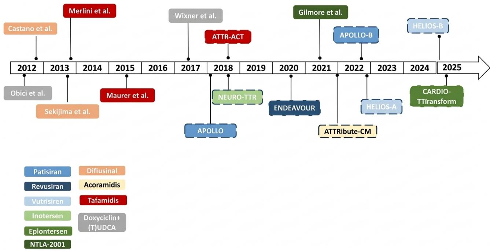
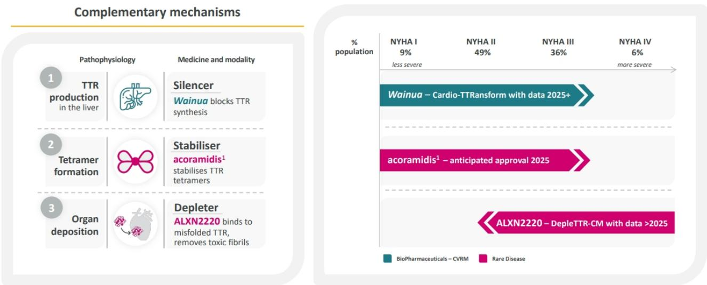

# AstraZeneca Is Poised to Lead the $20 Billion ATTR-CM Market, Not Alnylam

The conventional wisdom in biopharma holds that Alnylam's Amvuttra will dominate the emerging market for transthyretin amyloidosis with cardiomyopathy (ATTR-CM), capturing 55% of peak sales. Consensus forecasts place AstraZeneca at just 12%. This consensus is wrong. A detailed examination of the disease's heterogeneity, the competitive dynamics of drug mechanisms, and the strategic advantages AstraZeneca has built through its Alexion rare disease platform suggests the opposite outcome: AstraZeneca is positioned to become the market leader in what is shaping up to be a $20 billion peak revenue opportunity.

The stakes could not be higher for patients or observers. ATTR-CM is a disease where misfolded transthyretin proteins accumulate in heart tissue, causing progressive heart failure. The five-year survival rate from diagnosis is below 40%—worse than many severe cancers. Yet current US diagnosis rates stand at only 25%. This combination of devastating prognosis and massive underdiagnosis creates a market that is both medically urgent and commercially underappreciated.

Why now? In the second half of 2026, AstraZeneca will publish the landmark phase 3 CardioTTRansform trial data for Wainua, its gene-silencing therapy. This is the moment when the competitive landscape shifts. The trial is the largest phase 3 study ever conducted in ATTR-CM, uses the most rigorous endpoint (a four-point MACE composite versus the three-point MACE used by competitors), and has a four-year data lead over Alnylam's next-generation program. Strong results would not only secure best-in-class status for Wainua but would also validate AstraZeneca's broader portfolio strategy across all three validated drug mechanisms in ATTR.

## AstraZeneca's Unmatched Portfolio Across Three Mechanisms Creates a Structural Advantage That Competitors Cannot Replicate

The critical insight that consensus underweights is that ATTR-CM is a highly heterogeneous disease. Patients present with different genetic variants, different rates of amyloid accumulation, and different degrees of cardiac involvement. No single mechanism of action will treat all patients optimally. AstraZeneca is the only company that owns drugs across all three proven mechanisms: stabilizers, silencers, and depleters.

Stabilizers like Pfizer's Vyndaqel and BridgeBio's Attruby (which AstraZeneca commercializes in Japan) work by binding to the TTR protein and preventing it from misfolding. They represent the first generation of disease-modifying therapy. Silencers like Amvuttra and Wainua go upstream, reducing production of the TTR protein itself. Wainua binds to messenger RNA to block translation, while Amvuttra degrades the mRNA entirely—different mechanisms within the same class. Depleters represent the third and most advanced approach. AstraZeneca's cliramitug is a first-in-class depleter that actually removes existing amyloid plaques from heart tissue, rather than just preventing new accumulation.

Key opinion leaders have emphasized to Bernstein that combination therapy will deliver the best outcomes. The logic is straightforward: a patient might be induced with a depleter to clear existing plaques, then maintained on a silencer to prevent new formation. AstraZeneca is already planning studies of Wainua maintenance following cliramitug induction. This portfolio breadth means AstraZeneca can offer physicians a complete treatment algorithm, not just a single drug. No competitor—not Alnylam, not Pfizer, not BridgeBio—can match this.

## The Rare Disease Commercial Infrastructure Is a Sustainable Competitive Advantage That Transforms Launch Trajectories

AstraZeneca's acquisition of Alexion in 2021 was widely viewed as an expensive bet on rare disease. In ATTR-CM, that bet is now paying off in ways that consensus has not fully incorporated. Rare disease drug launches are fundamentally different from primary care launches. They require deep relationships with a small number of specialist physicians, sophisticated patient identification and diagnostic support infrastructure, and the ability to navigate complex reimbursement pathways for high-cost therapies.

AstraZeneca's Alexion platform has already demonstrated this capability across multiple rare disease launches. The company knows how to build diagnostic awareness, how to engage key opinion leaders, and how to support patients through treatment initiation. In ATTR-CM, where 75% of patients remain undiagnosed, this infrastructure is not a nice-to-have—it is the primary driver of market expansion.

Consider the precedent. When new rare disease therapies launch, the market typically expands beyond initial projections as diagnosis rates improve. Alnylam's Amvuttra launch has been strong, but it has been a single-drug story. AstraZeneca is approaching ATTR-CM as a franchise, with multiple drugs at different stages of development and commercialization. The company can invest in diagnostic awareness and physician education knowing that it will capture value across its entire portfolio, not just from one product. This creates an economic incentive to expand the market that Alnylam, with a narrower pipeline, cannot match.

## The CardioTTRansform Trial Will Produce the Most Competitive Dataset in the Field, Driving Market Share Reallocation

The design of AstraZeneca's phase 3 trial is the most aggressive and most informative in the ATTR-CM space. CardioTTRansform uses a four-point MACE composite endpoint—cardiovascular death, heart failure hospitalization, heart transplant, and cardiovascular urgent visit—versus the three-point endpoint used by Alnylam's TRITON trial for nucesiran. This may seem like a technical detail, but it has profound implications.

A four-point MACE composite is a higher bar. It captures more clinical events and provides a more complete picture of a drug's benefit. If Wainua succeeds on this endpoint, the data will be more compelling to regulators, payers, and physicians. The trial also includes a pre-specified subgroup analysis of patients previously treated with Vyndamax, the stabilizer. If this subgroup shows benefit—and there is mechanistic reason to believe it will—it would provide a clear pathway for combination therapy and expand Wainua's addressable patient population.

The timing advantage is equally important. CardioTTRansform has a four-year lead over TRITON. In a market where diagnosis rates are low and treatment paradigms are still being established, being first with the best data creates a durable advantage. Physicians will develop experience with Wainua, treatment protocols will be written around it, and payers will establish coverage policies based on its data. Alnylam's nucesiran, even if it offers superior convenience with twice-yearly dosing, will face an uphill battle displacing an entrenched therapy with stronger data.

Bernstein's base case now forecasts Wainua peak sales of $6.2 billion, with a bull case of $8.5 billion if the Vyndamax pre-treated subgroup works. This compares to consensus of just $2 billion. The gap between Bernstein's analysis and consensus is a measure of how much the market is underestimating AstraZeneca's position.

## What the Report Does Not Yet Fully Answer: The Cannibalization Dynamics Within Alnylam's Pipeline and the Impact on Market Structure

The report raises but does not resolve a critical question about Alnylam's strategy. Alnylam is developing nucesiran as a next-generation silencer with twice-yearly dosing, an improvement over Amvuttra's quarterly injections. But nucesiran carries no royalty obligation to Sanofi, whereas Amvuttra carries a blended mid-20s royalty. This creates a clear financial incentive for Alnylam to drive nucesiran adoption at the expense of Amvuttra.

Consensus forecasts assume that nucesiran sales will be entirely supplemental to Amvuttra—that the next-generation drug will expand the market rather than cannibalize the existing franchise. This assumption is questionable. If Alnylam aggressively markets nucesiran to Amvuttra patients, the net effect on Alnylam's total ATTR revenue could be neutral or even negative, depending on pricing and royalty dynamics. The market structure could shift in ways that benefit AstraZeneca, which has no such internal cannibalization pressure.

The report also leaves open how quickly diagnosis rates can improve. AstraZeneca's estimate of 121,000 diagnosed patients versus over 900,000 prevalent suggests enormous headroom. But improving diagnosis requires investment in nuclear imaging capacity, physician education, and awareness campaigns. The pace of this expansion is uncertain and depends on factors beyond any single company's control. Observers should watch diagnostic rates as a leading indicator of market growth.

## A Decision Framework for Observers: Three Questions That Determine Which ATTR Thesis Will Play Out

For those evaluating the ATTR opportunity, three questions separate the consensus view from the Bernstein view.

First, will combination therapy become the standard of care? If physicians conclude that patients benefit from sequential or concurrent use of different mechanisms—depleter induction followed by silencer maintenance, for example—then AstraZeneca's portfolio advantage becomes decisive. If single-agent therapy remains dominant, Alnylam's lead with Amvuttra is more secure. The CardioTTRansform data on Vyndamax pre-treated patients will be the first major data point on this question.

Second, how quickly will diagnosis rates improve? The 25% diagnosis rate is both a problem and an opportunity. Every percentage point increase represents roughly 9,000 newly identified patients. If AstraZeneca's Alexion infrastructure can accelerate diagnosis, the market expands faster than consensus expects, and AstraZeneca captures disproportionate share. If diagnosis remains stagnant, the market stays smaller and the competitive battle is more zero-sum.

Third, how will Alnylam manage the Amvuttra-to-nucesiran transition? If Alnylam aggressively cannibalizes its own franchise, it creates an opening for AstraZeneca to capture share with Wainua. If Alnylam manages the transition carefully, preserving Amvuttra revenue while gradually building nucesiran, the competitive dynamics are more balanced. The royalty differential between the two drugs is a structural pressure that will shape Alnylam's behavior.

These three questions form a framework for tracking the ATTR thesis over the next 12 to 24 months. Each data point—from trial results to prescription trends to diagnostic rate updates—can be mapped against these questions to update conviction.

## The Full Report Contains the Detailed Modeling and Proprietary Channel Checks That Support This Thesis

The analysis summarized here is based on a comprehensive primer that includes bottom-up patient-based modeling, top-down US prescription data validation, and proprietary channel checks with key opinion leaders. The full report contains the detailed revenue forecasts, market share projections, and sensitivity analyses that underpin the argument that AstraZeneca should lead in ATTR-CM.

It also includes the ticker table with consensus, and the detailed mechanism-by-mechanism analysis of the competitive landscape. The original charts—showing the shift in Bernstein's market share estimates, the comparison of Wainua and cliramitug forecasts to consensus, and the cannibalization dynamics within Alnylam's pipeline—provide the visual evidence for the thesis.

*For informational purposes only. Portions may be generated, translated, summarized, or edited with AI assistance based on source materials and may contain omissions or errors. Please verify independently. This is not professional advice.*

For informational purposes only. Portions may be generated, translated, summarized, or edited with AI assistance based on source materials and may contain omissions or errors. Please verify independently. This is not professional advice.

