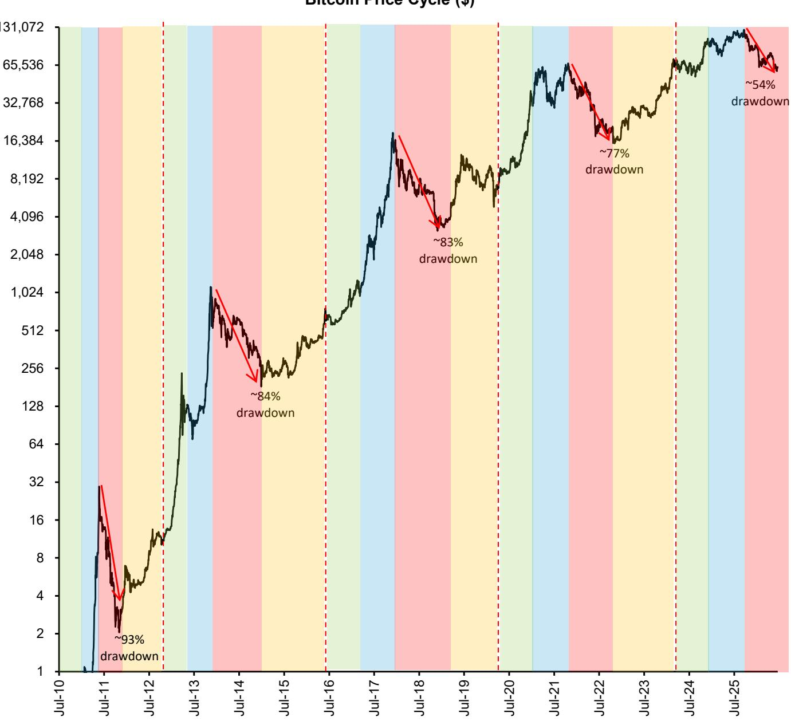
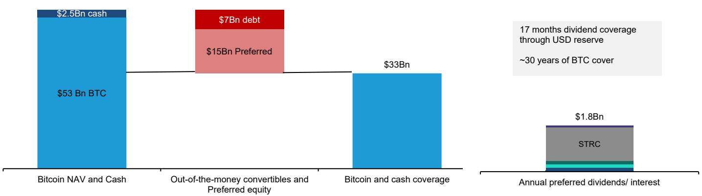
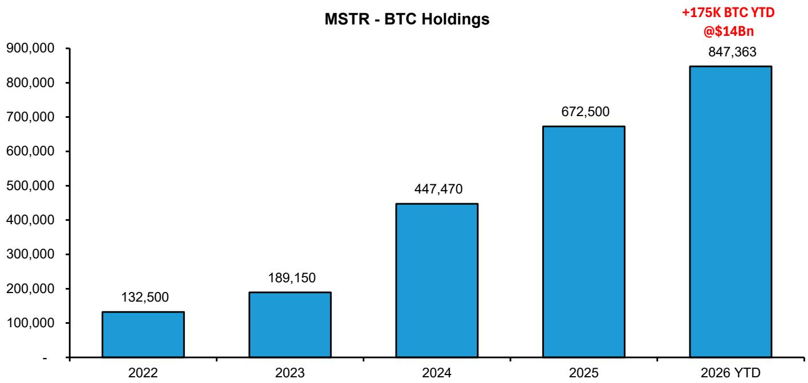
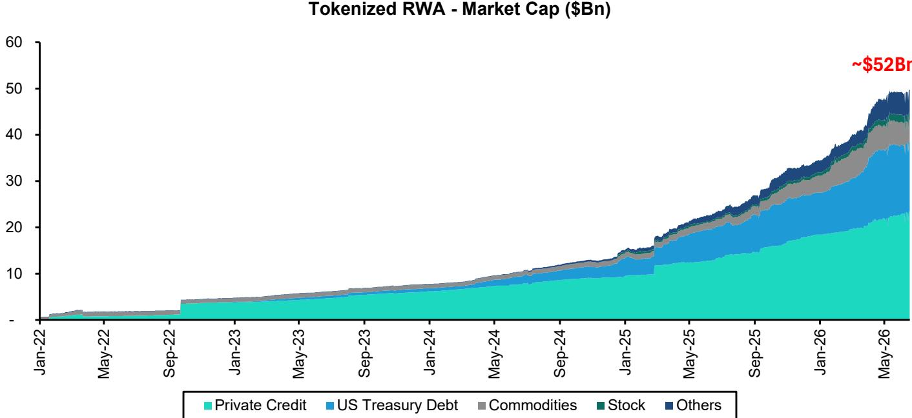
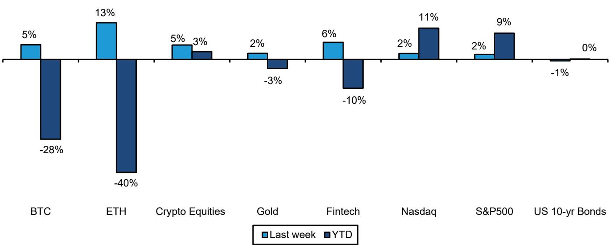
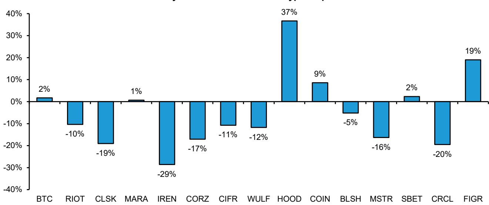
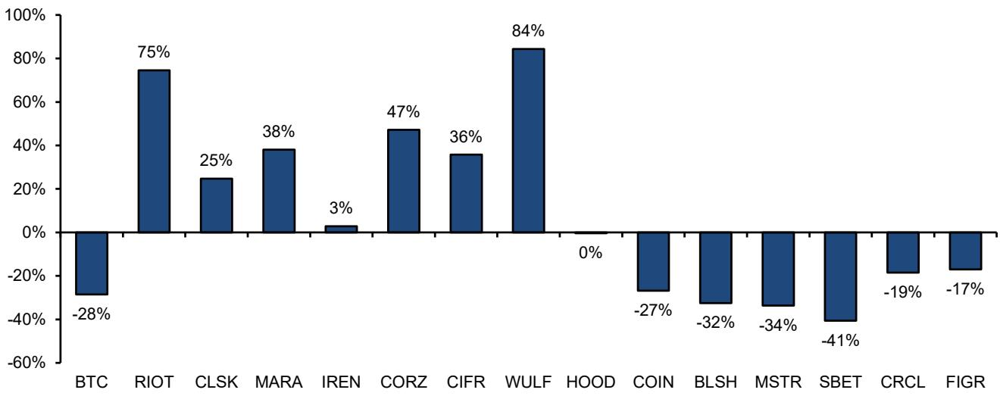
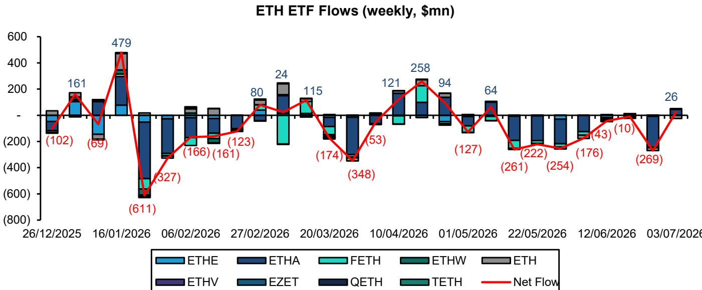

## Global Digital Assets

Gautam Chhugani +91 226 842 1416 gautam.chhugani@bernsteinsg.com

Mahika Sapra +91 226 842 1408 mahika.sapra@bernsteinsg.com

Sanskar Chindalia +91 226 842 1445 sanskar.chindalia@bernsteinsg.com

Harsh Misra +91 226 842 1457 harsh.misra@bernsteinsg.com

## The Digital Assets Memo: Bitcoin any signs of life? (122/n)

Bitcoin retested its recent lows around ~$60K and is now experiencing a mild bounce to ~$63K. We walk through the market factors driving its price and look for any signs of life for a new Bitcoin price cycle to emerge.

The crypto bear market (from the cycle top around Nov 2025) has lasted three quarters (historical drawdowns have lasted 12-15 months). The Bitcoin drawdown has been close to ~54% from the ~$125K cycle top. Although, it is unclear if we are completely out of the woods, but this crypto bear market has been milder than the previous drawdown (~75-90% BTC drawdown past cycles - see Exhibit 1).

Bitcoin inflows from leading treasury companies and ETFs stands at $10Bn in 2026 vs. $60Bn in 2025. Further breakdown suggests that Bitcoin ETFs have seen $5.5Bn outflows this year out of the $74Bn total AUM, implying inflows have been driven by treasury companies - particularly Strategy (MSTR). Although $5.5Bn ETF outflows over an AUM base of $74bn combined with a ~50% BTC correction feels like the sentiment has been far worse than the reality of flows this year. And in a market where liquidity was concentrated in AI equities, a net positive inflow year for Bitcoin doesn't seem as bad.

Strategy (MSTR) has gone through its own fear cycle. STRC, the primary preferred perpetual offering by Strategy has witnessed volatility - STRC current market price stands at $87.87 (vs. face value of $100). However, Strategy has been able to maintain its balance sheet liquidity to more than cover the cash dividends and interest cost (over 17 months cash cover - Exhibit 2). Strategy's debt liabilities are mere 13% of its Bitcoin collateral value with the next principal due (approx. $1Bn) by Q3'2028. The ~$15Bn preferred principal is perpetual long term balance sheet capital. Strategy as part of capital policy has suggested it could sell upto $1.25Bn Bitcoin to fund dividend and interest expense, replenish USD reserves and support buyback plans for MSTR Common shares and preferred instruments. Strategy continues to maintain USD reserve coverage of ~17 months for dividend and interest expenses, with any reduction below 12 months requiring board authorization. Thus, it looks unlikely any major Bitcoin forced supply could come from Strategy and it continues to be a net buyer in the market.

Strategy's Bitcoin buying has been a balancing force in the market where leading U.S Bitcoin miners have been net sellers as they accelerate their pivot to AI data centers. Overall, we expect, leading U.S listed Bitcoin miners to completely move away from Bitcoin mining, with their share of hash rate being absorbed by international miners mostly in emerging markets (including Southeast Asia, Central Asia, and Latin America). Overall, Bitcoin hash rate has declined marginally (average hash rate YTD 11% down), implying lost U.S share is absorbed by non-US BTC miners so far. For example, U.S Bitcoin miners' share of total Bitcoin network hashrate has declined over 40 bps over the last two quarters, while miners located in emerging markets have gained ~100bps share over the same period.

Further, regulatory progress on overall crypto markets in the U.S has been strong - GENIUS Act rule making on stablecoins continues, Crypto perpetual futures are now being rolled out in the U.S (Kalshi and Coinbase) and there is still hope CLARITY Act will pass in 2026 (still 50:50 odds on Polymarket). We expect continued regulatory progress to drive more market liquidity and institutional adoption for both crypto-native assets and blockchain version of real-world assets (debt, equities, money market etc). Overall, real-world assets tokenization value continues to climb new highs (~$52 Bn tokenised - Exhibit 4 ).

Bottomline, any crypto correction is painful, but this one has been rather comforting. Crypto feels like its growing up. We remain optimistic on Bitcoin long term. We reckon, our 2026 year-end $150K BTC price target appears ambitious in context of the market correction. However, we expect Bitcoin cycle will eventually turn (see Exhibit 1 - on past cycles) and we continue to watch the BTC flows to see any signs of life.

EXHIBIT 1: Bitcoin's 4-year price cycles  
  
Source: Bloomberg, Bernstein analysis

EXHIBIT 2: Strategy - Bitcoin holdings at current price provide significant coverage of annual interest and dividends
MSTR - Interest and dividend coverage ($Bn)  
  
Source: Company filings, Bernstein analysis

EXHIBIT 3: MSTR has acquired ~175K BTC for ~$14Bn in CY26 YTD  
  
Source: Company filings, Bernstein analysis

EXHIBIT 4: Tokenized RWA - Market Cap ($Bn)  
  
Private credit also includes Figure tokenized credit Source: RWA.xyz, Bernstein analysis

## GLOBAL DIGITAL ASSETS - NEWSFLOW ON STOCKS COVERED

BLSH: Bullish received GFSC (Gibraltar Financial Services Commission) approval to offer trading in tokenized securities. The approval positions Bullish among the first regulated venues for issuer-sponsored tokenized securities and will serve eligible non-U.S. investors. Trading is expected to go live in the coming weeks, pending final requirements.

MSTR: Strategy announced a Digital Credit Capital Framework to improve liquidity. It includes (i) maintaining minimum USD reserve equal to atleast 12 months of dividend and interest expense; (ii) $1Bn buyback program for preferred stock (prioritizing STRC) and $1Bn buyback program for MSTR common shares; and (iii) upto $1.25Bn BTC monetization program.

SBET: Sharplink raised $75Mn through a registered direct offering and used capital to continue its ETH treasury strategy. The company acquired 10,000 ETH, increasing total ETH holdings to 886,725. Since the launch of share buyback program in Aug'25, SBET has repurchased ~4Mn shares.

PRICE PERFORMANCE - CRYPTO & CONVENTIONAL ASSETS
EXHIBIT 5: Price performance - BTC, ETH, crypto equities and traditional assets  
BTC & ETH - Performance relative to other assets  
  
We have used the BlueStar Fintech Index and the Bloomberg US Treasury Index for Fintech/US 10-yr Bond returns Source: Bloomberg, Bernstein analysis

## EXHIBIT 6: Bernstein crypto equities coverage

30-day Returns - Bitcoin vs. Crypto Equities  

2026 YTD Returns - Bitcoin vs. Crypto Equities  
  
As of 5 July 2026

Source: Bloomberg, Bernstein analysis

## CRYPTO SPOT ETFS

EXHIBIT 7: Bitcoin spot ETF - Weekly flows  
  
As of 4 July 2026

Source: Bloomberg, Bernstein analysis

EXHIBIT 8: Spot Bitcoin ETFs - Flows and Volumes

<table><tr><td>Ticker</td><td>Issuer</td><td>Flows 2026-YTD ($mn)</td><td>Total Flows ($mn)</td><td>Total Volumes ($mn)</td><td>Premium (%)</td><td>Assets ($mn)</td><td>BTC held (K)</td></tr><tr><td>GBTC</td><td>Grayscale</td><td>(1,916)</td><td>(25,284)</td><td>198,495</td><td>0.01%</td><td>8,441</td><td>137</td></tr><tr><td>IBIT</td><td>BlackRock</td><td>(2,099)</td><td>59,994</td><td>1,363,139</td><td>0.05%</td><td>44,907</td><td>730</td></tr><tr><td>FBTC</td><td>Fidelity</td><td>(1,871)</td><td>10,376</td><td>244,978</td><td>-0.03%</td><td>10,839</td><td>173</td></tr><tr><td>ARKB</td><td>21Shares and ARK</td><td>(373)</td><td>1,249</td><td>72,112</td><td>-0.19%</td><td>2,031</td><td>33</td></tr><tr><td>BITB</td><td>Bitwise</td><td>(145)</td><td>1,976</td><td>59,982</td><td>-0.15%</td><td>2,228</td><td>36</td></tr><tr><td>EZBC</td><td>Franklin</td><td>2</td><td>330</td><td>6,821</td><td>-0.11%</td><td>352</td><td>6</td></tr><tr><td>BTCO</td><td>Invesco and Galaxy</td><td>(40)</td><td>165</td><td>10,904</td><td>0.07%</td><td>334</td><td>5</td></tr><tr><td>HODL</td><td>VanEck</td><td>41</td><td>1,125</td><td>19,751</td><td>-0.18%</td><td>1,006</td><td>16</td></tr><tr><td>BRRR</td><td>Valkyrie</td><td>14</td><td>262</td><td>4,987</td><td>-0.11%</td><td>363</td><td>6</td></tr><tr><td>BTCW</td><td>Wisdomtree</td><td>52</td><td>97</td><td>5,950</td><td>-0.20%</td><td>142</td><td>2</td></tr><tr><td>DEFI</td><td>Hashdex</td><td>6</td><td>0</td><td>121</td><td>0.07%</td><td>14</td><td>0</td></tr><tr><td>BTC</td><td>Grayscale Mini</td><td>462</td><td>2,385</td><td>37,778</td><td>0.07%</td><td>3,371</td><td>55</td></tr><tr><td>MSBT</td><td>MS</td><td>395</td><td>395</td><td>832</td><td>-0.14%</td><td>342</td><td>6</td></tr><tr><td colspan="2">Total</td><td>(5,472)</td><td>53,070</td><td>2,025,850</td><td></td><td>74,368</td><td>1,206</td></tr></table>

As of 4 July 2026  
Source: Bloomberg, Bitbo, Bernstein analysis

EXHIBIT 9: Ethereum spot ETF - Weekly flows  
  
As of 4 July 2026  
Source: Bloomberg, Bernstein analysis

EXHIBIT 10: Spot Ethereum ETFs - Flows and Volumes

<table><tr><td>Ticker</td><td>Issuer</td><td>Flows 2026-YTD ($mn)</td><td>Total Flows ($mn)</td><td>Total Volumes ($mn)</td><td>Premium (%)</td><td>Assets ($mn)</td></tr><tr><td>ETHE</td><td>Grayscale</td><td>(283)</td><td>(5,332)</td><td>60,624</td><td>0.10%</td><td>1,313</td></tr><tr><td>ETHA</td><td>BlackRock</td><td>(1,443)</td><td>11,125</td><td>298,640</td><td>0.32%</td><td>4,646</td></tr><tr><td>FETH</td><td>Fidelity</td><td>(534)</td><td>2,100</td><td>37,681</td><td>0.06%</td><td>808</td></tr><tr><td>ETHW</td><td>Bitwise</td><td>(10)</td><td>385</td><td>9,372</td><td>0.15%</td><td>181</td></tr><tr><td>ETH</td><td>Grayscale - Mini</td><td>322</td><td>1,809</td><td>56,107</td><td>0.07%</td><td>1,432</td></tr><tr><td>ETHV</td><td>Vaneck</td><td>(8)</td><td>165</td><td>3,881</td><td>-0.04%</td><td>84</td></tr><tr><td>EZET</td><td>Franklin</td><td>3</td><td>66</td><td>1,422</td><td>0.12%</td><td>35</td></tr><tr><td>QETH</td><td>Invesco Galaxy</td><td>2</td><td>25</td><td>998</td><td>-0.01%</td><td>17</td></tr><tr><td>TETH</td><td>21 Shares</td><td>(6)</td><td>17</td><td>5,247</td><td>0.07%</td><td>14</td></tr><tr><td colspan="2">Total</td><td>(1,958)</td><td>10,359</td><td>473,971</td><td></td><td>8,531</td></tr></table>

As of 4 July 2026

Source: Bloomberg, Bernstein analysis

EXHIBIT 11: Bitcoin Treasury Holdings and Capital Flows

<table><tr><td>Top Listed BTC Treasury Holders</td><td>BTC Holdings (in BTC)</td><td>BTC Holding Value ($Mn)</td><td>Capital Inflow 2025-26 YTD ($Mn)</td></tr><tr><td>MSTR</td><td>847,363</td><td>53,117</td><td>36,130</td></tr><tr><td>Twenty One Capital</td><td>43,514</td><td>2,728</td><td>3,800</td></tr><tr><td>MetaPlanet</td><td>43,000</td><td>2,695</td><td>4,270</td></tr><tr><td>Strive</td><td>19,864</td><td>1,245</td><td>1,890</td></tr><tr><td>Tesla</td><td>11,509</td><td>721</td><td>-</td></tr><tr><td>Trump Media &amp; Technology Group</td><td>9,542</td><td>598</td><td>1,130</td></tr><tr><td>GD Culture</td><td>7,500</td><td>470</td><td>840</td></tr><tr><td>Next Technology Holding*</td><td>5,833</td><td>366</td><td>160</td></tr><tr><td>Nakamoto</td><td>4,467</td><td>280</td><td>530</td></tr><tr><td>Boyaa Interactive</td><td>4,091</td><td>256</td><td>90</td></tr><tr><td colspan="3"></td><td>48,840</td></tr><tr><td colspan="3">Crypto Companies</td><td></td></tr><tr><td>MARA</td><td>35,303</td><td>2,213</td><td></td></tr><tr><td>Bullish</td><td>22,013</td><td>1,380</td><td></td></tr><tr><td>COIN</td><td>16,492</td><td>1,034</td><td></td></tr><tr><td>RIOT</td><td>15,680</td><td>983</td><td></td></tr><tr><td>CLSK</td><td>13,470</td><td>844</td><td></td></tr><tr><td>HUT</td><td>10,278</td><td>644</td><td></td></tr><tr><td>Block</td><td>9,032</td><td>566</td><td></td></tr><tr><td>Other Listed Corporate Holders</td><td>110,700</td><td>6,939</td><td></td></tr><tr><td>Total</td><td>1,230,000</td><td>77,081</td><td></td></tr><tr><td>% of BTC Supply Held by Listed Corporates</td><td>5.9%</td><td></td><td></td></tr></table>

\* Assuming ~$87K/BTC for XXI's Bitcoin acquisition cost  
Source: Company filings, BitBo, Bitcoin Treasuries, Bernstein analysis

## FLAGSHIP REPORTS

Emerging AI Infra - Initiating coverage (TeraWulf, Cipher Digital): The Power Landlords of AI: We are initiating coverage on TeraWulf (WULF) and Cipher Digital (CIFR) with an Outperform rating. WULF and CIFR stand out for their active multi-GW power development pipeline, strong order book (~$24Bn) with hyperscaler sponsorship and a capital-light lease model leading to a rapid AI-revenue ramp up. Over the last 2 years, Bitcoin miners have contracted out 6 GW of power capacity to hyperscalers and neocloud operators across 17 deals worth over $110Bn - contributing ~10% of AI data centers under construction.

The Rising Titans of the Blockchain Era: As we publish a new crypto Blackbook, the US is building a regulatory framework to become the crypto capital of the world. The GENIUS Act has unleashed a stablecoin boom. The SEC's Project Crypto is the most ambitious vision to bring capital markets on-chain. Welcome to the blockchain utility era, not speculative boom-bust. Circle is spearheading a stablecoin financial network. Figure is tokenizing the credit markets. Coinbase and Robinhood are building the "Everything Exchange," powered by tokenization

CIRCLE: Initiating coverage - The Internet Dollar network for the next decade: We initiate on Circle (CRCL) with an Outperform rating (PT $230). CRCL is building a market-leading digital dollar stablecoin network, with a strong regulatory edge, liquidity headstart and marquee distribution partnerships. This is hard to replicate, in our view. We view CRCL as an investor must-hold, to participate in the new internet-scale financial system built for the next decade. Over the long term, we expect stablecoins to evolve from money-rail of crypto markets to money-rail of the internet, with total industry stablecoin supply reaching~$4Tn over the next decade vs. ~$225Bn today.

Coinbase: Crypto Universal Bank (moving PT to $510) - A deep-dive primer on the most misunderstood crypto business: Coinbase is the most misunderstood company in our Crypto coverage universe. It is the only Crypto company in the S&P500, dominates U.S. Crypto trading market, runs the largest stablecoin business amongst exchanges (~15% of total revenues and is now integrating with platforms such as Shopify), dominates institutional Crypto (powers custody for 8 out of 11 Bitcoin ETF asset managers), acquired the largest global crypto options exchange (Deribit) and runs the largest and fastest chain (Base) on Ethereum forming the tokenization network (on which JPM launched JPMD coin). We present a deep-dive primer on Coinbase. We also update the model and move up our target price (PT $510, Outperform).

Coinbase: Initiating Coverage - The great American homecoming (PT $310): Coinbase (COIN) is the largest U.S crypto exchange & crypto financial ecosystem, with over $400Bn in assets and ~10mn active users. With the Trump Administration's aspiration to make America the ‘crypto capital of the world’, Coinbase remains the dominant platform (66% U.S. market share) to ride the tailwinds. COIN bears worry about rising competition and fee pressure, but they overlook the massive TAM expansion from re-shoring of global crypto markets back to the U.S. We expect COIN’s EPS (ex-FV gain on crypto) to grow at a CAGR of ~38% - we are 30%/61% ahead vs. consensus on 2025/2026E EPS.

Robinhood (HOOD): Initiating at Outperform...Riding on the crypto comeback arc: We are initiating coverage on Robinhood (HOOD) with an Outperform rating (PT $30). The buy-side and sell-side alike, refuse to see what we see - a monster of a crypto cycle over 2024-25. We expect crypto market cap to reach $7.5Tn vs. $2.6tn today. This leads to HOOD growing its crypto revenues by 9-fold (5x vs consensus), leading to us being 54% ahead on HOOD's 2025 consensus revenues and 3.5 times 2025 consensus earnings.

From Coin to Compute: The Bitcoin Investing Guide: Navigating equity ideas across Bitcoin miners & chips, AI data centers, Bitcoin treasuries, and investment platforms Ten global asset managers now own ~$60Bn of Bitcoin wrapped as regulated ETFs compared with $12Bn in September 2022. By 2024 end, we expect Wall Street to replace Satoshi as the top Bitcoin wallet. This new institutional era, in our view, could push Bitcoin to a high of $200,000 by 2025 end. This Blackbook deep dives into the multiple investment avenues emerging in the Bitcoin ecosystem aided by its meteoric rise.

Bitcoin Miners - Initiating coverage: The AI Data Center 'Power' play (CORZ, IREN): We extend our Bitcoin equities coverage to two additional Bitcoin miners with a hybrid Bitcoin/AI data center strategy. We initiate on IREN ($26) and CORZ ($17) with an Outperform. Bitcoin miners are emerging as attractive partners to build out AI Data Centers (DC) with 'ready power interconnect' (~6GW 2024YE) and Data center operating capabilities. Recent deals have become key catalysts - $4.7Bn co-hosting deal between Corweave and CORZ, IREN's GPU buildout for Poolside.AI, HUT-Coatue AI infra partnership etc.

The Institutional Guide to Blockchain and Digital Assets: In this Blackbook, we deep dive into the institutional interest in digital assets and the fundamentals of leading digital assets such as Bitcoin and Ethereum and their scalability. We also address the elephant in the room — regulatory challenges. The current intense political debate and litigation in the US reflects the "Napster to Spotify/iTunes" moment, with regulatory clarity leading to the formalization of crypto as a regulated asset, unlocking capital and integration with mainstream financial markets.

A Primer on Bitcoin and Bitcoin mining: Path to a $150,000 Bitcoin by 2025: We present our most comprehensive primer on Bitcoin and Bitcoin mining. If you are new to Bitcoin, and are intrigued by the recent mega Bitcoin ETF launches by global asset managers, you should start here. Our call on Bitcoin emerging as a $3Tn asset (quadrupling from here) is a 18 month view. Short term volatility is expected along the way and recent price action post BTC ETF has not impacted our conviction and price estimates. We expect the dynamic of Bitcoin halving by April 2024, combined with sustained ETF inflows to break us out into a new BTC bull cycle.

Bitcoin to $200K in 10 charts - Moving up our conviction and 'Buy the Dip': We remain convinced in our Bitcoin new cycle thesis and move up our Bitcoin price forecast to $200K (from $150K earlier) to reflect the positive surprise from Bitcoin ETF flows since launch. Bitcoin and Crypto related stocks are underrated and ripe for institutional inflection, in our view, as most of street's pessimism appears driven by rear view, regulatory hurdles from the past.

MicroStrategy: Initiating coverage - Building the world's largest Bitcoin company (PT $2,890, 80% upside): We are initiating coverage on MicroStrategy (MSTR) with an Outperform rating (PT $2,890). Since August 2020, MSTR has transformed from a small software company to the largest Bitcoin holding company, owning 1.1% of world's Bitcoin supply worth ~$14.5Bn. MSTR's founder chairman, Michael Saylor has become synonymous with brand Bitcoin and has positioned MSTR as a leading Bitcoin company, attracting at-scale capital (both debt and equity) for an active Bitcoin acquisition strategy.

## RECENT REPORTS

Data Centers & Neoclouds: Comparing margins and unit economics: Today, we're building on our collaborative "How much is a Megawatt Worth" to unpack margins and unit economics. The traditional data center REITs (EQIX, DLR, CoreSite), neoclouds (CRWV, NBIS, IREN), and Emerging AI Infra providers (CIFR, WULF, CORZ, RIOT) are situated at different locations in the ecosystem, but trying to solve a similar problem: enabling compute for AI (and non-AI) workloads. In this note, we walk through five major comparisons across this company set: operating margin, revenue yield, financing, capex, and risk profiles.

Circle: Open USD launch by a consortium of 140 partners - Our thoughts: A new consortium, Open Standard, today unveiled Open USD (OUSD), a dollar-backed stablecoin for global payments and settlement. More than 140 companies have joined, including Visa, Stripe, Mastercard, BlackRock, BNY, Coinbase, Cloudfare, Ripple, Google, and Shopify, with OUSD expected to go live later this year. CRCL stock closed 17.5% down. We address investor concerns on Circle post the announcement

Data Centers & Neoclouds: How much is a megawatt worth? Almost every time a splashy GPU cloud or colocation contract hits, we get questions on whether that is a “good deal”. Today, we look at the $/MW of the public data center and neocloud companies, in addition to benchmarking the publicly announced deals with other private providers. We continue to prefer the colo model to the neocloud model, but can appreciate that some neocloud contracts are quite attractive, particularly when the neocloud owns its own real estate.

Robinhood's Rothera predictions exchange - Frequently asked investor questions: Robinhood has commenced its Rothera prediction markets exchange in partnership with Susquehanna International Group (SIG). The vertical integration of DCM (Designated Contract Market) and FCM (Futures Commission Merchant) between Rothera and Robinhood makes this a disruptive new entrant in the booming prediction markets business. Robinhood's unmatched distribution with ~13.5mn active traders provides it a strong edge in building a scalable predictions business with stronger unit economics. We answer key investor questions on Rothera.

Prediction Markets: Limitless CEO CJ Hetherington, takeaways & transcript from our call: Today, we hosted a call with CJ Hetherington, co-founder and CEO of Limitless Labs, the Base-native prediction market platform he co-founded in 2023 and which now clears close to $2bn in monthly volume. Hetherington walked us through the competitive structure of the category and why he does not expect a winner-take-all outcome, the shifting role of broker-dealers and the institutional risk-transfer opportunity, the US regulatory path and where he sees the real risk, the convergence of perpetual futures and prediction markets, and Limitless's own positioning, unit economics.

Prediction Markets & Sports Betting: World Cup Preview - A potential watershed moment: The 2026 World Cup kicks off in North America today, and for once the biggest event in sport lands squarely in UCAN betting's quietest month. The expanded 48-team format pushes 104 matches, a ~60% jump in bettable inventory, into June and July, the softest seasonal window for OSB handle. We see the tournament as the single largest handle & volume catalyst for the OSB & Prediction Markets sector, worth $3B+ of incremental handle and a ~$5-10B uplift to consumer volumes.

Emerging AI Infra - Initiating coverage (TeraWulf, Cipher Digital): The Power Landlords of AI: We are initiating coverage on TeraWulf (WULF) and Cipher Digital (CIFR) with an Outperform rating. WULF and CIFR stand out for their active multi-GW power development pipeline, strong order book (~$24Bn) with hyperscaler sponsorship and a capital-light lease model leading to a rapid AI-revenue ramp up. Over the last 2 years, Bitcoin miners have contracted out 6 GW of power capacity to hyperscalers and neocloud operators across 17 deals worth over $110Bn - contributing ~10% of AI data centers under construction.

Model Update - Core Scientific, Riot Platforms, CleanSpark, MARA Holdings: We are updating our models for CORZ, RIOT, CLSK and MARA for recent financial and company updates. We are Outperform on CORZ (PT$32 vs $24 earlier), RIOT (PT$30 vs $25 earlier), CLSK (PT$24 - unchanged) and Market-Perform on MARA (PT$17 vs $23 earlier).

FIGR: Live loan data onchain - heading for a record Q2!: As the market gets more efficient in tracking live blockchain volume data, we believe FIGR's stock price should become a real-time reflection of blockchain loan volumes. This is unique to blockchain marketplaces and something investors won't see with balance sheet based fintech lending platforms. FIGR's live blockchain data suggests an all-time high record Q2 upcoming. April loan volumes were reported at $1.34Bn. On-chain May MTD volumes indicate $717Mn and current run-rate would top April volumes. FIGR guided for a $3.8Bn to $4.1Bn for Q2, which now appears conservative even at the upper range of the guidance - half quarter volumes at ~$2.1Bn.

Circle Q1: Strong payments push, ARC sale adds cushion: CRCL reported Q1 numbers. Q1 revenue missed estimates by ~4%, while adj. EBITDA beat by ~10%. However, we believe the stock had a violent move up (up ~15%) driven by the $222Mn ARC token sale to leading investors (BlackRock, a16z, Apollo, etc.) which is incremental revenue not in estimates. As we head towards potential rate cuts, any incremental fee income helps CRCL offset the short term impact, while raw USDC supply growth offsets any rate impact in the medium to long term.

FIGR Q1: Zero crypto beta, full tokenization upside - Quick take: FIGR delivered strong numbers for Q1'2026. Headline loan volumes at $2.9bn were up 113% YoY. FIGR management guided for the next quarter loan volumes at $3.8Bn-4.1Bn (+35% QoQ), not surprising considering April volumes at ~$1.34Bn. FIGR clocked Q1 adjusted net revenue at $167Mn (+6% vs. consensus, 92% YoY) with EBITDA at $82.7Mn (~50% margin). Investors were closely watching the take-rate, which was flat at 3.8% despite first-lien share rising up to 20% (from 19% last quarter). Small business loans have started strong clocking $60mn this quarter.

IREN: The NVIDIA blessing!: IREN announced a long term strategic partnership with NVIDIA to develop 5GW AI compute across IREN's power campuses. The deal included a $3.4Bn AI cloud deal for NVIDIA's internal workloads. Further, NVIDIA has the right to invest $2.1Bn equity at $70/share with vesting linked to IREN's installation of 600,000 GPUs over the next 5 years. IREN also recently announced a $625mn (at signing) acquisition of Mirantis, a software orchestration player improving its AI Cloud proposition beyond a bare metal offering. Further, IREN also highlighted its global ambitions with an acquisition of a 490MW site in Spain to expand its operations in EU and further plans to develop a campus in Australia (its home market).

COIN Q1: Weak quarter - wait for CLARITY & more catalysts: Coinbase declared 1Q2026 numbers. Revenue for the quarter stood at $1.4Bn, missing estimates by 5%. Adjusted EBITDA at $303Mn missed estimates by 26%. Weaker crypto markets through 1Q2026 weighed on both trading volumes and subscription revenues - total crypto market cap and industry trading volumes were both down 20% + QoQ. Green shoots are emerging with (1) Retail derivatives annualizing $200Mn+ revenue, (2) Institutional derivatives, driven by Deribit annualizing $250Mn+ revenue, and (3) Prediction markets reaching $100Mn+ in annualized revenue in March (New products account for ~10% of revenue). We expect a crypto recovery into rest of 2026, and expect the CLARITY Act to be a near-term catalyst.

Figure: Why second guess trillion dollar markets? Figure TAM deep-dive - April record volumes continue...: Figure is evolving from direct-to-consumer HELOC lender into a tokenized marketplace for credit markets — yet the market continues to price it as a niche fintech lender, dismissing the trillion dollar tokenization opportunity. Figure (FIGR) reported another month of record volumes - April loan volumes are up 12% MoM to $1.34Bn, second consecutive month of >$1Bn volumes (108% YoY). The record volumes indicate new loan products and partnerships have started reflecting in the loan volume numbers. Further, HELOC momentum is expected to improve after a seasonally weak Q1.

Circle: CLARITY impact on stablecoin rewards - Quick take: Circle closed up ~20% and Coinbase up ~6% following the release of bipartisan compromise text on the Digital Asset Market CLARITY Act. The compromise resolves what had been the final sticking point in the bill - the treatment of stablecoin yield - by prohibiting issuers from paying interest "economically or functionally equivalent" to a bank deposit on passive stablecoin balances, while explicitly preserving rewards tied to "bona fide activities or bona fide transactions" such as trading, payments, and usage-driven incentives.

HOOD Q1: Expected weak Q1 - still see the stock as already bottomed: Robinhood declared Q1 numbers. Q1 revenue missed estimates by 7%, with an 8% miss on EPS at $0.39 and 9% miss on adjusted EBITDA ($534Mn). The top-line weakness was driven by crypto weakness, weaker take-rates on both crypto and options, and softer securities lending. We still believe
