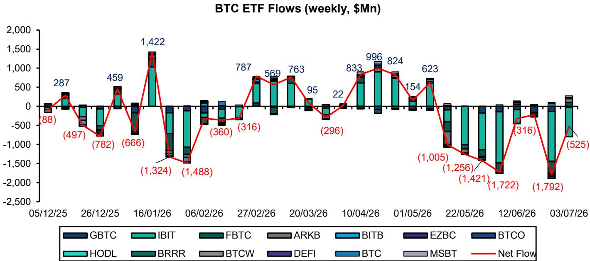
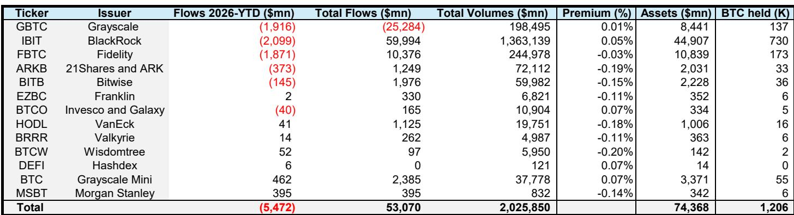

# Bitcoin’s Correction Is Painful, But the Cycle Structure Is More Resilient Than the Market Believes

The crypto market is in the midst of its third consecutive quarter of drawdown, and sentiment feels worse than the numbers justify. Bitcoin has retested the $60,000 level, down roughly 54% from its November 2025 cycle top near $125,000. For observers conditioned by previous crypto winters—where Bitcoin suffered 75% to 90% declines—this correction feels uncomfortable but historically mild. The question is not whether the cycle has broken, but whether the underlying structural supports have shifted in ways that make this downturn fundamentally different from its predecessors.

The answer, based on the flow data, balance sheet dynamics of key institutional holders, and the evolving regulatory landscape, is that this correction is more contained than the narrative suggests. The market is maturing, and the mechanisms that once amplified downside—forced selling from leveraged miners, cascading liquidations from overcollateralized DeFi positions, and panic-driven ETF redemptions—are operating with less force than in prior cycles. The bear market may not be over, but the architecture of this cycle is more resilient than many assume.

This article interprets the key signals from a recent institutional research report on digital assets, extends the logic into strategic implications, and identifies the unresolved questions that will determine whether the next leg of the cycle materializes.

## The Flow Data Reveals a Market That Is Bleeding Less Than Sentiment Suggests

The most striking finding from the recent data is the divergence between market psychology and actual capital flows. Total Bitcoin inflows from leading treasury companies and ETFs stand at $10 billion in 2026 year-to-date, compared to $60 billion in all of 2025. At first glance, this looks like a dramatic slowdown. But the composition matters more than the aggregate.

Bitcoin ETFs have experienced $5.5 billion in net outflows this year out of a total asset base of $74 billion. That is a 7.4% outflow rate against a backdrop of a 50% price decline. Historically, such outflows would have been far larger. The fact that ETF redemptions have been contained suggests that the marginal holder is less panicked than in prior cycles. The ETF holder base has shifted from speculative retail to longer-term allocators who treat Bitcoin as a portfolio diversifier rather than a momentum trade.

The critical insight is that the $10 billion net inflow figure is being driven almost entirely by corporate treasury buyers, led by Strategy (formerly MicroStrategy). Strategy alone has acquired approximately 175,000 Bitcoin for roughly $14 billion in 2026 year-to-date. This means that without Strategy's purchases, the market would have seen net selling from institutional channels. The corporate treasury bid has become the stabilizing force that ETFs were expected to be but have not yet become at scale.

This pattern matters because it changes the demand profile. ETF flows are sentiment-sensitive and can reverse quickly. Corporate treasury accumulation, by contrast, is driven by a strategic conviction that is less responsive to short-term price movements. Strategy's buying has been a counterweight to ETF outflows, and the question for observers is whether this dynamic can persist.

## Strategy’s Balance Sheet Is Not a Source of Forced Selling, and That Changes the Risk Calculus

One of the dominant concerns in the market has been that Strategy's leveraged Bitcoin position could trigger a cascade of forced liquidations. The data suggests this concern is misplaced. Strategy's debt liabilities amount to only 13% of its Bitcoin collateral value at current prices. The next principal payment of approximately $1 billion is not due until the third quarter of 2028. The roughly $15 billion in preferred equity is perpetual capital with no maturity.

Strategy has also formalized its capital policy in a way that provides transparency. The company has stated it could sell up to $1.25 billion in Bitcoin to fund dividend and interest expenses, replenish USD reserves, and support buyback programs for both common shares and preferred instruments. Importantly, Strategy maintains USD reserve coverage of approximately 17 months for dividend and interest expenses. Any reduction below 12 months requires board authorization. This creates a clear buffer and a governance mechanism that prevents ad hoc selling.

The preferred instrument STRC has experienced volatility, trading at $87.87 against a face value of $100. But this is a reflection of market sentiment toward the structure, not a signal of balance sheet distress. The preferred principal is perpetual and does not need to be refinanced. The volatility in the preferred market is a cost of capital issue, not a solvency issue.

For observers, the implication is clear: the single largest corporate holder of Bitcoin is not a source of forced supply. This removes one of the most commonly cited tail risks from the downside scenario. If Strategy were forced to sell, the market would face an additional 800,000-plus Bitcoin of overhang. That is not happening. The balance sheet is stressed but stable, and the company continues to be a net buyer.

## The Miner Landscape Is Shifting, and the Hash Rate Transition Has Been Orderly

The Bitcoin mining sector is undergoing a structural transformation that has significant implications for market dynamics. Leading U.S. listed Bitcoin miners have been net sellers of Bitcoin as they accelerate their pivot to AI data centers. Over the last two years, Bitcoin miners have contracted out 6 gigawatts of power capacity to hyperscalers and neocloud operators across 17 deals worth over $110 billion. This represents approximately 10% of all AI data centers currently under construction.

The report indicates that U.S. Bitcoin miners' share of total network hash rate has declined by over 40 basis points over the last two quarters. Meanwhile, miners located in emerging markets—including Southeast Asia, Central Asia, and Latin America—have gained approximately 100 basis points of share over the same period. The overall Bitcoin hash rate has declined only marginally, with average hash rate down 11% year-to-date. This suggests that the lost U.S. share is being absorbed by non-U.S. miners.

This transition is important for two reasons. First, it reduces the concentration of mining power in a single jurisdiction, which has geopolitical and regulatory implications. Second, it changes the selling behavior of the miner cohort. U.S. listed miners, which are subject to quarterly earnings pressure and capital market scrutiny, tend to sell more aggressively to fund operations and growth. International miners, particularly those in emerging markets with lower power costs and less access to capital markets, may have different incentives and holding periods.

The broader point is that the miner selling pressure that has historically marked the bottom of Bitcoin cycles may be less acute this time. The U.S. miners who are selling are doing so to fund a transition into AI infrastructure, not because they are underwater on their Bitcoin holdings. The international miners who are absorbing hash rate may be more willing to hold.

## Regulatory Progress Is Real and Creates a Floor for Institutional Engagement

The regulatory environment in the United States has improved in ways that are underappreciated by a market focused on price action. The GENIUS Act rulemaking on stablecoins continues to advance. Crypto perpetual futures are now being rolled out in the U.S. through platforms like Kalshi and Coinbase. The CLARITY Act remains a live legislative possibility, with Polymarket odds suggesting approximately 50:50 odds of passage in 2026.

The cumulative effect of these developments is that the regulatory overhang that suppressed institutional participation for years is being lifted. This is not a speculative hope; it is a measurable trend. The total value of tokenized real-world assets has climbed to new highs of approximately $52 billion. This includes tokenized debt, equities, money market funds, and other traditional financial instruments being brought on-chain.

The significance for Bitcoin is indirect but meaningful. As the regulatory framework becomes clearer, the entire digital asset ecosystem becomes more accessible to institutional capital. Bitcoin benefits as the largest and most liquid asset in this ecosystem. The stablecoin boom, in particular, creates a more functional on-chain dollar that facilitates trading, lending, and settlement across all crypto assets.

The report's framing is worth considering: the market is moving from a speculative boom-bust cycle to a blockchain utility era. This is not a narrative shift; it is a structural one driven by regulation, infrastructure, and institutional adoption. The bear market we are experiencing may be the last of its kind—the final correction before the asset class becomes sufficiently integrated into mainstream finance that the amplitude of cycles diminishes.

## What the Report Does Not Fully Answer: The Timing and Catalysts for the Next Cycle Leg

The report is clear that a new Bitcoin cycle will eventually emerge, but it is less definitive about the timing and the specific catalysts. The historical pattern of 12- to 15-month drawdowns suggests that the current correction, now in its ninth month, could extend for another quarter or two. But historical patterns are only guides, not guarantees.

The unresolved questions are strategic. First, will ETF flows turn positive again, and if so, what will drive that reversal? The report notes that ETF outflows have been concentrated in a few large funds, but it does not identify a clear catalyst for renewed inflows. The answer may depend on macroeconomic conditions—specifically, the trajectory of interest rates and the relative performance of AI equities, which have absorbed the majority of risk capital this year.

Second, will the corporate treasury bid broaden beyond Strategy? The report lists several other corporate holders, including Twenty One Capital, MetaPlanet, and Strive, but their combined holdings are a fraction of Strategy's. For the market to sustain a new uptrend, the buyer base needs to diversify. The report does not provide evidence that this diversification is happening at scale.

Third, what is the role of Ethereum in the next cycle? The report covers Bitcoin primarily, but the Ethereum ecosystem faces its own challenges, including ETF outflows and uncertainty about the network's role in the tokenization boom. If Ethereum continues to underperform, it may drag on overall crypto market sentiment and limit Bitcoin's ability to rally in isolation.

These are not criticisms of the report; they are the natural open questions that any serious analysis must leave for the reader to investigate further. The report provides a framework for thinking about the cycle, but the specific timing and magnitude of the next leg remain uncertain.

## A Decision Framework for Observers in the Current Environment

For institutional observers trying to navigate this environment, the report's data points can be synthesized into a decision framework with three dimensions.

The first dimension is flow analysis. Observers should monitor the weekly ETF flow data and the corporate treasury announcements. The key signal to watch is not the absolute level of inflows but the trend. If ETF outflows begin to decelerate and corporate buying continues at current levels, the net flow picture could turn positive within a quarter. The report's data shows that the market is closer to this inflection point than the price action suggests.

The second dimension is balance sheet health of major holders. Strategy's position is the most important to track, but observers should also monitor the miner cohort. The transition of U.S. miners to AI data centers is a positive development for their equity valuations, but it also means they will continue to sell Bitcoin to fund capital expenditures. The question is whether the international miners who are absorbing hash rate will sell or hold. This is a difficult variable to track in real time, but the hash rate data provides a lagging indicator.

The third dimension is regulatory momentum. The GENIUS Act and the CLARITY Act are the two most important pieces of legislation to watch. Passage of either would be a significant positive catalyst. The report's 50:50 odds on the CLARITY Act are a reasonable baseline, but observers should update their views as the legislative calendar progresses.

The framework suggests that the current environment is one of asymmetric risk. The downside is limited by strong balance sheets, contained miner selling, and a functioning regulatory process. The upside is a function of time and catalyst realization. The cycle structure supports the view that a new leg is more likely than a continued decline.

## Join the Community to Read the Full Report and Review the Original Charts

The analysis above draws on a detailed institutional research report that includes comprehensive exhibits on Bitcoin price cycles, Strategy's balance sheet coverage, ETF flow data, and tokenized asset growth. These charts provide the empirical foundation for the arguments presented here and are essential for any observer seeking to form their own view.

The full report also includes coverage of specific crypto equities, including Coinbase, Circle, Robinhood, and several Bitcoin miners. For observers looking to understand the equity implications of the digital asset cycle, the original material provides depth that this summary cannot capture.

Join the community to read the full report and review the original charts.

*For informational purposes only. Portions may be generated, translated, summarized, or edited with AI assistance based on source materials and may contain omissions or errors. Please verify independently. This is not professional advice.*

For informational purposes only. Portions may be generated, translated, summarized, or edited with AI assistance based on source materials and may contain omissions or errors. Please verify independently. This is not professional advice.

