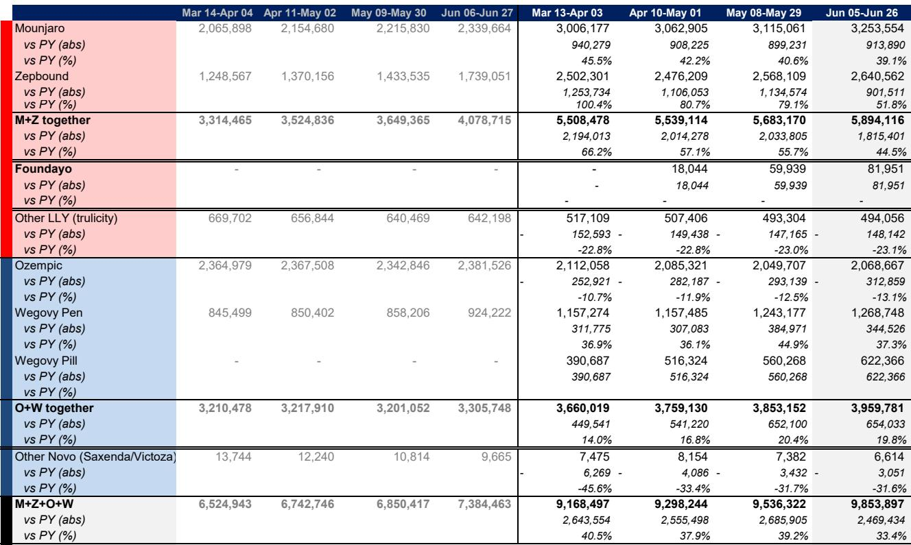
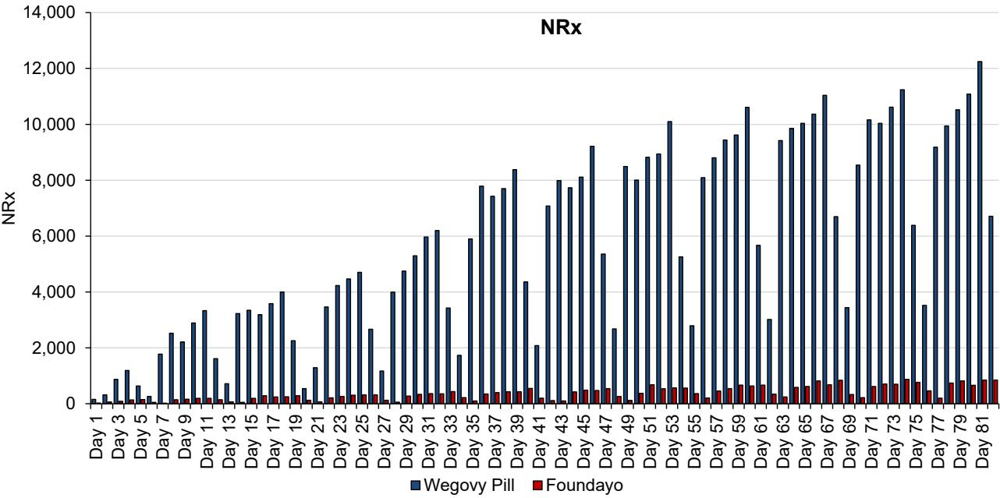
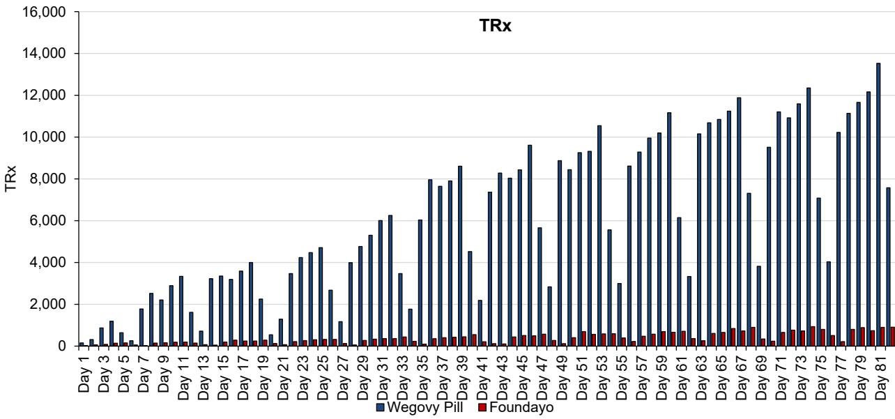

# Bernstein：礼来口服药新处方连续下滑，GLP1拐点未至

全球GLP-1市场正在进入一个关键观察窗口。7月1日，美国联邦医疗保险（Medicare）正式通过GLP-1 BRIDGE项目开始覆盖肥胖适应症的口服GLP-1药物。与此同时，礼来和诺和诺德面向消费者的直接广告（DTC）也刚刚开始大规模投放。这两个变量同时启动，理论上应该带来处方的加速增长。

但Bernstein最新发布的周度处方追踪报告给出一个需要审慎对待的信号：在广告和医保覆盖真正发力的初期，真实处方数据并未出现预期中的向上拐点，甚至在某些关键指标上出现了边际走弱。

这份报告的核心判断是：口服GLP-1的放量节奏，可能比市场此前预期的更为漫长。这不是一个线性加速的故事，而是一个需要持续跟踪“新处方（NBRx）转化率”和“持续用药患者占比”的观察期。

## 1. 新处方数据出现边际走弱，而非加速

截至6月26日当周，所有GLP-1品牌的总新处方维持在每周21万张的高位，但结构性的变化值得关注。礼来的FOUNDAYO（口服替尔泊肽）新处方降至1.04万张，相比6月12日当周1.26万张的峰值已连续下滑。诺和诺德的Wegovy口服片新处方为3.82万张，其起始剂量（1.5mg）的新处方同样出现下降趋势。

Bernstein指出，近期数据确实受到假期因素的扰动，但报告更在意的是“并未出现早期产品应有的反弹”。对于一个刚刚上市12周的新分子实体（NME）而言，新处方的持续回落，意味着患者获取的初始动力可能低于预期。

## 2. 持续用药患者占比的差异，暴露了FOUNDAYO的独特挑战

将FOUNDAYO与Zepbound（替尔泊肽注射剂）和Wegovy口服片在上市初期的患者留存率进行比较，可以更清晰地看到问题所在。

Zepbound上市第12周时，持续用药患者占其总处方的比例为57%；Wegovy口服片同期为55%。而FOUNDAYO在上市第11周的持续患者占比仅为42%，且这一比例在最近几周似乎进入平台期，没有继续向上收敛。

> **KC评论：** 持续患者占比是衡量一款新药能否从“尝试”走向“常规使用”的核心指标。FOUNDAYO在这一指标上落后于两个对标产品，背后可能的原因不止一个：医生对新分子需要更长的教育周期；患者对口服剂型每日服用的依从性可能低于预期；IQVIA的数据捕获率仍在改善中。报告没有给出定论，但这正是需要继续跟踪的关键变量。

Bernstein认为，FOUNDAYO是全新的分子实体，而Wegovy口服片是司美格鲁肽的剂型延伸，医生对后者的熟悉程度天然更高。这意味着礼来需要投入更多资源进行医生教育，而面向消费者的广告投放也必须等到医生教育相对成熟后才能全面展开。

## 3. 数据捕获率改善，但真实处方量可能被低估

一个重要的技术细节是：IQVIA对FOUNDAYO的数据捕获率目前约为90%，比此前估计的70%已有显著提升。但诺和诺德方面表示，其对Wegovy口服片的IQVIA捕获率仅约50%，这与Zepbound通过Lilly Direct渠道销售时的情况类似。

这意味着，Bernstein报告中基于IQVIA数据的相对处方量，可能低估了真实市场活动。尤其是Wegovy口服片，诺和诺德在年度股东大会上声称其周处方量是替尔泊肽的3倍，而IQVIA数据仅显示1.6倍。这个差距本身，就是研究框架中需要持续校准的变量。

## 4. 报告尚未完全回答的关键问题：Q3的拐点何时到来

Bernstein将FOUNDAYO的Q2美国收入预估定为1.06亿美元，基于19.4万张处方和每张处方312美元的混合均价。但这份报告最值得关注的不是Q2数字，而是Q3的预期。

报告明确写道，线性电视广告等大规模DTC投放将在Q3才真正启动，Medicare的BRIDGE/BALANCE项目也从7月1日开始生效。但截至报告数据截止日（6月26日），这些变量尚未在处方数据中体现。

这里有一个尚未被回答的问题：如果DTC和医保覆盖在Q3同时启动，FOUNDAYO的新处方能否重新回到上升轨道？持续患者占比能否向Zepbound和Wegovy口服片收敛？如果到9月底这两个指标仍未改善，那么市场对FOUNDAYO全年收入预期的调整，可能才刚刚开始。

> **KC评论：** 对于关注GLP-1赛道的读者，Bernstein这份报告提供了一个清晰的观察框架：不再只看总处方量的相对值，而是关注两个先行指标——新处方趋势和持续患者占比。前者反映获客效率，后者反映留存质量。两者同时改善，才是真实需求释放的信号。报告中的Exhibit 3和Exhibit 4提供了这两个指标的完整时间序列，值得反复对照。

## 5. 对观察框架的建议：关注三个时间窗口

基于这份报告的逻辑，可以建立一个三阶段的观察框架：

第一，未来2-3周，关注7月第一周Medicare覆盖启动后的渠道层面处方变化。Bernstein明确表示将监控这一数据，这是判断医保覆盖是否带来增量需求的最直接证据。

第二，Q3中期，关注FOUNDAYO新处方是否出现反弹。如果DTC广告开始起效，新处方数据应该在8月前后出现向上拐点。如果届时仍无改善，则意味着产品本身的获客动力可能弱于预期。

第三，持续患者占比能否在Q3末达到50%以上。这是判断FOUNDAYO能否从“尝鲜”走向“常规处方”的关键阈值。

对于GLP-1领域的竞争格局而言，这场口服药放量节奏的观察，不仅影响礼来和诺和诺德的短期业绩预期，更将决定整个口服GLP-1类别的市场天花板究竟在哪里。

For informational purposes only. Portions may be generated,translated,summarized,or edited with AI assistance based on source materials and may contain omissions or errors. Please verify independently. This is not investment,legal,tax,accounting,or other professional advice.

For informational purposes only. Portions may be generated,translated,summarized,or edited with AI assistance based on source materials and may contain omissions or errors. Please verify independently. This is not investment,legal,tax,accounting,or other professional advice.

