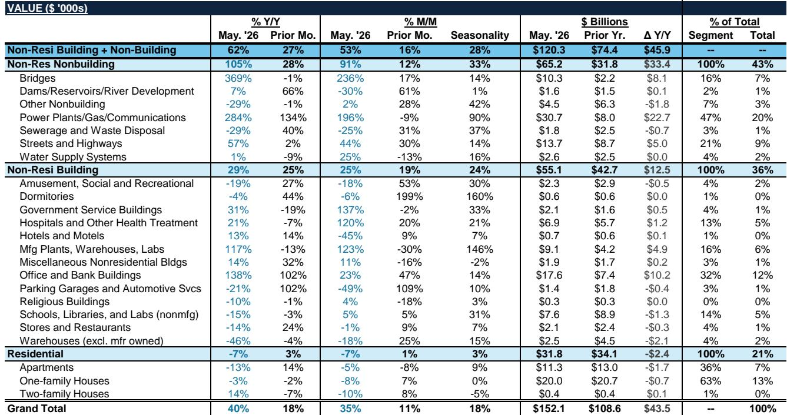
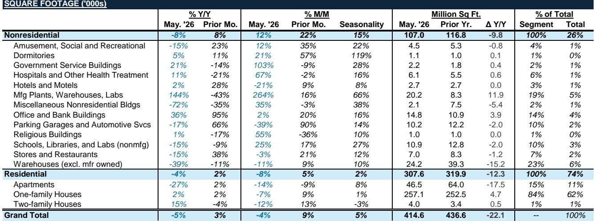
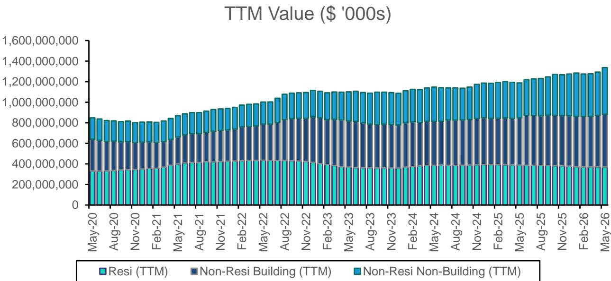

# Bernstein：美国机械板块结构性分化，重卡与建筑设备出现积极信号，农业机械仍在调整

这份来自Bernstein的6月机械行业先行指标报告，覆盖了40张图表，涵盖建筑工程设备、重卡和农业机械三大子领域。报告的核心观察是：**美国机械板块内部正在发生明显的结构性分化，重卡和建筑设备已出现明确的企稳信号，而农业机械的不确定性仍在持续。**

之所以值得关注，是因为机械板块通常是宏观环境的“温度计”。当重卡订单弹性较高而农机信心指数创下新低时，市场需要重新评估不同子板块的盈利拐点节奏，而不是笼统地判断“工业周期好坏”。

## 1. 重卡与建筑设备已走出谷底，但驱动力不同

先看最积极的信号。北美重卡净订单在5月同比弹性较高，达到约2.5万辆，积压订单同比增长约70%。更关键的是，现货市场运价（DAT Spot Rates）在7月初达到3.07美元，同比上涨45%，与上月持平。这意味着运价已经企稳在高位，为车队经营者的替换需求提供了基础。

建筑设备方面，Dodge Momentum Index在5月同比加速增长31%，非住宅开工价值同比增长约29%。但要注意的是，如果按面积计算，非住宅开工同比下滑约8%。**价值增长快于面积增长，说明项目单价在上升，可能反映了通胀因素或项目复杂度的提升。**

> **KC评论：** 重卡的反弹是“量价齐升”，而建筑设备的反弹更依赖价格驱动。读者可以关注Bernstein报告中关于“非住宅支出同比下滑2%”的图表，它揭示了施工活动总量并未同步扩张。

## 2. 农业机械的处境是另一个故事，且尚未看到底部

与重卡和建筑设备形成鲜明对比的是农业机械。北美大马力拖拉机销量在5月同比下降约10%，联合收割机销量更是明显波动约55%。欧洲CEMA景气指数从5月的-9进一步下滑至6月的-20，同比出现变化幅度从-16扩大至-24。

农民情绪指标（Purdue AG Barometer）虽然仍高于100的荣枯线，但在5月环比下降3个点至119。**报告没有给出明确的底部信号，这意味着农机板块的盈利不确定性可能持续到下半年甚至更久。**

> **KC评论：** 农业机械的节奏变化周期往往滞后于农作物价格。Bernstein报告中关于“CEMA指数”的历史图表值得细看，它比美国的Purdue指数更敏感地反映了欧洲农民的悲观情绪。

## 3. 宏观流动性正在改善，但传导至订单仍需时间

报告提供了一个宏观层面的关键变量：美国、中国、欧洲三大地区的货币供应量在5月同比增加约4万亿美元，高于前月的约3.7万亿美元。Bernstein的模型显示，每减少1000亿美元的货币供应，资本品公司的积压订单增速会下降1%。

**这意味着全球流动性正在从紧缩转向宽松，这对机械需求的中期前景是积极的。** 但报告同时指出，前20大地区的增长同步性已从80%降至75%，且大多数国家的PMI二阶导为正但一阶仍偏弱。流动性改善与订单复苏之间存在传导时滞，这个时间差正是市场定价分歧的来源。

## 报告没有完全回答的问题

Bernstein这篇报告的核心价值在于数据颗粒度，而非预测。它没有回答的深层问题是：建筑设备的价值增长能否持续转化为量的增长？农业机械的底部何时出现——是2026年下半年还是2027年？重卡的运价反弹是否只是季节性因素，还是结构性修复的开始？

对于产业决策者而言，当前阶段最务实的观察框架是：**密切跟踪重卡和建筑设备领域的“量”的指标（开工面积、销量），而不是被价值数据迷惑。同时，农业机械的库存去化速度将是判断底部何时来临的关键先行指标。**

For informational purposes only. Portions may be generated,translated,summarized,or edited with AI assistance based on source materials and may contain omissions or errors. Please verify independently. This is not investment,legal,tax,accounting,or other professional advice.

For informational purposes only. Portions may be generated,translated,summarized,or edited with AI assistance based on source materials and may contain omissions or errors. Please verify independently. This is not investment,legal,tax,accounting,or other professional advice.

