# US Business Services: Mid-year update and outlook for H2:26

Connor Cerniglia, CFA

+1 917 344 8472

connor.cerniglia@bernsteinsg.com

Bridget Alkin

+1 917 344 8359

bridget.alkin@bernsteinsg.com

After a strong first half for Industrials broadly, traditional US Business Services stocks have lagged: our Waste coverage underperformed the S&P 500 by -8%, Cintas -13%, and Rollins the worst lagging -37%. Versus the Industrial sector underperformance is even wider. This is not a story of deteriorating fundamentals: EBITDA revisions are flat year-to-date for our Waste coverage and Cintas, albeit fundamentals for Rollins have come under concern. Rather, the market has rotated into higher-beta, pro-cyclical names—data center beneficiaries, PMI-sensitive industrials, etc.—leaving Waste and uniforms as relative laggards. There is some justification to this—for businesses with stable revisions they ought to underperform those with more positive ones.

We believe the Waste industry outlook has improved modestly since January. Fed 2026 CPI expectations have risen to 3.5% from 2.6%, and given that many contracts price on a 12-month average CPI with a 6-month lag, FY2027 pricing estimates likely need to move higher. Recycled commodity prices are up year-to-date across OCC and plastics, D3 RIN prices are up 23% YoY, and with PMI above 50 for five consecutive months, industrial volumes offer near-term upside compared to when PMI was 47.9 at the start of the year. The clearest risk is Residential, where volumes have stayed negative longer than management teams anticipated—Republic Services's CEO described industry competition as, "people willing to work for very, very low returns" on the last earnings call—though our base case is gradual improvement through H2:26. It is probable the Waste industry increases FY2026 guidance during Q2 results. Within Waste RSG and WM have performed the same year-to-date, with WCN lagging them by 7%, relating to concerns about the Chiquita Canyon landfill.

Industrial distributors have broadly outperformed the S&P 500, though dispersion is wide: Grainger is up +33%, Fastenal up +21%, and Ferguson up +3%. Grainger's outperformance reflects a catch-up from 2025 underperformance and stronger execution—and a beat and raised last quarter—while Fastenal was caught flat-footed on branded product pricing. Incoming CEO Jeff Watts begins in July, and execution risk related to his transition is an area of focus. Ferguson's lag is a residential construction story: May housing starts fell -15% MoM to the lowest level since May 2020, offsetting what we view as underappreciated data center exposure in the non-residential book.

For Pest Control and Uniforms, two near-term events define each company's setup. Rollins enters Q2:26 with its first clean organic growth read since Q3:25; intra-quarter commentary at a conference cited "choppy" trends linked to lower end consumer pressure in some areas of the business. Its competitor Rentokil (covered by Will Kirkness) was asked about this, and opted not to comment. There is one thing we can say for certain—weather was warmer YoY, a tailwind for pest control players entering the quarter. Cintas remains in deal purgatory: the FTC's June 11th Second Request likely pushes any deal approval to H1:27, most likely approved or not in its current form since divestitures would be an insufficient remedy to FTC concerns. Near-term, investors are focused on whether incremental margins step up to 35-38% next quarter (FYQ4:26), after several quarters near ~27%, providing clarity on whether lackluster margins were temporary or structural.

## BERNSTEIN TICKER TABLE

<table><tr><td rowspan="2">Ticker</td><td rowspan="2">Rating</td><td colspan="3">2 Jul 2026</td><td rowspan="2">TTMRel.</td><td colspan="4">Adjusted EPS</td><td colspan="3">Adjusted P/E (x)</td></tr><tr><td>Cur</td><td>Closing Price</td><td>Price Target</td><td>Cur</td><td>2025A</td><td>2026E</td><td>2027E</td><td>2025A</td><td>2026E</td><td>2027E</td></tr><tr><td>CTAS (Cintas)</td><td>M</td><td>USD</td><td>181.37</td><td>200.00</td><td>(35.1)%</td><td>USD</td><td>4.40</td><td>4.89</td><td>5.40</td><td>41.2</td><td>37.1</td><td>33.6</td></tr><tr><td>FAST (Fastenal)</td><td>U</td><td>USD</td><td>48.60</td><td>42.00</td><td>(5.3)%</td><td>USD</td><td>1.09</td><td>1.21</td><td>1.31</td><td>44.4</td><td>40.3</td><td>37.2</td></tr><tr><td>FERG (Ferguson)</td><td>O</td><td>USD</td><td>230.24</td><td>310.00</td><td>(15.2)%</td><td>USD</td><td>10.58</td><td>11.38</td><td>12.60</td><td>21.8</td><td>20.2</td><td>18.3</td></tr><tr><td>FERG.LN (Ferguson)</td><td>O</td><td>GBp</td><td>17,140</td><td>22,963</td><td>(13.2)%</td><td>USD</td><td>10.58</td><td>11.38</td><td>12.60</td><td>21.6</td><td>20.1</td><td>18.2</td></tr><tr><td>RSG (Republic Services)</td><td>M</td><td>USD</td><td>217.34</td><td>220.00</td><td>(27.7)%</td><td>USD</td><td>7.02</td><td>7.19</td><td>8.07</td><td>30.9</td><td>30.2</td><td>26.9</td></tr><tr><td>ROL (Rollins)</td><td>M</td><td>USD</td><td>42.14</td><td>52.00</td><td>(43.4)%</td><td>USD</td><td>1.13</td><td>1.25</td><td>1.40</td><td>37.3</td><td>33.8</td><td>30.2</td></tr><tr><td>GWW (Grainger)</td><td>M</td><td>USD</td><td>1,342.98</td><td>1,250.00</td><td>10.5%</td><td>USD</td><td>39.48</td><td>45.72</td><td>49.63</td><td>34.0</td><td>29.4</td><td>27.1</td></tr><tr><td>WCN (Waste Connections)</td><td>O</td><td>USD</td><td>168.82</td><td>205.00</td><td>(24.4)%</td><td>USD</td><td>5.15</td><td>5.53</td><td>6.23</td><td>32.8</td><td>30.5</td><td>27.1</td></tr><tr><td>WM (Waste Management)</td><td>O</td><td>USD</td><td>230.40</td><td>260.00</td><td>(16.0)%</td><td>USD</td><td>7.56</td><td>8.26</td><td>9.23</td><td>15.1</td><td>14.1</td><td>12.9</td></tr><tr><td>SPX</td><td></td><td></td><td>7,483.24</td><td></td><td></td><td></td><td></td><td></td><td></td><td></td><td></td><td></td></tr></table>

O - Outperform, M - Market-Perform, U - Underperform, NR - Not Rated, CS - Coverage Suspended

WM valuation is EV/Adj EBITDA (x);

Source: Bloomberg, Bernstein estimates and analysis.

## INVESTMENT IMPLICATIONS

Within Waste, we rate Waste Management Outperform with a PT of $260, Waste Connections Outperform with a PT of $205, and Republic Services Market-Perform with a PT of $220. With our Industrial Distributor coverage we rate Ferguson Outperform with a PT of $310, WW Grainger Market-Perform with a PT of $1,250, and Fastenal Underperform with a PT of $42. We rate Cintas Market-Perform with a PT of $200 and Rollins Market-Perform with a PT of $52.

## 2026 BUSINESS SERVICES YTD PERFORMANCE

After a strong first half for Industrials broadly, traditional US Business Services stocks have lagged: our Waste coverage underperformed the S&P 500 by -8%, Cintas by -13%, and Rollins the worst lagging by -37% (Exhibit 1). Versus the Industrial sector underperformance is even wider. This is a not a story of deteriorating fundamentals: EBITDA revisions are flat year-to-date for our Waste coverage and Cintas, albeit fundamentals for Rollins have come under concern. Rather, the market has rotated into higher-beta, pro-cyclical names—data center beneficiaries, PMI-sensitive industrials, etc.—leaving Waste and uniforms as relative laggards. There is some justification to this—for businesses with stable outlooks, relative outperformance in revisions elsewhere, should drive share outperformance as well.

EXHIBIT 1: Industrial distributors performed the best in our US Business Services coverage year-to-date, outperforming the S&P 500 by -10%. Our Waste coverage, Cintas, and Rollins lagged the broader market.

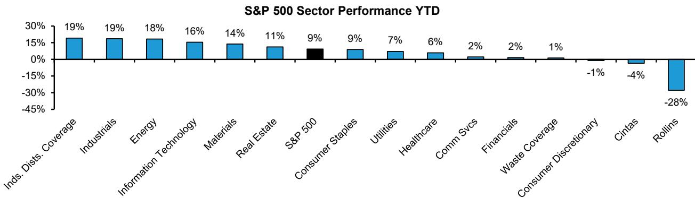  
Source: Bloomberg, Bernstein analysis

EXHIBIT 2: Industrial distributors saw positive EBITDA revisions, increasing 3.2% on average YTD. EBITDA revisions were the worst for Rollins (-3.3%) and Waste estimate revisions are flattish.

US Business Services FY2026 EBITDA
Estimate Revisions YTD

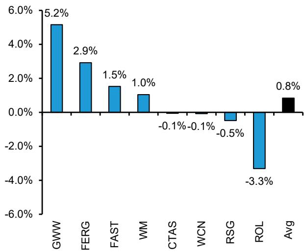  
Source: Bloomberg, Bernstein analysis  
EXHIBIT 3: Industrial distributors EPS estimates increased 3-4% year-to-date while Waste estimates are flat to slightly down. Rollins EPS estimates declined -2.5% and Cintas estimates are flattish.  
US Business Services FY2026 Adj.
EPS Estimate Revisions YTD

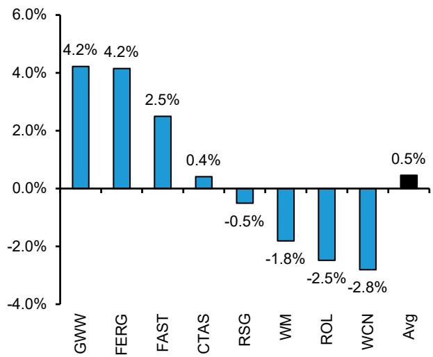  
Source: Bloomberg, Bernstein analysis

## US WASTE

Waste companies have lagged the S&P 500 by $-8\%$ despite flat to down estimate revisions across the group (Exhibit 4). The sector's underperformance is a reflection of a rotation within Industrials rather than weakening fundamentals. In an environment where PMI has inflected above 50 and data center construction activity continues to accelerate, it seems that investors have rotated out of stable, defensive Industrials and into higher-beta, economically sensitive names, leaving the Waste sector as a relative underperformer. Returns have varied across the top four waste players: WM and RSG are the best-performing companies within our Waste coverage up $+4\%$ , while WCN is down $-4\%$ , and GFL $-13\%$ . The underperformance of Waste Connections reflects ongoing Chiquita Canyon Landfill concerns and for GFL is related to investor's negative view of their bid for Secure Waste.

The pricing outlook for the industry has improved since the start of the year and FY2027 pricing estimates likely need to be revised modestly higher. Index-based contracts, which often use a 12-month average CPI on a 6-month lag, suggest 2026 pricing should average 2.7% for FY2026, unchanged year-to-date. However, Fed expectations for headline CPI increased to 3.5% from 2.6% since the start of the year, indicating consensus FY2027 estimates likely need to be revised modestly higher (Exhibit 5 - Exhibit 6).

Volume trends are mixed across end markets—weak in Residential, stable in Commercial, recovering in Industrial. Residential volumes have stayed negative for several quarters, and management teams have repeatedly called for the trough only to see conditions continue in a similar pattern (Exhibit 7). On their Q1:26 earnings call, Republic Services's CEO characterized the Residential environment as "very, very competitive," suggesting that the industry as a whole has underestimated competitive intensity across the group. Negative volumes in Residential are expected to persist for all three large companies but improve in the second half of 2026—we expect volumes to stay negative in 2027, but at an improving rate, and turn positive in 2028. Commercial volumes remain roughly flat, and we see upside to Industrial volumes in the back half of 2026 as PMI has been above 50 for five consecutive months (Exhibit 8). Q2:26 comparables are difficult for Waste Management and Republic Services due to wildfire and hurricane cleanup benefits in the prior year, while WCN is unimpacted.

Higher recycled commodity prices year-to-date are a tailwind to the sector with Waste Connections and Republic Services expected to see the most upside in FY2026 guidance. The recycling backdrop has improved meaningfully year-to-date, with both OCC and plastics pricing higher compared to January 2026 (Exhibit 9 - Exhibit 10). OCC is 60-70% of Recycling sales with pricing improving sequentially every month in 2026, close to flat YoY, driven by recovering box demand, containerboard capacity cuts, and export demand. Virgin plastic (~15% of sales) supply is tightening due to the Iran conflict resulting in higher pricing. Waste Connections and Republic Services are best positioned to benefit from higher commodity prices, while Waste Management has already embedded a recycling recovery into its full-year guidance. Automation investments are an additional benefit to the Recycling business. Waste Management is targeting 300bps EBITDA margin improvement in the Recycling segment in FY2026, and Republic Services Polymer Center produce higher-quality product and can partially offset price weakness.

Underpinned by improving sector fundamentals we see a reasonable probability that Republic Services and Waste Connections increase FY2026 guidance during Q2:26 results. Waste Management is slightly less likely to increase guidance in our view as the improvement in recycled commodity prices is already factored into FY2026 guidance.

Valuation remains attractive and, in our view, does not reflect the improvement in fundamentals compared to the start of the year. Our Waste coverage trades near its ten-year average on an absolute EV/NTM EBITDA basis but at decade lows relative to the S&P 500 at 1.0x and 0.8x on NTM P/FCF (Exhibit 11 - Exhibit 12). Bears argue that incremental growth from recycling and RNG investments is lower quality than core municipal solid waste (MSW) collection and disposal, warranting a lower multiple. We view this concern as overblown and expect core MSW to continue to represent the majority of sales for the average waste company. At decade-low relative valuations with room for EBITDA estimate revisions and a more constructive setup heading into H2:26, we believe the risk/reward skews positively for the Waste sector.

EXHIBIT 4: Waste stock performance for our coverage (WM, WCN and RSG) is roughly flat year-to-date, underperforming the S&P 500 and XLI. Stable, defensive Industrials names remain out of favor in a higher PMI and stronger data center environment

Waste Normalized Stock Performance YTD vs. S&P 500 and XLI  
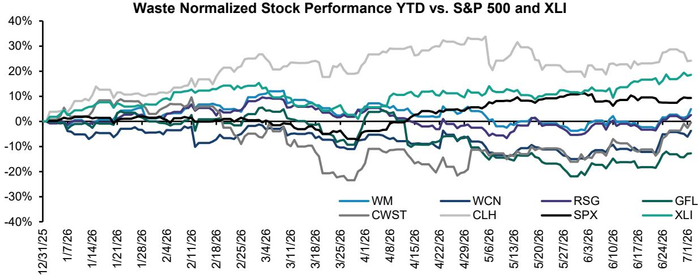  
Source: Bloomberg, Bernstein analysis  
EXHIBIT 5: Fed 2026 headline CPI expectations increased to 3.5% from 2.6% since the start of the year. Combined with recent higher- than-expected CPI, this suggests FY2027 pricing will likely be higher than FY2026.  
CPI Index YoY and Trailing 4 quarter average

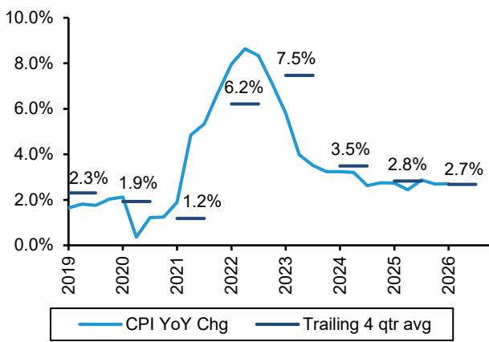  
Source: US Bureau of Labor Statistics, Bloomberg, Bernstein analysis and estimates  
EXHIBIT 6: FY2026 pricing for contracts based on alternative indices such as CPI for Waste Sewer Trash is expected to be slightly higher than FY2025  
Waste Sewer Trash Collection Index
YoY and Trailing 4 quarter average

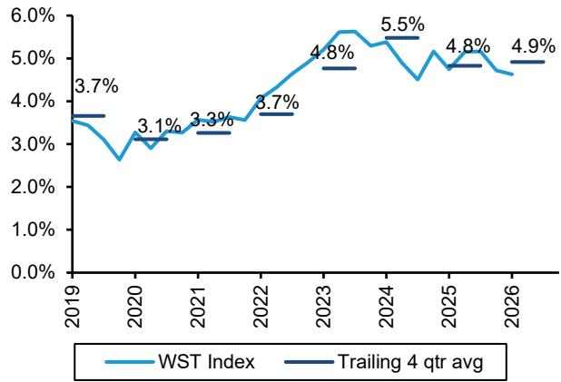  
Source: US Bureau of Labor Statistics, Bloomberg, Bernstein analysis and estimates

US PPI, Corrugated Recyclable Paper YoY% (2014-2026)

EXHIBIT 7: Negative volumes in Residential are expected to persist through 2026, with potential modest improvement in H2:26 for WM, and for RSG in Q4:26 and into FY2027

Residential Volumes (WM & RSG Avg)

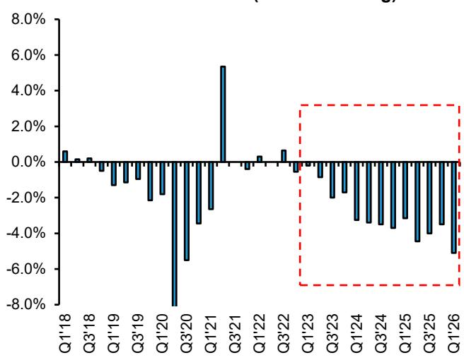  
Source: Company filings, Bernstein analysis

EXHIBIT 8: The Industrial volume outlook continues to improve with PMI above 50 for five consecutive months. We see upside to volumes in the back half of 2026

Industrial Volumes (WM & RSG Avg)

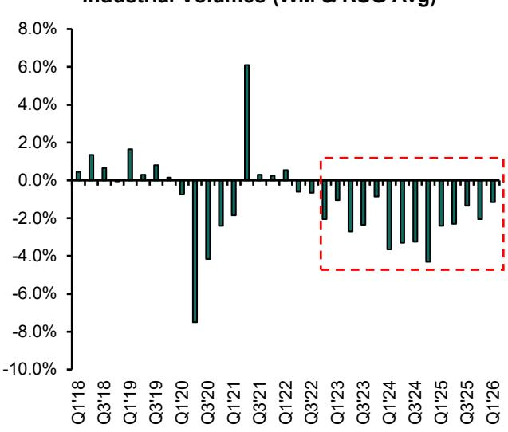  
EXHIBIT 9: The US PPI for Plastics Materials and Resins inflected in May. Virgin plastic supply is tightening due to the Iran conflict, resulting in higher pricing that should in turn lift recycled plastic prices

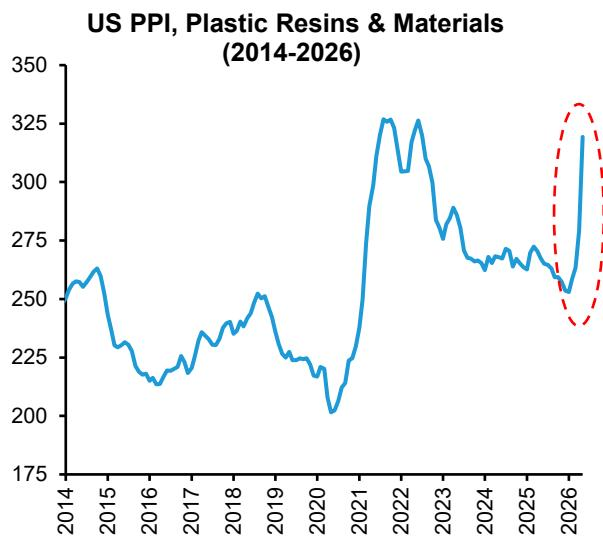  
Source: Bloomberg, Company filings, US Bureau of Labor Statistics, FRED, Bernstein analysis  
Source: Company filings, Bernstein analysis  
EXHIBIT 10: Declines in the US PPI for old corrugated paper moderated in April and May, with a strong improvement in pricing YTD

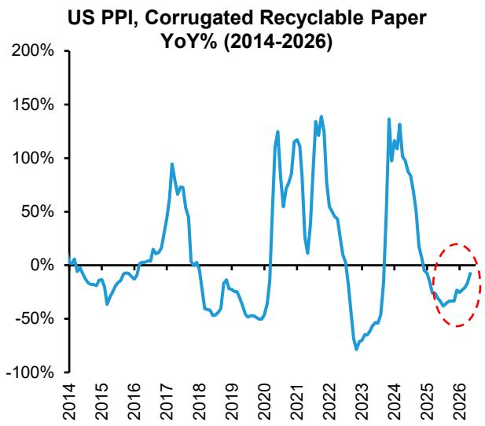  
Source: Bloomberg, Company filings, US Bureau of Labor Statistics, FRED, Bernstein analysis

Waste Industry Coverage
Absolute EV/NTM Adj. EBITDA
(10 years)

EXHIBIT 11: The average EV/NTM EBITDA multiple for our Waste coverage is in line with its 10-year average on an absolute basis...  
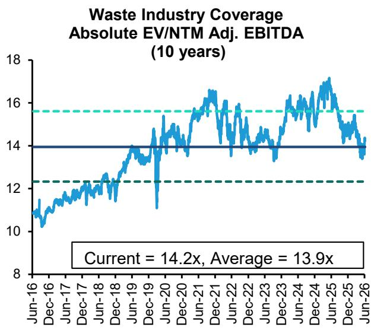  
Source: Bloomberg, Bernstein analysis

EXHIBIT 12: but near decade lows versus the market at ~1.0x EV/NTM EBITDA relative to the S&P 500.  
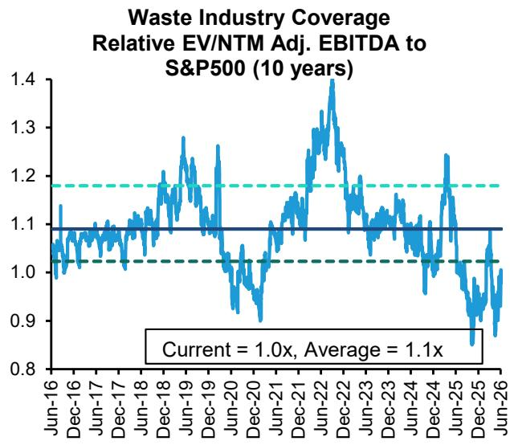  
Source: Bloomberg, Bernstein analysis

## US INDUSTRIAL DISTRIBUTORS

Industrial distributors have broadly outperformed the S&P 500 and the XLI year-to-date, but stock-level performance has varied reflecting differences in end market exposure and execution (Exhibit 13). Grainger (+33%) performed the best in our coverage year-to-date, followed by Fastenal up +21%, and Ferguson up +3%. Wesco (not covered) and Ferguson have traded as mirror images following Q1:26 earnings, raising a question of whether investors are rotating into Wesco as the preferred data center proxy among the industrial distributors. Core & Main (not covered) is down -14% which we believe is due to weak residential construction activity with limited data center offset. The divergence in stock performance across the group is a function of end-market mix, reflecting different exposure to residential headwinds, non-residential and data center tailwinds, and improving manufacturing activity.

The macro backdrop for industrial distributors has improved materially since January 2026. PMI has been above 50 for five consecutive months, compared to 48 exiting 2025 (Exhibit 14). Non-residential construction remains robust driven by a large commercial project pipeline and data center construction (Exhibit 15). On the other hand residential construction activity has worsened since January, a negative for Ferguson's guide which originally struck us as conservative, but is now likely more fair. Housing starts declined -15% MoM in May 2026 to ~1.2m, the lowest level since May 2020, as mortgage rates and affordability constraints continue to weigh on new construction (Exhibit 16). Existing home sales were ~3.8m in May 2026 and remain near 20-year lows (Exhibit 17).

Grainger is the best-performing distributor in our coverage year-to-date, driven in part by a recovery from its relative underperformance versus Fastenal in 2025. Underlying fundamentals have been stronger at Grainger, with a Q1:26 beat and raise, disciplined tariff-related pricing execution, and no impact from the branded product pricing pressures that weighed on Fastenal. Pre-quiet period conversations suggest the company has not seen incremental disruption from conflict in Iran, and pricing conversations appear healthy despite supply chain pressure from the Middle East. Monotaro, reported at GWW on a one-month lag, implies Q2:26 growth above 20%, partly reflecting pull-forward buying ahead of the Iran War—an attractive setup for Q2:26. Our broader concern on Grainger remains unchanged: consensus appears to be extrapolating gross margin improvement from 2020-23, calling for flat gross margins as the new norm breaking a decade-long pre-pandemic trend of structural declines. We remain cautious and model modest 30bps gross margin expansion in FY2026 followed by -20bps declines annually through FY2028, which could weigh modestly on EPS expectations.

Pricing execution is the main debate for Fastenal, as the company faces both leadership transition risk and challenging customer negotiations. Q1:26 results fell short of consensus expectations as lower visibility on branded products and slower-than-expected pricing negotiations weighed on pricing and margins. At our Strategic Decisions Conference at the end of May,

CEO Daniel Florness acknowledged that the CFO transition may have delayed the internal escalation process that would have triggered earlier pricing actions. The company has been transparent about pricing missteps and appears to be working on resolving them, but balanced commentary makes it difficult to measure how quickly it will translate into better numbers. The broader execution concern for Fastenal is whether the CEO transition in July could introduce incremental risk at a time when pricing discipline remains critical. While the structural focus on digital penetration and larger customers remains strong, near-term pricing execution is a risk and we remain skeptical of consensus gross margin expectations following a period of higher tariff-driven pricing.

Ferguson is the laggard within our distributor coverage year-to-date, which we believe stems from weak residential construction activity partially offsetting non-residential strength. Ferguson holds the #1 or #2 position in 75% of its markets, and with approximately 20% market share in commercial plumbing and 5% in commercial HVAC it is the largest beneficiary of ongoing data center construction within our coverage. We believe this data center tailwind remains underappreciated by consensus. Together we expect the outlook for Ferguson to improve as non-residential activity strengthens and the residential headwind, while persistent, is well-understood and largely priced in.

EXHIBIT 13: Within our coverage GWW performed the best following strong Q1:26 results and increased FY2026 guidance above consensus expectations due to stronger demand and pricing. FAST was in line with the XLI due to pricing concerns, while FERG underperformed - is this due to a DC-related rotation into WCC?

Industrial Distributors Normalized Stock Performance YTD vs. S&P 500 and XLI  
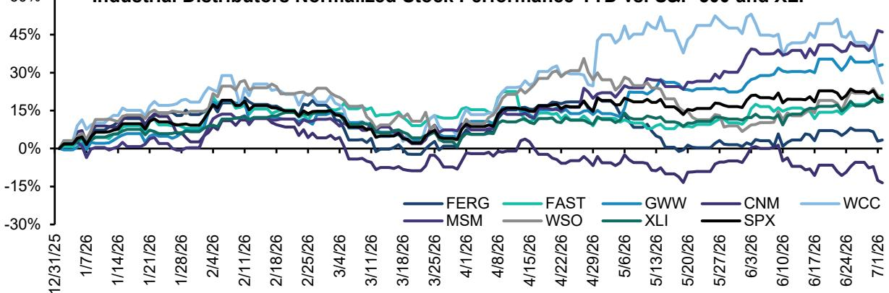  
Source: Bloomberg, Bernstein analysis

ISM Manufacturing PMI (2018 - 2026)

US Single-Family Existing Home Sales, SAAR  
EXHIBIT 14: PMI has been above 50 for five consecutive months  
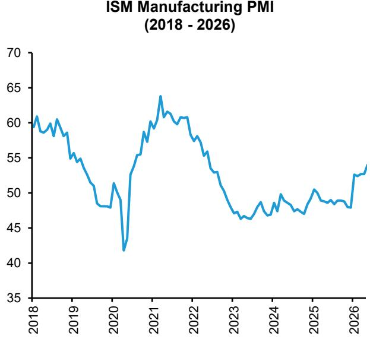  
Source: ISM, Bloomberg, Bernstein analysis

EXHIBIT 15: The Dodge Momentum Index indicates an improving non-residential construction backdrop  
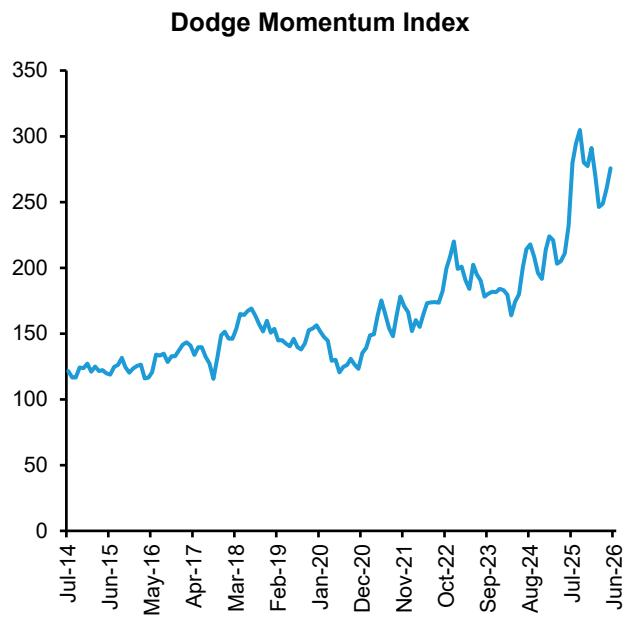  
Source: Dodge, Bernstein analysis  
EXHIBIT 16: US Residential housing starts continue to decline, now at 1.2m SAAR—the lowest since May 2020—and below the ~2.3m needed to resolve the housing deficit

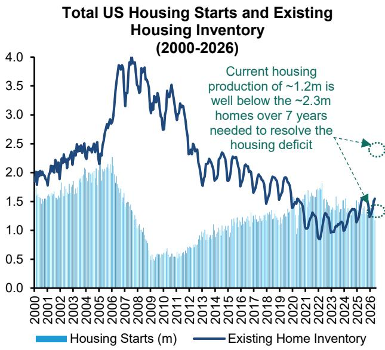  
Source: National Association of Realtors, Bloomberg, Bernstein analysis  
EXHIBIT 17: Existing home sales are near 20-year lows indicating a subdued housing market

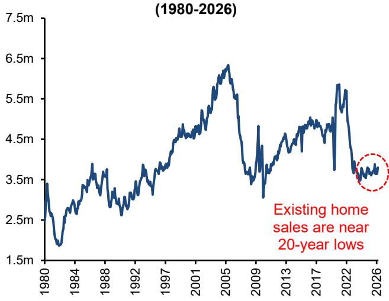  
Source: National Association of Realtors, Federal Reserve St. Louis, Bloomberg, Bernstein analysis

## CINTAS & ROLLINS

Cintas is down -4% year-to-date and, in our view, is stuck in deal purgatory until the UniFirst (not covered) acquisition is resolved (Exhibit 18). The fundamentals have been healthy, although investors have been disappointed by Cintas's margin progress over the last year. Incremental margins over the last 12 months have averaged 27% as the company invested in technology, on the low end of their 25-35% target range (Exhibit 19). Management has guided to 35-38% incremental margins in FYQ4:26, the first quarter lapping a full year of technology investments. Those results should provide clarity on whether lackluster margins were timing-related or structural.

The Federal Trade Commission (FTC) issued a Second Request on June 11, 2026, likely pushing any approval to H1:27 at the earliest against management's expectation of H2:26 (Exhibit 20). The market implies a 75-80% probability of deal approval, above the 40-75% range we have heard from legal experts, and we believe the outcome of the deal will likely be binary (Exhibit 21). If FTC concerns center around the lack of a national player, divestments would need to be so significant that it would be unacceptable to Cintas. If it is local market concerns, the store overlap between Cintas and UniFirst would have to be so large that similarly significant divestments would be required. If the FTC challenges the deal, we believe the odds of Cintas winning in court are unlikely and the process would extend into late 2027.

EXHIBIT 18: Is Cintas stuck in deal purgatory as it awaits approval of the UNF acquisition? The stock sold off in March with the market and has yet to recover.

Uniform and Facilities Services
Normalized Stock Performance YTD
vs. S&P 500

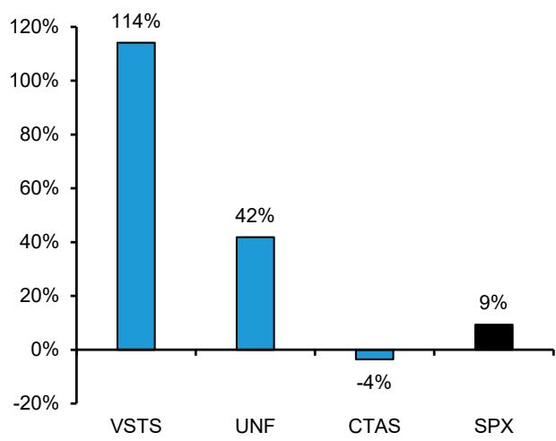  
Source: Bloomberg, Bernstein analysis  
EXHIBIT 19: Management expects a step up in incremental margins to 35-38% in FYQ4:26-consistent with 2H:26 guidance—but we believe will be difficult to achieve as Cintas laps tough comps of 50-60% margins  
Cintas Incremental Margin (Estimated)

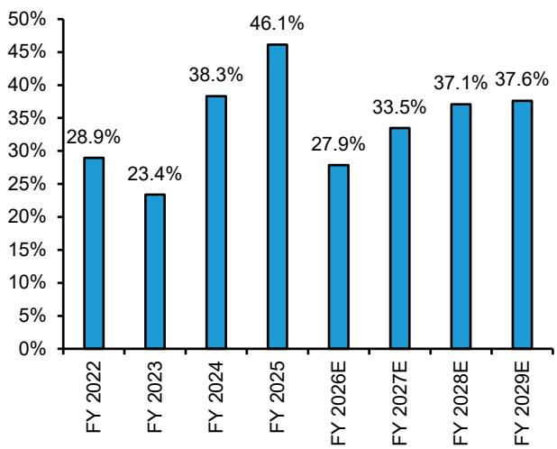  
Source: Company filings, Bernstein analysis and estimates

EXHIBIT 20: Cintas/UniFirst HSR Regulatory Timeline

<table><tr><td colspan="3">Cintas / UniFirst — HSR Regulatory Timeline</td></tr><tr><td>Milestone</td><td>Date</td><td>Status</td></tr><tr><td>Merger agreement signed</td><td>March 10, 2026</td><td>Complete</td></tr><tr><td>HSR initial filing</td><td>April 8, 2026</td><td>Complete</td></tr><tr><td>Cintas voluntary HSR withdrawal</td><td>May 8, 2026</td><td>Complete</td></tr><tr><td>Cintas HSR refile</td><td>May 12, 2026</td><td>Complete</td></tr><tr><td>UniFirst shareholder vote</td><td>June 11, 2026</td><td>Approved</td></tr><tr><td>FTC Second Request issued</td><td>On or before June 11, 2026</td><td>Issued</td></tr><tr><td>Second 30-day FTC window opens</td><td>After substantial compliance</td><td>Pending</td></tr><tr><td>Base termination date</td><td>January 10, 2027</td><td></td></tr><tr><td>Extension 1 — antitrust delay</td><td>May 10, 2027</td><td></td></tr><tr><td>Extension 2 — antitrust delay</td><td>September 10, 2027</td><td></td></tr><tr><td>Expected close (company guidance)</td><td>H2 2026</td><td></td></tr></table>

Source: Company filings (Cintas/UniFirst 424B3), Bernstein analysis

EXHIBIT 21: Experts' deal approval odds range from 40-75%, with the market currently implying 75-80%. If the FTC challenges the deal, the odds of overturning it in court are low, with the issue dragging out until September 2027.  
CTAS / UNF Implied Deal Approval (%)  
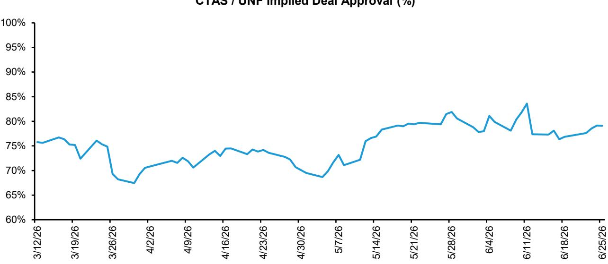  
Source: Bloomberg, Bernstein analysis

Rollins has been the worst performing company in our coverage year-to-date, declining -28% vs. the S&P500 of +9% (Exhibit 22). The company reported weaker-than-expected Q4:25 results related to weather issues, while neither Rentokil nor Ecolab made similar commentary—note, 70-75% of Rollins stores have a Terminix store within a 15-mile radius. Rollins also reported weather issues in Q1:26, this time more legitimate given frequent blizzards, but had a healthy exit rate for the quarter with 8.4% organic growth in March. A separate concern, which we give less credence to, was the FTC's decision to cease enforcement of non-compete policies in the Pest Control industry. This coincided with Rollins's May investor day, where former CFO Ken Krause laid out a margin outlook primarily predicated on lower employee turnover. Two weeks after the investor day, Krause—the architect of Rollins's modernization plan—resigned after only three years at the company to take a leadership role in a different industry. More recently, intra-quarter commentary at a conference cited “choppy” trends linked to lower-end consumer pressure in parts of the business.

The US Business Services industry as a whole had already de-rated meaningfully ahead of Rollins's sell-off, which may have added to the stock's multiple compression. Cintas de-rated from ~50x NTM P/E to ~30x, ADP ~30x NTM P/E to ~20x (not covered), and consulting/information services companies like Gartner, Verisk, Equifax (all not covered) saw multiples fall by -50% or more. While these are different businesses in different end markets, they are surprisingly correlated at times, likely a function of overlapping investor bases and share “quality compounder” positioning. Did the sector wide de-rating amplify Rollins's multiple compression?

Q2:26 is the first quarter since Q3:25 with a clean organic growth read, and we expect weather to be a benefit as this spring experienced warmer than average temperatures (Exhibit 23). The CFO departure is a more medium- to long-term risk. Krause was the architect of the SG&A cost discipline underpinning the 30-35% incremental margin targets, and his replacement has been at the company less than a year. We believe the probability of executing on the medium-term margin roadmap has declined, which is the basis for our downgrade to Market Perform the day after Rollins announced Krause's departure (Exhibit 24).

Pest Control Normalized Stock Performance YTD vs. S&P 500

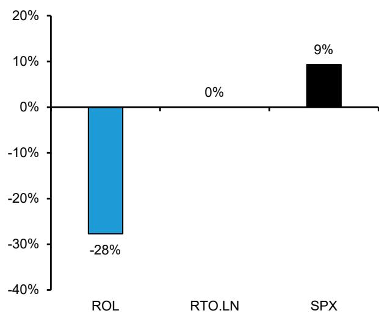  
Source: Bloomberg, Bernstein analysis

EXHIBIT 22: Rollins lagged due to weather issues weighing on the one-time business, intra-quarter comments pointing to weak demand, and the departure of former CFO Ken Krause  
EXHIBIT 23: Q2:26 is the first quarter since Q3:25 with a clean organic growth read, and we expect weather to be a benefit as this spring experienced warmer than average temperatures

<table><tr><td colspan="3">Q2:26 Weather - Apr-May vs. 20th-Century Avg</td></tr><tr><td>Region</td><td>Apr</td><td>May</td></tr><tr><td>Ohio Valley</td><td>+6.5F</td><td>-0.3F</td></tr><tr><td>Southwest</td><td>+5.0F</td><td>+3.2F</td></tr><tr><td>Southeast</td><td>+2.6F</td><td>+1.5F</td></tr><tr><td>Northeast</td><td>+2.9F</td><td>+0.2F</td></tr><tr><td>Midwest</td><td>+3.5F</td><td>+0.3F</td></tr><tr><td>Pacific NW / Mtn</td><td>+1.3F</td><td>
