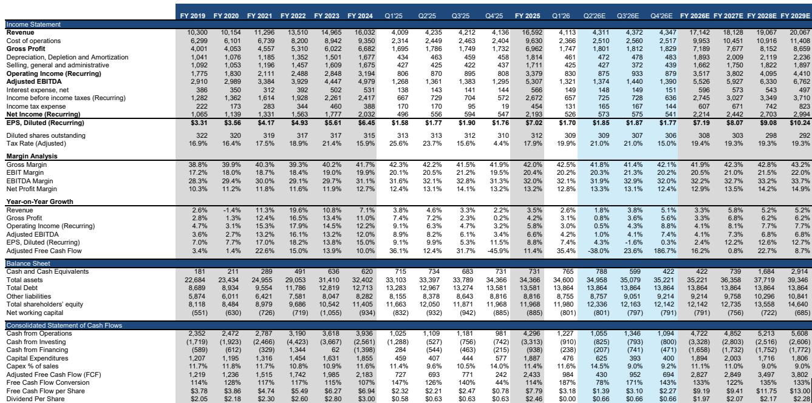

# 防御性商业服务板块的轮动可能已过度：为何废弃物、制服与虫害防治领域现提供非对称上行空间

2026年上半年对传统美国商业服务板块的持有者而言颇具挑战，但表象之下的叙事正在转变。虽然更广泛的工业板块表现强劲，但我们的废弃物研究覆盖标的相较标普500指数落后8%，Cintas落后13%，Rollins跌幅最大达37%。相较于工业板块，这种落后表现更为显著。这并非基本面恶化的故事——废弃物公司和Cintas的EBITDA修正值年初至今持平，仅Rollins显示出真正的基本面隐忧。相反，市场已进行了一次剧烈的轮动，转向高贝塔值、顺周期标的——数据中心受益者、PMI敏感型工业股——而将稳健的复合增长型公司抛在身后。每位认真的研究者现在必须回答的问题是，这次轮动是否已经过度。

基于对该板块的年中评估，答案日益清晰：2026年下半年的布局有利于落后股。三大结构性力量正在汇聚。首先，自1月以来，废弃物的定价前景已显著改善，美联储2026年CPI预期从2.6%升至3.5%，这一变化将通过12个月平均CPI机制（滞后六个月）传导至2027财年的合同定价。其次，再生商品价格年初至今在OCC和塑料领域均有所上涨，D3 RIN价格同比上涨23%。第三，随着PMI连续五个月保持在50以上（年初为47.9），工业产量正在复苏。这些顺风因素尚未反映在估值中——相对于标普500指数，估值处于十年低位。

风险集中在住宅废弃物产量上，其负增长持续时间长于管理团队的预期。Republic Services的CEO将竞争环境描述为“人们愿意以非常非常低的回报工作”。然而，我们的基准情景是2026年下半年逐步改善。定价基本面改善、商品顺风因素和工业产量复苏的结合，创造了一种情景：废弃物公司有可能在第二季度业绩中上调2026财年指引。对于错过顺周期标的轮动的研究者而言，该板块现在提供了一个具有非对称上行空间的引人入胜的切入点。

## 工业分销商表现优异，但分化揭示机会范围正在收窄

工业分销商年初至今普遍跑赢标普500指数，但板块内部的分化幅度大且具有启发性。Grainger上涨33%，Fastenal上涨21%，而Ferguson仅上涨3%。这种分化并非随机；它反映了终端市场敞口和执行质量。Grainger的优异表现是对其2025年落后表现的追赶，并得到了超预期并上调指引的季度以及关税相关定价执行纪律的强化。相比之下，Fastenal在品牌产品定价上措手不及，7月份即将上任的CEO带来了执行风险。Ferguson的落后是一个住宅建设故事：5月房屋开工率环比下降15%，至2020年5月以来最低水平，这抵消了我们认为其非住宅业务中被低估的数据中心敞口。

自1月以来，工业分销商的宏观背景已显著改善，PMI连续五个月高于50，非住宅建设保持强劲。然而，住宅建设活动已恶化，形成了一个分化的环境。问题是Ferguson的数据中心敞口是否足以抵消住宅领域的逆风，或者市场是否正确地因其对住房的敏感性而惩罚该股票。我们的观点是，市场低估了非住宅顺风因素，特别是数据中心建设，这仍然是一个多年主题。第一季度财报后Ferguson与Wesco之间的分化——Wesco成为首选的数据中心代理标的——表明研究者正在对终端市场敞口进行二元押注，而非评估整体投资组合的韧性。

对于Fastenal而言，近期焦点在于即将上任的CEO能否稳定品牌产品定价并恢复执行信誉。该股年初至今21%的涨幅表明市场给予管理层信任，但报告观点反映出对过渡是否顺利的怀疑。工业分销领域更广泛的教训是，终端市场组合现在主导着标的筛选，而广泛板块敞口的窗口正在收窄。研究者必须具有选择性，青睐具有多元化非住宅敞口和严格定价执行纪律的公司。

## 废弃物定价基本面改善，但住宅竞争仍是未知因素

废弃物板块的落后表现是轮动的反映，而非恶化，但基本面图景比市场认识到的更为微妙。自1月以来，定价前景已温和改善。基于指数的合同（通常使用滞后六个月的12个月平均CPI）表明，2026年定价平均应为2.7%，年初至今不变。然而，美联储2026年CPI预期已从2.6%升至3.5%，这意味着2027财年的定价估计可能需要适度上调。这是一个市场尚未定价的结构性顺风因素。

各终端市场的产量趋势不一。住宅产量已连续几个季度为负，管理团队一再预测触底，但情况却进一步恶化。商业产量大致持平。然而，随着PMI连续五个月高于50，工业产量提供了近期的上行空间。回收背景年初至今也显著改善，OCC和塑料价格较1月份有所上涨。Waste Connections和Republic Services最能从更高的商品价格中受益，而Waste Management已将回收复苏纳入其全年指引。

最明显的风险仍然是住宅竞争。Republic Services将环境描述为“非常非常激烈”，这表明整个行业低估了竞争强度。我们的基准情景是，住宅产量在2027年仍将为负，但改善速度加快，到2028年转为正值。研究者的关键问题是，定价和商品顺风因素是否足以在短期内抵消住宅逆风。我们认为是的，特别是考虑到相对于标普500指数的估值处于十年低位。废弃物板块在相对EV/NTM EBITDA基础上接近其十年平均水平，但相对于标普500指数处于十年低位，NTM P/FCF分别为1.0倍和0.8倍。看空者认为，来自回收和RNG投资的增量增长质量低于核心城市固体废物收集和处置，因此应给予较低的倍数。我们认为这种担忧被夸大了，并预计核心MSW将继续占销售额的大部分。

## Rollins和Cintas的布局由可能重塑投资主题的近期催化剂定义

对于虫害防治和制服领域，两个近期事件定义了每家公司的布局，两者都带有超越个股的影响。Rollins进入2026年第二季度，自2025年第三季度以来首次获得干净的有机增长读数。季度内评论提到与某些业务领域低端消费者压力相关的“不稳定”趋势。其竞争对手Rentokil在被问及这一动态时选择不予置评。有一件事我们可以肯定：天气同比变暖，这对进入该季度的虫害防治公司是一个顺风因素。问题是，更暖的天气能否抵消消费者压力，或者低端消费者疲软是否是结构性的。

Cintas仍处于交易审批困境中。联邦贸易委员会6月11日的第二次请求可能将任何交易批准推迟到2027年上半年，并且最有可能的是交易将以当前形式被批准或拒绝，因为资产剥离不足以解决FTC的担忧。近期，研究者关注的是，在连续几个季度接近27%之后，增量利润率能否在下个季度（2026财年第四季度）提升至35-38%。这将澄清利润率低迷是暂时性的还是结构性的。如果利润率恢复到历史水平，该股37.1倍2026财年预期市盈率的估值将变得更具防御性。如果没有，倍数压缩可能会加速。

这些公司特定的催化剂创造了一种二元结果模式，而更广泛的市场尚未完全计入。对于Rollins而言，更暖的天气和干净的有机增长读数的结合提供了一个近期的积极催化剂，但围绕低端消费者敞口的结构性问题仍未解决。对于Cintas而言，利润率读数是一个关键变量。两只股票年初至今均显著落后，风险回报比现在比价格走势所暗示的更为平衡。

## 报告未完全解答的问题：轮动的可持续性与住宅产量轨迹

虽然报告提供了全面的年中评估，但它留下了几个对研究者至关重要的未解问题。首先，报告并未完全解决防御性商业服务板块的轮动是可持续的还是仅仅是战术性转变的问题。向高贝塔值、顺周期标的的轮动是由PMI改善和数据中心建设推动的，但这两个因素都有可能在近期逆转。如果PMI见顶或数据中心支出减速，轮动可能同样迅速地逆转，使落后股受益。报告承认了这种可能性，但没有提供一个评估概率的框架。

其次，住宅产量轨迹仍然是该板块最大的未知因素。报告指出，住宅产量负增长持续时间长于管理团队预期，竞争强度被低估。但它没有充分探讨住宅疲软的结构性驱动因素——无论是住房可负担性、人口结构变化还是不太可能逆转的竞争动态。如果住宅产量在2028年之前仍为负值，定价和商品顺风因素可能不足以抵消逆风，特别是对于住宅敞口较高的公司。

第三，报告没有涉及可能影响该板块的监管或政策变化。FTC对Cintas交易的审查表明监管风险正在上升，但报告没有将这一逻辑扩展到其他子板块。废弃物是否会面临类似的反垄断审查？回收和RNG投资是否会面临政策逆风？这些是完整报告可能涉及但年中更新中未充分探讨的未解问题。

## 2026年下半年的决策框架：如何在废弃物、分销商和商业服务之间布局

对于希望将报告见解转化为组合决策的研究者而言，一个结构化的框架至关重要。第一个维度是终端市场敞口。具有较高工业和非住宅敞口的公司更适合当前的宏观环境，而具有住宅敞口的公司则面临逆风。在废弃物领域，这有利于Waste Management和Waste Connections，而非Republic Services。在工业分销商领域，这有利于Grainger和Ferguson，而非Fastenal。

第二个维度是定价能力。具有受益于CPI上升的指数化定价的公司比具有固定价格合同的公司更有利。具有CPI挂钩合同的废弃物公司是主要受益者，而具有固定价格合同的制服和虫害防治公司则面临利润率压力。2027财年CPI预期的上升是一个尚未完全定价的废弃物结构性顺风因素。

第三个维度是估值。在相对估值处于十年低位的情况下，废弃物板块提供了最具吸引力的风险回报比。工业分销商在相对基础上更贵，但Grainger的估值由其执行质量证明合理，而Fastenal的估值考虑到执行风险似乎偏高。Rollins和Cintas的交易价格相对于其历史平均水平有折让，但这种折让反映了可能解决也可能不解决的真实基本面隐忧。

第四个维度是催化剂时机。Rollins在第二季度有机增长方面有一个近期催化剂，Cintas在2026财年第四季度利润率方面有一个催化剂，而废弃物公司在第二季度业绩中潜在的2026财年指引上调方面有一个催化剂。对于具有六个月时间跨度的研究者而言，催化剂丰富的环境有利于废弃物和Rollins。对于具有十二个月时间跨度的研究者而言，Cintas的交易解决方案和利润率轨迹成为主导变量。

## 加入社区阅读完整报告并查看原始图表

完整报告包括关于定价轨迹、产量趋势、商品价格变动和相对估值分析的详细图表，这些对于做出明智的研究决策至关重要。关于CPI预期、回收商品价格和相对估值的图表为这里提出的论点提供了分析基础。对于希望压力测试假设并探索二阶影响的研究者而言，完整报告是必要的下一步。

*仅供参考。部分内容可能基于源材料通过AI辅助生成、翻译、总结或编辑，可能存在遗漏或错误。请独立核实。这不构成研究、法律、税务、会计或其他专业建议。*

仅供参考。部分内容可能基于源材料通过AI辅助生成、翻译、总结或编辑，可能存在遗漏或错误。请独立核实。这不构成研究、法律、税务、会计或其他专业建议。

