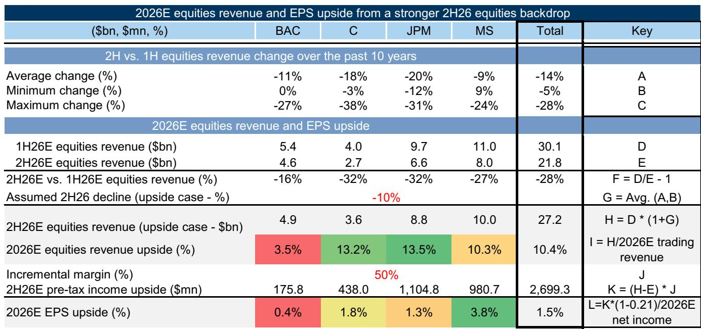
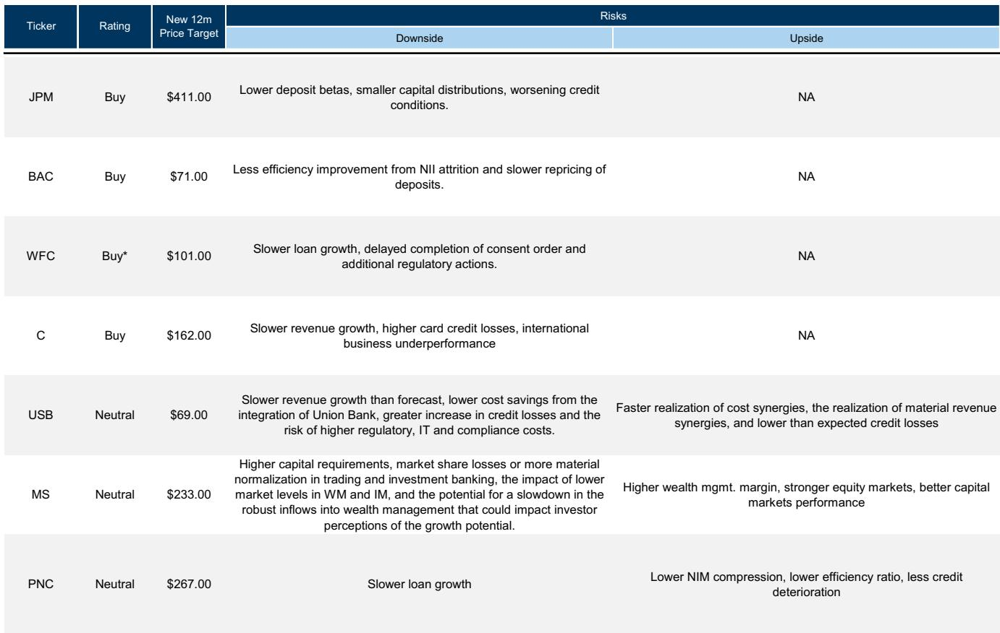
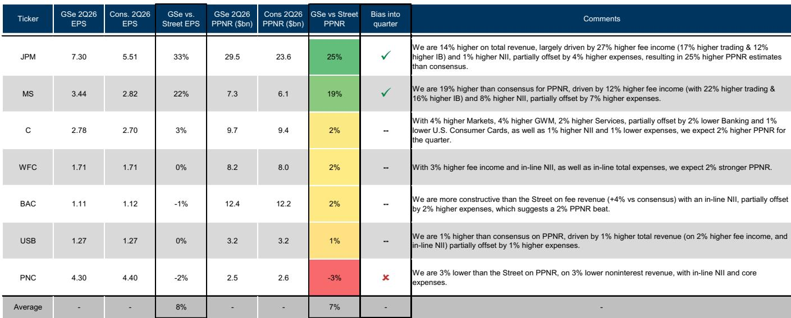

# GS：美国IPO筹资额或超2021年峰值，银行收入预期差显现

进入2026年第二季度财报季，GS美国银行团队发布了一份基调清晰的预览报告。核心判断是：在贷款强劲增长、资本市场活动活跃、以及管理层持续控制费用的多重作用下，美国大型银行正在进入一个多年运营杠杆释放周期。估值虽然已从年初有所修复，但收入端的结构性改善尚未被市场充分关注。

这份报告覆盖了JPM、BAC、C、WFC、MS、USB、PNC等主要银行。分析师Richard Ramsden团队认为，市场当前的关注点应从前几年的“利率走向”转向“收入质量与可持续性”。净利息收入（NII）的驱动力正在从利率本身切换为贷款量的真实增长，而国际机构和交易业务的收入弹性则提供了额外的观察空间。

## 1. 贷款增长正在取代利率成为NII的核心引擎

报告指出，行业贷款和存款增速正在加速，2026年第二季度至今，同比增幅分别约为6.1%和6.2%。GS覆盖银行的贷款增速预期更高，达到8%的同比增长。其中，商业贷款（特别是C&I和NDFI）是主要驱动力。

与以往周期不同，当前的NII增长并非依赖利率上行。市场远期曲线虽已定价年底前有一次加息，但GS测算，即便出现25个基点的平行上移，对2027年NII和EPS的正面影响也仅为1.0%和1.4%。真正的结构性变化在于：银行正在通过固定利率资产的持续重定价和稳定的存款贝塔值，将贷款量的增长转化为真实的收入增长。

> **KC评论：** 这意味着读者需要调整评估银行公司的分析框架。过去两年，市场习惯于用利率预期来观察银行公司。但报告传递的信号是，贷款量的内生增长和资产重定价的累积效应，正在成为更可持续的利润来源。完整的报告中有详细的贷款增长分项数据和存款贝塔值演进图表，值得细读。

## 2. 资本市场收入存在被低估的可能

这是报告中最具弹性的部分。GS组合观察策略团队预计，2026年美国IPO总筹资额将达到2250亿美元，这不仅远高于2010-2025年均值，甚至比2021年的峰值还高出95%。若计入即将解禁的约4900亿美元锁定期公司，潜在上行空间更大。

GS估算，2026年美国IPO费用池规模约在45亿至90亿美元之间，同比增长90%至280%。而当前市场对银行2026年ECM收入的预测平均仅增长约25%。这是一个显著的预期差。

更关键的是，报告指出ECM收入与公司交易收入之间存在高度相关性（R-squared为63%）。这意味着IPO活跃不仅直接贡献国际机构收入，还会通过提升二级市场交易量产生乘数效应。GS测算，若2026年下半年公司交易收入仅环比下降10%（而非市场当前预期的28%），则全年公司交易收入有约10.5%的上行空间。

> **KC评论：** 这个部分的逻辑链条清晰且可验证。市场对国际机构收入的预测往往滞后于实际活动。报告中的Exhibit 10至Exhibit 16提供了从IPO筹资额到费用池再到交易收入溢价的完整推导路径。对于关注银行收入结构变化的读者，这部分是值得读内容。

## 3. 运营杠杆的释放尚未被充分关注

报告的核心判断之一，是大型银行正在经历一个多年运营杠杆周期。GS预计，2026年核心收入增长约11%，而核心费用增长仅约7%，从而带动核心效率比率下降约200个基点。2027年预计仍有约120个基点的改善。

这种费用纪律并非短期行为。报告指出，自2024年第一季度以来，除JPM外的大型银行员工总数已下降约5%。同时，银行持续将节省的成本再研究于技术、AI和流程再造，以提升长期生产力。

GS特别强调了BAC、C和WFC三家公司。BAC的NII增长预期高于大型银行平均水平，且其资产敏感型资产负债表在利率稳定环境下更具优势。C则通过转型计划推动核心收入复合增长，同时利用DTA释放和更严格的RWA部署提升资本效率。WFC尽管年内表现落后于同业，但GS认为其NII目标可实现，且费用增长控制得当，当前估值提供了有吸引力的观察点。

## 4. 报告尚未完全回答的关键问题：估值修复后的空间

报告承认，银行公司在2026年第二季度已上涨17%，主要由估值倍数扩张驱动。当前板块远期市盈率约为12.5倍，处于过去十年约80%分位数，相对标普500的估值倍数也略高于历史平均水平。GS对此的表述是“估值看起来合理”。

但问题是：如果收入端的结构性改善持续兑现，当前的估值是否仍有上行空间？报告没有直接给出答案，而是将判断权交给了读者。从历史经验看，运营杠杆周期往往伴随着估值溢价的持续扩大，但前提是收入增长的可持续性得到验证。即将到来的财报季，将是检验这一逻辑的第一个重要节点。

For informational purposes only. Portions may be generated,translated,summarized,or edited with AI assistance based on source materials and may contain omissions or errors. Please verify independently. This is not investment,legal,tax,accounting,or other professional advice.

