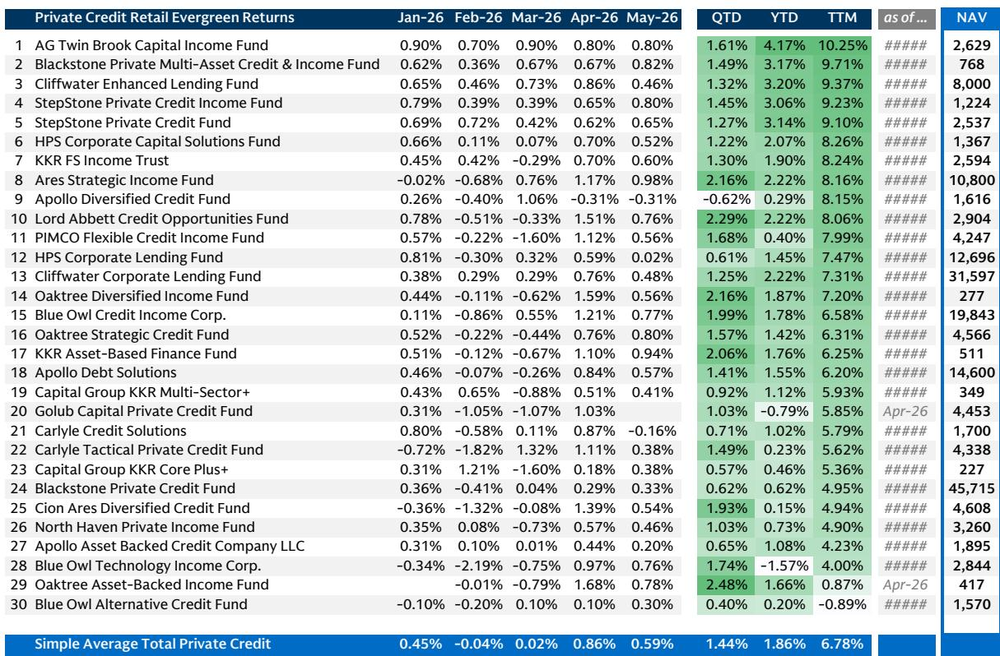
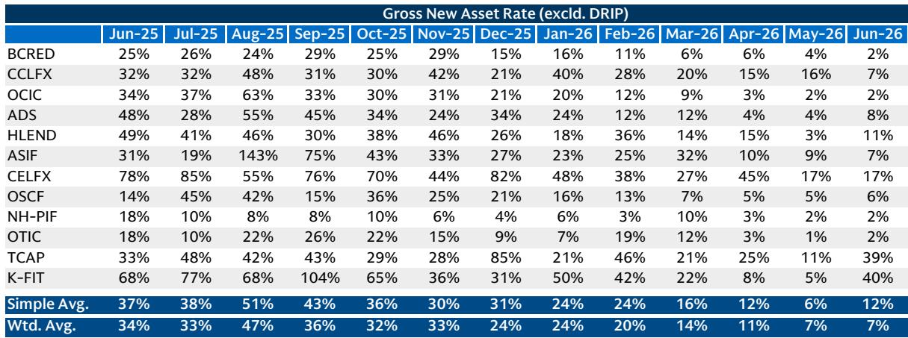
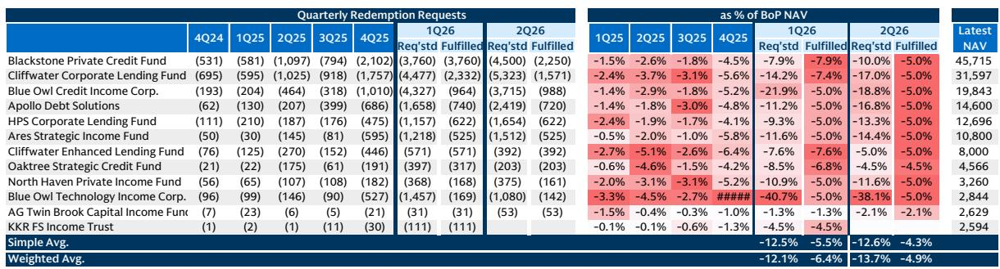

# 零售私募信贷并未崩溃，但复苏将是选择性的，而非普遍性的

围绕零售私募信贷的讨论，此前多集中于对流动性问题的担忧。赎回请求在增加，排队现象在累积，新增资金流入大幅减少。直觉上，人们倾向于做出最坏的假设。这种直觉并不准确，但实际情况比简单的安抚更为复杂。2026年第二季度的数据显示，系统面临一定压力，但并非危机。加权平均赎回请求率升至期初资产净值的13.7%，高于第一季度的12.1%。这一水平确实偏高。但增速正在放缓，部分管理人报告赎回请求有所下降。真正的故事并非关于系统性脆弱，而是关于赢家与输家之间差距的扩大。

关键洞察在于，零售私募信贷市场正从普遍承压阶段，转向选择性复苏阶段。能够脱颖而出的基金，并非那些规模最大或品牌最知名的，而是那些赎回排队较短、投资表现更稳健的基金。这是一个战略分化的时刻。对于配置者、财富管理机构和资产管理人而言，问题已不再是该资产类别能否存活，而是哪些具体工具能够发展壮大，以及如何为未来12至18个月进行布局。

数据揭示了将定义下一阶段的三个结构性变化。首先，赎回排队现象真实存在但可控，且清理时间表已可衡量。其次，读者行为的地域分化表明，以美国为中心的稳定态势可能加速复苏。第三，也是最重要的一点，表现分化正在以将永久重塑市场份额的速度扩大。能够将强劲净回报与低赎回压力相结合的基金，将捕获下一波资金流入。其他基金则将面临长期停滞。

## 赎回排队时间在延长，但清理时间表现已可见且可控

第二季度数据中最引人关注的一点，是未满足赎回请求的增长。这些请求目前约占行业资产净值的9%，高于第一季度的约6%。乍看之下，这似乎是一个日益严重的问题。但如果考虑其机制，解读会有所不同。基金将每季度赎回上限设定为资产净值的5%。13.7%的赎回请求与4.9%的已执行赎回之间的差距，意味着约64%的请求被推迟。这是一个较大的积压，但并未呈指数级增长。赎回请求的增速从第一季度到第二季度有所放缓。更重要的是，部分管理人的相对赎回金额出现下降。

其影响是数量层面的，而非质量层面的。按当前执行率，行业可能需要到年底才能清理完现有排队。对于希望获得流动性的读者来说，这段时间较长，但这并非偿付能力危机。没有基金被迫进行折价出售。整体来看，流动性水平保持健康。风险不在于突然崩溃，而在于读者信心的缓慢流失，这可能导致净流出持续数个季度。需要关注的关键变量不是排队的相对规模，而是新请求的流入速度与排队清理速度之间的相对关系。

对于资产管理人而言，战略问题在于能否在不触发流动性事件的情况下加速清理排队。这将取决于他们吸引新资金流入的能力。这便引出了第二个结构性变化。

## 新增资金流入已趋稳，但复苏集中在美国读者

第二季度新增资金流入较第一季度环比下降约50%，新增资产年化率已从一年前的30%以上骤降至7%。这些数字确实显著。但月度数据则显示出更令人鼓舞的趋势。大多数基金6月份的流入量与5月份相比保持稳定，部分基金甚至有所改善。下降速度正在趋平。这是复苏的第一个必要条件。

第二个条件是地域因素。数据显示，美国本土读者与国际读者之间存在明显分化。在一家大型基金中，美国本土的赎回请求率降至约4.3%，而离岸读者的赎回率则升至约12.5%。在另一家基金中，美国本土的请求量低于第一季度水平，且请求量在第二季度申购期后半段有所放缓。非美国读者，尤其是家族办公室，一直是赎回压力的主要来源。由于非美国读者在该群体总资产净值中的占比不足25%，其影响力有限。

这种地域分化之所以重要，有两个原因。首先，它表明总赎回量的峰值可能已接近，因为最大且最稳定的读者群体正在趋于平静。其次，它意味着复苏将是不均衡的。国际敞口较大的基金可能面临更长的赎回周期。以美国零售和财富渠道读者为主的基金，则更接近稳定点。对资产管理人而言，战略启示很明确：将美国财富渠道作为未来资金流入的引擎，并接受国际资金流在可预见的未来仍将构成拖累。

## 表现分化速度超预期，将重塑市场份额

零售私募信贷市场中最被低估的动态，是投资表现差距的扩大。过去十二个月的净回报率，高端超过10%，低端则在个位数中低段。两者差距约为500至700个基点。在一个零售读者对表现日益敏感、流动性受限的市场中，这一差距将成为市场份额变化的主要驱动力。

逻辑很简单。陷入赎回排队的读者会将自己当前基金的表现与替代方案进行比较。如果他们的基金净回报率为4%，而竞争对手为10%，那么等待赎回并转换的动机就会变得强烈。反之，表现强劲的基金将面临更低的赎回压力和更高的资金流入，形成良性循环。报告明确指出，根据这一筛选标准，TPG、Ares、BlackRock和Brookfield的非交易型BDC相对处于有利位置。但其影响远不止这些名字。

对于该领域的每一位资产管理人而言，战略问题是其基金是否处于表现分化曲线的有利一侧。如果是，他们应积极推广其业绩记录，为资金流入做好准备。如果不是，他们将面临一段净流出期和可能难以逆转的声誉损害。采取纠正措施的窗口期很窄。表现数据是回顾性的，但读者行为是前瞻性的。能够在未来两个季度展现改善表现的基金，仍可能抓住复苏机会。而持续表现不佳的基金，将发现自己处于持续数年的结构性劣势。

## 报告未完全解答的问题：对基础信贷市场的二阶效应

报告聚焦于资金流向、赎回排队和读者行为。它并未完全解决对基础私募信贷市场的二阶效应。如果基金面临净流出且无法部署新资本，依赖私募信贷融资的公司会发生什么？答案并不简单。

一种可能性是，资金流入放缓将收紧对中端市场借款人的信贷条件，尤其是那些评级较低或资本结构更复杂的借款人。如果私募信贷基金是净卖方或无法做出新承诺，这些借款人的资金成本可能会上升。这反过来可能推高违约率，进一步给基金表现带来压力。这是一个报告未建模的反馈循环。

另一个悬而未决的问题是私募信贷基金份额的二级市场角色。如果零售读者无法直接从基金赎回，他们可能转向二级平台以折价出售其权益。这可能创造一个平行的定价机制，揭示这些非流动性资产的真实市场价值。如果二级市场价格大幅下跌，可能引发一波公允价值下调，进一步给表现带来压力。报告未涉及这一动态，但这是一个需要关注的关键风险因素。

对于配置者和财富管理机构而言，未解答的问题是，当前的赎回排队是暂时的流动性错配，还是对私募信贷风险更根本性的重新定价。报告的基本情景是，排队将在年底前清理完毕，资金流将趋于稳定。但这一基本情景取决于信贷条件保持稳定。如果信贷条件恶化，排队可能再次增长，复苏可能被推迟到2027年。不确定性不在于方向，而在于速度以及出现第二波风险的可能性。

## 为配置者和财富管理机构提供的决策框架

本报告中的数据可以转化为一个实用的决策框架，供任何配置零售私募信贷或为持有这些基金的客户提供建议的人使用。该框架包含三个维度：流动性风险、表现质量和地域敞口。

首先，流动性风险的最佳衡量指标是未满足赎回请求与资产净值的比率。比率高于10%的基金，可能面临较长时间的净流出期，且部署新资本的能力有限。比率低于5%的基金则处于更有利的位置，甚至可能通过加速赎回来吸引新读者。理想情况是排队短且资金流入强劲的基金，但这很少见。在实践中，最佳可行选择是优先考虑排队适中且资金流入稳定或改善的基金。

其次，表现质量是未来资金流的最重要决定因素。报告显示，顶尖与末位表现者之间的差距正在扩大。配置者应按过去十二个月的净回报率对基金进行排名，并重点关注前四分之一的基金。但他们也应关注表现的一致性。去年回报率为10%但波动性高或信用风险集中的基金，可能不可持续。最佳表现者是那些通过多元化投资组合和严格承销获得稳定、可重复回报的基金。

第三，地域敞口很重要，因为赎回压力集中在美国以外。非美国读者比例高的基金将面临更长的赎回周期和更高的不确定性。以美国零售和财富渠道读者为主的基金则更接近稳定点。对于配置者而言，这意味着基金的读者基础构成是一个战略变量，而不仅仅是人口统计细节。它影响着复苏的时间表和进一步流出的风险。

该框架并非公式，但它提供了一种结构化的方式来评估市场上众多的零售私募信贷基金。在三个维度上得分较高的基金，最有可能在未来12至18个月内获得份额并带来正向回报。在任何一个维度上得分较低的基金，则面临表现不佳的重大风险。

## 复苏将会发生，但仅适用于有准备者

零售私募信贷市场并未陷入危机。它正处于转型期。赎回排队是可控的。资金流入正在趋稳。地域分化指向以美国为中心的复苏。而表现差距的扩大正在创造明确的赢家和输家。对于资产管理人而言，战略要务是站在分化曲线的有利一侧。对于配置者和财富管理机构而言，要务是识别那些最有能力捕获下一波资金流入的基金。

报告提供了做出这些判断的数据。但它也留下了需要持续监测的未解问题。信贷条件会保持稳定吗？基金份额的二级市场会创造新的定价信号吗？国际读者基础会稳定下来还是继续赎回？这些问题将决定复苏是平稳还是波动。

对于认真的读者而言，下一步是深入阅读完整报告，查看原始图表，并将决策框架应用于自己的投资组合。数据是可获取的。分析是清晰的。相对少见缺失的部分是行动。

加入社区以阅读完整报告并查看原始图表。

*仅供参考。部分内容可能基于源材料通过AI辅助生成、翻译、总结或编辑，可能存在遗漏或错误。请独立核实。本文不构成投资、法律、税务、会计或其他专业建议。*

仅供参考。部分内容可能基于源材料通过AI辅助生成、翻译、总结或编辑，可能存在遗漏或错误。请独立核实。本文不构成投资、法律、税务、会计或其他专业建议。

