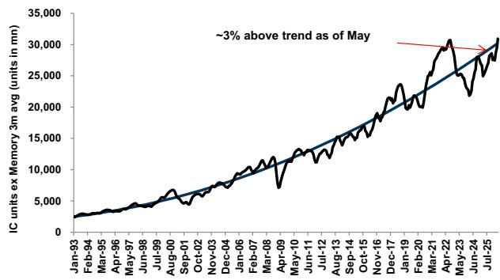
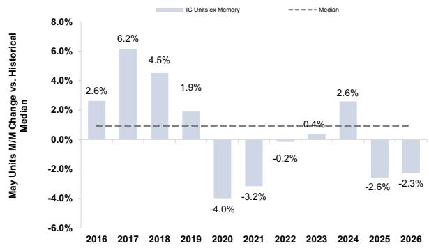
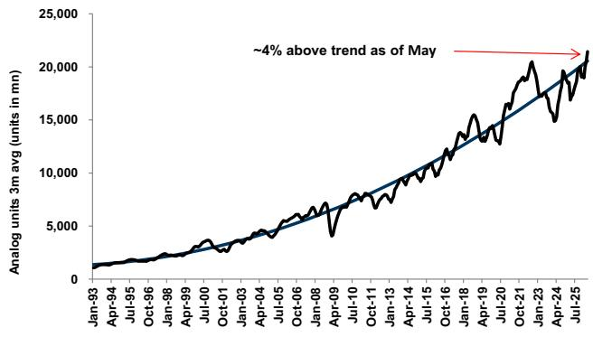
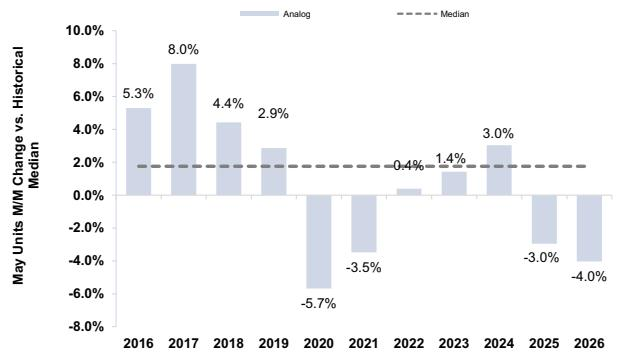
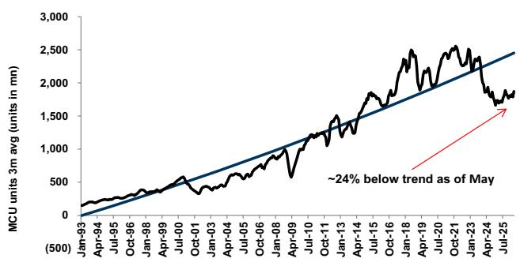
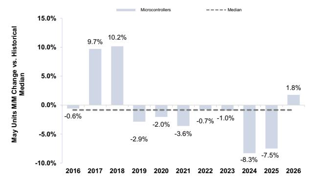
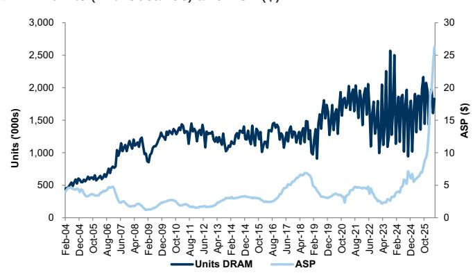
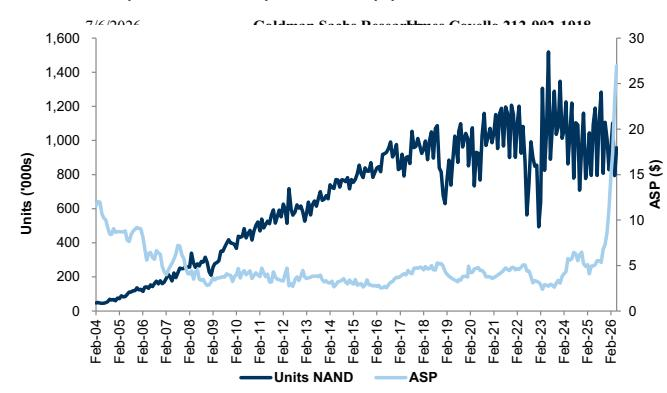

# Americas Technology: Semiconductors: May SIA data shows mixed seasonality after a strong start to year

## Mixed seasonality in May after a strong start to the year

Shipments of integrated circuits units (ex. memory) decreased 2% month over month in May, below typical seasonality, according to data from Semiconductor Industry Association (SIA). Many segments shipped at below-seasonal levels for the month, although NAND, MPUs, and MCUs all saw above-seasonal M/M unit growth. Despite mixed seasonality, overall shipments are now tracking 2% above long-term demand on a three-month moving average basis (vs. 1% below trend in April). Improving trends over the past few months are consistent with companies' constructive commentary, particularly for analog where shipments are now running ~4% above trend. Performance by sub-segment was as follows.

IC ex. Memory: Units were 2.7% above trend vs. 1.7% below in April.

■ Analog: Units were 4.3% above trend, better than 0.3% above trend in April.

■ MCU: Units were 23.7% below trend, better than 27.2% below trend in April.

Exhibit 1: M/M % change in revenue, units and ASPs vs. historical levels

<table><tr><td></td><td colspan="3">Revenue</td><td colspan="3">Units</td><td colspan="3">ASPs</td></tr><tr><td>May 2026</td><td>M/M Rev % Chg</td><td>Hist. M/M % Chg</td><td>Y/Y % Chg</td><td>M/M Unit % Chg</td><td>Hist. M/M Unit % Chg</td><td>Y/Y Unit % Chg</td><td>M/M ASP % Chg</td><td>Hist. M/M ASP %</td><td>Y/Y ASP % Chg</td></tr><tr><td>Total Semiconductors</td><td>16%</td><td>6%</td><td>119%</td><td>-3%</td><td>0%</td><td>13%</td><td>19%</td><td>6%</td><td>94%</td></tr><tr><td>Discretes</td><td>-3%</td><td>1%</td><td>9%</td><td>-5%</td><td>-3%</td><td>4%</td><td>2%</td><td>4%</td><td>5%</td></tr><tr><td>Integrated Circuits</td><td>18%</td><td>7%</td><td>132%</td><td>0%</td><td>3%</td><td>23%</td><td>18%</td><td>7%</td><td>88%</td></tr><tr><td>DRAM</td><td>28%</td><td>25%</td><td>309%</td><td>14%</td><td>25%</td><td>-2%</td><td>12%</td><td>2%</td><td>319%</td></tr><tr><td>NAND</td><td>41%</td><td>17%</td><td>377%</td><td>21%</td><td>19%</td><td>-12%</td><td>17%</td><td>0%</td><td>445%</td></tr><tr><td>ICs ex. Memory</td><td>2%</td><td>1%</td><td>38%</td><td>-2%</td><td>1%</td><td>21%</td><td>4%</td><td>1%</td><td>14%</td></tr><tr><td>MPU</td><td>5%</td><td>2%</td><td>31%</td><td>4%</td><td>1%</td><td>7%</td><td>1%</td><td>2%</td><td>23%</td></tr><tr><td>MCU</td><td>-3%</td><td>-2%</td><td>20%</td><td>2%</td><td>-1%</td><td>14%</td><td>-4%</td><td>-1%</td><td>5%</td></tr><tr><td>DSP</td><td>3%</td><td>-3%</td><td>-1%</td><td>-8%</td><td>3%</td><td>-11%</td><td>12%</td><td>-1%</td><td>11%</td></tr><tr><td>Analog</td><td>-8%</td><td>-2%</td><td>11%</td><td>-4%</td><td>2%</td><td>22%</td><td>-4%</td><td>-3%</td><td>-9%</td></tr><tr><td>Logic</td><td>7%</td><td>3%</td><td>26%</td><td>0%</td><td>0%</td><td>10%</td><td>7%</td><td>2%</td><td>15%</td></tr></table>

## Source: SIA, GS Global Investment Research

Observations: We expect shipments to stabilize above trend in the near term given the duration of below-trend shipments over the past four years, which is consistent with more constructive company commentary on the normalization of demand and customer inventory levels. We continue to focus on Microchip, NXP, and Analog Devices as we look at companies which had shipped furthest below trend in the downturn.

IC Units ex. Memory

IC units ex. Memory relative to trend are shown below (see Exhibit 2).

IC units ex. Memory 3 months average (units in millions)  
Exhibit 2: IC units ex. Memory are ~3% above trend as of May  
  
Source: SIA, GS Global Investment Research  
Exhibit 3: IC units ex. memory were down ~2% M/M, compared to typical history
M/M % change in units

  
Source: SIA, GS Global Investment Research

## Analog

Analog units relative to trend are shown below (see Exhibit 4).

Exhibit 4: Analog units are roughly 4% above trend as of May
Analog units 3 months average (units in millions)

  
Source: SIA, GS Global Investment Research  
Exhibit 5: Analog units were down ~4% M/M, compared to typical history
M/M % change in units

  
Source: SIA, GS Global Investment Research

## Microcontrollers (MCU)

MCU units relative to trend are shown below (see Exhibit 6).

Exhibit 6: MCU units are ~24% below trend as of May
MCU units 3 months average (units in millions)  
  
Source: SIA, GS Global Investment Research

Exhibit 7: MCU units were up ~2% M/M, compared to typical history
M/M % change in units  
  
Source: SIA, GS Global Investment Research

## Memory

DRAM revenues were up 28% M/M, slightly above typical M/M seasonality, driven by very strong ASPs. NAND revenues were up 41% M/M, far above typical M/M seasonality.

Exhibit 8: DRAM units were up 14% M/M, below typical seasonality  
  
Source: SIA, GS Global Investment Research

Exhibit 9: NAND units were up 21% M/M, slightly above typical seasonality
NAND units (in thousands) and ASP ($)  
  
Source: SIA, GS Global Investment Research
