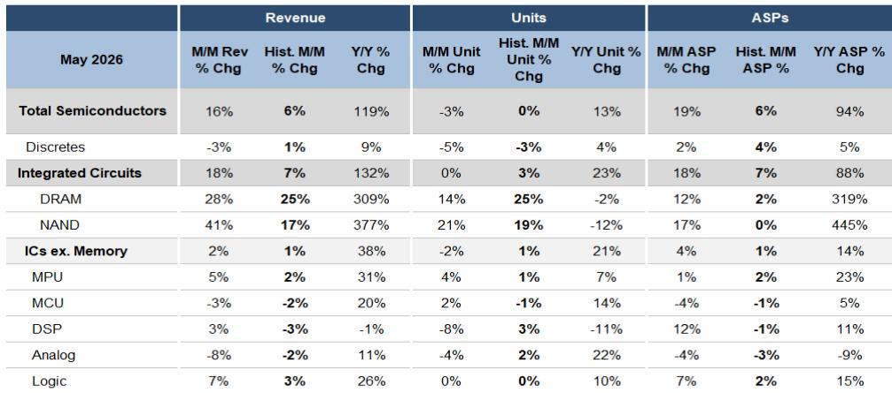

# 半导体行业复苏真实存在，但并非均匀分布：未来六个月将区分领先者与追赶者

2026年5月SIA数据已发布，整体数字表现强劲。半导体总收入环比增长16%，远高于历史平均水平的6%。同比增长达到119%。表面上看，行业似乎正处于强劲的周期性上升阶段。但仔细审视出货量数据，会发现一幅更为微妙且具有战略意义的图景。复苏是真实的，但并非均匀分布。事实上，各细分领域的复苏模式正告诉我们关于本轮周期性质以及哪些公司最有可能受益的关键信息。

5月数据最重要的启示是：整体收入强劲几乎完全由存储领域的定价能力驱动，而许多非存储领域的出货量实际上相对于正常季节性模式正在减速。不包括存储在内的集成电路出货量5月环比下降2%，低于典型的季节性增长。收入与出货量增长之间的这种分歧是当前周期的核心战略难题。这表明复苏并非广泛的需求激增，而是一种更具选择性的、由库存驱动的正常化过程，在不同终端市场和产品类别中表现各异。

对于观察者和企业战略制定者而言，影响是明确的。未来六个月将区分出哪些公司能够维持高于趋势的出货量，哪些公司将出现回落。数据为做出这一区分提供了框架。

## 存储驱动的收入激增掩盖了非存储领域脆弱的出货量复苏

整体收入数字引人注目。DRAM收入环比增长28%，NAND收入环比增长41%。两者均远高于历史季节性平均水平。但出货量的故事则更为温和。DRAM出货量环比增长14%，实际上低于典型的25%季节性增长。NAND出货量增长21%，仅略高于19%的历史常态。因此，收入激增是平均销售价格扩张的故事，而非出货量加速。

这是一个关键区别。存储定价异常强劲，DRAM平均售价环比上涨12%，NAND上涨17%。同比来看，DRAM平均售价上涨319%，NAND平均售价上涨445%。这些是不可持续的增长率。它们反映了一个在低迷时期相对于需求严重供应不足的市场正在修正。但随着供应正常化和新增产能上线，定价能力将不可避免地减弱。问题在于出货量需求能否接棒。

对于非存储领域，情况更令人担忧。模拟出货量环比下降4%，比典型的2%下降更糟。逻辑出货量持平，与历史相符但未显示任何加速。出货量方面相对少见的亮点是微处理器和微控制器，它们实现了超季节性增长。微控制器出货量环比增长2%，而典型降幅为1%，考虑到微控制器出货量仍比长期趋势低24%，这是一个显著的改善。

这种模式表明非存储领域的复苏是真实但脆弱的。在经历了多年低于趋势的表现后，出货量正在趋势上方企稳，但环比势头并非普遍积极。复苏中容易的部分——从去库存低点开始的初步反弹——可能已经过去。

## 模拟已跨越门槛，但微控制器仍是最深的价值机会

5月报告中最令人鼓舞的数据点是模拟的表现。模拟出货量现在大约比长期趋势高出4%，较4月仅高出趋势0.3%有显著改善。这与模拟公司关于需求正常化和客户库存水平回归健康范围的积极评论一致。

对于观察者而言，这是一个有意义的信号。模拟是一个广泛的、周期性的细分领域，几乎触及每个终端市场，从汽车到工业到消费。当模拟出货量决定性地高于趋势时，表明需求环境正在真正改善，而不仅仅是受益于一次性库存补充。数据支持这样一种观点：像Analog Devices这样在低迷时期出货量低于趋势最多的公司，现在处于受益于正常化的位置。

微控制器领域则讲述了一个不同的故事。尽管5月出货量超季节性增长，微控制器出货量仍比长期趋势低24%。这是任何主要细分领域中最大的缺口。差距正在缓慢缩小——4月比趋势低27%——但以目前的改善速度，微控制器出货量还需要好几个月才能达到均衡。

这产生了一个战略问题。微控制器的缺口是结构性疲弱的迹象，可能是由于市场份额被微处理器抢占或系统架构变化？还是仅仅是更深层次库存修正的滞后指标，最终会得到解决？报告没有明确回答这个问题，但环比改善的趋势表明后一种解释更有可能。微控制器敞口较大的公司，如Microchip和NXP，如果复苏继续扩大，可能拥有最大的上行空间。

## 三个月移动平均线显示复苏具有持续性，但二次探底的风险真实存在

SIA数据中最有用的指标之一是出货量相对于长期需求的三月移动平均值。5月，不包括存储在内的集成电路出货量比趋势高出2.7%，高于4月比趋势低1.7%。这是一个明显的改善，表明复苏是持续的，而非一个月的异常。

但环比数据引入了谨慎的说明。5月出货量在几个细分领域低于典型季节性，这意味着复苏并未加速。它正在企稳。在正常的周期性上升中，你会预期看到环比增长超过历史平均水平，因为行业正在弥补失去的阵地。相反，我们看到的是大致符合或略低于正常季节性的增长。

这种模式与由库存正常化而非真正终端需求加速驱动的复苏一致。客户正在补充耗尽的库存，但最终需求的增长速度可能不如供应链所希望的那样快。如果是这样，二次探底——即出货量因库存重建速度快于需求而回落至趋势以下——的风险不容忽视。

低于趋势时期的持续时间在这里很重要。报告指出，出货量在过去四年一直低于趋势。这是一个异常长的低迷期，表明库存修正很严重。严重的修正通常会导致强劲的复苏，但复苏的形态取决于最终需求的轨迹。如果终端市场真正改善，复苏将是持续的。如果不是，我们可能会看到2022-2023年模式的重演，即强劲复苏之后是第二波疲软。

## 报告未完全回答的问题：终端需求之谜

SIA数据非常适合追踪供应链中正在发生的事情，但它没有告诉我们原因。报告提供了出货量、收入和平均售价的详细图景，但没有按终端市场细分数据。我们知道模拟出货量高于趋势，但我们不知道其中有多少是由汽车、工业还是消费驱动。我们知道微控制器出货量仍远低于趋势，但我们无法判断这是因为特定终端市场的库存动态还是更广泛的结构性转变。

这是报告中分析的核心空白。没有终端市场数据，很难评估复苏的可持续性。我们是在看到由工业生产和消费支出改善驱动的真正周期性上升吗？还是我们在看到一个库存补充周期，一旦库存正常化就会消退？这个问题的答案决定了当前高于趋势的出货量是机会还是陷阱。

报告关于出货量短期内可能稳定在趋势之上的结论是合理的，但这是一个短期观点。对于战略观察者而言，更重要的问题是2026年下半年及2027年会发生什么。如果终端需求真正改善，复苏将扩Daiwa深化。如果不是，当前高于趋势的出货量可能被证明是一个峰值。

## 应对周期下一阶段的决策框架

对于试图为未来六个月定位的观察者和企业战略制定者而言，5月SIA数据提供了一个清晰的框架。关键变量不是整体收入数字，而是出货量相对于趋势的轨迹以及每个细分领域的定价能力。

第一个决策点是存储敞口。DRAM和NAND的定价周期异常强劲，该领域的公司短期内可能会继续报告强劲的收入增长。但定价的可持续性是关键风险。观察者应密切关注产能公告和利用率。如果新供应上线速度快于需求增长，定价周期可能迅速转变。存储是基于动量的交易，而非长期结构性头寸。

第二个决策点是模拟和微控制器的敞口。模拟已经跨越趋势，这表明风险回报更加平衡。来自库存正常化的容易收益可能已被定价。相比之下，微控制器仍远低于趋势，这意味着如果复苏持续，有更多上行空间。但微控制器的缺口也带来更多风险，因为它可能反映了尚未完全理解的结构性挑战。

第三个决策点是宏观环境。SIA数据不包括终端市场细分，因此观察者必须与其他数据源进行三角验证。工业生产指数、汽车销售数据和消费电子需求指标都应被监测，以验证供应链信号。如果宏观数据确认终端需求正在改善，当前复苏是可持续的。如果宏观数据好坏参半或走弱，复苏可能完全由库存动态驱动，并可能逆转。

报告对在低迷时期出货量低于趋势最多的公司的偏好具有战略合理性。这些公司拥有最大的追赶潜力。但观察者还应考虑每家公司终端市场的复苏质量。一家对工业自动化敞口较大的公司可能比一家依赖消费类可自由支配支出的公司拥有更可持续的复苏。

## 加入社区阅读完整报告并查看原始图表

5月SIA数据提供了半导体周期所处位置的关键快照，但完整的战略图景需要更深入地研究潜在趋势、竞争动态以及对特定公司和终端市场的影响。原始报告包含详细图表，显示每个细分领域出货量相对于趋势的轨迹，以及使当前数据有意义的历史背景。要获取完整分析和支持数据，请加入社区阅读完整报告并查看原始图表。

*仅供参考。部分内容可能基于源材料通过AI辅助生成、翻译、总结或编辑，可能存在遗漏或错误。请独立核实。这不构成任何专业建议。*

仅供参考。部分内容可能基于源材料通过AI辅助生成、翻译、总结或编辑，可能存在遗漏或错误。请独立核实。这不构成任何专业建议。

