AMERICAS INVESTMENT BANKS

# Ahead of 2Q26 EPS, a reasonably healthy operating backdrop, and fairly attractive entry point

Independent investment bank (IBank) stocks rose ~6% on average in 2Q26, driven entirely by multiple rerating, although underperformed the S&P 500 by 9pp. In our view, the variety of procyclical and countercyclical macro and geopolitical crosscurrents and divergent trends across investment banking have led to an atypically high level of investor debate across the group. All in, we are cautiously optimistic on the group, in light of a reasonably healthy operating backdrop and valuation entry point. Four key themes into quarterly earnings: 1) at potentially the midpoint of the still-healthy M&A growth cycle, what changes could emerge in the two-speed IBanking market, in terms of improvement in mid-cap/sponsor M&A, vs. how much large-cap/strategic M&A can grow from an already strong level; 2) to what extent can IBanks benefit from the robust financing backdrop, as US IPO proceeds reach all-time highs, and AI capex spend continues apace; 3) the cadence of already robust non-M&A advisory growth, specifically within secondaries and restructuring; and 4) whether the somewhat disappointing comp leverage so far this cycle can continue or accelerate. 2Q26 announced M&A volumes were up 65% YoY, driven by strength in large-cap/strategic M&A (up 202%/89% YoY), vs. mid-cap/sponsor M&A (up 34%/10%). ECM volumes were up ~105% YoY on 353% IPOs growth, 79% higher convertibles, and 44% follow-ons growth. Separately, secondaries (e.g., continuation vehicles and LP stakes) volumes rose 58% YoY in 1Q26. With estimates largely unchanged on average across the group, we now forecast 13%/13%/8% 2026/27E/28E total revenue growth YoY, and 130bps/210bps/120bps of YoY pre-tax margin expansion.

In our view, valuations offer modest upside, in the context of the balance of upside and downside risks, with NTM P/Es (on GSe) at ~16.5x, or at 60th %ile multiples over the past 11 years. We expect investor sentiment could remain subdued until there is greater clarity on the sustainability of broader M&A growth beyond large-cap, strategic M&A, such as within sponsor M&A.

James Yaro
+1(212)902-1913 |
james.e.yaro@gs.com
GS & Co. LLC

Divyam Harlalka
+1(332)245-7818 |
divyam.harlalka@gs.com
GS India SPL

Matthew Weng
+1(212)902-8484 |
matthew.weng@gs.com
GS & Co. LLC

Lokesh Kumar Sangewar
+1(332)245-7846 |
lokesh.sangewar@gs.com
GS India SPL

## Table of Contents

Four key themes 5
Top picks 14
Valuation and new vs. old 21
Appendix 25
Disclosure Appendix 27

That being said, given the cycle remains strong, we believe the group could trade above average multiples.

Given the range of macro and geopolitical outcomes, we continue to prefer firms that offer a more steady, structural growth profile, either in terms of robust hiring and outsize growth potential outweighing cyclical factors (Buy-rated EVR and LCLN), or firms that offer more all-weather business models (Buy-rated HLI, PIPR, PJT).

Exhibit 1: IBanks GSe vs consensus into 2Q26 EPS ($)

<table><tr><td>Ticker</td><td>GSe 2Q26 EPS</td><td>Cons 2Q26 EPS</td><td>vs. Street</td><td>Bias into quarter</td><td>Comments</td></tr><tr><td>EVR</td><td>3.13</td><td>2.59</td><td>21%</td><td>√</td><td>We forecast 12% higher revenue on 68% stronger ECM, 8% higher advisory and 14% higher interest income & other. These drive a ~145bps better non-comp ratio, but 25bps higher comp ratio, resulting in a ~125bps higher operating margin and 21% higher EPS.</td></tr><tr><td>FCN</td><td>2.42</td><td>2.26</td><td>7%</td><td>√</td><td>We expect total revenue to come in 1% higher than the Street, with 5%/4%/2% stronger revenue in Economic consulting/Technology/Forensic and litigation consulting, partially offset by 1% lower Corporate finance and restructuring and 1% lower Strategic communications. We are in line with street on adj. operating expenses expenses. Overall, we model pre-tax income to be 3% higher than the Street, and 7% higher EPS.</td></tr><tr><td>MC</td><td>0.64</td><td>0.62</td><td>3%</td><td>√</td><td>We are 2% higher than consensus on revenue, with a 20bps higher operating margin (20bps higher comp ratio but 30bps lower non-comp ratio vs. the Street), resulting in 3% higher EPS.</td></tr><tr><td>LCLN</td><td>0.14</td><td>0.14</td><td>1%</td><td>□</td><td>We model 3% higher total revenue, but 6% higher interest expenses and 4% higher operating expenses, with 160bps higher comp ratio but 90bps lower non-comp ratio, leading to a 3% lower pre-tax income. Overall, we expect a 1% EPS beat vs. the Street on in-line net income but 1% lower share count and 10bps lower tax rate.</td></tr><tr><td>PIPR</td><td>0.90</td><td>0.89</td><td>1%</td><td>□</td><td>We expect 1% higher total revenue vs. consensus, with 3% percent higher institutional brokerage (3% higher equities and 2% higher FICC) and in-line investment banking revenue (with 16% higher municipal financing and 2% higher advisory revenue, partially offset by 16% lower Corporate financing). We model a 10bps lower comp ratio and 20bps lower non-comp ratio, resulting in 1% higher EPS for the quarter.</td></tr><tr><td>HLI</td><td>1.80</td><td>1.81</td><td>0%</td><td>□</td><td>We are 1% lower than the Street on total revenue, with 2% lower Corporate Finance revenue (-6% QoQ), partially offset by 3% higher Restructuring and 1% higher Financial and Valuation Advisory. We forecast a 40bps lower comp ratio but 30bps higher non-comp ratio vs consensus, resulting in an in-line operating income and EPS estimates with street.</td></tr><tr><td>PJT</td><td>1.55</td><td>1.62</td><td>-4%</td><td>□</td><td>We expect total revenue to be 2% lower than consensus with 10bps higher comp ratio and 30bps higher non-comp ratio vs. the Street, resulting in 3% lower operating income and 4% lower EPS expectations for the quarter.</td></tr><tr><td>PWP</td><td>0.14</td><td>0.14</td><td>-5%</td><td>✕</td><td>We model 3% higher total revenue, as well as 2% higher expenses (30bps higher comp ratio but 30bps lower non-comp ratio), coupled with 120bps higher tax rate. Overall, we expect a 5% lower EPS vs the street.</td></tr><tr><td>LAZ</td><td>0.32</td><td>0.51</td><td>-38%</td><td>✕</td><td>We model 9% lower advisory revenue partially offset by 4% higher asset management revenue, leading to 4% lower total revenue, but up 12% QoQ. We expect a 260bps higher comp ratio and 100bps higher non comp ratio vs. consensus, resulting in 32% lower operating income (or 38% lower EPS, accounting for 90bps lower tax rate).</td></tr><tr><td>Median</td><td>--</td><td>--</td><td>1%</td><td>--</td><td></td></tr></table>

Source: Visible Alpha Consensus Data, Company data, GS Global Investment Research

## Four key themes

1. At what appears to be the midpoint of the still-growing M&A cycle, how could the two-speed investment banking market evolve? M&A industry volumes have risen ~90% thus far this cycle, and based on prior cycle trends, there could still be ~65-75pp of growth left, suggesting we are mid-cycle (Exhibit 2). Within this growth, there is a two-speed investment banking market, with 2Q26 announced strategic/large-cap M&A volumes up ~89%/202% YoY, while sponsor/mid-cap M&A volumes are +10%/34% YoY (Exhibit 3, Exhibit 4). We see a structural imperative for a degree of further strategic M&A growth from here, given: 1) the growing need for businesses to have scale; 2) the currently less aggressive US antitrust backdrop; as well as 3) strategic M&A volumes as a % of equal weighted market cap remains at 4.9%, 70bps below the trailing 10-yr average. That being said, strategic volumes are already robust, thus growth from here could be more challenging (Exhibit 8). On the other hand, the sponsor backdrop has remained persistently weak, with 2026 TD sponsor M&A as a share of total M&A at 23% - substantially lower than 34%/32% trailing 5-yr/10-yr average (Exhibit 6). We see this weakness due to both macro and valuation dynamics, such as whether assets are marked appropriately, and the impact of persistently higher interest rates. This has prompted ongoing debate around the cadence and magnitude of an eventual recovery, and what would catalyze this. Notwithstanding this, there remain structural PE M&A drivers over the longer-term, including: 1) large $s of aged, deployed capital that needs to be returned, and large quantities of uncommitted capital that need to be deployed; and 2) potential growth if rates fall and reduce financing costs. Consider that sponsor M&A fees have grown by ~1375% since 2001, vs. strategic fees have risen ~130% (Exhibit 9). Best positioned: strategic M&A-skewed EVR, PJT.

2. To what degree can IBanks benefit from the robust financing backdrop, across large, growing AI Capex spend, and potentially record 2026 IPO proceeds? All in, annualized YTD industry ECM/DCM volumes are up 55%/19% YoY (Exhibit 10, Exhibit 11). AI Capex driving both debt and equity financing has also accelerated this year, with consensus expectations of $770bn of AI Capex in 2026, up ~85% YoY (see report from GS portfolio strategy team here). US IPO proceeds are expected to reach all-time highs in 2026, following four consecutive years of muted issuance, based on GS' portfolio strategy estimates (report here). The portfolio strategy team estimates 2026E US IPO gross proceeds of $225bn, ~530%/95% higher than the 2010-25 average/2021 peak (Exhibit 12). We estimate a 2026 US IPO fee pool of ~$4.5bn-$9.0bn, up ~90-280% YoY, based on a 2-4% representative fee rate (which is modestly lower than the long-term average but reflecting larger deal sizes that have lower fees - Exhibit 14). Healthcare ECM has been one of the strongest ECM sectors, rising 140% YoY YTD (vs. total ECM +68%), and IBanks with ECM businesses are highly levered to healthcare, which should support growth (Exhibit 17). It remains unclear to what degree IBanks could benefit from this strong financing backdrop, given many firms do not have standalone underwriting businesses, EVR has only an ECM business, and only JEF and PIPR have both ECM and DCM, and EVR, JEF and PIPR's underwriting businesses are narrower than those of large banks. All in, ECM+DCM comprised 5%/21%/19% of EVR/JEF/PIPR revenue (Exhibit 15). Nonetheless, our 2026E ECM/DCM forecasts are up 49%/7% YoY across the coverage, in part driven by strength in healthcare ECM (Exhibit 16). Based on Dealogic, healthcare has comprised 55% of ECM across the three IBanks who have the business (Exhibit 18). Best positioned: EVR, PIPR, JEF.

3. Continued growth in the already strong secondaries and restructuring businesses? We expect already strong secondaries and restructuring activity to continue to grow, with these businesses offering structural and countercyclical growth that reduce the procyclicality of M&A. We which we estimate that secondaries + restructuring advisory reached 18% of 2025 total revenue across the IBanks (Exhibit 19). We see structural secondaries growth as GPs and LPs use this product more, but also cyclical growth, with the current PE backdrop continuing to limit traditional M&A and ECM exits for long-held positions, prompting PE to resort ever more frequently to alternative capital return methods, such as continuation funds. A recent Secondaries Investor survey indicates that 85%/70% of those surveyed see valuation gaps/asset competition as top reasons impacting the ability to deploy capital (Exhibit 24). We see pressure from LPs for GPS to return capital continuing to mount, given increasingly aged funds, with our analysis suggesting that 54% of private equity (PE) unrealized value is 5+ years aged, vs. 50% historically (Exhibit 22, Exhibit 23). We see a number of drivers that could drive further growth in restructuring, including: 1) a continued increase in bankruptcy filing (Exhibit 27); 2) macro and geopolitical uncertainty; 3) the forward curve now pricing a rate hike in 2026 (vs.rate cuts as recently as earlier in 2026); and 4) most importantly, private credit issues, with potential AI disruptions to the software sector. We observe that restructuring revenue has a 58% positive R-squared to the absolute level of Fed funds (Exhibit 25Exhibit 26). We forecast 2026E restructuring revenue for the group to remain largely unchanged YoY, and grow 1% in 2027E. Best positioned: EVR, HLI, PJT (Exhibit 19).

## 4. Despite a healthy top-line trajectory, comp leverage remains somewhat elusive: We now model

130bps/210bps/120bps of YoY pre-tax margin expansion in 2026E/27E/28E on average (Exhibit 28). Given crosscurrents within parts of the IBanking market, and the elevated cost of hiring senior bankers, comp leverage across many within the group remains fairly modest. We see comp leverage pushed out, with 80bps/110bps/70bps of comp leverage in 2026E/27E/28E (Exhibit 29). We continue to be constructive on mid-cap skewed IBanks on this theme, given more variable compensation structures, due to less reliance on large fixed comp guarantees and deferred stock, vs. in large-cap M&A. This means that these firms' comp ratios are close to all time record low levels already, supporting strong current pre-tax margins. Further, these have less risk of increasing from here, if the cycle were to worsen.

At what appears to be the midpoint of the still-growing M&A cycle, how could the two-speed

## investment banking market evolve?

Exhibit 2: We believe we are mid M&A cycle, with ~90% M&A growth so far this cycle representing ~55% of the average growth over the past 4 M&A cycles

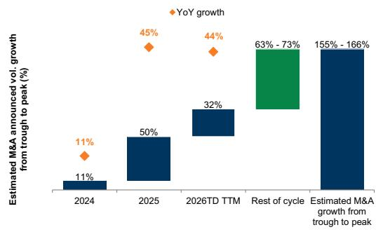  
Source: Dealogic, GS Global Investment Research  
Exhibit 3: We see a two-speed M&A market, with 2Q26 sponsor M&A volumes/fees/deal count changing by +10%/-12%/-10% YoY, vs. +89%/+40%/-19% for strategies...

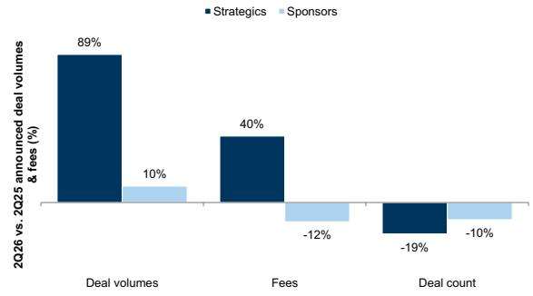  
Source: Dealogic, GS Global Investment Research  
Exhibit 4: ...and 2Q26 announced large-cap M&A volumes are up 202% YoY, vs. small/mid-cap volumes up only 9%/34%

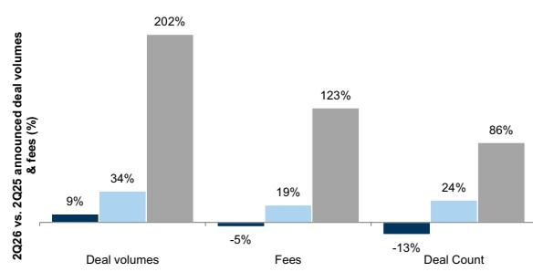  
Note: Small-cap deals = deals valued <$1bn; Mid-cap deals = deals valued between $1bn-10bn; Large-cap deals = deals valued >$10bn  
Source: Dealogic, GS Global Investment Research

Exhibit 5: Further evidencing this two-speed M&A market, the global M&A YTD average deal size is up 33% YoY  
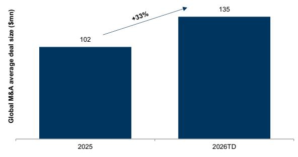  
Source: Dealogic, GS Global Investment Research

Exhibit 6: Sponsor M&A has represented 23% of M&A YTD, vs. 34%/32% over the trailing 5-yr/10-yr averages  
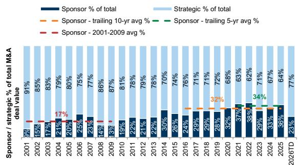  
Source: Dealogic, GS Global Investment Research

Exhibit 7: 2026 ann. sponsor M&A volume is at 2.1% of equal weight global market cap, vs. 2.5% on average over the past 10 years...  
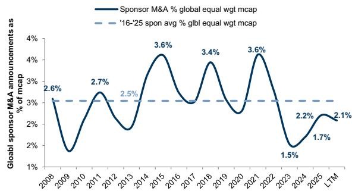  
Source: Dealogic, FactSet, GS Global Investment Research

Exhibit 8: ...while strategies are at ~5.0% of equal weight market cap, below the 5.6% trailing 10-yr avg.

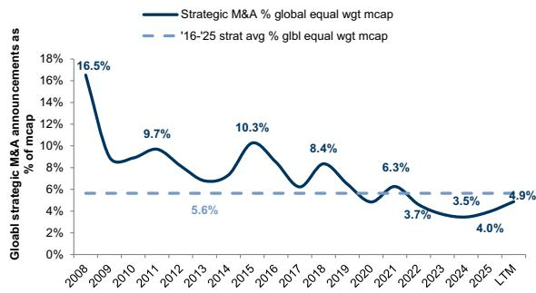  
Source: Dealogic, FactSet, GS Global Investment Research  
Exhibit 9: However, sponsor M&A remains a structural growth area of M&A, as fees have increased by ~1375% since 2001, vs. ~130% for strategies

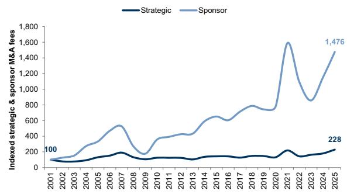  
Source: Dealogic, GS Global Investment Research

To what degree can IBanks benefit from the robust financing backdrop, across large, growing AI Capex spend, and potentially record 2026 IPO proceeds?

Exhibit 10: ECM volumes have continued to grow since the trough of 2022, rising 55% YoY (annualized)...

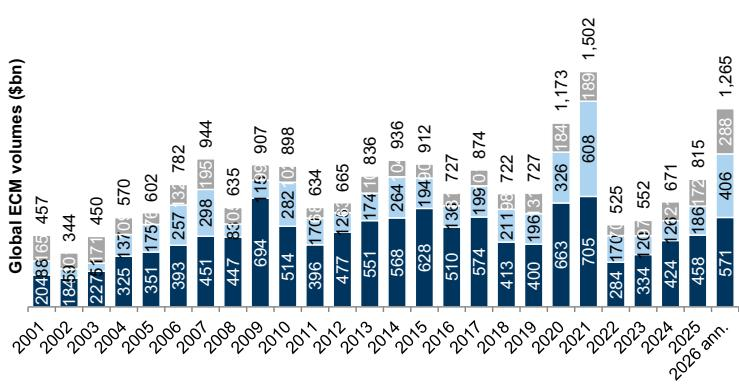  
Source: Dealogic, GS Global Investment Research  
Exhibit 11: ...while industry DCM volumes are up 19% YoY (annualized)

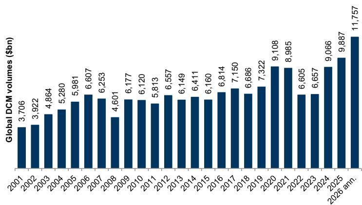  
Source: Dealogic, GS Global Investment Research

Exhibit 12: GS portfolio strategy projects 2026 IPO gross proceeds at a record $225bn...  
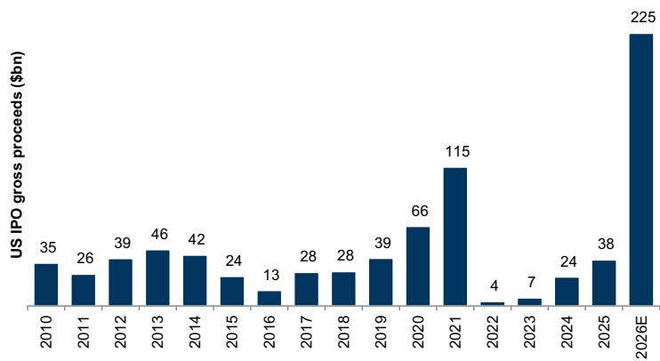  
Note: Data from GS Portfolio Strategy; Universe consists of US deals greater than $25mn in value
Source: FactSet, GS Global Investment Research

Exhibit 13: ...with expiring lockups to further increase equity supply along with shares floated at IPO  
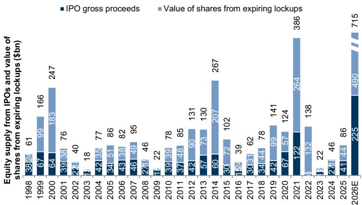

Note: Data from GS Portfolio Strategy; Value of shares from expiring lockups calculated as shares available for trading at lockup expiry date multiplied by the share price at the expiry date. Lockup expiry data based on data in company filings captured by FactSet. These data understate the total value of locked up shares because they are only available for roughly 60% of IPOs in our database.

Source: Bloomberg, FactSet, GS Global Investment Research

Exhibit 14: We estimate a 2026 US IPO fee pool of ~$4.5bn-9.0bn, up ~184% YoY at the mid-point

<table><tr><td colspan="5">Estimation of 2026 US IPO fee pool</td></tr><tr><td>$bn / %</td><td>Scenario 1</td><td>Scenario 2</td><td>Scenario 3</td><td>Key</td></tr><tr><td>GSe 2026E US IPO proceeds</td><td></td><td>225</td><td></td><td>A</td></tr><tr><td>Fee rate</td><td>2%</td><td>3%</td><td>4%</td><td>B</td></tr><tr><td>2026E US IPO fee pool</td><td>4.5</td><td>6.8</td><td>9.0</td><td>C = A * B</td></tr><tr><td>Implied YoY</td><td>89%</td><td>184%</td><td>279%</td><td>D = C / 2025 fees</td></tr><tr><td>vs. 2021</td><td>-53%</td><td>-30%</td><td>-6%</td><td>E = C / 2021 fees</td></tr></table>

Note: We consider US IPO deals greater than $25mn in value.

Source: Dealogic, GS Global Investment Research

Exhibit 15: 7%/8% of 2025 revenue was from ECM/DCM in 2025  
■ ECM ■ DCM  
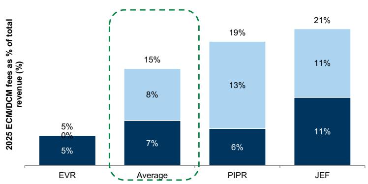  
Note: Note: For PIPR, we assume ECM is 50% of corporate financing while DCM is Municipal financing + 50% of corporate financing.  
Source: Company data, GS Global Investment Research  
Exhibit 16: We forecast 2026E ECM/DCM fees rising ~49%/7% YoY on average across our covered IBanks...

ECM DCM  
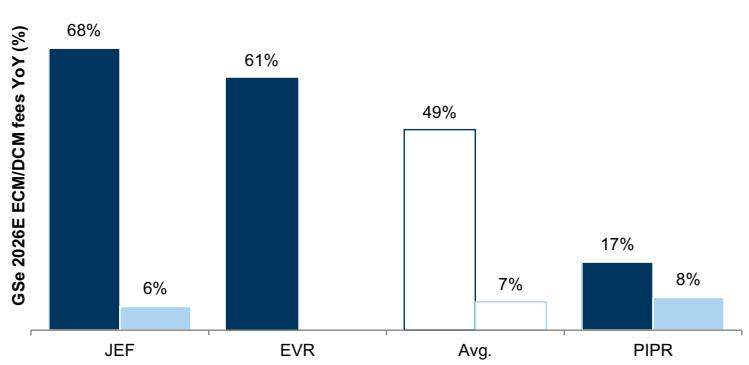  
Note: For PIPR, we assume ECM is 50% of corporate financing while DCM is Municipal financing + 50% of corporate financing.  
Source: Company data, GS Global Investment Research  
Exhibit 17: ...driven in part by strong 2026 YTD Healthcare ECM, which is up 140%, vs. all ECM up 68%...

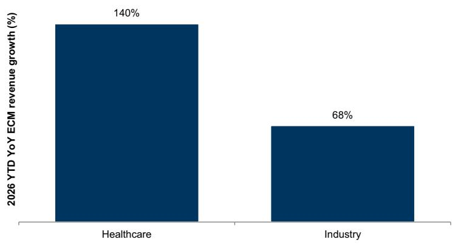  
Source: Dealogic, GS Global Investment Research

Exhibit 18: ...with healthcare comprising 55% of their ECM over the past 5 years  
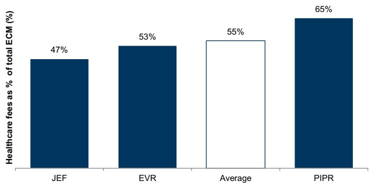  
Source: Dealogic, GS Global Investment Research

## Continued growth in the already strong secondaries and restructuring businesses?

Exhibit 19: We estimate that 18% of IBanks revenue is derived from the combination of secondaries and restructuring revenue

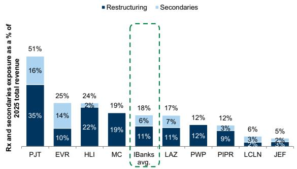  
Note: For LCLN, we estimate restructuring is 40% of capital advisory revenue; for peers, due to limited disclosure, restructuring share of advisory revenue is est., except for MC/HLI. We estimate M&A revenue based on TTM M&A share of advisory revenue.  
Exhibit 20: While sponsors M&A are projected to decline, secondaries activities remain strong and growing

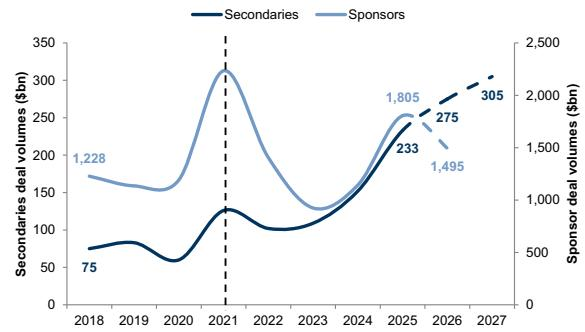  
Note: 2026 is annualized.  
Exhibit 21: Secondaries funds raised rose 58% YoY in 1Q26  
Source: Dealogic, Lazard Private Capital Advisory, GS Global Investment Research

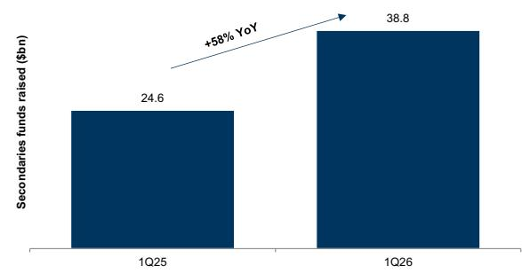  
Note: 1Q25 funds raised exclude an outsized Ardian deal of $30bn.  
Source: Secondaries Investor, GS Global Investment Research

Exhibit 22: Buyout funds are substantially more aged than normally, with 54% of unrealized value from 5+ year vintages, above the 50% 5-year average...

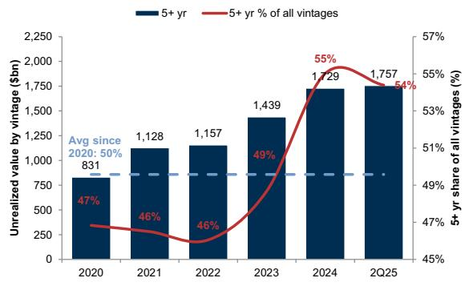  
Source: Preqin, Company data, GS Global Investment Research

Exhibit 23: ...with the absolute $s of 5+ year aged unrealized capital continuing to rise each year since 2020

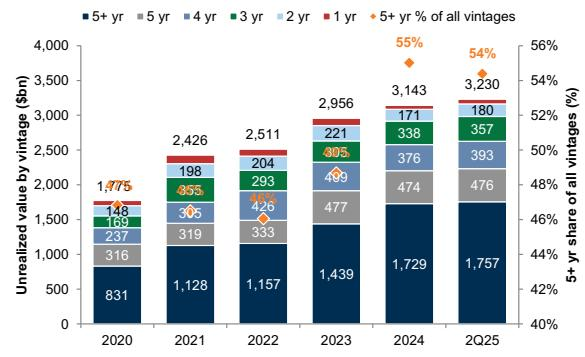  
Source: Preqin, Company data, GS Global Investment Research

Exhibit 24: Pricing/valuation gaps and asset competition seem to be the top factors affecting capital deployment by sponsors

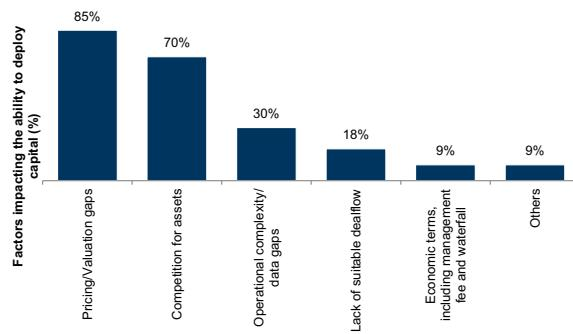  
Note: This survey was conducted by Secondaries Investor with respondents being secondaries buyers only  
Source: Secondaries Investor Global Market Survey 2026

Exhibit 25: IBank restructuring revenue is negatively correlated (-13%) with US GDP growth...  
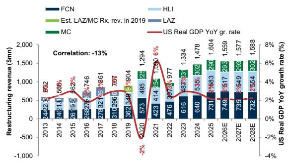  
Note: We use LAZ and MC revenue in periods where data is available, and estimate LAZ/MC Rx. revenue in 2019 by taking an average of 2018 LAZ Rx revenue and 2020 MC Rx revenue.

Exhibit 26: ...and positively correlated with the Fed funds rate (58% R-squared)  
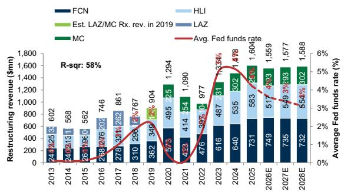  
Note: We use LAZ and MC revenue in periods where data is available, and estimate LAZ/MC Rx. revenue in 2019 by taking an average of 2018 LAZ Rx revenue and 2020 MC Rx revenue.

Exhibit 27: Bankruptcy filings have been on the rise for 4 consecutive years, rising at a 17% CAGR  
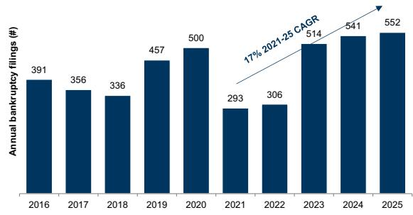  
Source: 2026 Octus Intelligence, PWC  
Source: The FRED, Company data, GS Global Investment Research

Source: The FRED, Refinitiv Eikon, Company data, GS Global Investment Research

## Despite a healthy top-line trajectory, comp leverage remains somewhat elusive

Exhibit 28: Across the IBanks, we forecast ~130bps/210bps/120bps of YoY pre-tax margin improvement in 2026E/27E/28E...

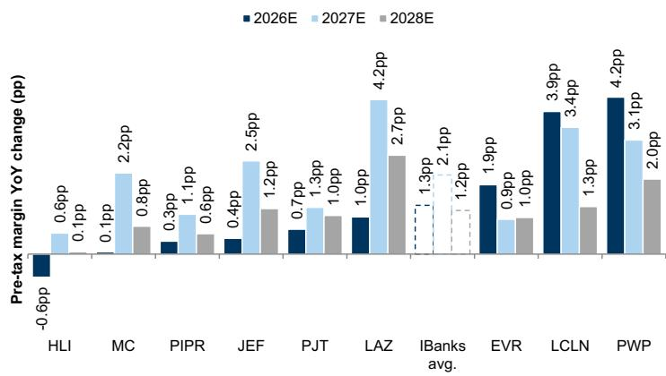  
Source: Company data, GS Global Investment Research

Exhibit 29: ...with 2026E/27E/28E YoY comp leverage of 80bps/110bps/70bps  
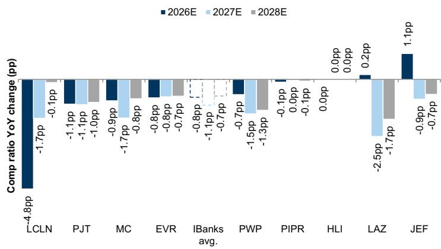  
Source: Company data, GS Global Investment Research

Exhibit 30: We expect diverging trends on comp ratio leverage across IBanks

<table><tr><td colspan="16">Advisor & IBank comp ratio historicals and GSe forecasts</td></tr><tr><td rowspan="2">(%)</td><td rowspan="2">2020</td><td rowspan="2">2021</td><td rowspan="2">2022</td><td rowspan="2">2023</td><td rowspan="2">2024</td><td rowspan="2">2025</td><td rowspan="2">2026E</td><td rowspan="2">2027E</td><td rowspan="2">2028E</td><td rowspan="2">2017-19 avg.</td><td>&#x27;26E vs.</td><td>&#x27;27E vs.</td><td>&#x27;28E vs.</td><td rowspan="2">26E vs. 23</td><td rowspan="2">26E vs. 21</td></tr><tr><td colspan="3">17-&#x27;19 avg.</td></tr><tr><td>EVR</td><td>58.9%</td><td>55.7%</td><td>60.9%</td><td>67.6%</td><td>65.7%</td><td>64.2%</td><td>63.4%</td><td>62.6%</td><td>61.9%</td><td>57.7%</td><td>6%</td><td>5%</td><td>4%</td><td>-4.3%</td><td>7.7%</td></tr><tr><td>HLI</td><td>62.2%</td><td>61.7%</td><td>61.5%</td><td>61.5%</td><td>61.5%</td><td>61.5%</td><td>61.5%</td><td>61.5%</td><td>61.5%</td><td>62.0%</td><td>0%</td><td>0%</td><td>0%</td><td>0.0%</td><td>-0.2%</td></tr><tr><td>JEF</td><td>53.8%</td><td>47.5%</td><td>49.8%</td><td>53.9%</td><td>52.0%</td><td>52.6%</td><td>53.4%</td><td>52.8%</td><td>52.2%</td><td>55.3%</td><td>-2%</td><td>-2%</td><td>-3%</td><td>-0.5%</td><td>6.0%</td></tr><tr><td>LAZ</td><td>59.5%</td><td>58.5%</td><td>59.8%</td><td>69.8%</td><td>65.9%</td><td>65.5%</td><td>65.5%</td><td>63.0%</td><td>61.3%</td><td>56.1%</td><td>9%</td><td>7%</td><td>5%</td><td>-4.3%</td><td>7.0%</td></tr><tr><td>LCLN</td><td>--</td><td>--</td><td>--</td><td>--</td><td>67.9%</td><td>66.0%</td><td>61.2%</td><td>59.5%</td><td>59.4%</td><td>--</td><td>--</td><td>--</td><td>--</td><td>--</td><td>--</td></tr><tr><td>MC</td><td>59.3%</td><td>58.5%</td><td>63.0%</td><td>82.7%</td><td>69.0%</td><td>65.8%</td><td>64.8%</td><td>63.2%</td><td>62.3%</td><td>59.5%</td><td>5%</td><td>4%</td><td>3%</td><td>-17.9%</td><td>6.4%</td></tr><tr><td>PIPR</td><td>61.9%</td><td>60.0%</td><td>62.5%</td><td>63.6%</td><td>62.0%</td><td>61.4%</td><td>61.3%</td><td>61.2%</td><td>61.2%</td><td>62.9%</td><td>-2%</td><td>-2%</td><td>-2%</td><td>-2.3%</td><td>1.3%</td></tr><tr><td>PJT</td><td>63.5%</td><td>63.0%</td><td>64.1%</td><td>69.8%</td><td>69.0%</td><td>67.1%</td><td>66.0%</td><td>64.9%</td><td>63.9%</td><td>64.1%</td><td>2%</td><td>1%</td><td>0%</td><td>-3.8%</td><td>3.0%</td></tr><tr><td>PWP</td><td>70.4%</td><td>62.9%</td><td>66.7%</td><td>70.1%</td><td>67.2%</td><td>68.2%</td><td>67.5%</td><td>65.9%</td><td>64.5%</td><td>66.3%</td><td>1%</td><td>0%</td><td>-2%</td><td>-2.6%</td><
