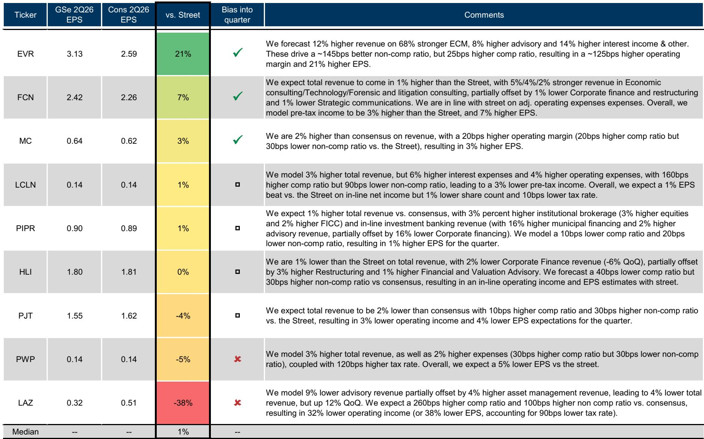
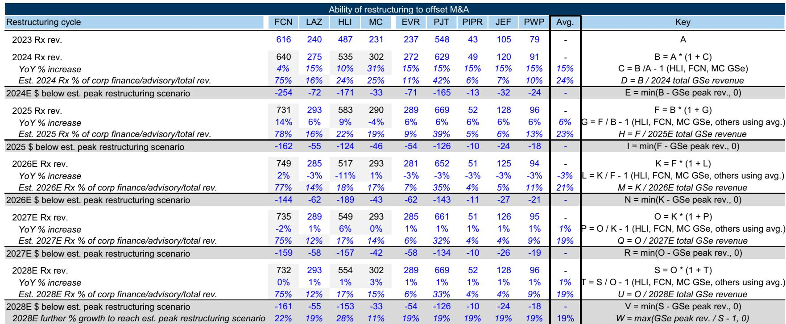
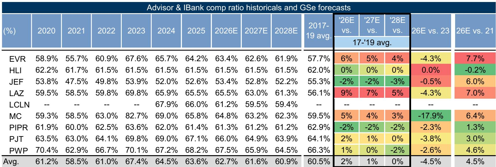

# 投行周期中段的分化：下一阶段回报取决于哪些收入流加速，哪些不会

独立投行板块已进入一个非典型复杂时期。2026年第二季度，相关公司报价上涨约6%，完全由估值倍数扩张驱动，但该板块相对大盘指数落后9个百分点。这种报价变动与相对表现之间的背离并非噪音。它反映出市场正在艰难地为一种根本性的双速复苏定价。对于观察者而言，核心问题不再是周期是否完整，而是周期的哪些部分将在此后带来增长，以及哪些公司具备结构性优势来捕捉这些增长。

我们对该板块持谨慎乐观态度。经营环境相对健康。估值存在适度上行空间，未来十二个月市盈率约为16.5倍，处于过去十一年来的第60百分位。但轻松的比较阶段已经过去。2026年上半年受益于大型战略并购的激增、创纪录的IPO管线以及AI相关资本开支的加速。下半年需要更细致的评估：中型并购和私募股权并购能否缩小差距？非并购咨询收入能否维持动能？在多年令人失望的经营杠杆之后，薪酬杠杆能否最终显现？

本文梳理了关于该板块最新研究中的四个相互关联的主题，每个主题对不同公司的前景都有不同的含义。随后指出该报告留下的关键分析空白，提供一个决策框架，并以值得进一步研究的未解问题作为结尾。

## 双速并购市场真实存在，下一阶段回报取决于较慢的一半能否加速

当前周期最重要的结构性特征是战略大型并购与私募股权中型并购之间的分化。2026年第二季度，已公布的战略并购交易量同比增长89%，其中大型交易飙升202%。相比之下，私募股权并购仅增长10%。这并非暂时现象。年初至今，私募股权并购仅占并购活动总量的23%，远低于过去五年34%的平均水平和十年32%的平均水平。

其含义很直接：并购总量增长数据看起来健康，只是因为大型并购部分占据主导。但大型战略并购已处于较高水平。以等权市值计算，战略并购交易量约占5%，比十年平均水平低约70个基点。进一步增长的空间存在，但边际扩张的难度将加大。战略并购的结构性理由依然成立——规模需求、相对宽松的反垄断环境以及获取AI能力的必要性都支持这一点——但基数已经很高。

与此同时，私募股权并购市场是未知因素。其疲软并非通常意义上的周期性。它反映了买卖双方估值错配、高利率对融资成本的持续影响，以及在波动的宏观环境中对资产进行估值的难度。然而，长期结构性驱动力是强大的。自2001年以来，私募股权并购费用增长了约1375%，而战略并购费用仅增长约130%。需要返还的老化已配置资本池规模庞大，而等待部署的未承诺资本规模更大。如果利率下降或估值差距缩小，私募股权并购市场可能急剧加速。

最适合这一情景的公司是那些拥有强大战略并购业务、能够维持当前动能，同时又能参与私募股权活动的公司。Evercore和PJT Partners在这方面表现突出，因为它们以咨询为主的业务模式以及在双速分化两侧都建立了稳固的关系。

## 融资环境异常强劲，但多数投行仅部分受益

股权资本市场正经历一段异常活跃的时期。美国IPO募资额有望在2026年达到历史新高，此前连续四年发行量低迷。估计总募资额约为2250亿美元，是2010年至2025年平均水平的五倍多，几乎是2021年峰值水平的两倍。按费率计算，美国IPO费用池可能在45亿至90亿美元之间，同比增长90%至280%。AI相关资本开支（2026年估计为7700亿美元）正在推动科技、基础设施及相关领域的债务和股权融资。

然而，这些收入的分布极不均匀。许多独立投行没有独立的承销业务。在覆盖的公司中，只有JEF和Piper同时拥有股权和债务资本市场能力。Evercore只有股权资本市场业务。对于这三家公司，2025年股权和债务资本市场收入合计占总收入的5%至21%。对于该板块的其他公司而言，融资热潮主要是一个传导事件，通过增加客户活动间接惠及咨询费用，而非直接通过承销任务。

医疗保健是股权资本市场中特别强劲的领域，年初至今交易量增长140%。对于拥有专注于医疗保健的股权资本市场业务的公司来说，这是一个重要的顺风。但更广泛的观点是，尽管融资环境在历史上非常强劲，但它并非能平等地提升所有公司的潮水。观察者需要区分那些拥有基础设施来获取承销费用的公司，以及那些仅通过次要渠道受益的公司。

该报告预测，覆盖范围内公司2026年股权资本市场和债务资本市场收入分别增长49%和7%。这是一个合理的基线，但它隐含了一个假设，即IPO管线以历史速度转化。如果宏观环境恶化或地缘政治不确定性延迟发行，下行风险可能显著。相反，如果管线进一步加速，上行空间集中在少数公司。

## 非并购咨询收入正成为结构性增长引擎，而非周期性对冲

投行领域最被低估的发展之一是二级市场和重组咨询业务的贡献日益增长。这些业务目前估计占独立投行总收入的18%，它们不仅仅是反周期对冲。它们是具有自身长期驱动因素的结构性增长引擎。

二级市场活动（包括延续基金和有限合伙人份额转让）在2026年第一季度同比增长58%。驱动因素很直接：对于许多私募股权拥有的资产而言，传统的并购和IPO退出渠道仍然受限，迫使普通合伙人寻找替代方式向有限合伙人返还资本。一项近期调查显示，85%的参与者将估值差距列为影响其部署资本能力的首要原因，70%提到了资产竞争。与此同时，54%的私募股权未实现价值现在已持有五年或更长时间，而历史平均水平为50%。普通合伙人产生流动性的压力正在增加，而二级市场是最可行的解决方案。

重组咨询虽然相对规模较小，但也有其自身的催化剂。破产申请正在增加。宏观和地缘政治不确定性仍然较高。远期曲线现在定价2026年加息，这与年初预期的降息形成鲜明逆转。也许最重要的是，私募信贷市场面临潜在干扰，尤其是在软件领域，AI驱动的商业模式变化可能触发契约违约和再融资需求。重组收入与联邦基金利率相对水平有58%的正相关性，这表明利率在更长时间内保持较高水平将是一个顺风。

最适合捕捉这一增长的公司是那些拥有专门二级市场和重组业务的公司。Evercore、Houlihan Lokey和PJT Partners在这些领域尤为突出。对于这些公司而言，非并购咨询为传统并购的周期性提供了缓冲，并且是一个较少依赖双速市场动态的增长来源。

## 薪酬杠杆仍是方程中最令人失望的变量

尽管收入端表现健康，但经营杠杆一直难以实现。该报告模型显示2026年税前利润率扩大130个基点，随后2027年扩大210个基点，2028年扩大120个基点。但在这些数字中，薪酬杠杆被推迟，各年分别仅改善80、110和70个基点。

原因是结构性的。招聘和留住高级银行家的成本已大幅上升。专注于大型战略并购的公司依赖固定薪酬保障和递延股票，这在经济下行时灵活性较低。相比之下，专注于中型公司的公司拥有更多可变薪酬结构，这意味着它们的薪酬比率已接近历史低点，税前利润率强劲。如果周期恶化，中型公司薪酬比率上升的风险较小，因为它们的薪酬已经更直接地与收入挂钩。

这种动态造成了明显的分化。固定薪酬成本高的公司在收入增长放缓时更容易受到利润率压缩的影响。而可变薪酬结构的公司已经实现了市场期待的其他公司尚未实现的利润率改善。

## 报告未完全回答的问题：私募股权并购复苏的时机和催化剂

该报告对私募股权并购增长的结构性理由阐述得很透彻，但留下了时机问题。什么具体催化剂会缩小买卖双方的估值差距？降息是最明显的候选，但远期曲线现在指向加息。宏观经济不确定性的下降可能有所帮助，但这取决于本质上不可预测的地缘政治发展。被迫出售事件，如基金终止或有限合伙人赎回浪潮，可能加速活动，但会伴随资产价格的负面含义。

报告指出，自2001年以来，私募股权并购费用增长了1375%，这是一个强有力的长期论据。但当前周期持续时间已超出许多人的预期，而私募股权复苏尚未实现。观察者需要评估结构性驱动力是否足够强大以克服周期性逆风，或者市场是否高估了复苏的速度。

## 观察者的决策框架

对于评估独立投行领域的观察者，以下框架可能有用。首先，评估每家公司的收入组合，涵盖三个维度：战略与私募股权并购敞口、股权和债务资本市场能力，以及非并购咨询渗透率。其次，评估薪酬结构：可变与固定，以及对利润率韧性的影响。第三，结合周期阶段考虑估值：以未来十二个月收益的16.5倍计算，该板块并不便宜，但也不贵，前提是周期继续。

在所有三个维度上得分较高的公司是那些拥有多元化咨询业务、可变薪酬结构和有意义的非并购收入的公司。那些集中于大型战略并购且固定薪酬成本高的公司更容易受到放缓的影响，但如果私募股权市场复苏，它们也有更大的上行空间。

## 值得进一步研究的未解问题

该报告提出了几个超出其范围的问题。AI相关融资热潮的持久性如何？如果资本开支放缓会发生什么？如果传统并购最终复苏并提供竞争性的退出渠道，二级市场能否继续增长？最重要的是，对于一个目前定价为软着陆的板块，衰退情景会是什么样子？

这些并非无关紧要的问题。它们是区分对行业良好理解与深刻理解的分析空白。对于希望深入探讨这些问题的观察者，完整报告提供了支撑分析的数据和图表。

加入社区阅读完整报告并查看原始图表。

*仅供参考。部分内容可能基于源材料通过AI辅助生成、翻译、摘要或编辑，可能包含遗漏或错误。请独立核实。这不是专业建议。*

仅供参考。部分内容可能基于源材料通过AI辅助生成、翻译、摘要或编辑，可能包含遗漏或错误。请独立核实。这不是专业建议。

