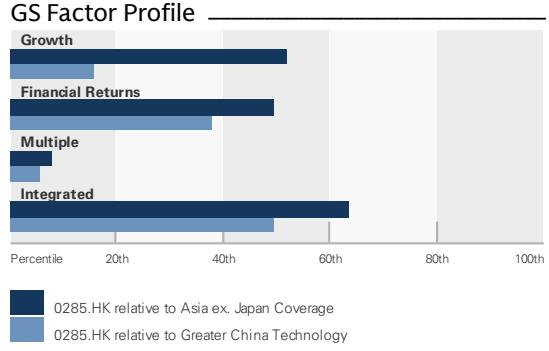
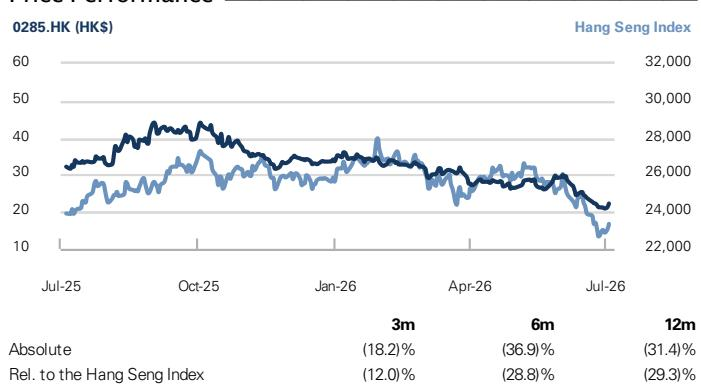
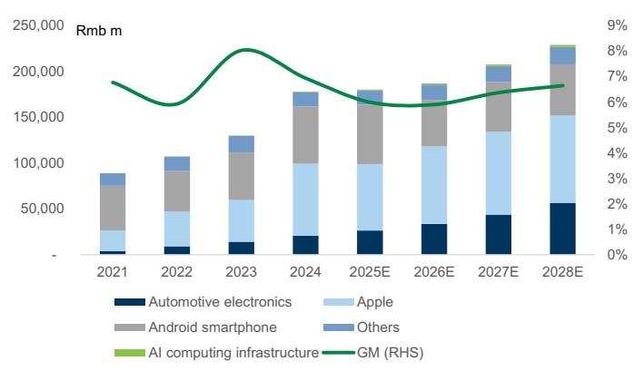

BYDE (0285.HK)

# 存储成本趋稳或支撑2026下半年复苏；基于合理市场定价下调评级

0285.HK

12个月目标价：HK\$21.00

现价：HK\$22.26

下行空间：5.7%

我们预计，在智能手机和PC需求稳定、存储成本相对平稳的背景下，BYDE的营收增长将在2027年逐步恢复。同时，公司产品组合持续升级，来自苹果和比亚迪的收入占比提升，并逐步拓展至AI服务器供应链（液冷、电源）。我们仍预计毛利率将在2028年前逐步修复，但此前对2026-2028年8%-9%毛利率的预测可能难以实现——考虑到2025年第四季度和2026年第一季度毛利率仅为4%-5%，当时较高的存储成本抑制了消费电子和新能源汽车的需求。基于远期基本面指标（净利润同比增速、营业利润率）的下修，以及高存储成本环境下行业估值中枢的调整，我们将目标价从之前的HK\$40下调至HK\$21。相较于我们覆盖的大中华区科技板块平均回报（板块平均隐含上行空间+41%，BYDE隐含下行-2%），我们将BYDE评级从中性下调。

自2026年2月9日将该股纳入中性名单以来，其报价已下跌34%，同期恒生指数下跌14%；我们认为这一表现差异主要源于其AI服务器收入敞口较小，以及高存储成本对其消费电子和新能源汽车终端市场需求的影响。若公司AI服务器业务拓展速度快于预期，或存储成本进一步稳定后消费电子或汽车电子市场出现超预期复苏，我们将对BYDE转为更积极的看法。

## 评级：卖出

Verena Jeng
+852-2978-1681 | verena.jeng@gs.com
GS (Asia) L.L.C.

Allen Chang
+852-2978-2930 | allen.k.chang@gs.com
GS (Asia) L.L.C.

Yifan Hu
+852-2978-0996 | yifan.hu@gs.com
GS (Asia) L.L.C.

## 关键数据

市值：HK\$502亿 / \$64亿  
企业价值：HK\$448亿 / \$57亿  
3个月日均交易量：HK\$3.416亿 / \$4360万  
中国  
大中华区科技板块  
并购排名：3  
净债务及企业价值中是否包含租赁：是

GS预测

<table><tr><td colspan="5">GS预测</td></tr><tr><td></td><td>12/25</td><td>12/26E</td><td>12/27E</td><td>12/28E</td></tr><tr><td>营收（人民币百万元）新</td><td>179,477.4</td><td>185,704.9</td><td>206,159.5</td><td>226,891.6</td></tr><tr><td>营收（人民币百万元）旧</td><td>185,659.6</td><td>201,492.0</td><td>217,307.1</td><td>235,110.0</td></tr><tr><td>EBITDA（人民币百万元）</td><td>8,356.6</td><td>9,071.9</td><td>10,467.7</td><td>11,559.4</td></tr><tr><td>每股收益（人民币）新</td><td>1.75</td><td>1.57</td><td>2.10</td><td>2.50</td></tr><tr><td>每股收益（人民币）旧</td><td>2.10</td><td>2.55</td><td>3.01</td><td>3.58</td></tr><tr><td>市盈率（X）</td><td>20.3</td><td>12.3</td><td>9.2</td><td>7.7</td></tr><tr><td>市净率（X）</td><td>2.3</td><td>1.2</td><td>1.0</td><td>0.9</td></tr><tr><td>股息率（%）</td><td>0.4</td><td>0.8</td><td>1.1</td><td>1.3</td></tr><tr><td>CROCI（%）</td><td>12.3</td><td>13.9</td><td>13.8</td><td>13.2</td></tr><tr><td></td><td>12/25</td><td>6/26E</td><td>12/26E</td><td>6/27E</td></tr><tr><td>每股收益（人民币）</td><td>0.79</td><td>0.49</td><td>1.08</td><td>0.83</td></tr></table>

GS因子画像

  
来源：公司数据，GS预测。详情请参阅披露信息。

比率与估值

<table><tr><td colspan="5">比率与估值</td></tr><tr><td></td><td>12/25</td><td>12/26E</td><td>12/27E</td><td>12/28E</td></tr><tr><td>市盈率（X）</td><td>20.3</td><td>12.3</td><td>9.2</td><td>7.7</td></tr><tr><td>市净率（X）</td><td>2.3</td><td>1.2</td><td>1.0</td><td>0.9</td></tr><tr><td>自由现金流回报表现（%）</td><td>18.4</td><td>(2.1)</td><td>32.5</td><td>5.6</td></tr><tr><td>EV/EBITDAR（X）</td><td>8.9</td><td>4.3</td><td>2.4</td><td>2.0</td></tr><tr><td>EV/EBITDA（不含租赁）（X）</td><td>9.2</td><td>4.4</td><td>2.4</td><td>2.0</td></tr><tr><td>CROCI（%）</td><td>12.3</td><td>13.9</td><td>13.8</td><td>13.2</td></tr><tr><td>ROE（%）</td><td>11.8</td><td>9.8</td><td>11.9</td><td>12.7</td></tr><tr><td>净债务/权益（%）</td><td>(17.0)</td><td>(12.3)</td><td>(43.8)</td><td>(43.2)</td></tr><tr><td>净债务/权益（不含租赁）（%）</td><td>(18.5)</td><td>(13.6)</td><td>(45.0)</td><td>(44.3)</td></tr><tr><td>利息覆盖倍数（X）</td><td>8.0</td><td>9.0</td><td>12.7</td><td>15.5</td></tr><tr><td>库存周转天数</td><td>37.2</td><td>37.6</td><td>36.5</td><td>35.5</td></tr><tr><td>应收账款周转天数</td><td>48.6</td><td>43.0</td><td>43.0</td><td>43.0</td></tr><tr><td>应付账款周转天数</td><td>70.1</td><td>70.0</td><td>70.0</td><td>70.0</td></tr><tr><td>杜邦ROE（%）</td><td>11.5</td><td>9.4</td><td>11.3</td><td>12.0</td></tr><tr><td>资产周转率（X）</td><td>2.1</td><td>2.0</td><td>2.1</td><td>2.0</td></tr><tr><td>杠杆倍数（X）</td><td>2.4</td><td>2.5</td><td>2.3</td><td>2.4</td></tr><tr><td>总投资资本（不含现金）（人民币）</td><td>62,161.3</td><td>71,089.3</td><td>81,134.0</td><td>92,045.8</td></tr><tr><td>平均使用资本（人民币）</td><td>32,115.4</td><td>30,289.4</td><td>27,761.9</td><td>24,586.1</td></tr><tr><td>每股账面价值（人民币）</td><td>15.29</td><td>16.70</td><td>18.59</td><td>20.84</td></tr></table>

利润表（人民币百万元）

<table><tr><td></td><td>12/25</td><td>12/26E</td><td>12/27E</td><td>12/28E</td></tr><tr><td>总营收</td><td>179,477.4</td><td>185,704.9</td><td>206,159.5</td><td>226,891.6</td></tr><tr><td>营业成本</td><td>(168,720.7)</td><td>(174,747.2)</td><td>(193,029.1)</td><td>(211,815.4)</td></tr><tr><td>销售及管理费用</td><td>(3,527.6)</td><td>(3,276.7)</td><td>(3,527.6)</td><td>(3,799.9)</td></tr><tr><td>研发费用</td><td>(4,465.0)</td><td>(4,353.4)</td><td>(4,919.4)</td><td>(5,558.9)</td></tr><tr><td>其他营业收益/（费用）</td><td>-</td><td>-</td><td>-</td><td>-</td></tr><tr><td>EBITDA</td><td>8,356.6</td><td>9,071.9</td><td>10,467.7</td><td>11,559.4</td></tr><tr><td>折旧与摊销</td><td>(5,592.5)</td><td>(5,744.2)</td><td>(5,784.4)</td><td>(5,842.0)</td></tr><tr><td>EBIT</td><td>2,764.1</td><td>3,327.7</td><td>4,683.3</td><td>5,717.4</td></tr><tr><td>净利息收益/（费用）</td><td>6.7</td><td>25.0</td><td>35.5</td><td>47.8</td></tr><tr><td>联营公司收益/（亏损）</td><td>50.9</td><td>-</td><td>-</td><td>-</td></tr><tr><td>税前利润</td><td>4,352.7</td><td>3,952.7</td><td>5,318.8</td><td>6,365.1</td></tr><tr><td>所得税准备</td><td>(406.8)</td><td>(415.0)</td><td>(585.1)</td><td>(732.0)</td></tr><tr><td>少数股东权益</td><td>-</td><td>-</td><td>-</td><td>-</td></tr><tr><td>优先股股息</td><td>-</td><td>-</td><td>-</td><td>-</td></tr><tr><td>净利润（扣除特殊项目前）</td><td>3,945.9</td><td>3,537.6</td><td>4,733.8</td><td>5,633.1</td></tr><tr><td>税后特殊项目</td><td>-</td><td>-</td><td>-</td><td>-</td></tr><tr><td>净利润（扣除特殊项目后）</td><td>3,945.9</td><td>3,537.6</td><td>4,733.8</td><td>5,633.1</td></tr><tr><td>每股收益（基本，扣除特殊项目前）（人民币）</td><td>1.75</td><td>1.57</td><td>2.10</td><td>2.50</td></tr><tr><td>每股收益（摊薄，扣除特殊项目前）（人民币）</td><td>1.75</td><td>1.57</td><td>2.10</td><td>2.50</td></tr><tr><td>每股收益（基本，扣除特殊项目后）（人民币）</td><td>1.75</td><td>1.57</td><td>2.10</td><td>2.50</td></tr><tr><td>每股收益（摊薄，扣除特殊项目后）（人民币）</td><td>1.75</td><td>1.57</td><td>2.10</td><td>2.50</td></tr><tr><td>每股股息（人民币）</td><td>0.16</td><td>0.16</td><td>0.21</td><td>0.25</td></tr><tr><td>股息支付率（%）</td><td>8.9</td><td>10.0</td><td>10.0</td><td>10.0</td></tr></table>

增长与利润率（%）

<table><tr><td></td><td>12/25</td><td>12/26E</td><td>12/27E</td><td>12/28E</td></tr><tr><td>总营收增长</td><td>1.2</td><td>3.5</td><td>11.0</td><td>10.1</td></tr><tr><td>EBITDA增长</td><td>(14.2)</td><td>8.6</td><td>15.4</td><td>10.4</td></tr><tr><td>每股收益增长</td><td>(7.5)</td><td>(10.3)</td><td>33.8</td><td>19.0</td></tr><tr><td>每股股息增长</td><td>(72.5)</td><td>0.7</td><td>33.8</td><td>19.0</td></tr><tr><td>EBIT利润率</td><td>1.5</td><td>1.8</td><td>2.3</td><td>2.5</td></tr><tr><td>EBITDA利润率</td><td>4.7</td><td>4.9</td><td>5.1</td><td>5.1</td></tr><tr><td>净利润率</td><td>2.2</td><td>1.9</td><td>2.3</td><td>2.5</td></tr></table>

价格表现  
  
来源：FactSet。价格截至2026年7月3日收盘。

资产负债表（人民币百万元）

<table><tr><td colspan="5">资产负债表（人民币百万元）</td></tr><tr><td></td><td>12/25</td><td>12/26E</td><td>12/27E</td><td>12/28E</td></tr><tr><td>现金及现金等价物</td><td>13,552.2</td><td>12,304.8</td><td>26,051.2</td><td>27,986.6</td></tr><tr><td>应收账款</td><td>14,999.0</td><td>28,756.1</td><td>19,818.5</td><td>33,640.9</td></tr><tr><td>存货</td><td>18,482.0</td><td>19,818.8</td><td>21,431.3</td><td>22,672.8</td></tr><tr><td>其他流动资产</td><td>7,644.5</td><td>7,644.5</td><td>7,644.5</td><td>7,644.5</td></tr><tr><td>流动资产合计</td><td>54,677.7</td><td>68,524.2</td><td>74,945.4</td><td>91,944.8</td></tr><tr><td>净固定资产</td><td>17,798.1</td><td>16,149.6</td><td>13,984.8</td><td>11,359.0</td></tr><tr><td>净无形资产</td><td>7,138.8</td><td>6,201.1</td><td>5,262.8</td><td>4,316.5</td></tr><tr><td>总投资</td><td>449.9</td><td>449.9</td><td>449.9</td><td>449.9</td></tr><tr><td>其他长期资产</td><td>3,547.7</td><td>3,547.7</td><td>3,547.7</td><td>3,547.7</td></tr><tr><td>资产总计</td><td>83,612.2</td><td>94,872.5</td><td>98,190.5</td><td>111,617.9</td></tr><tr><td>应付账款</td><td>29,476.0</td><td>37,550.3</td><td>36,488.3</td><td>44,756.0</td></tr><tr><td>短期债务</td><td>7,184.0</td><td>7,184.0</td><td>7,184.0</td><td>7,184.0</td></tr><tr><td>短期租赁负债</td><td>136.0</td><td>136.0</td><td>136.0</td><td>136.0</td></tr><tr><td>其他流动负债</td><td>9,831.6</td><td>9,833.9</td><td>9,953.6</td><td>10,043.5</td></tr><tr><td>流动负债合计</td><td>46,627.6</td><td>54,704.2</td><td>53,761.8</td><td>62,119.5</td></tr><tr><td>长期债务</td><td>0.0</td><td>0.0</td><td>0.0</td><td>0.0</td></tr><tr><td>长期租赁负债</td><td>373.8</td><td>373.8</td><td>373.8</td><td>373.8</td></tr><tr><td>其他长期负债</td><td>2,168.8</td><td>2,168.8</td><td>2,168.8</td><td>2,168.8</td></tr><tr><td>长期负债合计</td><td>2,542.6</td><td>2,542.6</td><td>2,542.6</td><td>2,542.6</td></tr><tr><td>负债合计</td><td>49,170.2</td><td>57,246.8</td><td>56,304.4</td><td>64,662.0</td></tr><tr><td>优先股</td><td>-</td><td>-</td><td>-</td><td>-</td></tr><tr><td>普通股权益合计</td><td>34,442.0</td><td>37,625.8</td><td>41,886.1</td><td>46,955.9</td></tr><tr><td>少数股东权益</td><td>--</td><td>--</td><td>--</td><td>--</td></tr><tr><td>负债及权益总计</td><td>83,612.2</td><td>94,872.5</td><td>98,190.5</td><td>111,617.9</td></tr><tr><td>净债务（调整后）</td><td>(6,368.2)</td><td>(5,120.8)</td><td>(18,867.2)</td><td>(20,802.6)</td></tr></table>

<table><tr><td colspan="5">现金流量表（人民币百万元）</td></tr><tr><td></td><td>12/25</td><td>12/26E</td><td>12/27E</td><td>12/28E</td></tr><tr><td>净利润</td><td>3,514.6</td><td>3,537.6</td><td>4,733.8</td><td>5,633.1</td></tr><tr><td>加回折旧与摊销</td><td>5,592.5</td><td>5,744.2</td><td>5,784.4</td><td>5,842.0</td></tr><tr><td>加回少数股东权益</td><td>-</td><td>-</td><td>-</td><td>-</td></tr><tr><td>营运资本净变动</td><td>11,529.9</td><td>(7,019.7)</td><td>6,263.2</td><td>(6,796.3)</td></tr><tr><td>其他经营活动现金流</td><td>(1,868.5)</td><td>-</td><td>-</td><td>-</td></tr><tr><td>经营活动现金流</td><td>18,768.4</td><td>2,262.2</td><td>16,781.3</td><td>4,678.8</td></tr><tr><td>资本支出</td><td>(4,082.6)</td><td>(3,157.0)</td><td>(2,680.1)</td><td>(2,268.9)</td></tr><tr><td>收购</td><td>(2,155.2)</td><td>-</td><td>-</td><td>-</td></tr><tr><td>资产处置</td><td>-</td><td>-</td><td>-</td><td>-</td></tr><tr><td>其他</td><td>(22.5)</td><td>(1.1)</td><td>(1.1)</td><td>(1.1)</td></tr><tr><td>投资活动现金流</td><td>(6,260.2)</td><td>(3,158.1)</td><td>(2,681.2)</td><td>(2,270.0)</td></tr><tr><td>偿还租赁负债</td><td>-</td><td>-</td><td>-</td><td>-</td></tr><tr><td>已支付股息（普通股及优先股）</td><td>(1,279.8)</td><td>(351.5)</td><td>(353.8)</td><td>(473.4)</td></tr><tr><td>债务增加/（减少）</td><td>(3,623.3)</td><td>0.0</td><td>-</td><td>-</td></tr><tr><td>其他融资活动现金流</td><td>(1,104.9)</td><td>0.0</td><td>0.0</td><td>0.0</td></tr><tr><td>融资活动现金流</td><td>(6,008.1)</td><td>(351.5)</td><td>(353.8)</td><td>(473.4)</td></tr><tr><td>现金净变动</td><td>6,500.2</td><td>(1,247.4)</td><td>13,746.3</td><td>1,935.4</td></tr><tr><td>自由现金流</td><td>14,685.9</td><td>(894.8)</td><td>14,101.2</td><td>2,409.9</td></tr></table>

来源：公司数据，GS预测。

图表1：BYDE分产品营收及毛利率趋势  
  
来源：公司数据，GS全球研究

## 盈利预测调整

我们将2026-2028年净利润下调38%/30%/30%，主要源于营收和毛利率的下修。我们下调了汽车电子和消费电子板块的营收，以反映高存储成本环境下终端需求的温和态势；同时，我们将AI计算基础设施纳入预测，以体现公司向AI数据中心的拓展。尽管营收下调，我们仍预计2026年下半年将出现环比23%的复苏，考虑到存储成本趋稳有望带动新能源汽车和消费电子终端市场需求改善，叠加季节性因素和更多旗舰机型发布。LPDDR4X/LPDDR5X移动DRAM报价在2026年第二季度环比上涨73-78%/80-85%，GS预计SEC报价在第三季度环比增长18%；NAND报价在第二季度环比上涨55-60%，GS预计SEC报价在第三季度环比增长21%（报告链接），表明存储成本正逐步趋稳。毛利率下调反映了终端需求温和及产品组合不利，我们将2026-2028年汽车电子营收贡献从20-26%下调至18-25%，以反映新能源汽车市场现状：比亚迪2026年上半年出货量同比下降16%，增长主要来自出口（链接）。

图表2：盈利预测调整

<table><tr><td rowspan="2">人民币百万元</td><td colspan="3">2026E</td><td colspan="3">2027E</td><td colspan="3">2028E</td></tr><tr><td>旧</td><td>新</td><td>变动</td><td>旧</td><td>新</td><td>变动</td><td>旧</td><td>新</td><td>变动</td></tr><tr><td>营收</td><td>201,492</td><td>185,705</td><td>-8%</td><td>217,307</td><td>206,159</td><td>-5%</td><td>235,110</td><td>226,892</td><td>-3%</td></tr><tr><td>毛利润</td><td>16,216</td><td>10,958</td><td>-32%</td><td>18,365</td><td>13,130</td><td>-29%</td><td>20,852</td><td>15,076</td><td>-28%</td></tr><tr><td>营业利润</td><td>5,788</td><td>3,328</td><td>-43%</td><td>6,921</td><td>4,683</td><td>-32%</td><td>8,347</td><td>5,717</td><td>-32%</td></tr><tr><td>净利润</td><td>5,741</td><td>3,538</td><td>-38%</td><td>6,776</td><td>4,734</td><td>-30%</td><td>8,060</td><td>5,633</td><td>-30%</td></tr><tr><td>利润率</td><td></td><td></td><td></td><td></td><td></td><td></td><td></td><td></td><td></td></tr><tr><td>毛利率</td><td>8.0%</td><td>5.9%</td><td></td><td>8.5%</td><td>6.4%</td><td></td><td>8.9%</td><td>6.6%</td><td></td></tr><tr><td>营业利润率</td><td>2.9%</td><td>1.8%</td><td></td><td>3.2%</td><td>2.3%</td><td></td><td>3.6%</td><td>2.5%</td><td></td></tr><tr><td>净利润率</td><td>2.8%</td><td>1.9%</td><td></td><td>3.1%</td><td>2.3%</td><td></td><td>3.4%</td><td>2.5%</td><td></td></tr></table>

来源：GS全球研究

图表3：分产品营收及毛利率变动

<table><tr><td>营收（人民币百万元）</td><td>2026E</td><td>2027E</td><td>2028E</td></tr><tr><td>新</td><td>185,705</td><td>206,159</td><td>226,892</td></tr><tr><td>汽车电子</td><td>33,685</td><td>43,783</td><td>56,705</td></tr><tr><td>苹果组装及外壳</td><td>84,489</td><td>90,589</td><td>95,343</td></tr><tr><td>安卓智能手机组装及外壳</td><td>50,775</td><td>53,944</td><td>55,766</td></tr><tr><td>AI计算基础设施</td><td>1,226</td><td>1,594</td><td>2,073</td></tr><tr><td>其他</td><td>15,529</td><td>16,249</td><td>17,005</td></tr><tr><td>旧</td><td>201,492</td><td>217,307</td><td>235,110</td></tr><tr><td>汽车电子</td><td>40,493</td><td>51,135</td><td>61,620</td></tr><tr><td>苹果组装及外壳</td><td>90,081</td><td>92,722</td><td>97,987</td></tr><tr><td>安卓智能手机组装及外壳</td><td>54,580</td><td>56,351</td><td>57,605</td></tr><tr><td>AI计算基础设施</td><td>-</td><td>-</td><td>-</td></tr><tr><td>其他</td><td>16,339</td><td>17,099</td><td>17,898</td></tr><tr><td>变动</td><td>-8%</td><td>-5%</td><td>-3%</td></tr><tr><td>汽车电子</td><td>-17%</td><td>-14%</td><td>-8%</td></tr><tr><td>苹果组装及外壳</td><td>-6%</td><td>-2%</td><td>-3%</td></tr><tr><td>安卓智能手机组装及外壳</td><td>-7%</td><td>-4%</td><td>-3%</td></tr><tr><td>AI计算基础设施</td><td>na</td><td>na</td><td>na</td></tr><tr><td>其他</td><td>-5%</td><td>-5%</td><td>-5%</td></tr></table>

来源：GS全球研究

<table><tr><td>毛利率</td><td>2026E</td><td>2027E</td><td>2028E</td></tr><tr><td>新</td><td>5.9%</td><td>6.4%</td><td>6.6%</td></tr><tr><td>汽车电子</td><td>10.4%</td><td>10.5%</td><td>10.7%</td></tr><tr><td>苹果组装及外壳</td><td>5.6%</td><td>6.2%</td><td>6.2%</td></tr><tr><td>安卓智能手机组装及外壳</td><td>2.0%</td><td>2.0%</td><td>1.9%</td></tr><tr><td>AI计算基础设施</td><td>25.0%</td><td>25.0%</td><td>25.0%</td></tr><tr><td>其他</td><td>9.0%</td><td>9.0%</td><td>9.0%</td></tr><tr><td>旧</td><td>8.0%</td><td>8.5%</td><td>8.9%</td></tr><tr><td>汽车电子</td><td>14.9%</td><td>14.8%</td><td>14.8%</td></tr><tr><td>苹果组装及外壳</td><td>7.5%</td><td>7.9%</td><td>8.4%</td></tr><tr><td>安卓智能手机组装及外壳</td><td>3.3%</td><td>3.2%</td><td>3.0%</td></tr><tr><td>AI计算基础设施</td><td></td><td></td><td></td></tr><tr><td>其他</td><td>10.0%</td><td>10.0%</td><td>10.0%</td></tr><tr><td>变动（新-旧）</td><td>-2.1%</td><td>-2.1%</td><td>-2.2%</td></tr><tr><td>汽车电子</td><td>-4.5%</td><td>-4.2%</td><td>-4.2%</td></tr><tr><td>苹果组装及外壳</td><td>-1.9%</td><td>-1.7%</td><td>-2
