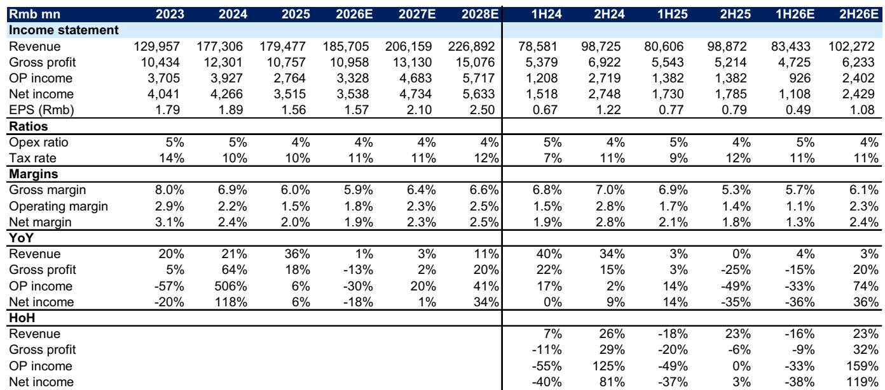
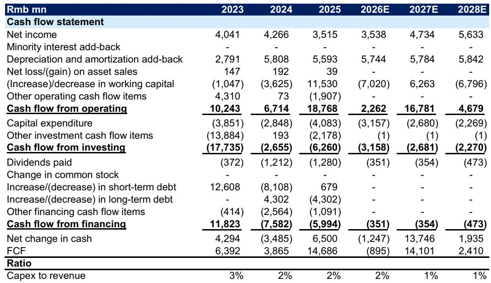
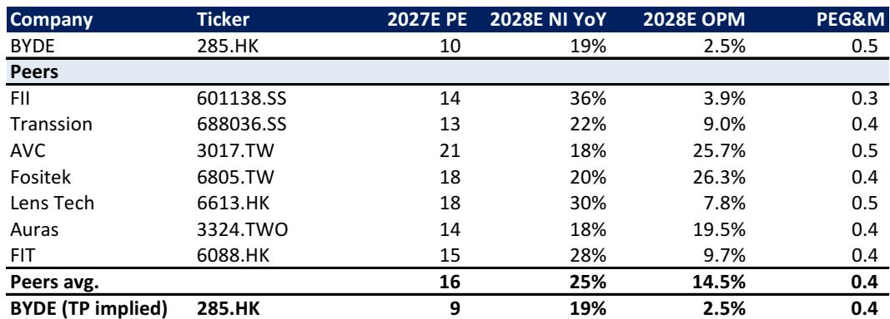

# The BYDE Downgrade Is a Warning, Not a Judgment: Why Memory Costs Are Reshaping the Electronics Supply Chain

BYDE (0285.HK) has been downgraded to Se. This is not merely a company-specific call. It is a signal that the structural dynamics of memory costs — often treated as a cyclical footnote in electronics supply chain analysis — have become the dominant variable determining profitability for mid-tier electronics manufacturers. Since being added to the 报告观点list in February 2026, BYDE has underperformed the Hang Seng Index by 20 percentage points, declining 34% versus a 14% index drop. The thesis that drove that earlier rating — a recovery in consumer electronics and automotive demand — has been broken by a surge in memory pricing that few models fully anticipated.

The downgrade matters because it exposes a critical analytical gap. Most observers evaluate electronics manufacturers on revenue growth, customer concentration, and margin trajectory. But memory costs, which are largely exogenous to any single OEM, have become the hidden governor of gross margins across the sector. BYDE's gross margin is now forecast at just 5.9% in 2026E, down from a prior estimate of 8.0%. That 2.1-percentage-point revision is not driven by operational failure. It is driven by the pass-through of memory costs that BYDE cannot fully absorb or pass on to customers. The implication is clear: for any company with significant exposure to consumer electronics and automotive electronics assembly, the ability to manage memory cost volatility is now a core competitive differentiator.

The timing of the downgrade is also instructive. It comes after a period in which BYDE has been expanding into higher-growth areas — AI server infrastructure (liquid cooling, power supply), deeper integration with Apple and BYD, and product mix upgrades. These are the right strategic moves. Yet the memory cost headwind has overwhelmed them, at least in the near term. This suggests that even well-positioned companies can be derailed by input cost shocks that are outside their control. For observers, the question is not whether BYDE's long-term story is intact. The question is whether the memory cost cycle has further to run, and what that means for the broader electronics supply chain.

The following sections unpack the logic of the downgrade, examine the structural implications of memory cost persistence, and offer a decision framework for navigating this environment.

## Stabilizing Memory Costs Will Not Quickly Restore Margins Because the Damage to Demand Is Already Done

The conventional narrative is that memory cost stabilization will eventually restore demand and margins. BYDE's own forecasts assume a recovery in the second half of 2026, with revenue growing 23% half-on-half, driven by stabilizing memory costs, better seasonality, and new flagship product launches. This is a reasonable expectation on the surface. LPDDR4X mobile DRAM pricing rose 73-78% quarter-on-quarter in Q2 2026, and LPDDR5X pricing rose 80-85% quarter-on-quarter. NAND pricing was up 55-60% quarter-on-quarter in the same period. The rate of increase is expected to moderate, with DRAM pricing forecast to grow only 18% quarter-on-quarter in Q3 2026 and NAND pricing to grow 21% quarter-on-quarter. Stabilization is underway.

But the problem is not the trajectory of memory costs. The problem is the demand destruction that has already occurred. When memory costs surged, OEMs across consumer electronics and automotive electronics reduced orders, delayed product launches, and shifted to lower-memory configurations. BYDE's automotive electronics revenue forecast for 2026E has been cut by 17% from the prior estimate, reflecting a 16% year-on-year decline in BYD's shipments in the first half of 2026. Apple assembly and casing revenue has been reduced by 6%. Android smartphone assembly revenue has been cut by 7%. These are not temporary inventory adjustments. They represent actual lost volume that will not be recovered even if memory costs stabilize, because the product cycles have passed and consumer demand has been redirected.

The margin impact is even more severe. BYDE's gross margin in automotive electronics is now forecast at 10.4% for 2026E, down from 14.9% previously — a 4.5-percentage-point reduction. Apple assembly margin is down from 7.5% to 5.6%. Android assembly margin is down from 3.3% to 2.0%. These are not rounding errors. They represent a structural compression of profitability that will take multiple years to reverse, if it reverses at all. The report's own estimates show gross margin recovering only to 6.6% by 2028E, still well below the prior estimate of 8.9%. In other words, even three years out, margins are not expected to return to pre-shock levels.

## The AI Server Expansion Is a Positive Signal, but Its Scale Is Too Small to Offset the Core Business Drag

BYDE's expansion into AI computing infrastructure — including liquid cooling and power supply for data centers — is a strategically sound move. The AI server market is growing rapidly, and BYDE has the manufacturing capabilities to compete. The report now includes AI computing infrastructure revenue forecasts of RMB 1.2 billion in 2026E, RMB 1.6 billion in 2027E, and RMB 2.1 billion in 2028E. More importantly, the gross margin for this segment is assumed at 25%, significantly higher than the company's blended margin.

But the scale problem is stark. In 2026E, AI computing infrastructure is expected to account for just 0.7% of BYDE's total revenue. Even by 2028E, it will represent less than 1% of revenue. Meanwhile, the core businesses — automotive electronics, Apple assembly, and Android assembly — account for over 90% of revenue and are under severe margin pressure. The AI server business is a long-term option, not a near-term offset. It cannot compensate for the 2.1-percentage-point gross margin compression across the core portfolio.

This creates an uncomfortable dynamic. BYDE is investing in AI infrastructure at a time when its core earnings are declining. The report shows net income falling from RMB 3.9 billion in 2025 to RMB 3.5 billion in 2026E, a decline of 10.3%. Earnings per share drops from RMB 1.75 to RMB 1.57. The free cash flow turns negative in 2026E at negative RMB 895 million, compared to positive RMB 14.7 billion in 2025. The company is effectively funding its growth investments from a shrinking earnings base. This is not sustainable indefinitely, and it raises questions about the pace of capital allocation.

The critical open question is whether BYDE can accelerate its AI server ramp faster than the report currently assumes. If the company can win larger contracts or achieve faster time-to-market, the revenue contribution could become meaningful sooner. But the report's base case is conservative, and for good reason: entering the AI server supply chain requires certifications, relationships, and scale that take time to build. Observers should watch for any signs of acceleration in this segment as a potential catalyst for a re-rating.

## The Report Does Not Fully Answer How BYDE Will Break the Memory Cost Pass-Through Trap

The most important analytical gap in the report is the absence of a clear solution to the memory cost pass-through problem. BYDE is an assembler and component manufacturer. It buys memory chips from suppliers like Samsung, SK Hynix, and Micron, and incorporates them into finished products for customers like Apple, BYD, and Android OEMs. When memory prices rise, BYDE's cost of goods sold increases immediately, but its ability to raise prices to customers is constrained by competitive dynamics and contractual agreements.

The report implicitly assumes that BYDE cannot fully pass through memory cost increases. This is evident in the gross margin compression: if BYDE could pass through costs, margins would be stable. But they are not. The question is whether BYDE can change this dynamic through vertical integration, long-term supply agreements, or product mix shifts toward higher-value components where pricing power is stronger.

The report does not discuss whether BYDE is exploring any of these options. It does not analyze the company's procurement strategy or its relationships with memory suppliers. It does not model the impact of potential hedging strategies or inventory management changes. These are material omissions because the memory cost cycle is not going away. Even if costs stabilize at current levels, BYDE's margins will remain depressed unless it finds a way to structurally reduce its exposure to memory cost volatility.

For observers, this is the most important unanswered question. If BYDE can demonstrate a credible strategy to manage memory costs — through vertical integration, long-term contracts, or product mix shifts — the company could be re-rated significantly. If it cannot, the margin compression may prove permanent.

## A Decision Framework for Observers: Three Conditions That Would Justify Re-Entering BYDE

For those considering whether to 报告观点, add, or exit BYDE, the report's logic suggests a clear decision framework based on three conditions that would need to be met before the company becomes attractive again.

First, memory costs must not only stabilize but decline. The report forecasts a recovery in the second half of 2026 based on stabilizing memory costs, but stabilization alone is not enough. Margins will only recover if memory costs actually decline, allowing BYDE to benefit from falling input prices while maintaining selling prices. The report's own data shows that even with stabilization, gross margins in 2028E remain below pre-shock levels. A decline in memory costs is necessary for a meaningful margin recovery.

Second, the AI server business must demonstrate faster-than-expected ramp. The report explicitly states that it would turn more positive on BYDE if the company delivers faster-than-expected AI server ramp-up. The current forecasts assume less than 1% revenue contribution through 2028E. If BYDE can achieve, say, 3-5% revenue contribution by 2027E, the high-margin AI business would begin to have a meaningful impact on blended margins. Observers should monitor quarterly disclosures for any acceleration in AI-related revenue.

Third, the consumer electronics and automotive electronics recovery must be stronger than the report currently models. The report's revenue cuts are based on the assumption that demand has been permanently lost due to the memory cost shock. But if demand snaps back more quickly than expected — driven by new product cycles, government stimulus, or export growth — BYDE could see a volume recovery that partially offsets the margin compression. The report notes that BYD's growth is mainly driven by exports, which is a positive signal. If export momentum continues, automotive electronics revenue could exceed current forecasts.

If all three conditions are met simultaneously, the case for re-entering BYDE becomes compelling. If only one or two are met, the risk-reward remains unfavorable. This framework gives observers a clear set of milestones to track rather than relying on vague hopes of a recovery.

## The Broader Lesson: Memory Costs Are Now a Structural Variable, Not a Cyclical One

The BYDE downgrade is not an isolated event. It is a case study in how memory costs have become a structural variable in the electronics supply chain, not just a cyclical one. For years, memory costs were treated as a temporary headwind that would eventually reverse. The assumption was that supply discipline by memory manufacturers would eventually give way to overcapacity and falling prices. But the memory industry has undergone a structural transformation. The number of major players has consolidated to three — Samsung, SK Hynix, and Micron — and they have demonstrated consistent discipline in managing supply. The result is that memory costs are likely to remain elevated for longer than historical cycles would suggest.

This has profound implications for the entire electronics supply chain. Companies that rely on memory as a significant input cost — which includes most consumer electronics, automotive electronics, and server manufacturers — will need to fundamentally rethink their business models. The old strategy of passing through cost increases to customers no longer works because end-market pricing power has been eroded by competition and consumer price sensitivity. The new strategy must involve either vertical integration into memory production, long-term supply agreements with price caps, or a shift in product mix toward components that do not rely on memory.

BYDE is not alone in facing this challenge. Many of its competitors are in the same position. The difference is that BYDE has been one of the first to be downgraded, and the market is now pricing in the implications. Observers should expect similar downgrades across the sector if memory costs remain elevated. The BYDE downgrade is a warning shot, not a final judgment. It tells us that the old rules of valuation no longer apply, and that a new analytical framework is needed.

Join the community to read the full report and review the original charts.

*For informational purposes only. Portions may be generated, translated, summarized, or edited with AI assistance based on source materials and may contain omissions or errors. Please verify independently. This is not professional advice.*

For informational purposes only. Portions may be generated, translated, summarized, or edited with AI assistance based on source materials and may contain omissions or errors. Please verify independently. This is not professional advice.

