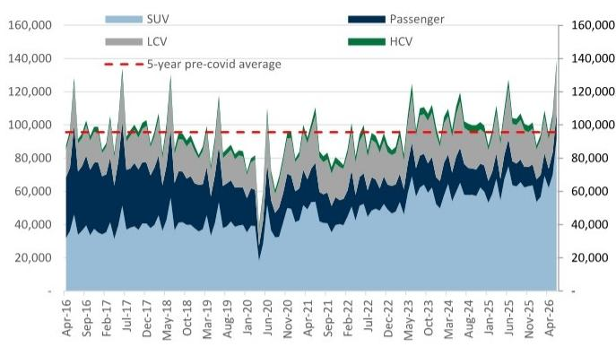
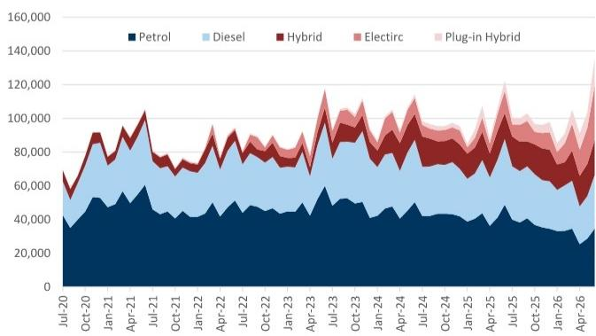
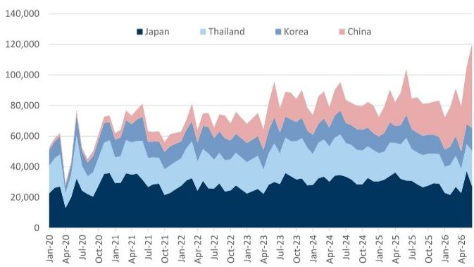

# Australia's Record Vehicle Sales Mask a Structural Shift That Is Undermining the Aftermarket Accessory Business Model

The Australian automotive market just posted its best-ever monthly sales figure in June 2026, with 140,000 new vehicles sold, representing a 10% year-over-year increase. On the surface, this appears to be a story of consumer resilience in a high-interest-rate environment. It is not. The composition of those sales tells a fundamentally different story—one that is quietly dismantling the economic foundation of Australia's listed aftermarket accessory companies. Electric vehicles surged 147% year-over-year, China-brand vehicles captured 40% of all new car sales, and the GS Key Model Index, which tracks the ten models with the highest aftermarket accessory attachment rates, declined 16%. The market is growing, but it is growing away from the companies that depend on it.

This divergence between top-line volume and revenue quality for the aftermarket ecosystem is not a temporary anomaly. It is the leading edge of a structural realignment that has been accelerating since 2021, when China-brand vehicles held just 8% market share. Today, that figure stands at 40%. The June data crystallizes a pattern that has been building for five years: the vehicles Australians are buying in record numbers are precisely the vehicles least likely to generate aftermarket accessory revenue. For observers of ARB Corporation and Amotiv, the question is not whether this trend will continue, but whether their business models can adapt fast enough to a market that no longer looks like the one that made them successful.

The conventional narrative—that strong new vehicle sales are a leading indicator for aftermarket demand—is breaking down. The June data proves that aggregate volume growth and aftermarket revenue growth have become decoupled. The GS Key Model Index, which tracks models like the Toyota HiLux, Ford Ranger, and Toyota Prado, fell 16% year-over-year even as total sales rose 10%. This is not a blip. It is the statistical signature of a market undergoing a compositional shift that bypasses the traditional accessory ecosystem entirely.

## The Record Month Conceals a 16% Decline in the Models That Drive Aftermarket Revenue

The GS Key Model Index declined 16% year-over-year in June 2026, driven by supply constraints at Toyota and the accelerating shift toward electric vehicles and China-brand models. The Toyota HiLux, Australia's long-reigning sales champion and the single most important vehicle for the aftermarket accessory industry, was down 16% year-over-year, representing a loss of over 1,000 units compared to June 2025. The Ford Ranger, the other pillar of the 4x4 accessory market, fell 5%, losing 294 units. The Toyota Prado, a staple for expedition-grade accessory fitment, dropped 21%, a decline of 447 units.

These are not marginal shifts. The HiLux and Ranger alone account for a disproportionate share of aftermarket spending on bull bars, suspension upgrades, canopy systems, roof racks, and lighting. When these models decline, the revenue impact on companies like ARB and Amotiv is magnified because the accessory attachment rate on these vehicles is significantly higher than on the vehicles replacing them in the sales mix.

The supply constraint on Toyota is a factor, but it is not the whole story. The HiLux is approaching a generational change, with the 9th generation expected in late 2025 or early 2026. Transition periods typically suppress volume as buyers wait for the new model. Yet even accounting for this, the broader trend is unmistakable: the market is rotating away from the large 4x4 utility vehicles that have been the backbone of the aftermarket industry for two decades. Light commercial vehicles fell 13% overall, with 4x4 variants down 14%. Large SUVs declined 15%. Meanwhile, small SUVs grew 18% and medium SUVs surged 55%.

The so what is direct: the vehicles growing fastest have the lowest accessory take-up rates. A medium SUV buyer is far less likely to install a suspension lift, a bull bar, or a roof-top tent than a HiLux or Ranger buyer. The revenue per vehicle for aftermarket companies is declining even as total industry volume rises.

## Electric Vehicles and China Brands Are Reshaping the Market in Ways That Bypass the Traditional Aftermarket Ecosystem

The June data reveals two parallel revolutions. Electric vehicle sales reached 32,600 units, a 147% increase year-over-year, making Tesla the top-selling brand in Australia for the second consecutive month. China-brand vehicles—Chery, GWM, MG, and BYD—collectively sold 55,500 units, an 85% increase, capturing 40% of the market. The BYD Shark, a plug-in hybrid 4x4 ute, posted a record month with 3,400 units sold, representing 16% of all 4x4 sales.

These are not niche segments anymore. They are approaching the mainstream. And they present a structural challenge for the aftermarket accessory industry for three reasons.

First, electric vehicles have fundamentally different accessory requirements. The weight constraints, thermal management requirements, and warranty implications of modifying EV powertrains and battery systems limit the scope for aftermarket intervention. Bull bars that must accommodate pedestrian safety regulations and sensor arrays for autonomous driving features are more complex and expensive to develop. Suspension modifications must account for battery pack placement and weight distribution. The accessory opportunity set for EVs is narrower and more technically demanding than for internal combustion 4x4s.

Second, China-brand vehicles operate on a different cost structure and distribution model. BYD, MG, and GWM have built their Australian market share on aggressive pricing and vertically integrated supply chains. Their customers are often price-sensitive first-time new car buyers who are less likely to allocate discretionary spending to aftermarket accessories. The accessory attachment rate for China-brand vehicles is structurally lower, and the average spend per vehicle is materially below that for traditional 4x4 models.

Third, the shift toward China brands and EVs is happening at a pace that exceeds the capacity of the aftermarket industry to respond. The market share of China-brand vehicles has gone from 8% in July 2021 to 40% in June 2026. That is a fivefold increase in five years. Product development cycles for aftermarket accessories typically run 18 to 36 months. By the time a company like ARB develops a bull bar for a new BYD model, the model mix may have shifted again. The aftermarket industry is structurally lagging the rate of change in the vehicle market.

## The Correlation Between LCV Sales and Aftermarket Revenue Is Breaking, With Direct Implications for ARB and Amotiv

The report shows that ARB's Australian aftermarket sales have historically been highly correlated with LCV volume growth, with a correlation coefficient of 0.8, and with the GS Key Model Index, at 0.7. Both of these leading indicators declined in the first half of 2026. The implication is that ARB's revenue trajectory is likely to remain under pressure unless the company can expand its addressable market beyond the traditional 4x4 and LCV segments.

ARB's valuation methodology reflects this diminished outlook. The company's forward P/E multiple has compressed from a 5-year average of 25x, reflecting a projected FY25-28 net profit after tax compound annual growth rate of just 1.1%, compared to the pre-Covid historical average of 6.5%. The market is already pricing in a structural slowdown. The question is whether the company can stabilize at this lower growth trajectory or whether further compression is warranted as the vehicle mix continues to shift.

Amotiv, rated as a Hold, has a portfolio that is broader than ARB's, spanning towing, lighting, and roof rack systems, but it is still heavily exposed to the LCV and 4x4 segments. The company's 13x weighted P/E multiple is broadly in line with its 10-year average, suggesting the market sees Amotiv as having better prospects for stabilization, possibly due to its more diversified product range and recent strategic restructuring.

Yet both companies face the same fundamental risk: the vehicle parc is changing faster than their product portfolios can adapt. The aftermarket industry has historically been a lagging indicator of new vehicle sales, with a 2- to 4-year lag as vehicles move out of warranty and into the modification cycle. This lag has historically provided a buffer. But if the compositional shift is permanent—if the vehicles entering the parc today are structurally less accessory-intensive—then the lag merely delays the inevitable revenue decline.

## What the Report Does Not Fully Answer: How Fast Can the Aftermarket Adapt, and Will the New Vehicle Mix Prove Cyclical or Permanent?

The report provides a clear diagnosis of the current state but leaves several critical questions unresolved. The most important is whether the shift toward EVs and China brands is a permanent structural change or a cyclical phenomenon that will moderate as interest rates decline and traditional model supply normalizes.

There are arguments on both sides. The cyclical case points to the upcoming model launches: the 9th generation Toyota HiLux in late 2025 or early 2026, the Nissan Navara D27 in March 2026, the Ford Ranger Super Duty in mid-2026, and the 6th generation Toyota RAV4 in the second half of 2026. These are the models that have historically driven aftermarket accessory demand. If supply constraints and model transition periods are the primary cause of the current weakness, then the pipeline of new models could reverse the decline.

The structural case is more concerning. The consumer shift to lower-cost vehicles is being driven by elevated interest rates and cost-of-living pressures. Even if rates decline, the price advantage of China-brand vehicles is unlikely to disappear. BYD and MG have built local distribution networks and brand recognition that did not exist five years ago. The 40% market share may not be the peak; it could be a waypoint. Meanwhile, EV adoption is being supported by fuel security concerns and government policy, not just consumer preference. The 147% year-over-year growth in EV sales suggests a tipping point may have been reached.

The report also does not fully address how the aftermarket companies are responding. Are ARB and Amotiv investing in product development for EV and China-brand vehicles? Can they maintain margins on accessories for lower-cost vehicles where customers are more price-sensitive? What is the timeline for new product launches that address the changing vehicle mix? These are the questions that will determine whether the companies can adapt or whether they face a prolonged period of revenue stagnation.

## A Decision Framework for Observers: Three Signals to Watch in the Next 12 Months

For those evaluating ARB and Amotiv, the June VFACTS data provides a framework for monitoring the trajectory of the aftermarket industry. Three signals are worth tracking.

First, monitor the HiLux 9th generation launch and its initial sales trajectory. The HiLux has been the single most important vehicle for the aftermarket industry. If the new model regains its position as Australia's top-selling vehicle and generates strong accessory attachment rates, it would provide a significant tailwind. If it struggles to reclaim market share from the BYD Shark and other China-brand utes, it would confirm that the compositional shift is structural rather than cyclical.

Second, track the accessory attachment rate on BYD Shark and other new energy 4x4 vehicles. The Shark sold 3,400 units in June, representing 16% of 4x4 sales. If aftermarket companies can develop compelling accessory packages for this vehicle, it could open a new revenue stream. If the Shark's owners prove to be low-spend accessory customers, it would validate the thesis that the revenue per vehicle is declining.

Third, watch for any strategic pivot announcements from ARB and Amotiv. Product development cycles are long, but the companies should be signaling their response to the changing market. Are they investing in EV-compatible accessories? Are they developing products for China-brand vehicles? Are they expanding into adjacent categories like home energy storage or EV charging infrastructure that could diversify their revenue base? The absence of such signals would be a negative indicator.

The June data does not settle the debate. It sharpens it. The Australian vehicle market is undergoing a transformation that is as profound as any in the last two decades. The companies that can adapt to a market where 40% of new vehicles are from China and 25% are electric will survive and thrive. Those that cannot will face a slow but steady erosion of their revenue base.

*For informational purposes only. Portions may be generated, translated, summarized, or edited with AI assistance based on source materials and may contain omissions or errors. Please verify independently. This is not professional advice.*

For informational purposes only. Portions may be generated, translated, summarized, or edited with AI assistance based on source materials and may contain omissions or errors. Please verify independently. This is not professional advice.

