# 建筑材料行业研究

## '解决方案策略'：驱动市场表现提升的路径，还是拓展业务组合的方式？

过去五年中，解决方案销售已成为多家建筑材料公司的关键中期战略方向，在电话会议中提及"建筑解决方案"或"建筑围护结构"的频率较此前增加了两倍。

单一策略并不适用于所有企业：其背后的逻辑通常是通过提升现有产品的市场份额来实现有机增长，或通过非有机机会扩大业务组合规模（过去五年以美元计价的净收购额是此前的两倍）。我们认为，解决方案策略在某些品类中可以作为提升市场份额和盈利能力的差异化因素，但并非所有公司都能从中受益，尤其是在商品化程度较高或产品关联性较弱的领域。

对相关公司的影响：在我们的覆盖范围内，Kingspan/Sika被认为拥有较强劲的策略，能够在终端市场中实现更好的表现；而St. Gobain/Holcim若能有效整合其多元化业务组合，则有望超出我们的预期。然而，我们预计像Holcim这样的公司将继续推进该策略（与其2030年并购框架一致），因为这为其提供了有增值效应的资本运用方式，并有助于业务多元化。

什么是'解决方案销售'？解决方案销售旨在将单一制造商提供的互补性产品打包，以解决特定的建筑问题，而非提供单个组件。例如，该策略在屋顶系统（需要耐候性和耐久性）、雨水排水系统（用于高速公路、城市区域等公共基础设施）以及地下室/隧道（需要结构稳固和防潮）等领域较为常见。

有效的解决方案策略有哪些特征？我们认为，有效的解决方案策略包含三个维度：（1）产品组合——销售具有系统关联性、附带保修且依赖特定高性能产品的产品；（2）精准分销——面向同一决策者销售，帮助解决其痛点；（3）利润获取——将高利润的互补产品打包销售。

Ben Rada Martin
+44(20)7051-0800 |
ben.radamartin@gs.com
GS International

Susan Maklari
+1(212)357-3906 |
susan.maklari@gs.com
GS & Co. LLC

Charles Perron-Piche, CFA
+1(917)343-1847 | charles.perron-
piche@gs.com
GS & Co. LLC

Natasha Phillips
+44(20)7051-4705 |
natasha.phillips@gs.com
GS International

Patrick Creuset
+33(1)4212-1380 |
patrick.creuset@gs.com
GS Bank Europe SE - Paris Branch

## 哪些解决方案策略是真正的增长引擎？

过去五年中，大型建筑材料公司提及"解决方案"或"围护结构"策略的频率，在电话会议中较此前五年增加了两倍。

图表1：近年来，随着企业寻求推动产品间的协同效应或扩大业务组合，解决方案策略受到关注

  
来源：彭博

## 非有机并购活动有所增加

我们认为，解决方案策略在特定品类中可以成为驱动市场表现提升的因素，但对于其他品类而言，这更多是一种资本部署和业务组合扩张的方式，因此不太可能显著影响财务表现。我们注意到，过去五年的净收购额（收购减去剥离）按名义美元计算较此前五年翻了一番。

图表2：该行业的并购活动与解决方案/围护结构策略的兴起相吻合

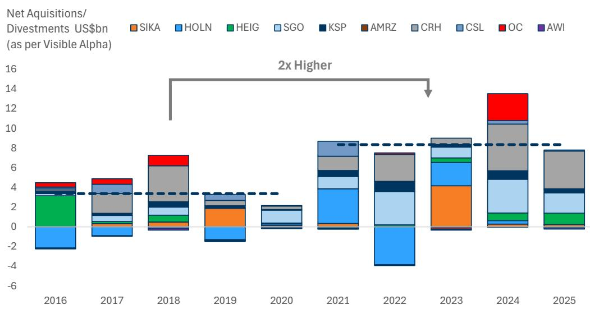  
来源：Visible Alpha Consensus Data

我们在利润率提升和超额销量增长方面最为看好的策略包括：

Sika - Sika在多个品类（屋顶、地下室、基础设施项目）的长期解决方案布局，以及行业领先的研发投入，是其超越同行终端市场的关键策略。我们认为Sika在解决方案销售方面具有扎实的产品优势，这得益于高于同行的研发支出，并且能够利用其保修服务创造需求拉动。例如，Sika较新的地下室防水产品SikaProof A+膜在FY'23-FY'25期间实现了+27%的复合年增长率，并提供20年保修，但需与Sika的混凝土外加剂配合使用。Sika的解决方案销售有效针对建筑过程中决策周期较长的关键决策者，并提供互补产品以解决特定的建筑问题。例如，结构工程师需要地下水防护的地下结构，而建筑师/建筑业主则需要防火屋顶系统。我们认为，Sika的高价值解决方案和领先的研发投入带来了可观的利润获取，其23-25%的销售额来自上市不足5年的产品（通常利润率高出3-5个百分点）。我们认为Sika有望实现优于同行的市场表现。

Kingspan - 我们认为Kingspan在美国屋顶市场的扩张——旨在将其在板材市场（GSe估计40%份额）的现有优势延伸至高利润的非住宅屋顶市场——将提供差异化的完整外部产品解决方案（屋顶+保温墙板），并附带长达约40年的保修。鉴于关键决策者（如项目经理、建筑业主）的重叠以及外部解决方案相比屋顶系统更早的决策周期，我们看到了交叉销售的潜力。然而，我们对扩张速度持谨慎态度，因为现有屋顶企业受益于承包商忠诚度和强大的分销商关系，这些我们认为是不易克服的障碍。我们将持续关注事态发展，注意到Polyiso已开始生产，而TPO膜预计在2026年第四季度推出。

## 更广泛的解决方案策略仍是以下公司的关注重点：

Holcim - 近期完成了对欧洲墙体供应商Xella的收购，这是Holcim在解决方案策略上的首次重大推进。对于Xella，我们认为通过成本协同效应实现利润获取以及每股收益的提升，是此次解决方案并购的主要积极因素；若能实现收入协同效应，则有望超出我们的预期。我们对收入机会持保守态度的原因是，我们认为混凝土仍相对商品化（客户对价格敏感，规格销售影响较小），决策者不同（建筑师与工头），且基础与墙体之间的系统效益有限。我们注意到，Holcim的美国分拆公司AMRZ（2025年6月）也采取了类似策略，为建筑围护结构提供先进解决方案（收购美国非住宅+住宅屋顶业务），但自那以来，其核心材料业务表现与重质材料同行相当，围护结构业务表现也与品类同行相当。

图表3：自2022年推进建筑围护结构策略以来，AMRZ的解决方案策略在收入增长方面与更广泛的重质材料同行表现相当...
AMRZ（建筑材料）市场表现，指数2022=100

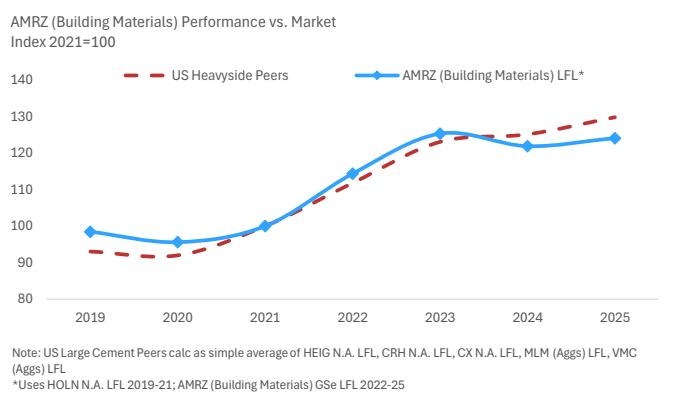  
来源：公司数据，GS全球研究

图表4：...与屋顶同行相比
AMRZ（建筑围护结构）市场表现，指数2021=100

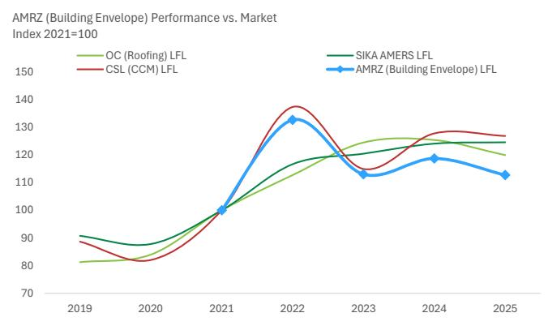  
来源：公司数据，Visible Alpha Consensus Data，GS全球研究

Saint Gobain – 正在推进全面的建筑围护结构解决方案策略，涵盖轻质材料产品（石膏、玻璃、屋顶、墙板、建筑化学品）。SGO认为向上销售是推动销量份额和盈利能力的重要动力——在2025年10月的资本市场日上展示了超过15倍的利润/超过10倍的收入增长潜力。我们注意到，SGO的澳大利亚子公司CSR也曾采用这一策略，但市场表现提升的证据有限。此外，鉴于这些产品的相对商品化程度，我们在北美市场（SGO解决方案业务较强的地区）尚未看到其相对于本地同行的明显优势。

图表5：SGOB在收入增长方面相对于北美同行的优势有限
SGOB AMERS市场表现 vs. 北美住宅同行（指数2020=100）

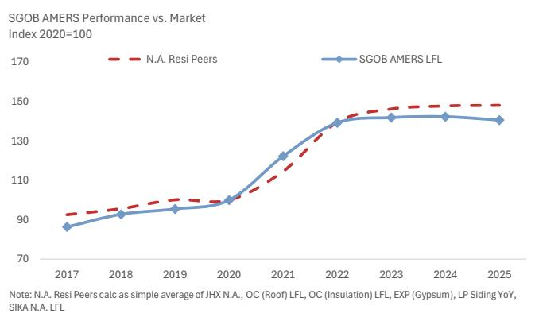  
来源：公司数据，GS全球研究  
图表6：CSR的收入表现与澳大利亚新建住宅支出基本一致...
CSR独立收入 / 澳大利亚名义建筑支出 - 占2019年水平的百分比（3月财年）

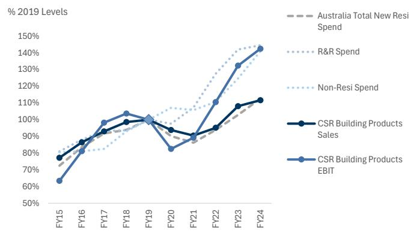  
来源：ABS，公司数据

我们覆盖范围内的其他公司（Heidelberg、Rockwool和Buzzi）并未积极推行解决方案策略。我们注意到，Heidelberg的小型收购涉及下游领域，可能对解决方案策略形成补充——参见近期宣布的对AmeriTex Pipe & Products的少数股权投资（2026年5月）。

全球建筑材料同行也在实施解决方案策略并取得了显著成功，包括：（1）Armstrong：创新产品的推出以及并购在建筑专业领域的整合，推动了其过去几年相对于市场的表现。AS平台的增长也有望带动高利润矿物纤维产品的销量，因为公司获得了更多复杂项目的参与机会。

（2）Carlisle：在北美平屋顶解决方案中拥有最大市场份额，这得益于对创新的持续关注，包括逐步将研发支出提升至2030年占销售额3%的水平（2023年低于1%），支持创新的市场解决方案，计划于2026年推出10多种新产品（16英尺TPO膜），有效解决了其忠实承包商群体的痛点，并拥有值得信赖的保修计划。自2018年以来，该业务也持续超越北美非住宅同行。

（3）CRH：正在通过将其核心水泥和骨料业务交叉销售至不断增长的公共基础设施终端市场（水务、高速公路、能源、再工业化）来推行解决方案策略。CRH通过收购逐步构建其解决方案业务，以增强解决方案的专业能力和业务组合，近期拟议的收购包括Arcosa（2026年6月，能源基础设施）和Axius（2026年5月，水质）。

图表7：自2020年以来，AWI的表现优于其综合终端市场增长...
AWI市场表现 vs. 综合终端市场增长  
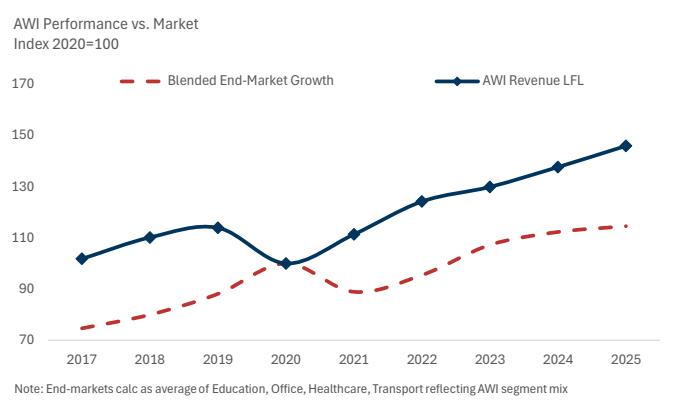  
来源：Eikon Datastream，公司数据，GS全球研究

图表8：CSL平屋顶系统表现优于北美非住宅同行...
CSL（CCM）市场表现 vs. 北美非住宅同行（指数2020=100）  
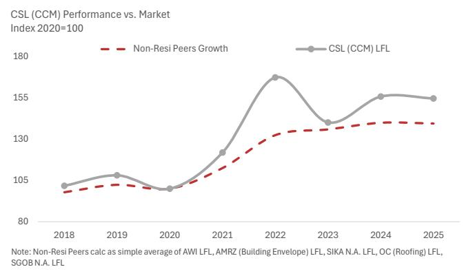  
来源：公司数据，GS全球研究

我们认为，有效的解决方案策略由三个维度驱动：

1. 产品优势：可以通过提供以下内容产生更具防御性的定价溢价，并获取更大的总可寻址市场：（A）针对特定建筑问题的系统解决方案；（B）覆盖技术复杂、多组件系统的保修，其中故障可能导致昂贵的维修或结构损坏；（C）具有技术优势的锚定产品或特定技术专长，这些也能产生需求拉动。

2. 销售网络连接性：通过以下方式为交叉销售提供销量增长机会：（A）高规格产品更长的决策周期，结合（B）单一供应商关系，通过减少摩擦和合并采购决策来支持相邻产品的向上销售。这对于通过互补服务向上销售高销量、低利润产品（如水泥）可能特别有效。

3. 利润获取：可以由高利润相邻产品或成本结构垂直整合的产品驱动。

图表9：我们针对建筑材料行业现有解决方案策略的分析框架
GS解决方案策略分析框架

<table><tr><td></td><td>产品组合</td><td>销售网络</td><td>利润</td></tr><tr><td>SIKA地下室解决方案</td><td>✓✓✓</td><td>✓✓✓</td><td>✓✓</td></tr><tr><td>KSP + 板材/屋顶解决方案</td><td>✓✓</td><td>✓</td><td>✓✓</td></tr><tr><td>SGOB外部解决方案</td><td>✓✓</td><td></td><td>✓</td></tr><tr><td>HOLN解决方案</td><td>✓</td><td>✓</td><td>✓✓</td></tr><tr><td>CRH + 民用基础设施（水务、能源）</td><td>✓✓</td><td>✓✓</td><td>✓✓</td></tr><tr><td>内部解决方案</td><td>✓✓✓</td><td>✓✓</td><td>✓✓✓</td></tr><tr><td>非住宅屋顶系统</td><td>✓✓✓</td><td>✓✓</td><td>✓✓</td></tr></table>

来源：公司数据，GS全球研究

## SIKA地下室解决方案策略

在我们的覆盖范围内，我们认为SIKA的地下室产品是有效解决方案销售的一个独特案例。我们认为地下防水具有以下特点：（1）专业化产品，附带强有力的保修；（2）早期进入并持续参与建筑过程；（3）稳健的盈利能力。我们的主要观点包括：

产品组合 - SIKA利用其在热塑性膜、砂浆和混凝土外加剂方面的专长，提供完整的地下室系统解决方案，应对水、气体、生物和温度变化压力，保护建筑免受结构退化。Sika为其产品提供15年（单一系统防水混凝土外加剂）和20年（双系统，附加防水膜）的保修。

销售渠道 - 项目业主和结构工程师对地下防水的设计和质量投入较大，这为SIKA提供了早期进入建筑过程的机会。SIKA还举办研讨会，向关键利益相关者介绍应用、可持续性和不同设计，从而与决策者建立早期接触点。尽管防水系统通常仅占建筑总成本的不到1%，但优质的设计和安装通过节省建筑生命周期内的未来维护和维修成本，显著提升了项目业主的价值主张。

利润获取 - Sika的专利防水膜系统在FY'23-FY'25期间实现了+27%的复合年增长率。我们认为，其高价值解决方案得益于行业领先的研发引擎，支持23-25%的销售额来自上市不足5年的产品，通常带来高出3-5个百分点的材料利润率。

图表10：高度专业化、差异化和创新的产品供应可以推动显著的销售表现...
Sika地下室防水膜，销售增长  
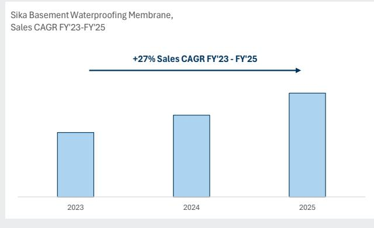  
来源：公司数据

图表11：...Sika的研发引擎历来支持其优于同行的表现
Sika有机增长 vs 同行  
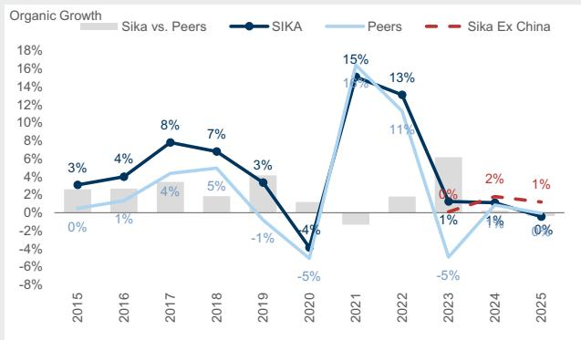  
来源：公司数据，GS全球研究

## 维度一：产品优势

我们认为，某些产品如果：（A）可以以系统形式销售；（B）客户重视保修；（C）产品在设计中被指定使用；将能够从其他产品中获取份额，并吸引更具防御性的定价溢价。

## A) 系统销售

什么是'系统销售'？系统销售是指销售一组功能上相互依赖的产品组合。

它如何为客户增加价值？通过确保多个组件协同工作，提升建筑产品的功能性，同时在采购（订购、交付、安装）方面提供便利。

它如何为建筑材料公司提供收入增长潜力？允许制造商获取更大份额的材料清单价值，并在某些情况下收取更高的平均售价，以反映更强的产品功能性或保修。

## 系统销售策略

\- 平屋顶系统（Carlisle, Sika, Kingspan）：提供平屋顶系统的各个层次，包括蒸汽屏障、保温层、组件（紧固件）和核心膜。这些允许对整个系统而非单个组件提供保修。提供此产品的企业包括Sika、Carlisle、Amrize和Kingspan。

\- 地下系统（Sika）：同样，Sika开发了一套用于地下系统解决方案的产品，包括防水膜、密封剂、水泥基防水砂浆和沥青基涂料。这些产品技术含量高，旨在抵御地下室和隧道中的地下水渗入。

■ 外部系统（Kingspan）：Kingspan拥有稳健的外部板材业务，利用其核心保温产品，并计划扩展到美国屋顶系统（目前正在建设产能）。这将使Kingspan能够提供完整的外部围护解决方案。

■ 公共基础设施（CRH）：CRH利用其公共基础设施平台，服务于水务、能源和高速公路终端市场，将其服务与水泥/骨料业务捆绑，值得注意的是水务领域超过80%的产品消耗骨料和水泥。

\- 其他系统销售：包括（1）Saint Gobain的外部解决方案（结合玻璃、墙板、防水、保温、石膏）；（2）Holcim的围护结构策略，提供墙体（Xella）、基础（Holcim核心业务）和屋顶；（3）Amrize的建筑解决方案策略，利用其在非住宅屋顶和建筑材料组合中的优势地位；（4）住宅屋顶系统（SGO, OC），类似于非住宅组件/屋顶的交叉销售。

GS观点：总体而言，我们认为某些需要更高产品保证的品类（如屋顶/地下室系统）在以"系统"形式销售时提供最高价值。这些项目需要跨多层产品的高度技术复杂性，结合单一卖家的保修，可以成为高价值、高实用性的产品。相比之下，外部和内部解决方案使用更标准化的材料构建，缺陷影响较小，更易发现和修复。

图表12：解决方案销售将收入机会扩展到相邻产品...
平屋顶系统的收入占比

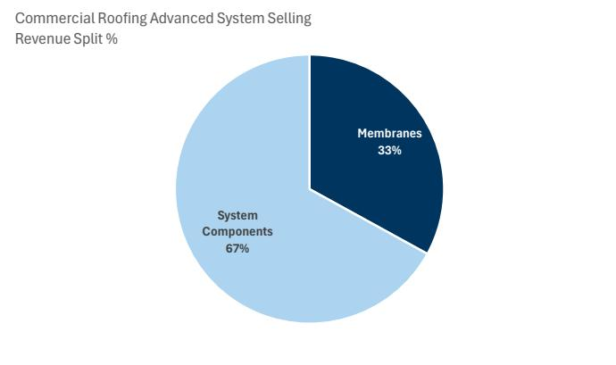  
来源：公司数据  
图表13：...有机会向上销售核心材料，例如Polyiso市场2013-19年增长1.6倍于膜市场 CAGR Carlisle - 保温板与膜的比例

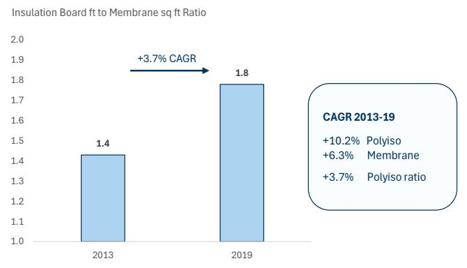  
来源：公司数据

## B) 保修

保修是制造商/销售商对产品性能和寿命提供的保证，保修期内所需的维修和故障由提供方承担。

## 保修策略

\- 非住宅屋顶保修（Carlisle, Kingspan, Sika, Amrize）：建筑业主高度重视，因为天气相关损坏可能导致结构或内部损害的高风险。通常覆盖约30年，覆盖范围和制造商、安装商、维修要求各有不同。例如，Sika的保修仅由Sika认证的1,400家承包商提供。

\- 地下室保修（Sika）：与屋顶类似，因设计或安装不当导致的故障或损坏对建筑结构完整性产生不成比例的影响，需要昂贵的维修/改造。因此，保修在地下室解决方案的价值主张中具有重要分量。Sika为指定的双系统防水膜和混凝土外加剂提供20年保修，但需由Sika培训的承包商安装。

\- 外部系统（Kingspan）：Kingspan为其保温Quadcore面板提供长达40年的热工保修，当与其屋顶系统结合时，有可能提供完整的单一系统保修（完整外部产品），但需审查并遵守产品详情中概述的设计和安装原则。

它如何为客户增加价值？高性能建筑产品通常需要强大的开发和安装专业知识才能正常运行。生产缺陷或安装不当可能导致产品性能不佳，需要进一步的维修或更换成本。如果故障源于制造商，保修提供保证，在满足预设条件的情况下，成本不会由项目业主承担。

它如何为建筑材料公司提供收入增长潜力？项目业主愿意预先支付更高成本，以最小化建筑生命周期内的未来维修和维护成本。

GS观点：我们认为保修可以成为解决方案策略决策标准的关键方面，因为它们减少了产品所有者的潜在未来支出。我们注意到，单一供应商保修尤其具有吸引力，因为它们消除了关于哪个制造商承担风险的模糊性，从而带来更粘性的客户基础。这在屋顶和地下室解决方案中尤其有效，因为建筑业主高度重视高效维修，且难以将故障归因于单个组件。

## C) 专业化产品供应

什么是专业化产品供应？提供相对于同行具有显著技术优势或更高专业水平的产品或服务，从而支撑更高的市场份额或定价溢价。

它如何为客户增加价值？具有显著技术差异化或人力专业知识的专业化产品/服务降低了客户的采购和执行风险，并提供卓越的产品性能。

## 独特产品供应策略

■ 外部解决方案（Saint Gobain, Armstrong）：Saint Gobain提供完整的住宅建筑围护结构，以提升其定价能力并创造利润增长。Saint Gobain将其策略视为获取更大钱包份额（交叉销售）、推动高附加值产品（向上销售）以及在设计过程早期创造粘性需求的机会。Armstrong为非住宅建筑设计和制造外部建筑应用产品。Armstrong是一个值得信赖的品牌，以其为建筑师和设计师创造创新和高度专业化解决方案的专业知识而闻名。

\- 膜产品（Sika, Carlisle）：Sika提供高质量、多功能（如防水、隔音、防火、自修复）的膜产品，并结合其粘合剂，确保膜与基材之间的牢固粘合，防止水从接缝处渗入。Carlisle开发了16英尺TPO屋顶膜，成为市场上最宽的TPO板材，为项目业主创造了显著的劳动力节省和安装效率提升。

\- 保温材料（Kingspan）：Kingspan Quadcore相对于泡沫板同行提供卓越的技术性能，包括防火、热效率和30年热工保修，用于需要热工性能的项目。

\- 基础设施（CRH）：CRH的水务基础设施平台Oldcastle Infrastructure采用一站式服务方式，为客户提供差异化价值主张，涵盖材料采购、法规合规知识和设计专业知识。

\- 其他产品：包括Xella水泥基（AAC）墙体砌块，为建筑提供比传统粘土砖更高的能效、更轻的重量和更好的隔音/隔热性能。

它如何为建筑材料公司提供收入增长潜力？产品差异化将决策从价格转向性能，为公司提供防御性定价能力和更粘性的客户关系。

GS观点：我们认为独特的产品或服务为利用交叉销售更标准化或商品化产品提供了平台，因为客户基础相对缺乏弹性。

图表14：...SGOB认为将其轻质材料产品垂直整合为完整建筑围护结构解决方案可带来超过15倍的利润机会
SGOB对解决方案销售机会的估计（来自资本市场日）

SGOB解决方案销售机会，资本市场日收入/利润增长

■ 收入（欧元）

利润（欧元）

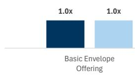  
强化型：
• 屋顶瓦片 • 屋顶垫层 • 乙烯基墙板 • 防潮层  
来源：公司数据

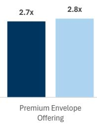  
气候适应型：
- 抗冰雹和抗藻瓦片
- 优质屋顶垫层 • 自密封泛水 • 屋脊通风
- 屋顶接缝胶带 • 优质墙板
- 实心墙板装饰 • 优质窗户泛水 • 外墙保温 • 自密封防潮层

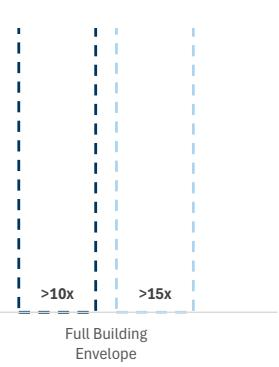  
全屋解决方案：
• 通风通道 • 屋檐
通风 • 高密度空腔
保温 • 智能蒸汽阻隔层 •
服务通道 • 隔音
石膏板 • 增强型
石膏板饰面

## 维度二：销售网络

## A) 决策周期

它如何为建筑材料公司提供收入增长潜力？关键设计产品（如住宅外部墙体结构、建筑外部立面）在设计过程中更早介入，因此比更标准化的材料具有更长的决策周期。决策周期更长的产品为建筑材料公司提供了向上销售相邻产品的机会，从而从项目业主那里获取更大的钱包份额。

## 决策周期策略

■ 公共基础设施（CRH）：CRH提供预制混凝土产品，如混凝土管。在民用和州级基础设施项目中，大型预制混凝土管道由土木工程师早期指定。一旦锁定，管道解决方案作为拉动需求，带动散装材料（如水泥/骨料），因为时间线重叠。

■ 外部/内部解决方案（Armstrong）：Armstrong利用其高度专业化的建筑细分市场，提供早期决策周期，以向上销售其天花板产品。

\- 其他决策周期策略（Kingspan, Amrize, Saint Gobain, Holcim）：Kingspan旨在通过利用其指定的保温板拉动屋顶系统的需求，获取更大的钱包份额。Amrize和Saint Gobain在住宅/非住宅建筑解决方案中采取类似策略，通过在外部规格阶段进入项目旅程来推动完整的建筑围护结构。Holcim认为，通过外部规格阶段进入建筑过程，将使其能够拉动其水泥作为项目基础的需求。

GS观点：具有不同决策周期的互补产品供应可以将客户锁定在单一供应商关系中，使制造商能够获取更大的钱包份额。我们认为，合适的垂直整合机会按项目阶段划分，施工前阶段为重质材料提供更强的垂直整合机会，而施工阶段为轻质材料提供更有吸引力的潜力。

图表15：大型项目（如多户住宅）的示意性时间线  
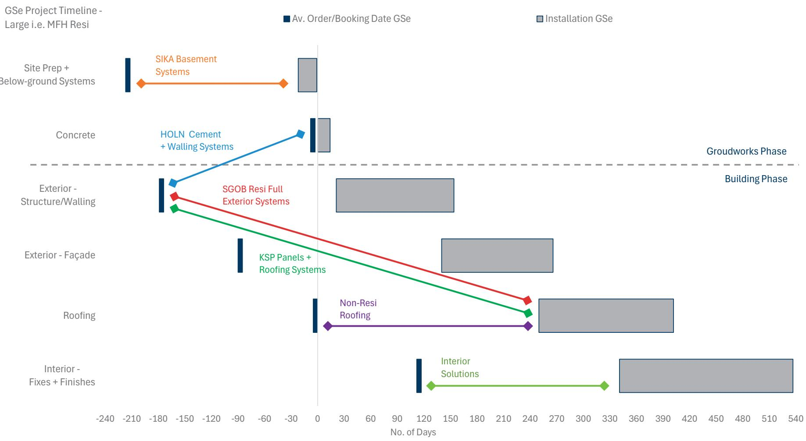  
来源：GS全球研究

## B) 决策者

它如何为客户增加价值？建筑过程高度复杂，因为产品采购、交付和安装的时间线相互竞争且重叠，还有劳动力物流、遵守当地建筑规范、预算编制以及利益相关者之间的沟通。关键决策者简化决策和流程的机会可以防止延误、预算超支以及潜在的劳动力/供应短缺，这些受到重视。

## 它如何为建筑材料公司提供收入增长潜力？

成为建筑项目上广为人知且值得信赖的合作伙伴，对项目业主来说是一个极具吸引力的主张，这可以捍卫定价能力，并提供更多机会向上销售高销量、低利润的产品，以获取更大的钱包份额。

## 决策者策略

■ 公共基础设施（CRH）：CRH通过在一个接触点提供完整的基础设施项目服务（设计、合规、制造和现场），与客户（如土木工程师和政府官员）建立紧密联系。因此，通过内部提供这些功能，为客户简化了决策和管理。

\- 地下结构（Sika） - Sika围绕解决关键决策者的特定问题构建解决方案。例如，结构工程师是地下解决方案决策过程的关键部分，负责最小化地下水损害风险，因此将产品打包以防止通过膜和防水外加剂渗漏非常有效，并创造需求拉动。

■ 外部解决方案（Kingspan, Amrize, Saint Gobain, Holcim, Armstrong）：专注于外部解决方案的公司倾向于在设计和技术规格阶段早期与建筑师/项目业主接触，以确保其锚定产品，然后利用这一位置拉动核心或相邻产品的需求。

GS观点：我们认为，杠杆作用最大的渠道合作伙伴是负责项目战略愿景的个人，如关键利益相关者、建筑师或土木工程师，因为他们的角色包括预算编制、资源配置和项目可行性。决策责任在指挥链下游往往缩小到特定材料。与此相关，设计权威通常比执行权威具有更大的权重。

图表16：设计决策通常超过执行决策权，非住宅和基础设施项目在材料方面给予更多设计权
GS项目层级分析框架

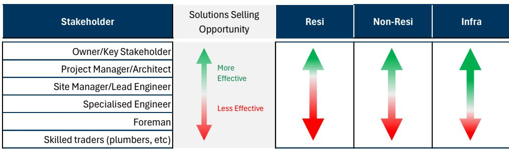  
来源：GS全球研究

图表17：...利益相关者的参与因阶段和组件而异
GS跨利益相关者的销售渠道分析框架

<table><tr><td rowspan="2"></td><td colspan="2">施工前</td><td colspan="3">施工阶段</td></tr><tr><td>地基工程</td><td>混凝土</td><td>外部</td><td>屋顶</td><td>内部</td></tr><tr><td>业主</td><td></td><td></td><td>✓ ✓ ✓</td><td>✓ ✓ ✓</td><td>✓ ✓ ✓</td></tr><tr><td>项目经理/建筑师</td><td>✓</td><td>✓</td><td>✓ ✓ ✓</td><td>✓ ✓ ✓</td><td>✓ ✓ ✓</td></tr><tr><td>现场经理</td><td>✓ ✓</td><td>✓ ✓</td><td>✓ ✓</td><td>✓ ✓</td><td>✓ ✓</td></tr><tr><td>专业工程师</td><td>✓ ✓</td><td>✓ ✓</td><td>✓</td><td>✓</td><td>✓</td></tr><tr><td>工头</td><td>✓</td><td>✓</td><td></td><td></td><td></td></tr><tr><td>熟练技工</td><td></td><td></td><td>✓</td><td>✓</td><td>✓</td></tr></table>

来源：GS全球研究

## 维度三：利润获取

什么允许利润获取？当解决方案产品来自高利润相邻品类，或产品具有垂直整合的投入时，单位经济性可能获得提升。

## 利润获取策略

\- 基础设施材料支出（CRH）：CRH在水泥/骨料、高速公路和水务基础设施方面的服务提供了有意义的供应链协同效应，值得注意的是水务领域超过80%的产品消耗骨料/水泥，超过85%的道路需要水管理系统。这也为其销售和分销网络创造了协同效应，因为终端客户和工地通常重叠，CRH报告其水务基础设施业务在FY'25的EBITDA利润率约为30%。

\- 高利润、低单价产品（Armstrong）：Armstrong的建筑专业部门在FY'25报告调整后EBITDA利润率为15.3%，而其矿物纤维部门在FY'25报告调整后EBITDA利润率为42.1%。Armstrong利用其高规格的建筑外部/内部产品，将其高销量、低价格的天花板砖作为打包服务进行交叉销售，为建筑师在内部解决方案方面简化决策。

■ 墙体解决方案（Holcim）：Holcim认为Xella收购将带来6000万欧元的协同效应，其中约一半来自成本，因为Xella受益于原材料采购协同效应。因此，我们认为鉴于其成本基础的垂直整合，该产品对Holcim来说具有一定吸引力。

它如何为客户增加价值？制造商可以将更高的产品盈利能力转化为更具竞争力的定价。

它如何为建筑材料公司提供收入增长潜力？更高的盈利能力使公司能够在价格上更具竞争力，或获取更多的单位经济性。

GS观点：我们认为，高利润相邻产品的拉动是一个选择性机会，适用于一些较小的产品品类。尽管如此，在这些情况下，它可以是超额盈利增长的重要驱动力。

## 估值方法与主要风险

Armstrong World Industries Inc.（买入，由Susan Maklari覆盖）：我们的12个月目标价为210美元，基于13.8倍我们的Q5-Q8调整后EBITDA估计。下行风险包括：1）原材料成本增加且无法转嫁；2）战略举措延迟或无法交付；3）新产品未能按预期速度获得市场认可；4）无法整合近期收购；5）WAVE合资企业的变化可能对公司产生不利影响。

Holcim（买入）：我们的12个月目标价为88瑞士法郎，基于等权重的DCF估值（WACC 7.2%，TGR +1%）和PE估值87瑞士法郎/股。主要下行风险：（1）更显著和持续的能源通胀导致运营成本压力；（2）欧洲周期弱于预期；（3）欧洲同行理性竞争以量换价；（4）解决方案业务的稀释性并购；（5）CBAM执行和淘汰时间表影响相对表现；（6）拉美/墨西哥利润率面对竞争的可持续性；（7）CCUS运输和存储合作伙伴关系的瓶颈；（8）脱碳和CCUS资本支出超支。

Kingspan（中性）：我们的12个月目标价为80欧元，基于18倍市盈率应用于我们的前瞻估计。上行风险：（1）美国屋顶业务的商业进展；（2）更大的数据中心需求持续时间；（3）板材新产品增长动力；（4）进一步的欧洲保温板/泡沫整合。下行风险：（1）美国屋顶业务爬坡延迟；（2）能源通胀导致的价格/成本压力。

Saint-Gobain（中性）：我们的12个月目标价为84欧元，基于12倍市盈率应用于我们的前瞻估计。上行风险：（1）欧洲建筑周期强于预期；（2）持续的低利润业务组合轮换；（3）结构性增长动力的更多证据；（4）额外的成本削减计划；（5）高于预期的股东回报。下行风险：（1）利率长期维持高位作为建筑周期的关键驱动因素；（2）消费者信心下降；（3）运营杠杆弱于预期；（4）稀释性并购；（5）来自竞争对手的更大定价竞争或新产能。

Sika（买入）：我们的12个月目标价，基于24倍市盈率方法，为210瑞士法郎/股。下行风险：（1）美国和中国的建筑周期弱于预期；（2）能源成本通胀高于预期，伴随政治不稳定和关税；（3）补强型并购节奏放缓；（4）新产品的收入影响有限；（5）建筑化学品品类财务吸引力导致的竞争加剧；（6）随着公司成熟，运营效率提升有限。

## 附录

## Reg AC

我们，Ben Rada Martin, Susan Maklari, Charles Perron-Piche, CFA, Natasha Phillips和Patrick Creuset，特此证明本报告中表达的所有观点准确反映了我们对相关公司及其证券的个人观点。我们还证明，我们的报酬中没有任何部分直接或间接与本次报告中表达的具体建议或观点相关。

除非另有说明，本报告封面上列出的个人是GS全球研究部门的分析师。

贡献作者：Ben Rada Martin GS International, Susan Maklari GS & Co. LLC, Charles Perron-Piche, CFA GS & Co. LLC, Natasha Phillips GS International, Patrick Creuset GS Bank Europe SE - Paris Branch。

除非另有说明，本报告贡献作者披露中列出的个人是GS全球研究部门的分析师。

## GS因子概况

GS因子概况通过将股票的关键属性与市场（即我们评级的股票范围）及其行业同行进行比较，提供投资背景。描绘的四个关键属性是：增长、财务回报、倍数（如估值）和综合（增长、财务回报和倍数的综合）。增长、财务回报和倍数通过使用每只股票特定指标的标准化排名计算。指标的标准化排名然后被平均并转换为相关属性的百分位数。每个指标的具体计算可能因财年、行业和地区而异，但标准方法如下：

增长基于股票的前瞻性销售增长、EBITDA增长和每股收益增长，较高的百分位数表示增长较高的公司。财务回报基于股票的前瞻性ROE、ROCE和CROCI，较高的百分位数表示财务回报较高的公司。倍数基于股票的前瞻性市盈率、市净率、股息率、EV/EBITDA、EV/FCF和EV/债务调整后现金流，较高的百分位数表示交易倍数较高的股票。综合百分位数计算为增长百分位数、财务回报百分位数和（100% - 倍数百分位数）的平均值。

财务回报和倍数使用GS分析师对未来至少三个季度后的财年末的预测。增长使用对未来至少七个季度后的财年与未来至少三个季度后的财年相比的输入。

有关我们如何计算GS因子概况的更详细描述，请联系您的GS代表。

## 并购排名

在我们的全球覆盖范围内，我们使用并购框架检查股票，考虑定性因素和定量因素，以纳入某些公司可能被收购的潜力。然后我们分配并购排名，从1到3对评级覆盖下的公司进行评分，1表示高概率（30%-50%），2表示中等概率（15%-30%），3表示低概率（0%-15%）。对于排名为1或2的公司，按照我们的标准部门指南，我们将并购组件纳入目标价。并购排名3被视为不重要，因此不计入我们的目标价，并且可能在研究中讨论或不讨论。

## Quantum

Quantum是GS的专有数据库，提供详细的财务报表历史、预测和比率的访问。它可用于对单一公司进行深入分析，或比较不同行业和市场的公司。

## 披露

## 评级和定价信息

Armstrong World Industries Inc.（买入，158.56美元），Holcim（买入，74.88瑞士法郎），Kingspan（中性，79.20欧元），Saint-Gobain（中性，79.86欧元）和Sika（买入，172.70瑞士法郎）。

Holcim、Kingspan、Saint-Gobain和Sika的评级相对于其覆盖范围内的其他公司：Buzzi, Heidelberg Materials, Holcim, Kingspan, Rockwool, Saint-Gobain, Sika

Armstrong World Industries Inc.的评级相对于其覆盖范围内的其他公司：A.O. Smith Corp., Alliance Laundry Holdings Inc., Armstrong World Industries Inc., Boise Cascade Co., Builders FirstSource Inc., CSW Industrials Inc., Carlisle Companies Inc., D.R. Horton Inc., Fortune Brands Innovations Inc., Installed Building Products Inc., JELD-WEN Holding, KB Home, Latham Group Inc., Lennar Corp., Louisiana-Pacific Corp., Masco Corp., Meritage Homes Corp., Mohawk Industries Inc., Owens Corning, Pool Corp., PulteGroup Inc., SiteOne Landscape Supply Inc., Toll Brothers Inc., Trex Company Inc., Weyerhaeuser Co., Whirlpool Corp., Worthington Enterprises Inc.

## 公司特定监管披露

以下披露涉及GS与本次研究中提及的覆盖公司之间的关系。

GS实益拥有1%或以上的普通股权益：Armstrong World Industries Inc.和Saint-Gobain

GS在过去12个月内因投资银行服务获得报酬：Holcim和Saint-Gobain

GS预计在未来3个月内寻求投资银行服务报酬：Armstrong World
