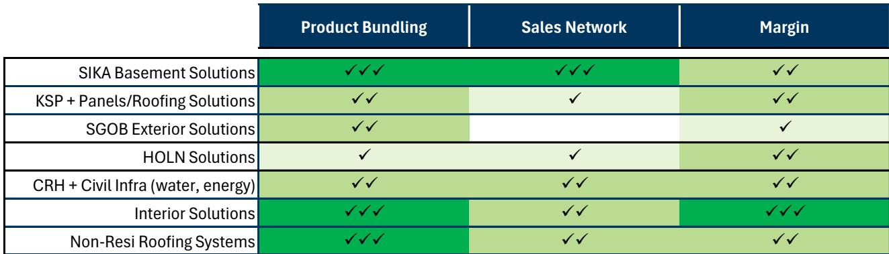
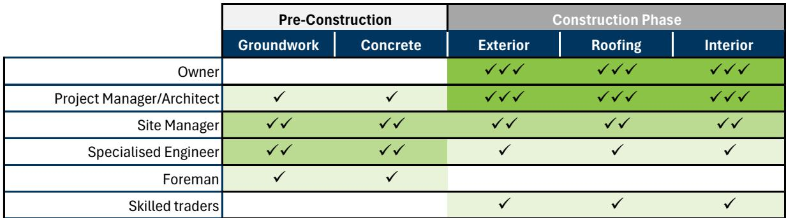
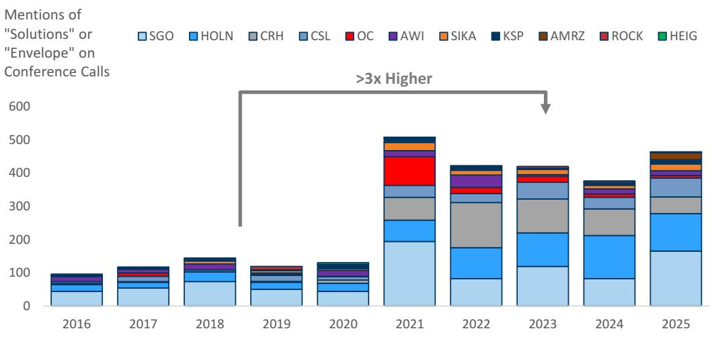

# GS：建材公司的方案战略，不是所有公司都能成功

过去五年，“解决方案”或“建筑围护”战略成为全球建材巨头最热门的叙事，相关表述在业绩会议上出现的频率是之前五年的三倍。但GS最新的一份研究给出了一个更冷静的判断：这套打法在某些品类中是真正的增长引擎，在更多公司手里则只是一个资本部署的渠道。

这不是一个关于“要不要做”的问题，而是一个“谁适合做、怎么做才算有效”的问题。

## 1. 真正有效的解决方案战略，依赖三个条件

GS梳理出一个分析框架，认为只有同时满足以下三个维度的解决方案战略，才有可能带来持续的超额回报。

第一，产品必须能形成系统。不是把几个产品放在一起卖就叫解决方案，而是这些产品在功能上相互依赖，比如屋顶系统需要防水层、保温层、隔汽层和核心膜材协同工作。如果某个组件失效，整个系统都会出问题。这种技术复杂性，恰恰是制造商的议价来源。

第二，销售网络必须触达同一个决策者。如果卖水泥的客户是工地上的工头，而卖防水膜材的客户是结构工程师，那这两类产品就很难形成交叉销售。GS特别强调，解决方案战略最有效的场景，是产品在施工流程中早介入、长周期接触同一个决策者。

第三，高毛利配套产品能拉动利润。系统销售的核心逻辑，是用一个技术门槛高的“锚点产品”带动周边低毛利产品的出货量。比如Sika的地下室防水膜材，本身增速快、毛利高，还能拉动混凝土外加剂的销售。

> **KC评论：** 这个框架的价值在于，它帮读者区分了“真系统”和“伪系统”。很多公司说自己做解决方案，但产品之间没有技术关联，客户也不是同一拨人，本质上只是在做加法，而不是做乘法。完整报告里有一张打分表，把覆盖的每家公司的三个维度都标了分数，值得细看。

## 2. Sika和Kingspan是少数被GS认可的案例

在GS覆盖的公司里，Sika和Kingspan被认为拥有较强的解决方案战略。

Sika的地下室防水业务是一个教科书式的案例。它的SikaProof A+膜材搭配混凝土外加剂，提供20年质保，过去三年销售额年复合增长率达到27%。GS指出，Sika的研发投入在同行中最高，23%到25%的销售额来自上市不到五年的产品，这些新品的毛利率通常高出3到5个百分点。更重要的是，防水系统虽然只占建筑总成本的不到1%，但一旦出问题，修复成本极高，这让开发商愿意为高质量系统支付溢价。

Kingspan则在美国非住宅屋顶市场寻找增长空间。它原本在金属面板市场拥有约40%的份额，现在试图将屋顶系统与面板打包，提供完整的建筑外围护解决方案，附带最长40年的质保。GS认为逻辑成立，但也谨慎指出，美国屋顶市场存在很强的承包商忠诚度和分销商关系壁垒，Kingspan的TPO膜材要到2026年四季度才能投产，执行效果尚需观察。

## 3. 大公司的“解决方案”更多是资本配置，而非增长引擎

对于Saint Gobain和Holcim这样的巨头，GS的判断明显更保守。

Saint Gobain在2025年10月举行的读者日上，展示了一个“15倍利润、10倍收入”的交叉销售上升空间。但GS指出，这家公司在北美（其解决方案能力较强的区域）的营收表现，实际上并没有跑赢当地同行。其澳大利亚子公司CSR也推行过类似策略，同样没有看到超额增长。

Holcim刚刚完成了对欧洲墙体供应商Xella的收购，这是其“建筑围护”战略的关键一步。但GS认为，混凝土本身是高度同质化的产品，客户价格敏感，决策者（工头）与墙体产品的决策者（建筑师）不同，系统协同效应有限。报告还引用了Holcim美国子公司AMRZ的数据：该公司自2022年推进解决方案战略以来，营收表现与同行基本一致，并未跑赢。

> **KC评论：** GS对Holcim和Saint Gobain的质疑，其实指向一个更深层的问题：当公司的核心产品是水泥、石膏板这类标准化大宗品时，解决方案战略更多是一个并购故事，而非运营故事。报告没有完全回答的问题是：这些公司能否通过组织变革，真正改变销售模式和客户触达方式？目前看，证据还不充分。

## 4. 报告尚未完全回答的关键问题

GS的框架很清晰，但有几个问题值得追问。

第一，解决方案战略对资本回报率的影响到底如何？报告讨论了收入和利润，但没有系统分析这些战略是否提升了ROIC。如果并购驱动的解决方案只是扩大了资产规模而没有提高回报率，那它本质上是在用低回报换增长。

第二，客户是否真的愿意为“系统”支付溢价？GS引用了Sika和Carlisle的成功案例，但这些公司的产品本身就具备技术壁垒。如果缺少技术锚点，只是把标准化产品打包，客户为什么要多付钱？这一点在Saint Gobain和Holcim的案例中还没有得到验证。

第三，解决方案战略是否会导致产品组合过度复杂？当一家公司同时卖水泥、防水材料、保温板和屋顶系统，它的供应链和销售体系能否支撑？如果每个品类都需要不同的渠道和售后服务，规模可能变成负担而非优势。

这些问题的答案，可能决定了哪些公司能真正把解决方案战略变成护城河，哪些公司只是在“用更大的篮子装更多的鸡蛋”。

---

For informational purposes only. Portions may be generated,translated,summarized,or edited with AI assistance based on source materials and may contain omissions or errors. Please verify independently. This is not investment,legal,tax,accounting,or other professional advice.

For informational purposes only. Portions may be generated,translated,summarized,or edited with AI assistance based on source materials and may contain omissions or errors. Please verify independently. This is not investment,legal,tax,accounting,or other professional advice.

