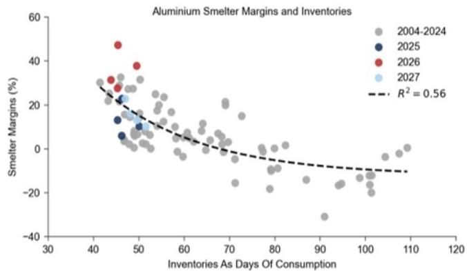

# 基本金属观察：铝——中东供应恢复加速，下调2027年价格预测至2700美元/吨

随着Al Taweelah铝冶炼厂恢复进度快于预期的消息传出，热金属生产已恢复，约7%的电解槽重新运行，我们相应调整了恢复预期，预计到2027年第一季度末实现全面生产恢复，而此前预期为2027年底。需要说明的是，EGA仍表示恢复到事故前水平可能需要长达一年时间，目前仅约20%的电解槽已完成冻结金属清除——这是在断电后金属在电解槽内凝固后重启的必要步骤。不过，公司正在努力加快进度，市场反馈显示存在更快恢复的空间。

除Al Taweelah外，最新行业反馈也表明中东地区整体供应恢复速度加快。综合来看，Al Taweelah的更快恢复和更广泛的区域恢复，使我们对2026年供应预测增加62万吨，2027年增加92万吨，相比此前基准情景，2026年缺口从72万吨缩小至10万吨，2027年盈余从59万吨提升至约150万吨（图1）。相应地，我们将2026年第四季度LME铝报价预测从3200美元/吨下调至2950美元/吨，2027年均价预测从2950美元/吨下调至2700美元/吨，低于远期合约的3056美元/吨（图2）。我们预计库存将在2027年重建，推动冶炼厂利润率从近期高位回归正常水平（图3）。

铝价已出现明显调整，从最初局势缓和消息时的约3400美元/吨回落至3100美元/吨，反映了市场在定价更快的供应恢复时降低了中东扰动溢价，同时伴随科技/AI板块调整和美联储重新定价引发的宏观环境变化。

中东供应恢复节奏的风险仍存在双向可能。若区域恢复更快，Al Taweelah在2026年底前恢复满产且中东其他产能回归，2027年盈余可能升至约170万吨，均价或接近2600美元/吨。若恢复较慢，Al Taweelah需12个月恢复满产且区域恢复接近此前预期，2027年盈余约110万吨，均价约2800美元/吨。

更早的重启强化了我们对明年价格的观察，这主要反映了我们认为印尼供应将在2027年为全球供应增加1.5%（即同比增长120万吨）的判断（图4）。因此，我们维持对2027年12月LME铝的短期观察，以及做多2027年12月铜与做空2027年12月铝的配对观察。两项观察的主要风险仍在于局势再度升级或恢复进度慢于预期。

Lavinia Forcellese +44(20)7774-9243 | lavinia.forcellese@gs.com GS International

Aurelia Waltham  
+44(20)7051-2547 |  
aurelia.waltham@gs.com  
GS International

Daan Struyven  
+1(212)357-4172 |  
daan.struyven@gs.com  
GS & Co. LLC

Samantha Dart +1(212)357-9428 | samantha.dart@gs.com GS & Co. LLC

图1：我们预计2026年市场接近平衡，2027年出现150万吨盈余  
  
来源：CRU, Wood Mackenzie, SMM, GS全球研究

图2：因中东供应恢复加速，我们将2027年价格预测下调至2700美元  
  
来源：Bloomberg, GS全球研究

图3：我们预计随着库存明年重建，铝冶炼厂利润率将回归正常  

利润率按LME铝价相对于估计的第90百分位冶炼厂成本计算。库存包括可见液体库存（LME、SHFE、CME、日本港口库存和中国社会库存），以及生产商库存、政府储备和估计未报告库存。数据为季度数据，时间跨度2004-2024年，不包括2009年第四季度至2011年第四季度（当时LME仓库排队影响价格）。

图4：印尼供应增长和中东恢复推动2027年盈余  
  
来源：CRU, SMM, Wood Mackenzie, GS全球研究

来源：CRU, Bloomberg, SMM, GS全球研究

## 附录

图5：我们预计铝市场明年将转为盈余

<table><tr><td colspan="9">全球铝市场平衡表</td></tr><tr><td>千吨</td><td>2023</td><td>2024</td><td>2025</td><td>2026</td><td>2027</td><td>2028</td><td>2029</td><td>2030</td></tr><tr><td>市场平衡</td><td></td><td></td><td></td><td></td><td></td><td></td><td></td><td></td></tr><tr><td>原铝产量</td><td>70,689</td><td>73,247</td><td>74,703</td><td>75,065</td><td>78,905</td><td>81,044</td><td>83,168</td><td>84,032</td></tr><tr><td>原铝消费</td><td>70,210</td><td>73,091</td><td>74,997</td><td>75,165</td><td>77,405</td><td>78,979</td><td>80,958</td><td>83,192</td></tr><tr><td>市场平衡</td><td>479</td><td>156</td><td>-294</td><td>-100</td><td>1500</td><td>2064</td><td>2210</td><td>840</td></tr><tr><td>总库存</td><td>9,559</td><td>9,715</td><td>9,421</td><td>9,322</td><td>10,821</td><td>12,886</td><td>15,096</td><td>15,936</td></tr><tr><td>按消费天数</td><td>50</td><td>49</td><td>46</td><td>45</td><td>51</td><td>60</td><td>68</td><td>70</td></tr><tr><td>报告库存</td><td>3,671</td><td>3,796</td><td>3,631</td><td>3,518</td><td>5,018</td><td>7,078</td><td>9,289</td><td>10,129</td></tr><tr><td>同比变化</td><td>264</td><td>125</td><td>-164</td><td>-114</td><td>1500</td><td>2060</td><td>2211</td><td>840</td></tr><tr><td>产量</td><td></td><td></td><td></td><td></td><td></td><td></td><td></td><td></td></tr><tr><td>原铝产量</td><td>70,689</td><td>73,247</td><td>74,703</td><td>75,065</td><td>78,905</td><td>81,044</td><td>83,168</td><td>84,032</td></tr><tr><td>同比变化</td><td>2.7%</td><td>3.6%</td><td>2.0%</td><td>0.5%</td><td>5.1%</td><td>2.7%</td><td>2.6%</td><td>1.0%</td></tr><tr><td>中国</td><td>41,584</td><td>43,547</td><td>44,523</td><td>45,600</td><td>46,270</td><td>46,200</td><td>46,000</td><td>46,000</td></tr><tr><td>全球除中国</td><td>29,105</td><td>29,700</td><td>30,179</td><td>29,465</td><td>32,635</td><td>34,844</td><td>37,168</td><td>38,032</td></tr><tr><td>消费</td><td></td><td></td><td></td><td></td><td></td><td></td><td></td><td></td></tr><tr><td>铝总消费</td><td>98,175</td><td>100,982</td><td>103,442</td><td>104,149</td><td>106,993</td><td>109,174</td><td>111,834</td><td>114,887</td></tr><tr><td>同比变化</td><td>2.3%</td><td>2.9%</td><td>2.4%</td><td>0.7%</td><td>2.7%</td><td>2.0%</td><td>2.4%</td><td>2.7%</td></tr><tr><td>其中</td><td></td><td></td><td></td><td></td><td></td><td></td><td></td><td></td></tr><tr><td>电网与电力基础设施</td><td>11,479</td><td>12,490</td><td>13,344</td><td>14,418</td><td>15,224</td><td>15,946</td><td>16,855</td><td>17,868</td></tr><tr><td>电动车与可再生能源</td><td>7,734</td><td>9,298</td><td>10,804</td><td>10,943</td><td>11,696</td><td>12,297</td><td>13,658</td><td>15,253</td></tr><tr><td>电气化需求占比</td><td>20%</td><td>22%</td><td>23%</td><td>24%</td><td>25%</td><td>26%</td><td>27%</td><td>29%</td></tr><tr><td>中国建筑</td><td>10,038</td><td>9,435</td><td>8,055</td><td>7,068</td><td>6,680</td><td>6,425</td><td>6,232</td><td>6,045</td></tr><tr><td>世界其他地区</td><td>68,924</td><td>69,758</td><td>71,238</td><td>71,720</td><td>73,393</td><td>74,505</td><td>75,089</td><td>75,721</td></tr><tr><td>原铝消费</td><td>70,210</td><td>73,091</td><td>74,997</td><td>75,165</td><td>77,405</td><td>78,979</td><td>80,958</td><td>83,192</td></tr><tr><td>同比变化</td><td>1.4%</td><td>4.1%</td><td>2.6%</td><td>0.2%</td><td>3.0%</td><td>2.0%</td><td>2.5%</td><td>2.8%</td></tr><tr><td>中国</td><td>42,888</td><td>45,471</td><td>46,815</td><td>47,090</td><td>48,404</td><td>49,573</td><td>51,132</td><td>52,777</td></tr><tr><td>全球除中国</td><td>27,322</td><td>27,620</td><td>28,182</td><td>28,075</td><td>29,001</td><td>29,406</td><td>29,826</td><td>30,415</td></tr><tr><td>废铝总消费</td><td>29,928</td><td>29,911</td><td>30,514</td><td>31,067</td><td>31,728</td><td>32,378</td><td>33,113</td><td>33,994</td></tr><tr><td>同比变化</td><td>4.5%</td><td>-0.1%</td><td>2.0%</td><td>1.8%</td><td>2.1%</td><td>2.0%</td><td>2.3%</td><td>2.7%</td></tr><tr><td>废铝占消费比</td><td>30%</td><td>29%</td><td>29%</td><td>29%</td><td>29%</td><td>29%</td><td>29%</td><td>29%</td></tr><tr><td>铝价预测，美元/吨</td><td>2,285</td><td>2,457</td><td>2,640</td><td>3,200</td><td>2,700</td><td>2,600</td><td>2,700</td><td>2,800</td></tr><tr><td>区域铝市场平衡</td><td></td><td></td><td></td><td></td><td></td><td></td><td></td><td></td></tr><tr><td>原铝净贸易前</td><td></td><td></td><td></td><td></td><td></td><td></td><td></td><td></td></tr><tr><td>中国</td><td>(1,304)</td><td>(1,924)</td><td>(2,291)</td><td>(1,490)</td><td>(2,134)</td><td>(3,373)</td><td>(5,132)</td><td>(6,777)</td></tr><tr><td>全球除中国</td><td>1,783</td><td>2,080</td><td>1,997</td><td>1,390</td><td>3,634</td><td>5,437</td><td>7,343</td><td>7,617</td></tr><tr><td>中国原铝净进口</td><td>1,458</td><td>2,097</td><td>2,479</td><td>2,700</td><td>3,000</td><td>3,900</td><td>5,400</td><td>6,600</td></tr><tr><td>原铝净贸易后</td><td></td><td></td><td></td><td></td><td></td><td></td><td></td><td></td></tr><tr><td>中国</td><td>154</td><td>173</td><td>188</td><td>1,210</td><td>866</td><td>527</td><td>268</td><td>(177)</td></tr><tr><td>全球除中国</td><td>325</td><td>(17)</td><td>(482)</td><td>(1,310)</td><td>634</td><td>1,537</td><td>1,943</td><td>1,017</td></tr></table>

来源：CRU, Wood Mackenzie, SMM, Bloomberg, GS全球研究

图6：我们预计随着盈余积累，LME铝价将在2027年逐步调整

<table><tr><td colspan="3">GS预测（美元/吨）</td><td rowspan="2">LME铝远期合约</td></tr><tr><td></td><td>LME铝（新）</td><td>LME铝（此前）</td></tr><tr><td>2026</td><td>3,200</td><td>3,300</td><td>3,089</td></tr><tr><td>2027</td><td>2,700</td><td>2,950</td><td>3,056</td></tr><tr><td>2028</td><td>2,600</td><td>2,800</td><td>3,012</td></tr><tr><td>2026年第三季度</td><td>3,075</td><td>3,300</td><td>3,091</td></tr><tr><td>2026年第四季度</td><td>2,950</td><td>3,200</td><td>3,086</td></tr><tr><td>2027年第一季度</td><td>2,850</td><td>3,100</td><td>3,073</td></tr><tr><td>2027年第二季度</td><td>2,700</td><td>3,000</td><td>3,062</td></tr><tr><td>2027年第三季度</td><td>2,650</td><td>2,900</td><td>3,051</td></tr><tr><td>2027年第四季度</td><td>2,600</td><td>2,800</td><td>3,036</td></tr><tr><td>2026年7月</td><td>3,100</td><td>3,410</td><td>3,089</td></tr><tr><td>2026年8月</td><td>3,075</td><td>3,300</td><td>3,091</td></tr><tr><td>2026年9月</td><td>3,035</td><td>3,265</td><td>3,093</td></tr><tr><td>2026年10月</td><td>2,990</td><td>3,235</td><td>3,091</td></tr><tr><td>2026年11月</td><td>2,950</td><td>3,200</td><td>3,087</td></tr><tr><td>2026年12月</td><td>2,915</td><td>3,165</td><td>3,082</td></tr></table>

来源：Bloomberg, GS全球研究
