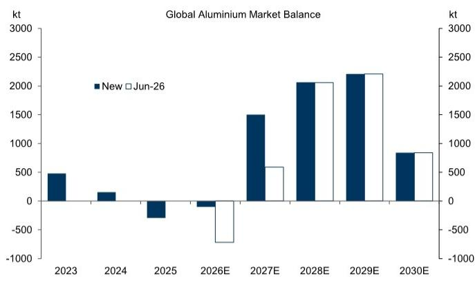
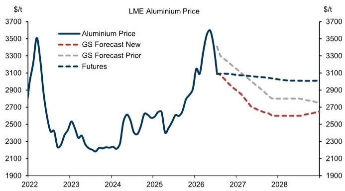
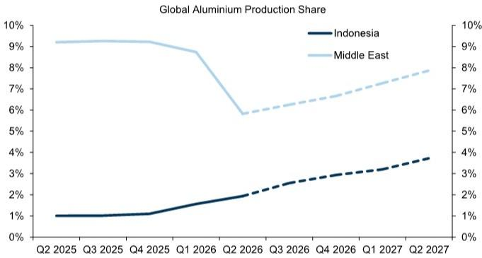

# GS：铝价从3400跌至3100，GS认为这还不是终点

阿联酋Al Taweelah铝冶炼厂的复产进度，比所有人预想的都要快。当市场还在按照“事故后需要一年恢复”来定价时，GS的最新报告指出，这家工厂的复产节奏已经提前，中东地区的供应恢复速度整体在加快。这一变化直接改写了2026-2027年的全球铝市场平衡表。

GS将2027年铝价预测从此前的2950美元/吨下调至2700美元/吨，核心逻辑只有一个：供应侧的超预期恢复正在把市场从短缺推向过剩。

这份报告的判断并不复杂，但它的意义在于，它清晰划出了一条分界线——过去两年支撑铝价的中东供应扰动溢价，正在快速消退。铝价已经从地缘消息传出后的3400美元/吨附近，跌至3100美元/吨左右。GS认为，这还不是终点。

## 1. 一个冶炼厂的复产，改写了全球供需平衡

Al Taweelah并非普通工厂。它是阿联酋环球铝业（EGA）的核心资产，2024年因电力中断导致部分电解槽停运。按照公司此前的说法，恢复到事故前水平需要长达一年。但最新的进展是，热金属生产已经恢复，约7%的电解槽重新上线。GS据此将全面复产的预期从2027年底提前至2027年一季度。

更关键的是，这并非孤例。报告提到，中东地区其他产能的恢复速度也在加快。两股力量叠加，GS将2026年的供应预测上调了62万吨，2027年上调了92万吨。结果就是：2026年的市场缺口从72万吨大幅收窄至10万吨，2027年则从59万吨的缺口直接转为约150万吨的过剩。

> **KC评论：** 对于关注铝市场的读者，这个数字变化意味着，2027年的铝价中枢很可能低于当前期货价格。报告中的表格显示，2027年LME铝期货价格仍在3056美元/吨附近，而GS的新预测是2700美元/吨，差距超过10%。这组数字本身就值得仔细看。

## 2. 印尼才是那个更长期的变量

中东复产加速是短期催化剂，但GS看空铝价的真正底气来自印尼。报告明确指出，2027年全球铝供应将同比增长约1.2%，其中印尼的产能释放贡献了1.5个百分点。换句话说，即使没有中东复产，印尼的供应增长也足以让市场承压。

印尼的铝产能扩张并非新闻，但市场此前对投产节奏存在分歧。GS此次将印尼的供应假设维持不变，意味着它认为印尼的产能释放并不会因为铝价下跌而节奏变化。这一点值得留意——如果印尼的投产进度超出预期，2027年的过剩规模可能进一步扩大。

报告给出了一个不确定性情景：如果中东复产加速叠加印尼满产，2027年过剩可能达到170万吨，对应铝价可能跌至2600美元/吨。反之，如果复产节奏节奏变化，过剩规模约110万吨，价格可能在2800美元/吨附近。

> **KC评论：** GS的报告没有讨论需求侧的变化，但读者需要知道，它的需求假设是相对稳健的——2026年全球铝消费增长仅0.2%，2027年恢复至3%。如果全球宏观环境出现变化，这个需求假设本身也有被修正的可能。报告里的平衡表附录值得仔细看。

## 3. 报告没有完全回答的问题：中国的角色

GS在这份报告中几乎没有讨论中国。但从附录的平衡表可以看到，中国在2026-2027年仍将是铝的净进口国，且进口量从2025年的248万吨逐步上升至2027年的300万吨。这意味着，全球过剩的不确定性能否真正传导至价格，很大程度上取决于中国市场的吸收能力。

中国自身的铝产能已经接近天花板，但废铝回收和再生铝的增量正在增加。如果中国需求出现变化，或者废铝替代效应加速，全球平衡表可能需要重新调整。GS没有展开这部分，但对于关注铝价的读者来说，这是一个不能忽视的观察维度。

## 4. 对定价框架的重新审视

GS在报告末尾重申了对2027年12月LME铝的空头建议，以及做多铜、做空铝的对冲策略。但更值得关注的不是具体交易，而是定价逻辑的变化。

过去两年，铝价中始终包含一个“中东地缘溢价”。这个溢价的大小取决于市场对供应中断不确定性的定价。如今，随着复产信号不断出现，这个溢价正在被系统性挤出。GS的预测相当于在说：到2027年，铝价将不再反映任何供应不确定性，而是回到由成本曲线和库存水平决定的均衡价格。

对于产业链企业而言，这意味着需要重新审视库存策略和远期采购安排。对于关注大宗商品的读者，这份报告提供了一个清晰的案例：当一个结构性供应扰动开始消退时，价格回归的速度往往比大多数人预期的要快。

---

For informational purposes only. Portions may be generated,translated,summarized,or edited with AI assistance based on source materials and may contain omissions or errors. Please verify independently. This is not investment,legal,tax,accounting,or other professional advice.

For informational purposes only. Portions may be generated,translated,summarized,or edited with AI assistance based on source materials and may contain omissions or errors. Please verify independently. This is not investment,legal,tax,accounting,or other professional advice.

