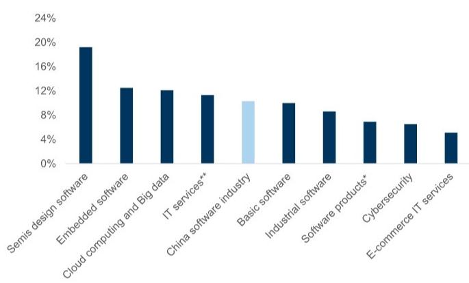
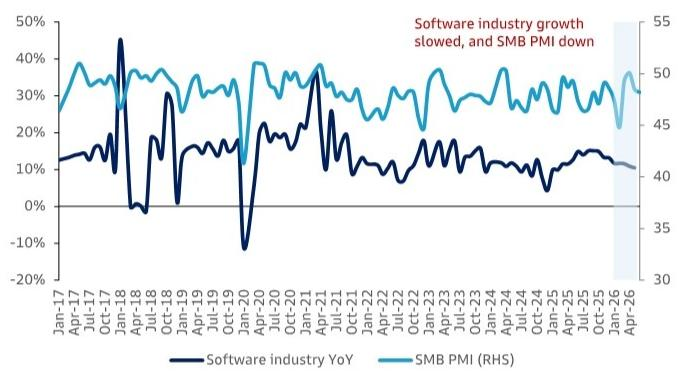
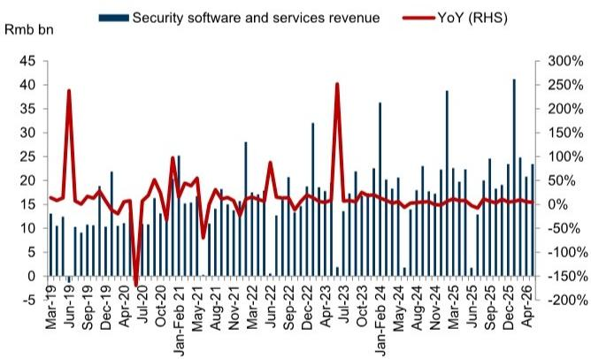
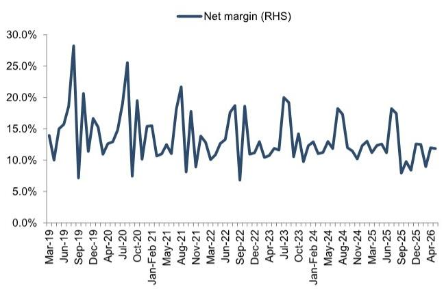
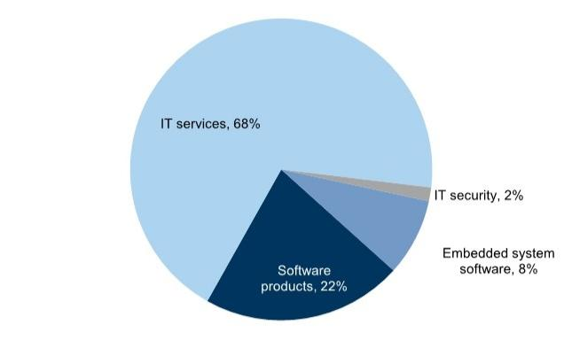

# 中国软件行业观察：5月营收同比增长8.5%；AI代理与定制化行业AI有望推动客户支出

中国软件行业5月营收同比增长8.5%（对比4月/5月2025年分别为+8.9%/12.4%），增速较前几个月有所变化，前5个月累计营收同比增长10.5%（对比5M25为11.2%）。展望第三季度，我们预计随着季节性因素改善，环比将呈现增长态势；同时观察到软件支出仍集中于AI基础模型和定制化AI模型项目。我们看到AI代理的变现加速和应用场景扩展，例如利用AI代理保留资深员工的内部经验，或以更高效率实现生产场所的多样化。面向消费者端，我们看到用户利用多模态AI模型生成内容，并在日常中采用个人AI助手（如搜索文件、聊天等）。

我们关注AI产品动态、中小企业PMI数据、公司招聘、盈利能力和产品迭代，以追踪中国软件支出恢复的路径。分板块看，半导体设计、IT服务、云计算与大数据在5月表现较好，其中IT服务贡献了中国软件行业的主要营收。中小企业PMI在6月有所下降，近期呈现波动。

关注方向：AI领域：商汤、美图；金融科技：恒生电子；物联网软件：涂鸦智能。更多内容：中国软件产品追踪；商汤科技；美图公司。

## 5月软件行业增速变化；6月中小企业PMI环比下降

中国软件行业增速在2026年5月放缓至同比增长8.5%（对比2026年4月的8.9%），中小企业PMI在6月降至48.2（对比4月/5月的50.1/48.5）。我们预计2026年第二季度因季节性因素改善将呈现环比增长，但整体客户软件支出保持平稳，部分项目集中于AI基础模型和定制化AI模型。我们看到AI功能的采用率正在上升，并预计在文本/图像/视频内容生成的AI基础模型方面将取得新进展，从而推动应用生态和客户IT支出。

## 中国软件板块关键指标：

GS与其研究报告中所覆盖的公司开展业务并寻求开展业务。因此，读者应注意，该公司可能存在利益冲突，可能影响本报告的客观性。读者应将本报告视为做出投资决策的单一因素。有关Reg AC认证及其他重要披露，请参阅披露附录，或访问www.gs.com/research/hedge.html。非美国关联公司聘用的分析师未在FINRA注册/具备美国研究分析师资格。

Allen Chang  
+852-2978-2930 |  
allen.k.chang@gs.com  
GS (Asia) L.L.C.

Verena Jeng  
+852-2978-1681 | verena.jeng@gs.com  
GS (Asia) L.L.C.

Ting Song
+852-2978-6466 | ting.song@gs.com
GS (Asia) L.L.C.

Simon Cheung, CFA +852-2978-6102 | simon.cheung@gs.com GS (Asia) L.L.C.

Timothy Zhao  
+852-2978-2673 | timothy.zhao@gs.com GS (Asia) L.L.C.

Shuo Yang, Ph.D. +852-2978-0701 | shuo.yang@gs.com GS (Asia) L.L.C.

中国中小企业PMI：PMI数据反映宏观环境动态，与软件市场和客户预算相关。2026年6月，中小企业PMI从5月的48.5降至48.2（图表3）。

2026年5月利润率保持稳定：根据工信部数据，中国软件行业5月净利润率为11.9%，4月为12.0%，显示运营效率有所改善。

图表1：中国软件行业5M26增速约为10%  
5M26中国软件行业各板块营收增长  
  
\*软件产品包括工业软件；\*\*IT服务包括电商IT服务、半导体设计软件、云计算与大数据。  
来源：工信部

图表2：2026年5月软件行业增速变化；2026年6月中小企业PMI有所波动  
  
来源：工信部、国家统计局

## 软件月度：5月营收同比增长8.5%，环比增长

## 2026年5月中国软件快读：

1. 营收同比增长8.5%，5M26累计增长10.3%，低于4M26的10.9%：根据工信部数据，5月中国注册软件企业总营收同比增长8.5%至1.6万亿元人民币（2190亿美元），5M26营收增长10.3%，低于4M26的11.3%。

2. 净利润率11.9%，5M26为11.5%，高于4M26的11.4%：根据工信部数据，5月中国注册软件企业净利润总额为1869亿元人民币（260亿美元），净利润率11.9%（对比2026年4月的12.0%），5M26净利润率11.5%，高于4M26的11.4%。

3. 海外收入占比升至3.2%：5月，中国注册软件企业来自非中国市场的总收入为70亿美元，海外收入占比升至3.2%（对比2026年4月的3.1%）。

4. IT服务仍是主要贡献者：根据工信部数据，5M26中国注册软件企业总营收（6.2万亿元人民币）主要来自IT服务（占总量的68%），其次是软件产品占22%，嵌入式系统软件占8%，安全软件及服务占2%。

图表3：中国软件市场概览

<table><tr><td></td><td>Apr-25</td><td>May-25</td><td>Jun-25</td><td>Jul-25</td><td>Aug-25</td><td>Sep-25</td><td>Oct-25</td><td>Nov-25</td><td>Dec-25</td><td>Jan-Feb 26</td><td>Mar-26</td><td>Apr-26</td><td>May-26</td></tr><tr><td colspan="14">中国软件市场</td></tr><tr><td>总营收（百万元人民币）*</td><td>1,080,566</td><td>1,452,355</td><td>1,397,917</td><td>1,266,200</td><td>1,316,100</td><td>1,471,800</td><td>1,397,700</td><td>1,467,300</td><td>1,505,500</td><td>2,153,500</td><td>1,338,500</td><td>1,176,600</td><td>1,576,400</td></tr><tr><td>软件产品</td><td>239,396</td><td>304,076</td><td>271,135</td><td>257,000</td><td>310,200</td><td>274,100</td><td>265,000</td><td>300,500</td><td>285,200</td><td>472,700</td><td>318,800</td><td>254,900</td><td>314,400</td></tr><tr><td>IT服务</td><td>723,960</td><td>1,044,459</td><td>994,241</td><td>888,400</td><td>867,000</td><td>1,051,700</td><td>962,000</td><td>1,005,100</td><td>1,026,200</td><td>1,447,400</td><td>895,700</td><td>790,100</td><td>1,142,900</td></tr><tr><td>安全软件</td><td>19,726</td><td>22,353</td><td>1,726</td><td>12,900</td><td>20,000</td><td>24,600</td><td>18,300</td><td>19,100</td><td>23,400</td><td>41,200</td><td>24,800</td><td>20,800</td><td>23,400</td></tr><tr><td>嵌入式系统软件</td><td>97,484</td><td>81,467</td><td>130,815</td><td>107,900</td><td>118,900</td><td>121,400</td><td>152,400</td><td>142,600</td><td>170,700</td><td>192,200</td><td>99,200</td><td>110,800</td><td>95,700</td></tr><tr><td>环比</td><td>-10%</td><td>34%</td><td>-4%</td><td>-9%</td><td>4%</td><td>12%</td><td>-5%</td><td>5%</td><td>3%</td><td></td><td></td><td>-12%</td><td>34%</td></tr><tr><td>软件产品</td><td>-18%</td><td>27%</td><td>-11%</td><td>-5%</td><td>21%</td><td>-12%</td><td>-3%</td><td>13%</td><td>-5%</td><td></td><td></td><td>-20%</td><td>23%</td></tr><tr><td>IT服务</td><td>-9%</td><td>44%</td><td>-5%</td><td>-11%</td><td>-2%</td><td>21%</td><td>-9%</td><td>4%</td><td>2%</td><td></td><td></td><td>-12%</td><td>45%</td></tr><tr><td>安全软件</td><td>-13%</td><td>13%</td><td>-92%</td><td>647%</td><td>55%</td><td>23%</td><td>-26%</td><td>4%</td><td>23%</td><td></td><td></td><td>-16%</td><td>13%</td></tr><tr><td>嵌入式系统软件</td><td>6%</td><td>-16%</td><td>61%</td><td>-18%</td><td>10%</td><td>2%</td><td>26%</td><td>-6%</td><td>20%</td><td></td><td></td><td>12%</td><td>-14%</td></tr><tr><td>同比</td><td>11%</td><td>12%</td><td>15%</td><td>14%</td><td>15%</td><td>15%</td><td>15%</td><td>15%</td><td>12%</td><td>12%</td><td>12%</td><td>9%</td><td>9%</td></tr><tr><td>软件产品</td><td>10%</td><td>10%</td><td>15%</td><td>11%</td><td>16%</td><td>8%</td><td>14%</td><td>13%</td><td>1%</td><td>8%</td><td>10%</td><td>6%</td><td>3%</td></tr><tr><td>IT服务</td><td>13%</td><td>13%</td><td>17%</td><td>16%</td><td>16%</td><td>18%</td><td>15%</td><td>16%</td><td>16%</td><td>13%</td><td>13%</td><td>9%</td><td>9%</td></tr><tr><td>安全软件</td><td>8%</td><td>8%</td><td>-3%</td><td>-8%</td><td>11%</td><td>7%</td><td>3%</td><td>11%</td><td>5%</td><td>6%</td><td>10%</td><td>5%</td><td>5%</td></tr><tr><td>嵌入式系统软件</td><td>5%</td><td>9%</td><td>7%</td><td>9%</td><td>10%</td><td>9%</td><td>16%</td><td>6%</td><td>9%</td><td>12%</td><td>8%</td><td>14%</td><td>17%</td></tr><tr><td>占比</td><td>100%</td><td>100%</td><td>100%</td><td>100%</td><td>100%</td><td>100%</td><td>100%</td><td>100%</td><td>100%</td><td>100%</td><td>100%</td><td>100%</td><td>100%</td></tr><tr><td>软件产品</td><td>22%</td><td>21%</td><td>19%</td><td>20%</td><td>24%</td><td>19%</td><td>19%</td><td>20%</td><td>19%</td><td>22%</td><td>24%</td><td>22%</td><td>20%</td></tr><tr><td>IT服务</td><td>67%</td><td>72%</td><td>71%</td><td>70%</td><td>66%</td><td>71%</td><td>69%</td><td>68%</td><td>68%</td><td>67%</td><td>67%</td><td>67%</td><td>73%</td></tr><tr><td>安全软件</td><td>2%</td><td>2%</td><td>0%</td><td>1%</td><td>2%</td><td>2%</td><td>1%</td><td>1%</td><td>2%</td><td>2%</td><td>2%</td><td>2%</td><td>1%</td></tr><tr><td>嵌入式系统软件</td><td>9%</td><td>6%</td><td>9%</td><td>9%</td><td>9%</td><td>8%</td><td>11%</td><td>10%</td><td>11%</td><td>9%</td><td>7%</td><td>9%</td><td>6%</td></tr><tr><td>净利润总额（百万元人民币）*</td><td>133,438</td><td>182,877</td><td>156,241</td><td>230,900</td><td>229,600</td><td>116,600</td><td>136,900</td><td>123,300</td><td>189,400</td><td>269,300</td><td>120,100</td><td>141,000</td><td>186,900</td></tr><tr><td>环比</td><td>-1%</td><td>37%</td><td>-15%</td><td>48%</td><td>-1%</td><td>-49%</td><td>17%</td><td>-10%</td><td>54%</td><td></td><td></td><td></td><td></td></tr><tr><td>同比</td><td>22%</td><td>9%</td><td>9%</td><td>14%</td><td>16%</td><td>-24%</td><td>-2%</td><td>-6%</td><td>14%</td><td>7%</td><td>-11%</td><td>6%</td><td>2%</td></tr><tr><td>净利润率</td><td>12.3%</td><td>12.6%</td><td>11.2%</td><td>18.2%</td><td>17.4%</td><td>7.9%</td><td>9.8%</td><td>8.4%</td><td>12.6%</td><td>12.5%</td><td>9.0%</td><td>12.0%</td><td>11.9%</td></tr><tr><td>总营收（百万元人民币）</td><td>1,080,566</td><td>1,452,355</td><td>1,397,917</td><td>1,266,200</td><td>1,316,100</td><td>1,471,800</td><td>1,397,700</td><td>1,467,300</td><td>1,505,500</td><td>2,153,50O</td><td>1,338,500</td><td>1,176,600</td><td>1,576,400</td></tr><tr><td>来自中国市场</td><td>1,048,653</td><td>1,407,441</td><td>1,370,646</td><td>1,225,304</td><td>1,269,588</td><td>1,432,200</td><td>1,360,620</td><td>1,425,540</td><td>1,463,452</td><td>2,078,764</td><td>1,300,916</td><td>1,140,240</td><td>1,526,000</td></tr><tr><td>来自非中国市场</td><td>31,912</td><td>44,914</td><td>27,271</td><td>40,896</td><td>46,512</td><td>39,600</td><td>37,080</td><td>41,760</td><td>42,048</td><td>74,736</td><td>37,584</td><td>36,360</td><td>50,400</td></tr><tr><td>出口占比</td><td>3%</td><td>3%</td><td>2%</td><td>3%</td><td>4%</td><td>3%</td><td>3%</td><td>3%</td><td>3%</td><td>3%</td><td>3%</td><td>3%</td><td>3%</td></tr></table>

\*中国注册软件企业的总营收/净利润。IT服务增长主要由云计算与大数据板块驱动。  
来源：工信部

## 图表4：2026年5月中国软件市场持续增长

中国注册软件企业：总营收及同比

  
来源：工信部

图表5：中国安全软件5月营收同比增长5%（对比2026年4月的5%）  
中国注册安全软件企业：总营收及同比增速

  
来源：工信部

图表6：5月净利润率11.9%（对比2026年4月的12.0%），5M26净利润率11.5%

中国注册软件企业：净利润同比增速及净利润率

  
来源：工信部  
图表7：IT服务仍是主要贡献者
中国注册软件企业：5M26各子板块总营收

  
来源：工信部

中国安全软件/IT服务市场2026年5月同比增长5%/9%

中国安全软件市场5月营收增速变化：根据工信部数据，5月中国注册安全软件企业总营收同比增长5%至234亿元人民币（33亿美元），5M26营收达1100亿元人民币（153亿美元）。

中国IT服务市场5月营收同比增长9%：根据工信部数据，5月中国注册IT服务企业总营收同比增长9%至1.1万亿元人民币（1590亿美元），5M26营收达4.3万亿元人民币（5940亿美元）。

■ 2026年5月服务外包合同额增长：根据商务部数据，5月服务外包合同总额同比增长至1210亿元人民币，5M26合同额达8240亿元人民币。2026年5月服务外包执行总额同比增长14%至740亿元人民币，受AI相关项目增长推动。

## 披露附录

## Reg AC

我们，Allen Chang、Verena Jeng、Ting Song、Simon Cheung, CFA、Timothy Zhao和Shuo Yang, Ph.D.，特此证明本报告中表达的所有观点准确反映了我们个人对相关公司及其证券的看法。我们还证明，我们的报酬中没有任何部分直接或间接与报告中表达的具体建议或观点相关。

除非另有说明，本报告封面所列人员为GS全球研究部门的分析师。

撰稿作者：Allen Chang GS (Asia) L.L.C.，Verena Jeng GS (Asia) L.L.C.，Ting Song GS (Asia) L.L.C.，Simon Cheung, CFA GS (Asia) L.L.C.，Timothy Zhao GS (Asia) L.L.C.，Shuo Yang, Ph.D. GS (Asia) L.L.C.。

除非另有说明，本报告撰稿作者披露中列出的个人均为GS全球研究部门的分析师。

## GS因子概况

GS因子概况通过将关键属性与市场（即我们评级的股票池）及其行业同行进行比较，为股票提供研究背景。所描绘的四个关键属性是：增长、财务回报、倍数（例如估值）和综合（增长、财务回报和倍数的组合）。增长、财务回报和倍数是使用每只股票特定指标的标准化排名计算得出的。然后将指标的标准化排名进行平均，并转换为相关属性的百分位数。每个指标的具体计算可能因财年、行业和地区而异，但标准方法如下：

增长基于股票的前瞻性销售增长、EBITDA增长和EPS增长（对于金融股，仅EPS和销售增长），百分位数越高表示公司增长越高。财务回报基于股票的前瞻性ROE、ROCE和CROCI（对于金融股，仅ROE），百分位数越高表示公司财务回报越高。倍数基于股票的前瞻性P/E、P/B、价格/股息（P/D）、EV/EBITDA、EV/FCF和EV/债务调整后现金流（DACF）（对于金融股，仅P/E、P/B和P/D），百分位数越高表示股票交易倍数越高。综合百分位数计算为增长百分位数、财务回报百分位数和（100% - 倍数百分位数）的平均值。

财务回报和倍数使用GS分析师对未来至少三个季度后的财年末预测。增长使用对未来至少七个季度后的财年与至少三个季度后的财年相比的输入（所有指标均基于每股）。

有关我们如何计算GS因子概况的更详细说明，请联系您的GS代表。

## M&A排名

在我们的全球覆盖范围内，我们使用M&A框架审视股票，考虑定性因素和定量因素（可能因行业和地区而异），以纳入某些公司可能被收购的可能性。然后我们分配M&A排名，作为对我们评级覆盖范围内的公司从1到3进行评分的方法，其中1表示公司成为收购目标的可能性高（30%-50%），2表示可能性中等（15%-30%），3表示可能性低（0%-15%）。对于排名为1或2的公司，按照我们标准部门指引，我们在目标价中纳入M&A组成部分。M&A排名3被视为不重要，因此不计入我们的目标价，并且可能在研究中讨论或不讨论。

## Quantum

Quantum是GS的专有数据库，提供详细的财务报表历史、预测和比率。它可用于对单个公司进行深入分析，或比较不同行业和市场的公司。

## 披露

## 评级和定价信息

恒生电子（关注，人民币20.99），美图公司（关注，港币4.11），商汤科技（关注，港币1.34），涂鸦智能（关注，1.76美元）

## 评级/投资银行关系分布

GS研究全球股票覆盖范围

<table><tr><td rowspan="2"></td><td colspan="3">评级分布</td><td colspan="3">投资银行关系</td></tr><tr><td>关注</td><td>中性</td><td>审慎</td><td>关注</td><td>中性</td><td>审慎</td></tr><tr><td>全球</td><td>50%</td><td>34%</td><td>16%</td><td>65%</td><td>60%</td><td>45%</td></tr></table>

截至2026年4月1日，GS全球研究对3,074只股票进行了评级。GS将股票分配为关注和审慎，列入各个地区的关注列表；未如此分配的股票被视为中性。此类分配等同于FINRA规则要求的上述披露中的关注、持有和卖出。请参阅下面的“评级、覆盖范围和相关定义”。投资银行关系图表反映了每个评级类别中GS在过去十二个月内提供过投资银行服务的公司百分比。

## 监管披露

## 美国法律法规要求的披露

请参阅上述公司特定监管披露，了解本报告中提及的公司所需的任何以下披露：待定交易中的经理或联合经理；1%或其他所有权；特定服务的报酬；客户关系类型；前期管理/联合管理的公开发行；董事职位；对于股票，做市和/或专家角色。GS作为自营交易商交易或可能交易本报告中讨论的发行人的债务证券（或相关衍生品）。

以下是额外要求的披露：所有权和重大利益冲突：GS政策禁止其分析师、向分析师汇报的专业人员及其家庭成员持有分析师覆盖范围内的任何公司的证券。分析师报酬：分析师的报酬部分基于GS的盈利能力，其中包括投资银行收入。分析师作为高级职员或董事：GS政策通常禁止其分析师、向分析师汇报的人员或其家庭成员担任分析师覆盖范围内任何公司的高级职员、董事或顾问。非美国分析师：非美国分析师可能不是GS & Co. LLC的关联人员，因此可能不受FINRA规则2241或FINRA规则2242关于与主题公司沟通、公开露面以及交易分析师所覆盖证券的限制。

美国以外司法管辖区法律法规要求的额外披露
以下披露是所指示司法管辖区要求的，除非已根据美国法律法规在上文作出。澳大利亚：GS Australia Pty Ltd及其关联公司不是澳大利亚《1959年银行法》（联邦）定义的授权存款机构，在澳大利亚不提供银行服务，也不从事银行业务。除非GS另有约定，本研究及其访问权限仅面向澳大利亚《公司法》含义内的“批发客户”。在编制研究报告时，GS Australia全球研究部门的成员可能会参加由其研究报告主题的公司和其他实体主办或组织的实地考察和其他会议。在某些情况下，如果GS Australia认为在特定情况下与实地考察或会议相关是适当且合理的，此类实地考察或会议的费用可能部分或全部由相关发行人承担。如果本文档内容包含任何金融产品建议，则仅为一般性建议，由GS在未考虑客户目标、财务状况或需求的情况下编制。客户在根据任何此类建议采取行动前，应考虑该建议是否适合其自身目标、财务状况和需求。某些GS Australia和New Zealand利益披露以及GS澳大利亚卖方研究独立性政策声明的副本可在以下网址获取：https://www.goldmansachs.com/disclosures/australia-new-zealand/index.html。巴西：有关CVM第20号决议的披露信息可在https://www.gs.com/worldwide/brazil/area/gir/index.html获取。在适用的情况下，根据CVM第20号决议第20条定义，主要负责本研究报告内容的巴西注册分析师为本报告开头指定的第一作者，除非文本末尾另有说明。加拿大：此信息仅供您参考，在任何情况下均不应被解释为GS & Co. LLC为在加拿大购买任何加拿大证券而进行的广告、要约或招揽。GS & Co. LLC未在加拿大任何司法管辖区根据适用的加拿大证券法注册为交易商，通常不允许交易加拿大证券，并且可能被禁止在加拿大某些司法管辖区销售某些证券和产品。如果您希望在加拿大交易任何加拿大证券或其他产品，请联系GS Canada Inc.（GS Group Inc.的关联公司）或其他注册的加拿大交易商。香港：有关本研究中提及的覆盖公司证券的更多信息，可向GS (Asia) L.L.C.索取。印度：有关本研究中提及的主题公司的更多信息，可从GS (India) Securities Private Limited获取，研究分析师 – SEBI注册号INH000001493，地址：10th Floor, Ascent-Worli, Sudam Kalu Ahire Marg, Worli, Mumbai-400 025, India，公司识别号U74140MH2006FTC160634，电话+91 22 6616 9000，传真+91 22 6616 9001。GS可能实益拥有本研究报告提及的主题公司1%或以上的证券（该术语定义见印度《1956年证券合同（监管）法》第2(h)条）。SEBI的注册和NISM的认证绝不保证中介机构的业绩或向读者提供任何回报保证。GS (India) Securities Private Limited合规官和读者投诉联系详情、年度合规审计报告副本以及其他相关信息和披露可在此链接找到：

https://www.goldmansachs.com/worldwide/india/research-analyst。日本：见下文。韩国：除非GS另有约定，本研究及其访问权限仅面向《金融服务和资本市场法》含义内的“专业读者”。有关本研究中提及的主题公司的更多信息，可从GS (Asia) L.L.C.首尔分行获取。新西兰：GS New Zealand Limited及其关联公司不是新西兰《1989年新西兰储备银行法》定义的“注册银行”或“存款接受者”。除非GS另有约定，本研究及其访问权限面向《2008年金融顾问法》定义的“批发客户”。某些GS Australia和New Zealand利益披露的副本可在以下网址获取：https://www.goldmansachs.com/disclosures/australia-new-zealand/index.html。俄罗斯：在俄罗斯联邦分发的研究报告不属于俄罗斯法律定义的广告，而是以产品推广为主要目的的信息和分析，并且不提供俄罗斯法律关于评估活动含义内的评估。研究报告不构成俄罗斯法律法规定义的个人化建议，不针对特定客户，并且在未分析客户财务状况、概况或风险状况的情况下编制。GS不对客户或任何其他人基于本研究报告可能做出的任何决策承担责任。新加坡：GS (Singapore) Pte.（公司编号：198602165W），受新加坡金融管理局监管，接受对本研究的法律责任，如有任何与本研究报告相关的事宜，应联系该公司。台湾：此材料仅供参考，未经许可不得转载。读者应仔细考虑自身的风险。结果由个人读者自行负责。英国：在英国被归类为零售客户（定义见金融行为监管局规则）的人士，应结合先前GS关于本报告所涉公司的研究阅读本报告，并应参考GS International已发送给他们的风险警告。这些风险警告的副本以及本报告中使用的某些术语的词汇表，可向GS International索取。

欧盟和英国：有关欧盟委员会授权条例(EU) 2016/958第6(2)条（包括该授权条例在英国脱离欧盟和欧洲经济区后转化为英国国内法律和法规）的披露信息，涉及建议或暗示策略的建议或其他信息的客观呈现技术安排以及特定利益或利益冲突迹象的披露，可在https://www.gs.com/disclosures/europeanpolicy.html获取，其中说明了与研究报告相关的利益冲突管理欧洲政策。

日本：GS Japan Co., Ltd.是在关东财务局注册的金融工具交易商，注册号Kinsho 69，是日本证券交易商协会、日本金融期货协会、第二类金融工具交易商协会和日本投资管理协会的成员。股票买卖需支付与客户预先确定的佣金加上消费税。有关日本证券交易所、日本证券交易商协会或日本证券金融公司要求的任何适用披露，请参阅公司特定披露。

## 评级、覆盖范围和相关定义

关注（B）、中性（N）、审慎（S）分析师建议将股票作为关注或审慎纳入各个地区的关注列表。被分配为关注或审慎取决于股票相对于其覆盖范围的总回报潜力。任何未被分配为关注或审慎且具有有效评级（即未暂停评级、未评级、早期生物科技、暂停覆盖或未覆盖）的股票被视为中性。每个地区管理区域信心列表，这些列表选自各自地区关注列表中的关注评级股票，代表侧重于总回报潜力大小和/或在其各自覆盖范围内实现回报可能性的建议。将股票添加或从此类信心列表中移除由每个地区的委员会管理，并不代表分析师对该等股票评级的变更。

总回报潜力代表当前股价与目标价之间的上涨或下跌差异，包括目标价相关时间范围内预期支付的所有已付或预期股息。所有覆盖的股票都需要目标价。总回报潜力、目标价和相关时间范围在每份添加或重申关注列表成员的报告中均有说明。

覆盖范围：每个覆盖范围的所有股票列表可通过主要分析师、股票和覆盖范围在https://www.gs.com/research/hedge.html获取。

未评级（NR）。当GS在涉及该公司的合并或战略交易中担任顾问角色时，当存在法律、监管或政策限制时，以及在特定其他情况下，根据GS政策，评级、目标价和盈利预测（如相关）将被移除。早期生物科技（ES）。当该公司既没有通过II期临床试验的药物、治疗或医疗设备，也没有分销后II期药物、治疗或医疗设备的许可时，根据GS政策，不分配评级和目标价。评级暂停（RS）。GS已暂停对该股票的评级和目标价，因为没有足够的基础来确定评级或目标价。先前的评级和目标价（如有）不再对该股票有效，不应依赖。覆盖暂停（CS）。GS已暂停对该公司的覆盖。未覆盖（NC）。GS未覆盖该公司。

## 全球产品；分发实体

GS全球研究在全球范围内为其客户制作和分发研究产品。GS全球办事处的研究人员对行业和公司以及宏观经济、货币、大宗商品和组合策略进行研究。本研究在澳大利亚由GS Australia Pty Ltd（ABN 21 006 797 897）分发；在巴西由GS do Brasil Corretora de Títulos e Valores Mobiliários S.A.分发；公共沟通渠道GS Brazil：0800 727 5764和/或contatogoldmanbrasil@gs.com。工作日（节假日除外），上午9点至下午6点。GS Brasil公共沟通渠道：0800 727 5764和/或contatogoldmanbrasil@gs.com。工作时间：周一至周五（节假日除外），上午9点至下午6点；在加拿大由GS & Co. LLC分发；在香港由GS (Asia) L.L.C.分发；在印度由GS (India) Securities Private Ltd.分发；在日本由GS Japan Co., Ltd.分发；在韩国由GS (Asia) L.L.C.首尔分行分发；在新西兰由GS New Zealand Limited分发；在俄罗斯由OOO GS分发；在新加坡由GS (Singapore) Pte.（公司编号：198602165W）分发；在美国由GS & Co. LLC分发。GS International已批准本研究在英国的分发。

GS International（“GSI”），由审慎监管局（“PRA”）授权并由金融行为监管局（“FCA”）和PRA监管，已批准本研究在英国的分发。

欧洲经济区：GS Bank Europe SE（“GSBE”）是一家在德国注册的信贷机构，
