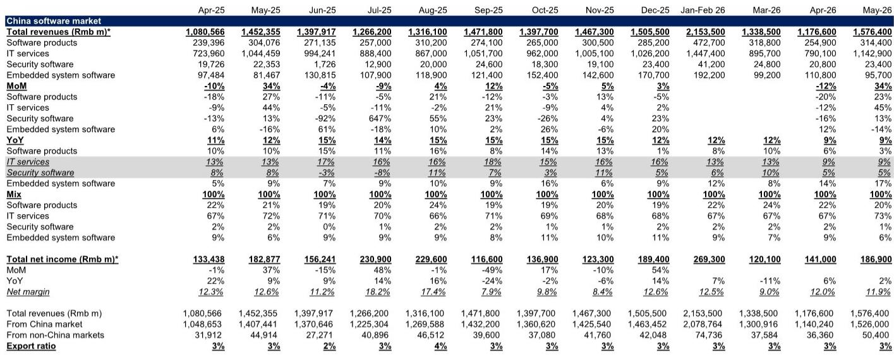
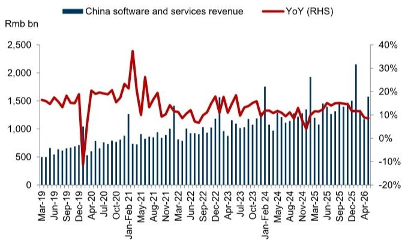

# GS：中国软件行业5月收入增速调整，GS关注AI产品与中小企业PMI

中国软件行业5月收入增速仍在调整至8.5%，低于4月的8.9%和去年同期的12.4%，前5个月累计增速10.3%也低于4月的10.9%。这个数字本身不算意外——季节性波动和中小企业PMI回落至48.2都在预期之内。真正值得关注的是GS在这份月度追踪报告中反复强调的一个结构性变化：企业的软件采购预算正在从传统IT服务向AI基础模型和定制化AI项目转移，而这一趋势对软件公司的收入确认节奏、利润结构和竞争格局都将产生深远影响。

## 1. 收入增速节奏变化背后是预算结构的重新分配，而非需求调整

5月软件行业收入1.58万亿元，环比增长34%有季节性因素，但同比增速持续走低才是关键。GS指出，当前软件支出仍然承压，因为一部分预算被分配到了AI基础模型和定制化AI项目上。这意味着，传统软件产品的采购周期在拉长，而AI相关的服务外包合同价值却在上升——5月服务外包执行金额同比增长14%，GS明确提到这得益于AI相关项目的增加。

> **KC评论：** 这不是软件行业“需要继续观察了”，而是钱流向了不同的地方。完整报告中的图表1和图表7展示了各细分领域的收入占比变化，IT服务仍占68%，但增速贡献最大的已经是云计算、大数据和AI相关服务。

## 2. 利润率的稳定掩盖了业务结构的分化

5月行业净利润率11.9%，与4月的12.0%基本持平，前5个月累计净利率11.5%还略高于前4个月的11.4%。表面上看，行业盈利水平没有出现变化。但GS的数据显示，软件产品收入同比仅增长3%，而IT服务收入增长9%，嵌入式系统软件增长17%。不同赛道的利润率差异很大——标准化软件产品利润率较高但增长停滞，定制化IT服务增长快但利润率被项目制拉低。这种分化意味着，整体利润率稳定可能是“高利润产品调整、低利润服务扩张”的均值回归结果。

## 3. AI代理正在从概念验证进入规模化部署，但报告尚未回答的问题是利润归属

GS明确提到了AI代理的两个落地场景：一是将资深员工的经验知识留在企业内部，二是通过更高效率实现生产基地的多样化。这些都不是实验室项目，而是企业级采购的真实需求。但这份报告没有完全展开的是：AI代理带来的增量收入，最终会归到软件公司、云服务商还是系统集成商？从当前IT服务占比持续上升来看，系统集成和定制化开发可能是最先受益的环节，而标准化AI产品的货币化仍需观察。

## 4. 观察框架：三个信号比月度增速更重要

与其盯着月度同比增速的波动，不如关注GS提出的三个先行指标：AI产品 momentum、中小企业PMI和公司招聘情况。中小企业PMI在6月降至48.2，连续两个月低于荣枯线，这对依赖中小企业客户的软件公司是直接不确定性。而AI产品 momentum 的跟踪则需要看具体公司的产品迭代速度——GS在报告中提到了商汤、美图等公司，但更广泛的行业信号是，能够将AI能力转化为可重复销售产品的公司，才有可能在下一轮支出周期中占据优势。

> **KC评论：** 报告图表6展示了利润率走势，但真正值得细看的是图表3的月度数据矩阵——它把收入、利润、出口占比和细分领域增速放在一起，比单一指标更能反映行业全貌。

软件行业的增长故事正在从“量”转向“质”。5月的数据只是这个转变过程中的一个截面，而GS这份报告的价值在于，它把月度数据放到了一个更长的结构变迁框架里来解读。对于产业决策者来说，核心问题不是下个月增速会不会反弹，而是你的产品形态和价值链位置，是否适应从“卖软件”到“卖AI服务”的迁移。

For informational purposes only. Portions may be generated,translated,summarized,or edited with AI assistance based on source materials and may contain omissions or errors. Please verify independently. This is not investment,legal,tax,accounting,or other professional advice.

For informational purposes only. Portions may be generated,translated,summarized,or edited with AI assistance based on source materials and may contain omissions or errors. Please verify independently. This is not investment,legal,tax,accounting,or other professional advice.

