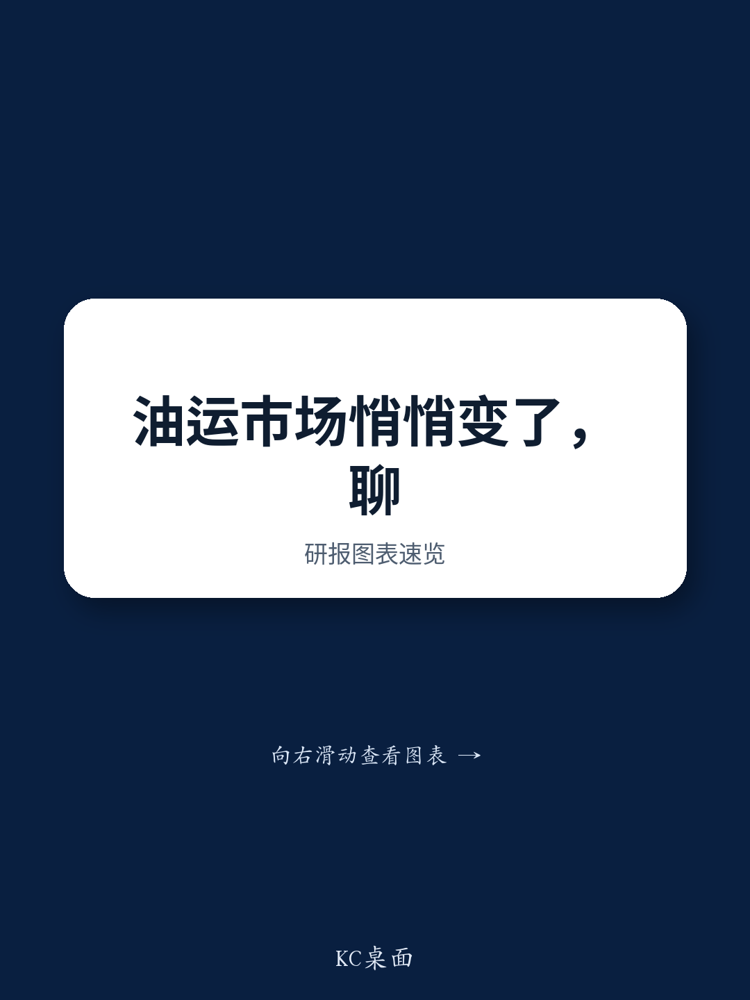

# 大型油轮市场正走向结构性趋紧，多数观察者对此估计不足

招商轮船近期公司日演示中传递的最重要信号，并非短期运价预测，而是其关于大型油轮供应将至少持续受限至2028年的判断，以及市场系统性地低估了可能推动运价远超当前共识的需求侧催化因素。管理层认为，在不考虑中国原油补库或伊朗制裁可能解除的情况下，行业平均大型油轮等价期租租金将在2026年第三季度达到每日15万美元，这一观点应促使市场重新审视本轮周期的演变路径。其含义清晰：油轮市场正进入一个供应侧约束极为严峻的阶段，即便是温和的需求意外，也将引发超比例的运价反应。

传统叙事聚焦于短期波动、中国补库缺位，以及地缘政治缓和可能通过将伊朗原油纳入受制裁航运而减少吨海里需求的风险。管理层的观点则颠覆了这一逻辑。他们认为，解除伊朗制裁对合规船队需求而言将是净利好，而非利空。这是一个反直觉但分析严谨的立场，值得仔细审视。在本轮周期中，是顺势而为还是措手不及，关键在于理解哪些需求风险真实存在，哪些只是幻象。

## 供应侧的结构性紧张程度远超订单簿数据所示

2026至2028年间将有200艘大型油轮交付的头条数据，给人未来供应充足的印象。管理层对此假设的修正至关重要。根据上一轮上升周期的经验，只有80%至90%的已订购船舶能按时交付。这立即将有效订单簿缩减至160至180艘之间。更重要的是，现有船队的船龄结构意味着，到2028年底，将有266艘船舶超过20年船龄。在老旧船舶面临日益严格的监管审查、更高的保险成本以及租家接受度下降的市场环境下，其中许多船舶将被拆解而非保留。其净效应是，即便有现有订单簿，船队增长也将受到严重限制，甚至可能为零或负增长。

这并非周期性收紧，而是结构性变化。订单簿的规模既不足以替换退役运力，也无法实现船队增长。市场正面临一个多年期阶段，其中年轻、高效、合规的大型油轮可用供应量将在相对意义上缩减。对于习惯于将航运视为供应最终会跟上的周期性行业的观察者而言，本轮周期有所不同。船龄老化、交付延迟以及环境法规的共同作用，意味着供应弹性处于过去二十年来的最低点。因此，每一个出现的需求催化剂都将对运价产生不成比例的巨大影响。

## 需求侧存在三个截然不同的催化剂，而非仅一个

管理层指出了三个常被混为一谈、但需在分析上加以区分的需求驱动因素。第一个是海湾国家通过霍尔木兹海峡的原油运输量持续攀升。这已在发生，也是管理层预计即便没有中国补库，第三季度运价也能达到每日15万美元底部的原因。这是市场本应已定价的基本情形，而运价从6月峰值回落的事实表明，市场并未完全认可这一动态。

第二个催化剂是中国原油补库。管理层认为，这最早可能于7月或8月开始，驱动因素包括成品油出口配额的逐步恢复以及国有炼厂补充库存的需求。市场似乎持怀疑态度，因为补库迄今尚未出现，但这种怀疑忽略了政策周期的时机。中国出口配额通常分批发放，下半年历史上配额发放更为积极。如果补库如管理层预期在8月开始，其对第四季度大型油轮运价的影响将是显著的。美国战略石油储备也是一个因素，政府目标是每释放1桶原油至少补充1.2桶。这构成了一个独立于中国之外的原油需求来源，尚未被广泛认知。

第三个催化剂在结构上最为重要，也最易被误解。管理层认为，永久性解除对伊朗石油的制裁，将为合规船队的有效需求增加约5个百分点。这正是反直觉之处。多数市场参与者认为，将伊朗原油纳入合法市场会因缩短航程距离或替代其他原油流向而减少吨海里需求。管理层的分析则指向相反方向。目前，伊朗原油主要由老旧、不合规的“影子船队”运输。若制裁解除，这部分运量将转移至已运力紧张的合规船队。净效应并非航运总需求减少，而是需求从不受监管的影子市场转移至供应远为紧张的受监管市场。这5个百分点的需求增长是结构性转变，而非暂时性现象。

## 市场为何低估上行情景

市场当前的怀疑态度可以理解，但在分析上并不完整。运价曾上涨而后回落。中国补库尚未实现。美伊谅解备忘录给制裁政策方向带来了不确定性。但管理层的论点是，这些因素正被孤立看待，而非作为累积需求图景的一部分。第三季度每日15万美元的基本情形已假设无中国补库、无制裁解除。若其中任一催化剂实现，运价将走高。若两者同时实现，上行空间将十分可观。

更重要的分析要点在于，供应侧提供了一个高于多数模型假设的底部。即便需求没有改善，供应约束也意味着运价无法跌至此前下行周期中的水平。老旧船队、交付延迟以及监管环境共同造就了一种局面：在现有需求水平下，市场在结构上供应不足。这并非预测需求将强劲，而是预测供应如此疲弱，以至于即便正常需求也会推高运价。

## 报告尚未完全解答的问题

报告留下了几个重要问题。最关键的是中国补库的时机和概率。管理层认为补库将于7月或8月开始，但这一判断基于政策预期而非可观测数据。市场需要看到实际进口量或配额公告后，才会对这一催化剂定价。补库存在被推迟至第四季度或2027年的真实风险，这将导致第三季度出现一段运价疲软期，可能考验管理层每日15万美元的底部判断。

第二个未解问题是海湾国家运输量增长的可持续性。管理层将当前运价支撑归因于通过霍尔木兹海峡的运输量增加，但尚不清楚这是可持续趋势，还是对地缘政治定位的临时反应。若这些运输量放缓，第三季度的基本情形将走弱。

第三个问题是老旧船舶的监管路径。管理层假设超过20年的船舶将被拆解或退出合规船队，但这取决于租家行为、保险市场状况以及潜在的监管豁免。若老旧船舶服役时间超出预期，供应约束将有所缓解。

这些悬而未决的问题造成了分析上的张力。看涨情形依赖于多个催化剂在2026年下半年汇聚。若其中任何一个未能实现，运价结果将仅是良好而非卓越。但结构性供应论点独立成立。即便在中国补库延迟、伊朗制裁未解除的下行情景中，市场到2028年仍将供应不足。问题不在于运价是否会走高，而在于会走高多少。

## 本轮周期的定位决策框架

对于试图将上述分析转化为决策框架的观察者而言，三种情景值得区分。第一种是基本情形，已具支撑性。供应受限，海湾运输量强劲，运价高于全行业盈亏平衡点。在此情景下，大型油轮船东产生稳健现金流，但上行空间因缺乏额外需求催化剂而受限。这是已被部分定价的情景。

第二种是看涨情景，即中国补库于第三季度开始。这将推动运价超过每日15万美元，并可能使高运价持续至第四季度乃至2027年。需关注的关键信号是中国原油进口数据及成品油出口配额公告。若这些信号出现，航运相关公司的价值重估可能十分显著。

第三种是结构性牛市情景，即中国补库与伊朗制裁解除同时发生。在此情景下，影子船队向合规船队的5个百分点需求转移，与补库需求相结合，将创造一个运价水平超越历史常态的多年期。这一情景尚未被定价，需要对整个油轮板块进行根本性重新评估。

决策框架应聚焦于结果的不对称性。下行空间受供应底部限制。若任一需求催化剂实现，上行空间则十分可观。这是一个有利于为上行做准备的收益风险特征，但需理解时机存在不确定性。报告指出，2026年下半年是值得关注的窗口期，且市场目前低估了积极催化剂出现的概率。

加入社区阅读完整报告并查看原始图表。关于船龄老化、交付延迟及需求情景的数据，均附有详细分析支持，无法在摘要中完整呈现。理解全貌需要审视论点背后的数字。

*仅供参考。部分内容可能基于源材料通过人工智能辅助生成、翻译、摘要或编辑，可能存在遗漏或错误。请独立核实。本文不构成专业建议。*

仅供参考。部分内容可能基于源材料通过人工智能辅助生成、翻译、摘要或编辑，可能存在遗漏或错误。请独立核实。本文不构成专业建议。

