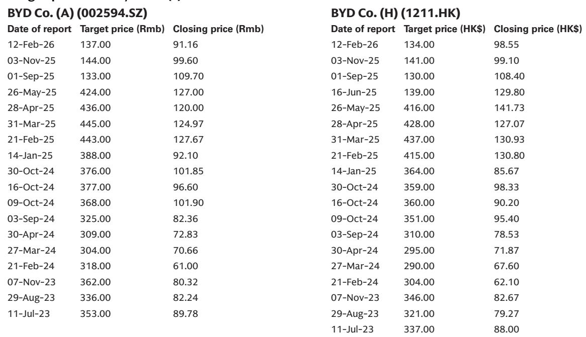
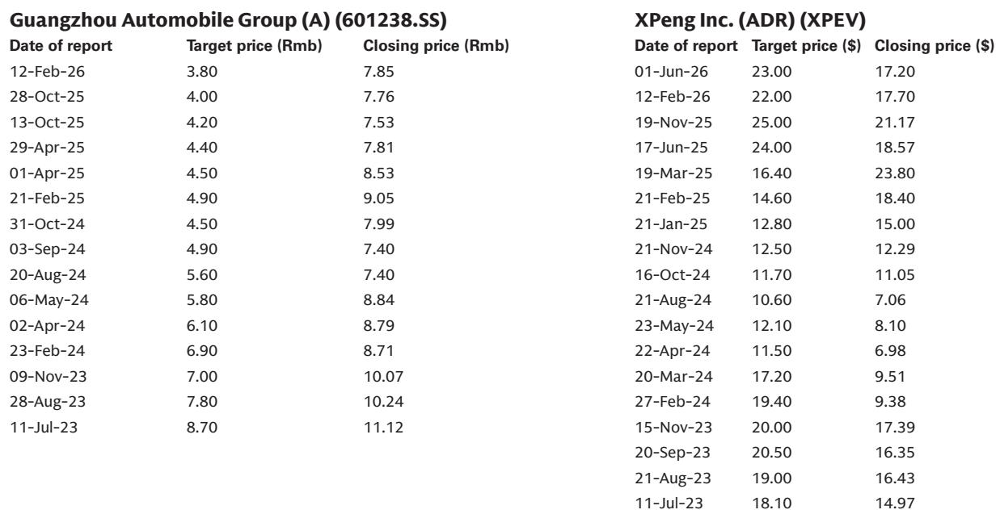
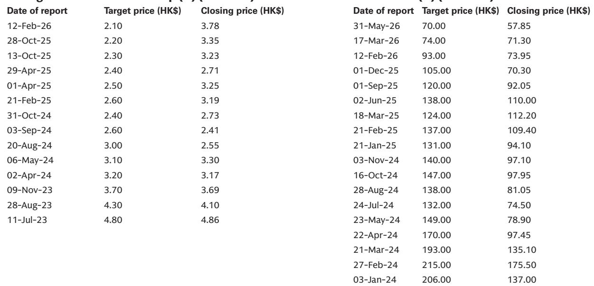

# GS：不是政策驱动，GS拆解中国车市9月改善的真实逻辑

2026年上半年，中国乘用车零售市场同比下滑约20%，比年初多数车企的预期更差。但GS在7月初举办的亚洲出行科技系列交流会上，与九家车企管理层沟通后，得出一个值得关注的判断：行业景气度可能在9月前后出现改善，利润率低点大概率落在二季度，随后逐季回升。

这不是盲目乐观，而是基于对库存周期、新车投放节奏和海外市场对冲能力的综合观察。报告的核心信号是：上半年最差的数字可能已经过去，但真正的分化才刚刚开始。

> **KC评论：** GS这份交流纪要的价值不在于给出一个“见底”的判断，而在于拆解了“为什么二季度是利润低点”——量价双杀（销量低、成本涨、汇率影响）同时出现，而三季度开始，规模恢复、海外占比提升、部分车型提价将同时起作用。建议读者重点看原文中各家公司的利润节奏拆解。

## 1. 行业转折点出现在9月，但驱动力不是政策而是库存

多数参会公司认为，国内乘用车零售的同比降幅将从9月开始收窄，年底有望转正。这个判断的支撑点并非新的刺激政策，而是经销商库存不确定性的自然消化与新车上市周期的叠加。

上半年销量低于预期的一个重要原因是，经销商库存水平偏高，导致终端打折力度加大、盈利出现变化。随着库存逐步回归正常，以及下半年多款重点新车（如奇瑞的Luxeed EHX、长城的H10 PHEV、零跑的D99等）集中上市，终端客流和成交转化有望改善。

但GS也提示，这一改善更多是季节性修复，而非需求端的结构性反转。

## 2. 二季度利润率见底，但不同公司的修复路径差异显著

报告中最一致的观点是：二季度是多数公司的利润率低点。原因有三：销量规模不足、原材料成本上涨、汇率逆风。但三季度开始，情况将逐季好转。

好转的驱动力因公司而异。零跑和岚图依赖销量规模回升，福耀和涛涛依靠提价，奇瑞则受益于海外销售占比持续提升（海外毛利率通常超过20%）。比亚迪则通过垂直一体化降低成本，并在“反内卷”背景下优先发展高质量业务，而非单纯追求销量。

> **KC评论：** GS这份报告最有信息量的部分，其实是各家公司对“利润率修复的驱动力”的拆解。比如奇瑞的海外单台利润达到1万-1.1万元，而长城在巴西等地的本地化生产相比整车进口每台可节省数千元。这些细节才是判断哪些公司能在下半年真正跑出来的关键。

## 3. 欧洲是海外扩张的焦点，但本地化生产的挑战仍未完全解决

所有参会OEM都强调海外扩张，欧洲是共同的重点。奇瑞、零跑、岚图都在规划欧洲本地生产或合资布局。但挑战也很明确：PHEV可能面临额外关税，欧洲《工业加速法案》也可能提高准入门槛。

长城给出了一个具体数据：在巴西本地化生产相比整车进口，考虑运费和关税后，每台车可节省数千元成本。但零跑和岚图仍在探索合资模式，本地化生产的成本控制能力仍有待验证。

报告尚未完全回答的问题是：当欧洲关税和本地化成本同时上升，中国车企的海外利润率还能维持当前水平吗？奇瑞的20%+海外毛利率，在本地化生产后还能守住吗？

## 4. 研发投入向智能化集中，资本开支进入收敛期

大多数公司表示将控制资本开支节奏，但同时增加研发投入，方向集中在自动驾驶能力建设上——VLA模型、世界模型、端到端城市NOA。长城明确表示，研发资本化率将维持在50%-60%，重点投向智能化。

这意味着，行业竞争正在从“卷价格、卷配置”转向“卷智能化能力”。研发投入的转化效率，将是下一阶段区分车企竞争力的核心指标。

GS这份报告给读者的观察框架是：关注二季度财报中利润率是否真如预期触底，关注9月行业销量同比降幅是否收窄，关注海外本地化生产对利润率的实际影响。这三个变量，将决定下半年谁能真正跑赢行业。

For informational purposes only. Portions may be generated,translated,summarized,or edited with AI assistance based on source materials and may contain omissions or errors. Please verify independently. This is not investment,legal,tax,accounting,or other professional advice.

For informational purposes only. Portions may be generated,translated,summarized,or edited with AI assistance based on source materials and may contain omissions or errors. Please verify independently. This is not investment,legal,tax,accounting,or other professional advice.

