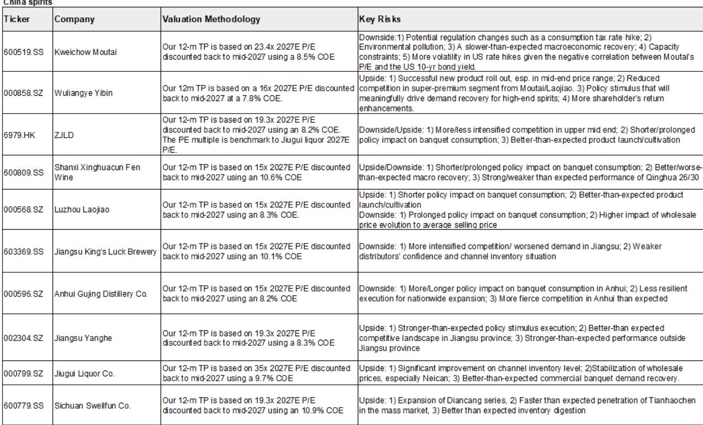
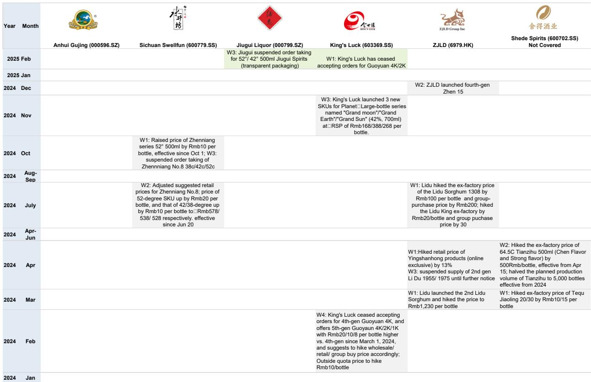
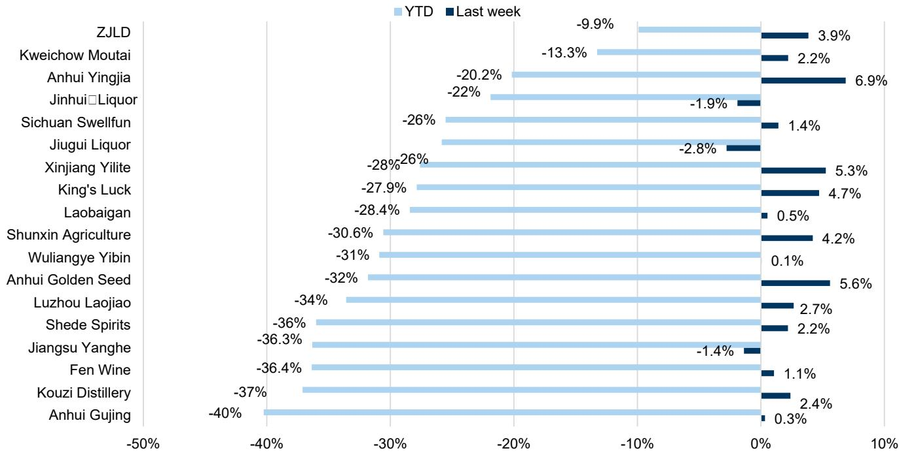

# GS：GS追踪618后白酒动销，价格纪律成行业新共识

白酒行业正处于一个值得关注的阶段。GS在最新发布的行业跟踪报告中给出一个清晰判断：头部酒企在近期股东大会上传递的核心信号，不再是追求出货量增长，而是全力维护价格纪律与渠道健康。这意味着，整个行业正从“渠道驱动”的增长模式，转向“消费者驱动”的高质量增长。库存调整仍需时间，但战略重心的转移已经明确。

这份报告跟踪了6-7月间多家头部酒企的股东大会，覆盖了从飞天茅台批发价波动到区域酒企省外扩张节奏的多个维度。以下三个层面值得产业决策者重点关注。

## 1. 全国性品牌的核心动作：聚焦核心大单品，简化产品矩阵

GS指出，全国性品牌正在集中资源于核心SKU，同时精简产品组合。汾酒继续优先发展青花系列，并将老白汾作为下一个百亿单品培育。泸州老窖的核心任务是维护国窖1573的价格体系，并试图向50岁以上消费群体渗透以实现高端化。五粮液则在强化普五的同时，看到1618和39度产品在宴席场景的更好增长。

这些动作的共同指向是：行业龙头不再相信铺货能带来增长，转而相信价格与品牌价值才是护城河。

## 2. 区域龙头的两难：守土与扩张的平衡术

对于区域酒企，GS的观察更具张力。洋河股份正优先进行组织架构调整与成本优化，同时减少库存、提升渠道质量，在省外扩张上采取更精准的策略。古井贡酒自2026年一季度基本完成库存调整，坚持古20高端化战略，并试图将安徽市场的成功复制到河南与山东。

> **KC评论：** 这里的关键判断不是“区域龙头在扩张”，而是扩张节奏可能比市场预期更慢。GS明确提示，在行业性库存调整背景下，超级高端品牌（如茅台系列酒）在次高端市场的策略，以及本地品牌在宏观环境周期中的应对，都会影响区域酒企的省外拓展速度。

但报告没有完全回答的问题是：当茅台王子酒也定下百亿销售目标时，次高端市场的竞争格局将如何变化？区域酒企的差异化空间还能维持多久？

## 3. 飞天茅台批发价透露的信号：原箱坚挺，散瓶松动，非标承压

GS的价格追踪数据显示，过去一周原箱飞天茅台批发价小幅上涨5元至1650元/瓶，但散瓶下跌10元至1620元/瓶。精品茅台、茅台15年、茅台1L等非标SKU分别下跌15至50元/瓶。普五和国窖1573则基本持平。

这个分化值得留意。原箱价格坚挺说明核心渠道对整箱货仍有信心，散瓶松动则暗示终端需求没有同步走强。非标SKU的普遍下跌，可能反映的是GS此前报告提到的“茅台在i茅台平台上线飞天后，非标产品的稀缺性被重新定价”。

> **KC评论：** 市场往往只盯着飞天茅台的相对价格，但GS这份报告隐含的追问是：当原箱与散瓶价差再次拉大，是否意味着渠道库存的不确定性正在从显性转向隐性？这个问题，需要结合后续中秋国庆的动销数据才能回答。

对于白酒行业的观察者而言，GS这份报告提供了一个更精细的框架：不再只看批价涨跌，而是要区分“原箱 vs 散瓶”“标准品 vs 非标”“全国品牌 vs 区域品牌”三个维度。真正的竞争，已经不再是谁能卖更多，而是谁能在价格稳定中重建品牌势能。

For informational purposes only. Portions may be generated,translated,summarized,or edited with AI assistance based on source materials and may contain omissions or errors. Please verify independently. This is not investment,legal,tax,accounting,or other professional advice.

For informational purposes only. Portions may be generated,translated,summarized,or edited with AI assistance based on source materials and may contain omissions or errors. Please verify independently. This is not investment,legal,tax,accounting,or other professional advice.

