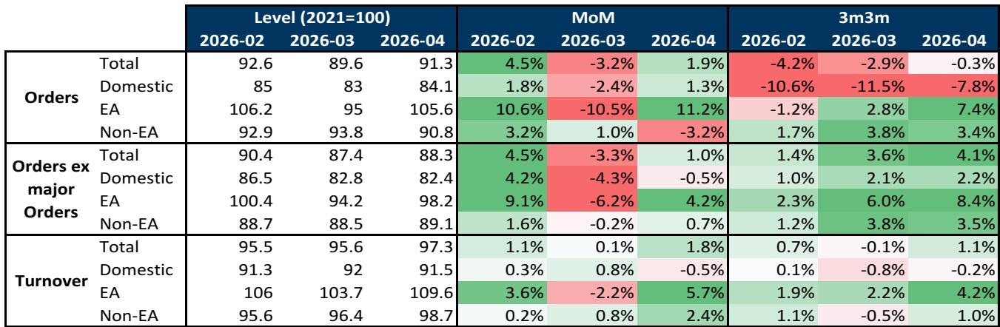

# 德国工业回暖信号显现，但出口与内需分化值得关注

关于德国制造业陷入结构性衰退的说法可能为时过早。5月工厂订单和工业营业额数据带来明显正面信号，订单环比增长1.9%，高于市场预期的1.1%。这并非偶然波动，而是表明工业部门已找到底部并开始回升，背后有特定需求来源支撑。对于关注欧洲经济复苏的研究者而言，这是首个挑战围绕德国工业核心悲观情绪的实际数据点。

然而，整体强势掩盖了一个更复杂且具有战略意义的故事。复苏并非全面展开，而是严重偏向出口市场，尤其是欧元区，而内需依然明显疲软。三个月移动平均的总订单指标仍下降0.3%。剔除大型订单——这类大额项目会扭曲月度读数——潜在趋势更为稳固，三个月移动平均订单增长4.1%。但即使这种强势也集中在服务外部客户的行业，而非德国消费者或国内资本开支周期。

这一数据出现在关键转折点。欧元区一直在探讨其复苏是自我维持还是仅从低谷反弹。作为该地区最大经济体，德国掌握着答案。如果其工业复苏纯粹由出口驱动并依赖其他欧元区经济体的外部需求，那么复苏仍然脆弱，易受全球贸易放缓影响。如果内需开始跟上，周期将变得更加持久。5月数据表明我们仍处于第一种情况，这对资产配置、汇率预测和行业轮动策略有直接影响。

## 欧元区引擎运转强劲，但内需停滞

5月数据中最显著的模式是国外订单与国内订单的分化。来自欧元区客户的订单环比激增11.2%，远超4月10.5%的降幅。三个月移动平均基础上，欧元区订单现增长7.4%。这是真正的加速，表明由服务业和西班牙、法国等国家更具韧性的消费者推动的欧元区复苏，正开始拉动德国工业生产。德国制造业正扮演着为复苏中的欧洲经济提供供应的角色，而非引领复苏。

国内订单则呈现不同景象。5月环比仅增长1.3%，但三个月移动平均基础上下降7.8%。剔除大型订单后，国内订单环比下降0.5%，三个月移动平均仅增长2.2%。这不是复苏，而是在低位的稳定。内需疲软是结构性的，而非周期性的。它反映了高能源成本、企业资本开支谨慎以及消费者因储蓄率上升和财政政策不确定性而受限的持续影响。

对观察者而言，启示是明确的。任何关于德国工业广泛复苏的预期都必须考虑内需可能持续拖累的风险。高度依赖德国国内资本开支的行业——建筑、本地用机械、耐用消费品——可能落后于服务欧元区出口市场的行业。这种分化并非暂时现象，而是本轮周期的核心特征。

## 行业层面数据揭示双速工业经济

总体数字有用，但行业细分才是战略洞察所在。5月订单数据显示，反弹由少数行业驱动，而其他行业继续恶化。其他运输设备（包括飞机和主要国防用品）环比飙升85.0%。这是一个波动较大的类别，受大型政府合同影响显著，不应外推为趋势。电气设备和机械设备各增长3.7%，从4月疲软数据中反弹。这些令人鼓舞，但只是从低谷回升，并非新上升趋势的信号。

关键负面信号来自车辆制造业，订单环比继续下降3.8%。该行业几十年来一直是德国工业健康的风向标，目前仍在收缩。汽车行业面临一系列独特挑战：向电动汽车转型、来自中国制造商的竞争以及与美国和中国贸易政策的不确定性。即使在整体工业状况改善的情况下订单仍在下降，表明汽车行业的问题是结构性的，而非周期性的。

营业额方面，情况稍广但仍集中。基础金属增长7.1%，计算机和电子产品增长4.6%，化学品增长3.6%至2022年以来最高水平。机动车行业营业额也增长3.1%，这是积极信号，但值得注意的是营业额是订单的滞后指标。汽车行业订单与营业额的分化——订单下降、营业额上升——表明汽车制造商仍在消化现有积压订单，而非看到新需求的真正回升。

扩散指数证实了这一模式。5月，66%的行业（按权重计算）营业额环比增长，三个月移动平均比例相同。这是相对广泛的扩张，但并非普遍。三分之一的行业仍在收缩。在健康、自我维持的复苏中，这一比例应低得多。当前配置更符合出口导向行业的周期性反弹，而非广泛的工业复兴。

## 数据留下未解问题：这是复苏还是二次探底前的暂停？

尽管5月有诸多积极信号，报告仍留下一个关键问题未解决。改善集中在本质上波动较大（国防、飞机）或依赖外部需求（机械、化学品）的行业。国内订单趋势仍为负值。汽车行业——德国最大的单一工业雇主——仍在衰退。数据尚无法回答的问题是，出口驱动的势头最终是否会拉动内需，还是内需疲软最终会拖累出口部门。

这不是一个学术问题。它对未来六到十二个月的定位有直接影响。如果复苏扩大，那么德国工业相关资产、欧元和德国国债回报表现都应走高。如果复苏仍狭窄且依赖外部需求，那么任何全球贸易冲击——无论是关税、中国放缓还是欧元区服务业走弱——都可能逆转收益。

报告指出一个可能打破僵局的潜在催化剂：国防部门。使用其他运输设备和武器弹药的加权平均值作为国防需求代理指标，六个月移动平均基础上呈现明显上升趋势。随着欧洲各国政府因安全环境变化而增加国防开支，这一趋势可能加速。与国防相关的工业生产是一个可能抵消其他行业疲软的内需驱动因素。但它尚未大到足以影响总体数字，且高度依赖难以预测的政治决策。

观察者应密切关注未来两三个月的国内订单趋势。如果三个月移动平均的国内订单开始转正，将是复苏扩大的信号。如果仍为负值，当前出口驱动的反弹可能被证明是二次探底前的暂停。

## 围绕德国工业数据的定位决策框架

5月数据提供了关于德国经济状况的清晰但不完整的图景。对于决策者而言，关键是将这些信号转化为可指导组合配置、汇率对冲和行业选择的框架。以下方法基于数据中可见的模式及其留下的问题。

首先，将总体订单数字视为情绪的滞后指标，而非增长的领先指标。1.9%的环比超预期很重要，但由波动较大的类别驱动。更可靠的信号是三个月移动平均指标，总订单仍为负值，仅剔除大型订单后温和为正。趋势在改善，但尚未强劲。

其次，区分受益于欧元区需求的行业和依赖德国国内消费的行业。数据清楚显示欧元区是引擎。机械、电气设备和化学品等对欧洲其他地区出口敞口较大的行业可能继续表现较好。建筑、零售和耐用消费品等与德国国内周期相关的行业，在国内订单出现持续改善前应保持谨慎。

第三，将国防部门作为独立于整体周期的潜在结构性增长故事进行监测。数据中的国防代理指标正在上升，政治推动力强劲。无论整体工业经济如何，该行业都可能产生持续的需求增长。任何对德国工业资产有敞口的组合都应对其进行专门配置。

第四，利用汇率定位对冲复苏仍狭窄的风险。如果出口驱动复苏持续但内需未跟上，欧元可能保持区间波动甚至走弱，因为欧洲央行在面对疲弱内需时不愿收紧政策。基于德国广泛复苏做多欧元为时过早。更谨慎的做法是等待内需转好的确认后再增加欧元敞口。

最后，为数据可能预示虚假曙光做好准备。德国此前曾出现过强劲出口驱动反弹后内需停滞的模式。2023年的复苏正是遵循这一模式。关键风险在于当前改善只是对4月疲软的回补，而非新周期的开始。未来两个月的数据将具有决定性。如果趋势持续，复苏是真实的。如果逆转，悲观情绪将迅速回归。

## 完整报告包含使这些模式可见的图表

以上分析基于5月报告的核心数据点，但完整文件包含七个图表，为这里的每一项主张提供视觉证据。按目的地划分的订单图表、行业细分、营业额趋势、扩散指数和国防部门代理指标，对于任何试图理解动态的认真研究者都是必不可少的。原始数字讲述了部分故事，但图表揭示了趋势、转折点和在环比变化表格中不可见的分化。

加入社区阅读完整报告并查看原始图表。

*仅供参考。部分内容可能基于源材料通过AI辅助生成、翻译、总结或编辑，可能存在遗漏或错误。请独立核实。这不构成专业建议。*

仅供参考。部分内容可能基于源材料通过AI辅助生成、翻译、总结或编辑，可能存在遗漏或错误。请独立核实。这不构成专业建议。

